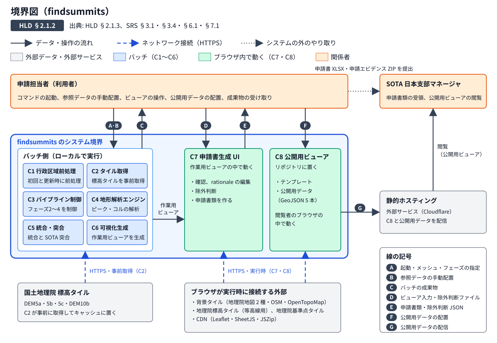
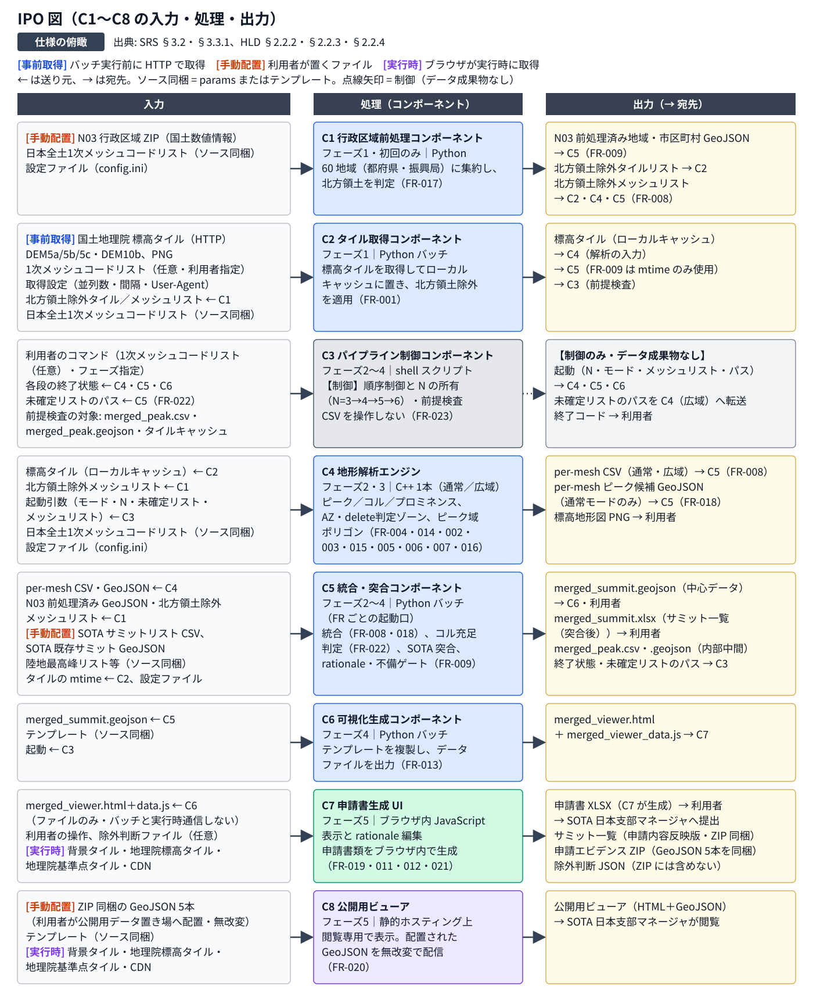
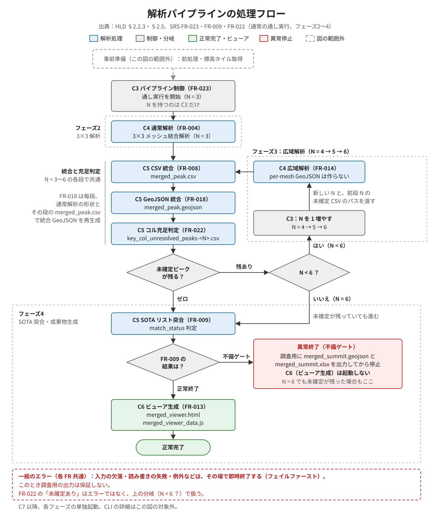
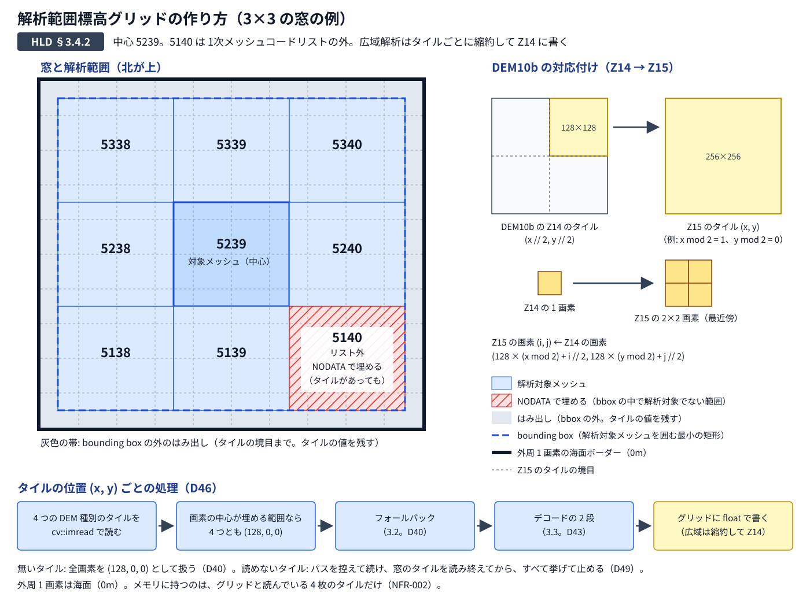
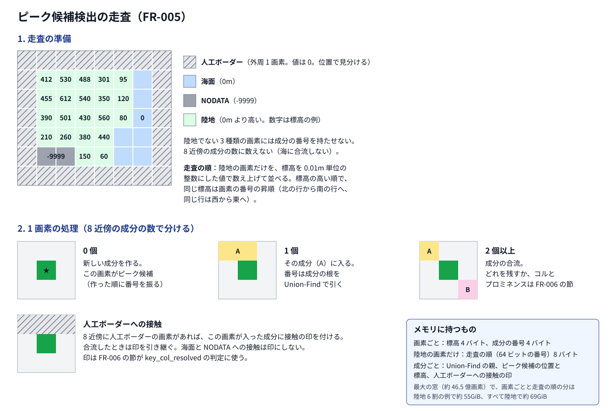
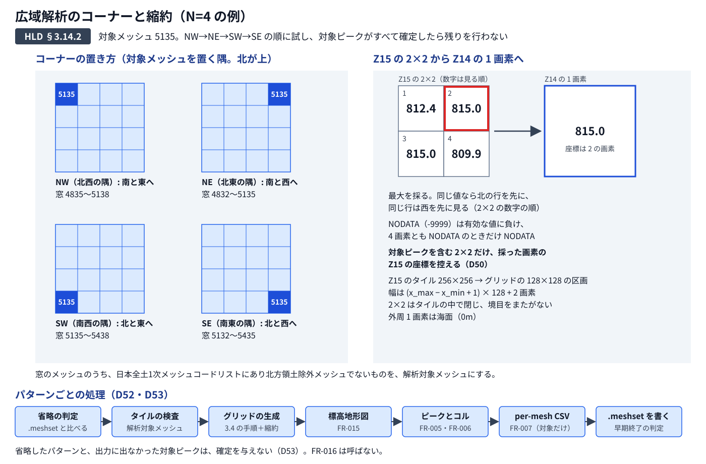
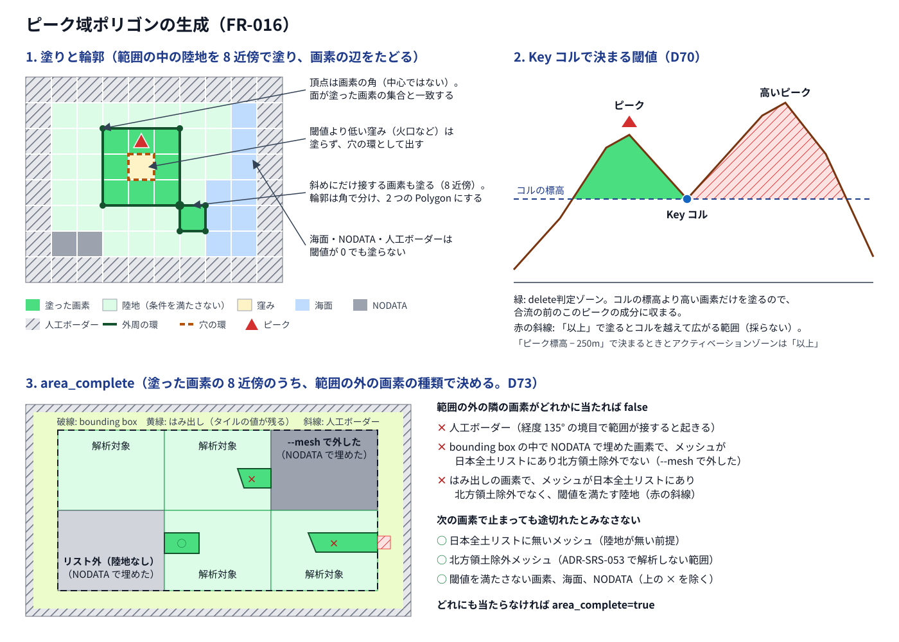

# findsummits - 概要設計書 (HLD)

| 項目 | 内容 |
|---|---|
| 作成日 | 2026-09-28 |
| 最終更新日 | 2026-10-10 |
| ステータス | ドラフト |
| 参照 SRS | [`20_SRS.md`](20_SRS.md) |

---

**読み方**: 誰がどの関心事でどの節を読めばよいかは [2.11](#211-ステークホルダー関心事ビュー) の表にある。全体を把握するには [2.1](#21-システムコンテキスト) と [2.2](#22-主要コンポーネント構成) を読む。担当するコンポーネントが決まっていれば、[3. プログラム構造](#3-プログラム構造) にその節（プログラム・関数・結合のつなぎ目）があればそこから、無ければ [2.2.4](#224-srs-の-frnfr-との対応) の対応表から、処理の正本である [4. FR 設計](#4-fr-設計) の節へ進む。結合テスト（IT）を設計するときは第 3 章の各節の「結合のつなぎ目」から入る。設定・引数・終了コード・やり直しの共通の決まりは [2.3](#23-設定の受け渡し)〜[2.5](#25-エラー処理終了コード)・[2.10](#210-フェーズ分割)。記号（C・K・D）の意味は [2.2.1](#221-目的と範囲) の「表記」と早見表、設計判断（D）の索引は [付録 A](#付録-a-設計判断の一覧)。

## 目次

- [1. 用語定義](#1-用語定義)
- [2. アーキテクチャ・横断規約](#2-アーキテクチャ横断規約)
  - [2.1 システムコンテキスト](#21-システムコンテキスト)
    - [2.1.1 目的と範囲](#211-目的と範囲)
    - [2.1.2 境界図](#212-境界図)
    - [2.1.3 外部要素と接続](#213-外部要素と接続)
  - [2.2 主要コンポーネント構成](#22-主要コンポーネント構成)
    - [2.2.1 目的と範囲](#221-目的と範囲)
    - [2.2.2 コンポーネント一覧と責務](#222-コンポーネント一覧と責務)
    - [2.2.3 コンポーネント間のデータの流れとインターフェース](#223-コンポーネント間のデータの流れとインターフェース)
    - [2.2.4 SRS の FR/NFR との対応](#224-srs-の-frnfr-との対応)
    - [2.2.5 設計判断（決めたこと・理由・却下した案）](#225-設計判断決めたこと理由却下した案)
    - [2.2.6 未決事項と後続（他の節・LLD・ADR 候補）](#226-未決事項と後続他の節lldadr-候補)
  - [2.3 設定の受け渡し](#23-設定の受け渡し)
    - [2.3.1 受け渡す値の種類](#231-受け渡す値の種類)
    - [2.3.2 設定ファイル](#232-設定ファイル)
    - [2.3.3 検証と記録](#233-検証と記録)
    - [2.3.4 設計判断](#234-設計判断)
  - [2.4 CLI 引数とメッシュ範囲の指定](#24-cli-引数とメッシュ範囲の指定)
    - [2.4.1 コマンドの区分](#241-コマンドの区分)
    - [2.4.2 共通の書式](#242-共通の書式)
    - [2.4.3 メッシュ範囲](#243-メッシュ範囲)
    - [2.4.4 フェーズ指定](#244-フェーズ指定)
    - [2.4.5 内部引数](#245-内部引数)
  - [2.5 エラー処理・終了コード](#25-エラー処理終了コード)
    - [2.5.1 終了コード](#251-終了コード)
    - [2.5.2 パイプライン制御での扱い](#252-パイプライン制御での扱い)
    - [2.5.3 利用者向けのメッセージ](#253-利用者向けのメッセージ)
    - [2.5.5 書き込みの失敗](#255-書き込みの失敗)
  - [2.6 技術基盤](#26-技術基盤)
    - [2.6.1 目的と範囲](#261-目的と範囲)
    - [2.6.2 コンポーネント別の言語と処理系](#262-コンポーネント別の言語と処理系)
    - [2.6.3 ライブラリと使う範囲](#263-ライブラリと使う範囲)
    - [2.6.4 ディレクトリ構成](#264-ディレクトリ構成)
    - [2.6.5 ビルド構成](#265-ビルド構成)
    - [2.6.6 設計判断](#266-設計判断)
    - [2.6.7 未決事項と後続](#267-未決事項と後続)
  - [2.9 並行性・スレッド設計](#29-並行性スレッド設計)
    - [2.9.1 目的と範囲](#291-目的と範囲)
    - [2.9.2 C4 と OpenCV のスレッド](#292-c4-と-opencv-のスレッド)
    - [2.9.3 同時起動の排他](#293-同時起動の排他)
    - [2.9.4 設計判断](#294-設計判断)
    - [2.9.5 未決事項と後続](#295-未決事項と後続)
  - [2.10 フェーズ分割](#210-フェーズ分割)
    - [2.10.1 目的と範囲](#2101-目的と範囲)
    - [2.10.2 フェーズと実行単位](#2102-フェーズと実行単位)
    - [2.10.3 フェーズのやり直し](#2103-フェーズのやり直し)
    - [2.10.4 設計判断](#2104-設計判断)
    - [2.10.5 未決事項と後続](#2105-未決事項と後続)
  - [2.11 ステークホルダー・関心事・ビュー](#211-ステークホルダー関心事ビュー)
    - [2.11.1 目的と範囲](#2111-目的と範囲)
    - [2.11.2 ステークホルダーと関心事](#2112-ステークホルダーと関心事)
    - [2.11.3 ビューポイントとビュー](#2113-ビューポイントとビュー)
    - [2.11.4 未決事項と後続](#2114-未決事項と後続)
- [3. プログラム構造](#3-プログラム構造)
  - [3.1 C1 行政区域前処理](#31-c1-行政区域前処理)
    - [3.1.1 プログラム](#311-プログラム)
    - [3.1.2 入力・処理・出力](#312-入力処理出力)
    - [3.1.3 関数](#313-関数)
    - [3.1.4 コンポーネント内の共通部品](#314-コンポーネント内の共通部品)
    - [3.1.5 結合のつなぎ目](#315-結合のつなぎ目)
  - [3.2 C2 タイル取得](#32-c2-タイル取得)
    - [3.2.1 プログラム](#321-プログラム)
    - [3.2.2 入力・処理・出力](#322-入力処理出力)
    - [3.2.3 関数](#323-関数)
    - [3.2.4 コンポーネント内の共通部品](#324-コンポーネント内の共通部品)
    - [3.2.5 結合のつなぎ目](#325-結合のつなぎ目)
  - [3.3 C3 パイプライン制御](#33-c3-パイプライン制御)
    - [3.3.1 プログラム](#331-プログラム)
    - [3.3.2 入力・処理・出力](#332-入力処理出力)
    - [3.3.3 関数](#333-関数)
    - [3.3.4 コンポーネント内の共通部品](#334-コンポーネント内の共通部品)
    - [3.3.5 結合のつなぎ目](#335-結合のつなぎ目)
  - [3.4 C4 地形解析エンジン](#34-c4-地形解析エンジン)
    - [3.4.1 プログラム](#341-プログラム)
    - [3.4.2 入力・処理・出力](#342-入力処理出力)
    - [3.4.3 関数](#343-関数)
    - [3.4.4 コンポーネント内の共通部品](#344-コンポーネント内の共通部品)
    - [3.4.5 結合のつなぎ目](#345-結合のつなぎ目)
  - [3.5 C5 統合・突合](#35-c5-統合突合)
    - [3.5.1 プログラム](#351-プログラム)
    - [3.5.2 入力・処理・出力](#352-入力処理出力)
    - [3.5.3 関数](#353-関数)
    - [3.5.4 コンポーネント内の共通部品](#354-コンポーネント内の共通部品)
    - [3.5.5 結合のつなぎ目](#355-結合のつなぎ目)
  - [3.6 C6 可視化生成](#36-c6-可視化生成)
    - [3.6.1 プログラム](#361-プログラム)
    - [3.6.2 入力・処理・出力](#362-入力処理出力)
    - [3.6.3 関数](#363-関数)
    - [3.6.4 コンポーネント内の共通部品](#364-コンポーネント内の共通部品)
    - [3.6.5 結合のつなぎ目](#365-結合のつなぎ目)
  - [3.7 C7 申請書生成 UI](#37-c7-申請書生成-ui)
    - [3.7.1 プログラム](#371-プログラム)
    - [3.7.2 入力・処理・出力](#372-入力処理出力)
    - [3.7.3 関数](#373-関数)
    - [3.7.4 コンポーネント内の共通部品](#374-コンポーネント内の共通部品)
    - [3.7.5 結合のつなぎ目](#375-結合のつなぎ目)
  - [3.8 C8 公開用ビューア](#38-c8-公開用ビューア)
    - [3.8.1 プログラム](#381-プログラム)
    - [3.8.2 入力・処理・出力](#382-入力処理出力)
    - [3.8.3 関数](#383-関数)
    - [3.8.4 コンポーネント内の共通部品](#384-コンポーネント内の共通部品)
    - [3.8.5 結合のつなぎ目](#385-結合のつなぎ目)
  - [3.9 共通部品](#39-共通部品)
- [4. FR 設計](#4-fr-設計)
  - [4.1 FR-001 標高タイル事前取得](#41-fr-001-標高タイル事前取得)
    - [4.1.1 目的と範囲](#411-目的と範囲)
    - [4.1.2 処理の流れ](#412-処理の流れ)
    - [4.1.3 異常系](#413-異常系)
    - [4.1.4 設計判断](#414-設計判断)
    - [4.1.5 未決事項と後続](#415-未決事項と後続)
  - [4.2 FR-002 DEM 階層フォールバック](#42-fr-002-dem-階層フォールバック)
    - [4.2.1 目的と範囲](#421-目的と範囲)
    - [4.2.2 処理の流れ](#422-処理の流れ)
    - [4.2.3 異常系](#423-異常系)
    - [4.2.4 設計判断](#424-設計判断)
    - [4.2.5 未決事項と後続](#425-未決事項と後続)
  - [4.3 FR-003 標高デコード・NODATA 処理](#43-fr-003-標高デコードnodata-処理)
    - [4.3.1 目的と範囲](#431-目的と範囲)
    - [4.3.2 処理の流れ](#432-処理の流れ)
    - [4.3.3 異常系](#433-異常系)
    - [4.3.4 設計判断](#434-設計判断)
    - [4.3.5 未決事項と後続](#435-未決事項と後続)
  - [4.4 FR-004 3×3メッシュ結合解析オーケストレーション](#44-fr-004-33メッシュ結合解析オーケストレーション)
    - [4.4.1 目的と範囲](#441-目的と範囲)
    - [4.4.2 処理の流れ](#442-処理の流れ)
    - [4.4.3 異常系](#443-異常系)
    - [4.4.4 設計判断](#444-設計判断)
    - [4.4.5 未決事項と後続](#445-未決事項と後続)
  - [4.5 FR-005 ピーク候補検出](#45-fr-005-ピーク候補検出)
    - [4.5.1 目的と範囲](#451-目的と範囲)
    - [4.5.2 処理の流れ](#452-処理の流れ)
    - [4.5.3 異常系](#453-異常系)
    - [4.5.4 設計判断](#454-設計判断)
    - [4.5.5 未決事項と後続](#455-未決事項と後続)
  - [4.6 FR-006 コル検出・プロミネンス計算](#46-fr-006-コル検出プロミネンス計算)
    - [4.6.1 目的と範囲](#461-目的と範囲)
    - [4.6.2 処理の流れ](#462-処理の流れ)
    - [4.6.3 異常系](#463-異常系)
    - [4.6.4 設計判断](#464-設計判断)
    - [4.6.5 未決事項と後続](#465-未決事項と後続)
  - [4.7 FR-007 per-mesh CSV 出力（プロミネンス閾値適用）](#47-fr-007-per-mesh-csv-出力プロミネンス閾値適用)
    - [4.7.1 目的と範囲](#471-目的と範囲)
    - [4.7.2 処理の流れ](#472-処理の流れ)
    - [4.7.3 異常系](#473-異常系)
    - [4.7.4 設計判断](#474-設計判断)
    - [4.7.5 未決事項と後続](#475-未決事項と後続)
  - [4.8 FR-008 per-mesh CSV 統合](#48-fr-008-per-mesh-csv-統合)
    - [4.8.1 目的と範囲](#481-目的と範囲)
    - [4.8.2 処理の流れ](#482-処理の流れ)
    - [4.8.3 異常系](#483-異常系)
    - [4.8.4 設計判断](#484-設計判断)
    - [4.8.5 未決事項と後続](#485-未決事項と後続)
  - [4.9 FR-009 SOTAリスト突合・match_status 判定](#49-fr-009-sotaリスト突合match_status-判定)
    - [4.9.1 目的と範囲](#491-目的と範囲)
    - [4.9.2 処理の流れ](#492-処理の流れ)
    - [4.9.3 異常系](#493-異常系)
    - [4.9.4 設計判断](#494-設計判断)
    - [4.9.5 未決事項と後続](#495-未決事項と後続)
  - [4.11 FR-011 申請書 XLSX 生成](#411-fr-011-申請書-xlsx-生成)
    - [4.11.1 目的と範囲](#4111-目的と範囲)
    - [4.11.2 処理の流れ](#4112-処理の流れ)
    - [4.11.3 異常系](#4113-異常系)
    - [4.11.4 設計判断](#4114-設計判断)
    - [4.11.5 未決事項と後続](#4115-未決事項と後続)
  - [4.12 FR-012 サミット一覧（申請内容反映版）生成](#412-fr-012-サミット一覧申請内容反映版生成)
    - [4.12.1 目的と範囲](#4121-目的と範囲)
    - [4.12.2 処理の流れ](#4122-処理の流れ)
    - [4.12.3 異常系](#4123-異常系)
    - [4.12.4 設計判断](#4124-設計判断)
    - [4.12.5 未決事項と後続](#4125-未決事項と後続)
  - [4.13 FR-013 HTML ビューア生成](#413-fr-013-html-ビューア生成)
    - [4.13.1 目的と範囲](#4131-目的と範囲)
    - [4.13.2 処理の流れ](#4132-処理の流れ)
    - [4.13.3 異常系](#4133-異常系)
    - [4.13.4 設計判断](#4134-設計判断)
    - [4.13.5 未決事項と後続](#4135-未決事項と後続)
  - [4.14 FR-014 広域結合解析オーケストレーション](#414-fr-014-広域結合解析オーケストレーション)
    - [4.14.1 目的と範囲](#4141-目的と範囲)
    - [4.14.2 処理の流れ](#4142-処理の流れ)
    - [4.14.3 異常系](#4143-異常系)
    - [4.14.4 設計判断](#4144-設計判断)
    - [4.14.5 未決事項と後続](#4145-未決事項と後続)
  - [4.15 FR-015 標高地形図出力](#415-fr-015-標高地形図出力)
    - [4.15.1 目的と範囲](#4151-目的と範囲)
    - [4.15.2 処理の流れ](#4152-処理の流れ)
    - [4.15.3 異常系](#4153-異常系)
    - [4.15.4 設計判断](#4154-設計判断)
    - [4.15.5 未決事項と後続](#4155-未決事項と後続)
  - [4.16 FR-016 ピーク域ポリゴン生成](#416-fr-016-ピーク域ポリゴン生成)
    - [4.16.1 目的と範囲](#4161-目的と範囲)
    - [4.16.2 処理の流れ](#4162-処理の流れ)
    - [4.16.3 異常系](#4163-異常系)
    - [4.16.4 設計判断](#4164-設計判断)
    - [4.16.5 未決事項と後続](#4165-未決事項と後続)
  - [4.17 FR-017 N03 行政区域前処理（データ準備）](#417-fr-017-n03-行政区域前処理データ準備)
    - [4.17.1 目的と範囲](#4171-目的と範囲)
    - [4.17.2 処理の流れ](#4172-処理の流れ)
    - [4.17.3 異常系](#4173-異常系)
    - [4.17.4 設計判断](#4174-設計判断)
    - [4.17.5 未決事項と後続](#4175-未決事項と後続)
  - [4.18 FR-018 per-mesh ピーク候補 GeoJSON 統合](#418-fr-018-per-mesh-ピーク候補-geojson-統合)
    - [4.18.1 目的と範囲](#4181-目的と範囲)
    - [4.18.2 処理の流れ](#4182-処理の流れ)
    - [4.18.3 異常系](#4183-異常系)
    - [4.18.4 設計判断](#4184-設計判断)
    - [4.18.5 未決事項と後続](#4185-未決事項と後続)
  - [4.19 FR-019 HTML ビューア機能仕様](#419-fr-019-html-ビューア機能仕様)
    - [4.19.1 目的と範囲](#4191-目的と範囲)
    - [4.19.2 処理の流れ](#4192-処理の流れ)
    - [4.19.3 異常系](#4193-異常系)
    - [4.19.4 設計判断](#4194-設計判断)
    - [4.19.5 未決事項と後続](#4195-未決事項と後続)
  - [4.20 FR-020 公開用ビューア配信](#420-fr-020-公開用ビューア配信)
    - [4.20.1 目的と範囲](#4201-目的と範囲)
    - [4.20.2 処理の流れ](#4202-処理の流れ)
    - [4.20.3 異常系](#4203-異常系)
    - [4.20.4 設計判断](#4204-設計判断)
    - [4.20.5 未決事項と後続](#4205-未決事項と後続)
  - [4.21 FR-021 申請エビデンス ZIP 生成](#421-fr-021-申請エビデンス-zip-生成)
    - [4.21.1 目的と範囲](#4211-目的と範囲)
    - [4.21.2 処理の流れ](#4212-処理の流れ)
    - [4.21.3 異常系](#4213-異常系)
    - [4.21.4 設計判断](#4214-設計判断)
    - [4.21.5 未決事項と後続](#4215-未決事項と後続)
  - [4.22 FR-022 コル充足判定](#422-fr-022-コル充足判定)
    - [4.22.1 目的と範囲](#4221-目的と範囲)
    - [4.22.2 処理の流れ](#4222-処理の流れ)
    - [4.22.3 異常系](#4223-異常系)
    - [4.22.4 設計判断](#4224-設計判断)
    - [4.22.5 未決事項と後続](#4225-未決事項と後続)
  - [4.23 FR-023 解析パイプライン制御](#423-fr-023-解析パイプライン制御)
    - [4.23.1 目的と範囲](#4231-目的と範囲)
    - [4.23.2 処理の流れ](#4232-処理の流れ)
    - [4.23.3 異常系](#4233-異常系)
    - [4.23.4 設計判断](#4234-設計判断)
    - [4.23.5 未決事項と後続](#4235-未決事項と後続)
- [5. NFR 設計](#5-nfr-設計)
  - [5.1 NFR-001 精度・検出網羅性](#51-nfr-001-精度検出網羅性)
    - [5.1.1 目的と範囲](#511-目的と範囲)
    - [5.1.2 処理の流れ](#512-処理の流れ)
    - [5.1.3 異常系](#513-異常系)
    - [5.1.4 設計判断](#514-設計判断)
    - [5.1.5 未決事項と後続](#515-未決事項と後続)
  - [5.2 NFR-002 メモリ使用量](#52-nfr-002-メモリ使用量)
    - [5.2.1 目的と範囲](#521-目的と範囲)
    - [5.2.2 処理の流れ](#522-処理の流れ)
    - [5.2.3 異常系](#523-異常系)
    - [5.2.4 設計判断](#524-設計判断)
    - [5.2.5 未決事項と後続](#525-未決事項と後続)
  - [5.3 NFR-003 再現性（決定論的出力）](#53-nfr-003-再現性決定論的出力)
    - [5.3.1 目的と範囲](#531-目的と範囲)
    - [5.3.2 処理の流れ](#532-処理の流れ)
    - [5.3.3 異常系](#533-異常系)
    - [5.3.4 設計判断](#534-設計判断)
    - [5.3.5 未決事項と後続](#535-未決事項と後続)
  - [5.4 NFR-004 アクセスマナー](#54-nfr-004-アクセスマナー)
    - [5.4.1 目的と範囲](#541-目的と範囲)
    - [5.4.2 処理の流れ](#542-処理の流れ)
    - [5.4.3 異常系](#543-異常系)
    - [5.4.4 設計判断](#544-設計判断)
    - [5.4.5 未決事項と後続](#545-未決事項と後続)
  - [5.5 NFR-005 処理時間目標](#55-nfr-005-処理時間目標)
    - [5.5.1 目的と範囲](#551-目的と範囲)
    - [5.5.2 処理の流れ](#552-処理の流れ)
    - [5.5.3 異常系](#553-異常系)
    - [5.5.4 設計判断](#554-設計判断)
    - [5.5.5 未決事項と後続](#555-未決事項と後続)
  - [5.6 NFR-006 可搬性・環境](#56-nfr-006-可搬性環境)
    - [5.6.1 目的と範囲](#561-目的と範囲)
    - [5.6.2 処理の流れ](#562-処理の流れ)
    - [5.6.3 異常系](#563-異常系)
    - [5.6.4 設計判断](#564-設計判断)
    - [5.6.5 未決事項と後続](#565-未決事項と後続)
  - [5.7 NFR-007 ログ出力](#57-nfr-007-ログ出力)
    - [5.7.1 目的と範囲](#571-目的と範囲)
    - [5.7.2 処理の流れ](#572-処理の流れ)
    - [5.7.3 異常系](#573-異常系)
    - [5.7.4 設計判断](#574-設計判断)
    - [5.7.5 未決事項と後続](#575-未決事項と後続)
  - [5.8 NFR-008 UI レスポンス](#58-nfr-008-ui-レスポンス)
    - [5.8.1 目的と範囲](#581-目的と範囲)
    - [5.8.2 処理の流れ](#582-処理の流れ)
    - [5.8.3 異常系](#583-異常系)
    - [5.8.4 設計判断](#584-設計判断)
    - [5.8.5 未決事項と後続](#585-未決事項と後続)
  - [5.9 NFR-009 観測可能性（中間成果物の可視化）](#59-nfr-009-観測可能性中間成果物の可視化)
    - [5.9.1 目的と範囲](#591-目的と範囲)
    - [5.9.2 処理の流れ](#592-処理の流れ)
    - [5.9.3 異常系](#593-異常系)
    - [5.9.4 設計判断](#594-設計判断)
    - [5.9.5 未決事項と後続](#595-未決事項と後続)
  - [5.10 NFR-010 描画応答性・連続操作の滑らかさ](#510-nfr-010-描画応答性連続操作の滑らかさ)
    - [5.10.1 目的と範囲](#5101-目的と範囲)
    - [5.10.2 処理の流れ](#5102-処理の流れ)
    - [5.10.3 異常系](#5103-異常系)
    - [5.10.4 設計判断](#5104-設計判断)
    - [5.10.5 未決事項と後続](#5105-未決事項と後続)
- [付録 A 設計判断の一覧](#付録-a-設計判断の一覧)

---

## 1. 用語定義

用語の定義は [用語集](00_GLOSSARY.md) に従う。本書で新たに定める用語は、この節に追加する。

| 用語 | 定義 |
|---|---|
| プログラム | 単独で起動できる単位。バッチでは、利用者向けのコマンド（[2.6.4](#264-ディレクトリ構成)）と内部の起動口（[2.4.5](#245-内部引数)）の 1 つずつが、プログラム 1 本に当たる。ブラウザ側では、テンプレート `public/index.html` から開いたページ 1 つが、C7（申請書生成 UI）と C8（公開用ビューア）に共通のプログラム 1 本に当たる（[3.7.1](#371-プログラム)） |
| 関数 | プログラムの中の処理の単位。名前・役割・受け取るものと返すものを [3. プログラム構造](#3-プログラム構造) に、型・内部のデータの持ち方・メッセージの文面・ファイルへの割り付けを詳細設計（LLD）に書く |
| 共通部品 | 2 つ以上のプログラムが使う関数と定数 |
| 結合のつなぎ目 | プログラムの境界をまたぐ受け渡し。バッチどうしでは、ファイル、起動の引数、終了状態（D2「バッチ間はファイル・引数・終了状態だけ」）。システムの外とでは、利用者が置くファイルの読み込みや、外部のサービスからの HTTP の取得を含む。結合テスト（IT）の対象（[テスト方針書 §2](02_test_policy.md#2-テストレベル定義と役割分担)） |
| 内部結合 | 1 つのコンポーネントの中の、プログラムどうし（同じプログラムの別の起動どうしを含む）のつなぎ目 |
| 外部結合 | コンポーネントどうしのつなぎ目と、コンポーネントとシステムの外（利用者が置くファイル、国土地理院のタイルサーバーなどの外部のサービス）とのつなぎ目 |

## 2. アーキテクチャ・横断規約

本章と第 3 章以降で使う記号（C1〜C8、結合のつなぎ目の ID、K、D）は、[2.2.1](#221-目的と範囲) の早見表と [付録 A](#付録-a-設計判断の一覧) に従う。本書のどの節が、誰の・どの関心事に答えるかは [2.11](#211-ステークホルダー関心事ビュー) に示す。2.7 と 2.8 は 2.6 にまとめ、2.5.4 は 4.1.3 へ移したので欠番（[ADR-HLD-004](decisions/ADR-HLD-004-hld-section-boundaries-and-item-references.md)）。

### 2.1 システムコンテキスト

- **対応 SRS**: [SRS §3.1](20_SRS.md#31-システムコンテキスト)・[SRS §3.4](20_SRS.md#34-外部システム依存関係環境)・[SRS §6.1](20_SRS.md#61-外部if一覧)・[SRS §7.1](20_SRS.md#71-ユーザー入力一覧)
- **担当コンポーネント**: 全体

#### 2.1.1 目的と範囲

システムの境界と、境界を越える外部要素との接続（相手・向き・時機・経路）を示す。外部要素の一覧の正本はソフトウェア要件仕様書（SRS）の [3.1](20_SRS.md#31-システムコンテキスト)（外部要素）・[SRS §3.4](20_SRS.md#34-外部システム依存関係環境)（外部システム）・[SRS §6.1](20_SRS.md#61-外部if一覧)（外部 I/F）・[SRS §7.1](20_SRS.md#71-ユーザー入力一覧)（ユーザー入力）であり、本節はそれらをコンポーネント（C1〜C8）に対応づける。

- 対象: 境界図、外部要素ごとの接続先・向き・時機・経路、ネットワーク接続の要否
- 対象外: ファイルの形式・列・プロパティ（正本は [SRS §6](20_SRS.md#6-外部インターフェース仕様)〜[SRS §8](20_SRS.md#8-内部データ)）、コンポーネント間のデータの流れ（[2.2.3](#223-コンポーネント間のデータの流れとインターフェース)）、設定の渡し方とコマンド構文（[2.3](#23-設定の受け渡し)・[2.4](#24-cli-引数とメッシュ範囲の指定)）、配信サービスと配信する物の組み立て（[4.20](#420-fr-020-公開用ビューア配信)）、公開用データの置き場所のパス（[2.6.4](#264-ディレクトリ構成)）

`params/` の同梱ファイル（日本全土1次メッシュコードリスト、陸地最高峰リスト）とテンプレートは境界の内側として扱う。

#### 2.1.2 境界図

矢印はデータの流れを示す。A〜G は図中の線の記号であり、内容を図の下に記す。外部要素ごとの接続の詳細は [2.1.3](#213-外部要素と接続) の表を正とする。



[図を拡大する](figures/system-boundary.svg) · [図の閲覧ページ](figures/spec-overview.html#boundary)

- A: 起動・メッシュ指定・フェーズ指定 → C1（行政区域前処理）・C2（タイル取得）・C3（パイプライン制御。利用者向けの 3 コマンド。[2.4.1](#241-コマンドの区分)）。設定ファイルは C1〜C6 が読む（C3 は設定解決を経由。[2.3.2](#232-設定ファイル)）
- B: 手動配置 → バッチ側（N03 行政区域 ZIP → C1、SOTA サミットリスト CSV・SOTA 既存サミット GeoJSON → C5（統合・突合）。SOTA サミットリスト CSV は C3 も起動前提条件の検査で有無を見る）
- C: バッチ側 → 申請担当者（標高地形図、突合済み統合 GeoJSON、サミット一覧（突合後）、作業用 HTML ビューア）
- D: 申請担当者 → C7（申請書生成 UI。操作: ビューア上の入力、除外判断ファイル）
- E: C7 → 申請担当者（申請書 XLSX、申請エビデンス ZIP（サミット一覧（申請内容反映版）を同梱）、除外判断 JSON）
- F: 申請担当者 → リポジトリの公開用データ置き場（C8（公開用ビューア）が表示する公開用データの配置）
- G: リポジトリの C8（テンプレート）と公開用データ → 静的ホスティング（Cloudflare Workers。push のたびに配信する物を組み立てて配信する。[4.20.2](#4202-処理の流れ) の「配信」と「組み立て」）。閲覧時は静的ホスティングが C8 を閲覧者のブラウザへ配信し、C8 はそのブラウザ内で動く。静的ホスティングから SOTA 日本支部マネージャへは公開用ビューアの閲覧
- 申請書 XLSX と申請エビデンス ZIP は、申請担当者が SOTA 日本支部マネージャへシステムの外で提出する
- バッチ側でネットワークに接続するのは C2 の標高タイルの事前取得だけで、C7・C8 は背景タイル（国土地理院標準地図・国土地理院淡色地図・OSM・OpenTopoMap）、国土地理院 標高タイル（等高線用）、地理院基準点タイル、CDN へ実行時に接続する

#### 2.1.3 外部要素と接続

外部要素は [SRS §3.1](20_SRS.md#31-システムコンテキスト) と [SRS §6.1](20_SRS.md#61-外部if一覧) の和集合であり、種類が「成果物（最終出力）」の 5 件は [SRS §3.1](20_SRS.md#31-システムコンテキスト) が最終出力として挙げるものである。向きはシステムへのデータの流れを「入」、システムからの流れを「出」、両方を「入出」とする。

| 外部要素 | 種類 | 接続するコンポーネント | 向き | 時機 | 経路 | 正本 |
|---|---|---|---|---|---|---|
| 申請担当者（利用者） | アクター | C1（行政区域前処理）・C2（タイル取得）・C3（パイプライン制御）を起動する（引数は [2.4](#24-cli-引数とメッシュ範囲の指定)）。設定ファイルを用意する（C1〜C6 が読む。[2.3](#23-設定の受け渡し)）。参照データを手動配置する（C1・C5（統合・突合））。C7（申請書生成 UI）を操作する（ビューア上の入力、除外判断ファイル）。公開用データをリポジトリの公開用データ置き場へ配置する（C8（公開用ビューア）が表示する）。成果物を受け取る（下の成果物の行） | 入出 | 随時 | CLI、ファイル配置、ブラウザ | [SRS §3.1](20_SRS.md#31-システムコンテキスト)、[SRS §7.1](20_SRS.md#71-ユーザー入力一覧) |
| SOTA 日本支部マネージャ | アクター | C8（静的ホスティングが配信した公開用ビューアを自分のブラウザで閲覧する。C8 はそのブラウザ内で動く）。申請書と申請エビデンス ZIP は申請担当者からシステムの外で受け取る | 出 | 公開後 | ブラウザ | [SRS §3.1](20_SRS.md#31-システムコンテキスト) |
| 国土地理院 標高タイル | データソース | C2（DEM5a/5b/5c/DEM10b を事前取得してローカルキャッシュへ）。C7・C8（等高線オーバーレイ用に実行時取得） | 入 | C2 は事前取得、C7・C8 は実行時 | HTTPS | [SRS §6.1](20_SRS.md#61-外部if一覧) No.9、[SRS §6.2.9](20_SRS.md#629-地理院標高タイル) |
| N03 行政区域 ZIP | データソース | C1 | 入 | 手動配置（初回と更新時） | ファイル配置（`$DATA_DIR/ref/`） | [SRS §7.1](20_SRS.md#71-ユーザー入力一覧) No.3、[SRS §7.2.3](20_SRS.md#723-n03-行政区域-zip) |
| SOTA サミットリスト CSV | データソース | C5（[FR-009](20_SRS.md#fr-009-sotaリスト突合match_status-判定)）、C3（起動前提条件の検査。有無だけ。[4.23.2](#4232-処理の流れ) の「フェーズごとの起動前提条件」） | 入 | 手動配置（提供元の更新時） | ファイル配置（`$DATA_DIR/ref/`） | [SRS §7.1](20_SRS.md#71-ユーザー入力一覧) No.4、[SRS §7.2.4](20_SRS.md#724-sota-サミットリスト-csv) |
| SOTA 既存サミット GeoJSON | データソース | C5（[FR-009](20_SRS.md#fr-009-sotaリスト突合match_status-判定)） | 入 | 手動配置（提供元の更新時） | ファイル配置（`$DATA_DIR/ref/`） | [SRS §7.1](20_SRS.md#71-ユーザー入力一覧) No.5、[SRS §7.2.5](20_SRS.md#725-sota-既存サミット-geojsongeojson_vn) |
| 背景タイル（国土地理院標準地図・国土地理院淡色地図・OSM・OpenTopoMap） | データソース | C7・C8 | 入 | 実行時 | HTTPS | [SRS §6.1](20_SRS.md#61-外部if一覧) No.10 |
| 地理院基準点タイル | データソース | C7・C8 | 入 | 実行時（基準点レイヤー ON 時） | HTTPS | [SRS §6.1](20_SRS.md#61-外部if一覧) No.11 |
| CDN | 外部サービス | C7（Leaflet・SheetJS・JSZip）。C8（Leaflet のみ） | 入 | 実行時 | HTTPS | [SRS §3.4](20_SRS.md#34-外部システム依存関係環境) |
| 静的ホスティング | 外部サービス | C8（テンプレート）と公開用データをリポジトリから受け取り、閲覧者のブラウザへ配信する（Cloudflare Workers。D164「公開用は Cloudflare Workers で配信する」） | 出 | 公開時 | リポジトリから組み立てて配信（[4.20.2](#4202-処理の流れ) の「組み立て」） | [SRS §6.2.7](20_SRS.md#627-公開用ビューア閲覧専用静的ホスティング配信)、[SRS §3.4](20_SRS.md#34-外部システム依存関係環境) |
| 申請書 XLSX | 成果物（最終出力） | C7（[FR-011](20_SRS.md#fr-011-申請書-xlsx-生成)） | 出 | ビューアの操作時 | ブラウザのダウンロード | [SRS §6.2.1](20_SRS.md#621-申請書-xlsx) |
| サミット一覧（申請内容反映版） | 成果物（最終出力） | C7（[FR-012](20_SRS.md#fr-012-サミット一覧申請内容反映版生成)。[FR-021](20_SRS.md#fr-021-申請エビデンス-zip-生成) が ZIP 生成時に実行） | 出 | 申請エビデンス ZIP の生成時 | 申請エビデンス ZIP に同梱（単独ではダウンロードしない） | [SRS §6.2.2](20_SRS.md#622-サミット一覧申請内容反映版) |
| 突合済み統合 GeoJSON | 成果物（最終出力） | C5（[FR-009](20_SRS.md#fr-009-sotaリスト突合match_status-判定)） | 出 | フェーズ4 | ファイル出力 | [SRS §6.2.4](20_SRS.md#624-突合済み統合-geojson) |
| 公開用ビューア | 成果物（最終出力） | C8（[FR-020](20_SRS.md#fr-020-公開用ビューア配信)） | 出 | 公開時 | 静的ホスティングで配信 | [SRS §6.2.7](20_SRS.md#627-公開用ビューア閲覧専用静的ホスティング配信) |
| 申請エビデンス ZIP | 成果物（最終出力） | C7（[FR-021](20_SRS.md#fr-021-申請エビデンス-zip-生成)） | 出 | ビューアの操作時 | ブラウザのダウンロード | [SRS §6.2.8](20_SRS.md#628-申請エビデンス-zipパッケージング仕様) |
| 標高地形図 | 成果物 | C4（地形解析エンジン。[FR-015](20_SRS.md#fr-015-標高地形図出力)） | 出 | フェーズ2・3 | ファイル出力 | [SRS §6.2.3](20_SRS.md#623-標高地形図) |
| 作業用 HTML ビューア | 成果物 | C6（可視化生成。[FR-013](20_SRS.md#fr-013-html-ビューア生成)） | 出 | フェーズ4 | ファイル出力 | [SRS §6.2.5](20_SRS.md#625-作業用-html-ビューア) |
| サミット一覧（突合後） | 成果物 | C5（[FR-009](20_SRS.md#fr-009-sotaリスト突合match_status-判定)） | 出 | フェーズ4 | ファイル出力 | [SRS §6.2.6](20_SRS.md#626-サミット一覧突合後) |
| 除外判断 JSON | 成果物 | C7（[FR-019](20_SRS.md#fr-019-html-ビューア機能仕様)） | 出 | ビューアの操作時 | ブラウザのダウンロード | [SRS §6.2.10](20_SRS.md#6210-除外判断-json) |

利用者の入力（1次メッシュコードリスト、フェーズ指定、手動配置の参照データ、ビューア上の入力、除外判断ファイル、公開用データ）の一覧の正本は [SRS §7.1](20_SRS.md#71-ユーザー入力一覧) であり、除外判断ファイルはバッチと C8（公開用ビューア）では読み込まない（[SRS §7.1](20_SRS.md#71-ユーザー入力一覧) No.8）。
設定可能項目の正本は [SRS §2.2.1](20_SRS.md#221-設定可能項目) であり、渡し方（設定ファイル）は [2.3](#23-設定の受け渡し) で定める。
[SRS §3.4](20_SRS.md#34-外部システム依存関係環境) の配布元（SOTA データベース、国土数値情報、ジオサミットでひとこえ）からは利用者が手動で取得し、システムは接続しない。表では手動配置のファイル（N03 行政区域 ZIP、SOTA サミットリスト CSV、SOTA 既存サミット GeoJSON）として表す。

バッチ側でネットワークに接続するのは C2（タイル取得）のタイル取得だけであり、ほかのバッチは入力とキャッシュを配置した後はオフラインで動く。C7（申請書生成 UI）・C8 は背景タイル・地理院標高タイル・地理院基準点タイル・CDN のために実行時に接続が要り、C7 のエクスポート（申請書 XLSX・申請エビデンス ZIP）もこれに含む。公開用ビューアの閲覧にも接続が要る。根拠は [SRS §3.5](20_SRS.md#35-制約前提条件) のネットワーク接続の箇条であり、外部接続と公開の詳細は [2.2.3](#223-コンポーネント間のデータの流れとインターフェース) の「公開と外部接続（既決）」を参照する。地理院サーバーへのアクセスマナー（リクエスト間隔と再試行）は [2.3](#23-設定の受け渡し) と [4.1.3](#413-異常系) の「再試行」で定める。

### 2.2 主要コンポーネント構成

- **対応 SRS**: [SRS §3.2](20_SRS.md#32-主要コンポーネント構成)
- **担当コンポーネント**: 全体

#### 2.2.1 目的と範囲

[SRS §3.2](20_SRS.md#32-主要コンポーネント構成) にある 8 つの論理コンポーネントを、プロセス・実行環境・実装言語といった実行単位に割り付ける。あわせて、コンポーネント間でやり取りするデータと呼び出しの形を定める。

- 対象: 分割のしかた、実行形態、コンポーネント間インターフェースの種類
- 対象外: ファイルの列やプロパティの定義（正本は[SRS §6](20_SRS.md#6-外部インターフェース仕様)〜[§8](20_SRS.md#8-内部データ)と各 FR）、コマンド構文・設定の渡し方・終了コードの値（[2.3](#23-設定の受け渡し)〜[2.5](#25-エラー処理終了コード)）、コンポーネントの中のプログラムと関数の一覧（[3. プログラム構造](#3-プログラム構造)）、関数ごとの細部とファイルへの割り付け（LLD・未作成）、ビューアの画面（[4.19.2](#4192-処理の流れ) の「画面」）と UI の具体値（LLD・未作成）と配信サービス（[4.20](#420-fr-020-公開用ビューア配信)）
- 表記: 「C1」〜「C8」はコンポーネント ID で、正本は [SRS §3.2](20_SRS.md#32-主要コンポーネント構成) の表のコンポーネント ID 列。「K」は SRS・アーキテクチャ決定記録（ADR）で決定済みの事項、「D」は概要設計（HLD）で新たに置く設計判断を表し、HLD 全体で通し番号にする（K は[2.2.5](#225-設計判断決めたこと理由却下した案)、D は各節の設計判断に置く。C・結合のつなぎ目の ID・K の意味は下の早見表、D の一覧は [付録 A](#付録-a-設計判断の一覧)）

**記号の早見表**

| 記号 | 意味 |
|---|---|
| C1〜C8 | コンポーネント（[2.2.2](#222-コンポーネント一覧と責務)）。C1 行政区域前処理、C2 タイル取得、C3 パイプライン制御、C4 地形解析エンジン、C5 統合・突合、C6 可視化生成、C7 申請書生成 UI、C8 公開用ビューア |
| `C<N>-I<連番>`・`C<N>-E<連番>` | 結合のつなぎ目の ID。I は内部結合、E は外部結合（[3. プログラム構造](#3-プログラム構造) の各節の「結合のつなぎ目」） |
| K1 | C++ と Python の分担（SRS・ADR で決定済み。[2.2.5](#225-設計判断決めたこと理由却下した案)） |
| K2 | C4 の C++ 化と OpenCV（SRS・ADR で決定済み。[2.2.5](#225-設計判断決めたこと理由却下した案)） |
| K3 | C3 は shell で CSV を扱わない（SRS・ADR で決定済み。[2.2.5](#225-設計判断決めたこと理由却下した案)） |
| K4 | 申請書類はブラウザで生成（SRS・ADR で決定済み。[2.2.5](#225-設計判断決めたこと理由却下した案)） |
| K5 | 北方領土の判定は C1（SRS・ADR で決定済み。[2.2.5](#225-設計判断決めたこと理由却下した案)） |
| K6 | ビューアの 2 ファイル構成と無改変配信（SRS・ADR で決定済み。[2.2.5](#225-設計判断決めたこと理由却下した案)） |

#### 2.2.2 コンポーネント一覧と責務

各コンポーネントの主要な入力・処理・出力を IPO 図に示す。左から右へ読むと、受け取るデータ、責務、
成果物とその宛先を対応づけられる。C3（パイプライン制御）の出力欄はデータ成果物ではなく、各段の起動と終了状態を表す。



[図を拡大する](figures/component-ipo.svg) · [図の閲覧ページ](figures/spec-overview.html) ·
[全体コンテキスト図](20_SRS.md#31-システムコンテキスト)

図は本節と [2.2.3](#223-コンポーネント間のデータの流れとインターフェース)・
[2.2.4](#224-srs-の-frnfr-との対応)の要約であり、すべての入力や分岐を列挙したものではない。
再解析のループ、不備ゲート、ブラウザ内の状態の扱いは [2.2.3](#223-コンポーネント間のデータの流れとインターフェース)、
各 FR の全入出力は [SRS の機能要件](20_SRS.md#4-機能要件)を参照する。
図中の Python・C++ 等の実行形態は本書の設計であり、現行プロトタイプの実装を表すものではない。

| コンポーネント ID | コンポーネント | 責務（要約） | 実行形態 | 根拠 |
|---|---|---|---|---|
| C1 | 行政区域前処理コンポーネント | N03 から地域・市区町村 GeoJSON と北方領土除外タイル／メッシュリストを生成する（初回と、作り直すとき。D31「C1 は `--rebuild` で作り直し、版を記録する」） | Python バッチ | K5「北方領土の判定は C1」・D1「C1・C2・C6 は Python」 |
| C2 | タイル取得コンポーネント | 標高タイルを取得してローカルキャッシュに置き、北方領土除外を適用する。取得を終えたメッシュを取得完了の記録に残す | Python バッチ | K5「北方領土の判定は C1」・D1「C1・C2・C6 は Python」・D32「取得完了はメッシュごとに記録する」 |
| C3 | パイプライン制御コンポーネント | フェーズ2〜4 の順序制御、N カウンタの所有、各段の独立起動と前提条件の検査（解析に要るメッシュが取得完了の記録にそろっているかも検査する。HLD で足した検査は [4.23.2](#4232-処理の流れ) の「フェーズごとの起動前提条件」） | shell スクリプト | K3「C3 は shell で CSV を扱わない」・D34「C3 は要るメッシュを日本全土リストから求める」 |
| C4 | 地形解析エンジン | 解析範囲の生成、ピーク／コル／プロミネンスの検出、per-mesh CSV・GeoJSON・標高地形図の出力 | C++ 実行ファイル 1 本（OpenCV 使用）。通常と広域の 2 モード | K1「C++ と Python の分担」・K2「C4 の C++ 化と OpenCV」・D3「C4 は実行ファイル 1 本で 2 モード」 |
| C5 | 統合・突合コンポーネント | per-mesh 出力の統合、コル充足判定、SOTA 突合、rationale 生成・不備フラグ判定・exit code 制御、中心データと突合後一覧の出力 | Python バッチ（FR ごとの起動口） | K1「C++ と Python の分担」・D4「C5 は FR ごとの起動口」 |
| C6 | 可視化生成コンポーネント | テンプレートを複製し、データファイルを出力する | Python バッチ | K6「ビューアの 2 ファイル構成と無改変配信」・D1「C1・C2・C6 は Python」 |
| C7 | 申請書生成 UI | 作業用ビューアでの表示と編集。申請書 XLSX・エビデンス ZIP・除外判断 JSON を生成する | ブラウザ内 JavaScript | K4「申請書類はブラウザで生成」・K6「ビューアの 2 ファイル構成と無改変配信」 |
| C8 | 公開用ビューア | 配置済みの GeoJSON 5 本を閲覧専用で表示する。配信する物を組み立てる | 静的ホスティング上のテンプレートと、配信の組み立ての bash | K6「ビューアの 2 ファイル構成と無改変配信」・D164「公開用は Cloudflare Workers で配信する」・D165「配信する物は組み立てで許可した一覧に限る」 |

#### 2.2.3 コンポーネント間のデータの流れとインターフェース

通常の通し実行（フェーズ2〜4）の順序、再解析ループ、不備ゲートを次の図に示す。
C3（パイプライン制御）が通常解析から各段を制御し、広域解析後も CSV 統合・GeoJSON 統合・コル充足判定を繰り返す。



[図を拡大する](figures/pipeline-flow.svg) · [図の閲覧ページ](figures/spec-overview.html#pipeline)

図の根拠は本節の「再解析の制御」「不備ゲート」、[FR-023](20_SRS.md#fr-023-解析パイプライン制御)、
[2.5](#25-エラー処理終了コード)である。前処理・タイル取得、各フェーズの単独起動、ブラウザ側の操作は図の範囲外とする。
未確定が残っていても N=6 なら突合へ進み、不備ゲートで調査用ファイルを出力してから停止する。
一般の入力欠落や例外時には、この出力を保証しない。

以下はコンポーネント間で渡すデータと起動・終了状態の一覧である。

```text
利用者 ─N03 行政区域 ZIP→ C1
params ─日本全土1次メッシュコードリスト→ C1・C2・C3(前提検査)・C4・C5(FR-008)
利用者 ─1次メッシュコードリスト（任意）→ C2
利用者 ─1次メッシュコードリスト（任意）→ C3
C3 ─1次メッシュコードリスト（任意、転送）→ C4(通常)・C5(FR-008・FR-018)
利用者 ─設定ファイル（設定可能項目と data_dir・log_dir。2.3.2）→ C1・C2・C3(設定解決)・C4・C5・C6
国土地理院 ─標高タイル（事前取得）→ C2
C1 ─北方領土除外タイルリスト→ C2
C1 ─北方領土除外メッシュリスト→ C2・C3(前提検査)・C4・C5(FR-008)
C1 ─版の記録（有無だけ。4.1.2）→ C2
C1 ─N03 前処理済み地域・市区町村 GeoJSON→ C5(FR-009)
C2 ─標高タイル（ローカルキャッシュ）→ C4
C2 ─標高タイル（ローカルキャッシュ、mtime のみ）→ C5(FR-009)
C2 ─標高タイル取得完了記録（前提検査用。4.23.2）→ C3
C3 ─起動（N・メッシュリスト・パス）→ C4・C5・C6
C4・C5・C6 ─終了状態→ C3
C4 ─per-mesh CSV（通常・広域）→ C5(FR-008)
C4 ─per-mesh ピーク候補 GeoJSON（通常のみ）→ C5(FR-018)
C4 ─標高地形図→ 利用者
C4 ─解析済みウィンドウメッシュ集合（.meshset）→ C4(広域)
C4 ─per-mesh CSV（広域。早期終了の判定に読み戻す。D56）→ C4(広域)
params ─陸地最高峰リスト→ C5(FR-008)
C5 ─merged_peak.csv（FR-008 出力）→ C5(FR-018・FR-022・FR-009)・C3(前提検査)
C5 ─merged_peak.geojson（FR-018 出力）→ C5(FR-009)・C3(前提検査)
C5 ─key_col_unresolved_peaks-<N>.csv（パス）→ C3
C3 ─key_col_unresolved_peaks-<N>.csv（パス）→ C4(広域)
利用者 ─SOTA リスト CSV・SOTA 既存サミット GeoJSON→ C5(FR-009)
利用者 ─SOTA リスト CSV（前提検査用、有無だけ。4.23.2）→ C3
C5 ─merged_summit.geojson→ C6・利用者
C5 ─merged_summit.xlsx→ 利用者
ソースに同梱 ─テンプレート→ C6・C8
C6 ─merged_viewer.html + merged_viewer_data.js→ C7
利用者 ─操作→ C7
利用者 ─除外判断ファイル（任意）→ C7
C7 ─申請書 XLSX・サミット一覧（申請内容反映版）・申請エビデンス ZIP・除外判断 JSON→ 利用者
利用者 ─ZIP 同梱の GeoJSON 5 本をリポジトリへ配置→ C8
C8（組み立て）─テンプレート・GeoJSON 5 本・site.json→ 静的ホスティング
外部 ─背景タイル・地理院標高タイル・地理院基準点タイル・ライブラリ（CDN）（実行時取得）→ C7・C8
```

- C4（地形解析エンジン）と Python 側の境界は per-mesh CSV と per-mesh GeoJSON で、両者は別プロセスで動く（K1「C++ と Python の分担」）。
- バッチ間でやり取りするデータは、`$DATA_DIR` 配下のファイル、起動引数、終了状態の 3 つに限る（D2「バッチ間はファイル・引数・終了状態だけ」）。`$DATA_DIR` などの実行環境と、[設定可能項目](20_SRS.md#221-設定可能項目)の渡し方は D2「バッチ間はファイル・引数・終了状態だけ」 の対象外で、[2.3](#23-設定の受け渡し) で決める。コル充足判定の結果は終了状態で返す（D5「充足判定の結果は終了状態で返す」）。
- C7（申請書生成 UI）・C8（公開用ビューア）は実行時にバッチと通信せず、ファイルだけを受け取る（K6「ビューアの 2 ファイル構成と無改変配信」）。
- 各ファイルの形式・列・プロパティの正本は SRS に置き、本節には複製しない。

**再解析の制御（既決）**：通常解析の後、CSV 統合（[FR-008](20_SRS.md#fr-008-per-mesh-csv-統合)）→ GeoJSON 統合（[FR-018](20_SRS.md#fr-018-per-mesh-ピーク候補-geojson-統合)）→ コル充足判定（[FR-022](20_SRS.md#fr-022-コル充足判定)）を行う。N を持つのは C3 だけで、C4（広域）には次段の N と前段の未確定リストのパスを渡す。判定の結果により次のいずれかへ進む。

- 未確定がゼロ → フェーズ4 へ進む。
- 残ありで N<6 → N を 1 つ上げて広域解析を行い、同じ統合と判定を繰り返す。
- 残ありで N=6 → フェーズ4 へ進む（[FR-009](20_SRS.md#fr-009-sotaリスト突合match_status-判定) が `is_key_col_unresolved` の不備ゲートで異常終了する）。
- 呼び出した FR の異常終了 → C3 も即時に終了する（フェイルファースト）。

通常と広域の出力差：広域モードは per-mesh GeoJSON を生成しない。[FR-018](20_SRS.md#fr-018-per-mesh-ピーク候補-geojson-統合) は通常解析の形状を使い、その段の `merged_peak.csv` に合わせて各段で `merged_peak.geojson` を再生成する。根拠は [FR-023](20_SRS.md#fr-023-解析パイプライン制御) の実行順序・ループ終了条件・異常系、[FR-014](20_SRS.md#fr-014-広域結合解析オーケストレーション)、[FR-018](20_SRS.md#fr-018-per-mesh-ピーク候補-geojson-統合)、[SRS §3.2](20_SRS.md#32-主要コンポーネント構成)。

**不備ゲート（既決）**：フェーズ4 で [FR-009](20_SRS.md#fr-009-sotaリスト突合match_status-判定) が不備ゲートに該当すると、調査用の `merged_summit.geojson` と [`merged_summit.xlsx`](20_SRS.md#626-サミット一覧突合後) を出力してから異常終了する。[FR-023](20_SRS.md#fr-023-解析パイプライン制御) はこのとき [FR-013](20_SRS.md#fr-013-html-ビューア生成)（C6（可視化生成））を起動しない。入力の欠落や例外による異常終了では、この出力を保証しない。根拠は [FR-009](20_SRS.md#fr-009-sotaリスト突合match_status-判定) の異常系、[FR-023](20_SRS.md#fr-023-解析パイプライン制御) の実行順序 5、[SRS §6.2.6](20_SRS.md#626-サミット一覧突合後)、[ADR-SRS-033](decisions/ADR-SRS-033-defect-confirmation-via-xlsx.md)。

**ブラウザ側の境界（既決）**：中心データは、作業用 HTML と同じディレクトリのデータ JS として C7 に渡す。編集と除外判断を反映した現在の状態（[SRS §8.1](20_SRS.md#81-内部データ一覧) の「ビューア上の表示・編集状態」）は C7 が確定し、XLSX・一覧・ZIP の各エクスポートはその状態を入力にする。各エクスポートが localStorage や除外台帳から判断を独自に導き直すことはしない。除外判断 JSON はエビデンス ZIP に含めない。根拠は [SRS §8.1](20_SRS.md#81-内部データ一覧)（No.12・14・15）、[ADR-SRS-050](decisions/ADR-SRS-050-persistent-exclusion-decisions.md)。

**公開と外部接続（既決）**：公開用には、ZIP に同梱した分類別 GeoJSON 5 本を利用者が改変せずに配置し、C8 はそのバイト列をそのまま配信する。バッチの解析と成果物生成は、入力とキャッシュを配置した後はオフラインで動く。C7・C8 は実行時に、背景タイル、地理院標高タイル（等高線オーバーレイ用）、地理院基準点タイル、ライブラリ（CDN）へ接続する（[SRS §6.1](20_SRS.md#61-外部if一覧) の No.9〜11、[SRS §3.4](20_SRS.md#34-外部システム依存関係環境)）。帰属表示は [UR-011](10_URD.md#ur-011) が定める対象と例外（申請書 XLSX と、公開しない内部データ・中間ファイルは対象外）に従う。根拠は [ADR-URD-019](decisions/ADR-URD-019-public-viewer-served-from-evidence-geojson.md)、[SRS §3.5](20_SRS.md#35-制約前提条件)、[UR-011](10_URD.md#ur-011)、[SOURCES](../ref/SOURCES.md)。

#### 2.2.4 SRS の FR/NFR との対応

| コンポーネント ID | FR | 処理方式の節 |
|---|---|---|
| C1 | [FR-017](20_SRS.md#fr-017-n03-行政区域前処理データ準備) | [4.17](#417-fr-017-n03-行政区域前処理データ準備) |
| C2 | [FR-001](20_SRS.md#fr-001-標高タイル事前取得) | [4.1](#41-fr-001-標高タイル事前取得) |
| C3 | [FR-023](20_SRS.md#fr-023-解析パイプライン制御) | [4.23](#423-fr-023-解析パイプライン制御) |
| C4 | [FR-004](20_SRS.md#fr-004-33メッシュ結合解析オーケストレーション)・[FR-014](20_SRS.md#fr-014-広域結合解析オーケストレーション)・[FR-002](20_SRS.md#fr-002-dem-階層フォールバック)・[FR-003](20_SRS.md#fr-003-標高デコードnodata-処理)・[FR-015](20_SRS.md#fr-015-標高地形図出力)・[FR-005](20_SRS.md#fr-005-ピーク候補検出)・[FR-006](20_SRS.md#fr-006-コル検出プロミネンス計算)・[FR-007](20_SRS.md#fr-007-per-mesh-csv-出力プロミネンス閾値適用)・[FR-016](20_SRS.md#fr-016-ピーク域ポリゴン生成) | [4.4](#44-fr-004-33メッシュ結合解析オーケストレーション)・[4.14](#414-fr-014-広域結合解析オーケストレーション)・[4.2](#42-fr-002-dem-階層フォールバック)・[4.3](#43-fr-003-標高デコードnodata-処理)・[4.15](#415-fr-015-標高地形図出力)・[4.5](#45-fr-005-ピーク候補検出)・[4.6](#46-fr-006-コル検出プロミネンス計算)・[4.7](#47-fr-007-per-mesh-csv-出力プロミネンス閾値適用)・[4.16](#416-fr-016-ピーク域ポリゴン生成) |
| C5 | [FR-008](20_SRS.md#fr-008-per-mesh-csv-統合)・[FR-018](20_SRS.md#fr-018-per-mesh-ピーク候補-geojson-統合)・[FR-022](20_SRS.md#fr-022-コル充足判定)・[FR-009](20_SRS.md#fr-009-sotaリスト突合match_status-判定) | [4.8](#48-fr-008-per-mesh-csv-統合)・[4.18](#418-fr-018-per-mesh-ピーク候補-geojson-統合)・[4.22](#422-fr-022-コル充足判定)・[4.9](#49-fr-009-sotaリスト突合match_status-判定) |
| C6 | [FR-013](20_SRS.md#fr-013-html-ビューア生成) | [4.13](#413-fr-013-html-ビューア生成) |
| C7 | [FR-019](20_SRS.md#fr-019-html-ビューア機能仕様)・[FR-011](20_SRS.md#fr-011-申請書-xlsx-生成)・[FR-012](20_SRS.md#fr-012-サミット一覧申請内容反映版生成)・[FR-021](20_SRS.md#fr-021-申請エビデンス-zip-生成) | [4.19](#419-fr-019-html-ビューア機能仕様)・[4.11](#411-fr-011-申請書-xlsx-生成)・[4.12](#412-fr-012-サミット一覧申請内容反映版生成)・[4.21](#421-fr-021-申請エビデンス-zip-生成) |
| C8 | [FR-020](20_SRS.md#fr-020-公開用ビューア配信) | [4.20](#420-fr-020-公開用ビューア配信) |

NFR を主に負うコンポーネント:

- [NFR-001](20_SRS.md#nfr-001-精度検出網羅性): C4（地形解析エンジン）・C5（統合・突合）（[5.1](#51-nfr-001-精度検出網羅性)）
- [NFR-002](20_SRS.md#nfr-002-メモリ使用量): C4（ZIP は C7（申請書生成 UI）。[5.2](#52-nfr-002-メモリ使用量)）
- [NFR-003](20_SRS.md#nfr-003-再現性決定論的出力): C4・C5・C7（[5.3](#53-nfr-003-再現性決定論的出力)）
- [NFR-004](20_SRS.md#nfr-004-アクセスマナー): C2（タイル取得。[5.4](#54-nfr-004-アクセスマナー)）
- [NFR-005](20_SRS.md#nfr-005-処理時間目標): C2・C4（[5.5](#55-nfr-005-処理時間目標)）
- [NFR-006](20_SRS.md#nfr-006-可搬性環境): 全体（[5.6](#56-nfr-006-可搬性環境)）
- [NFR-007](20_SRS.md#nfr-007-ログ出力): C1〜C6（[5.7](#57-nfr-007-ログ出力)）
- [NFR-008](20_SRS.md#nfr-008-ui-レスポンス): C7・C8（公開用ビューア。[5.8](#58-nfr-008-ui-レスポンス)）
- [NFR-009](20_SRS.md#nfr-009-観測可能性中間成果物の可視化): C4・C5（[5.9](#59-nfr-009-観測可能性中間成果物の可視化)）
- [NFR-010](20_SRS.md#nfr-010-描画応答性連続操作の滑らかさ): C7・C8（[5.10](#510-nfr-010-描画応答性連続操作の滑らかさ)）

[NFR-007](20_SRS.md#nfr-007-ログ出力) のログディレクトリの指定は [2.3](#23-設定の受け渡し) で決めた。[NFR-007](20_SRS.md#nfr-007-ログ出力) のそれ以外（ログの命名・保持・書式）は [5.7](#57-nfr-007-ログ出力) で決めた。[NFR-006](20_SRS.md#nfr-006-可搬性環境) は [5.6](#56-nfr-006-可搬性環境) で扱う。[NFR-011](20_SRS.md#nfr-011-手順文書による環境構築成果物生成の完遂性) は、その NFR の節（未作成）で扱う。

#### 2.2.5 設計判断（決めたこと・理由・却下した案）

**既定（SRS・ADR で決定済み）**

- K1（C++ と Python の分担）: 性能要求のある処理は C++、出力フォーマットの要求は Python で扱う。境界は per-mesh CSV と per-mesh GeoJSON で、両者は別プロセスで動く（[ADR-SRS-001](decisions/ADR-SRS-001-hybrid-c-python-architecture.md)、[ADR-SRS-010](decisions/ADR-SRS-010-cpp-opencv-migration.md) の決定 3 と却下案）。
- K2（C4 の C++ 化と OpenCV）: C4（地形解析エンジン）は C から C++ へ全面移行する。PNG デコードとリサイズには OpenCV を使う（[ADR-SRS-010](decisions/ADR-SRS-010-cpp-opencv-migration.md)。リサイズを使うかは LLD）。同 ADR の Decision 2 は LUT の適用・Flood Fill・輪郭抽出にも OpenCV を挙げるが、LUT の適用は [4.15.4](#4154-設計判断) の D65「色と陰影は `LightSource.shade()` と同じ」で、Flood Fill と輪郭抽出は [4.16.4](#4164-設計判断) の D71「輪郭は塗った画素の境界をたどる」で、要件に合わないので使わないとした（[2.6.7](#267-未決事項と後続) の 6「標高地形図の色づけに使う API」・10「imgproc で使う機能の確定」）。
- K3（C3 は shell で CSV を扱わない）: C3（パイプライン制御）は shell スクリプトで実装し、CSV を操作しない（[ADR-SRS-027](decisions/ADR-SRS-027-fr022-purification-fr023-pipeline-control.md)）。
- K4（申請書類はブラウザで生成）: 申請書・一覧・ZIP はブラウザ内で生成する（[SRS §4.7](20_SRS.md#47-申請書生成-ui)）。
- K5（北方領土の判定は C1）: 北方領土の判定は C1（行政区域前処理）が行う（エンジンに GIS ライブラリを持ち込まない）。判定結果の除外タイルリストは C2（タイル取得）が、除外メッシュリストは C2・C3（起動前提条件の検査。[4.23.2](#4232-処理の流れ)）・C4・C5（統合・突合。[FR-008](20_SRS.md#fr-008-per-mesh-csv-統合)）が使う（[FR-017](20_SRS.md#fr-017-n03-行政区域前処理データ準備) の概要、[ADR-SRS-018](decisions/ADR-SRS-018-northern-territories-skip-at-tile-fetch.md)、[ADR-SRS-053](decisions/ADR-SRS-053-northern-territories-tile-intersection-and-excluded-meshes.md)）。
- K6（ビューアの 2 ファイル構成と無改変配信）: 作業用ビューアはテンプレートとデータファイルの 2 ファイル構成にする。公開用ビューアは、配置した GeoJSON を改変せずに配信する（[ADR-URD-019](decisions/ADR-URD-019-public-viewer-served-from-evidence-geojson.md)）。

**本節の提案**

- D1（C1・C2・C6 は Python）: C1・C2・C6（可視化生成）は Python で実装する。
  - 理由: 3 つとも主な処理は計算ではなく、GIS 処理・HTTP の制御・ファイル生成である。C1 は K5「北方領土の判定は C1」 によりエンジンの外に置く必要がある。
  - 却下: C2 を C4 に内蔵する案。HTTP への依存がエンジンに入り、取得と解析を別々に起動できなくなる。
- D2（バッチ間はファイル・引数・終了状態だけ）: バッチ間でやり取りするデータを、ファイル・起動引数・終了状態に限る。`$DATA_DIR` などの実行環境と、設定可能項目の渡し方はこの制約の対象外とし、[2.3](#23-設定の受け渡し) で決める。
  - 理由: 各段の独立起動と中間成果物の目視確認はファイルの境界を前提にしている。言語の境界も K1「C++ と Python の分担」 のファイル境界と一致する。
  - 却下: エンジンを Python の拡張モジュールとして呼ぶ案。プロセス境界を壊す点で、[ADR-SRS-010](decisions/ADR-SRS-010-cpp-opencv-migration.md) が却下した理由と同じ形になる。常駐サービス化する案も採らない。サーバー側の処理はスコープ外である。
- D3（C4 は実行ファイル 1 本で 2 モード）: C4 は 1 本の実行ファイルとし、通常と広域をモード引数で切り替える。N は C3 が渡す。
  - 理由: SRS は [FR-005](20_SRS.md#fr-005-ピーク候補検出)〜[007](20_SRS.md#fr-007-per-mesh-csv-出力プロミネンス閾値適用)・[015](20_SRS.md#fr-015-標高地形図出力) を両モード共通のサブ処理と定めている。
  - 却下: モードごとに実行ファイルを分ける案。共通処理を二重にビルドすることになり、版ずれを招く。
  - 却下: 共通処理を静的ライブラリにまとめ、通常用と広域用の実行ファイル 2 本からリンクする案。二重ビルドと版ずれは避けられるが、ビルド対象と起動口が増える。[SRS §3.2](20_SRS.md#32-主要コンポーネント構成) は地形解析エンジンを論理的に 1 コンポーネントとし、物理的な分割を HLD に委ねている。1 本にすると論理と物理が一致し、追跡が単純になる。
- D4（C5 は FR ごとの起動口）: C5 は FR ごとに独立した起動口を持ち、[FR-008](20_SRS.md#fr-008-per-mesh-csv-統合) と [FR-018](20_SRS.md#fr-018-per-mesh-ピーク候補-geojson-統合) の組は C3 が毎回続けて呼ぶ。起動前提条件の検査で [FR-008](20_SRS.md#fr-008-per-mesh-csv-統合) の起動口を `--check-land-peaks` を付けて呼ぶとき（D85「C3 は陸地最高峰リストの書式を C5 に確かめさせる」）は統合をしないので、[FR-018](20_SRS.md#fr-018-per-mesh-ピーク候補-geojson-統合) を続けて呼ばない。
  - 理由: 再入、判定による分岐、フェーズ4 の単独起動を C3 が制御する（K3「C3 は shell で CSV を扱わない」）。
  - 却下: C5 が [FR-008](20_SRS.md#fr-008-per-mesh-csv-統合)→[FR-018](20_SRS.md#fr-018-per-mesh-ピーク候補-geojson-統合)→[FR-022](20_SRS.md#fr-022-コル充足判定) と広域解析の再入を 1 つの起動口の中で回す案。理由: N を持つのが C3 だけ（[FR-023](20_SRS.md#fr-023-解析パイプライン制御) の「N カウンタの唯一の所有者」）で、各段の独立起動と判定による分岐も C3 の責務だから（K3「C3 は shell で CSV を扱わない」）。
- D5（充足判定の結果は終了状態で返す）: コル充足判定の「未確定の有無」は、終了状態の値で C3 に返す。
  - 理由: 未確定がゼロのときは CSV を生成しないため、前回の実行で残ったファイルと区別できない。
  - 却下: ファイルの有無で判定する案と、標準出力を解析する案。
  - 補足: [FR-022](20_SRS.md#fr-022-コル充足判定) の結果は「ゼロ」「残あり」「異常終了」の 3 通りある。C3 は「残あり」を異常終了と区別して受け取る。C5 の側の判定と返し方は [4.22.2](#4222-処理の流れ) のとおり。[FR-023](20_SRS.md#fr-023-解析パイプライン制御) のフェイルファースト（呼び出した FR の異常終了で即時終了）は異常終了にだけ適用し、「残あり」を返す終了状態では止まらない。
- D6（メッシュ・タイル変換の二重実装を許容）: メッシュ・緯度経度・タイルと画素の相互の変換（式を用語集に置くもの）を、Python 側（C1・C2・C5）と C++ 側（C4）と JavaScript 側（C7・C8 の `index.html`）でそれぞれ実装することを許容する。変換式の正本は用語集に置き、各実装で共通のテストベクトルを用いて一致を確かめる。
  - 却下: C4 がタイル一覧を C2 に渡す案。フェーズ1 がエンジンのビルドに依存してしまう。

#### 2.2.6 未決事項と後続（他の節・LLD・ADR 候補）

1. 設定の渡し方は [2.3](#23-設定の受け渡し)、コマンド構文は [2.4](#24-cli-引数とメッシュ範囲の指定)、終了コードの値（D5「充足判定の結果は終了状態で返す」と [FR-009](20_SRS.md#fr-009-sotaリスト突合match_status-判定) の不備ゲートの終了状態を含む）と利用者向けのエラーメッセージに含める内容は [2.5.3](#253-利用者向けのメッセージ) と各 FR の節の「異常系」で決めた。N=6 でも未確定が残ったときの手動解決の手順は [4.23.2](#4232-処理の流れ) で決めた（D35「手動解決は `--phase 3 --n 6` からやり直す」）。ログの命名と保存先 → 保存先は [2.3.2](#232-設定ファイル) の `log_dir`、命名は [5.7.2](#572-処理の流れ) の 2「ファイルの名前」で決めた
2. 作業用・公開用・モックアップのテンプレート共通化、データファイルの形式、`file://` での読み込み → [4.13](#413-fr-013-html-ビューア生成) で決めた（D126「データファイルは GeoJSON を変数に代入する 1 文」・D127「テンプレートは 1 本で作業用と公開用を切り替える」）。`file://` での読み込みの実測は [4.13.5](#4135-未決事項と後続) の 2「file:// で開いたときの確かめ」
3. **配信サービスの選定と、開発版を非公開にするかどうか** → [4.20](#420-fr-020-公開用ビューア配信) で決めた（持ち主の判断、2026-10-09。D164「公開用は Cloudflare Workers で配信する」。開発版も公開する）。組み立てを動かす仕組みは [4.20.5](#4205-未決事項と後続) の 1「組み立てを動かす仕組み」
4. **C4 の関数の一覧と割り付け**。C4（地形解析エンジン）の中の関数の一覧 → [3.4](#34-c4-地形解析エンジン) で決めた。関数ごとの細部とファイルへの割り付け → LLD（未作成）。C4 がスレッドを使うかどうかと、使うときの場所と条件は [2.9](#29-並行性スレッド設計) で決めた（D27「C4 は逐次で動かす」）。広域解析のメモリ実測 → [5.2.2](#522-処理の流れ) の「実測の計画」の 2「C4 の広域の大きな窓」
5. **HLD は C++ 移行後を目標状態として書く**。現行の C 実装はイメージをつかむためのプロトタイプであり、HLD との乖離は新たな ADR に記録せず、移行が完了するまで許容する（持ち主の判断、2026-09-30）。移行の方針と未実装の状態は [ADR-SRS-010](decisions/ADR-SRS-010-cpp-opencv-migration.md) に記録済みで、残る乖離は[フェーズゲート](03_development.md#4-フェーズゲート)の既知乖離の棚卸しで持ち越し理由を付けて処置する。C 実装を前提とする既存文書の記述（用語集の「解析エンジン（C）」、[環境定義の「ソフトウェア」](01_environment.md#ソフトウェア)の表にある GCC・libpng の行など）は、[ADR-SRS-010](decisions/ADR-SRS-010-cpp-opencv-migration.md) の Phase 1 着手時に更新する。更新する文書の一覧は [2.6.7](#267-未決事項と後続) の 3「環境定義と packages.txt の更新」を正とする
6. D2「バッチ間はファイル・引数・終了状態だけ」・D3「C4 は実行ファイル 1 本で 2 モード」 を HLD の段の ADR として起票するかどうか（番号は起票するときに採る） → **持ち主の判断**
7. **二重実装のテストベクトルの置き場**。D6「メッシュ・タイル変換の二重実装を許容」 のテストベクトルの置き場と検証レベル → テスト方針・単体テスト（UT）
8. 公開用データの置き場（リポジトリ内のパス。[SRS §7.1](20_SRS.md#71-ユーザー入力一覧) No.7 が HLD に委ねる）は [2.6.4](#264-ディレクトリ構成) で決めた（D25「公開用データは public/data/」）

### 2.3 設定の受け渡し

- **対応 SRS**: [SRS §2.2.1](20_SRS.md#221-設定可能項目)・[NFR-007](20_SRS.md#nfr-007-ログ出力)
- **担当コンポーネント**: C1・C2・C3・C4・C5・C6

#### 2.3.1 受け渡す値の種類

コンポーネント間・利用者との間でやり取りする値を、次の 4 種類に分ける。

| 種類 | 例 | 渡し方 |
|---|---|---|
| 実行環境 | データ置き場、ログディレクトリ | 設定ファイル |
| 設定可能項目（[SRS §2.2.1](20_SRS.md#221-設定可能項目) の 10 件） | プロミネンス閾値、並列数、User-Agent | 設定ファイル |
| 実行ごとの利用者入力 | 1次メッシュコードリスト、フェーズ指定 | CLI 引数（[2.4](#24-cli-引数とメッシュ範囲の指定)） |
| コンポーネント間の内部引数 | N、モード、未確定リストのパス、日本全土リストのパス | CLI 引数（C3 が渡す。[2.4](#24-cli-引数とメッシュ範囲の指定)） |

環境変数では設定を受け取らない。優先順位は、実行ごとの入力は CLI 引数だけで受け取り、それ以外は設定ファイルだけで受け取る。設定ファイルに無い任意のキーは、[2.3.2](#232-設定ファイル) の表のデフォルト値を使う。同じ項目を複数の経路で上書きする仕組みは作らない。

置き場が SRS で固定された入力ファイル（[SRS §7.1](20_SRS.md#71-ユーザー入力一覧) の N03 行政区域 ZIP・SOTA サミットリスト CSV・SOTA 既存サミット GeoJSON。いずれも `$DATA_DIR/ref/` の下）は、各バッチが `data_dir` からパスを組み立てて読む。CLI 引数や設定では渡さない。

ソースツリーの `params/` の下に置くファイル（日本全土1次メッシュコードリスト `params/mesh_list_japan.txt`、陸地最高峰リスト `params/land_highest_peaks.csv`）は、Python と bash のプログラムが、自分の置き場からソースツリーを求めて読む（C3（パイプライン制御）の `run_pipeline` と同じ考え方。[3.3.1](#331-プログラム)。求め方は LLD）。C4（地形解析エンジン）が読む日本全土1次メッシュコードリストは、D151「C4 には日本全土リストのパスを引数で渡す」のとおり（[2.3.4](#234-設計判断)）。

#### 2.3.2 設定ファイル

設定ファイルは INI 形式 1 本とする。既定のパスはツールのソースツリーの `params/config.ini`（作業ディレクトリ基準ではない）。

利用者向けの 3 コマンド（[2.4.1](#241-コマンドの区分)）は `--config <パス>` で別のファイルを指定できる。相対パスは、そのコマンドを起動した作業ディレクトリを基準に解決する。内部の起動口は `--config <絶対パス>` を必須とし、既定パスを持たない（C4（地形解析エンジン）のビルド成果物からはソースツリーの場所が定まらないため）。

C1（行政区域前処理）・C2（タイル取得）・C4・C5（統合・突合）・C6（可視化生成）は、設定ファイルを自分で読む。C4（C++）は小さな INI 読み取りを持つ。

C3（パイプライン制御。shell）は INI を解析しない。C3 は最初に、自分に付属する Python の小さな起動口「設定解決」を `--config <絶対パス>` 付きで呼ぶ。設定解決は設定ファイル全体を検証し（検証条件は [2.3.3](#233-検証と記録) 参照）、`data_dir` と `log_dir` の絶対パスを 1 行 1 つ、`data_dir=<パス>` と `log_dir=<パス>` の形で標準出力に出す。標準出力にはこの 2 行だけを出し、メッセージは標準エラー出力に出す。ログファイルは作らない。C3 は各行を最初の `=` で分けて読み、`eval` しない。設定解決が 0 を返したのに、標準出力がこの 2 行の形（`data_dir=` で始まる行と `log_dir=` で始まる行が 1 つずつで、どちらも値が空でない絶対パスで、ほかの行が無い）でなければ、C3 は設定解決の欠陥として終了コード 1 で止まる。ロックを掛けず、何も消さない。パスに改行を含む設定は、設定解決が終了コード 2 で拒否する（[2.5](#25-エラー処理終了コード)）。C3 はこの 2 つのパスを、[FR-023](20_SRS.md#fr-023-解析パイプライン制御) の起動前提条件の検査、`--unresolved` に渡すパスの組み立て、自分のログ出力に使う。設定解決が 0 以外を返したら、C3 はその値で止まる（[2.5](#25-エラー処理終了コード)）。

設定ファイルの節とキーは次のとおり（「対応する項目」列は [SRS §2.2.1](20_SRS.md#221-設定可能項目) の項目名）。単位はキー名の接尾辞で表す。

| 節 | キー | 対応する項目 | 必須/任意 | デフォルト | 使うコンポーネント |
|---|---|---|---|---|---|
| `paths` | `data_dir` | データ置き場（SRS の `$DATA_DIR`） | 必須 | — | C1・C2・C3（設定解決）・C4・C5・C6 |
| `paths` | `log_dir` | ログディレクトリ（[NFR-007](20_SRS.md#nfr-007-ログ出力)） | 任意 | `<data_dir>/logs` | C1〜C6（C3 は設定解決） |
| `fetch` | `max_parallel` | タイル取得の最大並列数 | 任意 | 8 | C2 |
| `fetch` | `interval_ms` | タイル取得のリクエスト間隔 | 任意 | 0 | C2 |
| `fetch` | `user_agent_email` | User-Agent 識別子の連絡先 | 必須 | — | C2 |
| `analysis` | `prominence_primary_m` | プロミネンス一次フィルタ閾値 | 任意 | 130 | C4・C5（[FR-008](20_SRS.md#fr-008-per-mesh-csv-統合)。相互制約の検査だけ） |
| `analysis` | `activation_zone_drop_m` | アクティベーションゾーン標高差 | 任意 | 25 | C4 |
| `analysis` | `delete_zone_max_drop_m` | delete判定ゾーン比高上限 | 任意 | 250 | C4 |
| `merge` | `prominence_final_m` | プロミネンス最終フィルタ閾値 | 任意 | 150 | C5（[FR-008](20_SRS.md#fr-008-per-mesh-csv-統合)）・C4（相互制約の検査だけ） |
| `match` | `sota_geojson_version` | SOTA 既存サミット GeoJSON バージョン | 任意 | —（未設定なら GeoJSON を使わない） | C5（[FR-009](20_SRS.md#fr-009-sotaリスト突合match_status-判定)） |
| `match` | `provisional_code_max_prefix` | 仮サミットコード連番上限 | 任意 | A | C5（[FR-009](20_SRS.md#fr-009-sotaリスト突合match_status-判定)） |
| `match` | `unmatched_summit_threshold` | 要確認サミット件数しきい値 | 任意 | 10 | C5（[FR-009](20_SRS.md#fr-009-sotaリスト突合match_status-判定)） |

`log_dir` は無ければ作る（[NFR-007](20_SRS.md#nfr-007-ログ出力)）。`log_dir` を作れないか、ログファイルを開けなければ、読み書きの失敗として終了コード 1 で止まる（[2.5.1](#251-終了コード)）。このときのメッセージは、ログファイルが無いので標準エラー出力だけに出す。

`sota_geojson_version` が未設定のとき、または設定した版のディレクトリが無いとき、[FR-009](20_SRS.md#fr-009-sotaリスト突合match_status-判定) は SOTA 既存サミット GeoJSON を使わず `summit_name_jp` を空文字にして続行する（[SRS §7.2.5](20_SRS.md#725-sota-既存サミット-geojsongeojson_vn) の省略時の動作）。警告を出すことは本節の決定である。

User-Agent は `<ツール名>/<バージョン> (mailto:<user_agent_email>)` の形で C2 が組み立てる（[SRS §2.2.1](20_SRS.md#221-設定可能項目)）。ツール名とバージョンは固定値（バージョンは解析ソフトウェアの版）。

現行のプロトタイプ（`config.ini` と `fetch_config.ini` の 2 本、環境変数 `DATA_DIR` を読むスクリプトの混在）との乖離は、コード実装の段で解消する。HLD は目標状態を書く。

#### 2.3.3 検証と記録

各バッチ（と C3（パイプライン制御）の設定解決）は起動直後、処理を始める前に次を検査する。どれかに当たれば、成果物とログファイルを作らずに終了コード 2 で終わる（メッセージは標準エラー出力だけに出す。`log_dir` が未確定の段階でも出せるように）。

- 設定ファイルが無い、または INI として読めない（既定パスで無い場合は、`params/config.ini.example` を複製して作るよう案内する）
- ファイル内に、[2.3.2](#232-設定ファイル) の表に無い節名・キー名がある（綴りの誤りを黙って無視しないため）。この検査はファイル全体に対して行う
- キーの値が型に合わない、または許容範囲（[SRS §2.2.1](20_SRS.md#221-設定可能項目)）の外にある。各バッチが検査するのは自分が使うキー（表の「使うコンポーネント」に自分が入っているキー）。設定解決は、ファイルに書かれた全キーを検査する（通し実行が、フェーズ4 に入ってから後段の設定の誤りで止まらないように）。`user_agent_email` は、空でなく、`@` を含み、空白と括弧を含まないこと（組み立てた User-Agent が SRS の形式になるように）
- 自分が使う必須のキーが無い（`data_dir`、C2（タイル取得）の `user_agent_email`。設定解決が要求する必須キーは `data_dir` だけで、`user_agent_email` が無くても設定解決は止まらない）
- `data_dir`・`log_dir` が絶対パスでない

相互制約として、プロミネンス一次フィルタ閾値は最終フィルタ閾値未満でなければならない（[SRS §2.2.1](20_SRS.md#221-設定可能項目)）。両方のキーを読む C4（地形解析エンジン）と、C5（統合・突合）の [FR-008](20_SRS.md#fr-008-per-mesh-csv-統合) の起動口で検査する（どちらかだけを起動したときも検出するため）。設定解決も検査する。

各バッチは起動時に、実際に使う設定値（ファイルの値とデフォルト値を区別して）をログに書く（[NFR-003](20_SRS.md#nfr-003-再現性決定論的出力) の再現性。ログの書式は [5.7.2](#572-処理の流れ) の 3「行の書式」・4「始まりと終わりの行」）。

[SRS §2.2.1](20_SRS.md#221-設定可能項目) に無い値（再試行の回数・待ち時間、タイムアウトなど）は HLD の固定値にし、設定項目にしない（設定項目を増やすには SRS の改訂が要る）。

#### 2.3.4 設計判断

- D7（設定は INI 1 本）: 設定ファイルは INI 1 本とし、C1（行政区域前処理）・C2（タイル取得）・C4（地形解析エンジン）・C5（統合・突合）・C6（可視化生成）は自分で読み、C3（パイプライン制御）は設定解決の起動口を通して `data_dir`・`log_dir` だけを得る。
  - 理由: 設定の置き場が 1 か所で、どの値で動いたかを追える（[NFR-003](20_SRS.md#nfr-003-再現性決定論的出力)）。shell で INI を解析しない。D2「バッチ間はファイル・引数・終了状態だけ」と合う。代償は C4（地形解析エンジン）に小さな INI 読み取りが要ること。
  - 却下: 環境変数に寄せる案（閾値まで環境変数にすると、どの値で解析したかが残りにくい）。C3（パイプライン制御）が設定を読んで全部を引数で渡す案（shell で INI を解析することになり壊れやすい）。C3 に `--data-dir` を渡す案（同じ値が設定ファイルと CLI の 2 か所に出る）。
- D8（SRS に無い値は HLD の固定値）: [SRS §2.2.1](20_SRS.md#221-設定可能項目) に無い値は HLD の固定値にする。
  - 理由: 設定項目を増やすには SRS の改訂が要る。
  - 却下: SRS に無い値を HLD で設定項目に加える案（利用者が変えられる値が SRS の設定可能項目と食い違う）。
- D151（C4 には日本全土リストのパスを引数で渡す）: C3（パイプライン制御）の `run_pipeline` は、ソースツリーから求めた日本全土1次メッシュコードリスト（`params/mesh_list_japan.txt`）の絶対パスを、C4（地形解析エンジン）に内部引数 `--japan-mesh-list <絶対パス>` で渡す。通常と広域の両方で渡し、C4 はこの引数を必須とする。C4 は既定のパスを持たない。
  - 理由: C4 の実行ファイルからはソースツリーの場所が定まらない（[2.3.2](#232-設定ファイル) で、内部の起動口が既定の設定パスを持たない理由と同じ）。`run_pipeline` は作業ディレクトリを変えないので（[3.3.1](#331-プログラム)）、作業ディレクトリを基準にしても定まらない。`run_pipeline` はソースツリーを自分の置き場から求めているので、`--unresolved` と同じ形で絶対パスを渡せる。C4 を単独で起動して試すときも、読むリストを引数で選べる。
  - 却下: C4 が自分の実行ファイルの置き場（`build/` の親）からソースツリーを求める案。ビルド成果物の置き場とソースツリーの関係を C4 が前提にすることになり、[2.3.2](#232-設定ファイル) の前提と食い違う（持ち主の判断、2026-10-07）。
  - 却下: リストを `data_dir` の下に写す案。同じリストが 2 か所に置かれ、写す手順が要る（持ち主の判断、2026-10-07）。
- D155（タイル取得は並列 8・間隔なしを既定にする）: C2（タイル取得）の `max_parallel` と `interval_ms` の既定は、並列 8・間隔なしにする。値の正本は [2.3.2](#232-設定ファイル) の表（[ADR-SRS-069](decisions/ADR-SRS-069-conditional-dem5-fetch-and-sea-skip.md)）。
  - 理由: 応答は約 0.19 秒で、並列 8・間隔なしなら毎秒約 42 件になり、取得の要求（約 139 万件。D152「DEM5 は上の種別が無い位置でだけ取る」・D153「海の位置では DEM5 を取らない」）が [NFR-005](20_SRS.md#nfr-005-処理時間目標) の 12 時間に収まる見込みになる。並列 16 は国土地理院に先に伝えてから決める。
  - 却下: 並列 12・ワーカーごとに 100ms の間隔を置く案（毎秒の件数はほぼ同じで、つまみが 2 つになる。持ち主の判断、2026-10-07）。全体で 100ms の間隔を守る案（この判断の前の 2.5.4。毎秒 10 件が上限で、約 39 時間かかる）。

### 2.4 CLI 引数とメッシュ範囲の指定

- **対応 SRS**: [SRS §7.2.1](20_SRS.md#721-1次メッシュコードリスト)・[SRS §7.2.6](20_SRS.md#726-フェーズ指定オプション)
- **担当コンポーネント**: C1・C2・C3・C4・C5・C6

#### 2.4.1 コマンドの区分

利用者向けのコマンドは 3 つ: C1（行政区域前処理）の前処理、C2（タイル取得）のタイル取得、C3（パイプライン制御）の解析パイプライン。利用者との約束（互換性を保つ対象）はこの 3 つだけ。

C3 の設定解決（[2.3.2](#232-設定ファイル)）、C4（地形解析エンジン）、C5（統合・突合）の FR ごとの起動口（[FR-008](20_SRS.md#fr-008-per-mesh-csv-統合)・[FR-018](20_SRS.md#fr-018-per-mesh-ピーク候補-geojson-統合)・[FR-022](20_SRS.md#fr-022-コル充足判定)・[FR-009](20_SRS.md#fr-009-sotaリスト突合match_status-判定)）、C6（可視化生成）は内部の起動口。同じ書式の規約に従うが、利用者との約束にはしない。

利用者向けの 3 コマンドの名前は [2.6.4](#264-ディレクトリ構成) で決めた（D26「コマンド名は役割を表す」）。内部の起動口の名前は [3. プログラム構造](#3-プログラム構造) で決める（C3 の設定解決は [3.3.1](#331-プログラム) の `resolve_config`、C4 は [3.4.1](#341-プログラム) の `analyze_terrain`、C5 は [3.5.1](#351-プログラム)、C6 は [3.6.1](#361-プログラム) の `generate_viewer`）。

#### 2.4.2 共通の書式

長い（GNU 形式の）オプション名だけを使う（例 `--mesh`）。短い別名は作らない。位置引数は使わない。

利用者向けの 3 コマンドは共通に `--config <パス>`（[2.3.2](#232-設定ファイル)）と `--help` を受け付ける。`--help` は使い方を標準出力に出して終了コード 0。

C1（行政区域前処理）だけは、出力がそろっていても作り直す `--rebuild` を受け付ける（[2.10.3](#2103-フェーズのやり直し)、D31「C1 は `--rebuild` で作り直し、版を記録する」）。

知らないオプション、値の誤り、組み合わせの誤りは、何も処理せずに終了コード 2（[2.5](#25-エラー処理終了コード)）。

#### 2.4.3 メッシュ範囲

メッシュ範囲は、どの入口でも `--mesh <値>` に統一する。

- 値が 4 桁の数字ならメッシュコード 1 つ、それ以外はファイルのパスとみなす（[SRS §7.2.1](20_SRS.md#721-1次メッシュコードリスト)）。
- ファイルのパスが相対パスなら、その入口（利用者向けのコマンドか内部の起動口）を起動したときの作業ディレクトリを基準に解決する（[2.3.2](#232-設定ファイル) の `--config` と同じ）。C3（パイプライン制御）は作業ディレクトリを変えずに `--mesh` の値をそのまま内部の起動口へ渡す（渡す範囲は下の段落）ので、内部の起動口でも同じファイルを指す（[3.3.1](#331-プログラム)）。
- ファイルは 1 行 1 件。各行の前後の空白（行末の CR を含む）を除いてから判定する。空行と `#` で始まる行は無視する。同じコードが複数行にあれば 1 件にまとめる。それ以外の行が 4 桁の数字でなければ、その行番号を示して終了コード 2。有効な行が 1 つも無いときも終了コード 2。ファイルが無い・読めないときも終了コード 2。
- 4 桁の数字だが日本全土1次メッシュコードリストに無いコード（[SRS §7.2.1](20_SRS.md#721-1次メッシュコードリスト) の値の範囲 3036〜6848 の外のコードを含む）と、北方領土除外メッシュのコードは、書式の誤りではない。各 FR の定め（[FR-001](20_SRS.md#fr-001-標高タイル事前取得) は警告してスキップ等）に従う。
- 受け付ける入口: C2（タイル取得。[FR-001](20_SRS.md#fr-001-標高タイル事前取得)）、C3（[FR-023](20_SRS.md#fr-023-解析パイプライン制御)）、C4（地形解析エンジン）の通常モード（[FR-004](20_SRS.md#fr-004-33メッシュ結合解析オーケストレーション)）、C5（統合・突合）の [FR-008](20_SRS.md#fr-008-per-mesh-csv-統合)・[FR-018](20_SRS.md#fr-018-per-mesh-ピーク候補-geojson-統合)。省略時は日本全土（SRS の既定）。

C3 の `--mesh` の転送は、フェーズ2 の解析（C4 通常モード）と、その直後の統合（[FR-008](20_SRS.md#fr-008-per-mesh-csv-統合)・[FR-018](20_SRS.md#fr-018-per-mesh-ピーク候補-geojson-統合)）にだけ渡す。フェーズ3 の広域解析（C4 広域モード）と、広域解析の後の再統合（[FR-008](20_SRS.md#fr-008-per-mesh-csv-統合)・[FR-018](20_SRS.md#fr-018-per-mesh-ピーク候補-geojson-統合)）には渡さない。根拠は [FR-023](20_SRS.md#fr-023-解析パイプライン制御) の入力表（[FR-014](20_SRS.md#fr-014-広域結合解析オーケストレーション) には転送しない）と [ADR-SRS-023](decisions/ADR-SRS-023-fr008-merge-input-mesh-list-semantics.md)（エスカレーションループ内の [FR-008](20_SRS.md#fr-008-per-mesh-csv-統合) の再実行では常にリストを渡さない）。

#### 2.4.4 フェーズ指定

フェーズ指定（[SRS §7.2.6](20_SRS.md#726-フェーズ指定オプション)）は C3（パイプライン制御）だけが受け付ける。

| `--phase` | 動作 |
|---|---|
| 省略 | フェーズ2 → フェーズ3（必要な段まで）→ フェーズ4 を通しで実行する |
| `2` | フェーズ2 の解析、統合、充足判定までを 1 回実行して止まる（充足判定の結果で次段へは進まない） |
| `3 --n <4\|5\|6>` | 指定した N の広域解析を 1 段だけ実行し、そのあとの統合と充足判定までを行って止まる |
| `4` | フェーズ4（[FR-009](20_SRS.md#fr-009-sotaリスト突合match_status-判定)、正常終了なら[FR-013](20_SRS.md#fr-013-html-ビューア生成)）を実行する |

`--n` は `--phase 3` のときだけ必須で、それ以外で指定すると終了コード 2。`--phase 3` で `--n` が無いときも終了コード 2。`--phase 3` と `--phase 4` では `--mesh` を受け付けない（終了コード 2）。フェーズ3 は上記のとおり `--mesh` を使わず、フェーズ4 の [FR-009](20_SRS.md#fr-009-sotaリスト突合match_status-判定) はメッシュリストを入力に持たないため。

各 `--phase` の起動前提条件と、C3 がそれを検査する手順は [4.23.2](#4232-処理の流れ) の「フェーズごとの起動前提条件」に置く。

「ある段から最後まで」を指定する手段は作らない（単独起動の目的は各段の結果の目視確認。[FR-023](20_SRS.md#fr-023-解析パイプライン制御)）。

#### 2.4.5 内部引数

C3（パイプライン制御）が内部の起動口へ渡す引数:

- 設定解決: `--config <絶対パス>` だけ
- C4（地形解析エンジン）: `--mode normal|wide`、`--japan-mesh-list <絶対パス>`（通常と広域。`run_pipeline` がソースツリーから組み立てる。D151「C4 には日本全土リストのパスを引数で渡す」）、`--n <4|5|6>`（広域のとき）、`--unresolved <絶対パス>`（広域のとき。設定解決が返した `data_dir` から組み立てる）、`--mesh <値>`（通常のときで、C3 が受け取ったとき）
- C5（統合・突合）の [FR-008](20_SRS.md#fr-008-per-mesh-csv-統合)・[FR-018](20_SRS.md#fr-018-per-mesh-ピーク候補-geojson-統合): `--mesh <値>`（フェーズ2 の統合で、C3 が受け取ったとき。[2.4.3](#243-メッシュ範囲)）
- C5（統合・突合）の [FR-008](20_SRS.md#fr-008-per-mesh-csv-統合) の起動時の検査: `--check-land-peaks`（起動前提条件の検査で呼ぶとき。陸地最高峰リストの書式だけを確かめる。[4.8.2](#482-処理の流れ) の 1「リストを読む」、D85「C3 は陸地最高峰リストの書式を C5 に確かめさせる」）
- C5（統合・突合）の [FR-022](20_SRS.md#fr-022-コル充足判定): `--n <3|4|5|6>`（生成段階タグ）

すべての内部の起動口に `--config <絶対パス>` を渡す（[2.3.2](#232-設定ファイル)）。

### 2.5 エラー処理・終了コード

- **対応 SRS**: [NFR-007](20_SRS.md#nfr-007-ログ出力)
- **担当コンポーネント**: C1・C2・C3・C4・C5・C6

#### 2.5.1 終了コード

全バッチ共通の終了コードは次のとおり。

| 値 | 意味 | 返す場面 |
|---|---|---|
| 0 | 正常終了 | 警告があっても処理を完了したとき（例: 対象外のメッシュを飛ばした） |
| 1 | 実行時のエラー | 入力の欠落、読み書きの失敗、取得の再試行上限超過、例外、仮コードの上限超過、C3 の起動前提条件の不足、同じデータ置き場での同時起動（[2.9.3](#293-同時起動の排他)）など |
| 2 | 使い方の誤り | 引数・設定値の誤り（[2.3](#23-設定の受け渡し)・[2.4](#24-cli-引数とメッシュ範囲の指定)）。処理を始める前に判定し、成果物もログファイルも作らない（メッセージは標準エラー出力だけ） |
| 3 | 未確定あり | [FR-022](20_SRS.md#fr-022-コル充足判定) の起動口が返す（D5「充足判定の結果は終了状態で返す」 の「残あり」。`key_col_unresolved_peaks-<N>.csv` を書いてから返す）。C3 は単独起動（`--phase 2`・`--phase 3`）のときだけこれを伝える |
| 4 | 不備ゲート | [FR-009](20_SRS.md#fr-009-sotaリスト突合match_status-判定) の起動口が返す（調査用の `merged_summit.geojson` と `merged_summit.xlsx` を書いてから返す）。C3 はこれを伝える |

シグナルで止まったときは 128＋シグナル番号（例: SIGINT で 130）。C3（パイプライン制御）は子がシグナルで止まったら同じ値で止まる。

#### 2.5.2 パイプライン制御での扱い

C3（パイプライン制御）の shell は `set -euo pipefail` で動かす（[FR-023](20_SRS.md#fr-023-解析パイプライン制御) の「`set -e` の使用等」）。

[FR-022](20_SRS.md#fr-022-コル充足判定) の呼び出しだけは終了コードを明示的に受け取る（例: `rc=0; <FR-022 の起動> || rc=$?`）。0・3 以外なら、その値で止まる。

その他の起動口（設定解決を含む）が 0 以外を返したら、その値をそのまま C3 の終了コードにして止まる（フェイルファースト）。C3 自身が起動前提条件の不足か同じデータ置き場での同時起動（[2.9.3](#293-同時起動の排他)）を検出したときは 1、C3 の引数の誤りは 2。

[FR-022](20_SRS.md#fr-022-コル充足判定)・[FR-009](20_SRS.md#fr-009-sotaリスト突合match_status-判定) の結果ごとの C3 の動作は次のとおり。

| 起動のしかた | 結果 | 次の処理 | C3 の終了コード |
|---|---|---|---|
| 通し | [FR-022](20_SRS.md#fr-022-コル充足判定) が 0 | フェーズ4 | フェーズ4 の結果 |
| 通し | [FR-022](20_SRS.md#fr-022-コル充足判定) が 3、N<6 | N を 1 つ上げて広域解析、統合、充足判定 | — （続行） |
| 通し | [FR-022](20_SRS.md#fr-022-コル充足判定) が 3、N=6 | フェーズ4（[FR-009](20_SRS.md#fr-009-sotaリスト突合match_status-判定) が `is_key_col_unresolved` の不備ゲートで 4 を返す見込み） | フェーズ4 の結果 |
| `--phase 2`・`--phase 3` | [FR-022](20_SRS.md#fr-022-コル充足判定) が 0 | 止まる | 0 |
| `--phase 2`・`--phase 3` | [FR-022](20_SRS.md#fr-022-コル充足判定) が 3 | 止まる | 3 |
| 通し・`--phase 4` | [FR-009](20_SRS.md#fr-009-sotaリスト突合match_status-判定) が 0 | [FR-013](20_SRS.md#fr-013-html-ビューア生成) を起動する | [FR-013](20_SRS.md#fr-013-html-ビューア生成) の結果 |
| 通し・`--phase 4` | [FR-009](20_SRS.md#fr-009-sotaリスト突合match_status-判定) が 4 | [FR-013](20_SRS.md#fr-013-html-ビューア生成) を起動しない | 4 |
| どれでも | 起動口が 0・3・4 以外 | 止まる | その値 |

不備ゲート（[ADR-SRS-033](decisions/ADR-SRS-033-defect-confirmation-via-xlsx.md)）で [FR-013](20_SRS.md#fr-013-html-ビューア生成) を起動しないことと、この表の「通し・`--phase 4`」の行は、[2.2.5](#225-設計判断決めたこと理由却下した案) の D5「充足判定の結果は終了状態で返す」 と両立する。

#### 2.5.3 利用者向けのメッセージ

メッセージの 1 行目は `ERROR:` か `WARNING:` で始め、何が・どの対象で起きたかを書く。2 行目に `対処:` で次にすべきことを書く。各 FR の節の「異常系」の表も含め、場面の列に「通常のログに出す」と書いた行は、標準出力とログファイルに出し、`ERROR:`・`WARNING:`・`対処:` の書式によらない。

出力先は標準エラー出力とログファイルの両方で、標準出力には重ねない（[NFR-007](20_SRS.md#nfr-007-ログ出力)。処理の開始・進捗・結果の要約といった通常のログは標準出力とログファイルに出す）。

終了コード 2 の場面は標準エラー出力だけに出し、ログファイルを作らない（[2.3.3](#233-検証と記録)）。`log_dir` が確定する前の検査で出すため（[NFR-007](20_SRS.md#nfr-007-ログ出力)、[ADR-SRS-058](decisions/ADR-SRS-058-error-messages-to-stderr.md)）。ログの出力先を用意できないとき（`log_dir` を作れないか、ログファイルを開けない）と、C3（パイプライン制御）で設定解決の出力が 2 行の形でないとき（ログの出力先を用意する前に起きる）も、標準エラー出力だけに出す（[2.3.2](#232-設定ファイル)）。

全体に共通する場面で必ず含める内容は次のとおり（文面そのものは LLD）。FR に固有の場面は、その FR の節の「異常系」に置く（[ADR-HLD-004](decisions/ADR-HLD-004-hld-section-boundaries-and-item-references.md)）。

| 場面 | 終了コード | 必ず含める内容 |
|---|---|---|
| 設定・引数の誤り | 2 | 誤っている節・キー・オプション、許容範囲、設定ファイルのパス |
| 起動前提条件の不足 | 1 | 足りないファイルのパスと、それを作る操作（例: 先にタイル取得か `--phase 2` を実行する）。取得完了の記録の検査で止まったときは、記録に無いメッシュのコードと C2 の起動の案内（[4.23.2](#4232-処理の流れ)）。陸地最高峰リストの書式の検査で止まったときは、C5 の [FR-008](20_SRS.md#fr-008-per-mesh-csv-統合) でリストの書式が違うときの行（[4.8.3](#483-異常系)）と同じ内容（D85「C3 は陸地最高峰リストの書式を C5 に確かめさせる」） |
| 同時起動（同じデータ置き場で別のコマンドがロックを持っている。[2.9.3](#293-同時起動の排他)） | 1 | ロックファイルのパスと、実行中のコマンドが終わってから再実行する案内（標準エラー出力だけに出し、ログファイルを作らない。D174「ログはロックを掛けた後で開く」） |
| ログの出力先を用意できない（`log_dir` を作れないか、ログファイルを開けない。[2.3.2](#232-設定ファイル)） | 1 | `log_dir` かログファイルのパスと、失敗の理由、設定ファイルの `log_dir` とディレクトリの権限を確かめてから起動し直す案内（メッセージは標準エラー出力だけに出す） |
| 不備ゲート | 4 | 不備の種類ごとの件数と、`merged_summit.xlsx` の確認すべき列 |

#### 2.5.5 書き込みの失敗

書き込みの失敗（[FR-007](20_SRS.md#fr-007-per-mesh-csv-出力プロミネンス閾値適用) の「出力 CSV の書き込み失敗は HLD の実装詳細」を含む）は、どのバッチでも終了コード 1。

### 2.6 技術基盤

- **対応 SRS**: [NFR-006](20_SRS.md#nfr-006-可搬性環境)・[NFR-011](20_SRS.md#nfr-011-手順文書による環境構築成果物生成の完遂性)・[SRS §7.1](20_SRS.md#71-ユーザー入力一覧)
- **担当コンポーネント**: 全体

#### 2.6.1 目的と範囲

各コンポーネント（C1〜C8）の開発言語・言語規格・処理系・ツールチェーン、C4（地形解析エンジン）がリンクするライブラリ、リポジトリのディレクトリ構成と C4 のビルドとテストの構成を定め、選んだ理由を示す。あわせて、利用者向けの 3 コマンドの名前（[2.4.1](#241-コマンドの区分) が本節か LLD に回した）と、公開用データの置き場（[SRS §7.1](20_SRS.md#71-ユーザー入力一覧) No.7 が HLD に委ねた）を定める。実行形態（バッチ・実行ファイル・ブラウザ内など）の正本は [2.2.2](#222-コンポーネント一覧と責務) で、本節はその言語規格・処理系・ツールを定める。OpenCV を使うこと自体は K2「C4 の C++ 化と OpenCV」で既決で、本節はその版の決め方と使う範囲、処理系に付属する標準ライブラリの扱い、ほかのライブラリを足すときの判断を定める。HLD は C++ 移行後を目標状態として書く（[2.2.6](#226-未決事項と後続他の節lldadr-候補) の 5「HLD は C++ 移行後を目標状態として書く」）。

- 対象: コンポーネントごとの言語、言語規格による下限、処理系と実行環境、ビルドと実行に使うツール、版の追従の方針（D12「安定した最新の版に追従する」。ライブラリにも当てはめる）、C4 がリンクするライブラリ（OpenCV と、処理系に付属する標準ライブラリ。C4 のテスト用の実行ファイルも、C4 のコードと同じくこれらのライブラリにリンクする）、最上位のディレクトリと置くもの、テストの置き場、Makefile の入口のターゲット、C4 のコンパイルとリンクの指定（言語規格、OpenCV とスレッドのライブラリ、最適化と浮動小数、警告）、C4 のテストの枠組みを使うかどうか、利用者向けの 3 コマンドの名前、公開用データの置き場
- 対象外: 版の条件の表（正本は[環境定義の「ソフトウェア」](01_environment.md#ソフトウェア)。[NFR-006](20_SRS.md#nfr-006-可搬性環境) が環境定義を最低動作条件とする）、Python パッケージ（[環境定義](01_environment.md#python-パッケージrequirementstxt-で管理)）、対応ブラウザと JavaScript の言語水準と、作業用・公開用ビューアが読み込む JavaScript ライブラリ（[4.13](#413-fr-013-html-ビューア生成)）、スレッドの設計と、C4 と OpenCV の内部でのスレッドの使い方（[2.9](#29-並行性スレッド設計)）、C4 の中の関数の一覧（[3.4.3](#343-関数)）とファイルへの割り付け（LLD。[2.2.6](#226-未決事項と後続他の節lldadr-候補) の 4「C4 の関数の一覧と割り付け」）、Makefile の個々のターゲット名と変数名・テスト用の実行ファイルの名前（LLD）、C4 の実行ファイルと内部の起動口の名前（[3. プログラム構造](#3-プログラム構造)。C4 は [3.4.1](#341-プログラム) の `analyze_terrain`）、テストの枠組みの選定とテストデータの置き場（[テスト方針書](02_test_policy.md)）、配信サービスとブランチとの対応・組み立ての手順（[4.20](#420-fr-020-公開用ビューア配信)）

#### 2.6.2 コンポーネント別の言語と処理系

言語の分担は [ADR-SRS-001](decisions/ADR-SRS-001-hybrid-c-python-architecture.md) の C と Python のハイブリッド構成に由来し、C の部分は [ADR-SRS-010](decisions/ADR-SRS-010-cpp-opencv-migration.md) で C++ に置き換える（K1「C++ と Python の分担」）。本節はその分担に言語規格と処理系を与える。

| コンポーネント | 言語 | 下限 | 処理系・実行環境 | ビルド・実行のツール | 根拠 |
|---|---|---|---|---|---|
| C1・C2・C5・C6、C3 の設定解決 | Python | Python 3.13 以上 | CPython（`venv/bin/python3`） | `venv`・pip（`make venv`） | K1「C++ と Python の分担」・D1「C1・C2・C6 は Python」・D11「下限は言語規格で表す」・D12「安定した最新の版に追従する」 |
| C3（設定解決を除く）、C8 の配信の組み立て | bash | 置かない | bash | なし | K3「C3 は shell で CSV を扱わない」・D12「安定した最新の版に追従する」・D165「配信する物は組み立てで許可した一覧に限る」 |
| C4 | C++ | C++20 | GCC（g++） | GNU make・pkg-config | K1「C++ と Python の分担」・K2「C4 の C++ 化と OpenCV」・D9「C4 は安定した最新の C++ 規格」・D10「処理系は GCC だけを保証」・D11「下限は言語規格で表す」・D12「安定した最新の版に追従する」 |
| C7・C8 | JavaScript | ECMAScript 2020（モジュールを使わない） | Web ブラウザ（Chrome・Firefox・Safari・Brave の安定版の最新） | なし | K4「申請書類はブラウザで生成」・K6「ビューアの 2 ファイル構成と無改変配信」・D130「JavaScript はモジュールを使わない ES2020」 |

C3（パイプライン制御）は制御の本体を bash で書き、設定解決の起動口だけを Python で書く（[2.3.2](#232-設定ファイル)）。

下限は言語規格で表し、処理系とツールの版は動作確認版として環境定義に記録する（D11「下限は言語規格で表す」）。Python の「3.13 以上」は言語の版で、[環境定義の「ソフトウェア」](01_environment.md#ソフトウェア)の現行の条件をそのまま使う。bash には言語規格が無いため、下限を置かない。C4（地形解析エンジン）の「C++20」は処理系が C++20 に対応していることを求める下限で、ビルドでは C++20 を明示して指定する（D9「C4 は安定した最新の C++ 規格」）。

C4 の行は移行後の目標状態である。現行の `src/` は C のプロトタイプで、[ADR-SRS-010](decisions/ADR-SRS-010-cpp-opencv-migration.md) の Phase 1〜2 で C++ へ移る。環境定義の GCC・libpng の行は Phase 1 着手時に更新する（[2.2.6](#226-未決事項と後続他の節lldadr-候補) の 5「HLD は C++ 移行後を目標状態として書く」）。

#### 2.6.3 ライブラリと使う範囲

| ライブラリ | 区分 | 版 | 使う範囲 | 根拠 |
|---|---|---|---|---|
| OpenCV | 外部依存 | 動作確認環境の収録版に従う（現時点は 4 系） | core・imgcodecs・imgproc の 3 モジュール（下の表） | K2「C4 の C++ 化と OpenCV」・D13「OpenCV の版は動作確認環境に従う」・D14「OpenCV は 3 モジュールだけを使う」 |
| C++ 標準ライブラリ（libstdc++） | 処理系に付属 | 条件を置かない | C4 全体 | D10「処理系は GCC だけを保証」・D15「標準ライブラリは処理系に付属するものとして扱う」 |
| libm | 処理系に付属 | 条件を置かない | 数学関数（`<cmath>`） | D15「標準ライブラリは処理系に付属するものとして扱う」 |
| pthread | 処理系に付属 | 条件を置かない | スレッド（D27「C4 は逐次で動かす」。[2.9](#29-並行性スレッド設計)） | D15「標準ライブラリは処理系に付属するものとして扱う」 |

| モジュール | 使う機能 | 用途 |
|---|---|---|
| core | `cv::Mat`、`cv::split` | 画像と標高の配列の保持、標高タイルの RGB からの標高の計算（[FR-003](20_SRS.md#fr-003-標高デコードnodata-処理)） |
| imgcodecs | `cv::imread`（`IMREAD_UNCHANGED`）、`cv::imwrite` | 標高タイルの PNG の読み込み（[FR-004](20_SRS.md#fr-004-33メッシュ結合解析オーケストレーション)・[FR-014](20_SRS.md#fr-014-広域結合解析オーケストレーション)。D42「PNG の読み込みはタイルを読む側に置く」）、標高地形図の PNG の書き出し（[FR-015](20_SRS.md#fr-015-標高地形図出力)） |
| imgproc | `cv::resize` | 標高地形図の縮小（[FR-015](20_SRS.md#fr-015-標高地形図出力)。使うかは LLD。画素の選び方は [4.15.4](#4154-設計判断) の D68「縮小は出力の画素の中心に当たる画素を採る」）。ピーク域ポリゴンの生成（[FR-016](20_SRS.md#fr-016-ピーク域ポリゴン生成)）は `cv::floodFill`・`cv::findContours` を使わずに自前で行う（[4.16.4](#4164-設計判断) の D71「輪郭は塗った画素の境界をたどる」） |

モジュールの表は、[ADR-SRS-010](decisions/ADR-SRS-010-cpp-opencv-migration.md) の Context の対応表と決定 2 が挙げた機能を、OpenCV のモジュールに対応づけたものである。ただし、決定 2 の `cv::floodFill`・`cv::findContours` は [4.16.4](#4164-設計判断) の D71「輪郭は塗った画素の境界をたどる」で使わないとしたので、表に載せない。ほかのモジュール（dnn・highgui など）は使わない。標高地形図の色づけ（LUT の適用）は、同 ADR の「Phase 3 実装時の技術的注意点」に従って float のまま行い、最終出力だけを 8bit にする。そのため、8bit の入力を前提とする `cv::applyColorMap`・`cv::LUT` は使わない（[4.15](#415-fr-015-標高地形図出力) の D65「色と陰影は `LightSource.shade()` と同じ」。[2.6.7](#267-未決事項と後続) の 6「標高地形図の色づけに使う API」）。陰影起伏には OpenCV に相当する機能が無く、自前で実装する（[ADR-SRS-047](decisions/ADR-SRS-047-terrain-color-scheme-gist-earth-hillshade.md)）。

標高タイルの PNG の読み込みと標高地形図の PNG の書き出しは imgcodecs で行い、C4（地形解析エンジン）は libpng を直接には使わない（OpenCV が内部で使うことはある）。imgcodecs で読んだ結果が現行の libpng の結果と一致しないときの扱いは [2.6.7](#267-未決事項と後続) の 5「libpng との結果の不一致の扱い」。

#### 2.6.4 ディレクトリ構成

製品のコードは `src/` と `scripts/`、C7（申請書生成 UI）・C8（公開用ビューア）のテンプレートは `public/index.html` に置き、開発用の道具と試作から分ける（D17「製品と開発用の道具をディレクトリで分ける」・D128「テンプレートは `public/index.html`」）。製品のコードはテスト（[2.6.5](#265-ビルド構成)）の対象にし、`tools/` と `analysis/` は製品のテストの対象にしない。

| ディレクトリ | 置くもの | 区分 | 根拠 |
|---|---|---|---|
| `src/` | C4 の C++ のソース | 製品 | K1「C++ と Python の分担」・K2「C4 の C++ 化と OpenCV」・D17「製品と開発用の道具をディレクトリで分ける」 |
| `scripts/` | C1・C2・C3・C5・C6 の Python と bash（C3 の設定解決の起動口を含む）、C8 の配信の組み立ての bash | 製品 | K1「C++ と Python の分担」・K3「C3 は shell で CSV を扱わない」・D1「C1・C2・C6 は Python」・D17「製品と開発用の道具をディレクトリで分ける」・D165「配信する物は組み立てで許可した一覧に限る」 |
| `tests/src/` | `src/` のテスト（テスト用の実行ファイルのソース） | テスト | D18「テストは対象と同じ名前で分ける」 |
| `tests/scripts/` | `scripts/` のテスト | テスト | D18「テストは対象と同じ名前で分ける」 |
| `tests/public/` | `public/index.html` のテスト（Node.js） | テスト | D18「テストは対象と同じ名前で分ける」・D131「バイト列の処理は名前付き script 要素に置く」 |
| `tests/tools/` | `tools/` のテスト | 開発用 | D18「テストは対象と同じ名前で分ける」 |
| `public/index.html` | C7・C8 のテンプレート（作業用・公開用・モックアップで共通） | 製品 | K6「ビューアの 2 ファイル構成と無改変配信」・D127「テンプレートは 1 本で作業用と公開用を切り替える」・D128「テンプレートは `public/index.html`」 |
| `public/data/` | 公開用データ（申請エビデンス GeoJSON 5 本） | 公開用 | K6「ビューアの 2 ファイル構成と無改変配信」・D25「公開用データは public/data/」 |
| `params/` | 設定ファイル（`params/config.ini`。git で管理しない。[2.3.2](#232-設定ファイル)）とその見本、製品が読むパラメータのファイル | 製品 | 現行のまま |
| `ref/` | 参照資料 | 参照 | 現行のまま |
| `docs/` | 仕様と設計の文書 | 文書 | 現行のまま |
| `.github/` | CI の定義 | 開発用 | 現行のまま |
| `tools/` | 開発用の道具（lint など） | 開発用 | D17「製品と開発用の道具をディレクトリで分ける」 |
| `analysis/` | 試作と調査の資料 | 製品の外 | D17「製品と開発用の道具をディレクトリで分ける」 |
| `build/` | ビルドの成果物と、C8 の配信の組み立ての出力（git で管理しない） | 生成物 | D19「Makefile は 1 本」・D165「配信する物は組み立てで許可した一覧に限る」 |
| `venv/` | Python の仮想環境（git で管理しない） | 生成物 | 現行のまま |

実行時のデータ（タイルのキャッシュ、解析結果、ログ）は、設定ファイルの `data_dir`・`log_dir`（[2.3.2](#232-設定ファイル)）が指すリポジトリの外に置く。

公開用データは、申請エビデンス ZIP の 5 本をファイル名を変えずに `public/data/` の直下に置く。各ブランチがそれぞれ一組を持つ（D25「公開用データは public/data/」）。

利用者向けの 3 コマンド（[2.4.1](#241-コマンドの区分)）は次の名前で `scripts/` に置く（D26「コマンド名は役割を表す」）。

| コンポーネント | コマンド | 起動のしかた |
|---|---|---|
| C1（行政区域前処理） | `scripts/preprocess_boundaries.py` | `venv/bin/python3 scripts/preprocess_boundaries.py` |
| C2（タイル取得） | `scripts/fetch_tiles.py` | `venv/bin/python3 scripts/fetch_tiles.py` |
| C3（パイプライン制御） | `scripts/run_pipeline.sh` | `scripts/run_pipeline.sh` |

#### 2.6.5 ビルド構成

ビルドとテストの入口は、リポジトリのルートの Makefile 1 本に置く（D19「Makefile は 1 本」）。

| 入口 | 動作 |
|---|---|
| `make`（`all`） | C4 の実行ファイルを `build/` に作る |
| `make test` | `tests/src/` のテスト用の実行ファイルをビルドして実行し、`tests/scripts/` のテストを実行する。どれかが失敗すれば、0 以外の終了状態で終わる |
| `make lint` | 文書・Python などの機械的な検査（現行のまま） |
| `make venv` | Python の仮想環境を作る（現行のまま） |
| `make clean` | `build/` を消す |

表は主な入口で、表に無い補助のターゲット（CI が使う `make lint-latest` など）は本節では変えない。個々のターゲットの名前と扱いは LLD で決める。

C4（地形解析エンジン）のコンパイルとリンクは次のように指定する。

| 項目 | 指定 | 根拠 |
|---|---|---|
| 処理系 | g++ | D10「処理系は GCC だけを保証」 |
| 言語規格 | `-std=c++20` | D9「C4 は安定した最新の C++ 規格」・D20「GNU 拡張を含めない C++20」 |
| 警告 | `-Wall -Wextra -pedantic`（`-Werror` は付けない） | D23「警告はゼロにするがビルドは止めない」 |
| 最適化と浮動小数 | `-O2`・`-ffp-contract=off`（`-ffast-math`・`-Ofast`・`-march=native` は使わない） | D22「再現性を崩すオプションを使わない」 |
| OpenCV のインクルード | `pkg-config --cflags opencv4` | D21「OpenCV は 3 モジュールだけをリンク」 |
| OpenCV のリンク | ライブラリの場所は `pkg-config --libs-only-L opencv4` で得て、`-lopencv_core -lopencv_imgcodecs -lopencv_imgproc` を指定する | D14「OpenCV は 3 モジュールだけを使う」・D21「OpenCV は 3 モジュールだけをリンク」 |
| スレッド | `-pthread`（コンパイルとリンクの両方） | D15「標準ライブラリは処理系に付属するものとして扱う」・D21「OpenCV は 3 モジュールだけをリンク」 |

ソースでは OpenCV のモジュールごとのヘッダ（`opencv2/core.hpp`・`opencv2/imgcodecs.hpp`・`opencv2/imgproc.hpp`）だけを読み、すべてのモジュールを読む `opencv2/opencv.hpp` は読まない。`opencv4` は OpenCV 4 系の pkg-config の名前で、D13「OpenCV の版は動作確認環境に従う」により次のメジャー版に移るときは、名前も確かめて改める。

C4 のテスト用の実行ファイルは、C4 と同じ指定でコンパイルとリンクを行い、テストの枠組みのライブラリを pkg-config で足す（D24「テストの枠組みはシステムのライブラリに限る」）。テスト用の実行ファイルは、合否を終了状態（成功は 0、失敗は 0 以外）で返す。

最適化の水準と浮動小数に効くオプションを変えるときは、D12「安定した最新の版に追従する」で版を上げるときと同じ確認をする（D22「再現性を崩すオプションを使わない」）。

#### 2.6.6 設計判断

- D9（C4 は安定した最新の C++ 規格）: C4（地形解析エンジン）の言語規格は、動作確認環境の GCC が安定と扱う最新の規格とする（D12「安定した最新の版に追従する」）。現時点は C++20 で、動作確認環境の GCC の既定の規格（GNU 拡張付きの C++20）でもある。ビルドでは規格を明示し、処理系の既定の規格に頼らない（指定のしかたは [2.6.5](#265-ビルド構成)（D20「GNU 拡張を含めない C++20」））。GCC が実験的な扱いとしている機能（C++20 のモジュールなど）は使わない。規格を上げても、使う機能の範囲は [ADR-SRS-010](decisions/ADR-SRS-010-cpp-opencv-migration.md) の「C++ 利用の方針」に従う。
  - 理由: 安定した最新の版を使う方針（D12「安定した最新の版に追従する」）を言語規格に当てはめる。動作確認環境の GCC は C++20 を安定と扱って既定の規格とし、C++23 以降を安定とは扱っていない。規格を明示すれば、処理系の版が上がって既定の規格が変わっても、規格を上げると判断するまで同じ規格でビルドされる。
  - 却下: C++17 に固定する案。最新の版を使う方針に反し、処理系の既定より古い規格をわざわざ指定することになる。
  - 却下: C++23 以降にする案。動作確認環境の GCC が安定と扱っていない。
- D10（処理系は GCC だけを保証）: C4 のビルドは GCC（g++）で行い、ほかの処理系での動作は保証しない。
  - 理由: 動作確認は 1 系統の環境で行っている（[環境定義](01_environment.md#動作前提環境)）。保証する処理系を増やすと、[ADR-SRS-010](decisions/ADR-SRS-010-cpp-opencv-migration.md) の各 Phase の同値性の確認を処理系ごとに行う必要がある。
  - 却下: clang も保証する案。確認の手間が倍になり、保証の裏付けとなる動作確認の環境も無い。
- D11（下限は言語規格で表す）: 版の下限は言語規格（C++20、Python 3.13 以上）で表す。g++・GNU make・pkg-config・bash などの処理系とツールの版は下限にせず、動作確認版として環境定義に記録する。
  - 理由: コードが依存するのは言語規格である。必要な言語機能の条件（下限）と、動作確認した処理系・ツールの記録を分ければ、動作確認の環境を替えても、規格を上げると判断する（D9「C4 は安定した最新の C++ 規格」）まで下限は変わらず、記録だけを更新すればよい。規格を上げるときは、[2.6.2](#262-コンポーネント別の言語と処理系) の表と本判断の下限を同時に改める。
  - 却下: Debian の安定版に収録された版を下限にする案。安定版が切り替わるたびに見直しが要る。
  - 却下: 下限を置かず動作確認版だけを書く案。C++20 などの規格の前提がどこにも残らない。
- D12（安定した最新の版に追従する）: 動作確認環境（Debian testing）のパッケージで入れる処理系・システムのライブラリ・ツールは、そのパッケージの版のうち安定と扱われる最新のものを使い、上限を置かない。Python パッケージの取得と更新は[環境定義](01_environment.md#python-パッケージrequirementstxt-で管理)に、ビューアが読み込むライブラリは [4.13](#413-fr-013-html-ビューア生成) の D129「ライブラリは 3 つに限り、版を固定して CDN から取る」に従う。版を上げるときは、その版を使うコンポーネントの出力を確かめる（C4 なら、既知のメッシュの per-mesh CSV と per-mesh GeoJSON が一致すること、標高地形図は差があれば目視で確かめること）。変わったときは原因を確かめ、その差を受け入れるかどうかを決める。差を受け入れるのは、関連する FR・NFR（[NFR-003](20_SRS.md#nfr-003-再現性決定論的出力) など）を満たすことを確かめた場合に限る（受け入れられないときの扱いは [2.6.7](#267-未決事項と後続) の 4「版を上げて出力が変わり、その差を受け入れられないときの扱い」）。
  - 理由: 持ち主の方針として、その時点で安定した最新の版を使う。Debian testing のパッケージに限れば、Debian への収録を待たずに独自に導入・管理する手間が無く、環境構築の手順（[NFR-011](20_SRS.md#nfr-011-手順文書による環境構築成果物生成の完遂性)）を軽いまま保てる。D11「下限は言語規格で表す」は条件にする下限を、本判断は実際に使う版を決めるもので、両立する。
  - 却下: 本家（upstream）の最新版をソースからビルドして使う案。Debian への収録を待たずに独自に導入・管理することになり、環境構築と保守の負担が増える。
  - 却下: 版を固定する案。最新の版を使う方針に反する。
- D13（OpenCV の版は動作確認環境に従う）: OpenCV は、動作確認環境（Debian testing）が収録する版を使い（D12「安定した最新の版に追従する」）、版の下限も上限も置かない。現時点は 4 系である。収録版が次のメジャー版に移ったら、C4（地形解析エンジン）もそれに移る。移る前後の出力の確かめ方は D12「安定した最新の版に追従する」に従う。動作確認した版は環境定義に記録する（D11「下限は言語規格で表す」）。
  - 理由: 使う機能（[2.6.3](#263-ライブラリと使う範囲) のモジュールの表）は現在の収録版がすべて備えていて、マイナー版の下限を置く根拠が無い。本家の最新版を Debian に収録される前に使うには、独自に導入・管理することになり、環境構築の手順（[NFR-011](20_SRS.md#nfr-011-手順文書による環境構築成果物生成の完遂性)）と保守の負担が増える。
  - 却下: 4 系に固定する案。最新の版を使う方針（D12「安定した最新の版に追従する」）に反する。
  - 却下: 本家の最新版をソースからビルドして使う案。Debian への収録を待たずに独自に導入・管理することになり、環境構築と保守の負担が増える。
  - 却下: 「4.x.y 以上」のようにマイナー版の下限を置く案。根拠となる機能の差が無い。
- D14（OpenCV は 3 モジュールだけを使う）: C4 が使う OpenCV のモジュールは core・imgcodecs・imgproc の 3 つに限る。ほかのモジュールを使うときは本節の設計判断を改める。
  - 理由: [ADR-SRS-010](decisions/ADR-SRS-010-cpp-opencv-migration.md) が挙げた機能は、この 3 モジュールに収まる。使うモジュールを限っておけば、使う範囲が文書から読め、ほかのモジュールへの依存が紛れ込んだときに気づける。
  - 却下: モジュールを決めず、OpenCV 全体を依存とする案。使う範囲が読めず、紛れ込みに気づけない。
- D15（標準ライブラリは処理系に付属するものとして扱う）: libstdc++・libm・pthread は、処理系に付属する標準ライブラリとして扱う。独立した外部依存にも、版の条件にもしない。C4 がスレッドを使うか、使うならどの API を使うかは、[2.9](#29-並行性スレッド設計) で決めた（D27「C4 は逐次で動かす」）。
  - 理由: Debian ではどれも GCC と glibc の一部として入り、別に入れるものでも、処理系と別に版を選べるものでもない（D10「処理系は GCC だけを保証」）。[ADR-SRS-010](decisions/ADR-SRS-010-cpp-opencv-migration.md) が移行後の依存に挙げる「OpenCV, libm, pthread」との対応は、[2.6.3](#263-ライブラリと使う範囲) の表の区分で示す。
  - 却下: libm・pthread を OpenCV と同じ外部依存として扱い、版の条件を置く案。glibc の版に従うため、独立に決められない。
  - 却下: 本節でスレッドの API を決める案。[2.9](#29-並行性スレッド設計) と重なる。
- D16（C4 の外部依存は OpenCV だけ）: C4 の外部依存は OpenCV と標準ライブラリだけとする。per-mesh CSV と GeoJSON の書き出しも標準ライブラリで行う。ライブラリを足すときは、本節の設計判断と ADR で決め、pkg-config で扱えるシステムのライブラリ（動作確認環境のパッケージ）に限る。ヘッダだけで配られるライブラリをソースに取り込まない。テスト用の実行ファイルだけに足すライブラリは、D24「テストの枠組みはシステムのライブラリに限る」に従う。
  - 理由: [調査資料](decisions/research/cpp-opencv-migration-research.md)の「C++ 利用方針と踏まない罠」は、足すライブラリを pkg-config で扱えるシステムのライブラリに限っている。出力の書式は FR で決まっていて、標準ライブラリで書ける。依存が増えると、環境構築の手順と、版を上げるときの確認（D12「安定した最新の版に追従する」）が増える。
  - 却下: JSON の書き出しにライブラリ（nlohmann/json など）を使う案。出力の書式は標準ライブラリで書けるため、依存と、版を上げるときの確認を増やすだけになる。
- D17（製品と開発用の道具をディレクトリで分ける）: 製品のコードは `src/`（C4（地形解析エンジン）の C++）と `scripts/`（C1（行政区域前処理）・C2（タイル取得）・C3（パイプライン制御）・C5（統合・突合）・C6（可視化生成）の Python と bash、C8（公開用ビューア）の配信の組み立ての bash）に置き、開発用の道具（lint など）は `tools/` に置く。`analysis/` の試作と調査の資料は製品の外とし、ビルドとテストの対象にしない。
  - 理由: 言語ごとの置き場は K1「C++ と Python の分担」のプロセスの境界とそろい、ビルドとテストの対象を言語で拾える。製品のコードと開発用の道具を分ければ、テストの対象と利用者向けのコマンドの範囲がディレクトリから読める。
  - 却下: コンポーネントごとのディレクトリ（C1〜C8 ごと）にする案。C5 のように起動口が多いコンポーネントや、コンポーネントをまたいで使う処理（設定の読み込み、メッシュの変換）の置き場が決まらない。C7（申請書生成 UI）・C8 はテンプレートで、置き場は [4.13](#413-fr-013-html-ビューア生成) で決める。
  - 却下: Python をパッケージにして `src/` の下に置き、利用者向けのコマンドを `bin/` に置く案。共通の処理を import で共有しやすくなるが、パッケージの導入（編集可能なインストールか `PYTHONPATH` の設定）が要り、環境構築の手順（[NFR-011](20_SRS.md#nfr-011-手順文書による環境構築成果物生成の完遂性)）が増える。
- D18（テストは対象と同じ名前で分ける）: テストは `tests/` の下に、テストする対象のディレクトリと同じ名前で置く（`tests/src/`・`tests/scripts/`）。C7・C8 のテンプレート（`public/index.html`。D128「テンプレートは `public/index.html`」）のテストも、同じ形で `tests/public/` に置く（D131「バイト列の処理は名前付き script 要素に置く」）。`tools/` のテストも同じ形で `tests/tools/` に置く。`analysis/` のテストの置き場は決めない。
  - 理由: 対象とテストの対応がディレクトリ名で読め、Makefile が言語ごとにテストを拾える。
  - 却下: コードの隣に置く案（`src/tests/` など）。`src/` が C4 の C++ のソースだけを持つと言えなくなり、ビルドの対象からテストを外す指定が要る。
  - 却下: `tests/` の直下に言語を混ぜて置く案。言語の拾い分けを拡張子に頼り、テストが増えると見通しが悪い。
- D19（Makefile は 1 本）: ビルドとテストの入口は、リポジトリのルートの Makefile 1 本に置き、make を入れ子に呼ばない。主な入口のターゲットは [2.6.5](#265-ビルド構成) の表のとおりとし、`make test` はテストのビルドと実行をまとめて行い、どれかが失敗すれば失敗で終わる。`analysis/` のターゲットは置かない。
  - 理由: ビルドの対象は C4 の実行ファイル 1 本（D3「C4 は実行ファイル 1 本で 2 モード」）で、Makefile を分ける利点が無い。テストを 1 つのコマンドで回せれば、手順を文書に頼らずに済み、CI にも載せやすい。
  - 却下: ディレクトリごとに Makefile を置き、ルートから入れ子に呼ぶ案。ディレクトリをまたぐ依存関係を追いにくい。
  - 却下: テストのビルドと実行を分けたままにする案（`make test` を作らない）。テストを回す手順が文書に頼ったままになる。
- D20（GNU 拡張を含めない C++20）: C4 の言語規格は `-std=c++20` で指定し、GNU 拡張を含めない（D9「C4 は安定した最新の C++ 規格」の指定のしかた）。
  - 理由: GNU 拡張は [ADR-SRS-010](decisions/ADR-SRS-010-cpp-opencv-migration.md) の「C++ 利用の方針」が使う範囲に無い。拡張を含めない規格を指定し、`-pedantic`（D23「警告はゼロにするがビルドは止めない」）と合わせれば、拡張を使ったときにコンパイルの段階で気づける。
  - 却下: `-std=gnu++20`（動作確認環境の GCC の既定と同じ）にする案。処理系を GCC に限る（D10「処理系は GCC だけを保証」）ため拡張を使っても動くが、使う機能の範囲がビルドで守られない。
- D21（OpenCV は 3 モジュールだけをリンク）: OpenCV のインクルードのパスは pkg-config で得て、ソースではモジュールごとのヘッダだけを読む。リンクでは、ライブラリの場所を pkg-config で得て、core・imgcodecs・imgproc の 3 つのライブラリだけを指定する。`-pthread` は、C4 がスレッドを使うかどうかにかかわらず、コンパイルとリンクの両方に付ける。指定の具体は [2.6.5](#265-ビルド構成) の表のとおり。
  - 理由: D14「OpenCV は 3 モジュールだけを使う」を、文書だけでなくリンクで守れる。ほかのモジュールの関数を呼ぶと、リンクの段階で失敗する。`-pthread` は、OpenCV のライブラリがスレッドの仕組みを持ち（D28「OpenCV は 1 スレッドで動かす」で 1 スレッドに固定しても、リンクの条件は変わらない）、GCC も `std::thread` を使うときに求めるため、スレッドの設計（[2.9](#29-並行性スレッド設計)）を待たずに決められる。
  - 却下: `pkg-config --libs opencv4` の結果をそのまま使う案。すべてのモジュールがリンクされ、D14「OpenCV は 3 モジュールだけを使う」から外れた依存にレビューでしか気づけない。
  - 却下: pkg-config を使わず、パスとライブラリを Makefile に直接書く案。ビルドのツールに pkg-config を使う方針（[2.6.2](#262-コンポーネント別の言語と処理系)）と D16「C4 の外部依存は OpenCV だけ」に反する。
- D22（再現性を崩すオプションを使わない）: C4 の最適化は `-O2` に固定し、`-ffp-contract=off` を付ける。`-ffast-math`・`-Ofast`・`-march=native` は使わない。最適化の水準やこれらのオプションを変えるときは、D12「安定した最新の版に追従する」で版を上げるときと同じ確認をする。
  - 理由: [ADR-SRS-010](decisions/ADR-SRS-010-cpp-opencv-migration.md) の Phase 1 は、デコード後の標高の float の値が現行の libpng の実装と完全に一致することを合格の条件にしている。`-O2` は現行の C 版と同じ水準で、Phase ごとの比較を同じ条件で行える。`-ffp-contract=off` は積和を 1 命令にまとめる変換を止め、対象の CPU の命令セットを変えても結果を変えない。`-ffast-math`・`-Ofast` は IEEE の規則を崩して結果を変え、`-march=native` はビルドする機械によって結果が変わりうるうえ、可搬性（[NFR-006](20_SRS.md#nfr-006-可搬性環境)）に反する。いずれも再現性（[NFR-003](20_SRS.md#nfr-003-再現性決定論的出力)）を崩す。
  - 却下: `-O3` にする案。`-ffast-math` を付けなければ IEEE の結果は変わらないが、速くなるかを測っておらず、Phase の比較の条件が現行の C 版と変わる。
  - 却下: 最適化の水準を決めない案。再現性と同値性に効く指定が Makefile に任され、文書から読めない。
- D23（警告はゼロにするがビルドは止めない）: C4 のコンパイルには `-Wall -Wextra -pedantic` を付ける。C4 を変えたときは、警告がゼロであることを完了の条件にする。警告ゼロの対象は C4 自身のソース（`src/` と `tests/src/`）とし、外部のヘッダ（OpenCV など）から出る警告は含めない。`-Werror` は付けない。
  - 理由: `-pedantic` は D20「GNU 拡張を含めない C++20」と合わせて GNU 拡張の使用を警告にする。`-Werror` を付けると、D12「安定した最新の版に追従する」で GCC の版を上げて新しい警告が増えたときに、コードを変えていなくてもビルドが止まる。警告ゼロを完了の条件にすれば、見落としを防ぎつつ、版を上げたときに出た警告はビルドを止めずに直せる。
  - 却下: `-Werror` を付ける案。GCC の版を上げた直後に、コードを変えていなくてもビルドできなくなることがある。
  - 却下: `-Wall` だけにする案。D20「GNU 拡張を含めない C++20」で規格を指定しても、拡張の使用に気づけない。
- D24（テストの枠組みはシステムのライブラリに限る）: C4 のテスト用の実行ファイルはテストの枠組みを使う。枠組みは pkg-config で扱えるシステムのライブラリ（動作確認環境のパッケージ）に限り、テスト用の実行ファイルだけにリンクする。どの枠組みにするかは[テスト方針書](02_test_policy.md)で決める。テスト用の実行ファイルだけに足すライブラリは D16「C4 の外部依存は OpenCV だけ」の対象外とし、選ぶときに ADR は要らない。テスト用の実行ファイルは、合否を終了状態で返す。
  - 理由: C4 は FR を 9 つ負い（[2.2.4](#224-srs-の-frnfr-との対応)）、UT が多くなる。失敗したときの値の表示やテストの選び方を自前で書かずに済む。足すライブラリの条件を D16「C4 の外部依存は OpenCV だけ」とそろえ、C4 の実行ファイルの外部依存は OpenCV だけのまま保つ。合否を終了状態で返せば、`make test`（D19「Makefile は 1 本」）が失敗を拾える。
  - 却下: 枠組みを使わず標準ライブラリだけで書く案。依存は増えないが、失敗の表示やテストの選び方を自前で持ち、UT が増えるほど手間が増える。
  - 却下: 使うかどうかもテスト方針書に任せる案。足すライブラリの条件が決まらない。
- D25（公開用データは public/data/）: 公開用データ（申請エビデンス GeoJSON 5 本）は `public/data/` の直下に、ZIP の中のファイル名のまま置く。各ブランチがそれぞれ一組を持つ。
  - 理由: 配信サービスに依存しないパスで、選定（[2.2.6](#226-未決事項と後続他の節lldadr-候補) の 3「配信サービスの選定と、開発版を非公開にするかどうか」）を待たずに決められる。製品のコードとも文書とも分かれ、配置したものを無改変で配信する範囲（K6「ビューアの 2 ファイル構成と無改変配信」）がディレクトリで読める。ブランチごとに一組を持てば、リリース版と開発版を同時に配信する要求（[FR-020](20_SRS.md#fr-020-公開用ビューア配信)）に合わせやすい。
  - 却下: `docs/public/` に置く案。GitHub Pages の「`/docs` から配信」に合わせる形で、配信サービスの選定を先取りし、仕様の文書と配信する成果物が同じ木に混ざる。
  - 却下: 配信サービスを決めるまで決めない案。SRS が HLD に委ねた値が空のまま残る。
- D26（コマンド名は役割を表す）: 利用者向けの 3 コマンドを、C1 は `scripts/preprocess_boundaries.py`、C2 は `scripts/fetch_tiles.py`、C3 は `scripts/run_pipeline.sh` とする。
  - 理由: [2.4.1](#241-コマンドの区分) でこの 3 つを利用者との約束（互換性を保つ対象）にしたため、約束として固める前に名前を役割に合わせる。C1 は都道府県だけでなく、地域・市区町村の GeoJSON と北方領土の除外リストも作る。C2 は設定ファイルの `fetch` セクション（[2.3.2](#232-設定ファイル)）と名前をそろえる。C3 が動かすのはフェーズ2〜4 で、C1・C2 は含まない。
  - 却下: 現行のプロトタイプの名前（`preprocess_pref_boundaries.py`・`prefetch_tiles.py`・`run_all.sh`）を保つ案。都道府県だけを扱う、すべてを動かす、と読める名前が約束として残る。
  - 却下: `findsummits <サブコマンド>` の形で入口を 1 つにまとめる案。[2.4.1](#241-コマンドの区分) と [2.4.2](#242-共通の書式) を改めることになり、振り分けの層も増える。

#### 2.6.7 未決事項と後続

1. スレッドの設計は [2.9](#29-並行性スレッド設計) で決めた
2. 対応ブラウザと JavaScript の言語水準は [4.13](#413-fr-013-html-ビューア生成) で決めた（D130「JavaScript はモジュールを使わない ES2020」）
3. **環境定義と packages.txt の更新**。環境定義の「ソフトウェア」の表（GCC・libpng の行を g++・OpenCV・pkg-config に替え、C++20 を書く）と「開発環境」の `packages.txt` の記述、用語集の「解析エンジン（C）」と実装フェーズ（COD）の成果物（`src/*.c`）、README の依存の記述、[テスト方針書](02_test_policy.md)の C 解析エンジン・`src/*.c`・GCC/libpng の記述、[文書管理ルール](CLAUDE.md)の COD の成果物（`src/*.c`）の更新。C 実装を前提とする記述（`src/*.c`・GCC・libpng・C解析エンジン）は、着手時に grep で洗い出して漏れなく更新する → [ADR-SRS-010](decisions/ADR-SRS-010-cpp-opencv-migration.md) の Phase 1 着手時（[2.2.6](#226-未決事項と後続他の節lldadr-候補) の 5「HLD は C++ 移行後を目標状態として書く」）。[2.6](#26-技術基盤) の構成の反映に伴う更新は [2.6.7](#267-未決事項と後続) の 15「現行のプロトタイプとの違い」に、並行性・スレッド設計に伴う更新（`flock` コマンドと、`data_dir` をローカルのファイルシステムに置く前提）は [2.9.5](#295-未決事項と後続) の 5「flock と data_dir の前提の文書化」に挙げる
4. **版を上げて出力が変わり、その差を受け入れられないときの扱い**（旧版の一時的な保持など。D12「安定した最新の版に追従する」） → その時点で持ち主が判断し、ADR に記録する
5. **libpng との結果の不一致の扱い**。imgcodecs で読んだ標高タイルが現行の libpng の結果と一致しないときの扱い（[調査資料](decisions/research/cpp-opencv-migration-research.md)の「検証失敗時のフォールバック」は libpng を残す退避策を挙げる） → [ADR-SRS-010](decisions/ADR-SRS-010-cpp-opencv-migration.md) の Phase 1 の検証。libpng を残すなら D16「C4 の外部依存は OpenCV だけ」と [2.6.3](#263-ライブラリと使う範囲) を改める
6. **標高地形図の色づけに使う API**（`cv::applyColorMap`・`cv::LUT` か、float のまま扱う自前の実装か） → [4.15](#415-fr-015-標高地形図出力) で決めた（D65「色と陰影は `LightSource.shade()` と同じ」）。実装は [ADR-SRS-010](decisions/ADR-SRS-010-cpp-opencv-migration.md) の Phase 3
7. OpenCV の指定のしかた（pkg-config での名前、3 モジュールだけをリンクするか）と pthread のリンクのしかた（`-pthread` を付けるか）は [2.6.5](#265-ビルド構成) で決めた（D21「OpenCV は 3 モジュールだけをリンク」）。環境定義で入れる OpenCV のパッケージは、`opencv4.pc` を入れるものとし、[2.6.7](#267-未決事項と後続) の 9「環境定義への OpenCV の追加と、動作確認した版の記録」で実物を確かめる
8. **OpenCV の内部の並列化**（スレッド数の設定）と、出力の再現性（[NFR-003](20_SRS.md#nfr-003-再現性決定論的出力)）・メモリ使用量（[NFR-002](20_SRS.md#nfr-002-メモリ使用量)）への影響は [2.9](#29-並行性スレッド設計) で決めた（D28「OpenCV は 1 スレッドで動かす」）
9. **環境定義への OpenCV の追加と、動作確認した版の記録** → [2.6.7](#267-未決事項と後続) の 3「環境定義と packages.txt の更新」（[ADR-SRS-010](decisions/ADR-SRS-010-cpp-opencv-migration.md) の Phase 1 着手時）
10. **imgproc で使う機能の確定**。imgproc で使う機能は `cv::resize` だけになり、それも使うかは LLD である（D68「縮小は出力の画素の中心に当たる画素を採る」・D71「輪郭は塗った画素の境界をたどる」）。使わないと決めたときに、D14「OpenCV は 3 モジュールだけを使う」・D21「OpenCV は 3 モジュールだけをリンク」を 2 モジュールに改めるか → LLD
11. Makefile の個々のターゲット名と変数名、テスト用の実行ファイルの名前 → LLD（未作成）。C4（地形解析エンジン）の実行ファイルと、内部の起動口（C3（パイプライン制御）の設定解決、C4、C5（統合・突合）の FR ごとの起動口、C6（可視化生成））の名前 → [3. プログラム構造](#3-プログラム構造)（C3 の設定解決は [3.3.1](#331-プログラム)、C4 は [3.4.1](#341-プログラム)（`build/analyze_terrain`）、C5 は [3.5.1](#351-プログラム)、C6 は [3.6.1](#361-プログラム)（`scripts/generate_viewer.py`）で決めた）
12. **テストの枠組みの選定**（C4 の C++、Python。Python は使うかどうかを含む）と、C3 の bash と C8（公開用ビューア）の配信の組み立ての bash のテストのしかた、テストデータの置き場（D6「メッシュ・タイル変換の二重実装を許容」のテストベクトルと、D149「`--mesh` は bash と Python で別に読む」・D150「C4 は共通部品の決まりを C++ で別に実装する」のテストデータを含む。[2.2.6](#226-未決事項と後続他の節lldadr-候補) の 7「二重実装のテストベクトルの置き場」） → [テスト方針書](02_test_policy.md)
13. テンプレートの置き場は [4.13](#413-fr-013-html-ビューア生成) で決めた（D128「テンプレートは `public/index.html`」。[2.6.4](#264-ディレクトリ構成) の表に載せた）
14. 配信サービス、ブランチと配信の対応、組み立ての手順は [4.20](#420-fr-020-公開用ビューア配信) で決めた（D164「公開用は Cloudflare Workers で配信する」・D165「配信する物は組み立てで許可した一覧に限る」）。組み立てのプログラムの名前と置き場は [3.8](#38-c8-公開用ビューア) で決めた（`build_public_site`、`scripts/build_public_site.sh`）。公開用データの反映の手順 → 運用手順
15. **現行のプロトタイプとの違い**（Makefile の指定、`tools/` の新設と開発用の道具の移動、`tests/` の分割と合否の判定、`analysis/` のターゲットの削除、3 コマンドの改名、C4 の実行ファイルの改名（現行は `build/findsummits`。[3.4.1](#341-プログラム)））の反映と、それに伴う README・ルートの `AGENTS.md`（ビルドと検証の入口）・環境定義・[テスト方針書](02_test_policy.md)（テストのビルドと実行の入口）・[開発ガイド](03_development.md)・[文書管理ルール](CLAUDE.md)・CI の定義の更新 → [ADR-SRS-010](decisions/ADR-SRS-010-cpp-opencv-migration.md) の Phase 1 着手時（[2.6.7](#267-未決事項と後続) の 3「環境定義と packages.txt の更新」と同じ機会。乖離は [2.2.6](#226-未決事項と後続他の節lldadr-候補) の 5「HLD は C++ 移行後を目標状態として書く」のとおり許容する）
16. **最適化の水準を `-O2` から上げるかどうか** → [5.5.2](#552-処理の流れ) の「実測の計画」の 2「C4 の全国の解析」で実測してから、D22「再現性を崩すオプションを使わない」の確認を経て決める
17. 環境定義で入れる OpenCV のパッケージ（`opencv4.pc` を入れるもの）を実物で確かめる → [2.6.7](#267-未決事項と後続) の 9「環境定義への OpenCV の追加と、動作確認した版の記録」（[ADR-SRS-010](decisions/ADR-SRS-010-cpp-opencv-migration.md) の Phase 1 着手時）
18. OpenCV のヘッダから警告が出るか、出るならその抑え方（インクルードのパスを `-isystem` で渡すなど。D23「警告はゼロにするがビルドは止めない」） → [ADR-SRS-010](decisions/ADR-SRS-010-cpp-opencv-migration.md) の Phase 1 着手時に実物で確かめて決める
19. C7（申請書生成 UI）・C8（公開用ビューア）の JavaScript のテストのしかたは [4.13](#413-fr-013-html-ビューア生成) で決めた（D131「バイト列の処理は名前付き script 要素に置く」）。試験でライブラリを読む方法と `make test` への組み込み → [4.13.5](#4135-未決事項と後続) の 3「試験でのライブラリの読み方」

### 2.9 並行性・スレッド設計

- **対応 SRS**: [NFR-002](20_SRS.md#nfr-002-メモリ使用量)・[NFR-005](20_SRS.md#nfr-005-処理時間目標)
- **担当コンポーネント**: C1・C2・C3・C4

#### 2.9.1 目的と範囲

バッチ側の並行性（スレッドと、同時に動くプロセス）の扱いを定め、選んだ理由を示す。[2.6](#26-技術基盤) が本節に回した、C4（地形解析エンジン）がスレッドを使うかどうかと使うときの API（D15「標準ライブラリは処理系に付属するものとして扱う」）、OpenCV の内部の並列化と出力の再現性・メモリ使用量への影響（[2.6.7](#267-未決事項と後続) の 8「OpenCV の内部の並列化」）に答える。あわせて、同じデータ置き場（`data_dir`）に対して利用者向けのコマンドを同時に起動したときの扱いを定める。HLD は C++ 移行後を目標状態として書く（[2.2.6](#226-未決事項と後続他の節lldadr-候補) の 5「HLD は C++ 移行後を目標状態として書く」）。

- 対象: C4 のスレッド、C4 から呼ぶ OpenCV の内部のスレッド、利用者向けの 3 コマンド（[2.4.1](#241-コマンドの区分)）の同時起動
- 対象外: C2（タイル取得）の並列取得の実装の形（スレッドか非同期 I/O か。LLD。最大並列数・リクエスト間隔・再試行の動きは [2.3.2](#232-設定ファイル) と [4.1.3](#413-異常系) の「再試行」で決めた）、C7（申請書生成 UI）・C8（公開用ビューア）のブラウザ内の並行処理（[4.19.2](#4192-処理の流れ) の「画面」。D159「ブラウザの処理は 1 本で、自分で読むタイルは同時 6」）、メモリ使用量と処理時間の実測（[5.2](#52-nfr-002-メモリ使用量)・[5.5](#55-nfr-005-処理時間目標)）、ロックファイルの名前と各起動口での実装（LLD）

#### 2.9.2 C4 と OpenCV のスレッド

C4（地形解析エンジン）は自分ではスレッドを作らず、メッシュを 1 つずつ逐次に処理する（D27「C4 は逐次で動かす」）。複数のメッシュを同時に解析することはしない。

処理時間が足りないと [5.5.2](#552-処理の流れ) の「実測の計画」の 2「C4 の全国の解析」の実測で分かった場合に限り、次の条件をすべて満たすスレッドを C4 に足してよい（D27「C4 は逐次で動かす」）。

| 条件 | 内容 |
|---|---|
| 場所 | 1 つのメッシュの中で、互いに独立した処理に限る: 標高タイルの読み込み（[FR-004](20_SRS.md#fr-004-33メッシュ結合解析オーケストレーション)・[FR-014](20_SRS.md#fr-014-広域結合解析オーケストレーション)）とデコード（[FR-003](20_SRS.md#fr-003-標高デコードnodata-処理)）、標高地形図の色づけと陰影起伏（[FR-015](20_SRS.md#fr-015-標高地形図出力)）。ピーク候補検出（[FR-005](20_SRS.md#fr-005-ピーク候補検出)）とコル検出・プロミネンス計算（[FR-006](20_SRS.md#fr-006-コル検出プロミネンス計算)）は対象外 |
| 結果 | 同じ入力と設定で、逐次で動かしたときとバイト単位で同じ出力を出す。対象は C4 が出すファイルのすべて（per-mesh CSV、per-mesh GeoJSON（通常のみ）、標高地形図、解析済みウィンドウメッシュ集合（`.meshset`））で、通常と広域のそれぞれで、出すファイルの組とその中身が一致すること |
| API | C++ 標準ライブラリのスレッド（`std::jthread` など）を使い、pthread の API を直接は呼ばない |
| メモリ | 足す前と後で、通常の 9 メッシュ解析と広域解析（N=6）のメモリのピークを測り、[NFR-002](20_SRS.md#nfr-002-メモリ使用量) を満たすことを確かめる |

C4 は起動直後、ほかの OpenCV の関数を呼ぶ前に `cv::setNumThreads(1)` を 1 回だけ呼び、OpenCV の内部の並列化を止める（D28「OpenCV は 1 スレッドで動かす」）。

C3（パイプライン制御）は各段を 1 つずつ順に起動し、段を並行に起動しない（[FR-023](20_SRS.md#fr-023-解析パイプライン制御)、[2.2.3](#223-コンポーネント間のデータの流れとインターフェース)）。

#### 2.9.3 同時起動の排他

利用者向けの 3 コマンド（C1（行政区域前処理）・C2（タイル取得）・C3（パイプライン制御））は、同じ `data_dir` に対して同時に 1 つだけ動く（D29「同じデータ置き場への同時起動は排他にする」）。

- 各コマンドは起動時に、`data_dir` の直下の 1 つのロックファイルに、OS の排他ロック（`flock`）を掛ける。3 コマンドは同じロックファイルを使う。
- ロックを掛けられないとき（同じ `data_dir` で別のコマンドが動いているとき）は、待たずに終了コード 1 で終わる（[2.5.1](#251-終了コード)）。成果物を作らず、ほかのファイルを消さない。メッセージにはロックファイルのパスを含める（[2.5.3](#253-利用者向けのメッセージ)）。
- ロックファイルを開けないとき（`data_dir` が無い、書き込めないとき）は、同時起動ではなく読み書きの失敗（終了コード 1。[2.5.1](#251-終了コード)）として扱い、ロックファイルのパスを示す。
- ロックは、そのコマンドと、C3 が起動した内部の起動口がすべて終わるまで持つ。異常終了やシグナルで止まったときも、OS がロックを外す（ロックは開いたファイルに付くため、それを引き継いだプロセスが残っている間は外れない）。
- ロックファイルはコンポーネント間で受け渡すデータではなく（D2「バッチ間はファイル・引数・終了状態だけ」の対象外）、成果物でもない。終わっても消さない（消すと、消す前後で別のコマンドが別のファイルにロックを掛けられる）。
- 内部の起動口は自分ではロックを掛けない。C3 が起動する C4（地形解析エンジン）・C5（統合・突合）・C6（可視化生成）は C3 のロックの下で動く。C3 の設定解決（[2.3.2](#232-設定ファイル)）は、`data_dir` を得るためにロックの前に動き、`data_dir` の下に書き込まない。
- 起動時の順序は、引数と設定ファイルの検査（[2.3.3](#233-検証と記録)・[2.4](#24-cli-引数とメッシュ範囲の指定)。誤りは終了コード 2）、ロック、ログファイルを開くこと（[5.7.2](#572-処理の流れ) の 1「ログファイルを開く」）、C3 の起動前提条件の検査（[4.23.2](#4232-処理の流れ) の「フェーズごとの起動前提条件」）、C3 による前回の出力の削除（最初の段の分。後の段の分は各段の始まりに消す。[2.10.3](#2103-フェーズのやり直し)）、処理の順とする。C3 は設定解決で `data_dir` を得てからロックを掛ける。`--help` はロックを掛けない。
- `data_dir` はローカルのファイルシステムに置く前提とする（`flock` はネットワークのファイルシステムでは確実に働かない）。

C1・C2・C3 は、どの 2 つも同じ `data_dir` で重ねて動かせない。C2 で全国分のタイルを取り直すあいだ（[NFR-005](20_SRS.md#nfr-005-処理時間目標) の目安で 12 時間）は、解析を始められない。

#### 2.9.4 設計判断

- D27（C4 は逐次で動かす）: C4（地形解析エンジン）は自分ではスレッドを作らず、メッシュを 1 つずつ逐次に処理する。スレッドは、処理時間が足りないと実測で分かった場合に限り、[2.9.2](#292-c4-と-opencv-のスレッド) の条件の表のとおりに足してよい。
  - 理由: 最大の 9 メッシュ解析では、1 本のメモリのピークが動作前提マシンの物理メモリの約 9 割に達する（[NFR-002](20_SRS.md#nfr-002-メモリ使用量)）。[ADR-SRS-003](decisions/ADR-SRS-003-3x3-mesh-analysis.md) の Consequences は中心付近のメッシュで並列数を絞る運用が要るとするが、本判断で C4 を逐次にするため、その運用は要らなくなる。ピーク候補検出とコル検出は、標高の降順に 1 画素ずつ処理する順序に結果が依存し（[FR-005](20_SRS.md#fr-005-ピーク候補検出)・[NFR-003](20_SRS.md#nfr-003-再現性決定論的出力)）、スレッドを足しても効くのは周辺の処理だけになる。逐次の実装で処理時間の目安（[NFR-005](20_SRS.md#nfr-005-処理時間目標)）を満たせないかどうかは、まだ測っていない。逐次であれば、[ADR-SRS-010](decisions/ADR-SRS-010-cpp-opencv-migration.md) の Phase ごとの出力の比較にスレッドの要素が混ざらない。スレッドを足すときに標準ライブラリのスレッドを使えば、D15「標準ライブラリは処理系に付属するものとして扱う」の範囲で済む。
  - 却下: 最初からメッシュ内の処理をスレッドで分ける案。速さが要るかを測っておらず、Phase 1 の出力の比較にスレッドの要素が混ざる。
  - 却下: 複数のメッシュを同時に解析する案（スレッドでもプロセスでも）。最大の解析では 1 本で物理メモリの約 9 割を使い、2 本は成り立たない。周辺のメッシュだけを並べるなど、メッシュの位置に応じて並列数を変えるには、メッシュごとのメモリの見積もりが要る。
  - 却下: スレッドに pthread の API を直接使う案。標準ライブラリのスレッドで足り、処理系に依存する書き方が増える。
- D28（OpenCV は 1 スレッドで動かす）: C4 は起動直後、ほかの OpenCV の関数を呼ぶ前に `cv::setNumThreads(1)` を 1 回だけ呼ぶ。
  - 理由: C4 が逐次で動く（D27「C4 は逐次で動かす」）ことを、OpenCV の側からも崩さない。メモリと CPU の使い方を予測でき、D27「C4 は逐次で動かす」でスレッドを足したときも OpenCV の並列と入れ子にならない。OpenCV 4 系の本家のソースでは、C4 が使う関数（[2.6.3](#263-ライブラリと使う範囲) のモジュールの表）のうち内部で並列化するのは `cv::resize`（標高地形図の縮小。[FR-015](20_SRS.md#fr-015-標高地形図出力)）だけで、1 メッシュに 1 回しか呼ばないため、逐次にしても処理時間への影響は小さいと見込む。固定しておけば、D12「安定した最新の版に追従する」で版を上げて並列化する関数が増えても、C4 の動き方は変わらない。この関数は並列の領域の中から呼べないため、起動直後に 1 回だけ呼ぶ。
  - 却下: OpenCV の既定（CPU の数に応じたスレッド）に任せる案。版を上げて並列化する関数が増えても気づけず、C4 が逐次で動く前提が OpenCV の側から崩れる。
- D29（同じデータ置き場への同時起動は排他にする）: 利用者向けの 3 コマンドは、`data_dir` の直下の 1 つのロックファイルに `flock` で排他ロックを掛け、掛けられなければ待たずに終了コード 1 で終わる。内部の起動口はロックを掛けない。指定の具体は [2.9.3](#293-同時起動の排他) のとおり。
  - 理由: C3（パイプライン制御）を同じ `data_dir` で 2 つ起動すると、後から起動した方が未確定リストを消し（[4.23.2](#4232-処理の流れ) の「フェーズごとの起動前提条件」）、統合ファイルを上書きする。C3 の解析中に C2（タイル取得）がタイルを取り直すと、1 回の解析の途中でローカルキャッシュが入れ替わり、再現性の前提（[NFR-003](20_SRS.md#nfr-003-再現性決定論的出力) の「同一ローカルキャッシュ」）が崩れる。[NFR-006](20_SRS.md#nfr-006-可搬性環境) が対象外とするのはマルチユーザー運用で、同じ利用者の二重起動は含まれない。`flock` のロックはプロセスが終われば OS が外すので、異常終了しても残らず、bash（`flock` コマンド）からも Python（`fcntl.flock`）からも同じロックを使える。C1（行政区域前処理）・C2・C3 は順に使うのが普通の流れで、まとめて排他にしても困る場面は少ない。
  - 却下: 文書で「同時に起動しない」と書くだけにする案。半日以上かかる処理で二重起動に気づかないと、結果が黙って壊れる。
  - 却下: 組み合わせごとに分け、対象のメッシュが重ならなければ C2 と C3 を並行させる案。C3 の統合は全国分の結果を読むため実際には重なり、判定も複雑になる。
  - 却下: ロックが外れるまで待つ案。先に動いているコマンドが半日以上かかることがあり、後から起動したコマンドが黙って待ち続けて、利用者が気づきにくい。

#### 2.9.5 未決事項と後続

1. **C4 のスレッド**。C4（地形解析エンジン）にスレッドを足すかどうか → [5.5.2](#552-処理の流れ) の「実測の計画」の 2「C4 の全国の解析」で実測してから、D27「C4 は逐次で動かす」の条件で決める
2. **C1・C5・C6 の並行処理**。C1（行政区域前処理）・C5（統合・突合）・C6（可視化生成）の内部で並行処理を使うかどうか → [5.5.2](#552-処理の流れ) の「実測の計画」の 3「C1・C5・C6 の処理時間」で、処理時間が問題になったときに決める
3. **ロックファイルの名前と、各起動口でのロックの実装**（C3（パイプライン制御）から内部の起動口への引き継ぎを含む） → LLD（未作成）。同時起動で止まったコマンドがログファイルを作るかどうか（動いている側のログを上書きしないこと） → [5.7.2](#572-処理の流れ) の 1「ログファイルを開く」・2「ファイルの名前」で決めた（作らない。D171「ログは起動ごとに別のファイルにする」、D174「ログはロックを掛けた後で開く」）
4. **C2 の並列取得の実装の形**。C2（タイル取得）の並列取得の実装の形（スレッドか非同期 I/O か） → LLD（未作成）
5. **flock と data_dir の前提の文書化**。C3 が使う `flock` コマンドと、`data_dir` をローカルのファイルシステムに置く前提（[2.9.3](#293-同時起動の排他)）を、環境定義と README の設定の説明に書く → [2.6.7](#267-未決事項と後続) の 3「環境定義と packages.txt の更新」の更新と同じ機会（[ADR-SRS-010](decisions/ADR-SRS-010-cpp-opencv-migration.md) の Phase 1 着手時）
6. 現行のプロトタイプには同時起動の排他が無い。この違いは [2.2.6](#226-未決事項と後続他の節lldadr-候補) の 5「HLD は C++ 移行後を目標状態として書く」のとおり許容し、各コマンドの実装の段で反映する

### 2.10 フェーズ分割

- **対応 SRS**: [SRS §3.3](20_SRS.md#33-フェーズ分割)
- **担当コンポーネント**: 全体

#### 2.10.1 目的と範囲

[SRS §3.3](20_SRS.md#33-フェーズ分割) の 5 つのフェーズを、利用者が起動するコマンドと操作、動くコンポーネントに割り付ける。あわせて、フェーズをやり直すときに前回の出力をどう扱うかを定める。SRS が HLD に委ねた、N03 行政区域前処理（[FR-017](20_SRS.md#fr-017-n03-行政区域前処理データ準備)）の作り直しの操作と、採用した N03 の版の記録の形にも答える。HLD は C++ 移行後を目標状態として書く（[2.2.6](#226-未決事項と後続他の節lldadr-候補) の 5「HLD は C++ 移行後を目標状態として書く」）。

- 対象: フェーズと実行単位の対応、フェーズの間で受け渡すもの、フェーズをやり直すときの前回の出力の扱い、C1（行政区域前処理）の作り直し
- 対象外: フェーズ2〜4 の順序・再解析のループ・不備ゲート（[2.2.3](#223-コンポーネント間のデータの流れとインターフェース)）、フェーズ指定の書式（[2.4.4](#244-フェーズ指定)）と起動前提条件（[4.23.2](#4232-処理の流れ) の「フェーズごとの起動前提条件」）、終了コードと C3（パイプライン制御）の動作（[2.5](#25-エラー処理終了コード)）、FR とフェーズの対応（[SRS §3.3.1](20_SRS.md#331-機能要件のフェーズ配置マトリクス)）、各ファイルの形式（SRS の[外部インターフェース仕様](20_SRS.md#6-外部インターフェース仕様)〜[内部データ](20_SRS.md#8-内部データ)）、N=6 でも未確定が残ったときの手動解決の手順（[4.23.2](#4232-処理の流れ)）、消すファイルの名前のパターンと消し方の実装（LLD。未作成）
- 処理の流れは [SRS §3.3.2](20_SRS.md#332-処理フロー俯瞰図) の俯瞰図と [2.2.3](#223-コンポーネント間のデータの流れとインターフェース) の図に示してあり、本節では図を新たに作らない。

#### 2.10.2 フェーズと実行単位

| フェーズ | 起動 | 動くコンポーネント | 次のフェーズへ渡すもの |
|---|---|---|---|
| 1 前処理・タイル取得 | 利用者が C1 のコマンド（`scripts/preprocess_boundaries.py`）を起動し、続けて C2 のコマンド（`scripts/fetch_tiles.py`）を起動する（[2.6.4](#264-ディレクトリ構成)）。C1 は初回と、N03 ZIP か日本全土1次メッシュコードリストを更新したときに作り直す。ほかのときに起動しても、出力がそろっていれば作り直さず、新しい版の N03 ZIP があれば警告する（[2.10.3](#2103-フェーズのやり直し)） | C1、C2 | N03 前処理済み地域・市区町村 GeoJSON、北方領土除外タイルリスト・除外メッシュリスト、標高タイルのローカルキャッシュ、取得完了の記録（[4.1.2](#412-処理の流れ)） |
| 2 3×3 メッシュ解析 | 利用者が C3 のコマンド（`scripts/run_pipeline.sh`）を、通しか `--phase 2` で起動する（[2.4.4](#244-フェーズ指定)） | C3、C4（通常）、C5（[FR-008](20_SRS.md#fr-008-per-mesh-csv-統合)・[FR-018](20_SRS.md#fr-018-per-mesh-ピーク候補-geojson-統合)・[FR-022](20_SRS.md#fr-022-コル充足判定)） | per-mesh CSV・per-mesh ピーク候補 GeoJSON・`.meshset`、`merged_peak.csv`・`merged_peak.geojson`、未確定リスト |
| 3 広域メッシュ解析 | 通しでは C3 が充足判定の結果に応じて起動する。単独では利用者が `--phase 3 --n <N>` で起動する | C3、C4（広域）、C5（[FR-008](20_SRS.md#fr-008-per-mesh-csv-統合)・[FR-018](20_SRS.md#fr-018-per-mesh-ピーク候補-geojson-統合)・[FR-022](20_SRS.md#fr-022-コル充足判定)） | 広域 per-mesh CSV・`.meshset`、書き直した `merged_peak.csv`・`merged_peak.geojson`、未確定リスト |
| 4 SOTA 突合・成果物生成 | 通しでは C3 が続けて起動する。単独では利用者が `--phase 4` で起動する | C3、C5（[FR-009](20_SRS.md#fr-009-sotaリスト突合match_status-判定)）、C6 | `merged_summit.geojson`・`merged_summit.xlsx`、作業用ビューア（`merged_viewer.html`・`merged_viewer_data.js`） |
| 5 申請書生成・公開 | 利用者がブラウザで作業用ビューアを開いて操作し、成果物をエクスポートする。公開するときは、申請エビデンス ZIP に同梱した GeoJSON 5 本を `public/data/` に置く（D25「公開用データは public/data/」） | C7、C8 | — |

- フェーズ1〜4 はバッチ、フェーズ5 はブラウザ上の利用者の操作と公開用データの配置である（[SRS §3.3.2](20_SRS.md#332-処理フロー俯瞰図)）。標高地形図は各フェーズで利用者に渡すもので、次のフェーズの入力ではない。
- フェーズの間で受け渡すデータはファイルで、段の起動と結果の伝達は引数と終了状態による（D2「バッチ間はファイル・引数・終了状態だけ」）。C1（行政区域前処理）の出力の置き場は [4.17.2](#4172-処理の流れ)（D36「C1 の出力は `boundaries/` にまとめる」）。フェーズ5 の C7（申請書生成 UI）・C8（公開用ビューア）はバッチと通信しない（K6「ビューアの 2 ファイル構成と無改変配信」）。
- 利用者向けの 3 コマンドは、同じ `data_dir` で同時に 1 つだけ動く（D29「同じデータ置き場への同時起動は排他にする」、[2.9.3](#293-同時起動の排他)）。フェーズ1 の C1・C2（タイル取得）と、フェーズ2〜4 を動かす C3（パイプライン制御）は重ねて動かせない。
- フェーズ4 から 5 へ移るとき、利用者は作業用ビューアを開き、確認、rationale の編集、除外判断を行い、除外判断を保存して（除外判断 JSON。[SRS §6.2.10](20_SRS.md#6210-除外判断-json)。別のブラウザや次の申請へ持ち越すため）から、申請書 XLSX（[FR-011](20_SRS.md#fr-011-申請書-xlsx-生成)）と、サミット一覧（申請内容反映版。[FR-012](20_SRS.md#fr-012-サミット一覧申請内容反映版生成)）を同梱した申請エビデンス ZIP（[FR-021](20_SRS.md#fr-021-申請エビデンス-zip-生成)）をエクスポートする（[FR-019](20_SRS.md#fr-019-html-ビューア機能仕様)）。公開用ビューア（[FR-020](20_SRS.md#fr-020-公開用ビューア配信)）は、`public/data/` に置いた 5 本を `main` か `devel` に push すると、組み立てを経て配信される（[4.20.2](#4202-処理の流れ) の「配信」と「組み立て」）。
- バッチをやり直しても、ブラウザに保存した内容（localStorage の編集内容と除外台帳）は消さない。新しい実行の結果を開いたときの前回の入力の扱いは [FR-019](20_SRS.md#fr-019-html-ビューア機能仕様) に従う。

#### 2.10.3 フェーズのやり直し

**フェーズ2〜4**：C3（パイプライン制御）は段を始める前に、前回の実行で残った出力のうち、その段とそれより後の段が作るものを消す（D30「段の始まりで前回の出力を消す」。`merged_peak.geojson` の例外は表の後の項目と D79「フェーズ3 ではピーク候補 GeoJSON を統合直前に消す」）。各段は終われば出力を書き直すが、途中で止まると前回の出力が残る。広域解析の出力は、新しい実行でその N の解析が要らなければ書き直されもしない。前回の出力が残っていると、[FR-008](20_SRS.md#fr-008-per-mesh-csv-統合) は（メッシュリストを指定しないとき）`results/csv/` の広域 per-mesh CSV をすべて統合し、[FR-014](20_SRS.md#fr-014-広域結合解析オーケストレーション) は蓄積した `.meshset` を見て解析を省くため、古い結果が新しい結果に黙って混ざる。

| 段の始まり | 消すもの |
|---|---|
| フェーズ2（通しと `--phase 2`。`--mesh` の有無によらない） | 広域（N=4〜6）の per-mesh CSV・`.meshset`・標高地形図、`key_col_unresolved_peaks-3.csv`〜`key_col_unresolved_peaks-6.csv`、`merged_peak.csv`・`merged_peak.geojson`、`merged_summit.geojson`・`merged_summit.xlsx`、`merged_viewer.html`・`merged_viewer_data.js` |
| フェーズ3 の N の段（通しの各段と `--phase 3 --n <N>`） | N〜6 の広域 per-mesh CSV・`.meshset`・標高地形図、`key_col_unresolved_peaks-<N>.csv`〜`key_col_unresolved_peaks-6.csv`、`merged_summit.geojson`・`merged_summit.xlsx`、`merged_viewer.html`・`merged_viewer_data.js` |
| フェーズ4（通しと `--phase 4`） | `merged_summit.geojson`・`merged_summit.xlsx`、`merged_viewer.html`・`merged_viewer_data.js` |

- 通常（N=3）の per-mesh CSV・per-mesh ピーク候補 GeoJSON・`.meshset`・標高地形図は消さない。C4（地形解析エンジン）がメッシュごとに書き直す。`--mesh` で範囲を絞った実行では範囲外のメッシュの通常の出力が残るが、フェーズ2 の統合は指定したメッシュの通常の出力だけを読む（[FR-008](20_SRS.md#fr-008-per-mesh-csv-統合)）。フェーズ3 の再統合はメッシュリストを受け取らない（[2.4.3](#243-メッシュ範囲)）ので、範囲外のメッシュの通常の出力も読む。範囲を絞った実行は確認用で、申請用の結果にならない（[FR-023](20_SRS.md#fr-023-解析パイプライン制御)）。
- `merged_peak.csv` はフェーズ3 の入力なので、フェーズ3 の段の始まりでは消さない。その段の統合（[FR-008](20_SRS.md#fr-008-per-mesh-csv-統合)・[FR-018](20_SRS.md#fr-018-per-mesh-ピーク候補-geojson-統合)）が `merged_peak.csv` と `merged_peak.geojson` を書き直す。`merged_peak.geojson` は段の始まりには消さず、その段の統合で [FR-008](20_SRS.md#fr-008-per-mesh-csv-統合) を呼ぶ直前に消す（D79「フェーズ3 ではピーク候補 GeoJSON を統合直前に消す」）。広域解析の待ち時間のあいだ、前の世代の `merged_peak.geojson` を地理院地図で見られるようにし（[FR-018](20_SRS.md#fr-018-per-mesh-ピーク候補-geojson-統合) の再入可能性）、統合を始めてから終えるまでは `merged_peak.csv` と `merged_peak.geojson` がそろわないようにする。
- 消すのは起動前提条件の検査（[4.23.2](#4232-処理の流れ) の「フェーズごとの起動前提条件」）の後とする。引数の誤り（終了コード 2）、同時起動（[2.9.3](#293-同時起動の排他)）、起動前提条件の不足のときは、何も消さない。
- 解析の対象から外れたメッシュ（日本全土1次メッシュコードリストの更新や、北方領土除外メッシュリストの変更で外れたもの）の通常の出力は、書き直されずに残り、統合（[FR-008](20_SRS.md#fr-008-per-mesh-csv-統合)・[FR-018](20_SRS.md#fr-018-per-mesh-ピーク候補-geojson-統合)）と広域解析の省略（[FR-014](20_SRS.md#fr-014-広域結合解析オーケストレーション)）に読まれうる。C3 は起動前提条件の検査のために日本全土1次メッシュコードリストと北方領土除外メッシュリストを読む（[4.23.2](#4232-処理の流れ)）が、消すのは前回の実行の段の出力に限り（D30「段の始まりで前回の出力を消す」）、対象から外れたメッシュの出力は自動では消さない。フェーズ1 で C1（行政区域前処理）を作り直したときは、利用者が `results/csv/` の下を消してからフェーズ2 を通しでやり直す（自動化は [2.10.5](#2105-未決事項と後続) の 5「対象外メッシュの出力を消す方法」）。
- 消すのは `data_dir` の下の解析結果（`results/` と `images/` の下）に限る。標高タイルのローカルキャッシュ、C1 の出力、`ref/` の入力は消さない。
- 段の始まりの削除は、古い結果が混ざらないようにするための HLD の実現方式で、[SRS §8.1](20_SRS.md#81-内部データ一覧) の台帳には C3 が消すことを載せない。消すのは前回の実行の出力のうち、その段とそれより後の段が作り直すものだけで、要件から見える振る舞いを変えないため。C1 が取得完了の記録を消すことは、[FR-023](20_SRS.md#fr-023-解析パイプライン制御) の起動前提条件の意味を変えるので SRS に載せている（[FR-017](20_SRS.md#fr-017-n03-行政区域前処理データ準備)、[ADR-SRS-059](decisions/ADR-SRS-059-tile-fetch-completion-record.md)）。
- フェーズ2 の段の途中か、フェーズ3 の段の統合の途中で止まると、`merged_peak.geojson` か後の段の成果物が無い状態になる。古い統合結果のまま `--phase 4` を起動しても、起動前提条件の検査（`merged_peak.csv` と `merged_peak.geojson` がそろっていること。[4.23.2](#4232-処理の流れ) の「フェーズごとの起動前提条件」）で止まる（終了コード 1。[2.5.1](#251-終了コード)）。
- フェーズ3 の段の広域解析の途中で止まると、最後に終えた統合の `merged_peak.csv` と `merged_peak.geojson` がそろったまま残る（D79「フェーズ3 ではピーク候補 GeoJSON を統合直前に消す」）。この組は同じ統合が書いたもので、互いに食い違わない。[FR-009](20_SRS.md#fr-009-sotaリスト突合match_status-判定) が読む解析結果はこの組だけで、段の始まりに消した広域の per-mesh CSV や標高地形図は読まないので、`--phase 4` はこの組で進む。通しの実行で前の段を終えて次の段の広域解析に入った後のように、この組に未確定のピークが残っていれば、[FR-009](20_SRS.md#fr-009-sotaリスト突合match_status-判定) の不備ゲート（`is_key_col_unresolved`）で止まる（終了コード 4。[2.5.3](#253-利用者向けのメッセージ)。連番上限の超過のように、不備ゲートより先に当たって出力を書かずに止まる場面は [4.9.3](#493-異常系)）。未確定が残っていなければ、前回までに終えた統合の結果で終了コード 0 まで進み、前回から入力（陸地最高峰リストや設定）を変えていたときは古い入力の結果になる（D79「フェーズ3 ではピーク候補 GeoJSON を統合直前に消す」で受け入れたリスク）。

**フェーズ1**：C1（行政区域前処理）は、4 つの出力（地域 GeoJSON、市区町村 GeoJSON、北方領土除外タイルリスト、北方領土除外メッシュリスト）と版の記録がすべてそろっていれば作り直さない。1 つでも欠けていれば、すべてを作る。そろっていても、利用者向けのオプション `--rebuild` を付けると作り直す（D31「C1 は `--rebuild` で作り直し、版を記録する」）。

- 作り直すときは、すべての出力を一時ファイルに書き終えてから、版の記録を消し、4 つの出力を置き換え、版の記録を最後に書く。生成の途中で失敗したときは前の出力と版の記録がそのまま残る。置き換えの途中で失敗したときは版の記録が無いので、次に C1 を起動したときに「1 つでも欠けていれば、すべてを作る」に入る（C1 は新旧の混ざった出力をそろった出力として扱わない）。
- C1 は、出力を置き換える前（版の記録を消すとき。初めて作るときを含む）に、C2（タイル取得）の取得完了の記録も消す（[FR-017](20_SRS.md#fr-017-n03-行政区域前処理データ準備)、[4.1.2](#412-処理の流れ)、D32「取得完了はメッシュごとに記録する」）。除外リストが変わると、記録にあるメッシュの完了は新しい除外リストに対する完了ではなくなるため。記録が無ければ何もしない。
- 版の記録の中身を読むのは C1 だけである。C2 は起動時に版の記録の有無だけを確かめ、無ければ止まる（D39「C2 は C1 の版の記録が無ければ止まる」、[4.1.2](#412-処理の流れ)）。置き換えの途中で止まって新旧の混ざった除外リストで取得を終え、取得完了の記録がそろうことを防ぐため。C3 の起動前提条件（[4.23.2](#4232-処理の流れ) の「フェーズごとの起動前提条件」）は版の記録を検査しないが、C2 が止まる間は取得完了の記録がそろわないので、解析を始めない。C1 が失敗したら、C2・C3 を起動する前に C1 を再実行し、正常に終わらせる（C1 の失敗のメッセージで案内する。[4.17.3](#4173-異常系)）。
- 版の記録は出力と同じディレクトリに置くテキストファイル（`boundaries/n03_version.txt`。[4.17.2](#4172-処理の流れ)）で、採用した N03 ZIP の YYYYMMDD を 1 行で書く。中身を読み書きするのは C1 だけで、C2 は有無だけを見る。
- [FR-017](20_SRS.md#fr-017-n03-行政区域前処理データ準備) の「出力ファイル群を削除してから再実行」は、`--rebuild` を付けた再実行で行う（削除は C1 が置き換えとして行う）。
- 配置済みの ZIP の版が記録より新しいときの警告（[FR-017](20_SRS.md#fr-017-n03-行政区域前処理データ準備) の「削除・再実行を促す警告ログ」）では、`--rebuild` を付けて再実行するよう案内する（[4.17.3](#4173-異常系) の「C1 で新しい版の N03 ZIP がある」の行）。
- 日本全土1次メッシュコードリストを更新したときも、`--rebuild` で作り直す（[FR-017](20_SRS.md#fr-017-n03-行政区域前処理データ準備)）。C1 はこの更新を検知しない。
- タイルの取り直しは C2 を起動し直すだけでよい（更新のあるタイルだけを取り直す。[FR-001](20_SRS.md#fr-001-標高タイル事前取得)）。C1 が出力を作るか作り直したあとは、取得完了の記録が消えているので、解析に要るメッシュがすべて記録にそろうまで解析を始められない。C2 を `--mesh` なしで起動し直して正常に終えればそろう（[4.1.2](#412-処理の流れ)）。
- フェーズ1 をやり直したら（C1 の作り直しか、C2 のタイルの取り直し）、フェーズ2 から通しでやり直す。除外リストやタイルが変わると、前回のフェーズ2 以降の結果は新しい入力と合わない。

#### 2.10.4 設計判断

- D30（段の始まりで前回の出力を消す）: C3（パイプライン制御）は段を始める前に、その段とそれより後の段が作る出力のうち、前回の実行で残ったものを消す。消すものと時機は [2.10.3](#2103-フェーズのやり直し) のとおりで、`merged_peak.geojson` だけは、フェーズ3 の段では始まりでなく統合の直前に消す（D79「フェーズ3 ではピーク候補 GeoJSON を統合直前に消す」）。
  - 理由: 前回の出力が残ると、[FR-008](20_SRS.md#fr-008-per-mesh-csv-統合) の統合（メッシュリストを指定しないときは `results/csv/` の広域 per-mesh CSV をすべて読む）と [FR-014](20_SRS.md#fr-014-広域結合解析オーケストレーション) の解析の省略（蓄積した `.meshset` を読む）に、古い結果が黙って混ざる。途中で止まった実行のあとに、古い統合結果で `--phase 4` が起動前提条件の検査を通ってしまう（フェーズ3 の段の広域解析の途中で止まった場合だけは、D79「フェーズ3 ではピーク候補 GeoJSON を統合直前に消す」で受け入れる）。[4.23.2](#4232-処理の流れ) の「フェーズごとの起動前提条件」 で未確定リストを段の始まりに消すのと同じ理由（前回の残りと今回の出力を区別できない）なので、規則を 1 つにまとめる。消すのは名前で決まるファイルだけで、C3 が shell で CSV の中身を扱わない（K3「C3 は shell で CSV を扱わない」）こととも両立する。
  - 却下: 自動では消さず、再実行の前に利用者が手で消す手順を書く案。消し忘れると古い結果が黙って混ざり、結果からは気づけない。
  - 却下: 全国でのフェーズ2 の始まりに `results/csv/` を丸ごと消す案。全国の解析は半日以上かかり、途中で止めると、前回の全国分の通常の結果（目視の確認に使う）まで失う。`--mesh` の有無で消す範囲が変わり、規則が 2 つになる。
  - 却下: 消さずに上書きに任せ、古いかどうかは利用者がビューアの `generated_at` などで見分ける案。段の途中で止まったことに気づかないまま、古い結果で進むおそれが残る（D79「フェーズ3 ではピーク候補 GeoJSON を統合直前に消す」は、フェーズ3 の段の広域解析の途中で止まった場合に限って、このおそれを受け入れる）。
- D31（C1 は `--rebuild` で作り直し、版を記録する）: C1（行政区域前処理）は出力と版の記録がそろっていれば作り直さず、`--rebuild` を付けたときと、出力か版の記録が欠けたときに作り直す。採用した N03 ZIP の版は、出力と同じディレクトリのテキストファイルに記録する。出力を置き換える前に、C2（タイル取得）の取得完了の記録を消す（D32「取得完了はメッシュごとに記録する」）。手順は [2.10.3](#2103-フェーズのやり直し) のとおり。
  - 理由: 利用者が出力のファイル名を知らなくても作り直せ、消し忘れも消しすぎも起きない。一時ファイルに書き終えてから置き換えるので、生成の途中で失敗しても前の出力が残る。置き換えの前に版の記録を消して最後に書くので、置き換えの途中で失敗しても、次に起動した C1 は新旧の混ざった出力をそろった出力として扱わない（ZIP の版が同じまま日本全土1次メッシュコードリストだけを更新した場合も同じ）。C2 は版の記録の有無だけを見て、無ければ止まる（D39「C2 は C1 の版の記録が無ければ止まる」）。C3 は版の記録を見ないが、C2 が止まる間は取得完了の記録がそろわないので解析を始めない。C1 が失敗したら、C2・C3 を起動する前に C1 を再実行し、正常に終わらせる（[2.10.3](#2103-フェーズのやり直し)）。オプションは [2.4.2](#242-共通の書式) の書式（長い名前のオプションだけ）に収まる。
  - 却下: オプションを足さず、出力を手で消す手順を書く案。利用者に 5 つのファイルの名前と置き場を示すことになり、消し忘れや消しすぎが起きる。
  - 却下: 新しい版の ZIP を見つけたら自動で作り直す案。[FR-017](20_SRS.md#fr-017-n03-行政区域前処理データ準備) は警告して削除・再実行を促すと定めており、合わない。作り直すと除外リストが変わってフェーズ2 からのやり直しになるため、利用者が時機を選べるほうがよい。
- D79（フェーズ3 ではピーク候補 GeoJSON を統合直前に消す）: C3 は、フェーズ3 の段の始まりには `merged_peak.geojson` を消さず、その段の広域解析が終わり、統合で [FR-008](20_SRS.md#fr-008-per-mesh-csv-統合) を呼ぶ直前に消す。ほかの出力の消し方（D30「段の始まりで前回の出力を消す」）と、フェーズ2 の始まりに `merged_peak.geojson` を消すことは変えない。
  - 理由: [FR-018](20_SRS.md#fr-018-per-mesh-ピーク候補-geojson-統合) は、広域解析の待ち時間のあいだに、人が各世代の `merged_peak.geojson` を地理院地図で見られるようにすることを目的にする（[ADR-SRS-024](decisions/ADR-SRS-024-fr018-loop-reentry-and-peak-filter.md)、[NFR-009](20_SRS.md#nfr-009-観測可能性中間成果物の可視化)、[UR-013](10_URD.md#ur-013)）。段の始まりに消すと、広域解析のあいだ見るファイルが無い。統合の途中で止まったときは、直前に消してあるので、これまでどおり起動前提条件の検査で止まる。広域解析の途中で止まったときは、最後に終えた統合の組が残り、`--phase 4` はその組で進む（[2.10.3](#2103-フェーズのやり直し)）。組は同じ統合が書いたもので互いに食い違わず、未確定のピークが残っていれば [FR-009](20_SRS.md#fr-009-sotaリスト突合match_status-判定) の不備ゲートで止まる。[ADR-SRS-024](decisions/ADR-SRS-024-fr018-loop-reentry-and-peak-filter.md) が「追って検討」とした、可視化を見て解析を途中で止める場合の振る舞いも、これで決まる。フェーズ2 は通常解析からやり直す段なので、前の実行の `merged_peak.geojson` は始まりに消す。
  - 受け入れるリスク: 広域解析の途中で止まった後に `--phase 4` を起動すると、未確定が残っていなければ、前回までに終えた統合の結果で終了コード 0 まで進む。前回から入力（陸地最高峰リストや設定）を変えていたときは古い入力の結果になり、D30「段の始まりで前回の出力を消す」の却下 3 が避けた「止まったことに気づかないまま古い結果で進む」おそれが、この場合に限って残る。止まった段は C3 の終了状態で知らせ、入力を変えた後に `--phase 4` だけを起動すれば古い結果で進むことはこれまでも同じなので、受け入れる（持ち主の判断、2026-10-04）。
  - 却下: 段の始まりに実行中の印を置き、統合を終えたら消し、`--phase 4` の起動前提条件に印が無いことを加える案。これまでの守りを保てるが、ファイルと起動前提条件と案内が増える（持ち主の判断、2026-10-04）。
  - 却下: 段の始まりに消すまま、[FR-018](20_SRS.md#fr-018-per-mesh-ピーク候補-geojson-統合) と [ADR-SRS-024](decisions/ADR-SRS-024-fr018-loop-reentry-and-peak-filter.md) の目的の字句を改める案。広域解析の待ち時間に途中の結果を見る [UR-013](10_URD.md#ur-013) の目的を果たせない（持ち主の判断、2026-10-04）。
  - 却下: 見るための写しを別の名前で残す案。ファイルが増え、どれが今の世代かを利用者が見分けなければならない（持ち主の判断、2026-10-04）。

#### 2.10.5 未決事項と後続

1. 一時ファイルの名前 → LLD（未作成）。C1（行政区域前処理）の 4 つの出力と版の記録のファイル名と置き場（[SRS §8.2.1](20_SRS.md#821-n03-前処理済みファイル詳細仕様) が HLD に委ねる）は [4.17.2](#4172-処理の流れ) で決めた（D36「C1 の出力は `boundaries/` にまとめる」）
2. 消すファイルの名前のパターン（広域の解析識別子に基づく）と、C3（パイプライン制御）での消し方の実装 → LLD（未作成）
3. 公開用データの配信のしかたは [4.20](#420-fr-020-公開用ビューア配信) で決めた（D164「公開用は Cloudflare Workers で配信する」）
4. 現行のプロトタイプには、D30「段の始まりで前回の出力を消す」の削除も、D31「C1 は `--rebuild` で作り直し、版を記録する」のオプションと版の記録も無い。この違いは [2.2.6](#226-未決事項と後続他の節lldadr-候補) の 5「HLD は C++ 移行後を目標状態として書く」のとおり許容し、各コマンドの実装の段で反映する
5. **対象外メッシュの出力を消す方法**。解析の対象から外れたメッシュの通常の出力を自動で消すかどうかと、その方法（C3 は起動前提条件の検査で解析に要るメッシュを求める。[4.23.2](#4232-処理の流れ)） → LLD（未作成）。それまでは [2.10.3](#2103-フェーズのやり直し) のとおり、C1 を作り直したときに利用者が消す
6. **`ST-FR-017-06` の期待結果の改訂**。`docs/70_ST.md` の `ST-FR-017-06` の期待結果（「削除・再実行を促す警告ログ」）を、`--rebuild` を付けた再実行の案内に合わせる → システムテスト仕様書（ST）の改訂の機会。SRS の [FR-017](20_SRS.md#fr-017-n03-行政区域前処理データ準備) は操作の詳細を HLD に委ねているので改めない
7. 上位の文書の字句の改訂の候補 → [ADR-SRS-073](decisions/ADR-SRS-073-align-srs-wording-with-hld-decisions.md) で直した（D79「フェーズ3 ではピーク候補 GeoJSON を統合直前に消す」を ADR-SRS-024 の注に書いた）

### 2.11 ステークホルダー・関心事・ビュー

- **対応 SRS**: なし（横断の設計）
- **担当コンポーネント**: 全体

#### 2.11.1 目的と範囲

本書の読み手（ステークホルダー）と、それぞれが設計に持つ関心事を挙げ、関心事ごとにどのビューポイントとどの節が答えるかを示す。ISO/IEC/IEEE 42010:2022 が設計の記述に求める、ステークホルダー・関心事・ビューポイント・ビューを、本書の既存の節に対応づける（参照の範囲は [ADR-OPS-002](decisions/ADR-OPS-002-reference-standards-and-intended-deviations.md)、置き方は [ADR-HLD-003](decisions/ADR-HLD-003-stakeholders-concerns-and-views-section.md)）。

- 対象: ステークホルダーと関心事、関心事に答えるビューポイントと節、ビューポイント（どの書き方で答えるか）とそれに当たる本書の節（ビュー）
- 対象外: 設計の中身（各節が正本で、本節は写さない）、利用者の特性と運用の流れ（ユーザー要件定義書（URD）の [3.2・3.3](10_URD.md#3-ステークホルダー利用者運用の流れ)）
- 表の直し方は [文書管理ルール「HLD と LLD の書き分け」](CLAUDE.md#hld-と-lld-の書き分け) に従う。

#### 2.11.2 ステークホルダーと関心事

| ステークホルダー | 立場 |
|---|---|
| 申請担当者（利用者） | [URD 3.1](10_URD.md#31-ステークホルダー) の申請担当者。設計の上では、コマンドを起動し、ビューアで申請書類を作る。[2.1.3](#213-外部要素と接続) のアクターと同じ人 |
| SOTA 日本支部マネージャ | [URD 3.1](10_URD.md#31-ステークホルダー) の SOTA 日本支部マネージャ。設計の上では、公開用ビューアを閲覧し、申請書類をシステムの外で受け取る。[2.1.3](#213-外部要素と接続) のアクターと同じ人 |
| データとサービスの提供元 | [URD 3.1](10_URD.md#31-ステークホルダー) のデータの提供元のうちシステムが接続する相手（国土地理院のタイルサーバー、背景タイルの提供元）に、CDN と静的ホスティングの提供元を加えたもの。手で配置する参照データの提供元は含めない（[2.1.3](#213-外部要素と接続) の経路がファイル配置の行） |
| 開発者 | LLD とコードを書く |
| テスト設計者 | UT・IT・ST を設計する |
| 保守者 | 設計を改め、外部のデータや仕様の変化に追従する |

開発者・テスト設計者・保守者は、[URD 3.1](10_URD.md#31-ステークホルダー) の開発・保守の担当を、設計を読む立場で 3 つに分けたもので、本プロジェクトでは持ち主と開発エージェントが兼ねる。

関心事と、それに答えるビューポイント（[2.11.3](#2113-ビューポイントとビュー)）と節は次のとおり。「共通」は、どのビューからも参照できる記述（[2.11.3](#2113-ビューポイントとビュー) の表の下の箇条）を指す。

| ステークホルダー | 関心事 | ビューポイント | 答える節 |
|---|---|---|---|
| 申請担当者 | 申請に要る成果物と、その受け取り方 | コンテキスト | [2.1](#21-システムコンテキスト) |
| 申請担当者 | どのコマンドを、どの順と引数で起動するか | 利用の規約 | [2.4](#24-cli-引数とメッシュ範囲の指定)・[2.10](#210-フェーズ分割) |
| 申請担当者 | 止まったときに、何を直してどこからやり直すか | 利用の規約 | [2.5](#25-エラー処理終了コード)・[2.10](#210-フェーズ分割) |
| 申請担当者 | 設定で変えられる値 | 利用の規約 | [2.3](#23-設定の受け渡し) |
| 申請担当者 | 公開用データをどこにどう置くか | 利用の規約、実装と配置 | [2.10](#210-フェーズ分割)・[2.6](#26-技術基盤) |
| 申請担当者 | ビューアで申請書類を作る操作 | 処理 | [4.11](#411-fr-011-申請書-xlsx-生成)・[4.19](#419-fr-019-html-ビューア機能仕様)・[4.21](#421-fr-021-申請エビデンス-zip-生成) |
| 申請担当者 | 処理にかかる時間と、動かすのに要る環境（メモリとディスクの量を含む） | 品質 | [5.2](#52-nfr-002-メモリ使用量)・[5.5](#55-nfr-005-処理時間目標)・[5.6](#56-nfr-006-可搬性環境) |
| 申請担当者 | 長い処理の途中経過と、止まったときの記録の置き場 | 品質 | [5.7](#57-nfr-007-ログ出力) |
| 申請担当者 | 候補の取りこぼしを、どの記録で確かめられるか | 品質 | [5.1](#51-nfr-001-精度検出網羅性) |
| 申請担当者 | ビューアの操作とエクスポートを待つ時間 | 品質 | [5.8](#58-nfr-008-ui-レスポンス)・[5.10](#510-nfr-010-描画応答性連続操作の滑らかさ) |
| SOTA 日本支部マネージャ | 公開用ビューアで申請の中身を確かめられるか | 処理 | [4.19](#419-fr-019-html-ビューア機能仕様)（閲覧系の機能は C8 も同じテンプレートで使う）・[4.20](#420-fr-020-公開用ビューア配信) |
| SOTA 日本支部マネージャ | 公開されたものがリリース版か開発版かを見分けられるか | 処理 | [4.20](#420-fr-020-公開用ビューア配信) |
| SOTA 日本支部マネージャ | 閲覧に要るもの（ブラウザとネットワーク） | コンテキスト、実装と配置 | [2.1](#21-システムコンテキスト)・[2.6](#26-技術基盤) |
| SOTA 日本支部マネージャ | 全国の候補を表示しても公開用ビューアが滑らかに動くか | 品質 | [5.8](#58-nfr-008-ui-レスポンス)・[5.10](#510-nfr-010-描画応答性連続操作の滑らかさ) |
| データとサービスの提供元 | バッチによる標高タイル取得の量と頻度（並列の数、間隔、再試行） | 利用の規約、処理、品質 | [2.3](#23-設定の受け渡し)・[4.1](#41-fr-001-標高タイル事前取得)・[5.4](#54-nfr-004-アクセスマナー) |
| データとサービスの提供元 | ブラウザからの取得（背景タイル、基準点タイル、CDN、等高線のタイル）の量と頻度 | 処理 | [4.13](#413-fr-013-html-ビューア生成)・[4.19](#419-fr-019-html-ビューア機能仕様) |
| データとサービスの提供元 | 出典が示されるか（[UR-011](10_URD.md#ur-011)） | 処理 | [4.9](#49-fr-009-sotaリスト突合match_status-判定)（`metadata` の出典）・[4.12](#412-fr-012-サミット一覧申請内容反映版生成)・[4.21](#421-fr-021-申請エビデンス-zip-生成)・[4.19](#419-fr-019-html-ビューア機能仕様)（帰属表示。C8 も同じ）・[4.20](#420-fr-020-公開用ビューア配信) |
| データとサービスの提供元 | 静的ホスティングへの配信の量と頻度（push のたびの配信、閲覧ごとに読むファイル） | 処理 | [4.20](#420-fr-020-公開用ビューア配信) |
| 開発者 | コンポーネントとプログラムの分け方と名前 | 構成、プログラム構造 | [2.2](#22-主要コンポーネント構成)・[3. プログラム構造](#3-プログラム構造) |
| 開発者 | コンポーネントとプログラムの間の受け渡しの形 | 構成、プログラム構造 | [2.2](#22-主要コンポーネント構成)・[3. プログラム構造](#3-プログラム構造) |
| 開発者 | 言語・ライブラリ・ディレクトリ・ビルド | 実装と配置 | [2.6](#26-技術基盤) |
| 開発者 | スレッドと同時起動の排他 | 並行性 | [2.9](#29-並行性スレッド設計) |
| 開発者 | 解析の途中の結果を地図で確かめられるか | 品質 | [5.9](#59-nfr-009-観測可能性中間成果物の可視化) |
| 開発者 | FR ごとの処理の手順 | 処理 | [4. FR 設計](#4-fr-設計) |
| テスト設計者 | 結合のつなぎ目 | プログラム構造 | [3. プログラム構造](#3-プログラム構造) |
| テスト設計者 | 異常系と終了コード | 利用の規約、処理 | [2.5](#25-エラー処理終了コード)・[4. FR 設計](#4-fr-設計) |
| テスト設計者 | FR/NFR と節の対応 | 構成 | [2.2](#22-主要コンポーネント構成) |
| テスト設計者 | メモリと処理時間を、いつ何で測り、何を満たしたとみなすか | 品質 | [5.2](#52-nfr-002-メモリ使用量)・[5.5](#55-nfr-005-処理時間目標) |
| テスト設計者 | ブラウザの応答を、どの端末で何で測り、何を満たしたとみなすか | 品質 | [5.8](#58-nfr-008-ui-レスポンス)・[5.10](#510-nfr-010-描画応答性連続操作の滑らかさ) |
| テスト設計者 | 同じ入力から同じ出力になることを、どの決まりで確かめるか | 品質 | [5.3](#53-nfr-003-再現性決定論的出力) |
| 保守者 | 設計判断と理由 | 共通 | 各節の「設計判断」の小節と [付録 A](#付録-a-設計判断の一覧) |
| 保守者 | 未決事項 | 共通 | 各節の「未決事項と後続」の小節 |
| 保守者 | SRS からの追跡 | 共通 | 各節の追跡の宣言と [2.2.4](#224-srs-の-frnfr-との対応) の対応表 |
| 保守者 | 外部のデータ（標高タイル、SOTA のリスト、N03）が変わったときの影響の範囲 | コンテキスト、処理 | [2.1](#21-システムコンテキスト)・[4. FR 設計](#4-fr-設計) |
| 保守者 | 過去の実行が、いつ・どの設定で動き、何が起きたかを後からたどれるか | 品質 | [5.7](#57-nfr-007-ログ出力) |

#### 2.11.3 ビューポイントとビュー

ビューポイントは、関心事にどの書き方で答えるかの決まりで、ビューはそれに従って書いた本書の節である。ビューは新しく書き起こさず、既存の節を当てる。どの関心事に答えるかは [2.11.2](#2112-ステークホルダーと関心事) の表を正とする。

| ビューポイント | 書き方 | ビュー（本書の節） |
|---|---|---|
| コンテキスト | 境界図、外部要素の表 | [2.1](#21-システムコンテキスト) |
| 構成 | コンポーネントの表、データの流れの図、SRS の FR/NFR との対応表 | [2.2](#22-主要コンポーネント構成) |
| 利用の規約 | 表と文 | [2.3](#23-設定の受け渡し)・[2.4](#24-cli-引数とメッシュ範囲の指定)・[2.5](#25-エラー処理終了コード)・[2.10](#210-フェーズ分割) |
| 実装と配置 | 表 | [2.6](#26-技術基盤) |
| 並行性 | 文 | [2.9](#29-並行性スレッド設計) |
| プログラム構造 | プログラム・関数・つなぎ目の表 | [3. プログラム構造](#3-プログラム構造) |
| 処理 | 番号付きの手順、異常系の表 | [4. FR 設計](#4-fr-設計) |
| 品質 | NFR ごとの節 | [5. NFR 設計](#5-nfr-設計) |

どのビューからも参照できる記述は、次の 3 つ。各節に小節を置くことを求めるものではなく、書いてある節を案内する。

- 設計判断と理由: 「設計判断」の小節（D の定義）がある節ではその小節と、[付録 A](#付録-a-設計判断の一覧) の索引。SRS・ADR で決定済みの事項（K）は [2.2.5](#225-設計判断決めたこと理由却下した案)。第 3 章は設計判断を書かず、第 2・4・5 章を指す。
- 未決事項: 「未決事項と後続」の小節がある節ではその小節。
- SRS との対応: 各節の見出しの直下の追跡の宣言と、[2.2.4](#224-srs-の-frnfr-との対応) の対応表。

#### 2.11.4 未決事項と後続

1. [URD 3.1](10_URD.md#31-ステークホルダー) のステークホルダーが変わったら、[2.11.2](#2112-ステークホルダーと関心事) の表と照らし、重なる人は URD を指す形を保つ → URD の改訂の機会（[ADR-URD-021](decisions/ADR-URD-021-stakeholders-user-characteristics-and-operational-flow.md)）
2. 42010:2022 の本文で確かめていない点（ビューポイントに書くべき項目、モデルの種類、ビューの間の対応関係の規則）→ 保留（[ADR-OPS-002](decisions/ADR-OPS-002-reference-standards-and-intended-deviations.md) の Decision 4）
3. 3.7・3.8 は書いた（[ADR-HLD-001](decisions/ADR-HLD-001-program-structure-chapter-and-two-tier-it.md) の追記の順）。[2.11.2](#2112-ステークホルダーと関心事) の表は第 3 章を章の単位で指しているので「答える節」は変わらず、[2.11.3](#2113-ビューポイントとビュー) の表の受け持ちも変わらないことを確かめた。第 5 章は 5.7（[NFR-007](20_SRS.md#nfr-007-ログ出力)）を書き、[2.11.2](#2112-ステークホルダーと関心事) の表に 5.7 が答える関心事の行を 2 つ足した（[2.11.3](#2113-ビューポイントとビュー) の表は第 5 章を章の単位で指すので変わらない）。続けて 5.1〜5.6・5.9 を書き、[2.11.2](#2112-ステークホルダーと関心事) の表に関心事の行を 4 つ足し、2 つの行の「答える節」を直した（[2.11.3](#2113-ビューポイントとビュー) の表は変わらない）。続けて 5.8・5.10 を書き、[2.11.2](#2112-ステークホルダーと関心事) の表に関心事の行を 3 つ足した（[2.11.3](#2113-ビューポイントとビュー) の表は変わらない）。5.11 は未執筆で、書いたときに、[2.11.2](#2112-ステークホルダーと関心事) の表の「答える節」を書き足し、[2.11.3](#2113-ビューポイントとビュー) の表の受け持ちが変わらないかを確かめる。第 5 章を書くときは、NFR の受益者（検出の網羅、再現性、アクセスマナー、観測可能性など）の関心事の行も足す → 各節の執筆時
4. 「データとサービスの提供元」の立場に含めた静的ホスティングの提供元の関心事（配信の量と頻度）は、サービスを [4.20](#420-fr-020-公開用ビューア配信) で決めた（D164「公開用は Cloudflare Workers で配信する」）ので、[2.11.2](#2112-ステークホルダーと関心事) の表に行を足した
5. [URD 3.1](10_URD.md#31-ステークホルダー) の関心事のうち、出典の明示（[UR-011](10_URD.md#ur-011)）と、公開されたものがリリース版か開発版かの見分け（[UR-018](10_URD.md#ur-018)）は、[2.11.2](#2112-ステークホルダーと関心事) の関心事の表に行を足した（答える節は、出典が [4.9](#49-fr-009-sotaリスト突合match_status-判定)・[4.12](#412-fr-012-サミット一覧申請内容反映版生成)・[4.21](#421-fr-021-申請エビデンス-zip-生成)・[4.19](#419-fr-019-html-ビューア機能仕様)・[4.20](#420-fr-020-公開用ビューア配信)、見分けが [4.20](#420-fr-020-公開用ビューア配信)。[ADR-URD-021](decisions/ADR-URD-021-stakeholders-user-characteristics-and-operational-flow.md)）

## 3. プログラム構造

コンポーネントの中のプログラムと関数、共通部品、結合のつなぎ目を、コンポーネントごとに 1 つの節で定める（[ADR-HLD-001](decisions/ADR-HLD-001-program-structure-chapter-and-two-tier-it.md)）。節の番号はコンポーネントの番号に合わせ、3.N が C<N> に当たる。2 つ以上のコンポーネントで使う共通部品は [3.9](#39-共通部品) に置く。書き終えた節から置き、まだ書いていないコンポーネントの節は置かない。用語（プログラム、関数、共通部品、結合のつなぎ目、内部結合、外部結合）は [1](#1-用語定義) のとおり。

処理の中身（手順、異常系、設計判断）は第 2 章・第 4 章・第 5 章が正本で、本章は繰り返さない。本章が決めるのは、どのプログラムとどの関数が、何を受け取り、何を返すかと、その名前である。処理の正本は手順の番号で指し、設計判断（D）と止まる場面は、指した先の節で読む。

コンポーネントの節（3.1〜3.8）は「プログラム」「入力・処理・出力」「関数」「コンポーネント内の共通部品」「結合のつなぎ目」の 5 つの小節で書き、書くことが無い小節は「なし」と書いて残す。共通部品の節（3.9）は小節に分けず、部品の表を置く。

名前と ID の決まり:

- プログラムと関数の名前は本章で確定し、LLD・コード・テストは同じ名前を使う。名前を変えるときは本章を先に直す。
- Python のプログラムと関数の名前は、英小文字・数字・`_` で書く。プログラムは `scripts/<プログラムの名前>.py` として起動する。関数をどのファイルに置くかは LLD で決める。
- bash のプログラムと関数の名前も、英小文字・数字・`_` で書く。プログラムは `scripts/<プログラムの名前>.sh` として起動する。関数をどのファイルに置くかは LLD で決める。[3.9](#39-共通部品) の部品と同じ決まりを bash で別に実装する関数と定数は、部品と同じ名前にする。
- C++ のプログラムと関数の名前も、英小文字・数字・`_` で書く。プログラムは実行ファイル `build/<プログラムの名前>` として起動する。関数をどのファイルに置くかと、クラスや型の作り方は LLD で決める。[3.9](#39-共通部品) の部品と同じ決まりを C++ で別に実装する関数と定数（D150「C4 は共通部品の決まりを C++ で別に実装する」。3.9 の変換の部品 `mesh_to_latlon`・`latlon_to_tile` は D6「メッシュ・タイル変換の二重実装を許容」）と、Python のプログラム（C1（行政区域前処理）・C2（タイル取得）・C5（統合・突合））の関数と同じ式を C++ で別に実装する関数（D6「メッシュ・タイル変換の二重実装を許容」）は、同じ名前にする。
- JavaScript の関数の名前も、英小文字・数字・`_` で書く。プログラムはテンプレート `public/index.html` から開いたページ 1 つで（[3.7.1](#371-プログラム)）、関数を置く script 要素は [3.7.3](#373-関数) の「置き場」の列で決め、要素の `id` と関数のほかの細部は LLD で決める。[3.9](#39-共通部品) の部品と同じ決まりを JavaScript で別に実装する関数（`mesh_to_latlon`・`latlon_to_tile`。D6「メッシュ・タイル変換の二重実装を許容」）は、同じ名前にする。
- 共通部品は、1 つのコンポーネントの中だけで使うものをその節の「コンポーネント内の共通部品」に、2 つ以上のコンポーネントで使うものを [3.9](#39-共通部品) に置く。C7（申請書生成 UI）と C8（公開用ビューア）は 1 本のプログラムを共有するので、両方が使う関数は共通部品にせず、[3.7.3](#373-関数) の表に置いて「C8」の列で印を付け、[3.8.3](#383-関数) から指す。
- 結合のつなぎ目には ID を付ける。内部結合は `C<N>-I<連番>`、外部結合は `C<N>-E<連番>` とし、結合テスト（IT）のケース ID の対象に使う（`IT-C5-I1-01`。[テスト方針書 §6](02_test_policy.md#6-テストケースid命名の大枠)）。外部結合のつなぎ目は、データを受け取る側のコンポーネントの節に書く。起動と終了状態は 1 つのつなぎ目とし、起動される側の節に書く。設定ファイルと、リポジトリに置くファイル（`params/` の下と、C6（可視化生成）が複製し、C8 の組み立てが写すテンプレート `public/index.html`）の読み込みは、つなぎ目に数えない（読む関数の UT で確かめる）。システムの外へ渡す出力（利用者が読む成果物）も、つなぎ目に数えず、中身を ST で確かめる（[テスト方針書 §2](02_test_policy.md#2-テストレベル定義と役割分担)）。

### 3.1 C1 行政区域前処理

- **対応 SRS**: [FR-017](20_SRS.md#fr-017-n03-行政区域前処理データ準備)
- **担当コンポーネント**: C1

#### 3.1.1 プログラム

C1（行政区域前処理）は Python のプログラム 1 本からなる（D1「C1・C2・C6 は Python」）。利用者が起動するコマンドで（[2.4.1](#241-コマンドの区分)）、ほかのコンポーネントとはファイルだけでつながる（D2「バッチ間はファイル・引数・終了状態だけ」）。

| プログラム | 言語と起動のしかた | 起動するもの | 引数 | 終了コード（[2.5.1](#251-終了コード)） |
|---|---|---|---|---|
| `preprocess_boundaries` | Python。`venv/bin/python3 scripts/preprocess_boundaries.py`（利用者向けのコマンド。[2.6.4](#264-ディレクトリ構成)） | 利用者 | `--config <パス>`・`--rebuild`・`--help`（[2.4.2](#242-共通の書式)） | 0・1・2、シグナル（[4.17.3](#4173-異常系)） |

`preprocess_boundaries` は、ソースツリー（既定の設定ファイル `params/config.ini` と、日本全土1次メッシュコードリスト `params/mesh_list_japan.txt`）を、自分（`scripts/preprocess_boundaries.py`）の置き場から求め、起動した作業ディレクトリによらない（[2.3.1](#231-受け渡す値の種類)・[2.3.2](#232-設定ファイル)）。`--config` の相対パスは、起動した作業ディレクトリを基準にする（[2.3.2](#232-設定ファイル)）。求め方は LLD で決める。

#### 3.1.2 入力・処理・出力

**`preprocess_boundaries`**（[FR-017](20_SRS.md#fr-017-n03-行政区域前処理データ準備)。処理の正本は [4.17.2](#4172-処理の流れ)、作り直しの条件と置き換えの順序の正本は [2.10.3](#2103-フェーズのやり直し)）

- 入力
  - コマンドラインの引数（[2.4.2](#242-共通の書式)）
  - 設定ファイル（`--config` のパス。無ければ既定のパス。使うキーは [2.3.2](#232-設定ファイル) の表で「使うコンポーネント」に C1（行政区域前処理）が入っているもの）
  - N03 行政区域 ZIP（`$DATA_DIR/ref/` の直下の `N03-<YYYYMMDD>_GML.zip`。利用者が置く）
  - 日本全土1次メッシュコードリスト（`params/mesh_list_japan.txt`）
  - 前の起動が書いた 4 つの出力と版の記録（有無と、版の記録の中身。作り直すかを決めるのに使う）
- 処理: [4.17.2](#4172-処理の流れ) の 1〜9
- 出力
  - `$DATA_DIR/boundaries/regions.geojson`・`$DATA_DIR/boundaries/municipalities.geojson`（C5（統合・突合）の `match_summits` が読む）
  - `$DATA_DIR/boundaries/nt_excluded_tiles.txt`（C2（タイル取得）が読む）
  - `$DATA_DIR/boundaries/nt_excluded_meshes.txt`（C2、C3（パイプライン制御）の `run_pipeline`、C4（地形解析エンジン）、C5 の `merge_peaks` が読む）
  - `$DATA_DIR/boundaries/n03_version.txt`（版の記録。次の起動の C1 が読み、C2 は有無だけを見る）
  - C2 の取得完了の記録の削除（`$DATA_DIR/tiles/` の直下。出力を作るか作り直すときに、記録があれば消す。[4.17.2](#4172-処理の流れ) の 8「置き換える」、[2.10.3](#2103-フェーズのやり直し)）
  - 終了コード
  - 警告と通常のログ（[4.17.2](#4172-処理の流れ) の 2「N03 行政区域 ZIP を探す」・3「作り直すかを決める」・9「件数を要約して出す」）
  - ロックファイル（`data_dir` の直下。無ければ作り、終わっても消さない。[2.9.3](#293-同時起動の排他)）

#### 3.1.3 関数

`preprocess_boundaries` は、起動の直後に引数と設定を確かめる。引数の書式は [2.4.2](#242-共通の書式) のとおりで、引数の解析はプログラムの起動の部分が行い、設定は [3.9](#39-共通部品) の `load_config` で確かめる。ここまでの誤りは、ログファイルを作らずに終了コード 2 で止まる。確かめ終えたら、[3.9](#39-共通部品) の `acquire_lock` でロックを掛け（[2.9.3](#293-同時起動の排他)）、`start_log` でログの出力先を用意し、使う設定値をログに書く（[2.3.3](#233-検証と記録) の、設定値をログに書く段落）。`start_log` は `acquire_lock` の後に呼ぶ（D174「ログはロックを掛けた後で開く」。C3（パイプライン制御）の `open_log` と同じ。[3.3.3](#333-関数)）。`--help` はロックを掛けずに終わる（[2.9.3](#293-同時起動の排他)）。その後、下の表の関数を「呼ぶ順」のとおりに呼ぶ。

| 関数 | 役割 | 受け取るもの | 返すもの | 処理の正本 |
|---|---|---|---|---|
| `find_n03_zip` | N03 行政区域 ZIP を探し、YYYYMMDD が最大のものを選ぶ。1 件も無ければ止まる | `$DATA_DIR/ref/` のパス | 採用した ZIP のパスと YYYYMMDD | [4.17.2](#4172-処理の流れ) の 2「N03 行政区域 ZIP を探す」 |
| `needs_rebuild` | 作り直すかを決める。作り直さないときに、採用した ZIP の版が版の記録より新しければ警告を出す | `boundaries/` のパス、`--rebuild` の有無、採用した ZIP の YYYYMMDD | 作り直すかの真偽 | [4.17.2](#4172-処理の流れ) の 3「作り直すかを決める」（条件の正本は [2.10.3](#2103-フェーズのやり直し)） |
| `load_n03_features` | ZIP から市区町村単位の GeoJSON だけを作業用のディレクトリに展開して読み、成功・失敗を問わず作業用のディレクトリを消す。ZIP が読めないか、市区町村単位の GeoJSON が無いか読めなければ止まる | ZIP のパス、YYYYMMDD | N03 のフィーチャの並び | [4.17.2](#4172-処理の流れ) の 5「市区町村の GeoJSON を展開する」、「入力の検証」の 1・2 つ目の項目（読めるかどうか） |
| `validate_n03` | 読んだフィーチャを検証する。当たれば止まる | フィーチャの並び | なし | [4.17.2](#4172-処理の流れ) の 6「入力を検証する」（「入力の検証」の、フィーチャの中身を見る項目） |
| `build_regions` | 市区町村のポリゴンを地域に分けて合わせ（dissolve）、地域 GeoJSON のフィーチャを作る | フィーチャの並び | 地域のフィーチャの並び（`assoc`・`area_code` の順） | [4.17.2](#4172-処理の流れ) の「地域と SOTA のコード」、並びと環の向きは「出力の置き場」の項目 |
| `build_municipalities` | 市区町村のポリゴンを N03_007 ごとに 1 つの MultiPolygon にまとめる | フィーチャの並び | 市区町村のフィーチャの並び（`code` の順） | [4.17.2](#4172-処理の流れ) の「市区町村 GeoJSON」 |
| `split_nt_polygons` | ポリゴンを、北方領土とそれ以外に分ける | フィーチャの並び | 北方領土のポリゴンの並び、それ以外のポリゴンの並び | [4.17.2](#4172-処理の流れ) の「北方領土除外タイルリストと北方領土除外メッシュリスト」 |
| `list_excluded_tiles` | 北方領土除外タイルを求める | 北方領土のポリゴンの並び | Z15 のタイル (x, y) の並び（x、次に y の昇順） | [4.17.2](#4172-処理の流れ) の「北方領土除外タイルリストと北方領土除外メッシュリスト」の除外タイルと「交差する」 |
| `list_excluded_meshes` | 北方領土除外メッシュを求める | 日本全土1次メッシュコードリストのコードの集合、北方領土のポリゴンの並び、それ以外のポリゴンの並び | メッシュコードの並び（昇順） | [4.17.2](#4172-処理の流れ) の「北方領土除外タイルリストと北方領土除外メッシュリスト」の除外メッシュと「交差する」 |
| `tile_to_latlon` | タイル番号（小数を含む）から緯度経度を求める | x、y、ズームレベル | 緯度、経度 | 用語集の [XYZ タイル番号 → 緯度経度](00_GLOSSARY.md#tile-to-latlon) |
| `write_temp_outputs` | 4 つの出力を一時ファイルに書く | 4 つの出力の中身、`boundaries/` のパス | 一時ファイルのパス | [4.17.2](#4172-処理の流れ) の 7「4 つの出力を作る」、書き方は「出力の置き場」の項目 |
| `replace_outputs` | 一時ファイルに書いた出力で、`boundaries/` の出力と関連する記録を置き換える | 一時ファイルのパス、`data_dir`、採用した ZIP の YYYYMMDD | なし | [4.17.2](#4172-処理の流れ) の 8「置き換える」、[2.10.3](#2103-フェーズのやり直し) |

呼ぶ順: `find_n03_zip` → `needs_rebuild`（作り直さないなら、作り直さなかったことの要約を `log_info` で出して終了コード 0。[5.7.2](#572-処理の流れ) の 7「結果の要約」）→ `read_mesh_list_file`（日本全土）→ `load_n03_features` → `validate_n03` → `build_regions` → `build_municipalities` → `split_nt_polygons` → `list_excluded_tiles` → `list_excluded_meshes` → `write_temp_outputs` → `replace_outputs` → 件数の要約を `log_info` で出して終了コード 0。`list_excluded_tiles` は [3.9](#39-共通部品) の `latlon_to_tile` と本表の `tile_to_latlon` を、`list_excluded_meshes` は 3.9 の `mesh_to_latlon` を、`replace_outputs` は 3.9 の `fetch_record_path` を呼ぶ。`tile_to_latlon` は、C4（地形解析エンジン。C++）の同じ名前の関数（[3.4.3](#343-関数)）と同じ式を Python で別に実装したもので、共通のテストベクトルで一致を確かめる（D6「メッシュ・タイル変換の二重実装を許容」）。C2（タイル取得）は使わないので、本表に置いた。どの関数も、止まるときは [4.17.3](#4173-異常系) の終了コードで止まる。

#### 3.1.4 コンポーネント内の共通部品

なし。C1（行政区域前処理）はプログラムが 1 本で、2 つ以上のプログラムが使う関数は無い。使う共通部品は [3.9](#39-共通部品) にある。

#### 3.1.5 結合のつなぎ目

確かめることの欄は、つなぎ目で見る点の要約である。IT のケースは `60_IT.md`（未作成）で定める。

**内部結合（C1（行政区域前処理）の中の、同じプログラムの別の起動どうし）**

| ID | つなぎ目 | 渡すもの | 確かめること |
|---|---|---|---|
| `C1-I1` | `preprocess_boundaries`（前の起動）→ `preprocess_boundaries` | 4 つの出力と版の記録 | 前の起動が書いた出力と版の記録がそろっていれば、`--rebuild` が無いかぎり作り直さず、採用した ZIP の版が新しければ警告する。置き換えの途中で止まった後（版の記録が無い）か、版の記録が読めないか書式が違えば、作り直す（[2.10.3](#2103-フェーズのやり直し)、[4.17.2](#4172-処理の流れ) の 3「作り直すかを決める」） |

**外部結合（C1 が受け取る側）**

| ID | つなぎ目 | 渡すもの | 確かめること |
|---|---|---|---|
| `C1-E1` | 利用者 → `preprocess_boundaries` | 起動（引数）と終了状態 | 利用者の渡す引数で起動でき、[4.17.3](#4173-異常系) の終了コードを返す。同じ `data_dir` で C1・C2・C3 のどれかが動いている間は、何も変えずに終了コード 1 で止まる（[2.9.3](#293-同時起動の排他)）。作り直すと、C2 が書いた取得完了の記録が消え、その後の `run_pipeline` が起動前提条件の検査で止まる（[4.17.2](#4172-処理の流れ) の 8「置き換える」、D32「取得完了はメッシュごとに記録する」） |
| `C1-E2` | 利用者 → `preprocess_boundaries` | N03 行政区域 ZIP | 配布されている実物の書式の ZIP を読み、4 つの出力を作れる |

**C1 が渡す側の外部結合**（ID は、受け取る側の節で付ける）

- `preprocess_boundaries` → C2（タイル取得）の `fetch_tiles`: 北方領土除外タイルリスト・北方領土除外メッシュリストと、版の記録（有無だけ）。`C2-E1`（[3.2.5](#325-結合のつなぎ目)）
- `preprocess_boundaries` → C3（パイプライン制御）の `run_pipeline`: 北方領土除外メッシュリスト。`C3-E2`（[3.3.5](#335-結合のつなぎ目)）
- `preprocess_boundaries` → C4（地形解析エンジン）の `analyze_terrain`: 北方領土除外メッシュリスト。`C4-E3`（[3.4.5](#345-結合のつなぎ目)）
- `preprocess_boundaries` → C5（統合・突合）の `merge_peaks`: 北方領土除外メッシュリスト。`C5-E3`（[3.5.5](#355-結合のつなぎ目)）
- `preprocess_boundaries` → C5 の `match_summits`: 地域と市区町村の GeoJSON。`C5-E4`（[3.5.5](#355-結合のつなぎ目)）

`C1-E1` は利用者向けのコマンドの起動口で、利用者との約束（[2.4.1](#241-コマンドの区分)）の入口なので、ST の前に、引数の解析と終了状態の返し方を IT で確かめる。ロックファイル（[2.9.3](#293-同時起動の排他)）はコンポーネント間で受け渡すデータではないので、つなぎ目に数えない（`acquire_lock` の動きは UT で確かめる）。ただし、C1・C2・C3 が同じロックファイルで排他になることは、プログラムをまたぐ約束で UT では確かめられないので、`C1-E1` の IT で確かめる（`C3-E5` と同じ扱い。[3.3.5](#335-結合のつなぎ目)）。C2 の取得完了の記録を消すことも、データの受け渡しではないのでつなぎ目に数えない。ただし、C1 と C2 は記録のパスを [3.9](#39-共通部品) の `fetch_record_path` で求めるが、C3 は bash で同じ決まりを別に実装する（[3.3.3](#333-関数)）ので、3 つが同じ記録を指すことは UT では確かめられない。C2 が書いた実物の記録が作り直しで消え、その後 C3 が起動前提条件の検査で止まることを、`C1-E1` の IT で確かめる。設定ファイルと日本全土1次メッシュコードリストの読み込みはつなぎ目に数えない（第 3 章の冒頭の決まり）。

### 3.2 C2 タイル取得

- **対応 SRS**: [FR-001](20_SRS.md#fr-001-標高タイル事前取得)
- **担当コンポーネント**: C2

#### 3.2.1 プログラム

C2（タイル取得）は Python のプログラム 1 本からなる（D1「C1・C2・C6 は Python」）。利用者が起動するコマンドで（[2.4.1](#241-コマンドの区分)）、国土地理院のタイルサーバーから標高タイルを取得する。ほかのコンポーネントとはファイルだけでつながる（D2「バッチ間はファイル・引数・終了状態だけ」）。

| プログラム | 言語と起動のしかた | 起動するもの | 引数 | 終了コード（[2.5.1](#251-終了コード)） |
|---|---|---|---|---|
| `fetch_tiles` | Python。`venv/bin/python3 scripts/fetch_tiles.py`（利用者向けのコマンド。[2.6.4](#264-ディレクトリ構成)） | 利用者 | `--config <パス>`・`--mesh`・`--help`（[2.4.2](#242-共通の書式)・[2.4.3](#243-メッシュ範囲)） | 0・1・2、シグナル（[4.1.3](#413-異常系)） |

`fetch_tiles` は、ソースツリー（既定の設定ファイル `params/config.ini` と、日本全土1次メッシュコードリスト `params/mesh_list_japan.txt`）を、自分（`scripts/fetch_tiles.py`）の置き場から求め、起動した作業ディレクトリによらない（[2.3.1](#231-受け渡す値の種類)・[2.3.2](#232-設定ファイル)）。`--config` と `--mesh` のファイルの相対パスは、起動した作業ディレクトリを基準にする（[2.3.2](#232-設定ファイル)・[2.4.3](#243-メッシュ範囲)）。求め方は LLD で決める。

#### 3.2.2 入力・処理・出力

**`fetch_tiles`**（[FR-001](20_SRS.md#fr-001-標高タイル事前取得)。処理の正本は [4.1.2](#412-処理の流れ)、再試行の正本は [4.1.3](#413-異常系) の「再試行」）

- 入力
  - コマンドラインの引数（[2.4.2](#242-共通の書式)・[2.4.3](#243-メッシュ範囲)）
  - `--mesh` のファイル（利用者が置く。`--mesh` にパスを渡したとき）
  - 設定ファイル（`--config` のパス。無ければ既定のパス。使うキーは [2.3.2](#232-設定ファイル) の表で「使うコンポーネント」に C2（タイル取得）が入っているもの）
  - 日本全土1次メッシュコードリスト（`params/mesh_list_japan.txt`）
  - 北方領土除外タイルリストと北方領土除外メッシュリスト（`$DATA_DIR/boundaries/nt_excluded_tiles.txt`・`$DATA_DIR/boundaries/nt_excluded_meshes.txt`。C1（行政区域前処理）が書く）
  - C1 の版の記録（`$DATA_DIR/boundaries/n03_version.txt`。有無だけを見る。D39「C2 は C1 の版の記録が無ければ止まる」）
  - 取得完了の記録（`$DATA_DIR/tiles/` の直下。前の起動が書く。ファイル名は LLD）
  - 標高タイル（国土地理院のタイルサーバーの HTTP の応答。[SRS §6](20_SRS.md#6-外部インターフェース仕様)）
  - 標高タイルのローカルキャッシュ（`$DATA_DIR/tiles/` の下。前の起動が書く。mtime を `If-Modified-Since` に使う）
- 処理: [4.1.2](#412-処理の流れ) の 1〜8
- 出力
  - 標高タイルのローカルキャッシュ（`$DATA_DIR/tiles/{サービス名}/{z}/{x}/{y}.png`。C4（地形解析エンジン）が読み、C5（統合・突合）の `match_summits` が mtime を読む）
  - 古いキャッシュの削除（[4.1.2](#412-処理の流れ) の 6「古いキャッシュを消す」）と、HTTP 404 のタイルと要求しなかった DEM5 種別のタイルのキャッシュの削除（[4.1.2](#412-処理の流れ) の 7「タイルを次の順に取得する」）
  - 取得完了の記録（C3（パイプライン制御）の `run_pipeline` と、次の起動の C2 が読む）
  - 国土地理院のタイルサーバーへの要求（User-Agent・リクエスト間隔・最大並列数。[NFR-004](20_SRS.md#nfr-004-アクセスマナー)）
  - 終了コード
  - 警告と通常のログ（[4.1.2](#412-処理の流れ) の 3「対象のメッシュを決める」・8「件数と海の位置を要約して出す」）
  - ロックファイル（`data_dir` の直下。無ければ作り、終わっても消さない。[2.9.3](#293-同時起動の排他)）

#### 3.2.3 関数

`fetch_tiles` は、起動の直後に引数と設定を確かめる。引数の書式は [2.4.2](#242-共通の書式) と [2.4.3](#243-メッシュ範囲) のとおりで、引数の解析はプログラムの起動の部分が行い、`--mesh` の値は [3.9](#39-共通部品) の `read_mesh_arg` で、設定は `load_config` で確かめる。ここまでの誤りは、ログファイルを作らずに終了コード 2 で止まる。確かめ終えたら、[3.9](#39-共通部品) の `acquire_lock` でロックを掛け（[2.9.3](#293-同時起動の排他)）、`start_log` でログの出力先を用意し、使う設定値をログに書く（[2.3.3](#233-検証と記録) の、設定値をログに書く段落）。`start_log` は `acquire_lock` の後に呼ぶ（D174「ログはロックを掛けた後で開く」。C3（パイプライン制御）の `open_log` と同じ。[3.3.3](#333-関数)）。`--help` はロックを掛けずに終わる（[2.9.3](#293-同時起動の排他)）。その後、下の表の関数を「呼ぶ順」のとおりに呼ぶ。

| 関数 | 役割 | 受け取るもの | 返すもの | 処理の正本 |
|---|---|---|---|---|
| `read_excluded_tiles` | 北方領土除外タイルリストを読む。無いか読めなければ止まる | リストのパス | Z15 のタイル (x, y) の集合 | [4.1.2](#412-処理の流れ) の 2「入力を読む」 |
| `check_c1_version_record` | C1 の版の記録があるかを確かめる。無ければ止まる | `boundaries/` のパス | なし | [4.1.2](#412-処理の流れ) の 2「入力を読む」、D39「C2 は C1 の版の記録が無ければ止まる」 |
| `read_fetch_record` | 取得完了の記録を読んで確かめる。読めないか書式が違えば止まる | 記録のパス | メッシュコードの集合（記録が無ければ空） | [4.1.2](#412-処理の流れ) の 2「入力を読む」 |
| `select_fetch_meshes` | 対象のメッシュを決める。`--mesh` のコードのうち、日本全土1次メッシュコードリストに無いものと北方領土除外メッシュを、警告してスキップする | `--mesh` のコードの集合（指定が無ければ「なし」）、日本全土と北方領土除外メッシュのコードの集合 | 対象のメッシュの集合 | [4.1.2](#412-処理の流れ) の 3「対象のメッシュを決める」 |
| `mesh_tile_range` | メッシュ 1 つの取得範囲を、タイル番号の範囲で求める | メッシュコード、ズームレベル | x_min〜x_max・y_min〜y_max | [4.1.2](#412-処理の流れ) の 4「取得するタイルの集合を求める」（端の扱いは [4.1.5](#415-未決事項と後続) の 3「タイルの境目の扱い」） |
| `list_fetch_tiles` | DEM10b のタイルの集合と、DEM5 のタイルの位置の集合を求める | 対象のメッシュの集合、北方領土除外タイルの集合 | DEM10b のタイルの集合と、Z15 のタイルの位置の集合 | [4.1.2](#412-処理の流れ) の 4「取得するタイルの集合を求める」 |
| `remove_from_record` | 取得完了の記録から今回の対象のメッシュを外して書き換える（`--mesh` が無ければ空にする） | 記録のパス、記録のコードの集合、対象のメッシュの集合、`--mesh` の有無 | 外した後の記録のコードの集合 | [4.1.2](#412-処理の流れ) の 5「取得完了の記録から、今回の対象のメッシュを外す」 |
| `list_stale_tiles` | DEM 種別ごとに、消す古いキャッシュのタイルを求める | 日本全土と北方領土除外メッシュのコードの集合、北方領土除外タイルの集合 | DEM 種別ごとのタイルの集合 | [4.1.2](#412-処理の流れ) の 6「古いキャッシュを消す」 |
| `delete_cached_tiles` | ローカルキャッシュからタイルを消す | DEM 種別ごとのタイルの集合、`tiles/` のパス | DEM 種別ごとの消した数 | [4.1.2](#412-処理の流れ) の 6「古いキャッシュを消す」 |
| `build_user_agent` | User-Agent を組み立てる | `user_agent_email` | User-Agent の文字列 | [2.3.2](#232-設定ファイル) の User-Agent の段落 |
| `download_tiles` | DEM10b のタイルの集合を並列に取得し、件数をまとめる。並列・間隔・待ち・止め方は処理の正本のとおり | DEM10b のタイルの集合、`tiles/` のパス、`max_parallel`・`interval_ms`、User-Agent | 件数（取得・変更なし・未整備）と、HTTP 404 だったタイルの集合（DEM10b の 404 のキャッシュはここでは消さない。消すのは 4.1.2 の 7 の 2 の `check_dem10b_meshes`） | [4.1.2](#412-処理の流れ) の 7「タイルを次の順に取得する」の 1、[4.1.3](#413-異常系) の「再試行」 |
| `check_dem10b_meshes` | 対象のメッシュごとに、取得範囲の DEM10b のタイルがすべて HTTP 404 だったかを確かめる。あれば止まる。無ければ、HTTP 404 だった DEM10b のタイルのキャッシュを消す | 対象のメッシュの集合、DEM10b のタイルの集合、HTTP 404 だったタイルの集合、`tiles/` のパス | HTTP 404 で消した数 | [4.1.2](#412-処理の流れ) の 7「タイルを次の順に取得する」の 2、D154「DEM10b がすべて 404 のメッシュでは止める」 |
| `find_sea_positions` | 海の位置を求め、メッシュごとに判定対象の位置と海の位置を数える | Z15 のタイルの位置の集合、DEM10b のタイルの集合、HTTP 404 だったタイルの集合、対象のメッシュの集合、北方領土除外タイルの集合 | 海の位置の集合と、メッシュごとの判定対象の位置数・海の位置数 | [4.1.2](#412-処理の流れ) の 7「タイルを次の順に取得する」の 3、D153「海の位置では DEM5 を取らない」 |
| `download_dem5` | 海の位置でない各位置で DEM5a・DEM5b・DEM5c を順に要求し、未整備だった種別と要求しなかった下位の種別のキャッシュを消し、件数をまとめる。並列・間隔・待ち・止め方は `download_tiles` と同じ | Z15 のタイルの位置の集合、海の位置の集合、`tiles/` のパス、`max_parallel`・`interval_ms`、User-Agent | DEM 種別ごとの件数（取得・変更なし・未整備と、HTTP 404 で消した数、要求しなかった下位の種別で消した数）と、海として要求しなかった位置の数 | [4.1.2](#412-処理の流れ) の 7「タイルを次の順に取得する」の 4・5、D152「DEM5 は上の種別が無い位置でだけ取る」 |
| `fetch_one_tile` | タイル 1 枚を要求し、応答ごとに扱う（再試行を含む） | タイル、キャッシュのパス、User-Agent、ワーカーの間で共有する待ちと間隔の状態（持ち方は LLD） | 結果（取得・変更なし・未整備）か、止まる要因（キャッシュは消さない。消すのは呼び出し側） | [4.1.2](#412-処理の流れ) の 7「タイルを次の順に取得する」の表、[4.1.3](#413-異常系) の「再試行」 |
| `save_tile` | HTTP 200 の応答の本体を一時ファイルに書き、mtime を `Last-Modified` の日時にしてから、正規のパスへ置き換える | 応答の本体、`Last-Modified` の日時、正規のパス | なし | [4.1.2](#412-処理の流れ) の 7「タイルを次の順に取得する」の表の HTTP 200 の行と、表の後の段落 |
| `write_fetch_record` | 取得完了の記録を一時ファイルに書いてから置き換える | 記録のパス、メッシュコードの集合 | なし | [4.1.2](#412-処理の流れ) の「取得完了の記録」 |

呼ぶ順: `read_mesh_list_file`（日本全土）→ `read_mesh_list_file`（北方領土除外メッシュ）→ `read_excluded_tiles` → `check_c1_version_record` → `fetch_record_path`（[3.9](#39-共通部品)。求めたパスを、取得完了の記録を扱う関数に渡す）→ `read_fetch_record` → `select_fetch_meshes` →（対象が 0 件なら、`list_stale_tiles` → `delete_cached_tiles` → 件数の要約を `log_info` で出し、取得完了の記録を変えずに終了コード 0）→ `list_fetch_tiles` → `remove_from_record` → `list_stale_tiles` → `delete_cached_tiles` → `build_user_agent` → `download_tiles` → `check_dem10b_meshes` → `find_sea_positions` → `download_dem5` → 件数の要約を `log_info` で出す → `write_fetch_record`（記録に今回の対象を足した集合。`--mesh` が無ければ今回の対象の集合ちょうど）→ 終了コード 0。`download_tiles` と `download_dem5` は `fetch_one_tile` を、`fetch_one_tile` は HTTP 200 のときに `save_tile` を、`remove_from_record` は `write_fetch_record` を呼ぶ。`check_dem10b_meshes` と `download_dem5` がキャッシュを消すときは `delete_cached_tiles` を呼ぶ。`list_fetch_tiles`・`list_stale_tiles`・`check_dem10b_meshes`・`find_sea_positions` は `mesh_tile_range` を（`check_dem10b_meshes` はメッシュごとの DEM10b の範囲を、`find_sea_positions` はメッシュごとの Z15 の範囲を求めるため）、`mesh_tile_range` は [3.9](#39-共通部品) の `mesh_to_latlon`・`latlon_to_tile` を呼ぶ。`mesh_tile_range` は、C4（地形解析エンジン）の `tile_range`（[3.4.3](#343-関数)。解析対象メッシュの集合の bounding box の範囲を求める）と違ってメッシュ 1 つの範囲を求めるので、名前を分ける。メッシュの端がタイルの境目に重なるときの扱いは同じにし、共通のテストベクトルで一致を確かめる（[4.1.5](#415-未決事項と後続) の 3「タイルの境目の扱い」、D6「メッシュ・タイル変換の二重実装を許容」）。並列取得の実装の形（スレッドか非同期 I/O か）は LLD で決める（[4.1.5](#415-未決事項と後続) の 4「並列取得の実装の形」）。どの関数も、止まるときは [4.1.3](#413-異常系) の終了コードで止まる。

#### 3.2.4 コンポーネント内の共通部品

なし。C2（タイル取得）はプログラムが 1 本で、2 つ以上のプログラムが使う関数は無い。使う共通部品は [3.9](#39-共通部品) にある。

#### 3.2.5 結合のつなぎ目

確かめることの欄は、つなぎ目で見る点の要約である。IT のケースは `60_IT.md`（未作成）で定める。

**内部結合（C2（タイル取得）の中の、同じプログラムの別の起動どうし）**

| ID | つなぎ目 | 渡すもの | 確かめること |
|---|---|---|---|
| `C2-I1` | `fetch_tiles`（前の起動）→ `fetch_tiles` | 取得完了の記録、標高タイルのローカルキャッシュ（mtime） | 前の起動が書いた記録を読み、[4.1.2](#412-処理の流れ) の 3「対象のメッシュを決める」・5「取得完了の記録から、今回の対象のメッシュを外す」・8「件数と海の位置を要約して出す」のとおりに書き直す（`--mesh` を付けたときはほかのメッシュの行が残り、付けないときは今回の対象の集合ちょうどになり、対象が 0 件なら変えない）。記録が読めないか書式が違えば、キャッシュと記録に手を入れずに止まる。キャッシュのあるタイルは、その mtime を `If-Modified-Since` に入れて要求する |

**外部結合（C2 が受け取る側）**

| ID | つなぎ目 | 渡すもの | 確かめること |
|---|---|---|---|
| `C2-E1` | C1 → `fetch_tiles` | 北方領土除外タイルリスト、北方領土除外メッシュリスト、版の記録（有無だけ） | C1 が書いた 2 つのリストを読み、取得するタイルと対象のメッシュから除き、古いキャッシュを消せる。どれかのリストが無いか読めないか、版の記録が無ければ、キャッシュと取得完了の記録に手を入れずに止まる |
| `C2-E2` | 国土地理院のタイルサーバー → `fetch_tiles` | 標高タイル（HTTP の応答） | 実サーバーから少数のタイルを、User-Agent・リクエスト間隔・最大並列数を守って取得できる。DEM10b を DEM5 より先に取り、DEM5 は上の種別が 404 の位置でだけ次の種別を要求し、海の位置では要求しない。DEM5a が 429・503 を返したときは待って同じ種別を要求し直し、DEM5b へ進まない。リクエスト間隔が 0 でも、429・503 の待ちのあいだは全ワーカーが新しい要求を出さない（応答を制御できる模擬サーバーで確かめる）。[4.1.2](#412-処理の流れ) の表の応答ごとの扱いと [4.1.3](#413-異常系) の「再試行」の再試行は、応答を制御できる模擬サーバーで確かめる（[テスト方針書 §3.2](02_test_policy.md#32-実データ依存の扱い)） |
| `C2-E3` | 利用者 → `fetch_tiles` | 起動（引数）と終了状態 | 利用者の渡す引数で起動でき、[4.1.3](#413-異常系) の終了コードを返す。同じ `data_dir` で C1・C2・C3 のどれかが動いている間は、何も変えずに終了コード 1 で止まる（[2.9.3](#293-同時起動の排他)） |
| `C2-E4` | 利用者 → `fetch_tiles` | `--mesh` のファイル | [2.4.3](#243-メッシュ範囲) の書式の `--mesh` のファイルを読める |

**C2 が渡す側の外部結合**（ID は、受け取る側の節で付ける）

- `fetch_tiles` → C3（パイプライン制御）の `run_pipeline`: 取得完了の記録。`C3-E1`（[3.3.5](#335-結合のつなぎ目)）
- `fetch_tiles` → C4（地形解析エンジン）の `analyze_terrain`: 標高タイルのローカルキャッシュ。`C4-E2`（[3.4.5](#345-結合のつなぎ目)）
- `fetch_tiles` → C5（統合・突合）の `match_summits`: 標高タイルのローカルキャッシュ（mtime だけ）。`C5-E5`（[3.5.5](#355-結合のつなぎ目)）

`C2-E3` は利用者向けのコマンドの起動口で、利用者との約束（[2.4.1](#241-コマンドの区分)）の入口なので、ST の前に、引数の解析と終了状態の返し方を IT で確かめる。C1（行政区域前処理）・C2・C3 が同じロックファイルで排他になることは、`C1-E1`（[3.1.5](#315-結合のつなぎ目)）・`C3-E5`（[3.3.5](#335-結合のつなぎ目)）と同じく、`C2-E3` の IT で確かめる。設定ファイルと日本全土1次メッシュコードリストの読み込みはつなぎ目に数えない（第 3 章の冒頭の決まり）。

### 3.3 C3 パイプライン制御

- **対応 SRS**: [FR-023](20_SRS.md#fr-023-解析パイプライン制御)
- **担当コンポーネント**: C3

#### 3.3.1 プログラム

C3（パイプライン制御）は 2 本のプログラムからなる。制御の本体 `run_pipeline` は bash で、設定解決 `resolve_config` だけを Python で書く（[2.6.2](#262-コンポーネント別の言語と処理系)、[2.3.2](#232-設定ファイル)）。`run_pipeline` は C4（地形解析エンジン）・C5（統合・突合）・C6（可視化生成）の起動口を起動し、それらとはファイル・引数・終了状態だけでつながる（D2「バッチ間はファイル・引数・終了状態だけ」）。

| プログラム | 言語と起動のしかた | 起動するもの | 引数 | 終了コード（[2.5.1](#251-終了コード)） |
|---|---|---|---|---|
| `run_pipeline` | bash。`scripts/run_pipeline.sh`（利用者向けのコマンド。[2.6.4](#264-ディレクトリ構成)） | 利用者 | `--config <パス>`・`--phase`・`--n`・`--mesh`・`--help`（[2.4.2](#242-共通の書式)・[2.4.3](#243-メッシュ範囲)・[2.4.4](#244-フェーズ指定)） | 0・1・2・3・4、起動口が返したその他の値、シグナル（[2.5.2](#252-パイプライン制御での扱い)） |
| `resolve_config` | Python。`venv/bin/python3 scripts/resolve_config.py`（内部の起動口） | `run_pipeline` が最初に起動する | `--config <絶対パス>` だけ（[2.4.5](#245-内部引数)） | 0・1・2 |

`run_pipeline` は、ソースツリー（既定の設定ファイル `params/config.ini`、`params/` の下のファイル、`venv/`、`scripts/` の下の内部の起動口、C4 のビルド成果物）を、自分（`scripts/run_pipeline.sh`）の置き場から求め、起動した作業ディレクトリによらない（[2.3.2](#232-設定ファイル) の既定のパスと同じ考え方）。上の表の起動のしかたのパスは、ソースツリーからのパスである。利用者が渡すパス（`--config`、`--mesh` のファイル）の相対パスは、起動した作業ディレクトリを基準にする（[2.3.2](#232-設定ファイル)・[2.4.3](#243-メッシュ範囲)）。`run_pipeline` は作業ディレクトリを変えない（`--mesh` の値を内部の起動口へそのまま渡すため）。求め方は LLD で決める。

#### 3.3.2 入力・処理・出力

**`run_pipeline`**（[FR-023](20_SRS.md#fr-023-解析パイプライン制御)。処理の正本は [4.23.2](#4232-処理の流れ)、順序の正本は [2.9.3](#293-同時起動の排他)）

- 入力
  - コマンドラインの引数（[2.4.2](#242-共通の書式)・[2.4.4](#244-フェーズ指定)）
  - `--mesh` のファイル（利用者が置く。`--mesh` にパスを渡したとき）
  - `resolve_config` の標準出力の 2 行（`data_dir`・`log_dir`）と終了状態。設定ファイルは `run_pipeline` 自身では読まない
  - 日本全土1次メッシュコードリスト（`params/mesh_list_japan.txt`）
  - 北方領土除外メッシュリスト（`$DATA_DIR/boundaries/nt_excluded_meshes.txt`。C1（行政区域前処理）が書く）
  - 取得完了の記録（`$DATA_DIR/tiles/` の直下。ファイル名は LLD。C2（タイル取得）が書く。[4.1.2](#412-処理の流れ)）
  - `$DATA_DIR/results/merged_peak.csv`・`$DATA_DIR/results/merged_peak.geojson`（C5（統合・突合）が書く。有無だけを見る）
  - `$DATA_DIR/results/key_col_unresolved_peaks-<N>.csv`（C5 が書く。有無だけを見て、パスを C4（地形解析エンジン。広域）へ渡す）
  - SOTA サミットリスト CSV（`$DATA_DIR/ref/summitslist.csv`。利用者が置く。有無だけを見る）
  - 起動した内部の起動口の終了状態
- 処理: [4.23.2](#4232-処理の流れ) の 1〜4（段の進め方は [2.2.3](#223-コンポーネント間のデータの流れとインターフェース) と [2.5.2](#252-パイプライン制御での扱い)、段の始まりの削除は [2.10.3](#2103-フェーズのやり直し)）
- 出力
  - 内部の起動口の起動（引数は [2.4.5](#245-内部引数)）
  - 段の始まりに消す前回の出力（[2.10.3](#2103-フェーズのやり直し) の表と [4.23.2](#4232-処理の流れ) の「フェーズごとの起動前提条件」 の未確定リストの削除）
  - 終了コード（[2.5.2](#252-パイプライン制御での扱い)）
  - メッセージと通常のログ（[2.5.3](#253-利用者向けのメッセージ)）
  - ロックファイル（`data_dir` の直下。無ければ作り、終わっても消さない。[2.9.3](#293-同時起動の排他)）

**`resolve_config`**（処理の正本は [2.3.2](#232-設定ファイル) の設定解決の段落と [2.3.3](#233-検証と記録)）

- 入力
  - 設定ファイル（`--config` の絶対パス）
- 処理: 設定ファイル全体の検査と、`data_dir`・`log_dir` の解決（[2.3.2](#232-設定ファイル)・[2.3.3](#233-検証と記録)）
- 出力
  - 標準出力の 2 行（`data_dir=<パス>`・`log_dir=<パス>`。`run_pipeline` が読む）
  - 終了コード
  - メッセージ（標準エラー出力だけ。ログファイルは作らない。[2.3.2](#232-設定ファイル)）

#### 3.3.3 関数

**`run_pipeline` の関数**

`acquire_lock`・`fetch_record_path`・`read_mesh_arg`・`read_mesh_list_file`・`log_info`・`log_warning`・`log_error` と、終了コードの定数 `EXIT_OK`・`EXIT_ERROR`・`EXIT_USAGE`・`EXIT_UNRESOLVED`・`EXIT_DEFECT` は、[3.9](#39-共通部品) の同じ名前の部品と同じ決まりを bash で別に実装したもので、Python の部品は使わない（`--mesh` とメッシュのリストの読み方は D149「`--mesh` は bash と Python で別に読む」）。

設定ファイルの絶対パス（`parse_args` が返す）と `data_dir`・`log_dir`（`resolve_paths` が返す）は、プログラム全体の値で、下の表の「受け取るもの」には書かない（決まった後に呼ぶ関数が読む）。内部の起動口を起動する関数（`resolve_paths`・`check_preconditions`・`run_merge`・`run_normal_stage`・`run_wide_stage`・`run_phase4`）は、どれにも `--config <絶対パス>` を渡す（[2.4.5](#245-内部引数)）。C4（地形解析エンジン）を起動する `run_normal_stage`・`run_wide_stage` は、`--japan-mesh-list` も渡す（[2.4.5](#245-内部引数)。D151「C4 には日本全土リストのパスを引数で渡す」）。C5（統合・突合。[3.5.3](#353-関数)）が関数ごとにパスを渡すのと違うのは、この 3 つの値が 1 本の bash のプログラムで起動の直後に決まって変わらず、すべての内部の起動口に同じ値を渡すためである。

| 関数 | 役割 | 受け取るもの | 返すもの | 処理の正本 |
|---|---|---|---|---|
| `parse_args` | 引数を読んで確かめる。`--help` なら使い方を出して終わる | コマンドラインの引数 | 設定ファイルの絶対パス、起動のしかた（`--phase` と `--n` の値）、`--mesh` の値（C4・C5 へそのまま渡す。指定が無ければ「なし」）と、そのコードの集合（検査に使う） | [2.4.2](#242-共通の書式)・[2.4.4](#244-フェーズ指定)、`--config` の既定と相対パスは [2.3.2](#232-設定ファイル) |
| `read_mesh_arg` | `--mesh` の値を読み、メッシュコードの集合にする | `--mesh` の値 | メッシュコードの集合 | [2.4.3](#243-メッシュ範囲) |
| `resolve_paths` | `resolve_config` を起動し、標準出力の 2 行から `data_dir`・`log_dir` を読む。2 行の形でなければ止まる | なし | `data_dir`、`log_dir` | [2.3.2](#232-設定ファイル) の設定解決の段落、[2.5.2](#252-パイプライン制御での扱い) |
| `acquire_lock` | `data_dir` のロックファイルに排他ロックを掛ける | なし | なし | [2.9.3](#293-同時起動の排他) |
| `open_log` | ログの出力先を用意する（`log_dir` が無ければ作り、ログファイルを開く）。用意できなければ止まる。これが終わった後の `log_info`・`log_warning`・`log_error` は、ログファイルにも出す。プログラムが終わるときに終わりの行を書く | 起動の引数、開始時刻 | なし | [2.3.2](#232-設定ファイル) の `log_dir` の段落、[2.5.3](#253-利用者向けのメッセージ) の「ログの出力先を用意できない」の行（ログファイルの名前と行の書式、始まりと終わりの行は [5.7.2](#572-処理の流れ) の 2「ファイルの名前」・3「行の書式」・4「始まりと終わりの行」。呼ぶ位置とログに書く中身は [5.7.2](#572-処理の流れ) の 1「ログファイルを開く」・6「`run_pipeline` のログ」・7「結果の要約」） |
| `read_mesh_list_file` | メッシュコードのリスト（日本全土、北方領土除外）を読む | リストのパス、無いか読めないときにメッセージに書く案内（中身は呼ぶ側の異常系の節のとおり。案内の無いリストは「なし」。[2.5.3](#253-利用者向けのメッセージ)。文面は LLD） | メッシュコードの集合 | [4.23.2](#4232-処理の流れ) の「取得完了の記録の検査」、読み方は [4.1.2](#412-処理の流れ) の 2「入力を読む」 |
| `list_required_meshes` | 解析に要るメッシュを求める | 起動のしかた、`--mesh` のコードの集合、2 つのリストのコードの集合 | 要るメッシュの集合 | [4.23.2](#4232-処理の流れ) の「取得完了の記録の検査」の表 |
| `fetch_record_path` | 取得完了の記録のパスを組み立てる | なし | 記録のパス | [4.1.2](#412-処理の流れ) の「取得完了の記録」（ファイル名は [4.1.5](#415-未決事項と後続) の 1「取得完了の記録のファイル名と書式の細部、一時ファイルの名前」のとおり LLD） |
| `check_fetch_record` | 取得完了の記録を読み、要るメッシュがすべて記録にあるかを見る | 記録のパス、要るメッシュの集合 | なし | [4.23.2](#4232-処理の流れ) の「取得完了の記録の検査」 |
| `check_preconditions` | 起動のしかたごとの起動前提条件を検査する。陸地最高峰リストの書式は `merge_peaks` を `--check-land-peaks` を付けて起動して確かめる | 起動のしかた、要るメッシュの集合 | なし | [4.23.2](#4232-処理の流れ) の「フェーズごとの起動前提条件」、[4.23.2](#4232-処理の流れ) の 2「起動前提条件を検査する」 |
| `clear_outputs` | 段の始まりに前回の出力を消す | 段（フェーズ2、フェーズ3 の N、フェーズ4） | なし | [2.10.3](#2103-フェーズのやり直し) の表、[4.23.2](#4232-処理の流れ) の「フェーズごとの起動前提条件」 の未確定リストの削除 |
| `run_merge` | `merge_peaks` → `merge_zones` → `check_cols` を続けて起動する。`check_cols` の終了コードは、ここで [2.5.2](#252-パイプライン制御での扱い) のとおりに受け取る。[4.23.2](#4232-処理の流れ) の 4「段を進める」の、フェーズ3 の段の統合の直前の削除を受け持つ | N、`--mesh` の値（フェーズ2 だけ） | 充足判定の結果（未確定なし・未確定あり）。関数の終了状態は 0 | [2.2.3](#223-コンポーネント間のデータの流れとインターフェース)、[2.4.3](#243-メッシュ範囲) の `--mesh` の転送、[2.5.2](#252-パイプライン制御での扱い)、[4.23.2](#4232-処理の流れ) の 4「段を進める」 |
| `run_normal_stage` | フェーズ2 の段を行う（C4 の通常解析を起動し、`run_merge` を呼ぶ） | `--mesh` の値 | `run_merge` の返す充足判定の結果。関数の終了状態は 0 | [2.2.3](#223-コンポーネント間のデータの流れとインターフェース)、[2.4.5](#245-内部引数) の `--japan-mesh-list`、[4.23.2](#4232-処理の流れ) の 4「段を進める」 |
| `run_wide_stage` | フェーズ3 の N の段を行う（C4 の広域解析を起動し、`run_merge` を呼ぶ） | N | `run_merge` の返す充足判定の結果。関数の終了状態は 0 | [2.2.3](#223-コンポーネント間のデータの流れとインターフェース)、[2.4.5](#245-内部引数) の `--unresolved`・`--japan-mesh-list`、[4.23.2](#4232-処理の流れ) の 4「段を進める」 |
| `run_phase4` | フェーズ4 を行う（`match_summits` を起動し、0 なら C6 の `generate_viewer` を起動する） | なし | なし（関数の終了状態は 0。`match_summits` か `generate_viewer` が 0 以外を返せば、その値でプログラムが止まる） | [2.5.2](#252-パイプライン制御での扱い) の表 |
| `log_info`・`log_warning`・`log_error` | 通常のログ、`WARNING:` のメッセージ、`ERROR:` のメッセージを、[2.5.3](#253-利用者向けのメッセージ) の出力先に出す | メッセージの内容 | なし | [2.5.3](#253-利用者向けのメッセージ) |

呼ぶ順: `parse_args`（中で `read_mesh_arg`）→ `resolve_paths` → `acquire_lock` → `open_log` → `read_mesh_list_file`（日本全土と北方領土除外）→ `list_required_meshes` → `check_preconditions`（中で `fetch_record_path` と `check_fetch_record`）→ 段ごとに `clear_outputs` → `run_normal_stage`・`run_wide_stage`・`run_phase4` のどれか。段の並びと N の上げ方、どの段へ進むか、どこで止まるかは、プログラムの本体（関数の外）が [2.5.2](#252-パイプライン制御での扱い) の表のとおりに決める。単独起動（`--phase 2`・`--phase 3`）の終わりには、[4.23.3](#4233-異常系) の「単独起動で未確定あり」「単独起動で未確定なし」の行の案内を、本体が `log_warning`・`log_info` で出す。どの関数も、止まるときは [2.5.2](#252-パイプライン制御での扱い) と [4.23.3](#4233-異常系) の終了コードで止まる。上の表の関数は、本体から呼ぶときも関数の中から呼ぶとき（例えば `run_normal_stage`・`run_wide_stage` が `run_merge` を、`parse_args` が `read_mesh_arg` を、`check_preconditions` が `check_fetch_record` を呼ぶとき）も直接呼び、`||` や `if` などの条件の中でも、`$( )` の中でも呼ばない（bash はその中で `set -e` を効かせず、起動口が 0 以外を返しても止まらなくなる。`$( )` の中では、関数が止まって（`exit`）も呼んだ側は止まらず、関数が変数に入れた値も呼んだ側へ戻らない）。内部の起動口（外部のコマンド）の終了状態の受け方は別で、[FR-022](20_SRS.md#fr-022-コル充足判定) の起動口は [2.5.2](#252-パイプライン制御での扱い) のとおり `||` で受ける（ほかの受け方の細部は LLD）。充足判定の結果は、関数の終了状態でなく変数で本体へ渡す（標準出力は通常のログと子の出力が混ざるので使わない。細部は LLD）。C4（地形解析エンジン）の起動口は [3.4.1](#341-プログラム) の `analyze_terrain` で、C6（可視化生成）の起動口は [3.6.1](#361-プログラム) の `generate_viewer` である。`open_log` は `acquire_lock` の後に呼ぶ（D174「ログはロックを掛けた後で開く」）。それより前の `log_info`・`log_warning`・`log_error` は、ログファイルに出さない。`open_log` は、[3.9](#39-共通部品) の `start_log` と違って使う設定値をログに書くことを含まない（`run_pipeline` がログに何を書くかは [5.7.2](#572-処理の流れ) の 6「`run_pipeline` のログ」）ので、同じ名前にしない。

**`resolve_config` の関数**

`resolve_config` は、起動の直後に、引数（[2.4.5](#245-内部引数)）と設定ファイル（[2.3.2](#232-設定ファイル) の設定解決の段落、[2.3.3](#233-検証と記録)）を確かめる。設定ファイルの検査には [3.9](#39-共通部品) の `load_config` を使い（渡すキーの決め方は [3.9](#39-共通部品) の表の後の段落）、`load_config` が確かめない 2.3.3 の相互制約と 2.3.2 のパスの改行は、起動の部分が確かめる。メッセージは [3.9](#39-共通部品) の `log_warning`・`log_error` で出し、`start_log` は呼ばない（[3.9](#39-共通部品) の前置き）。その後、下の表の関数を呼ぶ。

| 関数 | 役割 | 受け取るもの | 返すもの | 処理の正本 |
|---|---|---|---|---|
| `write_resolved_paths` | `data_dir`・`log_dir` を標準出力に 2 行で出す | `load_config` の返した `data_dir`・`log_dir` の値 | なし | [2.3.2](#232-設定ファイル) の設定解決の段落 |

#### 3.3.4 コンポーネント内の共通部品

なし。C3（パイプライン制御）の 2 本のプログラムは言語が違い、共通に使う部品は無い。`resolve_config` が使う部品は [3.9](#39-共通部品) にある。

#### 3.3.5 結合のつなぎ目

確かめることの欄は、つなぎ目で見る点の要約である。IT のケースは `60_IT.md`（未作成）で定める。

**内部結合（C3（パイプライン制御）の中のプログラムどうし）**

| ID | つなぎ目 | 渡すもの | 確かめること |
|---|---|---|---|
| `C3-I1` | `run_pipeline` → `resolve_config` | 起動（`--config <絶対パス>`）、標準出力の 2 行、終了状態 | `run_pipeline` が渡す絶対パスで起動でき、出力の 2 行を `eval` せずに読める。0 以外を返せば、`run_pipeline` がロックを掛けず、何も消さずに同じ値で止まる |

**外部結合（C3 が受け取る側）**

| ID | つなぎ目 | 渡すもの | 確かめること |
|---|---|---|---|
| `C3-E1` | C2 → `run_pipeline` | 取得完了の記録 | C2 が書いた記録を読み、要るメッシュと照らせる。記録が無いか読めないか書式が違えば、何も消さずに止まる |
| `C3-E2` | C1 → `run_pipeline` | 北方領土除外メッシュリスト | C1 が書いたリストを読み、要るメッシュから除ける。リストが無ければ、C1 の実行を案内して止まる |
| `C3-E3` | `merge_peaks`・`merge_zones` → `run_pipeline` | `merged_peak.csv`・`merged_peak.geojson`（有無だけ） | C5 が書いた名前と置き場のファイルの有無を、起動前提条件の検査で見分けられる（`--phase 3` は `merged_peak.csv`、`--phase 4` は 2 つとも。[4.23.2](#4232-処理の流れ) の「フェーズごとの起動前提条件」） |
| `C3-E4` | `check_cols` → `run_pipeline` | `key_col_unresolved_peaks-<N>.csv`（有無とパス） | C5 が書いた名前と置き場のリストの有無を、`--phase 3 --n <N>` の起動前提条件の検査（N−1 のリスト）で見分け、通しの実行で [2.5.2](#252-パイプライン制御での扱い) の表に従って次の広域解析へ進むとき（N<6）に、そのパスを C4（広域）へ渡せる。リストの中身は `C4-E4`（[3.4.5](#345-結合のつなぎ目)）で確かめる |
| `C3-E5` | 利用者 → `run_pipeline` | 起動（引数）と終了状態 | 利用者の渡す引数で起動でき、[2.5.2](#252-パイプライン制御での扱い) の終了コードを返す。同じ `data_dir` で C1・C2・C3 のどれかが動いている間は、何も消さずに終了コード 1 で止まる。`run_pipeline` が起動した内部の起動口が終わるまでは、C1・C2・C3 の起動が同じく止まり、すべて終わった後は起動できる（[2.9.3](#293-同時起動の排他)） |
| `C3-E6` | 利用者 → `run_pipeline` | `--mesh` のファイル、SOTA サミットリスト CSV（有無だけ） | [2.4.3](#243-メッシュ範囲) の書式の `--mesh` のファイルを読め、SOTA サミットリスト CSV が無ければ、通しと `--phase 4` が何も消さずに止まる |

**C3 が渡す側の外部結合**（ID は、受け取る側の節で付ける）

- `run_pipeline` → C4（地形解析エンジン。通常・広域）: 起動（引数）と終了状態、広域では `key_col_unresolved_peaks-<N>.csv` のパス。`C4-E1`・`C4-E4`（[3.4.5](#345-結合のつなぎ目)）
- `run_pipeline` → C5（統合・突合）の 4 本のプログラム: 起動（引数）と終了状態。`C5-E6`（[3.5.5](#355-結合のつなぎ目)）
- `run_pipeline` → C6（可視化生成）の `generate_viewer`: 起動（引数）と終了状態。`C6-E2`（[3.6.5](#365-結合のつなぎ目)）

`C3-E5` は利用者向けのコマンドの起動口で、利用者との約束（[2.4.1](#241-コマンドの区分)）の入口なので、ST の前に、引数の解析と終了状態の返し方を IT で確かめる。ロックファイル（[2.9.3](#293-同時起動の排他)）と段の始まりの削除（[2.10.3](#2103-フェーズのやり直し)）は、コンポーネント間で受け渡すデータではないので、つなぎ目に数えない（`acquire_lock`・`clear_outputs` の動きは UT で確かめる）。ただし、C1（行政区域前処理）・C2（タイル取得）・C3 が同じロックファイルで排他になることと、内部の起動口が終わるまでロックが残ることは、プログラムをまたぐ約束で UT では確かめられないので、`C3-E5` の IT で確かめる（ロックを掛けられないときの終了コード 1 は、`run_pipeline` の起動の終了状態にあたる）。C1・C2 の起動口の側は、`C1-E1`（[3.1.5](#315-結合のつなぎ目)）・`C2-E3`（[3.2.5](#325-結合のつなぎ目)）で同じく扱う。

### 3.4 C4 地形解析エンジン

- **対応 SRS**: [FR-004](20_SRS.md#fr-004-33メッシュ結合解析オーケストレーション)・[FR-014](20_SRS.md#fr-014-広域結合解析オーケストレーション)・[FR-002](20_SRS.md#fr-002-dem-階層フォールバック)・[FR-003](20_SRS.md#fr-003-標高デコードnodata-処理)・[FR-015](20_SRS.md#fr-015-標高地形図出力)・[FR-005](20_SRS.md#fr-005-ピーク候補検出)・[FR-006](20_SRS.md#fr-006-コル検出プロミネンス計算)・[FR-007](20_SRS.md#fr-007-per-mesh-csv-出力プロミネンス閾値適用)・[FR-016](20_SRS.md#fr-016-ピーク域ポリゴン生成)
- **担当コンポーネント**: C4

#### 3.4.1 プログラム

C4（地形解析エンジン）は C++ の実行ファイル 1 本からなり、通常と広域の 2 つのモードを引数で切り替える（D3「C4 は実行ファイル 1 本で 2 モード」）。C3（パイプライン制御）が起動し、ほかのコンポーネントとはファイル・引数・終了状態だけでつながる（D2「バッチ間はファイル・引数・終了状態だけ」）。

| プログラム | 言語と起動のしかた | 起動するもの | 引数 | 終了コード（[2.5.1](#251-終了コード)） |
|---|---|---|---|---|
| `analyze_terrain` | C++。実行ファイル `build/analyze_terrain`（内部の起動口。ビルドは [2.6.5](#265-ビルド構成)） | `run_pipeline`（[3.3.3](#333-関数) の `run_normal_stage`・`run_wide_stage`） | [2.4.5](#245-内部引数) の C4 の行（`--config <絶対パス>`・`--mode normal\|wide`・`--japan-mesh-list <絶対パス>`、広域では `--n`・`--unresolved`、通常では `--mesh`） | 0・1・2、シグナル（[4.4.3](#443-異常系)・[4.14.3](#4143-異常系)） |

#### 3.4.2 入力・処理・出力

**`analyze_terrain`**（処理の正本は、通常モードが [4.4.2](#442-処理の流れ)、広域モードが [4.14.2](#4142-処理の流れ)。後段は [4.15.2](#4152-処理の流れ)・[4.5.2](#452-処理の流れ)・[4.6.2](#462-処理の流れ)・[4.7.2](#472-処理の流れ)・[4.16.2](#4162-処理の流れ)）

- 入力
  - コマンドラインの引数（[2.4.5](#245-内部引数)）
  - `--mesh` のファイル（通常モードで、`--mesh` にパスが渡ったとき。書式は [2.4.3](#243-メッシュ範囲)）
  - 設定ファイル（`--config` の絶対パス。使うキーは [2.3.2](#232-設定ファイル) の表で「使うコンポーネント」に C4 が入っているもの）
  - 日本全土1次メッシュコードリスト（`--japan-mesh-list` の絶対パス。C3（パイプライン制御）の `run_pipeline` がソースツリーの `params/mesh_list_japan.txt` を渡す）
  - 北方領土除外メッシュリスト（`$DATA_DIR/boundaries/nt_excluded_meshes.txt`。C1（行政区域前処理）が書く）
  - 標高タイルのローカルキャッシュ（`$DATA_DIR/tiles/` の下の 4 つの DEM 種別の `.png`。C2（タイル取得）が書く）
  - コル未確定ピーク座標リスト（`--unresolved` のパスの `key_col_unresolved_peaks-<N−1>.csv`。C5（統合・突合）の `check_cols` が書く。広域モードだけ）
  - `.meshset`（`$DATA_DIR/results/csv/` の下。通常モードの起動と広域モードの起動が書いたもの。広域モードが省略の判定に読む。読むファイルの選び方は [4.14.2](#4142-処理の流れ) の 4「対象メッシュごとに、昇順に次を行う」の 2 の 3）
  - 同じ起動で書き終えた per-mesh CSV（広域モードだけ。早期終了の判定に読み戻す。D56「早期終了は書き終えた per-mesh CSV で判定する」）
- 処理: 通常モードは [4.4.2](#442-処理の流れ) の 1〜5、広域モードは [4.14.2](#4142-処理の流れ) の 1〜5
- 出力
  - per-mesh CSV（`$DATA_DIR/results/csv/<解析識別子>.csv`。C5 の `merge_peaks` が読む。広域モードでは自分も読み戻す）
  - per-mesh ピーク候補 GeoJSON（`$DATA_DIR/results/csv/<解析識別子>.geojson`。通常モードだけ。C5 の `merge_zones` が読む）
  - 標高地形図（`$DATA_DIR/images/<解析識別子>_terrain.png`。利用者が読む）
  - `.meshset`（`$DATA_DIR/results/csv/<解析識別子>.meshset`。広域モードの起動が読む）
  - 終了コード
  - 警告と通常のログ（[2.5.3](#253-利用者向けのメッセージ)、[4.4.2](#442-処理の流れ) の 3「対象メッシュを決める」と、[4.4.2](#442-処理の流れ) の 4「対象メッシュごとに、昇順に次を行う」の各段の始まり、[4.14.2](#4142-処理の流れ) の 4「対象メッシュごとに、昇順に次を行う」の各段の始まり、省略したパターンと含んでいた `.meshset`、早期終了）

#### 3.4.3 関数

`analyze_terrain` は、起動の直後、ほかの OpenCV の関数を呼ぶ前に `cv::setNumThreads(1)` を呼ぶ（[2.9.2](#292-c4-と-opencv-のスレッド)。D28「OpenCV は 1 スレッドで動かす」）。続けて、`parse_args` で引数を、`load_config` で設定を確かめ、[2.3.3](#233-検証と記録) の相互制約もここで確かめる。ここまでの誤りは、ログファイルを作らずに終了コード 2 で止まる。確かめ終えたら、`start_log` でログの出力先を用意し、使う設定値をログに書く（[2.3.3](#233-検証と記録) の、設定値をログに書く段落）。その後、`--mode` に従って `run_normal_mode` か `run_wide_mode` を呼ぶ。

`load_config`・`read_mesh_arg`・`read_mesh_list_file`・`start_log`・`log_info`・`log_warning`・`log_error` と、終了コードの定数 `EXIT_OK`・`EXIT_ERROR`・`EXIT_USAGE` は、[3.9](#39-共通部品) の同じ名前の部品と同じ決まりを C++ で別に実装したもので、下の表の「3.9 と同じ決まり」の群に載せる（D150「C4 は共通部品の決まりを C++ で別に実装する」）。「変換」の群の `latlon_to_z15_pixel`・`z15_pixel_center_latlon`・`latlon_to_mesh` は、C5（統合・突合）の同じ名前の関数（[3.5.3](#353-関数)・[3.5.4](#354-コンポーネント内の共通部品)）と同じ式を C++ で別に実装したものである（D6「メッシュ・タイル変換の二重実装を許容」）。「変換」の群の `mesh_to_latlon`・`latlon_to_tile`・`tile_to_latlon` は、Python の C1（行政区域前処理）と C2（タイル取得）にも同じ式がある。Python の側は、`mesh_to_latlon`・`latlon_to_tile` が [3.9](#39-共通部品) の部品、`tile_to_latlon` が C1 の関数（[3.1.3](#313-関数)）で、ここと同じ名前である（第 3 章の冒頭の名前の決まり）。C1 は、北方領土除外タイルと除外メッシュをこの 3 つの式で求める（[4.17.2](#4172-処理の流れ)）。C2 は、取得するタイルの範囲を、メッシュ 1 つの範囲を求める `mesh_tile_range`（[3.2.3](#323-関数)）で求め、メッシュごとの範囲を合わせる（[4.1.2](#412-処理の流れ) の 4「取得するタイルの集合を求める」）。`tile_range` は解析対象メッシュの集合の bounding box の範囲を求め、受け取るものが違うので名前を分ける。メッシュの端がタイルの境目に重なるときの扱いは同じにする（[4.1.5](#415-未決事項と後続) の 3「タイルの境目の扱い」、[4.4.2](#442-処理の流れ) の「解析範囲標高グリッドの生成」の 1「範囲を求める」）。

| 群 | 関数 | 役割 | 受け取るもの | 返すもの | 処理の正本 |
|---|---|---|---|---|---|
| 起動 | `parse_args` | 引数を読んで確かめる | コマンドラインの引数 | 設定ファイルの絶対パス、モード、日本全土1次メッシュコードリストの絶対パス、N と `--unresolved` のパス（広域）、`--mesh` の値（通常。指定が無ければ「なし」）とそのコードの集合 | [2.4.2](#242-共通の書式)・[2.4.5](#245-内部引数)、[4.4.3](#443-異常系)・[4.14.3](#4143-異常系) の「引数・設定の誤り」の行 |
| 対象 | `select_target_meshes` | 通常モードの対象メッシュを決める | 2 つのリストのコードの集合、`--mesh` のコードの集合（なし可） | 対象メッシュの並び（昇順）、警告に並べるもの（スキップしたコード）、ログに出すもの（対象にしなかった北方領土除外メッシュ） | [4.4.2](#442-処理の流れ) の 3「対象メッシュを決める」 |
| 対象 | `read_unresolved_peaks` | コル未確定ピーク座標リストを読んで確かめる | リストのパス | 対象ピークの並び（`peak_lat`・`peak_lon` の文字列と、その数の値） | [4.14.2](#4142-処理の流れ) の 2「入力を読む」 |
| 対象 | `group_peaks_by_mesh` | 対象ピークを所属メッシュごとの組にし、各対象ピークの全球の Z15 の画素の座標を求める | 対象ピークの並び、存在メッシュの集合 | 対象メッシュの並び（昇順）と、対象メッシュごとの対象ピークの組（各対象ピークは Z15 の画素の座標を持つ） | [4.14.2](#4142-処理の流れ) の 3「対象メッシュを決める」、Z15 の画素の座標は [4.7.2](#472-処理の流れ) の 5「対象ピークの照合」（組ごとに 1 回求める） |
| 窓と省略 | `normal_window` | 中心のメッシュを囲む 3×3 のうち、渡した集合にあるメッシュを求める | 中心のメッシュ、メッシュの集合（通常モードは対象メッシュの集合、広域モードの 3×3 の検査は存在メッシュの集合） | メッシュの集合（通常モードでは解析対象メッシュ） | [4.4.2](#442-処理の流れ) の 4「対象メッシュごとに、昇順に次を行う」の 2、[4.14.2](#4142-処理の流れ) の 4「対象メッシュごとに、昇順に次を行う」の 1 |
| 窓と省略 | `pattern_window` | 広域モードのパターンの窓の解析対象メッシュを求める | 対象メッシュ、N、コーナー、存在メッシュの集合 | 解析対象メッシュの集合 | [4.14.2](#4142-処理の流れ) の 4「対象メッシュごとに、昇順に次を行う」の 2 の 2 |
| 窓と省略 | `read_meshset` | `.meshset` を 1 つ読んで確かめる | `.meshset` のパス | メッシュコードの集合 | [4.4.2](#442-処理の流れ) の「`.meshset` の形式」、[4.14.3](#4143-異常系) |
| 窓と省略 | `is_pattern_covered` | パターンを省略できるかを判定する | `results/csv/` のパス、対象メッシュ、解析対象メッシュの集合 | 真偽と、含んでいた `.meshset` のパス（ログに出すため） | [4.14.2](#4142-処理の流れ) の 4「対象メッシュごとに、昇順に次を行う」の 2 の 3 |
| 窓と省略 | `check_mesh_tiles` | メッシュごとに、タイルが 1 枚も無いかと、DEM10b のタイルの欠けの割合を検査する | メッシュの集合、`tiles/` のパス、欠けの割合を見るかどうか | なし | [4.4.2](#442-処理の流れ) の 4「対象メッシュごとに、昇順に次を行う」の 3、[4.14.2](#4142-処理の流れ) の 4「対象メッシュごとに、昇順に次を行う」の 1 と 4 の 2 の 4 |
| タイルとグリッド | `tile_range` | 解析対象メッシュの bounding box と、Z15 のタイル番号の範囲を求める | 解析対象メッシュの集合 | bounding box の四隅の緯度経度、x_min〜x_max・y_min〜y_max | [4.4.2](#442-処理の流れ) の「解析範囲標高グリッドの生成」の 1「範囲を求める」 |
| タイルとグリッド | `read_tile` | タイル 1 枚を読んで確かめる | タイルのパス | 画素（8 ビット・3 チャンネル。ファイルが無いときと読めないときは全画素が (128, 0, 0)）、読めなかったときはその理由 | [4.4.2](#442-処理の流れ) の「解析範囲標高グリッドの生成」の 3「タイルの位置ごとの処理」、[4.3.2](#432-処理の流れ) の「画素の表現」 |
| タイルとグリッド | `select_dem_rgb` | 採用する RGB を DEM 種別の順で選ぶ | 同じ画素の 4 つの DEM 種別の RGB | RGB | [4.2.2](#422-処理の流れ) の 1〜3 |
| タイルとグリッド | `decode_signed_elevation` | 符号付きの標高を出す | RGB | x と符号付きの標高 | [4.3.2](#432-処理の流れ) の「デコード」の 1「符号付きの標高を出す」 |
| タイルとグリッド | `clamp_to_sea_level` | 標高を 0m にそろえる | x と `decode_signed_elevation` の標高 | 標高 | [4.3.2](#432-処理の流れ) の「デコード」の 2「0m にそろえる」 |
| タイルとグリッド | `pixel_center_mesh` | 全球の Z15 の画素の中心が入るメッシュコードを求める | 全球の Z15 の画素の座標 | メッシュコード | [4.4.2](#442-処理の流れ) の「解析範囲標高グリッドの生成」の 4「NODATA で埋める範囲」、[4.16.2](#4162-処理の流れ) の 2「塗る」・3「`area_complete` を決める」 |
| タイルとグリッド | `build_tile_elevation` | Z15 のタイルの位置 1 つの 256×256 の標高を求める（4 つの DEM 種別の読み込み、DEM10b の対応付け、NODATA で埋める範囲、フォールバックとデコード） | タイルの位置、解析対象メッシュの集合、bounding box、`tiles/` のパス | 256×256 の標高、読めなかったタイルのパスと理由 | [4.4.2](#442-処理の流れ) の「解析範囲標高グリッドの生成」の 3「タイルの位置ごとの処理」・4「NODATA で埋める範囲」 |
| タイルとグリッド | `build_grid_z15` | 通常モードの解析範囲標高グリッドと解析対象メッシュ範囲情報を作る | 解析対象メッシュの集合、`tiles/` のパス | グリッド（Z15）、解析対象メッシュ範囲情報 | [4.4.2](#442-処理の流れ) の「解析範囲標高グリッドの生成」の 1〜5 と「解析対象メッシュ範囲情報」 |
| タイルとグリッド | `build_grid_z14` | 広域モードの解析範囲標高グリッドと解析対象メッシュ範囲情報を作る（2×2 の縮約と、Z15 の座標の控えを含む） | 解析対象メッシュの集合、組の対象ピーク（Z15 の画素の座標を持つ）、`tiles/` のパス | グリッド（Z14）、解析対象メッシュ範囲情報（控えを含む） | [4.14.2](#4142-処理の流れ) の「Z14 のグリッドの生成」の 1〜4（そのまま行う [4.4.2](#442-処理の流れ) の「解析範囲標高グリッドの生成」の 1「範囲を求める」・3「タイルの位置ごとの処理」・4「NODATA で埋める範囲」・5「読めないタイルを挙げて止める」を含む） |
| 標高地形図 | `render_terrain` | 標高地形図の画素を求める | グリッド、解析対象メッシュ範囲情報 | 8 ビットの RGB の画像 | [4.15.2](#4152-処理の流れ) の 1〜8 |
| 標高地形図 | `write_terrain_png` | 標高地形図を書く | 画像、解析識別子、`images/` のパス | なし | [4.15.2](#4152-処理の流れ) の 9「標高地形図の PNG を書く」 |
| 走査 | `make_scan_order` | 画素を 4 つに分け、陸地の画素だけで走査の順を作る | グリッド | 陸地の画素の番号の並び | [4.5.2](#452-処理の流れ) の「走査の準備」の 1「画素を 4 つに分ける」・3「走査の順を作る」 |
| 走査 | `scan_peaks_and_cols` | 画素ごとの成分の番号を用意し、走査してピーク候補を検出し、合流で Key コルとプロミネンスを決める | グリッド、走査の順 | 成分ごとのデータ（ピーク候補リストを兼ねる） | [4.5.2](#452-処理の流れ) の「走査の準備」の 2「成分の番号を画素ごとに用意する」と「1 画素の処理」「連結成分のデータ」「ピーク候補リスト」、[4.6.2](#462-処理の流れ) の「成分ごとに足すもの」「合流のとき」 |
| 走査 | `apply_sea_level_rule` | 走査の後に海面確定規則を当てる | 成分ごとのデータ | 海面確定規則を当てた成分ごとのデータ | [4.6.2](#462-処理の流れ) の「走査の後（海面確定規則）」 |
| 走査 | `build_col_list` | ピーク候補・コル情報リストを作る | 成分ごとのデータ、グリッドの大きさ、解析対象メッシュ範囲情報 | ピーク候補・コル情報リスト | [4.6.2](#462-処理の流れ) の「コルの座標」「`col_margin_px`」「ピーク候補・コル情報リスト」 |
| CSV と早期終了 | `filter_peak_rows` | 一次フィルタ・地理的範囲フィルタ・対象ピークの照合を当てる | ピーク候補・コル情報リスト、解析対象メッシュ範囲情報、解析識別子、`prominence_primary_m`（通常）、組の対象ピーク（広域。Z15 の画素の座標を持つ） | フィルタの後のリスト（各行はグリッドの画素の位置と、ピークの座標の文字列を持つ） | [4.7.2](#472-処理の流れ) の 1〜5 |
| CSV と早期終了 | `format_coord` | 緯度か経度を小数点 8 桁の 10 進の文字列にする | 緯度か経度 | 文字列 | [4.7.2](#472-処理の流れ) の 3「ピークの緯度経度を求める」、[4.16.2](#4162-処理の流れ) の頂点の段落 |
| CSV と早期終了 | `write_peak_csv` | per-mesh CSV を書く | フィルタの後のリスト、解析識別子、出力のディレクトリ | なし | [4.7.2](#472-処理の流れ) の、残った行を書く段落 |
| CSV と早期終了 | `read_back_peak_csv` | 書き終えた per-mesh CSV を読み戻し、確定して出た対象ピークを求める | per-mesh CSV のパス、組の対象ピーク | 確定して出た対象ピークの集合 | [4.7.2](#472-処理の流れ) の「早期終了への受け渡し」、[4.14.2](#4142-処理の流れ) の 4「対象メッシュごとに、昇順に次を行う」の 2 の 10 |
| ゾーン | `fill_zone` | 1 行の 1 種類のゾーンの閾値の条件を決めて塗る | フィルタの後のリストの 1 行、ゾーンの種類、グリッド、解析対象メッシュ範囲情報、`activation_zone_drop_m`・`delete_zone_max_drop_m`、訪問の印 | 塗った画素の番号の並び、閾値の条件 | [4.16.2](#4162-処理の流れ) の「準備」と 1・2 |
| ゾーン | `judge_area_complete` | `area_complete` を決める | 塗った画素の番号の並び、`fill_zone` の返した閾値の条件、グリッド、解析対象メッシュ範囲情報、2 つのリストのコードの集合 | 真偽 | [4.16.2](#4162-処理の流れ) の 3「`area_complete` を決める」 |
| ゾーン | `trace_outline` | 塗った画素の輪郭を取る | 塗った画素の番号の並び、解析対象メッシュ範囲情報 | Polygon か MultiPolygon の環の並び（頂点は緯度経度の文字列） | [4.16.2](#4162-処理の流れ) の 4「輪郭を取る」と頂点の段落 |
| ゾーン | `write_zone_geojson` | Feature を並べて per-mesh ピーク候補 GeoJSON を書く | フィルタの後のリスト、行ごとのゾーンと `area_complete`、解析識別子、出力のディレクトリ | なし | [4.16.2](#4162-処理の流れ) の「Feature」「書き出し」 |
| 出力の記録 | `write_meshset` | `.meshset` を書く | 解析対象メッシュの集合、解析識別子、出力のディレクトリ | なし | [4.4.2](#442-処理の流れ) の「`.meshset` の形式」、[4.14.2](#4142-処理の流れ) の 4「対象メッシュごとに、昇順に次を行う」の 2 の 9 |
| 変換 | `mesh_to_latlon` | メッシュコードから南西端と北東端の緯度経度を求める | メッシュコード | 緯度経度 2 組 | 用語集の [メッシュコード → 緯度経度](00_GLOSSARY.md#mesh-to-latlon) |
| 変換 | `latlon_to_mesh` | 緯度経度から 1 次メッシュコードを求める | 緯度、経度 | 4 桁のコード | 用語集の [緯度経度 → メッシュコード](00_GLOSSARY.md#latlon-to-mesh) |
| 変換 | `latlon_to_tile` | 緯度経度からタイル番号を求める | 緯度、経度、ズームレベル | タイル番号 (x, y) | 用語集の [緯度経度 → XYZ タイル番号](00_GLOSSARY.md#latlon-to-tile) |
| 変換 | `tile_to_latlon` | タイル番号（小数を含む）から緯度経度を求める | x、y、ズームレベル | 緯度、経度 | 用語集の [XYZ タイル番号 → 緯度経度](00_GLOSSARY.md#tile-to-latlon) |
| 変換 | `latlon_to_z15_pixel` | 緯度経度から全球の Z15 の画素の座標を求める | 緯度、経度 | (gx, gy) | [4.7.2](#472-処理の流れ) の 5「対象ピークの照合」 |
| 変換 | `z15_pixel_center_latlon` | 全球の Z15 の画素の中心の緯度経度を求める | (gx, gy) | 緯度、経度 | [4.7.2](#472-処理の流れ) の 3「ピークの緯度経度を求める」 |
| 段の進行 | `run_normal_mode` | 通常モードを行う | 日本全土1次メッシュコードリストのパス、`--mesh` のコードの集合（なし可）、設定値 | なし | [4.4.2](#442-処理の流れ) の 2〜5 |
| 段の進行 | `run_wide_mode` | 広域モードを行う | 日本全土1次メッシュコードリストのパス、N、`--unresolved` のパス、設定値 | なし | [4.14.2](#4142-処理の流れ) の 2〜5 |
| 3.9 と同じ決まり | `load_config` | [3.9](#39-共通部品) の同じ名前の部品と同じ | 同じ（キーの一覧は、[2.3.2](#232-設定ファイル) の表で C4 が入っているキー） | 同じ | [3.9](#39-共通部品) |
| 3.9 と同じ決まり | `read_mesh_arg` | [3.9](#39-共通部品) の同じ名前の部品と同じ | 同じ | 同じ | [3.9](#39-共通部品) |
| 3.9 と同じ決まり | `read_mesh_list_file` | [3.9](#39-共通部品) の同じ名前の部品と同じ | 同じ | 同じ | [3.9](#39-共通部品) |
| 3.9 と同じ決まり | `start_log` | [3.9](#39-共通部品) の同じ名前の部品と同じ | 同じ | 同じ | [3.9](#39-共通部品) |
| 3.9 と同じ決まり | `log_info`・`log_warning`・`log_error` | [3.9](#39-共通部品) の同じ名前の部品と同じ | 同じ | 同じ | [3.9](#39-共通部品) |
| 3.9 と同じ決まり | `EXIT_OK`・`EXIT_ERROR`・`EXIT_USAGE` | 終了コード 0・1・2 の定数。[3.9](#39-共通部品) の同じ名前の部品と同じ | なし | なし | [3.9](#39-共通部品) |

呼ぶ順:

- 起動: `cv::setNumThreads(1)` → `parse_args`（通常モードで `--mesh` があれば、中で `read_mesh_arg`）→ `load_config` →（相互制約の検査）→ `start_log` → `run_normal_mode` か `run_wide_mode`。
- `run_normal_mode`: `read_mesh_list_file`（日本全土と北方領土除外）→ `select_target_meshes`（0 件なら結果の要約を出して終了コード 0）→ 対象メッシュごとに、`normal_window` → `check_mesh_tiles`（欠けの割合を見る）→ `build_grid_z15` → `render_terrain` → `write_terrain_png` → `make_scan_order` → `scan_peaks_and_cols` → `apply_sea_level_rule` → `build_col_list` → `filter_peak_rows` → `write_peak_csv` →（フィルタの後のリストの行ごとに、アクティベーションゾーン、delete判定ゾーンの順に `fill_zone` → `judge_area_complete` → `trace_outline`）→ `write_zone_geojson` → `write_meshset`。
- `run_wide_mode`: `read_mesh_list_file`（日本全土と北方領土除外）→ `read_unresolved_peaks`（データの行が無ければ結果の要約を出して終了コード 0）→ `group_peaks_by_mesh` → 対象メッシュごとに、`normal_window`（存在メッシュの集合を渡す）→ `check_mesh_tiles`（欠けの割合は見ない）→ コーナーのパターンごとに、`pattern_window` → `is_pattern_covered`（真なら、省略したことと含んでいた `.meshset` をログに出して次のパターンへ）→ `check_mesh_tiles`（欠けの割合を見る）→ `build_grid_z14` → `render_terrain` → `write_terrain_png` → `make_scan_order` → `scan_peaks_and_cols` → `apply_sea_level_rule` → `build_col_list` → `filter_peak_rows` → `write_peak_csv` → `write_meshset` → `read_back_peak_csv`（組の対象ピークがすべて確定済みになれば、残りのパターンを行わない）。

`is_pattern_covered` は `read_meshset` を、`build_grid_z15`・`build_grid_z14` は `tile_range` と `build_tile_elevation` を、`build_tile_elevation` は `read_tile`・`select_dem_rgb`・`decode_signed_elevation`・`clamp_to_sea_level`・`pixel_center_mesh` を呼ぶ。`fill_zone`・`judge_area_complete` も `pixel_center_mesh` を呼ぶ。「変換」の群の関数は、各群の関数が呼ぶ。各段の始まりのログは `run_normal_mode`・`run_wide_mode` が出す。どの関数も、止まるときは [4.4.3](#443-異常系)・[4.14.3](#4143-異常系) と、後段の各節の異常系の終了コードで止まる。止まり方（例外を使うか、その場で終えるか）は LLD で決める。

#### 3.4.4 コンポーネント内の共通部品

なし。C4（地形解析エンジン）はプログラムが 1 本で、2 つ以上のプログラムが使う関数は無い。通常モードと広域モードの両方が使う関数も、`analyze_terrain` の関数として [3.4.3](#343-関数) に置いた。

#### 3.4.5 結合のつなぎ目

確かめることの欄は、つなぎ目で見る点の要約である。IT のケースは `60_IT.md`（未作成）で定める。

**内部結合（C4（地形解析エンジン）の中の、同じプログラムの別の起動どうし）**

| ID | つなぎ目 | 渡すもの | 確かめること |
|---|---|---|---|
| `C4-I1` | `analyze_terrain`（通常モードの起動と、前の広域モードの起動）→ `analyze_terrain`（広域モードの起動） | `.meshset` | 前の起動が書いた `.meshset` を、広域モードの起動が [4.14.2](#4142-処理の流れ) の 4「対象メッシュごとに、昇順に次を行う」の 2 の 3 の選び方で読み、パターンを省略できる。判定に使う `.meshset` が読めないか書式が違えば止まる |

**外部結合（C4 が受け取る側）**

| ID | つなぎ目 | 渡すもの | 確かめること |
|---|---|---|---|
| `C4-E1` | `run_pipeline` → `analyze_terrain` | 起動（引数）と終了状態 | C3 が渡す 2 つのモードの引数（[2.4.5](#245-内部引数)）で起動でき、作業ディレクトリによらず、C3 が渡した日本全土1次メッシュコードリストを読める。終了コード 0・1・2 のそれぞれで、C3 が [2.5.2](#252-パイプライン制御での扱い) のとおりに動く |
| `C4-E2` | C2 → `analyze_terrain` | 標高タイルのローカルキャッシュ（4 つの DEM 種別） | C2 が書いた置き場と名前のタイルを読める。無いタイルを NODATA の画素として扱い、読めないタイルは窓のタイルを読み終えてからまとめて挙げて止まる |
| `C4-E3` | C1 → `analyze_terrain` | 北方領土除外メッシュリスト | C1 が書いたリストを読み、対象メッシュと存在メッシュから除ける。リストが無いか読めなければ、出力を作らずに止まる（[4.4.3](#443-異常系)・[4.14.3](#4143-異常系)） |
| `C4-E4` | `check_cols` → `run_pipeline` → `analyze_terrain`（広域モード） | `key_col_unresolved_peaks-<N−1>.csv` の中身 | C5 が書いたリストを読み、対象ピークを所属メッシュの組に分けられる。書式が違えば止まる（有無とパスの受け渡しは `C3-E4`。[3.3.5](#335-結合のつなぎ目)） |

**C4 が渡す側の外部結合**（ID は、受け取る側の節で付ける）

- `analyze_terrain` → C5（統合・突合）の `merge_peaks`: per-mesh CSV（通常と広域）。`C5-E1`（[3.5.5](#355-結合のつなぎ目)）
- `analyze_terrain` → C5 の `merge_zones`: per-mesh ピーク候補 GeoJSON（通常だけ）。`C5-E2`（[3.5.5](#355-結合のつなぎ目)）
- `analyze_terrain` → C3（パイプライン制御）: 終了状態。`C4-E1`（本節）

同じ起動の中の受け渡し（広域モードで、書き終えた per-mesh CSV を早期終了の判定のために読み戻すことと、前のパターンが書いた `.meshset` を後のパターンが読むこと）は、プログラムの境界をまたがないので、つなぎ目に数えない（`read_back_peak_csv`・`is_pattern_covered` の UT で確かめる）。設定ファイルと日本全土1次メッシュコードリストの読み込みもつなぎ目に数えない（第 3 章の冒頭の決まり）。利用者へ渡す標高地形図の中身は、ST で確かめる。

### 3.5 C5 統合・突合

- **対応 SRS**: [FR-008](20_SRS.md#fr-008-per-mesh-csv-統合)・[FR-018](20_SRS.md#fr-018-per-mesh-ピーク候補-geojson-統合)・[FR-022](20_SRS.md#fr-022-コル充足判定)・[FR-009](20_SRS.md#fr-009-sotaリスト突合match_status-判定)
- **担当コンポーネント**: C5

#### 3.5.1 プログラム

C5（統合・突合）は 4 本のプログラムからなる（D4「C5 は FR ごとの起動口」）。どれも C3（パイプライン制御）が起動し、プログラムどうしはファイルだけでつながる（D2「バッチ間はファイル・引数・終了状態だけ」）。すべてのプログラムが `--config <絶対パス>` を受け取る（[2.4.5](#245-内部引数)）。

| プログラム | FR | C3 が起動する時機 | `--config` のほかの引数 | 終了コード（[2.5.1](#251-終了コード)） |
|---|---|---|---|---|
| `merge_peaks` | [FR-008](20_SRS.md#fr-008-per-mesh-csv-統合) | フェーズ2 の統合と、フェーズ3 の各段の再統合。起動前提条件の検査でも呼ぶ（`--check-land-peaks` を付ける） | `--mesh <値>`（フェーズ2 の統合で、C3 が受け取ったとき）、`--check-land-peaks`（起動前提条件の検査のとき） | 0・1・2 |
| `merge_zones` | [FR-018](20_SRS.md#fr-018-per-mesh-ピーク候補-geojson-統合) | `merge_peaks` の直後（起動前提条件の検査のときは呼ばない） | `--mesh <値>`（フェーズ2 の統合で、C3 が受け取ったとき） | 0・1・2 |
| `check_cols` | [FR-022](20_SRS.md#fr-022-コル充足判定) | `merge_zones` の直後 | `--n <N>`（N は 3・4・5・6 のどれか） | 0（未確定なし）・3（未確定あり）・1・2 |
| `match_summits` | [FR-009](20_SRS.md#fr-009-sotaリスト突合match_status-判定) | フェーズ4 | なし | 0・4（不備ゲート）・1・2 |

#### 3.5.2 入力・処理・出力

**`merge_peaks`**（[FR-008](20_SRS.md#fr-008-per-mesh-csv-統合)。処理の正本は [4.8.2](#482-処理の流れ)）

- 入力
  - per-mesh CSV（`$DATA_DIR/results/csv/` の下。C4（地形解析エンジン）が書く。通常と広域）
  - 陸地最高峰リスト（`params/land_highest_peaks.csv`）
  - 日本全土1次メッシュコードリスト（`params/mesh_list_japan.txt`）
  - 北方領土除外メッシュリスト（`$DATA_DIR/boundaries/nt_excluded_meshes.txt`。C1（行政区域前処理）が書く）
  - 設定の `prominence_final_m` と、相互制約の検査に使う `prominence_primary_m`
  - `--mesh` の値、`--check-land-peaks`
- 処理: [4.8.2](#482-処理の流れ) の 1〜7。`--check-land-peaks` のときは、1 の陸地最高峰リストの検査だけ
- 出力
  - `$DATA_DIR/results/merged_peak.csv`（`merge_zones`・`check_cols`・`match_summits` と、C3（パイプライン制御）の起動前提条件の検査が読む）
  - 終了コード
  - 警告と通常のログ（[4.8.2](#482-処理の流れ) の 2「読むファイルを選ぶ」・5「陸地最高峰の海面確定を当てる」・6「最終フィルタを当てる」・7「書き出す」）

**`merge_zones`**（[FR-018](20_SRS.md#fr-018-per-mesh-ピーク候補-geojson-統合)。処理の正本は [4.18.2](#4182-処理の流れ)）

- 入力
  - `$DATA_DIR/results/merged_peak.csv`（`merge_peaks` が書く。6 列を使う）
  - per-mesh ピーク候補 GeoJSON（`$DATA_DIR/results/csv/` の下の `3-<meshcode>.geojson`。C4 が書く。通常だけ）
  - `--mesh` の値
- 処理: [4.18.2](#4182-処理の流れ) の 1〜5
- 出力
  - `$DATA_DIR/results/merged_peak.geojson`（`match_summits` と、C3 の起動前提条件の検査が読む）
  - 終了コード
  - 通常のログ（[4.18.2](#4182-処理の流れ) の 5「書き出す」）

**`check_cols`**（[FR-022](20_SRS.md#fr-022-コル充足判定)。処理の正本は [4.22.2](#4222-処理の流れ)）

- 入力
  - `$DATA_DIR/results/merged_peak.csv`（`merge_peaks` が書く。3 列を使う）
  - `--n` の値
- 処理: [4.22.2](#4222-処理の流れ) の 1〜4
- 出力
  - `$DATA_DIR/results/key_col_unresolved_peaks-<N>.csv`（未確定のピークが 1 件以上のときだけ書く。C3 がパスを C4 の広域へ渡す）
  - 終了コード（未確定なしは 0、未確定ありは 3）
  - 通常のログ（[4.22.2](#4222-処理の流れ)）

**`match_summits`**（[FR-009](20_SRS.md#fr-009-sotaリスト突合match_status-判定)。処理の正本は [4.9.2](#492-処理の流れ)）

- 入力
  - `$DATA_DIR/results/merged_peak.csv`（`merge_peaks` が書く。13 列すべてを使う）
  - `$DATA_DIR/results/merged_peak.geojson`（`merge_zones` が書く）
  - SOTA サミットリスト CSV（`$DATA_DIR/ref/summitslist.csv`。利用者が置く）
  - N03 前処理済みの地域 GeoJSON（`$DATA_DIR/boundaries/regions.geojson`）と市区町村 GeoJSON（`$DATA_DIR/boundaries/municipalities.geojson`）。C1 が書く
  - SOTA 既存サミット GeoJSON（`$DATA_DIR/ref/geojson_v<N>/` の下。利用者が置く。無くてもよい）
  - 標高タイルのキャッシュ（`$DATA_DIR/tiles/` の下の `.png`。mtime だけを使う。C2（タイル取得）が書く）
  - C5（統合・突合）のスクリプトがあるリポジトリの版（`software_version` に使う。取り方は [4.9.2](#492-処理の流れ) の「出力の組み立て」の 3「metadata を作る」）
  - 設定の `provisional_code_max_prefix`・`unmatched_summit_threshold`・`sota_geojson_version`
- 処理: [4.9.2](#492-処理の流れ) の 1〜9 と、「出力の組み立て」の 1〜6
- 出力
  - `$DATA_DIR/results/merged_summit.geojson`（C6（可視化生成）と利用者が読む）
  - `$DATA_DIR/results/merged_summit.xlsx`（利用者が読む）
  - 終了コード（不備ゲートは 4）
  - 警告と通常のログ（[4.9.2](#492-処理の流れ)）

#### 3.5.3 関数

どのプログラムも、起動の直後に引数と設定を確かめる。引数の書式は [2.4.2](#242-共通の書式) と [2.4.5](#245-内部引数) のとおりで、知らないオプションと値の誤り（`--n` が 3・4・5・6 のどれでもない、など）は終了コード 2 で止まる。引数の解析は各プログラムの起動の部分が行い、`--mesh` の値は [3.9](#39-共通部品) の `read_mesh_arg` で、設定は `load_config` で確かめる。`merge_peaks` は、[2.3.3](#233-検証と記録) の相互制約も、ここで確かめる。ここまでの誤りは、ログファイルを作らずに終了コード 2 で止まる。確かめ終えたら、[3.9](#39-共通部品) の `start_log` でログの出力先を用意し、使う設定値をログに書く（[2.3.3](#233-検証と記録) の、設定値をログに書く段落）。`--check-land-peaks` で起動したときも `start_log` を呼ぶ（D175「`--check-land-peaks` も自分のログを書く」）。その後、下の表の関数を「呼ぶ順」のとおりに呼ぶ。表と「呼ぶ順」の名前のうち、[3.5.4](#354-コンポーネント内の共通部品) と [3.9](#39-共通部品) にあるものは共通部品である。

**`merge_peaks` の関数**

| 関数 | 役割 | 受け取るもの | 返すもの | 処理の正本 |
|---|---|---|---|---|
| `read_land_peaks` | 陸地最高峰リストを読んで確かめる | 陸地最高峰リストのパス | リストの行（名前、緯度、経度）の並び | [4.8.2](#482-処理の流れ) の 1「リストを読む」 |
| `read_target_meshes` | 2 つのメッシュコードのリストを読み、解析の対象のメッシュを求める | 日本全土1次メッシュコードリストと北方領土除外メッシュリストのパス | 日本全土のリストにあり、除外のリストに無いコードの集合 | [4.8.2](#482-処理の流れ) の 1「リストを読む」・4「代表行を選ぶ」 |
| `select_peak_csv_files` | 読む per-mesh CSV を選ぶ | `results/csv/` のパス、`--mesh` の示すコードの集合（指定が無ければ「なし」） | 読むファイルの並び（名前の昇順）、警告に並べるもの | [4.8.2](#482-処理の流れ) の 2「読むファイルを選ぶ」 |
| `read_peak_rows` | per-mesh CSV 1 つを読んで確かめる | ファイル 1 つ | 検査を通った行（1 行ずつ渡し、ファイルの全体を一度に持たない。行ごとに Z15 の画素 (gx, gy) を付ける） | [4.8.2](#482-処理の流れ) の 3「行を読む」 |
| `pick_representative` | ピークごとの代表行の候補を、新しい行と比べて入れ替える | ピークの表、`read_peak_rows` の渡す行 1 つ | 更新したピークの表（(gx, gy) ごとに、代表行の候補、通常の行の数、通常の行に未確定があったかの印） | [4.8.2](#482-処理の流れ) の 4「代表行を選ぶ」（代表採用） |
| `derive_stability` | `analysis_count`・`expected_count`・`stability` を求める | ピークの表、解析の対象のメッシュの集合 | 3 つの列を足したピークの表 | [4.8.2](#482-処理の流れ) の 4「代表行を選ぶ」（3 つの列） |
| `latlon_to_mesh` | 緯度経度から 1 次メッシュコードを求める | 緯度、経度 | 4 桁のコード | [4.8.2](#482-処理の流れ) の 4「代表行を選ぶ」（求め方は [4.7.2](#472-処理の流れ) の 4「地理的範囲フィルタ」。式は用語集の [緯度経度 → メッシュコード](00_GLOSSARY.md#latlon-to-mesh)） |
| `apply_land_peaks` | 陸地最高峰の海面確定を当てる | ピークの表、陸地最高峰リストの行の並び | 海面確定を当てたピークの表、警告に並べるもの | [4.8.2](#482-処理の流れ) の 5「陸地最高峰の海面確定を当てる」 |
| `filter_by_prominence` | 最終フィルタを当てる | ピークの表、`prominence_final_m` | 残ったピークの表、警告に並べるもの（落とした広域の行） | [4.8.2](#482-処理の流れ) の 6「最終フィルタを当てる」 |
| `write_merged_peak` | `merged_peak.csv` を書く | 残ったピークの表、出力のパス | 書いた行の数 | [4.8.2](#482-処理の流れ) の 7「書き出す」 |

呼ぶ順: `read_land_peaks`（`--check-land-peaks` のときは、ここで終わる）→ `read_target_meshes` → `select_peak_csv_files` →（ファイルごとに、`read_peak_rows` が渡す行を 1 行ずつ `pick_representative` に渡す）→ `derive_stability` → `apply_land_peaks` → `filter_by_prominence` → `write_merged_peak`。プログラムの中で受け渡す内部データは「ピークの表」1 つである。`latlon_to_mesh` は `derive_stability` が呼ぶ。

**`merge_zones` の関数**

| 関数 | 役割 | 受け取るもの | 返すもの | 処理の正本 |
|---|---|---|---|---|
| `select_zone_geojson_files` | 読む per-mesh ピーク候補 GeoJSON を選ぶ | `results/csv/` のパス、`--mesh` の示すコードの集合（指定が無ければ「なし」） | 読むファイルの並び（解析識別子の昇順） | [4.18.2](#4182-処理の流れ) の 1「読むファイルを選ぶ」 |
| `pick_zones` | ファイル 1 つのゾーンのうち、ピークの表にあるものを、ピークと種類ごとの候補と比べて入れ替える | ピークの表、ゾーンの候補の表、`read_zone_features` の返したゾーンとその解析識別子 | 更新したゾーンの候補の表 | [4.18.2](#4182-処理の流れ) の 3「ゾーンを選ぶ」 |
| `check_zones_complete` | どのピークにも 2 種類のゾーンが選ばれていることを確かめる | ピークの表、ゾーンの候補の表 | なし（欠けがあれば止まる） | [4.18.2](#4182-処理の流れ) の 4「欠けを確かめる」 |
| `build_peak_features` | 書き出す Feature を並べる | ピークの表、ゾーンの候補の表 | Feature の並び | [4.18.2](#4182-処理の流れ) の 5「書き出す」 |
| `write_merged_peak_geojson` | `merged_peak.geojson` を書く | Feature の並び、出力のパス | なし | [4.18.2](#4182-処理の流れ) の 5「書き出す」 |

呼ぶ順: `select_zone_geojson_files` → `read_merged_peak`（6 列）→ `index_peaks_by_pixel` →（0 行なら、空の並びを `write_merged_peak_geojson` に渡して終わる）→（ファイルごとに `read_zone_features` → `pick_zones`）→ `check_zones_complete` → `build_peak_features` → `write_merged_peak_geojson`。

**`check_cols` の関数**

| 関数 | 役割 | 受け取るもの | 返すもの | 処理の正本 |
|---|---|---|---|---|
| `collect_unresolved` | 未確定のピークを拾う | `read_merged_peak` が 1 行ずつ渡す行 | `peak_lat`・`peak_lon` の文字列の組の並び（`merged_peak.csv` の行の順） | [4.22.2](#4222-処理の流れ) の 2「未確定のピークを拾う」 |
| `write_unresolved_list` | 未確定のリストを書く | 組の並び、`--n` の値、出力のディレクトリ | なし（書き込みに失敗したら、書きかけを消して止まる） | [4.22.2](#4222-処理の流れ) の 4「未確定のリストを書く」 |

呼ぶ順: `read_merged_peak`（3 列）→ `collect_unresolved` → 0 件なら結果の要約を出して終了コード 0、1 件以上なら `write_unresolved_list` と結果の要約の後に終了コード 3（要約は [5.7.2](#572-処理の流れ) の 7「結果の要約」）。

**`match_summits` の関数**

| 群 | 関数 | 役割 | 受け取るもの | 返すもの | 処理の正本 |
|---|---|---|---|---|---|
| 読み込み | `match_zones_to_peaks` | `merged_peak.geojson` のゾーンをピークに突き合わせる | ピークの表、`read_zone_features` の返したゾーン | ピークごとの AZ と delete判定ゾーン（ジオメトリと `area_complete`） | [4.9.2](#492-処理の流れ) の 2「`merged_peak.geojson` を読む」 |
| 読み込み | `read_summits_list` | SOTA サミットリスト CSV を読んで確かめ、現役のサミットを選ぶ | SOTA サミットリスト CSV のパス | 基準日、現役のサミットの並び、廃止済みとして除いた数 | [4.9.2](#492-処理の流れ) の 3「SOTA サミットリスト CSV を読む」 |
| 読み込み | `read_boundaries` | 地域と市区町村の GeoJSON を読んで確かめる | 2 つの GeoJSON のパス | 地域と市区町村の Feature の並び（無いファイルは「無い」の印）、警告に並べるもの | [4.9.2](#492-処理の流れ) の 4「地域と市区町村の GeoJSON を読み、索引を作る」 |
| 読み込み | `build_spatial_indexes` | AZ・delete判定ゾーン・地域・市区町村の索引を作る | 4 種類のジオメトリ | 4 つの索引 | [4.9.2](#492-処理の流れ) の 4「地域と市区町村の GeoJSON を読み、索引を作る」 |
| 突き合わせ | `is_in_zone` | 点がゾーンの中にあるかを判定する | 点の緯度経度、ゾーンのジオメトリ | 真偽 | [4.9.2](#492-処理の流れ) の「ゾーンの内外」 |
| 突き合わせ | `z15_pixel_center_latlon` | Z15 の画素 (gx, gy) の中心の緯度経度を求める | (gx, gy) | 緯度、経度 | [4.9.2](#492-処理の流れ) の「ゾーンの内外」（求め方は [4.7.2](#472-処理の流れ) の 3「ピークの緯度経度を求める」。式は用語集の [XYZ タイル番号 → 緯度経度](00_GLOSSARY.md#tile-to-latlon)） |
| 突き合わせ | `match_activation_zones` | サミットを AZ と突き合わせ、`matched`・`ambiguous` を決める | サミットの並び、ピークの表、AZ とその索引 | サミットごとの「含まれる AZ のピーク」、ピークごとの AZ の中のサミットと `matched`・`ambiguous` の別、警告に並べるもの | [4.9.2](#492-処理の流れ) の 5「AZ と突き合わせる」 |
| 突き合わせ | `match_delete_zones` | AZ に含まれないサミットを delete判定ゾーンと突き合わせ、主ピークを選ぶ。AZ にサミットが無いピークを `dominant`・`new` に分ける | AZ に含まれないサミットの並び、ピークの表、`match_activation_zones` の返したピークごとの結果、delete判定ゾーンとその索引 | サミットごとの `delete`・`unmatched` の別と主ピークと距離、AZ にサミットが無いピークごとの `dominant`・`new` の別 | [4.9.2](#492-処理の流れ) の 6「delete判定ゾーンと突き合わせ、主ピークを選ぶ」 |
| 照合と採番 | `locate_regions` | 点を地域と市区町村に照合する | 点の並び（ピーク、陸のコル、サミット）、地域と市区町村とその索引 | 点ごとの地域（`assoc`・`area_code`・`region_name`）と `municipality`、どれにも入らなかった点の並び | [4.9.2](#492-処理の流れ) の 7「地域と市区町村を照合する」 |
| 照合と採番 | `assign_provisional_codes` | 仮サミットコードを付ける | `new`・`dominant` のピークとその地域、`provisional_code_max_prefix`、`read_boundaries` の返した地域 GeoJSON の有無（無いために上限を超えたときは、そのことをメッセージに書くため） | ピークごとの仮サミットコード | [4.9.2](#492-処理の流れ) の 8「仮サミットコードを付ける」 |
| 組み立て | `read_sota_names` | SOTA 既存サミット GeoJSON から山岳名を読む | `$DATA_DIR/ref/` のパス、`sota_geojson_version` | SummitCode から山岳名への表、警告に並べるもの | [4.9.2](#492-処理の流れ) の「出力の組み立て」の 1「SOTA 既存サミット GeoJSON を読む」 |
| 組み立て | `derive_attributes` | `points`・`is_band_change_candidate`・`category`・確認用の属性を求める | ここまでの判定の結果、山岳名の表 | ピークとサミットごとの属性の値 | [4.9.2](#492-処理の流れ) の「出力の組み立て」の 2「値を求める」 |
| 組み立て | `build_rationale` | rationale の文字列を作る | 対象のピークかサミット 1 つの値と属性、関わる相手の値（※4 の主ピーク、※5 の AZ の中のサミット） | 文字列 | [4.9.2](#492-処理の流れ) の「出力の組み立て」の 2「値を求める」 |
| 組み立て | `build_metadata` | metadata を作る | 基準日、`$DATA_DIR/tiles/` のパス、C5 のスクリプトがあるリポジトリのパス | metadata の項目、警告に並べるもの | [4.9.2](#492-処理の流れ) の「出力の組み立て」の 3「metadata を作る」 |
| 組み立て | `build_summit_features` | `merged_summit.geojson` のフィーチャを並べる | 判定の結果、属性の値、ゾーンのジオメトリ | フィーチャの並び | [4.9.2](#492-処理の流れ) の「出力の組み立て」の 4「`merged_summit.geojson` を組み立てる」 |
| 組み立て | `build_summit_sheets` | `merged_summit.xlsx` のシートを組み立てる | フィーチャの並び、metadata の項目 | シートの行 | [4.9.2](#492-処理の流れ) の「出力の組み立て」の 5「`merged_summit.xlsx` を組み立てる」（規則の正本は [4.12.2](#4122-処理の流れ) の 1〜5） |
| 書き出し | `write_summit_outputs` | 2 つの出力をそろえて置く | GeoJSON の中身、XLSX の中身、出力のディレクトリ | なし（書き込みに失敗したときの扱いは処理の正本の欄の節） | [4.9.2](#492-処理の流れ) の 9「書き出し、不備ゲートを検査する」、[4.9.2](#492-処理の流れ) の「出力の組み立て」の 6「書く」 |
| 書き出し | `check_defect_gate` | 不備ゲートの 3 つの条件を調べる | 判定の結果、`unmatched_summit_threshold` | 当たった条件の並び（空なら不備なし） | [4.9.2](#492-処理の流れ) の 9「書き出し、不備ゲートを検査する」 |

呼ぶ順: `read_merged_peak`（13 列）→ `index_peaks_by_pixel` → `read_zone_features` → `match_zones_to_peaks` → `read_summits_list` → `read_boundaries` → `build_spatial_indexes` → `match_activation_zones` → `match_delete_zones` → `locate_regions` → `assign_provisional_codes` → `read_sota_names` → `derive_attributes`（中で `build_rationale` を呼ぶ）→ `build_metadata` → `build_summit_features` → `build_summit_sheets` → `write_summit_outputs` → `check_defect_gate` → 当たった条件があれば終了コード 4、無ければ 0。`is_in_zone` は `match_activation_zones` と `match_delete_zones` が呼び、`z15_pixel_center_latlon` は `is_in_zone` が呼ぶ。`locate_regions` が返した「どれにも入らなかった点」の警告は、`assign_provisional_codes` の後に出す（[4.9.2](#492-処理の流れ) の 7「地域と市区町村を照合する」）。

#### 3.5.4 コンポーネント内の共通部品

| 部品 | すること | 受け取るもの | 返すもの | 使うところ | 定義のある節 |
|---|---|---|---|---|---|
| `read_merged_peak` | `merged_peak.csv` を読み、求められた列を確かめる | `merged_peak.csv` のパス、使う列（13 列すべて・6 列・3 列のどれか） | 検査を通った行（1 行ずつ渡し、ファイルの全体を一度に持たない） | `merge_zones`（6 列）、`check_cols`（3 列）、`match_summits`（13 列） | [4.18.2](#4182-処理の流れ) の 2「`merged_peak.csv` を読む」と [4.18.3](#4183-異常系)、[4.22.2](#4222-処理の流れ) の 1「`merged_peak.csv` を読む」、[4.9.2](#492-処理の流れ) の 1「`merged_peak.csv` を読む」 |
| `index_peaks_by_pixel` | 行を、Z15 の画素を鍵にした表にする。同じ鍵の行が 2 つ以上あれば止まる | `read_merged_peak` の渡す行 | ピークの表 | `merge_zones`、`match_summits` | [4.18.2](#4182-処理の流れ) の 2「`merged_peak.csv` を読む」、[4.9.2](#492-処理の流れ) の 1「`merged_peak.csv` を読む」 |
| `read_zone_features` | ゾーンを持つ GeoJSON を読み、書式を確かめる。1 つのファイルの中に、同じピーク（Z15 の画素が同じ）の同じ種類のゾーンが 2 つ以上あれば止まる | GeoJSON のパス | ゾーンの Feature の並び（Feature ごとに、種類、Z15 の画素、`area_complete` と、読んだときの書き方のままのジオメトリと `properties` を持つ） | `merge_zones`（per-mesh ピーク候補 GeoJSON）、`match_summits`（`merged_peak.geojson`） | [4.18.3](#4183-異常系)、[4.9.2](#492-処理の流れ) の 2「`merged_peak.geojson` を読む」 |
| `latlon_to_z15_pixel` | 緯度経度から、全球の Z15 の画素の座標 (gx, gy) を求める | 緯度、経度 | (gx, gy) | `read_peak_rows`、`index_peaks_by_pixel`、`read_zone_features`、`is_in_zone` | [4.7.2](#472-処理の流れ) の 5「対象ピークの照合」（式は用語集の [緯度経度 → XYZ タイル番号](00_GLOSSARY.md#latlon-to-tile)） |
| `is_valid_coord` | 文字列が座標として読めるかを判定する | 文字列、緯度か経度かの別 | 真偽 | `read_land_peaks`、`read_peak_rows`、`read_merged_peak`、`read_summits_list` | [4.8.2](#482-処理の流れ) の 1「リストを読む」 |
| `great_circle_m` | 2 点の大円距離を求める（半径 6,371,008.8m） | 2 点の緯度経度 | 距離（m） | `apply_land_peaks`、`match_delete_zones` | [4.8.2](#482-処理の流れ) の 5「陸地最高峰の海面確定を当てる」、[4.9.2](#492-処理の流れ) の「数の比べ方」 |
| `parse_analysis_id` | ファイル名から解析識別子を読み、通常か広域かを見分ける | ファイル名 | 解析識別子と、通常・広域・規則に合わない、の別 | `select_peak_csv_files`、`select_zone_geojson_files` | [4.8.2](#482-処理の流れ) の 2「読むファイルを選ぶ」、[4.18.2](#4182-処理の流れ) の 1「読むファイルを選ぶ」 |

`merged_peak.csv` の検査の厚さは、読むプログラムによって違う（`match_summits` は 13 列すべての値、`merge_zones` は 6 列、`check_cols` は 3 列を確かめる）。`read_merged_peak` が使う列を受け取ることで、この違いを 1 か所で扱う。

`latlon_to_z15_pixel`（本表）と、`z15_pixel_center_latlon`（`match_summits` の関数）・`latlon_to_mesh`（`merge_peaks` の関数）の式は、C4（地形解析エンジン。C++）にも要る（C4 の側は [3.4.3](#343-関数) の同じ名前の関数）。C++ と Python で別々に実装し、共通のテストベクトルで一致を確かめる（D6「メッシュ・タイル変換の二重実装を許容」）。`z15_pixel_center_latlon` と `latlon_to_mesh` はいま 1 本のプログラムだけが使うので、そのプログラムの関数の表に置いた。C5（統合・突合）のほかのプログラムも使うと分かったら本表へ移す。Python の C1（行政区域前処理）・C2（タイル取得）は、`latlon_to_z15_pixel`・`z15_pixel_center_latlon`・`latlon_to_mesh` のどれも使わない（[3.1.3](#313-関数)・[3.2.3](#323-関数)）。C1・C2 が使う変換は、[3.9](#39-共通部品) の `mesh_to_latlon`・`latlon_to_tile` と、C1 の `tile_to_latlon` である。

#### 3.5.5 結合のつなぎ目

確かめることの欄は、つなぎ目で見る点の要約である。IT のケースは `60_IT.md`（未作成）で定める。

**内部結合（C5（統合・突合）の中のプログラムどうし）**

| ID | つなぎ目 | 渡すもの | 確かめること |
|---|---|---|---|
| `C5-I1` | `merge_peaks` → `merge_zones` | `merged_peak.csv` | `merge_peaks` が書いた代表行の Z15 の画素で、`merge_zones` がゾーンを選べる。ゾーンの欠けたピークがあれば止まる |
| `C5-I2` | `merge_peaks` → `check_cols` | `merged_peak.csv` | 未確定の行が、文字列と行の順のままリストに出る。0 行なら終了コード 0 を返す |
| `C5-I3` | `merge_peaks`・`merge_zones` → `match_summits` | `merged_peak.csv`・`merged_peak.geojson` | 2 つがそろっていれば突合が進み、ピークとゾーンが食い違えば止まる |

**外部結合（C5 が受け取る側）**

| ID | つなぎ目 | 渡すもの | 確かめること |
|---|---|---|---|
| `C5-E1` | C4 → `merge_peaks` | per-mesh CSV（通常と広域） | C4 が書いた名前・列・精度のファイルを、`merge_peaks` がそのまま読める |
| `C5-E2` | C4 → `merge_zones` | per-mesh ピーク候補 GeoJSON | C4 が書いたゾーンを、`merge_zones` がピークに突き合わせ、書き方を変えずに写せる |
| `C5-E3` | C1 → `merge_peaks` | 北方領土除外メッシュリスト | C1 が書いたリストを読み、`expected_count` に反映できる |
| `C5-E4` | C1 → `match_summits` | 地域と市区町村の GeoJSON | C1 が書いた GeoJSON を読み、地域と市区町村を照合できる。ファイルが無ければ警告して続ける |
| `C5-E5` | C2 → `match_summits` | 標高タイルのキャッシュ（mtime だけ） | C2 が置いたタイルの mtime から `gsi_tile_latest_date` を作れる |
| `C5-E6` | C3 → C5 の 4 本のプログラム | 起動（引数）と終了状態 | C3 が渡す引数で起動でき、終了コード 0・1・2・3・4 のそれぞれで、C3 が [2.5.2](#252-パイプライン制御での扱い) のとおりに動く |
| `C5-E7` | 利用者 → `match_summits` | SOTA サミットリスト CSV、SOTA 既存サミット GeoJSON | 配布されている実物の書式のファイルを読める |

**C5 が渡す側の外部結合**（ID は、受け取る側の節で付ける）

- `merge_peaks`・`merge_zones` → C3（パイプライン制御）: `merged_peak.csv`・`merged_peak.geojson`（C3 の起動前提条件の検査が見る）。`C3-E3`（[3.3.5](#335-結合のつなぎ目)）
- `check_cols` → C3 → C4（地形解析エンジン。広域）: `key_col_unresolved_peaks-<N>.csv`。C3 が有無を見てパスを C4 へ渡す（`C3-E4`。[3.3.5](#335-結合のつなぎ目)）。リストの中身は `C4-E4`（[3.4.5](#345-結合のつなぎ目)）
- `match_summits` → C6（可視化生成）の `generate_viewer`: `merged_summit.geojson`。`C6-E1`（[3.6.5](#365-結合のつなぎ目)）

利用者へ渡す `merged_summit.xlsx` と `merged_summit.geojson` の中身は、ST で確かめる。`software_version` を求める `git describe` の呼び出しは、つなぎ目に数えない（`build_metadata` の UT で、成功したときと失敗したときを確かめる）。

### 3.6 C6 可視化生成

- **対応 SRS**: [FR-013](20_SRS.md#fr-013-html-ビューア生成)
- **担当コンポーネント**: C6

#### 3.6.1 プログラム

C6（可視化生成）は Python のプログラム 1 本からなる（D1「C1・C2・C6 は Python」）。C3（パイプライン制御）の `run_pipeline` が起動する内部の起動口で（[2.4.1](#241-コマンドの区分)）、ほかのコンポーネントとはファイル・引数・終了状態だけでつながる（D2「バッチ間はファイル・引数・終了状態だけ」）。

| プログラム | 言語と起動のしかた | 起動するもの | 引数 | 終了コード（[2.5.1](#251-終了コード)） |
|---|---|---|---|---|
| `generate_viewer` | Python。`venv/bin/python3 scripts/generate_viewer.py`（内部の起動口） | `run_pipeline` の `run_phase4` が、`match_summits` が 0 を返した後に起動する（[2.5.2](#252-パイプライン制御での扱い)） | `--config <絶対パス>` だけ（[2.4.5](#245-内部引数)） | 0・1・2 |

`generate_viewer` は、テンプレート `public/index.html` を、自分（`scripts/generate_viewer.py`）の置き場から求めたソースツリーの中で読み、起動した作業ディレクトリによらない（D128「テンプレートは `public/index.html`」）。求め方は LLD で決める（[4.13.5](#4135-未決事項と後続) の 7「起動口の名前と細部」）。ロックは自分では掛けず、C3 のロックの下で動く（[2.9.3](#293-同時起動の排他)）。

#### 3.6.2 入力・処理・出力

**`generate_viewer`**（[FR-013](20_SRS.md#fr-013-html-ビューア生成)。処理の正本は [4.13.2](#4132-処理の流れ) の「C6（可視化生成）の処理」）

- 入力
  - `$DATA_DIR/results/merged_summit.geojson`（C5（統合・突合）の `match_summits` が書く）
  - テンプレート `public/index.html`（リポジトリに置く。C7（申請書生成 UI）・C8（公開用ビューア）が使うものと同じファイル。D127「テンプレートは 1 本で作業用と公開用を切り替える」）
  - コマンドラインの引数（[2.4.5](#245-内部引数)）
  - 設定ファイル（`--config` の絶対パス。使うキーは [2.3.2](#232-設定ファイル) の表で「使うコンポーネント」に C6 が入っているもの）
- 処理: [4.13.2](#4132-処理の流れ) の「C6（可視化生成）の処理」の 1〜4
- 出力
  - `$DATA_DIR/results/merged_viewer_data.js`・`$DATA_DIR/results/merged_viewer.html`（利用者がブラウザで `merged_viewer.html` を開くと、C7 として動く）
  - 終了コード
  - エラーのメッセージと通常のログ（[4.13.3](#4133-異常系)、[2.5.3](#253-利用者向けのメッセージ)）

#### 3.6.3 関数

`generate_viewer` は、起動の直後に引数と設定を確かめる。引数の書式は [2.4.2](#242-共通の書式) と [2.4.5](#245-内部引数) のとおりで、知らないオプションは終了コード 2 で止まる。引数の解析はプログラムの起動の部分が行い、設定は [3.9](#39-共通部品) の `load_config` で確かめる。ここまでの誤りは、ログファイルを作らずに終了コード 2 で止まる。確かめ終えたら、[3.9](#39-共通部品) の `start_log` でログの出力先を用意し、使う設定値をログに書く（[2.3.3](#233-検証と記録) の、設定値をログに書く段落）。その後、下の表の関数を「呼ぶ順」のとおりに呼ぶ。

| 関数 | 役割 | 受け取るもの | 返すもの | 処理の正本 |
|---|---|---|---|---|
| `read_summit_geojson` | `merged_summit.geojson` を読み、最上位の形を確かめる。確かめられなければ止まる | `merged_summit.geojson` のパス | 復号した文字列（解析した値は返さない） | [4.13.2](#4132-処理の流れ) の 1「入力を読む」 |
| `build_data_js` | データファイルの中身を作る | `read_summit_geojson` の返した文字列 | `merged_viewer_data.js` のバイト列 | [4.13.2](#4132-処理の流れ) の 2「データファイルの中身を作る」（D126「データファイルは GeoJSON を変数に代入する 1 文」） |
| `read_template` | テンプレートをバイト列のまま読む。無いか読めなければ止まる | `public/index.html` のパス | テンプレートのバイト列（`merged_viewer.html` の中身） | [4.13.2](#4132-処理の流れ) の 3「テンプレートを複製する」（D128「テンプレートは `public/index.html`」） |
| `write_viewer_outputs` | 2 つの出力をそろえて置く | データファイルのバイト列、テンプレートのバイト列、`results/` のパス | なし | [4.13.2](#4132-処理の流れ) の 4「2 つを置く」（D132「C6 の 2 つの出力はそろって置くか、どちらも置かない」） |

呼ぶ順: `read_summit_geojson` → `build_data_js` → `read_template` → `write_viewer_outputs` → 終了コード 0。どの関数も、止まるときは [4.13.3](#4133-異常系) の終了コードで止まり、メッセージに含めるものは [4.13.3](#4133-異常系) の「必ず含める内容」の表の C6（可視化生成）の行のとおりである。

#### 3.6.4 コンポーネント内の共通部品

なし。C6（可視化生成）はプログラムが 1 本で、2 つ以上のプログラムが使う関数は無い。使う共通部品は [3.9](#39-共通部品) にある。

#### 3.6.5 結合のつなぎ目

確かめることの欄は、つなぎ目で見る点の要約である。IT のケースは `60_IT.md`（未作成）で定める。

**内部結合**: なし。C6（可視化生成）はプログラムが 1 本で、前の起動の出力も読まない（前回のビューアはフェーズ4 の始まりに C3（パイプライン制御）が消す。[2.10.3](#2103-フェーズのやり直し)）。

**外部結合（C6 が受け取る側）**

| ID | つなぎ目 | 渡すもの | 確かめること |
|---|---|---|---|
| `C6-E1` | C5 の `match_summits` → `generate_viewer` | `merged_summit.geojson` | C5（統合・突合）が書いた GeoJSON を読んで最上位の形を確かめられ、データファイルの右辺が、その文字列（末尾の空白文字を除く）とバイト列で一致する。ファイルが無いか読めない、形が違えば、出力を置かずに止まる（[4.13.3](#4133-異常系)） |
| `C6-E2` | C3 の `run_pipeline` → `generate_viewer` | 起動（引数）と終了状態 | C3 が渡す引数で起動でき、終了コード 0・1・2 のそれぞれで、C3 が [2.5.2](#252-パイプライン制御での扱い) のとおりに動く。`match_summits` が 0 以外を返したときは起動されない |

**C6 が渡す側の外部結合**（ID は、受け取る側の節で付ける）

- `generate_viewer` → C7（申請書生成 UI）: `merged_viewer.html`・`merged_viewer_data.js`。`C7-E1`（[3.7.5](#375-結合のつなぎ目)）

テンプレート `public/index.html` の読み込みはつなぎ目に数えない。リポジトリに置くファイルなので、`read_template` の UT で確かめる（第 3 章の冒頭の決まり）。利用者へ渡す作業用ビューアの中身（`merged_viewer.html` がテンプレートとバイト列で一致することを含む）は、ST で確かめる（[4.13.5](#4135-未決事項と後続) の 9「`FR-013` の ST にケースを足す」）。設定ファイルの読み込みもつなぎ目に数えない。

### 3.7 C7 申請書生成 UI

- **対応 SRS**: [FR-019](20_SRS.md#fr-019-html-ビューア機能仕様)・[FR-011](20_SRS.md#fr-011-申請書-xlsx-生成)・[FR-012](20_SRS.md#fr-012-サミット一覧申請内容反映版生成)・[FR-021](20_SRS.md#fr-021-申請エビデンス-zip-生成)
- **担当コンポーネント**: C7

#### 3.7.1 プログラム

C7（申請書生成 UI）は、テンプレート `public/index.html` から開いたページ 1 つを、プログラム 1 本とする。JavaScript は D130「JavaScript はモジュールを使わない ES2020」のとおりに書く。同じページが、開き方で作業用（C7）と公開用（C8（公開用ビューア））に分かれて動く（D127「テンプレートは 1 本で作業用と公開用を切り替える」、[4.13.2](#4132-処理の流れ) の「開き方による切り替え」）。本節は、このプログラムの関数のすべて（公開用だけの関数を除く）を置き、C8 でも使う関数に印を付ける。公開用だけの関数と、C8 の組み立てのプログラムは [3.8](#38-c8-公開用ビューア) に置く。

| プログラム | 言語と起動のしかた | 起動するもの | 引数 | 終了コード（[2.5.1](#251-終了コード)） |
|---|---|---|---|---|
| `index.html` | JavaScript（D130「JavaScript はモジュールを使わない ES2020」）。作業用は、C6 が置いた `merged_viewer.html`（テンプレートの複製）を `file:` で開く。公開用は [3.8.1](#381-プログラム) | 利用者のブラウザ | なし | なし（バッチではないので終了コードを持たない） |

ブラウザの中の処理は 1 本で動き、自分で読むタイルは同時 6 に限る（D159「ブラウザの処理は 1 本で、自分で読むタイルは同時 6」）。同じ世代を別のタブで開いたときの扱いは D158「別の画面の変更後は読み直すまで閲覧だけ」のとおりである。

#### 3.7.2 入力・処理・出力

**`index.html`（作業用）**（[FR-019](20_SRS.md#fr-019-html-ビューア機能仕様)・[FR-011](20_SRS.md#fr-011-申請書-xlsx-生成)・[FR-012](20_SRS.md#fr-012-サミット一覧申請内容反映版生成)・[FR-021](20_SRS.md#fr-021-申請エビデンス-zip-生成)。処理の正本は [4.19.2](#4192-処理の流れ)、[4.11.2](#4112-処理の流れ)、[4.12.2](#4122-処理の流れ)、[4.21.2](#4212-処理の流れ)、[4.13.2](#4132-処理の流れ) の「ビューアの土台」）

- 入力
  - `merged_viewer_data.js`（C6（可視化生成）の `generate_viewer` が `merged_viewer.html` と並べて置く）
  - 利用者の操作（編集、引き継ぎの確認、除外判断の保存と読み込み、出力のボタン、検索・フィルター・popup、地図の操作）
  - 利用者が選んだ除外判断ファイル（[SRS §7.2.8](20_SRS.md#728-除外判断ファイル)）
  - localStorage の `findsummits:` で始まるキーの値（前の世代、同じ世代の前の起動、別のタブ）
  - CDN の Leaflet・SheetJS・JSZip、背景タイル、地理院の標高タイル、地理院の基準点タイル（HTTP の取得）
- 処理: [4.13.2](#4132-処理の流れ) の「開き方による切り替え」と「ライブラリの取得の確かめ方」、[4.19.2](#4192-処理の流れ) のすべての段落、[4.11.2](#4112-処理の流れ) の 1〜6、[4.12.2](#4122-処理の流れ) の 1〜6、[4.21.2](#4212-処理の流れ) の 1〜4
- 出力
  - 申請書 `sota_revision_request_YYYYMMDD.xlsx`、申請エビデンス `sota_evidence_YYYYMMDD.zip`（中に `merged_summit_revised.xlsx` と GeoJSON 5 本）、除外判断ファイル `exclusion_decisions.json`（ブラウザのダウンロード）
  - localStorage の今回の世代のキーの値
  - 画面（地図、ヘッダー、作業パネル、確認画面、知らせ）

#### 3.7.3 関数

`index.html` は引数を持たない。ページを開くと `start_page` が動き、[4.13.2](#4132-処理の流れ) の「開き方による切り替え」のとおりに、作業用なら `start_working`、公開用なら [3.8.3](#383-関数) の `start_public` へ進む。どちらでもなければ、データファイルを読めない旨を出して止まる（[4.19.2](#4192-処理の流れ) の「読めないとき」）。その後の関数は、利用者の操作と、ブラウザからの知らせ（`storage` イベント、タイルの応答）で呼ばれる。

表の「置き場」は、関数を置く script 要素である。「計算」は D131「バイト列の処理は名前付き script 要素に置く」の要素で、DOM・地図・localStorage に触れず、`tests/public/` から Node.js の `node:test` で UT を行う。D141「DOM に触れない処理は D131 の要素に置く」と D147「DOM に触れない描画の計算も script 要素に置く」が挙げたもののほかに、開き方の判定（`decide_open_mode`）、記録の変え方（`apply_edit`）、保存のキーと引き継ぎ元の選び方と引き継ぎの確認の要否とキーの一覧の要約（`storage_key`・`select_inherit_source`・`decide_inherit_prompt`・`summarize_storage_entry`）、符号位置の順の比べ方（`compare_code_points`）、メタデータの整形（`format_metadata`）、検索の判定（`match_search`）、タイルの待ち行列と等高線の読んだタイルの記録（`tile_queue`・`contour_tile_cache`）と、[3.8.3](#383-関数) の公開用の判定の関数をこの要素に置く（[4.13.2](#4132-処理の流れ) の「バイト列を作る処理」が、ほかにどれを置くかを本節に回していた）。「画面」はほかの script 要素で、DOM・地図・localStorage・ファイルの選択と保存に触れ、[テスト方針書 3.1](02_test_policy.md#31-自動テストと手動確認の役割分担) のとおり手動で確かめる。要素の `id` と、要素の中の関数の並びは LLD で決める。関数が多いので、[3.4.3](#343-関数)・[3.5.3](#353-関数) の「群」の列の代わりに、群ごとに表を分ける。[3.9](#39-共通部品) と同じ決まりを別に実装する関数は、3.4.3 と同じく「3.9 と同じ決まり」の群にまとめる。「C8」の列に「使う」とある関数は、C8（公開用ビューア）としても同じコードが動く（[4.20.2](#4202-処理の流れ) の「画面に出すもの」）。

**起動**

| 関数 | 役割 | 受け取るもの | 返すもの | 処理の正本 | 置き場 | C8 |
|---|---|---|---|---|---|---|
| `start_page` | ページを開いたときに動き方を決め、作業用ならデータファイルの変数の値を渡して作業用の始めへ、公開用なら公開用の始めへ進むか、データファイルを読めない旨を出す | なし | なし | [4.13.2](#4132-処理の流れ) の「開き方による切り替え」、[4.19.2](#4192-処理の流れ) の「読めないとき」 | 画面 | 使う |
| `decide_open_mode` | 開き方を判定する | データファイルの変数（`window.FINDSUMMITS_DATA`）の有無、ページの URL のスキーム | 作業用・公開用・どちらでもない | [4.13.2](#4132-処理の流れ) の「開き方による切り替え」の 1〜3 | 計算 | 使う |
| `check_libraries` | ライブラリが読み込み中か、使えるか、使えないかを確かめる | 確かめるライブラリ（Leaflet、SheetJS、JSZip） | ライブラリごとの状態 | [4.13.2](#4132-処理の流れ) の「ライブラリの取得の確かめ方」 | 画面 | 使う（Leaflet だけ） |
| `start_working` | 作業用の始め。SheetJS・JSZip を足し、保存を読むか引き継ぎを確かめ、状態を導いて描く | データファイルの値 | なし | [4.13.2](#4132-処理の流れ) の「テンプレートの構成」、[4.19.2](#4192-処理の流れ) の「新しい解析結果での引き継ぎ」 | 画面 | — |
| `add_export_libraries` | SheetJS と JSZip の script 要素を足す | なし | なし | [4.13.2](#4132-処理の流れ) の「テンプレートの構成」（D129「ライブラリは 3 つに限り、版を固定して CDN から取る」） | 画面 | — |

**編集の記録と現在の状態**

| 関数 | 役割 | 受け取るもの | 返すもの | 処理の正本 | 置き場 | C8 |
|---|---|---|---|---|---|---|
| `apply_edit` | 操作 1 つを編集の記録に反映する | 編集の記録、操作（種類、対象、入力した値。申請除外では今の判断時条件と `metadata.generated_at`） | 変えた後の編集の記録 | [4.19.2](#4192-処理の流れ) の「編集の記録」の、操作と記録の変え方 | 計算 | — |
| `derive_current_state` | 下の 4 つを順に呼び、結果をまとめる | バッチの GeoJSON（データファイルの値）、編集の記録 | 現在の状態、台帳の一覧、通知、プログラムの誤り | [4.19.2](#4192-処理の流れ) の「現在の状態の導き方」の 1〜5（D133「現在の状態は、バッチと編集の記録から毎回導く」） | 計算 | — |
| `copy_features` | フィーチャを写し、確認用属性と置き換えるキーの欠けを見つける | バッチの GeoJSON | 写したフィーチャ、キーの欠けによるプログラムの誤り | 導き方の 1（D108「現在の状態はバッチと同じ並びで値だけを置き換える」） | 計算 | — |
| `apply_manual_deletes` | 担当者指定削除を当てる | 1 の後の状態、担当者指定削除の記録 | 当てた後の状態、当たらなかったコードの通知 | 導き方の 2 | 計算 | — |
| `apply_name_edits` | 名前と根拠の編集値を当てる | 2 の後の状態、名前と根拠の編集値 | 当てた後の状態、当たらなかった記録の通知 | 導き方の 3（D134「編集値は行を生む点にだけ当てる」） | 計算 | — |
| `apply_exclusions` | 除外前の候補を作り、台帳のレコードを照らして当てる | 3 の後の状態、除外台帳 | 当てた後の状態、台帳の一覧（レコードごとの適用・未適用と理由）、線の数の不一致によるプログラムの誤り | 導き方の 4（D135「除外の属性は鍵と終点の座標でそろえる」） | 計算 | — |

**保存と引き継ぎ**

| 関数 | 役割 | 受け取るもの | 返すもの | 処理の正本 | 置き場 | C8 |
|---|---|---|---|---|---|---|
| `storage_key` | 世代のキーを作る | `metadata.generated_at` | キーの文字列 | [4.19.2](#4192-処理の流れ) の「ブラウザへの保存」（D136「ブラウザの保存は世代ごとに 1 つの JSON」） | 計算 | — |
| `build_storage_value` | 保存する値を組み立てる | 編集の記録、`metadata.generated_at` | JSON の文字列 | 同（値の表） | 計算 | — |
| `parse_storage_value` | 保存の値を受け入れの表のとおりに受け入れる | 値の文字列、キーの `generated_at` | 受け入れた記録、値の全体を採らなかったか、無視した要素と示す識別値、台帳を空にしたか | 同（受け入れの表） | 計算 | — |
| `select_inherit_source` | 今回のキーがあるかを見て、無ければ引き継ぎ元のキーを選ぶ | `findsummits:` で始まるキーの一覧、今回の `generated_at` | 今回のキーがあるか、引き継ぎ元のキー（無ければ「なし」） | [4.19.2](#4192-処理の流れ) の「新しい解析結果での引き継ぎ」（D137「引き継ぎ元は今回より前の世代のうち直前の 1 つ」） | 計算 | — |
| `decide_inherit_prompt` | 受け入れた引き継ぎ元から、確かめずに始めるか、壊れた旨だけを示すか、確かめるかを決める | 引き継ぎ元が無いか、`parse_storage_value` の返したもの | 確かめない・壊れた旨だけを示す・確かめる（示す件数と、外れた要素や採らなかった台帳） | 同（3 つの場合分け） | 計算 | — |
| `inherit_records` | 「引き継ぐ」の写し方で今回の記録を作る | 引き継ぎ元の記録、バッチの GeoJSON | 今回の記録、当たらなかった記録と適格でないコードの件数と識別値 | 同（「引き継ぐ」） | 計算 | — |
| `summarize_storage_entry` | キーの一覧の 1 行を作る | キー、値の文字列 | 版、解析日時、記録の件数、値の文字数（値が壊れているか違う版で求められない項目は「不明」。値の文字数はいつも求める） | [4.19.2](#4192-処理の流れ) の「保存の失敗と古い世代の削除」 | 計算 | — |
| `read_storage` | localStorage を読む。例外は「使えない」として返す | キー、またはキーの一覧の求め | 値の文字列かキーの一覧、または「無い」「使えない」 | [4.19.2](#4192-処理の流れ) の「ブラウザへの保存」 | 画面 | — |
| `write_storage` | 今回の世代の値を書く。失敗すれば「未保存」を出し続け、成功すれば消す。書き込みの失敗なら、キーの一覧（`show_storage_keys`）の入口を出す | キー、値の文字列 | 成功、使えない（例外）、書き込みの失敗のどれか | [4.19.2](#4192-処理の流れ) の「保存の失敗と古い世代の削除」（D138「保存に失敗したら選んだ古い世代を消してやり直す」） | 画面 | — |
| `confirm_inherit` | 引き継ぎの確認画面を出し、答えるまで編集などを受け付けない。引き継ぎ元が壊れているときは、壊れて引き継げない旨だけを示し、選ばせない | 引き継ぎ元の解析日時、`decide_inherit_prompt` の返したもの | 「引き継ぐ」、「引き継がない」（壊れた旨だけを示したときを含む）、または「確定されずに閉じた」（別の画面での変更で閉じたとき。今回のキーを書かず、`watch_other_tabs` の読み直しを待つ） | [4.19.2](#4192-処理の流れ) の「新しい解析結果での引き継ぎ」「別の画面での変更」 | 画面 | — |
| `show_storage_keys` | キーの一覧を出し、選んだキーを確認のうえ消して、保存をやり直す | なし | なし | [4.19.2](#4192-処理の流れ) の「保存の失敗と古い世代の削除」（D138「保存に失敗したら選んだ古い世代を消してやり直す」） | 画面 | — |
| `watch_other_tabs` | 別の画面が今回のキーを書いたことを `storage` イベントで知り、開いている確認を確定せずに閉じて理由を知らせ、読み直すまで閲覧だけにする。「読み直す」で保存を読み直し、状態を導き直す | 今回のキー | なし | [4.19.2](#4192-処理の流れ) の「ブラウザへの保存」と「別の画面での変更」（D158「別の画面の変更後は読み直すまで閲覧だけ」） | 画面 | — |

**除外判断ファイル**

| 関数 | 役割 | 受け取るもの | 返すもの | 処理の正本 | 置き場 | C8 |
|---|---|---|---|---|---|---|
| `compare_code_points` | 2 つの文字列を Unicode の符号位置の順で比べる | 文字列 2 つ | 前か、同じか、後か | [4.19.2](#4192-処理の流れ) の「除外判断ファイル」の文字列の順、[4.19.5](#4195-未決事項と後続) の 4「保存のキーと関数の名前」 | 計算 | — |
| `build_exclusion_file` | 除外判断ファイルのバイト列を組み立てる | 除外台帳、バッチの `metadata` | UTF-8 のバイト列 | [4.19.2](#4192-処理の流れ) の「除外判断ファイル」（D140「除外判断ファイルは識別キーの順の JSON」） | 計算 | — |
| `parse_exclusion_file` | 選んだファイルを復号・解析・検証し、理由本文の空白を除く | ファイルのバイト列 | 置き換え後の台帳、または拒む理由 | [4.19.2](#4192-処理の流れ) の「除外判断を読み込む」の 1〜3 | 計算 | — |
| `diff_exclusion_ledgers` | 今の台帳と置き換え後の台帳の差分と、置き換えた後の適用・未適用の件数を求める | 今の台帳、置き換え後の台帳、バッチの GeoJSON、編集の記録 | 足されるレコード、変わるレコード、消えるレコード、適用と未適用の件数 | 同 4（件数は `derive_current_state` で求める） | 計算 | — |
| `save_exclusion_file` | 除外判断ファイルをダウンロードさせ、判断ファイルとの差を偽にする | なし | なし | [4.19.2](#4192-処理の流れ) の「除外判断ファイル」 | 画面 | — |
| `load_exclusion_file` | ファイルを選ばせ、拒む理由か差分を示し、確認されたら台帳を置き換えて保存する | なし | なし | [4.19.2](#4192-処理の流れ) の「除外判断を読み込む」の 1〜5 | 画面 | — |

**出力**

| 関数 | 役割 | 受け取るもの | 返すもの | 処理の正本 | 置き場 | C8 |
|---|---|---|---|---|---|---|
| `run_export` | 「申請書」「申請エビデンス」のボタンの処理。時刻を取り、確かめ、確認画面を出し、バイト列を作って保存させる | 出力の種類（申請書か ZIP） | なし | [4.19.2](#4192-処理の流れ) の「エクスポートの前の確認」の 1〜5、[4.11.2](#4112-処理の流れ) の冒頭と 6、[4.21.2](#4212-処理の流れ) の冒頭と 4 の後 | 画面 | — |
| `collect_export_warnings` | 警告の一覧を作る | 現在の状態、台帳の一覧、出力の種類 | 警告の種類ごとの件数と識別子 | 「エクスポートの前の確認」の 3 と警告の表（D139「エクスポートの警告は、出力の前の確認画面にまとめて出す」） | 計算 | — |
| `select_row_points` | 行を生む点を選ぶ（申請書と一覧で共用） | 現在の状態 | 行を生む点の並び | [4.12.2](#4122-処理の流れ) の 1「行を生む点を選ぶ」（D109「行を生む点はバッチから変わらない属性で選ぶ」・D121「行の選び方と結び方は 2 つの出力で共通にする」） | 計算 | — |
| `join_row_features` | 行ごとに関わるフィーチャを結ぶ（申請書と一覧で共用） | 現在の状態、行を生む点の並び | 行ごとの結んだフィーチャ、または結び付かない行によるプログラムの誤り | [4.12.2](#4122-処理の流れ) の 2「行ごとに、関わるフィーチャを結ぶ」（D110「列の値は行を生む点と鍵で結んだフィーチャから取る」・D114「結び付かない行があればエクスポートを止める」） | 計算 | — |
| `build_application_rows` | 申請する行を残し、列 A〜J の値を取る | 結んだ行の並び | 申請する行の値の並び、またはプログラムの誤り | [4.11.2](#4112-処理の流れ) の 2「申請する行を残す」・3「列 A〜J の値を取る」（D118「申請書の行は D97 の順のまま、申請する行だけを残す」） | 計算 | — |
| `build_application_xlsx` | 申請書のバイト列を作る（上の 3 つを呼び、セルとシートを書く） | 現在の状態 | XLSX のバイト列、またはプログラムの誤り | [4.11.2](#4112-処理の流れ) の 1〜6（D117「申請書はテンプレートの配置を再現する」・D120「申請書の処理はバイト列を返し、保存はボタンの処理」） | 計算 | — |
| `build_list_rows` | 一覧の 34 列の値を取る | 結んだ行の並び | 行の値の並び、またはプログラムの誤り | [4.12.2](#4122-処理の流れ) の 3「列の値を取る」 | 計算 | — |
| `build_list_xlsx` | サミット一覧（申請内容反映版）のバイト列を作る（`select_row_points`・`join_row_features`・`build_list_rows` を呼び、2 つのシートを書く） | 現在の状態、バッチの `metadata` | XLSX のバイト列、またはプログラムの誤り | [4.12.2](#4122-処理の流れ) の 1〜6（D113「XLSX の処理はバイト列を返し、保存は ZIP の生成」・D115「データのシートは『サミット一覧』、最後のシートは『出典』」） | 計算 | — |
| `split_by_category` | フィーチャを `category` で 5 つに分ける | 現在の状態 | 5 本ぶんのフィーチャの並び、または `category` の不正によるプログラムの誤り | [4.21.2](#4212-処理の流れ) の 2「フィーチャを 5 つに分ける」（D125「`category` の不正で ZIP を止める」） | 計算 | — |
| `build_evidence_geojson` | GeoJSON 1 本のバイト列を組み立てる | バッチの `metadata`、フィーチャの並び | UTF-8 のバイト列 | [4.21.2](#4212-処理の流れ) の 3「GeoJSON 5 本を組み立てて書く」（D123「ZIP の GeoJSON は字下げ 2 でキーの順を保つ」） | 計算 | — |
| `build_evidence_zip` | 申請エビデンス ZIP のバイト列を作る（`build_list_xlsx`・`split_by_category`・`build_evidence_geojson` を呼ぶ） | 現在の状態、バッチの `metadata`、ボタンを押したときの時刻 | ZIP のバイト列、またはプログラムの誤り | [4.21.2](#4212-処理の流れ) の 1〜4（D124「ZIP は DEFLATE で圧縮し、時刻はエクスポート時」） | 計算 | — |

**地図の描画**

| 関数 | 役割 | 受け取るもの | 返すもの | 処理の正本 | 置き場 | C8 |
|---|---|---|---|---|---|---|
| `init_map` | 地図、pane、背景の切り替え、帰属表示を用意する。背景タイル（Leaflet が読む）が読めないとき、最初の 1 回だけ知らせる。Leaflet が使えなければ地図を作らず、地図の場所に地図を出せない旨を出す（C7 では、popup が出ないので編集の操作も使えない旨を添える） | `check_libraries` の返した Leaflet の状態 | 地図（Leaflet が使えなければ「なし」） | [4.19.2](#4192-処理の流れ) の「地図と表示範囲」「重ね順」「帰属表示」「読めないとき」 | 画面 | 使う |
| `draw_features` | 点・ゾーン・線・delete判定ゾーンを描き、除外中と要確認の見え方を当てる | 描くフィーチャ（C7 は現在の状態、C8 は配信されたフィーチャ） | なし | 同「点」「ゾーンと線」「delete判定ゾーン」「除外中の見え方」「要確認の見え方」（D142「delete判定ゾーンは自分の AZ を消して重ねる」） | 画面 | 使う |
| `draw_contours` | 等高線のタイルを読んで格子にし、描く。通信の失敗など（`fetch_tile` の「失敗」）をレイヤーで最初の 1 回だけ知らせる | 地図の表示範囲とズーム | なし | 同「等高線」「読めないとき」（D143「等高線はズーム 17 以上で DEM1a を読む」） | 画面 | 使う |
| `draw_mesh_grid` | 1 次メッシュの枠とラベルを描く | 地図の表示範囲とズーム | なし | 同「1 次メッシュ」 | 画面 | 使う |
| `draw_benchmarks` | 基準点のタイルを読んで描き、読んだタイルの記録を持つ（ズームが変わるか OFF で消す）。通信の失敗などをレイヤーで最初の 1 回だけ知らせる | 地図の表示範囲とズーム | なし | 同「基準点」「読めないとき」 | 画面 | 使う |
| `decode_elevation` | 標高タイルの画素から標高を求める | 画素の RGB | 標高、または無効値 | 同「等高線」・「地図の描画の計算の置き場」（D147「DOM に触れない描画の計算も script 要素に置く」） | 計算 | 使う |
| `contour_interval` | ズームごとの計曲線と主曲線の間隔を決める | 地図のズーム | 計曲線の間隔、主曲線の間隔 | 同「等高線」の間隔の表 | 計算 | 使う |
| `classify_contour_pixel` | 画素を塗る色を、右と下の隣の画素と比べて決める | 画素と右・下の隣の 3 つの標高（無効値を含む）、計曲線と主曲線の間隔 | 計曲線・主曲線・なし（右か下との間に計曲線の間隔の倍数があれば計曲線、無くて主曲線の間隔の倍数があれば主曲線。無効値の画素とは比べない） | 同「等高線」の判定 | 計算 | 使う |
| `contour_tile_plan` | ズームごとに読むタイルの候補、切り出し、拡大の倍率を決める | 地図のズーム、タイルの番号 | 候補の並び、切り出しの範囲、倍率 | 同「等高線」の読むタイルの表 | 計算 | 使う |
| `fill_invalid_pixels` | 格子の無効値の画素を、次の候補の値で埋める | 今の格子、次の候補の格子（切り出しと拡大の後） | 埋めた格子、無効値がまだ残るか（残らなければ次の候補を読まない） | 同「等高線」 | 計算 | 使う |
| `contour_tile_cache` | 等高線の読んだタイルの記録。URL ごとに復号した値か読めなかったことを持ち（読んでいる途中を含む）、600 件を超えたら読み始めた順に古いものを捨てる | 記録、URL と結果 | 更新した記録、その URL を読むか | 同「等高線」 | 計算 | 使う |
| `band_color` | 標高バンドの色を決める | 点のプロパティ | 色 | 同「点」・「地図の描画の計算の置き場」 | 計算 | 使う |
| `marker_radius` | マーカーの半径を決める | 地図のズーム | 半径 | 同 | 計算 | 使う |
| `mesh_label_layout` | 1 次メッシュの範囲、ラベルの位置と文字の大きさを決める | メッシュコード、地図の表示範囲とズーム（ラベルはメッシュと画面の重なる範囲に寄せる） | 範囲、位置、文字の大きさ | 同「1 次メッシュ」・「地図の描画の計算の置き場」 | 計算 | 使う |
| `benchmark_zoom` | 基準点タイルのズームを決める | 地図のズーム | タイルのズーム | 同「基準点」・「地図の描画の計算の置き場」 | 計算 | 使う |
| `visible_tiles` | 画面に入るタイルの番号を求める | 地図の表示範囲、タイルのズーム | タイルの番号の並び | 同「等高線」「基準点」・「地図の描画の計算の置き場」 | 計算 | 使う |
| `find_own_az` | delete判定ゾーンの自分の AZ を探す | delete判定ゾーン、表示のフィルターを当てる前のすべてのフィーチャ | ちょうど 1 つの AZ、または「一意に見つからない」（0 件か 2 件以上。そのときは消さずに塗る） | 同「delete判定ゾーン」・「地図の描画の計算の置き場」（D148「モックアップで描けない形は SRS とデータに従う」） | 計算 | 使う |
| `tile_queue` | 自分で読むタイルの待ち行列。同時 6 を超えず、要らなくなった要求を取りやめる | 要るタイルの URL の集合、終わった要求 | 次に読む URL、取りやめる要求 | [4.19.2](#4192-処理の流れ) の「ブラウザ内の並行処理」（D159「ブラウザの処理は 1 本で、自分で読むタイルは同時 6」） | 計算 | 使う |
| `fetch_tile` | タイルを 1 枚読み、標高タイルは画像に復号し、基準点タイルは GeoJSON として解析する。知らせは呼んだ側が出す | URL、レイヤー（等高線か基準点か） | 復号・解析した値、「404」（データの無い範囲。知らせない）、「失敗」（通信の失敗、404 以外の HTTP の誤り、復号・解析の失敗）、「取りやめ」（知らせない）のどれか | 同「ブラウザ内の並行処理」「読めないとき」 | 画面 | 使う |

**3.9 と同じ決まり**

| 関数 | 役割 | 受け取るもの | 返すもの | 処理の正本 | 置き場 | C8 |
|---|---|---|---|---|---|---|
| `mesh_to_latlon` | メッシュコードから南西端と北東端の緯度経度を求める（[3.9](#39-共通部品) と同じ決まりを JavaScript で別に実装する） | メッシュコード | 緯度経度 2 組 | 用語集の [メッシュコード → 緯度経度](00_GLOSSARY.md#mesh-to-latlon)（D6「メッシュ・タイル変換の二重実装を許容」） | 計算 | 使う |
| `latlon_to_tile` | 緯度経度からタイル番号を求める（同） | 緯度、経度、ズームレベル | タイル番号 (x, y) | 用語集の [緯度経度 → XYZ タイル番号](00_GLOSSARY.md#latlon-to-tile)（同） | 計算 | 使う |

**画面**

| 関数 | 役割 | 受け取るもの | 返すもの | 処理の正本 | 置き場 | C8 |
|---|---|---|---|---|---|---|
| `format_metadata` | メタデータの値を表示の文字列にする（UTC の添え、`unknown` と空の文字列の「不明」） | `metadata` | 表示する文字列の組 | [4.19.2](#4192-処理の流れ) の「画面」のヘッダー、[4.20.2](#4202-処理の流れ) の「メタデータ」 | 計算 | 使う |
| `render_header` | ヘッダー（題名、メタデータ、検索、フィルター、C7 では状態の印と作業パネルの開閉）を出す | `format_metadata` の返した文字列、状態の印 | なし | [4.19.2](#4192-処理の流れ) の「画面」（D156「画面はヘッダーと地図と作業パネル」） | 画面 | 使う（版の区分とデータの印は [3.8.3](#383-関数) の `render_public_status`） |
| `match_search` | 検索の語が緯度経度かを判定し、緯度経度なら範囲の内か外かを、そうでなければ候補を選んで並べる | 検索の語、描くフィーチャ | 緯度経度と範囲の内か外か、または最大 10 件の候補 | [4.19.2](#4192-処理の流れ) の「検索」（D160「範囲の外の緯度経度は移らずに知らせる」） | 計算 | 使う |
| `show_search` | 検索の欄と候補を出し、選んだ先へ移る。範囲の外の緯度経度なら、移らずに知らせる。Leaflet が使えなければ使えなくする | なし | なし | 同「検索」「読めないとき」 | 画面 | 使う |
| `apply_filters` | カテゴリと「除外を含む」の表示を切り替え、要る場面で自動で ON にする。Leaflet が使えなければ使えなくする。C8 では、5 本がそろうまで検索とフィルターを使えなくし、欠けた本のカテゴリを「データなし」と示して使えなくする | 切り替えの操作、自動で ON にする場面、Leaflet の状態、（C8）全体の結果と欠けた本か未完了 | なし | 同「フィルター」「読めないとき」、[4.20.2](#4202-処理の流れ) の「公開用データの読み込み」 | 画面 | 使う |
| `render_export_controls` | エクスポートのボタンと、その横の SheetJS・JSZip の印（読み込み中・使える・使えない）を出す | `check_libraries` の返した状態 | なし | [4.19.2](#4192-処理の流れ) の「画面」の地図の操作、「読めないとき」の SheetJS・JSZip | 画面 | — |
| `build_popup` | popup の中身を作る。C7 は編集の操作を置き、C8 は配信された値を文字として出す | フィーチャ、動き方（作業用か公開用か） | popup の要素 | 同「popup」（D162「編集の操作は popup の中に置く」）、[4.20.2](#4202-処理の流れ) の「画面に出すもの」 | 画面 | 使う |
| `jump_to` | popup の移動の操作で移り先へ移る。移り先が隠れていればフィルターを ON にし、C8 で移り先が読めた本に無ければ知らせる | 移り先の種類、元のフィーチャ、（C8）欠けた本 | なし | [4.19.2](#4192-処理の流れ) の「popup」「フィルター」、[4.20.2](#4202-処理の流れ) の「画面に出すもの」 | 画面 | 使う |
| `notify` | 知らせを状態・結果・止めた理由の 3 層で出す | 層、内容 | なし | [4.19.2](#4192-処理の流れ) の「知らせ」（D157「知らせは状態・結果・止めた理由の 3 層」） | 画面 | 使う（「結果」の層だけ） |
| `open_work_panel` | 作業パネルを開閉し、台帳の一覧、除外判断の保存と読み込み、キーの一覧の入口を出す | なし | なし | [4.19.2](#4192-処理の流れ) の「画面」 | 画面 | — |

呼ぶ順（作業用で開いたとき）: `start_page` → `decide_open_mode` → `start_working`（`check_libraries`・`add_export_libraries` → `read_storage`（使えなければ、引き継ぎを確かめずに空の記録で始める）・`select_inherit_source`・`parse_storage_value` → 今回のキーが無ければ `decide_inherit_prompt` → 確かめるか壊れた旨を示すなら `confirm_inherit` → 「引き継ぐ」なら `inherit_records` → 「確定されずに閉じた」でなければ `write_storage` → `derive_current_state` → `init_map`（`check_libraries` の Leaflet の状態を渡す）・`render_header`・`render_export_controls` → Leaflet が使えれば `draw_features`）。編集のたびに `apply_edit` → `build_storage_value`・`write_storage` → `derive_current_state` → `render_header`（状態の印）・`apply_filters`（自動で ON にする場面）・`draw_features`・`build_popup`（開いている popup）の順に呼ぶ。止める場面とメッセージは、各関数の正本の節（[4.19.3](#4193-異常系)・[4.11.3](#4113-異常系)・[4.12.3](#4123-異常系)・[4.21.3](#4213-異常系)・[4.13.3](#4133-異常系)）のとおりである。

#### 3.7.4 コンポーネント内の共通部品

なし。C7（申請書生成 UI）のプログラムは `index.html` の 1 本で、申請書と一覧が共用する `select_row_points`・`join_row_features` と、C8（公開用ビューア）と共有する関数も、同じプログラムの中の関数である（第 3 章の冒頭の決まり）。

#### 3.7.5 結合のつなぎ目

確かめることの欄は、つなぎ目で見る点の要約である。IT のケースは `60_IT.md`（未作成）で定める。

**内部結合（C7（申請書生成 UI）の中の、同じプログラムの別の起動どうし）**

| ID | つなぎ目 | 渡すもの | 確かめること |
|---|---|---|---|
| `C7-I1` | `index.html`（前の世代、同じ世代の前の起動、別のタブ）→ `index.html` | localStorage の `findsummits:` で始まるキーの値 | 前の起動が書いた値を受け入れの表のとおりに読み、今回のキーがあれば確かめずに続け、無ければ直前の世代を引き継ぎ元として示せる。壊れた値は採らずに空の記録で始め、前の値を消さない。別のタブが今回のキーを書くと、読み直すまで閲覧だけになる（[4.19.2](#4192-処理の流れ) の「ブラウザへの保存」「新しい解析結果での引き継ぎ」「別の画面での変更」） |

**外部結合（C7 が受け取る側）**

| ID | つなぎ目 | 渡すもの | 確かめること |
|---|---|---|---|
| `C7-E1` | C6 の `generate_viewer` → `index.html` | `merged_viewer.html`・`merged_viewer_data.js` | C6（可視化生成）が並べて置いた 2 つを `file:` で開くと作業用として動き、データファイルの値を `merged_summit.geojson` と同じ内容として読める。データファイルが無いか読めなければ、読めない旨と置き場の案内を出す（[4.13.3](#4133-異常系)、[4.19.2](#4192-処理の流れ) の「読めないとき」） |
| `C7-E2` | 利用者 → `index.html` | 除外判断ファイル | C7 が書き出したファイルを別のブラウザや次の世代で読み込め、差分を確かめた後に同じ台帳になる。検証に外れるファイルは全体を拒み、台帳・表示・編集を変えない（[4.19.2](#4192-処理の流れ) の「除外判断を読み込む」、[SRS §7.2.8](20_SRS.md#728-除外判断ファイル)） |
| `C7-E3` | CDN → `index.html` | Leaflet・SheetJS・JSZip（C8 は Leaflet だけ） | 版を固定した URL から `integrity` と `crossorigin` を付けて読め、取れないか照合に外れれば「使えない」と扱う（[4.13.2](#4132-処理の流れ) の「ライブラリの取得の確かめ方」、D129「ライブラリは 3 つに限り、版を固定して CDN から取る」）。C8（公開用ビューア）でも使う |
| `C7-E4` | 背景タイルの提供元 → `index.html` | 背景タイル（国土地理院標準地図・国土地理院淡色地図・OSM・OpenTopoMap） | 4 つの背景を切り替えて読め、背景ごとの帰属表示が出る。読めないタイルは知らせる（[4.19.2](#4192-処理の流れ) の「地図と表示範囲」「帰属表示」「読めないとき」）。C8 でも使う |
| `C7-E5` | 国土地理院のタイルサーバー → `index.html` | 標高タイル（dem1a・dem5a・dem5b・dem5c・dem10b） | 等高線を ON にしたときだけ読み、同時 6 を超えず、要らなくなった要求を取りやめ、タイルの中の無効値の画素を次の候補で埋める（[4.19.2](#4192-処理の流れ) の「等高線」「ブラウザ内の並行処理」）。C8 でも使う |
| `C7-E6` | 国土地理院のタイルサーバー → `index.html` | 基準点タイル | 基準点を ON にしたときだけ読み、同時 6 を超えない（[4.19.2](#4192-処理の流れ) の「基準点」「ブラウザ内の並行処理」）。C8 でも使う |

`C7-E3`〜`C7-E6` は外部のサービスからの HTTP の取得で、`C2-E2`（[3.2.5](#325-結合のつなぎ目)）と同じく、実サービスから少数を取得し、応答ごとの扱いは応答を差し替えた試験で確かめる（[テスト方針書 §3.2](02_test_policy.md#32-実データ依存の扱い)）。

**C7 が渡す側の外部結合**（ID は、受け取る側の節で付ける）

- `index.html`（作業用）→ C8（公開用ビューア）: 申請エビデンス ZIP の GeoJSON 5 本（利用者が取り出して `public/data/` に置く）。`C8-E1`（[3.8.5](#385-結合のつなぎ目)）

申請書・申請エビデンス ZIP・除外判断ファイルの書き出しは、利用者へ渡す出力なので、つなぎ目に数えず、中身を ST で確かめる（第 3 章の冒頭の決まり）。除外判断ファイルを読み戻すところは `C7-E2` である。

### 3.8 C8 公開用ビューア

- **対応 SRS**: [FR-020](20_SRS.md#fr-020-公開用ビューア配信)
- **担当コンポーネント**: C8

#### 3.8.1 プログラム

C8（公開用ビューア）は、プログラム 2 本からなる。1 本は、C7（申請書生成 UI）と同じプログラム `index.html`（[3.7.1](#371-プログラム)）が公開用として動くもので、もう 1 本は配信の前に配信する物を作る組み立て `build_public_site` である（D165「配信する物は組み立てで許可した一覧に限る」）。組み立ては、利用者のコマンドでも C3（パイプライン制御）の内部の起動口でもなく、配信の仕組みだけが呼ぶ（[2.4.1](#241-コマンドの区分) の区分の外。[4.20.2](#4202-処理の流れ) の「組み立て」）。

| プログラム | 言語と起動のしかた | 起動するもの | 引数 | 終了コード（[2.5.1](#251-終了コード)） |
|---|---|---|---|---|
| `index.html` | [3.7.1](#371-プログラム) のプログラム。静的ホスティングが配信した `/`（`/index.html`）を `https:` で開く | 閲覧者のブラウザ | なし | なし |
| `build_public_site` | bash。`scripts/build_public_site.sh` | 配信の仕組み（`main` か `devel` への push のたび。動かす仕組みは [4.20.5](#4205-未決事項と後続) の 1「組み立てを動かす仕組み」） | `--branch <名前>` だけ（[2.4.2](#242-共通の書式) の書式。`--config` と `--help` は受け付けない） | 0・1・2 |

`build_public_site` は設定ファイルを読まない（[4.20.2](#4202-処理の流れ) の「組み立て」は `--config` を受け付けない）。checkout したリポジトリだけを読み書きし、`data_dir` を使わないので、[2.9.3](#293-同時起動の排他) のロックは掛けない。メッセージの出し先（標準エラー出力だけにするか、ログファイルも作るか）は [2.5.3](#253-利用者向けのメッセージ) の表にも [4.20.3](#4203-異常系) の表にも C8 の行が無く、[4.20.5](#4205-未決事項と後続) の 1「組み立てを動かす仕組み」で配信の仕組みと合わせて決める。

#### 3.8.2 入力・処理・出力

**`index.html`（公開用）**（[FR-020](20_SRS.md#fr-020-公開用ビューア配信)。処理の正本は [4.20.2](#4202-処理の流れ) の「公開用データの読み込み」「メタデータ」「版の区分」「画面に出すもの」と、そこから指す [4.19.2](#4192-処理の流れ) の段落）

- 入力
  - ページと同じ場所の `data/` の GeoJSON 5 本と `site.json`（`build_public_site` が作り、静的ホスティングが配る）
  - 閲覧者の操作（検索・フィルター・popup、地図の操作）
  - CDN の Leaflet、背景タイル、地理院の標高タイル、地理院の基準点タイル（HTTP の取得。[3.7.5](#375-結合のつなぎ目) の `C7-E3`〜`C7-E6`）
- 処理: [4.13.2](#4132-処理の流れ) の「開き方による切り替え」の 2「http か https で開いたとき」、[4.20.2](#4202-処理の流れ) の上の段落
- 出力: 画面（地図、ヘッダーの版の区分とデータの印、読めない旨、知らせ）

**`build_public_site`**（[FR-020](20_SRS.md#fr-020-公開用ビューア配信)。処理の正本は [4.20.2](#4202-処理の流れ) の「組み立て」の 1〜4）

- 入力
  - コマンドラインの引数 `--branch <名前>`
  - checkout したリポジトリの `public/index.html` と `public/data/` の 5 本
  - checkout した commit の ID（得る方法は [4.20.5](#4205-未決事項と後続) の 1「組み立てを動かす仕組み」）
- 処理: [4.20.2](#4202-処理の流れ) の「組み立て」の 1〜4
- 出力
  - 出力先（`build/` の下。名前は LLD）の `index.html`、`data/` の 5 本（5 本があるときだけ）、`site.json`
  - 終了コード
  - エラーのメッセージ（出し先は [4.20.5](#4205-未決事項と後続) の 1「組み立てを動かす仕組み」）

#### 3.8.3 関数

**`index.html`（公開用）の関数**

[3.7.3](#373-関数) の表で「C8」の列に「使う」とある関数（起動、地図の描画、画面）を、公開用でも同じコードで使う。公開用だけの関数は次の表のとおりで、置き場の意味は 3.7.3 の前置きと同じである。`start_page` が公開用と判定すると `start_public` へ進む。

| 関数 | 役割 | 受け取るもの | 返すもの | 処理の正本 | 置き場 |
|---|---|---|---|---|---|
| `start_public` | 公開用の始め。5 本と `site.json` を `no-cache` と時間の上限を付けて同時に読み始め、地図の場所に読み込み中を出し、`site.json` の結果で版の区分を、5 本がそろったら全体の結果で描く（検索とフィルターの扱いは 3.7.3 の `apply_filters`） | なし | なし | [4.20.2](#4202-処理の流れ) の「公開用データの読み込み」（D167「5 本の結果がそろってから一度に描く」） | 画面 |
| `classify_public_file` | 1 本の結果を判定する | 1 本の応答（通信の失敗か時間の上限を超えたか、応答の状態、本文） | 「読めた」（解析した値）、「取れない」、「読めない」のどれか | 同（1 本の結果の表） | 計算 |
| `combine_public_files` | 5 本の結果から全体の結果を決め、読めた本のフィーチャを種類の順につなぐ | 5 本の結果（`add` から `review` の順） | 全体の結果（すべて読めた・一部欠け・すべて欠け）、欠けた本の名前と取れないか読めないか、つないだフィーチャの並び | 同（全体の結果の表） | 計算 |
| `check_generated_at_mix` | 読めた本の `generated_at` の混在を判定する | 読めた本の `metadata` | 混在か、本ごとの値（無いか文字列でなければ「不明」） | 同（`generated_at` が一致しないときの段落） | 計算 |
| `pick_metadata_file` | メタデータを出す本を選ぶ | 5 本の結果 | 最初に読めた本（無ければ「なし」） | [4.20.2](#4202-処理の流れ) の「メタデータ」（D168「メタデータは決まった順で最初に読めた本から出す」） | 計算 |
| `accept_site_json` | `site.json` を受け入れる | `site.json` の応答の結果 | 区分・ブランチの名前・commit の ID、または「区分不明」 | [4.20.2](#4202-処理の流れ) の「版の区分」（D166「版の区分は組み立てが書くファイルで示す」） | 計算 |
| `render_public_status` | ヘッダーの版の区分（確かめている途中、リリース版・開発版、区分不明）とデータの印、5 本とも欠けたときの読めない旨と置き忘れの案内を出す | `site.json` の結果（`accept_site_json` の返したもの）か未完了、5 本の全体の結果（`combine_public_files`・`check_generated_at_mix`・`pick_metadata_file` の返したもの）か未完了 | なし | [4.20.2](#4202-処理の流れ) の「版の区分」「公開用データの読み込み」の全体の結果の表、「画面に出すもの」 | 画面 |

地図の描画と検索・フィルター・popup には、`combine_public_files` がつないだフィーチャを渡す。popup の移り先が読めた本の中に無いときの知らせは、3.7.3 の `jump_to` が出す。

呼ぶ順（公開用で開いたとき）: `start_page` → `decide_open_mode` → `start_public`（`check_libraries`（Leaflet）→ `init_map` → 5 本と `site.json` を読み始め、`render_public_status`・`apply_filters`（どちらも未完了を渡す）→ 1 本が終わるたびに `classify_public_file`、`site.json` が終われば `accept_site_json` → `render_public_status` → 5 本が終われば `combine_public_files`・`check_generated_at_mix`・`pick_metadata_file` → `format_metadata`・`render_header`・`render_public_status`・`apply_filters` → Leaflet が使えれば `draw_features`）。止まる場面と表示は [4.20.3](#4203-異常系) のとおりである。

**`build_public_site` の関数**

起動の直後に `read_build_args` で引数を確かめ、誤りは何も作らずに終了コード 2 で止まる。その後、下の表の関数を「呼ぶ順」のとおりに呼ぶ。終了コードの定数 `EXIT_OK`・`EXIT_ERROR`・`EXIT_USAGE` は、[3.9](#39-共通部品) と同じ決まりを bash で別に実装する（第 3 章の冒頭の決まり）。

| 関数 | 役割 | 受け取るもの | 返すもの | 処理の正本 |
|---|---|---|---|---|
| `read_build_args` | 引数を確かめ、区分を決める | コマンドラインの引数 | 区分（`release` か `dev`）とブランチの名前。誤りは終了コード 2 | [4.20.2](#4202-処理の流れ) の「組み立て」の冒頭と 1 |
| `check_public_tree` | `public/` の下を許可した一覧と照らし、5 本の数を確かめる | `public/` のパス | 5 本があるか（0 本か 5 本）。外れは、許可した一覧に無いパスか、無いファイルの名前を示して終了コード 1 | 同 2 |
| `copy_public_tree` | 出力先を空にし、`index.html` と、あれば 5 本をバイト列のまま写す | `public/` のパス、出力先のパス、5 本があるか | なし。失敗は終了コード 1 | 同 3 |
| `write_site_json` | 出力先に `site.json` を書く | 出力先のパス、区分、ブランチの名前、commit の ID | なし。失敗は終了コード 1 | 同 4 |

呼ぶ順: `read_build_args` → `check_public_tree` → `copy_public_tree` → commit の ID を得る（得る方法と、それを受け持つ関数は [4.20.5](#4205-未決事項と後続) の 1「組み立てを動かす仕組み」で決めた後に足す）→ `write_site_json` → 終了コード 0。止まる場面は [4.20.3](#4203-異常系) のとおりである。

#### 3.8.4 コンポーネント内の共通部品

なし。`index.html` と `build_public_site` は言語が違い、共に使う関数は無い。`index.html` が C7（申請書生成 UI）と共有する関数は [3.7.3](#373-関数) にある（第 3 章の冒頭の決まり）。

#### 3.8.5 結合のつなぎ目

確かめることの欄は、つなぎ目で見る点の要約である。IT のケースは `60_IT.md`（未作成）で定める。

**内部結合（C8（公開用ビューア）の中のプログラムどうし）**

| ID | つなぎ目 | 渡すもの | 確かめること |
|---|---|---|---|
| `C8-I1` | `build_public_site` → 静的ホスティング → `index.html`（公開用） | 出力先の `index.html`・`data/` の 5 本・`site.json` | 組み立てが書いた出力を静的ホスティングが配り、ページが同じパスで 5 本と `site.json` を読んで、区分とブランチの名前を出せる。5 本の無い出力でも配信され、ページが「5 本とも欠けた」を出し、置き忘れの案内を出さない。存在しないパスへの応答（[4.20.2](#4202-処理の流れ) の「取れない」の判定に効く）は、[4.20.5](#4205-未決事項と後続) の 1「組み立てを動かす仕組み」で確かめた後に、ここで確かめることに足す |

**外部結合（C8 が受け取る側）**

| ID | つなぎ目 | 渡すもの | 確かめること |
|---|---|---|---|
| `C8-E1` | C7 の `index.html`（申請エビデンス ZIP）→ 利用者が `public/data/` に置く → `build_public_site`・`index.html`（公開用） | GeoJSON 5 本 | C7（申請書生成 UI）の ZIP から取り出した 5 本を置くと組み立てが通り、ページが無改変のバイト列を読んで描ける。1〜4 本だけを置くと組み立てが止まる（[4.20.2](#4202-処理の流れ) の「組み立て」の 2「許可した一覧と照らす」、K6「ビューアの 2 ファイル構成と無改変配信」） |
| `C8-E2` | 配信の仕組み → `build_public_site` | 起動（`--branch`）と終了状態 | `main` と `devel` で起動でき、終了コード 0 のときだけ配信され、1・2 では配信されず前の配信が残る。動かす仕組みは [4.20.5](#4205-未決事項と後続) の 1「組み立てを動かす仕組み」で決めた後に確かめる |

ライブラリとタイルの取得は、C7（申請書生成 UI）と同じ `C7-E3`〜`C7-E6`（[3.7.5](#375-結合のつなぎ目)）で確かめる。`build_public_site` が読むテンプレート `public/index.html` はリポジトリに置くファイルなので、つなぎ目に数えず、`copy_public_tree` の UT で確かめる（第 3 章の冒頭の決まり）。閲覧者へ渡す画面は ST で確かめる（[4.20.5](#4205-未決事項と後続) の 5「`FR-020` の ST にケースを足す」）。

### 3.9 共通部品

- **対応 SRS**: なし（横断の設計）
- **担当コンポーネント**: C1・C2・C3・C5・C6

Python のバッチ（C1（行政区域前処理）・C2（タイル取得）・C5（統合・突合）・C6（可視化生成）。D1「C1・C2・C6 は Python」、D4「C5 は FR ごとの起動口」）と C3（パイプライン制御）の `resolve_config`（設定解決。[3.3.1](#331-プログラム)）が共通に使う部品を置く。いま載せているのは C1・C2・C5・C6 と `resolve_config` が使うもので、ほかのコンポーネントの節を書くときに、使うところと部品を足す。C4（地形解析エンジン。C++）と、C7（申請書生成 UI）・C8（公開用ビューア）の `index.html`（JavaScript）と、C8 の組み立て `build_public_site`（bash）は言語が違うので、同じ決まりを別に実装する（C4 は [3.4.3](#343-関数) の「3.9 と同じ決まり」の群。D150「C4 は共通部品の決まりを C++ で別に実装する」。`index.html` は [3.7.3](#373-関数) の「3.9 と同じ決まり」の群の `mesh_to_latlon`・`latlon_to_tile`、`build_public_site` は [3.8.3](#383-関数) の `EXIT_OK`・`EXIT_ERROR`・`EXIT_USAGE`）。本表の `mesh_to_latlon`・`latlon_to_tile` は、C4 の [3.4.3](#343-関数) の「変換」の群と C7 の [3.7.3](#373-関数) の「3.9 と同じ決まり」の群の同じ名前の関数と同じ式で、言語ごとに別に実装し、共通のテストベクトルで一致を確かめる（D6「メッシュ・タイル変換の二重実装を許容」）。`resolve_config` は Python で（[2.3.2](#232-設定ファイル)）、`load_config` と `log_warning`・`log_error` を使う（ログファイルを作らないので `start_log` は呼ばない）。C3 の `run_pipeline` は bash で、本表の部品を使わず、`acquire_lock`・`fetch_record_path`・`read_mesh_arg`・`read_mesh_list_file`・`log_info`・`log_warning`・`log_error`・`EXIT_OK`〜`EXIT_DEFECT` と同じ決まりを同じ名前で別に実装する（[3.3.3](#333-関数)。`--mesh` とメッシュのリストの読み方は D149「`--mesh` は bash と Python で別に読む」）。

| 部品 | すること | 受け取るもの | 返すもの | 使うところ | 定義のある節 |
|---|---|---|---|---|---|
| `load_config` | 設定ファイルを読み、[2.3.3](#233-検証と記録) の検査をする。検査の中身は 2.3.3 のとおりで、ファイル全体で見る検査（設定ファイルが無いか INI として読めない、表に無い節名・キー名がある）と、キーごとに見る検査（値の型と範囲、必須のキーの欠け、`data_dir`・`log_dir` が絶対パスでない）に分ける。キーごとの検査は受け取った一覧のキーに当てる（`data_dir`・`log_dir` はどのバッチも使うので、どのバッチでも当たる）。誤りがあれば終了コード 2 で止まる | `--config` のパス、値を確かめるキーの一覧、必須のキーの一覧 | 値を確かめたキーの設定値（ファイルの値かデフォルト値かの別を含む） | C1 の `preprocess_boundaries`、C2 の `fetch_tiles`、C5 の 4 本のプログラム、C6 の `generate_viewer`、C3 の `resolve_config`（C4 の `analyze_terrain` は C++ で別に実装する。[3.4.3](#343-関数)） | [2.3.2](#232-設定ファイル)、[2.3.3](#233-検証と記録) |
| `start_log` | ログの出力先を用意し、使う設定値をログに書く（`log_dir` は [2.3.2](#232-設定ファイル) のとおり無ければ作る。用意できないときの扱いも 2.3.2）。これが終わった後の `log_info`・`log_warning`・`log_error` は、ログファイルにも出す。プログラムが終わるときに終わりの行を書く | `log_dir`、`load_config` の返した設定値、プログラムの名前、起動の引数、開始時刻 | なし | C1 の `preprocess_boundaries`、C2 の `fetch_tiles`、C5 の 4 本のプログラム、C6 の `generate_viewer`（C3 の `run_pipeline` は使わず、ログの出力先を `open_log` で用意する。[3.3.3](#333-関数)。C4 の `analyze_terrain` は C++ で別に実装する。[3.4.3](#343-関数)） | [2.3.2](#232-設定ファイル)、[2.3.3](#233-検証と記録) の設定値をログに書く段落、[2.5.3](#253-利用者向けのメッセージ)、[5.7.2](#572-処理の流れ) の 2「ファイルの名前」・3「行の書式」・4「始まりと終わりの行」 |
| `read_mesh_arg` | `--mesh` の値を読み、メッシュコードの集合にする。誤りがあれば終了コード 2 で止まる | `--mesh` の値 | メッシュコードの集合 | `fetch_tiles`、`merge_peaks`、`merge_zones`（C3 の `run_pipeline` は bash で別に実装する。D149「`--mesh` は bash と Python で別に読む」。C4 の `analyze_terrain` は C++ で別に実装する。[3.4.3](#343-関数)） | [2.4.3](#243-メッシュ範囲) |
| `read_mesh_list_file` | メッシュコードのリスト（日本全土、北方領土除外）を読む。無いか読めなければ終了コード 1 で止まる | リストのパス、無いか読めないときにメッセージに書く案内（中身は呼ぶ側の異常系の節のとおり。案内の無いリストは「なし」。[2.5.3](#253-利用者向けのメッセージ)。文面は LLD） | メッシュコードの集合 | `preprocess_boundaries`（日本全土）、`fetch_tiles`（日本全土と北方領土除外）、`merge_peaks` の `read_target_meshes`（C3 の `run_pipeline` は bash で別に実装する。D149「`--mesh` は bash と Python で別に読む」。C4 の `analyze_terrain` は C++ で別に実装する。[3.4.3](#343-関数)） | [4.1.2](#412-処理の流れ) の 2「入力を読む」（[4.17.2](#4172-処理の流れ) の 4「日本全土リストを読む」・[4.4.2](#442-処理の流れ) の 2「入力を読む」・[4.8.2](#482-処理の流れ) の 1「リストを読む」も同じ読み方） |
| `log_info`・`log_warning`・`log_error` | 通常のログ、`WARNING:` のメッセージ、`ERROR:` のメッセージを、[2.5.3](#253-利用者向けのメッセージ) の出力先に出す。ログファイルに出すのは `start_log` が終わった後だけで、その前と、`start_log` を呼ばない C3 の `resolve_config` では出さない | メッセージの内容 | なし | C1 の `preprocess_boundaries`、C2 の `fetch_tiles`、C5 の 4 本のプログラム、C6 の `generate_viewer`、C3 の `resolve_config`（`log_warning`・`log_error` だけ。標準出力は [2.3.2](#232-設定ファイル) の 2 行に使う）。どのバッチにも共通の決まり（C3 の `run_pipeline` は bash で別に実装し、ログファイルに出すのは `open_log` が終わった後だけ。[3.3.3](#333-関数)。C4 の `analyze_terrain` は C++ で別に実装する。[3.4.3](#343-関数)） | [2.5.3](#253-利用者向けのメッセージ) |
| `EXIT_OK`・`EXIT_ERROR`・`EXIT_USAGE`・`EXIT_UNRESOLVED`・`EXIT_DEFECT` | 終了コード 0・1・2・3・4 の定数 | なし | なし | C1 の `preprocess_boundaries`、C2 の `fetch_tiles`、C5 の 4 本のプログラム、C6 の `generate_viewer`（0・1・2 だけを使う）、C3 の `resolve_config`（どのバッチにも共通の決まり。C3 の `run_pipeline` は bash で別に実装する。[3.3.3](#333-関数)。C4 の `analyze_terrain` は C++ で 0・1・2 だけを別に実装する。[3.4.3](#343-関数)。C8 の `build_public_site` は bash で 0・1・2 だけを別に実装する。[3.8.3](#383-関数)） | [2.5.1](#251-終了コード) |
| `acquire_lock` | `data_dir` の直下のロックファイルに排他ロックを掛ける。掛けられないか、ロックファイルを開けなければ、終了コード 1 で止まる | `data_dir` | なし（ロックはプログラムが終わるまで持つ） | `preprocess_boundaries`、`fetch_tiles`（C3 の `run_pipeline` は bash で別に実装する。[3.3.3](#333-関数)） | [2.9.3](#293-同時起動の排他) |
| `fetch_record_path` | 取得完了の記録のパスを組み立てる | `data_dir` | 記録のパス | `preprocess_boundaries` の `replace_outputs`、`fetch_tiles`（C3 の `run_pipeline` は bash で別に実装する。[3.3.3](#333-関数)） | [4.1.2](#412-処理の流れ) の「取得完了の記録」（ファイル名は [4.1.5](#415-未決事項と後続) の 1「取得完了の記録のファイル名と書式の細部、一時ファイルの名前」のとおり LLD） |
| `mesh_to_latlon` | メッシュコードから南西端と北東端の緯度経度を求める | メッシュコード | 緯度経度 2 組 | `list_excluded_meshes`（C1）、`mesh_tile_range`（C2）（C4 の `analyze_terrain` は C++ で、C7・C8 の `index.html` は JavaScript で別に実装する。D6「メッシュ・タイル変換の二重実装を許容」。[3.4.3](#343-関数)・[3.7.3](#373-関数)） | 用語集の [メッシュコード → 緯度経度](00_GLOSSARY.md#mesh-to-latlon) |
| `latlon_to_tile` | 緯度経度からタイル番号を求める | 緯度、経度、ズームレベル | タイル番号 (x, y) | `list_excluded_tiles`（C1）、`mesh_tile_range`（C2）（C4 の `analyze_terrain` は C++ で、C7・C8 の `index.html` は JavaScript で別に実装する。D6「メッシュ・タイル変換の二重実装を許容」。[3.4.3](#343-関数)・[3.7.3](#373-関数)） | 用語集の [緯度経度 → XYZ タイル番号](00_GLOSSARY.md#latlon-to-tile) |

`load_config` に渡すキーの一覧は、呼ぶ側が [2.3.3](#233-検証と記録) のとおりに決める。各バッチは、自分が使うキー（[2.3.2](#232-設定ファイル) の表の「使うコンポーネント」に自分が入っているキー。C5 は、プログラムの FR が添えられたキーと、FR の添えが無いキー）と、そのうち必須のものを渡す。C3 の `resolve_config` は、表のすべてのキーと、2.3.3 が設定解決に求める必須のキーを渡す。2.3.3 の相互制約と、2.3.2 のパスに改行を含む設定の拒否は `load_config` では確かめず、2.3.3・2.3.2 が定める起動口が自分で確かめる（C5 は `merge_peaks`。[3.5.3](#353-関数)。C3 は `resolve_config`。[3.3.3](#333-関数)。C4 は、C++ で別に実装した `load_config` を使い、相互制約を `analyze_terrain` が確かめる。[3.4.3](#343-関数)）。

## 4. FR 設計

SRS の各 FR の実現方式を、FR ごとに 1 つの節で定める。節の番号は FR の番号に合わせ、4.N が FR-0NN に当たる（FR-010 は [ADR-SRS-028](decisions/ADR-SRS-028-nationwide-batch-matching-fr010-removal.md) で削除したので 4.10 は欠番）。書き終えた節から置き、まだ書いていない FR の節は置かない。各節は「目的と範囲」「処理の流れ」「異常系」「設計判断」「未決事項と後続」の 5 つの小節で書き、書くことが無い小節は「なし」と書いて残す。第 2 章で決めた全体に共通する決まり（設定・引数・終了コード・メッセージの書式・並行性・フェーズ）は参照するだけにし、繰り返さない。FR に固有の異常系の場面と、そのメッセージに必ず含める内容、FR に固有の手順（タイル取得の再試行、フェーズごとの起動前提条件など）は、その FR の節に置く（[ADR-HLD-004](decisions/ADR-HLD-004-hld-section-boundaries-and-item-references.md)）。設計判断の番号（D）は第 2 章からの通し番号で、[付録 A](#付録-a-設計判断の一覧) の一覧に載せる。

### 4.1 FR-001 標高タイル事前取得

- **対応 SRS**: [FR-001](20_SRS.md#fr-001-標高タイル事前取得)・[NFR-004](20_SRS.md#nfr-004-アクセスマナー)
- **担当コンポーネント**: C2

#### 4.1.1 目的と範囲

[FR-001](20_SRS.md#fr-001-標高タイル事前取得) の標高タイルの事前取得を C2（タイル取得）が行う方式を定める。処理の順序、取得するタイルの集合の求め方、古いキャッシュの削除、取得完了の記録（[SRS §8.1](20_SRS.md#81-内部データ一覧) の No.17「標高タイル取得完了記録」）、異常系の扱いを決める。SRS が HLD に委ねた、日本全土1次メッシュコードリストのファイル名（[SRS §8.1](20_SRS.md#81-内部データ一覧) の No.4）にも答える。

- 対象: C2 の処理の順序、取得するタイルの集合、古いキャッシュの削除、取得完了の記録の更新の手順、想定外の応答と HTTP 200 の応答に `Last-Modified` が無いときの扱い、日本全土1次メッシュコードリストのファイル名
- 決定済みで参照だけするもの: 設定項目（最大並列数・リクエスト間隔・User-Agent 識別子。[2.3.2](#232-設定ファイル)）、コマンドの書式と `--mesh`（[2.4.2](#242-共通の書式)・[2.4.3](#243-メッシュ範囲)）、再試行する応答・回数・待ち時間（[4.1.3](#413-異常系) の「再試行」）、終了コード（[2.5.1](#251-終了コード)）とメッセージに含める内容（[2.5.3](#253-利用者向けのメッセージ)）、同時起動の排他（[2.9.3](#293-同時起動の排他)）、フェーズ1 のやり直し（[2.10.3](#2103-フェーズのやり直し)）
- 後続に回すもの: 並列取得の実装の形と、記録のファイル名・書式（LLD。未作成）。[4.1.5](#415-未決事項と後続) に並べる。C3（パイプライン制御）が取得完了の記録をどう検査するかは [4.23.2](#4232-処理の流れ) で決めた

#### 4.1.2 処理の流れ

C2（タイル取得）は起動されると次の順に動く。

1. 引数と設定ファイルを検査し（[2.3.3](#233-検証と記録)・[2.4](#24-cli-引数とメッシュ範囲の指定)。誤りは終了コード 2）、ロックを掛ける（[2.9.3](#293-同時起動の排他)）。
2. **入力を読む**。日本全土1次メッシュコードリストは `params/mesh_list_japan.txt` とする（C1（行政区域前処理）・C3（パイプライン制御）・C4（地形解析エンジン）・C5（統合・突合）も同じファイルを読む）。北方領土除外タイルリストと北方領土除外メッシュリストは C1 の出力（`$DATA_DIR/boundaries/nt_excluded_tiles.txt`・`$DATA_DIR/boundaries/nt_excluded_meshes.txt`。[4.17.2](#4172-処理の流れ)、[SRS §8.2.1](20_SRS.md#821-n03-前処理済みファイル詳細仕様)）。どれかが無いか読めなければ、キャッシュと取得完了の記録に手を入れずに終了コード 1 で止まる。C1 の版の記録（`$DATA_DIR/boundaries/n03_version.txt`）が無いときも、C1 が正常に終わっていないので同じく止まる（有無だけを見る。D39「C2 は C1 の版の記録が無ければ止まる」）。取得完了の記録も読む。記録が無ければ、取得を終えたメッシュは無いものとして扱う。記録があるのに読めないか、4 桁の数字でない行があれば、キャッシュと記録に手を入れずに終了コード 1 で止まる。
3. **対象のメッシュを決める**。`--mesh` が無ければ、日本全土1次メッシュコードリストから北方領土除外メッシュを除いたすべてのメッシュ。`--mesh` があれば、その各コードのうち、日本全土1次メッシュコードリストに無いものと北方領土除外メッシュを、警告してスキップする（[FR-001](20_SRS.md#fr-001-標高タイル事前取得)）。対象が 0 件になっても止めず、4・5・7 を行わずに 6 の削除と 8 の要約だけを行い、取得完了の記録を変えずに終了コード 0 で終わる。
4. **取得するタイルの集合を求める**。対象の各メッシュの四隅の緯度経度から、[メッシュコード → 緯度経度](00_GLOSSARY.md#mesh-to-latlon)と[緯度経度 → XYZ タイル番号](00_GLOSSARY.md#latlon-to-tile)の変換式でタイル番号の範囲を求める（DEM5a・5b・5c は Z15、DEM10b は Z14）。DEM 種別ごとに全メッシュの範囲を合わせて重複を除き、北方領土除外タイルリストのタイルを除く（DEM10b では各エントリを `(x // 2, y // 2)` にしたタイル。[ADR-SRS-018](decisions/ADR-SRS-018-northern-territories-skip-at-tile-fetch.md)）。DEM10b はこの集合のタイルをすべて取る。DEM5a・5b・5c の集合は同じなので、Z15 のタイルの位置の集合として 1 つに持ち、位置ごとに取る種別を 7 で決める（D152「DEM5 は上の種別が無い位置でだけ取る」）。
5. **取得完了の記録から、今回の対象のメッシュを外す**（D32「取得完了はメッシュごとに記録する」）。`--mesh` が無いときは記録を空にする。キャッシュに手を入れる前に外すので、このあと 8 で記録を書き換えるまでのどこで止まっても、今回の対象のメッシュは記録に無い。
6. **古いキャッシュを消す**（[FR-001](20_SRS.md#fr-001-標高タイル事前取得)）。消すのは、① 北方領土除外タイルリストのタイル（DEM10b は 4 と同じく変換したタイル）と、② 北方領土除外メッシュの取得範囲のタイルのうち、除外メッシュでないメッシュの取得範囲に含まれないもの（[ADR-SRS-053](decisions/ADR-SRS-053-northern-territories-tile-intersection-and-excluded-meshes.md)）。② は DEM 種別ごとに、4 と同じズームレベル（Z15・Z14）の取得範囲で求める。② は `--mesh` で範囲を絞った実行でも、日本全土1次メッシュコードリスト全体を基準に求める（範囲の外の隣接メッシュのために取得済みの境目のタイルを消さない）。
7. **タイルを次の順に取得する**。4 の集合のタイルを、次の順に取得する。どの段も、最大並列数とリクエスト間隔（[2.3.2](#232-設定ファイル)）を守り、User-Agent 識別子を付けて要求を出す。キャッシュのあるタイルは、その mtime を `If-Modified-Since` に入れて要求する（[ADR-SRS-032](decisions/ADR-SRS-032-gsi-tile-latest-date-provenance.md)）。キャッシュの置き場は [SRS §8.1](20_SRS.md#81-内部データ一覧) の No.5（`$DATA_DIR/tiles/{サービス名}/{z}/{x}/{y}.png`）。応答ごとの扱いは下の表のとおり。
   1. DEM10b のタイルをすべて取得する。HTTP 404 だったタイルは控え、そのキャッシュはまだ消さない。
   2. 対象の各メッシュについて、取得範囲の DEM10b のタイル（4 と同じく北方領土除外タイルを除いたもの）がすべて HTTP 404 なら、DEM5 を要求せず、DEM10b のキャッシュも消さずに終了コード 1 で止まる（D154「DEM10b がすべて 404 のメッシュでは止める」）。範囲の DEM10b のタイルが北方領土除外ですべて除かれたメッシュは、この検査をしない。どのメッシュも当たらなければ、1 で HTTP 404 だった DEM10b のタイルのキャッシュを消す（下の表の HTTP 404 の行）。
   3. 海の位置を求める。Z15 の位置 (x, y) について、DEM10b のタイル (x // 2 + dx, y // 2 + dy)（dx・dy はそれぞれ -1・0・1 の 9 枚）がすべて 1 で HTTP 404 だった位置を、海の位置とする。9 枚のうち、4 の DEM10b の集合に無いタイル（今回の対象のメッシュの範囲の外のタイルと、北方領土除外で要求しないタイル）は、HTTP 404 でなかったものとして扱う（D153「海の位置では DEM5 を取らない」）。
   4. 海の位置でない各位置で DEM5a を要求する。HTTP 404 のときだけ DEM5b を、DEM5b も HTTP 404 のときだけ DEM5c を要求する。HTTP 200 か 304 を受けた種別で、その位置の要求を終える（D152「DEM5 は上の種別が無い位置でだけ取る」）。
   5. DEM5a が 200 か 304 だった位置では DEM5b・5c の、DEM5b が 200 か 304 だった位置では DEM5c のキャッシュがあれば消す。海の位置の DEM5 のキャッシュには手を入れない（D153「海の位置では DEM5 を取らない」）。
8. **件数と海の位置を要約して出す**。7 の各段を終えたら、DEM 種別ごとの件数（取得・変更なし・未整備・削除。削除は 6 と HTTP 404 と 7 の 5 で消したタイル）と、海として DEM5 を要求しなかった位置の数を要約して出す。海の位置の数は、対象のメッシュごとに 1 行で、メッシュコード、判定対象の位置数（そのメッシュの取得範囲の Z15 の位置の数。北方領土除外タイルの位置を除く）、海の位置数、その割合を出す（隣のメッシュと共有する位置は、それぞれのメッシュで数える。全国の取得の後に、陸地の多いメッシュで海の位置が多すぎないかを確かめる材料。[ADR-SRS-069](decisions/ADR-SRS-069-conditional-dem5-fetch-and-sea-skip.md) の Consequences の残るリスク）。最後に、今回の対象のメッシュを取得完了の記録に足し（`--mesh` が無いときは、記録が今回の対象の集合ちょうどになる）、終了コード 0 で終わる。

| 応答 | C2 の扱い |
|---|---|
| HTTP 200 | `Last-Modified` を読み、一時ファイルに書いて mtime をその日時にしてから、正規のパスへ置き換える。`Last-Modified` が無いか読めなければ止める（D33「`Last-Modified` が無い応答では止める」。[4.1.3](#413-異常系)） |
| HTTP 304（`If-Modified-Since` を付けた要求に対して） | 何もしない（mtime は前回の値のまま） |
| HTTP 404 | 未整備として扱い、エラーにしない。同じパスのキャッシュがあれば消すが、消すのは呼び出し側で、DEM10b は 7 の 2 の検査の後、DEM5 は 7 の 4・5 の位置ごとの処理のとき（`fetch_one_tile` は消さない） |
| 再試行する応答、すぐ止める応答 | [4.1.3](#413-異常系) の「再試行」のとおり |
| 上記のどれにも当たらない応答（リダイレクトの 3xx、200 以外の 2xx、`If-Modified-Since` を付けていない要求への 304 など） | リダイレクトは追わない。すぐ止める応答と同じ止め方で止まる（[4.1.3](#413-異常系)） |

一時ファイルは、正規のパスと同じディレクトリに `.png` で終わらない名前で置く（[FR-009](20_SRS.md#fr-009-sotaリスト突合match_status-判定) は `tiles/` の下の PNG の mtime を読むため、止まったときに残った一時ファイルを読ませない）。

**取得完了の記録**：取得を最後まで終えた 1 次メッシュのコードを 1 行 1 件で書くテキストファイルで、`data_dir` の `tiles/` の直下に置く（[SRS §8.1](20_SRS.md#81-内部データ一覧) の No.17、[ADR-SRS-059](decisions/ADR-SRS-059-tile-fetch-completion-record.md)、D32「取得完了はメッシュごとに記録する」）。C2 が書き、C3 が起動前提条件の検査で読む（[4.23.2](#4232-処理の流れ) の「フェーズごとの起動前提条件」。検査のしかたは [4.23.2](#4232-処理の流れ) の「取得完了の記録の検査」）。C1 は出力を置き換える前に記録を消す（[FR-017](20_SRS.md#fr-017-n03-行政区域前処理データ準備)、[2.10.3](#2103-フェーズのやり直し)）。書き換えるときは一時ファイルに書いてから置き換える。

- `--mesh` で一部のメッシュだけを取り直しても、ほかのメッシュの行は残る。隣のメッシュと共有する境目のタイルを取り直しても、タイルは 1 つずつ置き換えるので、ほかのメッシュのキャッシュはそろったままである。
- `--mesh` なしの実行が正常に終わると、記録は今回の対象の集合ちょうどになる。日本全土1次メッシュコードリストから消えたメッシュや、新たに北方領土除外メッシュになったメッシュの行は残らない。
- 記録は、記録したときの北方領土除外リストに対して取得を終えたことを表す。C1 が除外リストを作るか作り直すと記録が消えるので、解析に要るメッシュがすべて記録にそろうまで、解析は起動前提条件を満たさない。そろえるには C2 を `--mesh` なしで起動し直して正常に終えるのが手早いが、`--mesh` を分けた実行をすべて正常に終えても同じ集合になる。何を解析に要るメッシュとするかは [4.23.2](#4232-処理の流れ) のとおり（D34「C3 は要るメッシュを日本全土リストから求める」）。
- 日本全土1次メッシュコードリストに新しく加わったメッシュは記録に無いので、C2 で取得するまで解析の起動前提条件を満たさない。

#### 4.1.3 異常系

| 場面 | 終了コード | C2 の扱い |
|---|---|---|
| 引数・設定の誤り | 2 | 何も処理せずに止まる（[2.3.3](#233-検証と記録)・[2.4](#24-cli-引数とメッシュ範囲の指定)） |
| 同じデータ置き場での同時起動 | 1 | [2.9.3](#293-同時起動の排他) のとおり |
| ログの出力先を用意できない（`log_dir` を作れないか、ログファイルを開けない） | 1 | キャッシュと取得完了の記録に手を入れずに止まる（`start_log` は入力を読む前に呼ぶ。[3.2.3](#323-関数)。止まり方は [2.3.2](#232-設定ファイル)）。メッセージは [2.5.3](#253-利用者向けのメッセージ) の同じ場面の行（標準エラー出力だけ） |
| 日本全土1次メッシュコードリスト、北方領土除外タイルリスト、北方領土除外メッシュリストのどれかが無いか読めない。C1 の版の記録が無い（D39「C2 は C1 の版の記録が無ければ止まる」） | 1 | キャッシュと取得完了の記録に手を入れずに止まる。メッセージには足りないファイルのパスと、それを作る操作（除外リストと版の記録は C1 の実行）を書く（[2.5.3](#253-利用者向けのメッセージ) の「起動前提条件の不足」の行） |
| 取得完了の記録があるのに読めないか、4 桁の数字でない行がある | 1 | キャッシュと記録に手を入れずに止まる（下の表） |
| `--mesh` のコードが日本全土1次メッシュコードリストに無いか、北方領土除外メッシュ | 0 | 警告してそのコードをスキップし、残りを続ける（[FR-001](20_SRS.md#fr-001-標高タイル事前取得)） |
| 取得範囲の DEM10b のタイルがすべて HTTP 404 のメッシュがある（D154「DEM10b がすべて 404 のメッシュでは止める」） | 1 | DEM5 を要求せず、DEM10b の 404 のタイルのキャッシュも消さずに止まる（[4.1.2](#412-処理の流れ) の 7「タイルを次の順に取得する」の 2）。今回の対象のメッシュは取得完了の記録に無い（5 で外したまま）。メッセージは下の表の同じ場面の行 |
| 再試行の上限超過、すぐ止める応答 | 1 | 下の「再試行」の止め方 |
| 上記のどれにも当たらない応答（[4.1.2](#412-処理の流れ) の表の最後の行） | 1 | すぐ止める応答と同じ止め方（[4.1.3](#413-異常系) の「再試行」） |
| HTTP 200 の応答に `Last-Modified` が無いか読めない | 1 | そのタイルを置かず（前のキャッシュがあれば残す）、すぐ止める応答と同じ止め方で止まる（D33「`Last-Modified` が無い応答では止める」） |
| タイルか取得完了の記録の書き込み、またはキャッシュの削除の失敗 | 1 | [2.5.5](#255-書き込みの失敗) のとおり |
| シグナル | 128＋シグナル番号 | [2.5.1](#251-終了コード) のとおり |

[4.1.2](#412-処理の流れ) の 5「取得完了の記録から、今回の対象のメッシュを外す」で記録から外したあと、8 で記録を置き換え終える前に、終了コード 1 かシグナルで止まったときは、今回の対象のメッシュが取得完了の記録に無い。取得済みのタイルは残る。再実行すれば `If-Modified-Since` で差分だけを取り直し、正常に終われば記録に戻る。

利用者向けのメッセージに必ず含める内容は次のとおり（書式・出力先と、全体に共通する場面は [2.5.3](#253-利用者向けのメッセージ)。文面そのものは LLD）。

| 場面 | 終了コード | 必ず含める内容 |
|---|---|---|
| 取得の再試行上限超過（`Retry-After` が上限を超えた場合と、すぐ止める応答、[4.1.2](#412-処理の流れ) の表のどれにも当たらない応答を含む） | 1 | 対象のタイル、最後の応答か失敗の種類、再試行回数、時間をおいて再実行する案内（取得済みのタイルは残り、再実行時は `If-Modified-Since` で差分だけ取り直す） |
| タイル取得で HTTP 200 の応答に `Last-Modified` が無いか読めない | 1 | 対象のタイルと受け取った応答、提供元の更新日を得られないため取得を止めたこと、時間をおいて再実行し、続くなら提供元の応答の変化を確かめる案内（D33「`Last-Modified` が無い応答では止める」。[4.1.3](#413-異常系)） |
| C2 の取得完了の記録が読めないか、書式が違う | 1 | 記録のパスと読めなかった行、記録を消してから C2 を `--mesh` なしで起動し直す案内（`--mesh` を付けると、記録はそのメッシュだけになる。[4.1.3](#413-異常系)） |
| C2 で `--mesh` のコードをスキップ（`WARNING:` で始める） | 0 | スキップしたコードと理由（日本全土1次メッシュコードリストに無い、北方領土除外メッシュ）（[4.1.3](#413-異常系)） |
| C2 で取得範囲の DEM10b のタイルがすべて 404 のメッシュがある | 1 | メッシュのコードと、DEM10b のタイルの数（すべて 404 だったこと）、取得の誤りが疑われるので時間を置いて C2 を起動し直す案内。続けて 404 になるなら提供元の状態を確かめる案内（D154「DEM10b がすべて 404 のメッシュでは止める」。[4.1.3](#413-異常系)） |

**再試行**：タイル取得（[FR-001](20_SRS.md#fr-001-標高タイル事前取得)・[NFR-004](20_SRS.md#nfr-004-アクセスマナー)）の再試行は次のとおり。

| 項目 | 値 |
|---|---|
| 再試行する応答 | HTTP 429、503、503 以外の 5xx、タイムアウト、通信断 |
| すぐ止める応答 | 404・429 以外の 4xx（再試行しても直らないため） |
| 初回の待ち時間 | 60 秒 |
| 待ち時間の倍率 | 2 |
| 1 回の待ちの上限 | 15 分（指数の待ち時間に掛ける） |
| 再試行の上限回数 | 1 タイルあたり 5 回 |
| タイムアウト（接続・読み取り） | 30 秒 |

`Retry-After` があれば、それと指数の待ち時間の長い方を採る。1 回の待ちの上限は指数の待ち時間にだけ掛け、`Retry-After` は短くしない。`Retry-After` が上限を超えるときは、待たずに再試行を打ち切り、再試行上限超過と同じ止め方で終了コード 1 にする（サーバーの指示より早く要求しないため。[NFR-004](20_SRS.md#nfr-004-アクセスマナー)）。

429・503 を受けたら、その待ち時間のあいだ、全ワーカーが新しい要求を出さない（実行中の要求はそのまま完了させる）。サーバーが過負荷を示している間に負荷をかけ続けないため（[NFR-004](20_SRS.md#nfr-004-アクセスマナー)）。その他の失敗（タイムアウト、通信断、503 以外の 5xx）は、失敗したタイルだけが待ち、他のワーカーは止めない。

再試行の上限を超えたら終了コード 1。止めるときは新しい要求を出さず、実行中の要求の終了を待ってから終了コード 1 で終わる。書き込み途中のファイルを正規のキャッシュのパスに残さない（一時ファイルに書いて完了後に置き換える）。

すぐ止める応答を受けたときも、同じ止め方で終了コード 1 にする（[FR-001](20_SRS.md#fr-001-標高タイル事前取得) の異常系）。

リクエスト間隔（`interval_ms`、既定 0ms で間隔を置かない。D155「タイル取得は並列 8・間隔なしを既定にする」）は、並列で取得していても全体で要求の開始どうしの間隔として守る。

回数・待ち時間・タイムアウトは HLD の固定値で、設定項目にしない（[2.3](#23-設定の受け渡し)）。

#### 4.1.4 設計判断

- D32（取得完了はメッシュごとに記録する）: C2（タイル取得）は、取得を最後まで終えた 1 次メッシュのコードを取得完了の記録に残す。起動のたびに今回の対象のメッシュを記録から外し、正常に終わったときだけ戻す。C1（行政区域前処理）が北方領土除外リストを作るか作り直すときは、C1 が記録を消す。記録は SRS の内部データとして載せる（[ADR-SRS-059](decisions/ADR-SRS-059-tile-fetch-completion-record.md)）。
  - 理由: C4（地形解析エンジン）は無いタイルを NODATA として扱うので、取得が途中で止まったキャッシュでも解析は止まらず、結果が黙って悪くなる（[FR-001](20_SRS.md#fr-001-標高タイル事前取得) の異常系が避けようとしていること）。キャッシュのタイルを数えても、未整備（HTTP 404）で無いタイルと取り損ねたタイルを見分けられない。メッシュごとに記録すれば、一部のメッシュだけを取り直しても、ほかのメッシュの完了は残る。起動時に対象を外すので、途中で止まった実行の対象は、正常に取り直すまで完了にならない。除外リストが変わると、除外から外れたタイルは取得されておらず、除外に入ったタイルは古いキャッシュに残っている。C1 が記録を消せば、C2 を起動し直すまで解析が始まらない。
  - 却下: 正常に終わった実行の対象で記録を丸ごと書き換える案（`--mesh` を付けた実行でも）。日本全土を取ったあとに一部のメッシュを取り直すと、記録がその一部だけになり、日本全土の解析が起動前提条件の検査で止まる。
  - 却下: 記録を作らず、C3（パイプライン制御）がキャッシュのディレクトリがあるかだけを見る案。取得が途中で止まっても検査を通る。
  - 却下: C2 が記録に除外リストの要約値を残し、起動時に合わなければ記録を空にする案。C2 を起動しないまま C3 を起動すると、古い記録で検査を通る。
- D33（`Last-Modified` が無い応答では止める）: HTTP 200 の応答に `Last-Modified` が無いか読めないとき、C2 はそのタイルをキャッシュに置かず、すぐ止める応答（[4.1.3](#413-異常系) の「再試行」）と同じ止め方で終了コード 1 にする。
  - 理由: キャッシュの mtime は提供元の更新日として `gsi_tile_latest_date` の算出に使う（[FR-009](20_SRS.md#fr-009-sotaリスト突合match_status-判定)、[ADR-SRS-032](decisions/ADR-SRS-032-gsi-tile-latest-date-provenance.md)）。ほかの日時で代えると、申請に実際より新しい更新日が載りうる。SRS は HTTP 200 で必ず返ることを前提にしている（[FR-001](20_SRS.md#fr-001-標高タイル事前取得)）ので、無い応答は前提が崩れた合図であり、黙って続けない。
  - 却下: 警告して取得した日時を mtime にする案と、警告して応答の `Date` を mtime にする案。どちらも更新日が実際より新しくなる。
- D39（C2 は C1 の版の記録が無ければ止まる）: C2 は起動時に、除外リストと並べて C1 の版の記録（`boundaries/n03_version.txt`。[4.17.2](#4172-処理の流れ)）があるかを確かめ、無ければ終了コード 1 で止まる。有無だけを見て、中身は読まない（中身を読み書きするのは C1 だけ。[2.10.3](#2103-フェーズのやり直し)）。
  - 理由: C1 は版の記録を最初に消し、4 つの出力を置き換え、最後に書く（[2.10.3](#2103-フェーズのやり直し)）。版の記録が無いのは、C1 がまだ正常に終わっていないときで、置き換えの途中で止まると除外タイルリストと除外メッシュリストの新旧が混ざりうる。北方領土の除外はこの 2 つのリストだけで担保される（D38「北方領土 6 村が N03 に無ければ止める」の理由と同じ）。C3 は取得完了の記録が無いので解析を始めない（D32「取得完了はメッシュごとに記録する」）が、C2 が混ざったリストで取得を終えると記録がそろい、C3 も通る。C2 が止まれば、記録は C1 を正常に終えるまでそろわない。
  - 却下: C2 も C3 も版の記録を見ず、C1 の失敗のメッセージで再実行を案内するだけの案（この判断の前の 2.10.3）。混ざったリストを防ぐのが利用者の操作だけになる。
  - 却下: C3 の起動前提条件でも版の記録を確かめる案。C2 が止まれば取得完了の記録がそろわないので、C3 は今の検査（D34「C3 は要るメッシュを日本全土リストから求める」）で止まる。

- D152（DEM5 は上の種別が無い位置でだけ取る）: C2（タイル取得）は、DEM5 を Z15 の位置ごとに上の種別から要求し、上の種別が HTTP 404 のときだけ次の種別を要求する。海でない位置では、要求しなかった下位の種別のキャッシュを消す。海の位置の DEM5 のキャッシュには手を入れず、前の取得の状態を引き継ぐ。手順は [4.1.2](#412-処理の流れ) の 7「タイルを次の順に取得する」の 4・5（[ADR-SRS-069](decisions/ADR-SRS-069-conditional-dem5-fetch-and-sea-skip.md)）。
  - 理由: DEM5a の NODATA の画素はほとんどが水面で、DEM5b・DEM5c でも埋まらない（標本で欠けの画素の 0.23%）。4 種別すべてを取ると要求が約 1.9 倍になる。下位の種別のキャッシュを消すのは、前の取得で下位を取った位置で上位が取れるようになったとき、残った下位で [FR-002](20_SRS.md#fr-002-dem-階層フォールバック) が上位の NODATA の画素を埋め、同じ実行範囲を取り直した結果と食い違わないようにするため。保証するのは、海でない位置について、同じ実行範囲を同じ応答で正常に取り終えた場合の DEM5 のキャッシュの中身まで。海の位置では前の取得のキャッシュ状態を引き継ぐので、同じ範囲・同じ応答でも、取得前に海の位置の DEM5 があったかで最終のキャッシュが違う。`--mesh` で分けて取った場合と一括で取った場合が同じになることも保証しない（D153「海の位置では DEM5 を取らない」の境目の扱いによる）。
  - 却下: DEM5a に NODATA の画素があるときも DEM5b・DEM5c を取る案（要求が約 317 万件になり、ほとんど埋まらない）。下位の種別のキャッシュを残す案（前の取得の残り方で解析に使う画素が変わる）。
- D153（海の位置では DEM5 を取らない）: C2 は DEM10b を DEM5 より先に取り、その結果から求めた海の位置では DEM5 を要求しない。海の位置の求め方は [4.1.2](#412-処理の流れ) の 7「タイルを次の順に取得する」の 3。
  - 理由: 海の位置では DEM5a・5b・5c が 3 件とも未整備になり、要求の約 3 分の 1 を占める。周りの 1 枚まで見れば、DEM10b に無い埋立地や港湾施設の DEM5 を落とさない（12 メッシュで余白なしなら 26 位置を落とし、余白ありで 0）。今回取らないタイルを海と見なさないのは、`--mesh` で一部だけ取るときに、隣のメッシュの状態を知らないまま DEM5 を落とさないため。海の位置の DEM5 のキャッシュを消さないのは、DEM10b の一部が誤って 404 になったとき、前の取得の DEM5 が残っていれば D64「DEM10b の欠けが 1% を超えるメッシュでは止める」の検査で見つかるようにするため。
  - 却下: 海の位置の DEM5 のキャッシュも消す案（DEM10b の一部の誤った 404 で、D64「DEM10b の欠けが 1% を超えるメッシュでは止める」の検査の分母から DEM5 が消え、検査を通ってしまう）。親の DEM10b のタイルだけで決める案（埋立地などを落とす）。周りの 2 枚まで見る案（落とすデータは同じく 0 で、要求が増える）。国土数値情報の行政区域（N03）で決める案（図形の計算が要り、N03 に無い埋立地も落ちる）。
- D154（DEM10b がすべて 404 のメッシュでは止める）: C2 は、対象のメッシュの取得範囲の DEM10b のタイルがすべて HTTP 404 なら、DEM5 を要求せずに終了コード 1 で止まる。
  - 理由: DEM10b は陸地の全域を覆い、日本全土1次メッシュコードリストのメッシュには陸地がある。すべて 404 なのは取得の誤りが疑われ（2026-04-22 にメッシュ 5539 で起きた。[ADR-SRS-064](decisions/ADR-SRS-064-stop-on-missing-dem10b-tiles.md)）、そのまま進むとメッシュ全体を海の位置として DEM5 を取らず、取得完了の記録もそろう。止めるときに DEM10b の 404 のキャッシュを消さないのは、一時的な誤りで正しいキャッシュを失わないため。
  - 却下: 警告して続ける案（全国の実行で埋もれ、解析は DEM5 の無いメッシュで進む）。404 を受けた時点でキャッシュを消す案（止まったときに正しかったキャッシュを失う）。

#### 4.1.5 未決事項と後続

1. **取得完了の記録のファイル名と書式の細部、一時ファイルの名前**（`.png` で終わらないこと。[4.1.2](#412-処理の流れ)） → LLD（未作成）
2. C3（パイプライン制御）が取得完了の記録をどう検査するか → [4.23.2](#4232-処理の流れ) で決めた（D34「C3 は要るメッシュを日本全土リストから求める」）。フェーズ3・4 の起動前提条件も記録で見る
3. **タイルの境目の扱い**。メッシュの東端・南端がタイルの境目にちょうど重なるときに、境目の外のタイルを範囲に含めるかどうか → LLD。C4（地形解析エンジン）の範囲の求め方と同じにし、D6「メッシュ・タイル変換の二重実装を許容」のテストベクトルで一致を確かめる（[2.2.6](#226-未決事項と後続他の節lldadr-候補) の 7「二重実装のテストベクトルの置き場」）
4. **並列取得の実装の形**（スレッドか非同期 I/O か） → LLD（[2.9.5](#295-未決事項と後続) の 4「C2 の並列取得の実装の形」）
5. 結果の要約とログの書式 → ログの書式と途中経過は [5.7.2](#572-処理の流れ) の 3「行の書式」・5「途中経過」で決めた。結果の要約の文面は LLD
6. 現行のプロトタイプ（`scripts/prefetch_tiles.py`）は、DEM5 の取り方は D152「DEM5 は上の種別が無い位置でだけ取る」と同じだが、海の位置を飛ばさず、要求しなかった種別のキャッシュを消さず、DEM10b がすべて 404 のメッシュでも止まらず、間隔をワーカーごとに守り、`Last-Modified` が無くても続け、取得完了の記録も北方領土の古いキャッシュの削除も持たない。現行の C1（行政区域前処理。`scripts/preprocess_pref_boundaries.py`）も記録を消さない。この違いは [2.2.6](#226-未決事項と後続他の節lldadr-候補) の 5「HLD は C++ 移行後を目標状態として書く」のとおり許容し、C1・C2（タイル取得）の実装の段で反映する
7. `docs/70_ST.md` の [FR-001](20_SRS.md#fr-001-標高タイル事前取得) の試験に、取得完了の記録、`Last-Modified` が無い応答、想定外の応答を確かめるケースを足す → ST の改訂の機会（[ADR-SRS-059](decisions/ADR-SRS-059-tile-fetch-completion-record.md) の Consequences）

8. **最初の全国の取得の始め方**。最初の全国の取得は `max_parallel` を 4 にして始め（毎秒約 21 件、全国なら約 19 時間の見込み）、エラー（429・503 を含む）が出ないのを確かめてから 8 に上げる。何件・何時間エラーが無ければ上げるかと、上げ方（設定ファイルの書き換え）は運用フェーズ（OPS）で決める。夜間に実行する。並列 16 にするときは、先に国土地理院へ取得の規模と並列数を伝える（[ADR-SRS-069](decisions/ADR-SRS-069-conditional-dem5-fetch-and-sea-skip.md) の Consequences） → OPS（未作成）。全国の取得の後に、要求の件数と所要時間（見込みは約 139 万件・約 10 時間）を並列 8 で実測して [5.5.2](#552-処理の流れ) の「実測の計画」の 1「C2 の全国の取得」と `ST-NFR-005-01` に残す。あわせて、要約ログのメッシュごとの海の位置の数（[4.1.2](#412-処理の流れ) の 8「件数と海の位置を要約して出す」）を見て、陸地の多いメッシュで多すぎないか（DEM10b の一部の誤った 404。[ADR-SRS-069](decisions/ADR-SRS-069-conditional-dem5-fetch-and-sea-skip.md) の Consequences の残るリスク）を確かめる。さらに、一部のメッシュ（DEM5a に欠けのあるタイルが多いメッシュと少ないメッシュの両方）で、DEM5b・5c を DEM5a の有無によらず取った場合（取り方を変える前の仕様）との解析結果（ピークの位置・標高・プロミネンス）の差分を確かめる。補完を失う画素の率（標本で 0.23%）は解析結果の差分率ではないので、差が出れば [ADR-SRS-069](decisions/ADR-SRS-069-conditional-dem5-fetch-and-sea-skip.md) を見直す
9. D154「DEM10b がすべて 404 のメッシュでは止める」は、日本全土1次メッシュコードリストのメッシュに DEM10b のタイルが正当に 1 枚も無いものがあると、そのメッシュを含む取得を毎回止める（175 件すべては確かめていない。[4.4.5](#445-未決事項と後続) の 9「タイルが無いメッシュの扱い」と同じ）。全国の取得で当たったら ADR を起こして条件を改め、それまでは `--mesh` でそのメッシュを外して取得する

### 4.2 FR-002 DEM 階層フォールバック

- **対応 SRS**: [FR-002](20_SRS.md#fr-002-dem-階層フォールバック)
- **担当コンポーネント**: C4

#### 4.2.1 目的と範囲

[FR-002](20_SRS.md#fr-002-dem-階層フォールバック) の DEM 階層フォールバックを C4（地形解析エンジン）が行う方式を定める。この要件は画素ごとの選択規則で、C4 が解析範囲標高グリッドを作るとき（[FR-004](20_SRS.md#fr-004-33メッシュ結合解析オーケストレーション)・[FR-014](20_SRS.md#fr-014-広域結合解析オーケストレーション)）に、標高のデコード（[FR-003](20_SRS.md#fr-003-標高デコードnodata-処理)）の前に当てる。どちらの解析でも Z15 の画素で当てる（[FR-014](20_SRS.md#fr-014-広域結合解析オーケストレーション) では 2×2 の縮約の前。[ADR-SRS-055](decisions/ADR-SRS-055-wide-analysis-pooling-after-fallback.md)）。本節は、規則の入力と出力と、タイルが無いことを規則にどう渡すかを決める。

- 対象: 規則の入力と出力、選ぶ順序と NODATA の判定、タイルが無い画素の渡し方、採用した DEM の確かめ方
- 決定済みで参照だけするもの: DEM の優先順位と解析に DEM1a を使わないこと（[ADR-SRS-002](decisions/ADR-SRS-002-dem-hierarchy-fallback.md)）、C4 を C++ と OpenCV で書くこと（D9「C4 は安定した最新の C++ 規格」・D16「C4 の外部依存は OpenCV だけ」）、C4 が逐次で動くこと（D27「C4 は逐次で動かす」）、取得を終えていないメッシュでは解析を始めないこと（D32「取得完了はメッシュごとに記録する」・D34「C3 は要るメッシュを日本全土リストから求める」）
- 後続に回すもの: タイルの読み方、DEM10b の 1 画素を Z15 の 2×2 画素に対応付ける処理、4 つの DEM の面のメモリでの持ち方、読めないタイルのファイルの扱い（[4.4](#44-fr-004-33メッシュ結合解析オーケストレーション)）、画素の表現とデコード（[4.3](#43-fr-003-標高デコードnodata-処理)）。[4.2.5](#425-未決事項と後続) に並べる

#### 4.2.2 処理の流れ

C4（地形解析エンジン）は、解析範囲標高グリッドを作るとき、画素ごとに次の規則で採用する RGB を決め、[FR-003](20_SRS.md#fr-003-標高デコードnodata-処理) のデコードに渡す。

1. 入力は、同じ画素の DEM5a・DEM5b・DEM5c・DEM10b の 4 つの RGB である。DEM10b の値は、タイルの結合で Z15 の画素に対応付けたもの（[FR-004](20_SRS.md#fr-004-33メッシュ結合解析オーケストレーション)・[FR-014](20_SRS.md#fr-014-広域結合解析オーケストレーション)）。
2. DEM5a、DEM5b、DEM5c、DEM10b の順に見て、RGB が (128, 0, 0) でない最初のものを返す。
3. 4 つとも (128, 0, 0) なら、(128, 0, 0) を返す。NODATA の画素で、エラーにしない。

**タイルが無い画素**：ある DEM 種別のタイルがローカルキャッシュに無い画素は、タイルの結合でその DEM 種別の RGB を (128, 0, 0) にして規則に渡す（D40「無いタイルは NODATA の画素として渡す」）。規則はタイルの有無を受け取らず、NODATA の画素と同じに扱う。[FR-002](20_SRS.md#fr-002-dem-階層フォールバック) が NODATA の画素とタイルが無いときを同じ分岐にしていることと合い、`ST-FR-002-05`（DEM5a のタイルが無い画素）の期待もこの形で満たす。

- 規則に (128, 0, 0) が届くのは、タイルの画素が NODATA のときのほかに 2 つある。1 つはタイルが無いときで、地理院が整備していない（C2（タイル取得）が HTTP 404 を受けた。[4.1.2](#412-処理の流れ) の表）か、北方領土除外タイルリストのタイル（C2 が取得しない。[4.1.2](#412-処理の流れ) の 4「取得するタイルの集合を求める」）か、上の種別が取れた位置の下位の DEM5 種別と海の位置の DEM5（C2 が要求しない。[4.1.2](#412-処理の流れ) の 7「タイルを次の順に取得する」の 3〜5）である。もう 1 つは、[FR-004](20_SRS.md#fr-004-33メッシュ結合解析オーケストレーション)・[FR-014](20_SRS.md#fr-014-広域結合解析オーケストレーション) が解析対象のメッシュでない範囲（1次メッシュコードリストの外と北方領土除外メッシュ。範囲を絞った実行でリストの外になった隣接のメッシュを含む）を NODATA で埋めるときで、キャッシュにタイルがあっても埋める。埋める範囲は [4.4.2](#442-処理の流れ) で決めた（D47「bbox 内で解析対象外の画素は中心で NODATA にする」）。
- 取得が途中で止まって無いタイルは、取得完了の記録の検査で解析を始めない（[4.23.2](#4232-処理の流れ)）ので、規則に届かない。取得完了の記録の後でキャッシュから消えたタイルは、この検査では見つからず、規則には地理院が整備していないタイルと同じに届く（扱いは [4.2.5](#425-未決事項と後続) の 1「タイルの読み方と面のメモリ」）。
- 判定は RGB の 3 つの値が (128, 0, 0) と完全に一致するかだけで、デコードした標高は見ない。(128, 0, 0) はデコード式（[FR-003](20_SRS.md#fr-003-標高デコードnodata-処理)）の中間値 0x800000 に当たるので、規則とデコードの NODATA は同じ画素を指す。
- 本節の RGB は R・G・B の順に書く。C4 の中での画素の表現（OpenCV が読み込んだ画素のチャンネルの並びなど）は [4.3.2](#432-処理の流れ) で決めた。
- 規則は画素ごとに独立で、隣の画素や他のメッシュを見ない。同じ入力からは同じ出力になる（[NFR-003](20_SRS.md#nfr-003-再現性決定論的出力)）。

**採用した DEM の確かめ方**：規則は、採用した DEM 種別を出力にも記録にも残さない（D41「採用した DEM を示す出力は足さない」）。`ST-FR-002-01`〜`ST-FR-002-05` は UT/IT で実施する（[ST §2](70_ST.md#2-テストケース記述規約) の「UT/IT で実施するケース」）。規則の試験は、DEM 種別ごとに違う RGB を入力し、返した RGB を期待値と直接比べる。タイルの結合からデコードまでを通す試験は、DEM 種別ごとに、[FR-003](20_SRS.md#fr-003-標高デコードnodata-処理) のデコードの後も互いに異なる正の標高を入れた試験用のタイルを使い、デコードの後の画素の標高から採用した DEM を見分ける。タイルが無いときの入力もこの試験で確かめる。4 つとも NODATA の画素は、デコードの後に -9999m のままであることを見る（[4.2.5](#425-未決事項と後続) の 4「`ST-FR-002` の確認方法」）。

#### 4.2.3 異常系

| 場面 | 終了コード | C4 の扱い |
|---|---|---|
| 4 つの DEM 種別がすべて NODATA の画素 | — | (128, 0, 0) を返して続ける。デコードで NODATA（-9999m）になる（[FR-003](20_SRS.md#fr-003-標高デコードnodata-処理)） |
| ある DEM 種別のタイルが無い | — | その DEM 種別を NODATA の画素として次の種別を見る（D40「無いタイルは NODATA の画素として渡す」） |
| タイルのファイルを読めない（判定は [4.4.2](#442-処理の流れ) の「解析範囲標高グリッドの生成」の 3「タイルの位置ごとの処理」） | 1 | タイルを読むところで止める（[4.4.3](#443-異常系)。D49「読めないタイルでは窓のタイルを読み終えてから挙げて止める」） |

規則そのものは失敗しない（[FR-002](20_SRS.md#fr-002-dem-階層フォールバック) の異常系は「該当なし」）。

#### 4.2.4 設計判断

- D40（無いタイルは NODATA の画素として渡す）: タイルの結合は、ある DEM 種別のタイルが無い画素を、その DEM 種別の RGB (128, 0, 0) として規則に渡す。規則の入力は 4 つの RGB だけにする。
  - 理由: [FR-002](20_SRS.md#fr-002-dem-階層フォールバック) は NODATA の画素とタイルが無いときを同じ分岐（次の DEM 種別を見る）にしており、区別して渡しても規則の出力は変わらない。入力を RGB だけにすれば、規則は 4 つの値の比較だけになり、試験の入力も RGB の組だけで書ける。タイルの有無を知っているのはタイルを読む側なので、埋めるのもそこで行う。
  - 却下: 規則に RGB とタイルの有無の組を渡す案。区別を使う先が無く、入力が増えるだけ（持ち主の判断、2026-10-02）。
  - 却下: DEM 種別ごとに先に標高へデコードし、-9999m でない最初の値を採る案（現行のプロトタイプの形）。結果は同じになるが、SRS の「[FR-002](20_SRS.md#fr-002-dem-階層フォールバック) が生の RGB を選び、[FR-003](20_SRS.md#fr-003-標高デコードnodata-処理) がデコードする」順序と逆になる（持ち主の判断、2026-10-02）。
- D41（採用した DEM を示す出力は足さない）: C4（地形解析エンジン）は、画素ごとに採った DEM 種別を出力にも記録にも残さない。
  - 理由: [FR-002](20_SRS.md#fr-002-dem-階層フォールバック) の出力は採用した RGB だけで、[SRS §8.1](20_SRS.md#81-内部データ一覧) にも採用した DEM の記録は無い。C4 の試験では、DEM 種別ごとに違う標高を入れた試験用のタイルを使えば、デコードの後の画素の標高で採用した DEM を見分けられる（[4.2.2](#422-処理の流れ)）。
  - 却下: メッシュごとに、各 DEM 種別を採った画素数をログに出す案。欠損の多い地域をつかむのに使えるが、要件に無く、書式を [NFR-007](20_SRS.md#nfr-007-ログ出力) の節に預けることになる（持ち主の判断、2026-10-02）。
  - 却下: 画素ごとに採った DEM 種別を中間成果物として書き出す案。SRS に無い出力を足すことになり、容量も増える（持ち主の判断、2026-10-02）。

#### 4.2.5 未決事項と後続

1. **タイルの読み方と面のメモリ**。タイルの読み方、DEM10b の 1 画素を Z15 の 2×2 画素に対応付ける処理、4 つの DEM の面のメモリでの持ち方（[NFR-002](20_SRS.md#nfr-002-メモリ使用量)）、読めないタイルのファイル（壊れた PNG、PNG でない中身など。判定の全体は [4.4.2](#442-処理の流れ) の「解析範囲標高グリッドの生成」の 3「タイルの位置ごとの処理」）の扱い → [4.4.2](#442-処理の流れ) で決めた（D46「タイルごとに読んで標高にしてからグリッドへ書く」・D49「読めないタイルでは窓のタイルを読み終えてから挙げて止める」）。読めないタイルでは止め、[FR-004](20_SRS.md#fr-004-33メッシュ結合解析オーケストレーション)・[FR-014](20_SRS.md#fr-014-広域結合解析オーケストレーション) の異常系に足した（[ADR-SRS-061](decisions/ADR-SRS-061-stop-on-unreadable-elevation-tiles.md)）。取得完了の記録の後でキャッシュから消えたタイル（手作業の削除、ディスクの事故）は、メッシュの範囲のタイルがすべて消えたときを除いて検出しない（[4.4.5](#445-未決事項と後続) の 1「取得後にキャッシュから消えたタイル」）。動作確認環境のローカルキャッシュには、現行のプロトタイプの取得が HTTP 404 の本文を保存した、PNG でないファイル（S3 のエラー応答の XML）が DEM5a・5b・5c に計 20 件ある（2026-10-02 に確認）。C2（タイル取得）は HTTP 404 で同じパスのキャッシュを消す（[4.1.2](#412-処理の流れ) の表）ので、C2 が要求する位置では取り直せば消える。海の位置の DEM5 は C2 が要求せず、キャッシュにも手を入れないので、そこに残った不正なファイルは、そのファイルを削除してから C2 を起動し直す（D49「読めないタイルでは窓のタイルを読み終えてから挙げて止める」の案内のとおり）。PNG であるタイルは 4 つの DEM 種別ともすべて 256×256 画素・8 ビットの RGB で、透過の指定を持たない（同日に確認）
2. 画素の表現（OpenCV が読み込んだ画素のチャンネルの並び、チャンネル数の検査）とデコード → [4.3](#43-fr-003-標高デコードnodata-処理) で決めた。チャンネル数の検査はタイルを読む側で行う（D42「PNG の読み込みはタイルを読む側に置く」）
3. 規則を画素ごとに当てるか、面ごとにまとめて当てるか → LLD（未作成）。どちらでも結果は変わらない
4. **`ST-FR-002` の確認方法**。`docs/70_ST.md` の `ST-FR-002-01`〜`ST-FR-002-05` の確認方法（「採用DEM階層を確認」「出力RGB値を確認」）は改めなくてよい（2026-10-02、spec-panel のレビューで確認）。ST は [FR-002](20_SRS.md#fr-002-dem-階層フォールバック) のケースを UT/IT で実施すると定めており（[ST §2](70_ST.md#2-テストケース記述規約)）、「採用DEM階層を確認」は、DEM 種別ごとに違う RGB を入力し、返した RGB がどの DEM 種別の入力かを見れば満たせる。03（4 つとも NODATA）も、規則の試験で (128, 0, 0) が返ることを見る。システム試験の出力からは確かめない（標高地形図は 0m 以下を白でマスクして NODATA を見分けられず（[FR-015](20_SRS.md#fr-015-標高地形図出力)）、per-mesh CSV にも NODATA の画素は出ない）
5. **現行の elevation.c との違い**。現行のプロトタイプ（`src/elevation.c`）は、DEM5a・5b・5c をデコードしてから画素ごとに選び、残った NODATA を DEM10b で埋め、最後に残った NODATA と負値を 0m にする。[FR-003](20_SRS.md#fr-003-標高デコードnodata-処理) の「NODATA（-9999m）は 0m への統一の対象外」と食い違う。この違いは [2.2.6](#226-未決事項と後続他の節lldadr-候補) の 5「HLD は C++ 移行後を目標状態として書く」のとおり許容し、C4（地形解析エンジン）の実装（[ADR-SRS-010](decisions/ADR-SRS-010-cpp-opencv-migration.md) の移行）の段で反映する。[ADR-SRS-010](decisions/ADR-SRS-010-cpp-opencv-migration.md) の Phase 1 の合格条件はタイルの PNG をデコードした標高の値の一致で、フォールバックの後の値ではないので、この違いは Phase 1 の比較に入らない。選ぶ順序の違い（デコードしてから選ぶか、選んでからデコードするか）だけなら結果は変わらない。一方、残った NODATA を 0m にしない違いは [FR-005](20_SRS.md#fr-005-ピーク候補検出)・[FR-006](20_SRS.md#fr-006-コル検出プロミネンス計算) の走査の対象を変えるので、Phase 2 の合格条件（既知メッシュの per-mesh CSV が現行と完全一致）の比較に入りうる。この違いを Phase 2 の合格の後に入れるか、Phase 2 の比較で差を説明するかは、移行の計画で決める（[2.2.6](#226-未決事項と後続他の節lldadr-候補) の 5「HLD は C++ 移行後を目標状態として書く」の棚卸し）

### 4.3 FR-003 標高デコード・NODATA 処理

- **対応 SRS**: [FR-003](20_SRS.md#fr-003-標高デコードnodata-処理)
- **担当コンポーネント**: C4

#### 4.3.1 目的と範囲

[FR-003](20_SRS.md#fr-003-標高デコードnodata-処理) の標高デコードを C4（地形解析エンジン）が行う方式を定める。この要件は画素ごとの変換規則で、[FR-002](20_SRS.md#fr-002-dem-階層フォールバック) のフォールバックで採用した RGB を標高（m）に変える。C4 が解析範囲標高グリッドを作るとき（[FR-004](20_SRS.md#fr-004-33メッシュ結合解析オーケストレーション)・[FR-014](20_SRS.md#fr-014-広域結合解析オーケストレーション)）に、フォールバックの直後に当てる。どちらの解析でも Z15 の画素で当て、[FR-014](20_SRS.md#fr-014-広域結合解析オーケストレーション) では 2×2 の縮約の前に 0m にそろえるところまでを終える（[ADR-SRS-055](decisions/ADR-SRS-055-wide-analysis-pooling-after-fallback.md)）。本節は、C4 の中での画素の表現、デコードの手順と数値の型、0m にそろえる処理の置き場所を決める。

- 対象: 画素の表現（チャンネルの並びと受け付ける形）、デコードの式と NODATA の判定、符号付きへの変換、負値を 0m にそろえる処理、標高の数値の型と計算の順序、デコードの試験
- 決定済みで参照だけするもの: 選ぶ順序と、タイルが無い画素の渡し方（[4.2](#42-fr-002-dem-階層フォールバック)。D40「無いタイルは NODATA の画素として渡す」）、C4 が使う OpenCV の範囲（D14「OpenCV は 3 モジュールだけを使う」・D16「C4 の外部依存は OpenCV だけ」）、浮動小数の結果を変えないコンパイルの指定（D22「再現性を崩すオプションを使わない」）、C4 が逐次で動くこと（D27「C4 は逐次で動かす」）
- 後続に回すもの: PNG のファイルを読む処理と、読めないタイル・受け付けない形の画像の扱い（[4.4](#44-fr-004-33メッシュ結合解析オーケストレーション)）、デコードを画素ごとに当てるか面ごとにまとめて当てるか（LLD）、[ADR-SRS-010](decisions/ADR-SRS-010-cpp-opencv-migration.md) の Phase 1 の比較の手順（移行の計画）。[4.3.5](#435-未決事項と後続) に並べる

#### 4.3.2 処理の流れ

**画素の表現**：C4（地形解析エンジン）の中で、標高タイルの画素は OpenCV の並びの 8 ビット・3 チャンネルで持つ。チャンネル 0 が B、1 が G、2 が R である（OpenCV がカラーの画像を読むときの並び。[調査資料](decisions/research/cpp-opencv-migration-research.md)の「cv::imread の Terrain-RGB デコード同値性検証」）。タイルを読む側（[FR-004](20_SRS.md#fr-004-33メッシュ結合解析オーケストレーション)・[FR-014](20_SRS.md#fr-014-広域結合解析オーケストレーション)）は、この形の画素だけをフォールバック（[4.2](#42-fr-002-dem-階層フォールバック)）とデコードに渡す。読んだ画像が 8 ビット・3 チャンネルでなければ、そのタイルを読めないタイルとして扱う（D42「PNG の読み込みはタイルを読む側に置く」。扱いは [4.3.5](#435-未決事項と後続) の 1「PNG のファイルを読む処理」）。[4.2](#42-fr-002-dem-階層フォールバック) と本節が R・G・B の順に書く値は、この並びの R・G・B のチャンネルを指す。

**デコード**：C4 は画素ごとに次の 2 段で標高を求める（D43「デコードは符号付きの値を出してから 0m にそろえる」）。

1. **符号付きの標高を出す**。x = R×65536 + G×256 + B（符号なしの 24 ビットの整数）を求める。x が 0x800000 なら NODATA で、-9999 にする。x が 0x800000 より大きければ、x − 2^24 を符号付きの整数で求めて 100 で割る。それ以外は x を 100 で割る。NODATA の判定は符号の変換より先に行う（[FR-003](20_SRS.md#fr-003-標高デコードnodata-処理)）。
2. **0m にそろえる**。2 は、同じ画素の x と 1 の値を受け取る。x が 0x800000 の画素（NODATA）は -9999 のまま残す。それ以外の画素は、1 の値が 0 より小さければ 0 にする。NODATA かどうかは 1 の値でなく x で決める。海面下の画素には、1 の値がちょうど -9999 になるもの（x が 0xF0BE24。RGB (240, 190, 36)）があり、値で決めるとこの画素が 0 にならないためである。

2 の後の画素は、-9999 か 0 以上のどちらかで、-9999 は NODATA の画素だけである。後段（[FR-005](20_SRS.md#fr-005-ピーク候補検出)・[FR-006](20_SRS.md#fr-006-コル検出プロミネンス計算)・[FR-015](20_SRS.md#fr-015-標高地形図出力) と、[FR-014](20_SRS.md#fr-014-広域結合解析オーケストレーション) の 2×2 の縮約）は、この形の値を受け取る。NODATA は -9999 と一致するかで見分けられる。

**数値の型と計算の順序**：標高は 32 ビットの浮動小数（`float`）で持つ。1 の割り算は、整数の x（または x − 2^24）を `float` に変えてから、`float` の 100 で割る。NODATA は `float` の -9999 である（D44「標高は float32 でプロトタイプと同じ順に計算する」）。x と x − 2^24 の絶対値は 2^24 より小さいので、`float` に変えるときに丸めは起きない。この型と順序は現行のプロトタイプ（`src/elevation.c` の `rgb2elev`）と同じで、[ADR-SRS-010](decisions/ADR-SRS-010-cpp-opencv-migration.md) の Phase 1 の合格条件（タイルの PNG をデコードした標高の float の値が現行と完全一致）を、1 の出力と `rgb2elev` の出力の比較で確かめられる。

**当てる場所**：C4 は、フォールバック（[4.2](#42-fr-002-dem-階層フォールバック)）で採用した RGB に、画素ごとに 1 と 2 を続けて当てる。広域解析（[FR-014](20_SRS.md#fr-014-広域結合解析オーケストレーション)）でも、Z15 の画素で 2 まで終えてから 2×2 の縮約に渡す（[ADR-SRS-055](decisions/ADR-SRS-055-wide-analysis-pooling-after-fallback.md) の Decision の 1 と 2）。縮約は最大値を採るので、NODATA は有効な値に負け、4 画素すべてが NODATA のときだけ NODATA が残る。

**試験**：`ST-FR-003-01`〜`ST-FR-003-04` は UT/IT で実施する（[ST §2](70_ST.md#2-テストケース記述規約) の「UT/IT で実施するケース」）。1 と 2 は、それぞれの出力を試験で見られる形にする。`ST-FR-003-01`（正の標高）の期待値は、整数の x を `float` に変えて `float` の 100 で割った値とし、デコードの結果と完全一致で比べる（D44「標高は float32 でプロトタイプと同じ順に計算する」）。ST の期待結果の式（`/100.0`）は SRS の書き方を写したもので、倍精度で求めた期待値と比べることを求めるものではない。`ST-FR-003-03`（海面下の画素）は、1 の出力が負の標高で、2 の出力が 0 であることを両方見る。このケースの入力には、1 の値がちょうど -9999 になる RGB (240, 190, 36) を含め、2 の出力が 0 になることを見る。`ST-FR-003-02`（NODATA の画素）と `ST-FR-003-04`（x が 0x800000 ちょうど）は、1 と 2 の出力がどちらも -9999 であることを見る（2 で 0 にしない）。

#### 4.3.3 異常系

| 場面 | 終了コード | C4 の扱い |
|---|---|---|
| NODATA の画素（x が 0x800000） | — | 1 で -9999 にして続ける。2 で 0 にしない |
| 海面下の画素（x が 0x800000 より大きい） | — | 1 で負の標高にし、2 で 0 にして続ける。1 の値がちょうど -9999 になる画素（x が 0xF0BE24）も 0 にする |
| 読んだ画像が 8 ビット・3 チャンネルでない | 1 | タイルを読むところで、読めないタイルとして止める（[4.4.3](#443-異常系)。D49「読めないタイルでは窓のタイルを読み終えてから挙げて止める」） |

デコードそのものは失敗しない（[FR-003](20_SRS.md#fr-003-標高デコードnodata-処理) の異常系は「該当なし」）。

#### 4.3.4 設計判断

- D42（PNG の読み込みはタイルを読む側に置く）: 標高タイルの PNG を読んで画素の配列にする処理（`cv::imread`）は、[FR-003](20_SRS.md#fr-003-標高デコードnodata-処理) ではなく、タイルを読む側（[FR-004](20_SRS.md#fr-004-33メッシュ結合解析オーケストレーション)・[FR-014](20_SRS.md#fr-014-広域結合解析オーケストレーション)）の処理とする。デコードは、読んだ画素の RGB から標高を求めることだけを受け持つ。
  - 理由: [FR-002](20_SRS.md#fr-002-dem-階層フォールバック) の入力表は、RGB の画素が [FR-004](20_SRS.md#fr-004-33メッシュ結合解析オーケストレーション)・[FR-014](20_SRS.md#fr-014-広域結合解析オーケストレーション) のタイルの読み込みから渡されるとしており、[4.2](#42-fr-002-dem-階層フォールバック) もタイルの読み方を [FR-004](20_SRS.md#fr-004-33メッシュ結合解析オーケストレーション) の節に回した（[4.2.5](#425-未決事項と後続) の 1「タイルの読み方と面のメモリ」）。読み込みを読む側に置けば、タイルが無いとき（D40「無いタイルは NODATA の画素として渡す」）と読めないときの扱いが 1 か所にまとまる。[2.6.3](#263-ライブラリと使う範囲) のモジュールの表の imgcodecs の行は、これに合わせて参照先を直した。
  - 却下: `cv::imread` を [FR-003](20_SRS.md#fr-003-標高デコードnodata-処理) の処理とする案（[ADR-SRS-010](decisions/ADR-SRS-010-cpp-opencv-migration.md) の Context の対応表と、改める前の [2.6.3](#263-ライブラリと使う範囲) の書き方）。[FR-002](20_SRS.md#fr-002-dem-階層フォールバック) の入力表と食い違い、読めないタイルの扱いが 2 つの節にまたがる（持ち主の判断、2026-10-02）。
- D43（デコードは符号付きの値を出してから 0m にそろえる）: [4.3.2](#432-処理の流れ) の 1「符号付きの標高を出す」・2「0m にそろえる」（1 が符号付きの標高、2 が 0m にそろえる）を分け、それぞれの出力を試験で見られるようにする。2 は、NODATA かどうかを 1 の値でなく x で決める。
  - 理由: [FR-003](20_SRS.md#fr-003-標高デコードnodata-処理) は、海面下の画素を負の標高にデコードしてから、タイルの処理の段で 0m にそろえるとしている。`ST-FR-003-03` は、デコードの直後の負の値とそろえた後の 0m の両方を確かめることを求める。[FR-003](20_SRS.md#fr-003-標高デコードnodata-処理) は NODATA を RGB (128, 0, 0) で定めているので、1 の値が -9999 になる海面下の画素（x が 0xF0BE24）は NODATA ではなく、0m にそろえる。[ADR-SRS-010](decisions/ADR-SRS-010-cpp-opencv-migration.md) の Phase 1 はデコード後の値を現行と比べ、現行の `rgb2elev` は負の値を返すので、1 の出力どうしなら比べられる。
  - 却下: 1 つの関数で負の値を直接 0 にする案。結果の標高は同じになるが、`ST-FR-003-03` が見るデコードの直後の負の値と、Phase 1 で比べる値が外から見えなくなる。
- D44（標高は float32 でプロトタイプと同じ順に計算する）: 標高は 32 ビットの浮動小数で持ち、整数を `float` に変えてから `float` の 100 で割る。NODATA は `float` の -9999 とする。
  - 理由: [ADR-SRS-010](decisions/ADR-SRS-010-cpp-opencv-migration.md) の Phase 1 は、デコード後の標高の float の値が現行と完全に一致することを合格の条件にしている。現行の `rgb2elev` と同じ型と順序にし、浮動小数の結果を変えるコンパイルの指定を使わなければ（D22「再現性を崩すオプションを使わない」）、その条件を満たせる。32 ビットの浮動小数は、日本の最高地点の標高（3,776m）でも 0.01m の刻みを十分に表せる。解析範囲標高グリッドの大きさは標高の型の幅に比例するので、64 ビットにするとメモリが倍になる（[NFR-002](20_SRS.md#nfr-002-メモリ使用量)）。
  - 却下: 64 ビットの浮動小数（`double`）で持つ案。現行と型が変わって Phase 1 の比較の前に変換が要り、メモリも倍になる。
  - 却下: 0.01 を掛けて求める案。0.01 は 2 進の浮動小数で正確に表せず、割り算と結果が違う画素が出うる。

#### 4.3.5 未決事項と後続

1. **PNG のファイルを読む処理**（[2.6.3](#263-ライブラリと使う範囲) は `cv::imread` を `IMREAD_UNCHANGED` で使うとしている）と、読めないタイル（壊れた PNG、PNG でない中身、8 ビット・3 チャンネルでない画像）の扱い → [4.4.2](#442-処理の流れ) で決めた。読めないタイルでは止める（D49「読めないタイルでは窓のタイルを読み終えてから挙げて止める」、[ADR-SRS-061](decisions/ADR-SRS-061-stop-on-unreadable-elevation-tiles.md)）。動作確認環境の PNG のタイルは、すべて 8 ビットの RGB で透過の指定を持たない（[4.2.5](#425-未決事項と後続) の 1「タイルの読み方と面のメモリ」）
2. デコードを画素ごとに当てるか、面ごとにまとめて当てるか（[2.6.3](#263-ライブラリと使う範囲) は core の `cv::split` を挙げる） → LLD（未作成）。どちらでも、[4.3.2](#432-処理の流れ) の式・型・順序を守れば結果は変わらない。OpenCV の行列の演算で割るときは、内部で逆数（0.01）を掛ける計算になっていないかを LLD で確かめる（D44「標高は float32 でプロトタイプと同じ順に計算する」が却下した案に当たるため）
3. [ADR-SRS-010](decisions/ADR-SRS-010-cpp-opencv-migration.md) の Phase 1 の比較の手順（比べるタイルの選び方、1 の出力を現行の `rgb2elev` の出力と比べること） → 移行の計画。imgcodecs で読んだ画素が現行の libpng と一致しないときの扱いは [2.6.7](#267-未決事項と後続) の 5「libpng との結果の不一致の扱い」
4. 現行のプロトタイプは、デコードとフォールバックの後に、残った NODATA も 0m にする。本節の 2 は NODATA を残す。この違いの扱いは [4.2.5](#425-未決事項と後続) の 5「現行の elevation.c との違い」。また、現行の PNG の読み込み（`src/elevation.c` の `load_png_rgb`）は、16 ビット・パレット・グレー・透過付きの PNG も 8 ビットの RGB に変えて読む。本節は、`cv::imread` で読んだ結果が 8 ビット・3 チャンネルでない画像（16 ビット、グレー、透過付きなど）を読めないタイルとする。判定は読んだ結果で行い（[4.3.2](#432-処理の流れ)）、PNG のファイルの形式では決めない。パレットの PNG を `cv::imread` がどう読むか（8 ビット・3 チャンネルに展開するか）は確かめていない（[調査資料](decisions/research/cpp-opencv-migration-research.md)の「cv::imread の Terrain-RGB デコード同値性検証」も未確認としている）。読めないタイルの扱いは 1 のとおり [4.4.2](#442-処理の流れ) で決めた。動作確認環境のタイルはすべて 8 ビットの RGB なので、[ADR-SRS-010](decisions/ADR-SRS-010-cpp-opencv-migration.md) の Phase 1 の比較には影響しない

### 4.4 FR-004 3×3メッシュ結合解析オーケストレーション

- **対応 SRS**: [FR-004](20_SRS.md#fr-004-33メッシュ結合解析オーケストレーション)
- **担当コンポーネント**: C4

#### 4.4.1 目的と範囲

[FR-004](20_SRS.md#fr-004-33メッシュ結合解析オーケストレーション) の 3×3 メッシュ結合解析を C4（地形解析エンジン）の通常モードが行う方式を定める。この要件は、メッシュごとに 3×3 の窓で解析範囲標高グリッドを作り、標高地形図の出力と per-mesh の解析（[FR-005](20_SRS.md#fr-005-ピーク候補検出)〜[FR-007](20_SRS.md#fr-007-per-mesh-csv-出力プロミネンス閾値適用)・[FR-016](20_SRS.md#fr-016-ピーク域ポリゴン生成)）を順に呼ぶオーケストレーションである。本節は、対象メッシュと窓の決め方、解析範囲標高グリッドの作り方（タイルの読み込み、DEM10b の対応付け、NODATA で埋める範囲、海面ボーダー）、後段の呼び出しと `.meshset` の書き出し、止める場面を決める。解析範囲標高グリッドの作り方のうち、タイルの位置ごとに標高を求めるところまでは、広域解析（[FR-014](20_SRS.md#fr-014-広域結合解析オーケストレーション)）も使う（D45「標高を求める手順は 4.4 に置き、広域解析も使う」）。

- 対象: 入力と対象メッシュの決め方、窓と解析範囲、タイルの有無の検査、解析範囲標高グリッドの生成、解析対象メッシュ範囲情報、後段の呼び出しの順序、`.meshset` の物理形式、異常系
- 決定済みで参照だけするもの: フォールバックの規則と、無いタイルの渡し方（[4.2](#42-fr-002-dem-階層フォールバック)。D40「無いタイルは NODATA の画素として渡す」）、画素の表現とデコード（[4.3](#43-fr-003-標高デコードnodata-処理)。D42「PNG の読み込みはタイルを読む側に置く」・D43「デコードは符号付きの値を出してから 0m にそろえる」・D44「標高は float32 でプロトタイプと同じ順に計算する」）、C4 が逐次で動くこと（D27「C4 は逐次で動かす」）、取得を終えていないメッシュでは解析を始めないこと（D32「取得完了はメッシュごとに記録する」・D34「C3 は要るメッシュを日本全土リストから求める」）、`--mesh` で対象が 0 件になったときの扱い（[4.23.2](#4232-処理の流れ)）、C4 がメッシュごとに通常の出力を書き直すこと（[2.10.3](#2103-フェーズのやり直し)）、終了コード（[2.5.1](#251-終了コード)）と書き込みの失敗（[2.5.5](#255-書き込みの失敗)）
- 後続に回すもの: 広域解析の窓の決め方・2×2 の縮約・コーナーの探索（[4.14](#414-fr-014-広域結合解析オーケストレーション)）、後段の各 FR の中身（[FR-005](20_SRS.md#fr-005-ピーク候補検出) の走査は [4.5](#45-fr-005-ピーク候補検出) で、[FR-006](20_SRS.md#fr-006-コル検出プロミネンス計算) のコルとプロミネンスは [4.6](#46-fr-006-コル検出プロミネンス計算) で、[FR-007](20_SRS.md#fr-007-per-mesh-csv-出力プロミネンス閾値適用) の中身と、画素のどの点をピークの座標にするかは [4.7](#47-fr-007-per-mesh-csv-出力プロミネンス閾値適用) で、[FR-015](20_SRS.md#fr-015-標高地形図出力) の標高地形図は [4.15](#415-fr-015-標高地形図出力) で、[FR-016](20_SRS.md#fr-016-ピーク域ポリゴン生成) のピーク域ポリゴンは [4.16](#416-fr-016-ピーク域ポリゴン生成) で決めた）、ログの文面（LLD。書式・途中経過・結果の要約は [5.7](#57-nfr-007-ログ出力)）、メッシュの境目にちょうど乗る画素の扱いと読み込みの最適化（LLD）。[4.4.5](#445-未決事項と後続) に並べる

#### 4.4.2 処理の流れ

C4（地形解析エンジン）の通常モード（`--mode normal`。[2.4.5](#245-内部引数)）は、起動されると次の順に動く。C4 は内部の起動口で、自分ではロックを掛けない（[2.9.3](#293-同時起動の排他)）。

1. 引数と設定ファイルを検査する（[2.3.3](#233-検証と記録)・[2.4](#24-cli-引数とメッシュ範囲の指定)。誤りは終了コード 2）。`--japan-mesh-list` が要る（D151「C4 には日本全土リストのパスを引数で渡す」）。
2. **入力を読む**。日本全土1次メッシュコードリスト（`--japan-mesh-list` のパス。ソースツリーの `params/mesh_list_japan.txt`）と、北方領土除外メッシュリスト（`$DATA_DIR/boundaries/nt_excluded_meshes.txt`。[4.17.2](#4172-処理の流れ)）である。どちらかが無いか読めなければ、出力を作らずに終了コード 1 で止まる（[4.1.2](#412-処理の流れ) の 2「入力を読む」と同じ）。
3. **対象メッシュを決める**。`--mesh` が無ければ、日本全土1次メッシュコードリストから北方領土除外メッシュを除いたすべてのメッシュ。`--mesh` があれば、その各コードのうち、日本全土1次メッシュコードリストに無いものと北方領土除外メッシュを、警告してスキップする（[FR-004](20_SRS.md#fr-004-33メッシュ結合解析オーケストレーション)）。どちらのときも、日本全土1次メッシュコードリストにある北方領土除外メッシュを 1 件ずつ、対象メッシュにしなかったこととして実行ログに出す（[ADR-SRS-053](decisions/ADR-SRS-053-northern-territories-tile-intersection-and-excluded-meshes.md)）。対象メッシュはコードの昇順に並べる。0 件なら 4 を行わずに終了コード 0 で終わる（[4.23.2](#4232-処理の流れ)）。
4. **対象メッシュごとに、昇順に次を行う**。
   1. 解析識別子 `3-<中心メッシュコード>` を作る（[FR-004](20_SRS.md#fr-004-33メッシュ結合解析オーケストレーション)）。
   2. 窓を求める。対象メッシュを中心とする 3×3 のメッシュのうち、3 で決めた対象メッシュの集合にあるものを解析対象メッシュとする（中心を含み、最大 9 件）。[FR-004](20_SRS.md#fr-004-33メッシュ結合解析オーケストレーション) の「1次メッシュコードリスト（省略時は日本全土1次メッシュコードリスト）に存在し、かつ北方領土除外メッシュリストに含まれない」は、3 のスキップの後のコードで当てる。`--mesh` に書いても日本全土1次メッシュコードリストに無いコードは、窓に入らない。
   3. タイルの有無を検査する。解析対象メッシュごとに、そのメッシュの範囲のタイル（C2（タイル取得）が取得する範囲と同じ。[4.1.2](#412-処理の流れ) の 4「取得するタイルの集合を求める」）のファイルが、4 つの DEM 種別のどのローカルキャッシュにも 1 枚も無ければ、終了コード 1 で止まる（D48「タイルが 1 枚も無い検査は解析対象メッシュごとに行う」）。続けて、解析対象メッシュごとに、そのメッシュの範囲の Z15 のタイルの位置 (x, y) のうち、DEM5a・DEM5b・DEM5c のどれかのファイルがある位置を数え、そのうち DEM10b の Z14 のタイル (x // 2, y // 2) のファイルが無い位置の割合が 1% を超えれば、終了コード 1 で止まる（D64「DEM10b の欠けが 1% を超えるメッシュでは止める」、[ADR-SRS-064](decisions/ADR-SRS-064-stop-on-missing-dem10b-tiles.md)）。DEM5 のファイルがある位置が 0 なら、この割合の検査は行わない。ここではファイルがあるかだけを見て、読めるかは 4 で見る。
   4. 解析範囲標高グリッドを生成する（下の「解析範囲標高グリッドの生成」）。
   5. 標高地形図を出す（[FR-015](20_SRS.md#fr-015-標高地形図出力)。[4.15](#415-fr-015-標高地形図出力)）。
   6. ピーク候補を検出し、コルとプロミネンスを求める（[FR-005](20_SRS.md#fr-005-ピーク候補検出)・[FR-006](20_SRS.md#fr-006-コル検出プロミネンス計算)。同じ標高降順の走査の中で行う。走査は [4.5.2](#452-処理の流れ)）。
   7. per-mesh CSV を出す（[FR-007](20_SRS.md#fr-007-per-mesh-csv-出力プロミネンス閾値適用)）。
   8. per-mesh ピーク候補 GeoJSON を出す（[FR-016](20_SRS.md#fr-016-ピーク域ポリゴン生成)。[FR-007](20_SRS.md#fr-007-per-mesh-csv-出力プロミネンス閾値適用) のフィルタの後のリストを渡す。[4.16](#416-fr-016-ピーク域ポリゴン生成)）。
   9. `.meshset` を書き出す（下の「`.meshset` の形式」）。

   5〜9 には、解析範囲標高グリッド、解析対象メッシュ範囲情報、解析識別子を渡す。8 にはさらに、2 で読んだ 2 つのリストと設定の `activation_zone_drop_m`・`delete_zone_max_drop_m` を渡す（[4.16.2](#4162-処理の流れ)）。5〜9 の各段の始まりをログに出す（`ST-FR-004-01` は出力の生成の順をログで確かめる）。
5. **終了コード 0 で終わる**。すべての対象メッシュを終えたら、終了コード 0 で終わる。途中のメッシュで止まったときも、それより前のメッシュの出力は消さない（C4 はメッシュごとに通常の出力を書き直す。[2.10.3](#2103-フェーズのやり直し)）。

**解析範囲標高グリッドの生成**：入力は解析対象メッシュの集合で、出力は解析範囲標高グリッドと解析対象メッシュ範囲情報である。通常解析は、下の 3 で求めた Z15 の標高をそのまま Z15 のグリッドに書く。広域解析（[FR-014](20_SRS.md#fr-014-広域結合解析オーケストレーション)）は、1・3・4・5 を同じに行い、タイルの位置ごとに求めた Z15 の標高に 2×2 の縮約をかけてから Z14 のグリッドに書く。広域解析は Z15 の結合画像全体を作らない（[FR-014](20_SRS.md#fr-014-広域結合解析オーケストレーション)、[ADR-SRS-055](decisions/ADR-SRS-055-wide-analysis-pooling-after-fallback.md)。D45「標高を求める手順は 4.4 に置き、広域解析も使う」）。広域解析のグリッドの大きさ、縮約、Z15 の座標の保持は [4.14.2](#4142-処理の流れ) で決めた（D50「縮約で採った画素の座標は対象ピークを含む 2×2 だけ控える」）。

1. **範囲を求める**。解析対象メッシュを囲む最小の矩形（bounding box）の四隅の緯度経度を求め（[メッシュコード → 緯度経度](00_GLOSSARY.md#mesh-to-latlon)）、Z15 のタイル番号の範囲 x_min〜x_max・y_min〜y_max にする（[緯度経度 → XYZ タイル番号](00_GLOSSARY.md#latlon-to-tile)）。求め方は C2 の取得範囲（[4.1.2](#412-処理の流れ) の 4「取得するタイルの集合を求める」）と同じにし、D6「メッシュ・タイル変換の二重実装を許容」のテストベクトルで一致を確かめる（[2.2.6](#226-未決事項と後続他の節lldadr-候補) の 7「二重実装のテストベクトルの置き場」）。
2. **グリッドを用意する**。通常解析のグリッドは、幅が (x_max − x_min + 1) × 256 + 2 画素、高さが (y_max − y_min + 1) × 256 + 2 画素で、値は `float` である（D44「標高は float32 でプロトタイプと同じ順に計算する」）。外周の 1 画素は海面ボーダーで、0 にする（[FR-004](20_SRS.md#fr-004-33メッシュ結合解析オーケストレーション)）。海面ボーダーは書き込み先のグリッドの外周に付け、広域解析でも縮約に混ぜない。Z15 のタイル (x, y) の画素 (i, j) は、グリッドの画素 (256 × (x − x_min) + i + 1, 256 × (y − y_min) + j + 1) に入る。i は西から数えた列、j は北から数えた行で、どちらも 0〜255 である。
3. **タイルの位置ごとの処理**。Z15 のタイルの位置 (x, y) ごとに、次を行う（D46「タイルごとに読んで標高にしてからグリッドへ書く」）。範囲のタイルの位置はすべて扱い、読み飛ばさない。
   - DEM5a・DEM5b・DEM5c の Z15 のタイル (x, y) と、DEM10b の Z14 のタイル (x // 2, y // 2) を、ローカルキャッシュ（[SRS §8.1](20_SRS.md#81-内部データ一覧) の No.5）から `cv::imread`（`IMREAD_UNCHANGED`。[2.6.3](#263-ライブラリと使う範囲)）で読む。ファイルが無いタイルは、全画素が (128, 0, 0) のタイルとして扱う（D40「無いタイルは NODATA の画素として渡す」）。読めないタイルは、パスと理由を控え、全画素が (128, 0, 0) のタイルとして続ける（止めるのは 5）。読めないタイルは、ファイルの先頭 8 バイトが PNG の署名でないもの（`cv::imread` は PNG でない画像の形式も読むため、先に見る）、`cv::imread` が空の画像を返すもの、読んだ結果が 8 ビット・3 チャンネルでないもの（[4.3.2](#432-処理の流れ)）、256×256 画素でないものである。
   - DEM10b は、Z15 の画素 (i, j) に、Z14 のタイルの画素 (128 × (x mod 2) + i // 2, 128 × (y mod 2) + j // 2) を当てる（最近傍。[FR-004](20_SRS.md#fr-004-33メッシュ結合解析オーケストレーション)）。
   - 画素の中心が 4 の範囲にある画素は、4 つの DEM 種別すべての RGB を (128, 0, 0) にする（[4.2.2](#422-処理の流れ) の「NODATA で埋めるとき」）。
   - 画素ごとにフォールバック（[4.2.2](#422-処理の流れ)）とデコードの 2 段（[4.3.2](#432-処理の流れ)）を当て、2 の位置に書く（広域解析では、縮約してから Z14 のグリッドに書く）。
   - 読んだタイルは、そのタイルの位置を終えたら捨てる。メモリに持つのは、グリッドと、読んでいるタイル（DEM10b の Z14 のタイルを 4 つの位置で使い回すなら、その 1 枚を含む。[4.4.5](#445-未決事項と後続) の 3「読み込みの細部」）だけである（[NFR-002](20_SRS.md#nfr-002-メモリ使用量)）。
4. **NODATA で埋める範囲**。NODATA で埋める範囲は、画素の中心が bounding box の中にあり、どの解析対象メッシュの範囲にも入らない画素である（D47「bbox 内で解析対象外の画素は中心で NODATA にする」）。1次メッシュコードリストの外のメッシュと北方領土除外メッシュの範囲がこれに当たり、キャッシュにタイルがあっても埋める（[FR-004](20_SRS.md#fr-004-33メッシュ結合解析オーケストレーション)、[ADR-SRS-053](decisions/ADR-SRS-053-northern-territories-tile-intersection-and-excluded-meshes.md)）。bounding box の外（タイルの境目までのはみ出し）は、タイルの値を残す。画素の中心の緯度経度は、全球の Z15 の画素の座標 (256 × x + i + 0.5, 256 × y + j + 0.5) から Web メルカトルの逆変換で求める。メッシュの境目にちょうど乗る中心の扱いは LLD で決める（[4.4.5](#445-未決事項と後続) の 2「メッシュの境目にちょうど乗る画素の中心の扱い」）。
5. **読めないタイルを挙げて止める**。3 をすべての位置で終えたあと、読めないタイルを控えていれば、控えたパスと理由を、重複を除いてすべて挙げて終了コード 1 で止まる（D49「読めないタイルでは窓のタイルを読み終えてから挙げて止める」）。後段には進まない（通常解析では、処理の流れの 4 の 5〜9（標高地形図から `.meshset` まで））。

解析範囲標高グリッドの作り方を次の図に示す（3×3 の窓の例）。



[図を拡大する](figures/analysis-grid.svg) · [図の閲覧ページ](figures/spec-overview.html#analysis-grid)

図の根拠は本節の「解析範囲標高グリッドの生成」の 1〜5、[FR-004](20_SRS.md#fr-004-33メッシュ結合解析オーケストレーション) と [ADR-SRS-053](decisions/ADR-SRS-053-northern-territories-tile-intersection-and-excluded-meshes.md) である。

**解析対象メッシュ範囲情報**：解析対象メッシュのコードの集合と、グリッドの画素と緯度経度の対応である。グリッドの画素 (px, py) は、全球の Z15 の画素 (256 × x_min + px − 1, 256 × y_min + py − 1) に当たり、緯度経度は Web メルカトルの逆変換で求める。ピークの座標は画素の中心とする（[4.7.2](#472-処理の流れ) の 3「ピークの緯度経度を求める」。D54「ピークの座標は Z15 の画素の中心にする」）。[FR-007](20_SRS.md#fr-007-per-mesh-csv-出力プロミネンス閾値適用) の地理的範囲フィルタと [FR-016](20_SRS.md#fr-016-ピーク域ポリゴン生成) の `area_complete` の判定は、bounding box ではなく、解析対象メッシュの範囲（メッシュごとの矩形）を合わせたものを範囲として使う（[FR-004](20_SRS.md#fr-004-33メッシュ結合解析オーケストレーション) の「解析対象メッシュ全体の地理的範囲」）。

**`.meshset` の形式**：[SRS §8.1](20_SRS.md#81-内部データ一覧) の No.13 が HLD に委ねた物理形式は次のとおり。UTF-8 のテキストで、解析対象メッシュの 4 桁のコードを 1 行 1 件、昇順に書き、各行を LF で終える。見出しや注釈の行は持たない。[SRS §8.1](20_SRS.md#81-内部データ一覧) の No.13 の「ウィンドウ内の存在メッシュコード」は、解析対象メッシュ（NODATA で埋めなかったメッシュ）と読む。1次メッシュコードリストを省略した実行では両者は同じで、範囲を絞った実行でだけ違う。埋めたメッシュを入れると、[FR-014](20_SRS.md#fr-014-広域結合解析オーケストレーション) が解析していない範囲を解析済みとみなし、コーナーのパターンを飛ばしうるためである。置き場は `$DATA_DIR/results/csv/<解析識別子>.meshset`（同 No.13）で、同じ名前のファイルがあれば置き換える。書き込みの失敗は終了コード 1（[2.5.5](#255-書き込みの失敗)）。[FR-014](20_SRS.md#fr-014-広域結合解析オーケストレーション) は蓄積した `.meshset` のうち、通常解析のものと同じ対象メッシュの広域解析のものを読み、無効パターンのスキップに使う（[ADR-SRS-046](decisions/ADR-SRS-046-analyzed-window-meshset-skip.md)・[ADR-SRS-063](decisions/ADR-SRS-063-meshset-skip-normal-or-same-target-mesh.md)。選び方は [4.14.2](#4142-処理の流れ) の 4「対象メッシュごとに、昇順に次を行う」の 2 の 3）。

#### 4.4.3 異常系

| 場面 | 終了コード | C4 の扱い |
|---|---|---|
| 引数・設定の誤り（`--japan-mesh-list` が無い、など） | 2 | 何も処理せずに止まる（[2.3.3](#233-検証と記録)・[2.4](#24-cli-引数とメッシュ範囲の指定)） |
| ログの出力先を用意できない（`log_dir` を作れないか、ログファイルを開けない） | 1 | 出力を作らずに止まる（`start_log` は入力を読む前に呼ぶ。[3.4.3](#343-関数)。止まり方は [2.3.2](#232-設定ファイル)）。メッセージは [2.5.3](#253-利用者向けのメッセージ) の同じ場面の行（標準エラー出力だけ） |
| 日本全土1次メッシュコードリストか北方領土除外メッシュリストが無いか読めない | 1 | 処理の流れの 2 で止まる。出力を作らない（[2.5.3](#253-利用者向けのメッセージ) の「起動前提条件の不足」） |
| `--mesh` のコードが日本全土1次メッシュコードリストに無いか、北方領土除外メッシュ | 0 | 警告してそのコードをスキップし、残りを続ける（下の表） |
| `--mesh` で対象メッシュが 0 件 | 0 | 何もせずに終わる（[4.23.2](#4232-処理の流れ)） |
| 解析対象メッシュのどれかで、4 つの DEM 種別のどのタイルも 1 枚も無い | 1 | 処理の流れの 4 の 3 で止まる。そのメッシュのコードを示す（D48「タイルが 1 枚も無い検査は解析対象メッシュごとに行う」。下の表） |
| 解析対象メッシュのどれかで、DEM5 のタイルがある位置のうち DEM10b のタイルが無い位置が 1% を超える | 1 | 処理の流れの 4 の 3 で止まる。そのメッシュのコードと割合を示す（D64「DEM10b の欠けが 1% を超えるメッシュでは止める」。下の表） |
| 読めないタイルがある（PNG の署名でない、PNG として読めない、8 ビット・3 チャンネルでない、256×256 画素でない） | 1 | 窓のタイルをすべて読んでから、読めなかったタイルをすべて挙げて止まる（D49「読めないタイルでは窓のタイルを読み終えてから挙げて止める」。下の表） |
| 出力の書き込みに失敗する | 1 | [2.5.5](#255-書き込みの失敗) のとおり |
| 後段（[FR-005](20_SRS.md#fr-005-ピーク候補検出)〜[FR-007](20_SRS.md#fr-007-per-mesh-csv-出力プロミネンス閾値適用)・[FR-015](20_SRS.md#fr-015-標高地形図出力)・[FR-016](20_SRS.md#fr-016-ピーク域ポリゴン生成)）が止める場面（例: [FR-015](20_SRS.md#fr-015-標高地形図出力) の、陸地の画素が 1 つも無いとき） | 1 | そのメッシュで止まる。それより前のメッシュの出力は残す。各場面は各 FR の節で決める（[FR-005](20_SRS.md#fr-005-ピーク候補検出) は [4.5.3](#453-異常系)、[FR-006](20_SRS.md#fr-006-コル検出プロミネンス計算) は [4.6.3](#463-異常系)（止める場面は無い）、[FR-007](20_SRS.md#fr-007-per-mesh-csv-出力プロミネンス閾値適用) は [4.7.3](#473-異常系)、[FR-015](20_SRS.md#fr-015-標高地形図出力) は [4.15.3](#4153-異常系)、[FR-016](20_SRS.md#fr-016-ピーク域ポリゴン生成) は [4.16.3](#4163-異常系)） |
| シグナル | 128＋シグナル番号 | [2.5.1](#251-終了コード) のとおり |
| ある DEM 種別のタイルが無い、メッシュの一部のタイルが無い | — | NODATA として続ける。DEM10b のタイルの欠けが 1% を超えるメッシュは、上の行のとおり止まる（D40「無いタイルは NODATA の画素として渡す」。[FR-004](20_SRS.md#fr-004-33メッシュ結合解析オーケストレーション) が NODATA の充填で続けてよいとする「存在メッシュ内の部分的欠損」） |

途中のメッシュで止まったときも、それより前のメッシュの出力は残す（[4.4.2](#442-処理の流れ) の 5「終了コード 0 で終わる」）。

利用者向けのメッセージに必ず含める内容は次のとおり（書式・出力先と、全体に共通する場面は [2.5.3](#253-利用者向けのメッセージ)。文面そのものは LLD）。

| 場面 | 終了コード | 必ず含める内容 |
|---|---|---|
| C4 で `--mesh` のコードをスキップ（`WARNING:` で始める） | 0 | スキップしたコードと理由（日本全土1次メッシュコードリストに無い、北方領土除外メッシュ）（[4.4.3](#443-異常系)） |
| C4 で解析対象メッシュにタイルが 1 枚も無い（広域解析では、対象メッシュを中心とする 3×3 の存在メッシュを含む） | 1 | メッシュのコードと、4 つの DEM 種別のどれのローカルキャッシュにもタイルが無かったこと、C2 を起動し直す案内（D48「タイルが 1 枚も無い検査は解析対象メッシュごとに行う」。[4.4.3](#443-異常系)・[4.14.3](#4143-異常系)） |
| C4 で解析対象メッシュの DEM10b のタイルの欠けが 1% を超える | 1 | メッシュのコード、DEM5 のタイルがある位置の数と、そのうち DEM10b のタイルが無い位置の数と割合、DEM10b のタイルが無い先頭のいくつかのタイル座標、C2 を起動し直す案内（D64「DEM10b の欠けが 1% を超えるメッシュでは止める」。[4.4.3](#443-異常系)・[4.14.3](#4143-異常系)） |
| C4 で読めない標高タイルがある | 1 | 読めなかったタイルのパスすべてと、それぞれの理由（PNG の署名でない、PNG として読めない、8 ビット・3 チャンネルでない、256×256 画素でない）、そのファイルを消してから C2 を起動し直す案内（消さずに起動し直すと、C2 は `If-Modified-Since` を付けて要求し、提供元のタイルが変わっていなければ 304 を受けて取り直さない。D49「読めないタイルでは窓のタイルを読み終えてから挙げて止める」。[4.4.3](#443-異常系)・[4.14.3](#4143-異常系)） |

#### 4.4.4 設計判断

- D45（標高を求める手順は 4.4 に置き、広域解析も使う）: 範囲の求め方、タイルの位置ごとの読み込み・DEM10b の対応付け・NODATA で埋める範囲・フォールバック・デコード、読めないタイルで止めることを 4.4 に置き、入力を解析対象メッシュの集合とする。書き込み先だけを分け、通常解析は Z15 のグリッドに書き、広域解析（[FR-014](20_SRS.md#fr-014-広域結合解析オーケストレーション)）はタイルの位置ごとに 2×2 の縮約をかけてから Z14 のグリッドに書く。
  - 理由: [FR-014](20_SRS.md#fr-014-広域結合解析オーケストレーション) は「[FR-004](20_SRS.md#fr-004-33メッシュ結合解析オーケストレーション) と同様の手順」でグリッドを作るとし、[ADR-SRS-055](decisions/ADR-SRS-055-wide-analysis-pooling-after-fallback.md) で、広域解析も Z15 の画素でフォールバックとデコードを終えてから縮約する。一方、同じ ADR と [FR-014](20_SRS.md#fr-014-広域結合解析オーケストレーション) は、処理をタイル単位で行い、Z15 の結合画像全体は作らないとしている（メモリの前提を保つため）。そこで、タイルの位置ごとに標高を求めるところまでを共通にし、グリッドへの書き方だけを分ける。手順を 1 か所に置けば、読めないタイルや NODATA で埋める範囲の扱いが通常と広域で食い違わない。入力を解析対象メッシュの集合にしておけば、窓の決め方（3×3 か、N×N のコーナーの配置か）に依らない。
  - 却下: 2 章に横断の節を立てる案。2 章は横断の規約の章で、FR に固有の処理を置くと章の役割が変わる（持ち主の判断、2026-10-03）。
  - 却下: 4.4 と [FR-014](20_SRS.md#fr-014-広域結合解析オーケストレーション) の節にそれぞれ書く案。重複し、食い違うおそれがある（持ち主の判断、2026-10-03）。
- D46（タイルごとに読んで標高にしてからグリッドへ書く）: Z15 のタイルの位置ごとに 4 つの DEM 種別のタイルを読み、フォールバックとデコードを当ててから、`float` のグリッドへ書く。
  - 理由: [NFR-002](20_SRS.md#nfr-002-メモリ使用量) の実測（9 メッシュの解析のピークで約 57GiB）に余裕は無い。4 つの DEM の RGB を範囲全体について持つと 1 画素あたり 12 バイトになり、`float` のグリッド（4 バイト）の 3 倍を余分に使う。タイルの位置ごとに標高にすれば、余分なのは読んでいる 4 枚のタイルだけになる。フォールバックとデコードは画素ごとに独立なので（[4.2.2](#422-処理の流れ)・[4.3.2](#432-処理の流れ)）、どちらでも結果は変わらない。
  - 却下: 範囲全体について 4 つの DEM の RGB の面を作ってから、フォールバックとデコードを当てる案。メモリが増える。
- D47（bbox 内で解析対象外の画素は中心で NODATA にする）: 画素の中心が bounding box の中にあり、どの解析対象メッシュの範囲にも入らない画素を、4 つの DEM 種別とも (128, 0, 0) にしてから規則に渡す。bounding box の外のはみ出しは、タイルの値を残す。
  - 理由: [FR-004](20_SRS.md#fr-004-33メッシュ結合解析オーケストレーション) は、窓の中の北方領土除外メッシュの範囲を NODATA で埋め、範囲を絞った実行でリストの外になった隣接のメッシュも NODATA で埋めるとしている（[ADR-SRS-053](decisions/ADR-SRS-053-northern-territories-tile-intersection-and-excluded-meshes.md)）。メッシュの境目はタイルの境目と一致しないので（[FR-004](20_SRS.md#fr-004-33メッシュ結合解析オーケストレーション)）、タイルの有無ではなく画素の位置で決める必要がある。中心で決めれば、1 つの画素はどれか 1 つのメッシュに属する。bounding box の外は、[FR-004](20_SRS.md#fr-004-33メッシュ結合解析オーケストレーション) が埋める範囲に挙げておらず（「bbox 内に位置する場合はその範囲を NODATA 充填」）、現行のプロトタイプもタイルの値を残す。
  - 却下: 解析対象でないメッシュに入るタイルを、タイルごと読まない案。境目のタイルで、解析対象のメッシュの側の値まで失う。
  - 却下: bounding box の外のはみ出しも NODATA にする案。[FR-004](20_SRS.md#fr-004-33メッシュ結合解析オーケストレーション) が埋める範囲より広くなり、「解析範囲標高グリッドはメッシュ境界より数十 m はみ出す」とも合わない。
- D48（タイルが 1 枚も無い検査は解析対象メッシュごとに行う）: 窓の解析対象メッシュごとに、そのメッシュの範囲のタイルのファイルが 4 つの DEM 種別のどれにも無ければ止める。
  - 理由: [FR-004](20_SRS.md#fr-004-33メッシュ結合解析オーケストレーション) の異常系の文は、窓全体で 1 枚も無いときとも、どれかのメッシュで 1 枚も無いときとも読めた。`ST-FR-004-02` は対象メッシュのタイルが 1 枚も無いときに止めるとし、[FR-014](20_SRS.md#fr-014-広域結合解析オーケストレーション) の異常系も、ウィンドウの中の存在メッシュのどれかにタイルが 1 枚も無ければ止めるとしている。窓全体で判定すると、隣のメッシュが丸ごと欠けても NODATA で続け、[FR-004](20_SRS.md#fr-004-33メッシュ結合解析オーケストレーション) が防ぎたい海面確定規則の誤発動を招く。[ADR-SRS-061](decisions/ADR-SRS-061-stop-on-unreadable-elevation-tiles.md) で [FR-004](20_SRS.md#fr-004-33メッシュ結合解析オーケストレーション) の文をメッシュごとの形に改めた。取得完了の記録があるので（D32「取得完了はメッシュごとに記録する」）、この検査に当たるのは主に、記録の後にメッシュのタイルがまとめて消えたときである。
  - 却下: 窓全体で判定する案（持ち主の判断、2026-10-03）。
- D49（読めないタイルでは窓のタイルを読み終えてから挙げて止める）: 読めないタイルがあれば、窓のタイルをすべて読み終えてから、読めなかったタイルをすべて挙げて終了コード 1 で止める。
  - 理由: 読めないタイルを黙って NODATA にすると、取得が途中で止まったときと同じく、結果が黙って悪くなる（D32「取得完了はメッシュごとに記録する」の理由と同じ）。全国の実行では警告が埋もれやすいので、警告して続けるのでも足りない。HTTP 200 の応答で壊れた中身が届いたタイルは、C2（タイル取得）が中身を検査せず、以後 `If-Modified-Since` に 304 が返るので、C2 を起動し直すだけでは直らない（[4.1.2](#412-処理の流れ) の表）。利用者がファイルを消してから C2 で取り直す必要があるので、窓の読めないタイルをまとめて挙げる。[FR-004](20_SRS.md#fr-004-33メッシュ結合解析オーケストレーション)・[FR-014](20_SRS.md#fr-014-広域結合解析オーケストレーション) の異常系に足し、[ADR-SRS-061](decisions/ADR-SRS-061-stop-on-unreadable-elevation-tiles.md) に記録した。
  - 却下: 警告を出して NODATA で続ける案。警告を見落とすと、申請用の結果が黙って変わる（持ち主の判断、2026-10-03）。
  - 却下: 黙って NODATA にする案（現行のプロトタイプの形。持ち主の判断、2026-10-03）。
  - 却下: 最初の読めないタイルで止める案。読めないタイルが複数あると、取り直しと再実行を枚数だけ繰り返すことになる。
- D64（DEM10b の欠けが 1% を超えるメッシュでは止める）: 解析対象メッシュごとに、メッシュの範囲の Z15 のタイルの位置のうち DEM5a・DEM5b・DEM5c のどれかのファイルがある位置を数え、そのうち DEM10b の Z14 のタイルのファイルが無い位置の割合が 1% を超えれば、終了コード 1 で止める（[ADR-SRS-064](decisions/ADR-SRS-064-stop-on-missing-dem10b-tiles.md)）。
  - 理由: DEM10b は陸地の全域を覆うので、DEM5 のタイルがあって DEM10b のタイルが無い位置は、DEM10b より新しい陸地を除けば取得の漏れである。DEM10b が欠けると、DEM5 が NODATA の陸地（山地に多い）がそのまま NODATA の穴になり、穴で分かれた陸地が海面確定規則で確定して、プロミネンスが黙って誤る（D57「陸地でない画素は成分に入れず、近傍の成分に数えない」の受け入れるリスク）。動作確認環境のローカルキャッシュで測ると、メッシュ 5539 は DEM5 のタイルがある 7,071 の位置のうち 6,964（98.487%）で DEM10b のタイルが無く、最高点 1,660.93m の陸地を含む 854 片が穴で分かれていた。ほかの 12 メッシュは 0〜0.204% で、0 でない位置は東京湾の埋立地など DEM10b より新しい陸地だった（[調査資料](decisions/research/nodata-gaps-in-land-survey.md)、2026-10-03）。1% は、正当な食い違いの最大の約 5 倍で、5539 とは大きく離れる。
  - 却下: 警告を出して続ける案。D49「読めないタイルでは窓のタイルを読み終えてから挙げて止める」と同じく、全国の実行では警告が埋もれ、見落とすと申請用の結果が黙って変わる（持ち主の判断、2026-10-03）。
  - 却下: 1 か所でもあれば止め、正当な位置を許可リストで通す案。許可リストの保守と設定項目が増える（持ち主の判断、2026-10-03）。
  - 却下: [FR-006](20_SRS.md#fr-006-コル検出プロミネンス計算) で、高い標高の画素で NODATA に接した成分を未確定にする案。海に面した崖の島も未確定になりうる（持ち主の判断、2026-10-03）。
- D150（C4 は共通部品の決まりを C++ で別に実装する）: C4（地形解析エンジン）の `analyze_terrain` は、設定ファイルの読み込みと検査、`--mesh` の値とメッシュコードのリストの読み方、ログの出力先の用意と出し方、終了コードの定数を、[3.9](#39-共通部品) の部品（`load_config`・`read_mesh_arg`・`read_mesh_list_file`・`start_log`・`log_info`・`log_warning`・`log_error`・`EXIT_OK`・`EXIT_ERROR`・`EXIT_USAGE`）と同じ決まりで C++ で別に実装し、同じ名前を使う（[3.4.3](#343-関数)）。両者の一致は同じ入力のテストデータで確かめる（置き場は [2.6.7](#267-未決事項と後続) の 12「テストの枠組みの選定」）。
  - 理由: C4 は Python と別のプロセスの C++ で（K1「C++ と Python の分担」）、Python の部品を呼べない。D7「設定は INI 1 本」で、C4 は設定ファイルを自分で読む。同じ名前にすれば、決まりを変えるときに直す箇所を名前で探せる（D149「`--mesh` は bash と Python で別に読む」と同じ考え方）。
  - 却下: C3（パイプライン制御）の `resolve_config` が読んだ設定値を引数で C4 へ渡す案（持ち主の判断、2026-10-07）。D7「設定は INI 1 本」が退けた、C3 が設定を読んで引数で渡す案と同じ形になり、C4 を単独で起動して試すときにも設定解決が要る。

#### 4.4.5 未決事項と後続

1. **取得後にキャッシュから消えたタイル**。取得完了の記録の後でキャッシュから消えたタイルは、メッシュの範囲のタイルがすべて消えたとき（D48「タイルが 1 枚も無い検査は解析対象メッシュごとに行う」で止まる）を除いて、地理院が整備していないタイルと見分けられず、NODATA になる。見分けるには取得完了の記録にタイルの一覧を持たせるなど、記録の形を変える必要があり、本節では検出しない（持ち主の判断、2026-10-03）。キャッシュを手で消したあとは、C2（タイル取得）を起動し直す
2. **メッシュの境目にちょうど乗る画素の中心の扱い**（D47「bbox 内で解析対象外の画素は中心で NODATA にする」）と、bounding box の四隅からタイル番号を求めるときの境目の扱い → LLD。C2 の取得範囲と同じ求め方にし、D6「メッシュ・タイル変換の二重実装を許容」のテストベクトルで一致を確かめる（[2.2.6](#226-未決事項と後続他の節lldadr-候補) の 7「二重実装のテストベクトルの置き場」、[4.1.5](#415-未決事項と後続) の 3「タイルの境目の扱い」）
3. **読み込みの細部**（DEM10b の同じ Z14 のタイルを 4 つの位置で読み直すか持っておくか、面ごとにまとめて当てるか画素ごとに当てるか） → LLD。どちらでも結果は変わらない。範囲のタイルはすべて読む（D49「読めないタイルでは窓のタイルを読み終えてから挙げて止める」で止まる場面を、読み方で変えないため）
4. 後段の各 FR の中身は各 FR の節で決めた。[FR-016](20_SRS.md#fr-016-ピーク域ポリゴン生成) のピーク域ポリゴンは [4.16](#416-fr-016-ピーク域ポリゴン生成) で、[FR-015](20_SRS.md#fr-015-標高地形図出力) の標高地形図は [4.15](#415-fr-015-標高地形図出力) で決めた。[FR-005](20_SRS.md#fr-005-ピーク候補検出) の走査は [4.5](#45-fr-005-ピーク候補検出) で、[FR-006](20_SRS.md#fr-006-コル検出プロミネンス計算) のコルとプロミネンスは [4.6](#46-fr-006-コル検出プロミネンス計算) で決めた。[FR-007](20_SRS.md#fr-007-per-mesh-csv-出力プロミネンス閾値適用) の中身と、画素のどの点をピークの座標にするかは [4.7](#47-fr-007-per-mesh-csv-出力プロミネンス閾値適用) で決めた（D54「ピークの座標は Z15 の画素の中心にする」）
5. 広域解析の窓の決め方、グリッドの大きさ、2×2 の縮約と Z15 の座標の保持、コーナーの探索、`.meshset` による無効パターンのスキップ → [4.14](#414-fr-014-広域結合解析オーケストレーション) で決めた。タイルの位置ごとに標高を求めるところまでは本節の手順を使う（D45「標高を求める手順は 4.4 に置き、広域解析も使う」）
6. ログの書式（各段の始まり、北方領土除外メッシュを対象にしなかったこと、スキップの警告） → ログの書式と途中経過は [5.7.2](#572-処理の流れ) の 3「行の書式」・5「途中経過」で決めた。文面は LLD
7. **`FR-004`・`FR-014` の ST の改訂**。`docs/70_ST.md` の [FR-004](20_SRS.md#fr-004-33メッシュ結合解析オーケストレーション)・[FR-014](20_SRS.md#fr-014-広域結合解析オーケストレーション) の試験に、読めないタイルのケース（壊れた PNG、PNG でない中身（画像として読める別の形式を含む）、8 ビット・3 チャンネルでない画像、256×256 画素でない画像）と、窓の中の 1 つのメッシュだけタイルが 1 枚も無いケースを足す → ST の改訂の機会（[ADR-SRS-061](decisions/ADR-SRS-061-stop-on-unreadable-elevation-tiles.md) の Consequences）
8. **現行の load_mesh_tile との違い**。現行のプロトタイプ（`src/mesh_analyze.c` の `load_mesh_tile`）は、無いタイルと読めないタイルを黙って NODATA のまま残し、タイルが 1 枚も無いメッシュでも止まらず、リストの外のメッシュの範囲を NODATA で埋めない（タイルを取得していないことで NODATA になる）。この違いは [2.2.6](#226-未決事項と後続他の節lldadr-候補) の 5「HLD は C++ 移行後を目標状態として書く」のとおり許容し、C4（地形解析エンジン）の実装（[ADR-SRS-010](decisions/ADR-SRS-010-cpp-opencv-migration.md) の移行）の段で反映する。リストの外の範囲を埋めることは、範囲を絞った実行と、北方領土除外メッシュと隣のメッシュが共有する境目のタイルで結果を変えうるので、[ADR-SRS-010](decisions/ADR-SRS-010-cpp-opencv-migration.md) の Phase 2 の比較（既知メッシュの per-mesh CSV が現行と完全一致）に入りうる。扱いは [4.2.5](#425-未決事項と後続) の 5「現行の elevation.c との違い」と同じく移行の計画で決める
9. **タイルが無いメッシュの扱い**。日本全土1次メッシュコードリストのメッシュに、地理院のタイルが 4 つの DEM 種別とも 1 枚も無いものがあると、D48「タイルが 1 枚も無い検査は解析対象メッシュごとに行う」の検査で解析が毎回止まる。離島だけのメッシュの沖ノ鳥島（3036）と南鳥島（3653）の DEM10b のタイルは HTTP 200 を返すことを確かめた（2026-10-03）が、175 件すべては確かめていない（動作確認環境のローカルキャッシュは一部の地域しか取得していない）。全国の取得の後に、C4 の検査かローカルキャッシュの集計で確かめる。見つかったときの扱い（日本全土1次メッシュコードリストから外すか、停止の条件を改めるか）は ADR を起こして決める。本節では停止の規則を変えない
10. **読めないタイルの挙げ方**。D49「読めないタイルでは窓のタイルを読み終えてから挙げて止める」でまとめて挙げるのは、止まった窓のタイルだけである。全国の実行で読めないタイルが別々の窓にあると、窓ごとに止まり、ファイルを消して C2 で取り直す手順を窓の数だけ繰り返す。解析の前に全対象メッシュのタイルをまとめて検査する工程は足さない。全国で数百万枚のファイルを開くことになり、取得で HTTP 404 の本文を保存したファイルは、C2 が要求する位置では取り直せば消える（海の位置の DEM5 に残ったものを除く。[4.2.5](#425-未決事項と後続) の 1「タイルの読み方と面のメモリ」）ためである
11. **欠けの閾値の根拠**。D64「DEM10b の欠けが 1% を超えるメッシュでは止める」のしきい値は、動作確認環境のローカルキャッシュの 13 メッシュで決めた（[調査資料](decisions/research/nodata-gaps-in-land-survey.md)）。全国の取得の後に、次の 2 つを分けて確かめる。1 つ目は割合で、全メッシュの割合を C4 の検査かローカルキャッシュの集計で求める。DEM10b より新しい陸地が広い離島などで正当な食い違いが 1% を超えるメッシュがあれば、ADR を起こして条件を改める。2 つ目はしきい値より少ない欠けの中身で、DEM10b のタイルが無い位置ごとに、DEM5 の NODATA の画素が陸地に接する山地か（埋立地など DEM10b より新しい陸地でないか）を見る。山地の欠けは、陸地を切り離さなくても尾根を切り、プロミネンスを大きく出しうる（D57「陸地でない画素は成分に入れず、近傍の成分に数えない」の受け入れるリスク）。山地の欠けがあれば、ADR を起こして数え方を改める（例: DEM5 のタイルに NODATA の画素がある位置だけを数え、しきい値を下げる）。確かめる経路には、北方領土除外タイルリストを DEM10b の Z14 のタイルにしたもの（[4.1.2](#412-処理の流れ) の 4「取得するタイルの集合を求める」）も含める。除外された Z14 のタイルと同じ Z14 に入る Z15 の位置に DEM5 があると、欠けとして数えるためである。北方領土と日本側の陸地は海で数 km 以上離れているので、当たらないと見ている。DEM5 のタイルが無い位置（DEM5 が 0 枚のメッシュを含む）の DEM10b の欠けは、この検査で見つけられない。C2（タイル取得）は海の位置では DEM5 を取らない（D153「海の位置では DEM5 を取らない」）。DEM5 のキャッシュが無いところで DEM10b の一部が誤って 404 になると、その範囲は海の位置になり、DEM5 のタイルが無いのでこの検査では見つからない（[ADR-SRS-069](decisions/ADR-SRS-069-conditional-dem5-fetch-and-sea-skip.md) の Consequences の残るリスク。確かめ方は [4.1.5](#415-未決事項と後続) の 8「最初の全国の取得の始め方」）。D64「DEM10b の欠けが 1% を超えるメッシュでは止める」は、1 で「消えたタイルを見分けない」とした扱いの例外で、DEM10b に限って割合で見る

### 4.5 FR-005 ピーク候補検出

- **対応 SRS**: [FR-005](20_SRS.md#fr-005-ピーク候補検出)
- **担当コンポーネント**: C4

#### 4.5.1 目的と範囲

[FR-005](20_SRS.md#fr-005-ピーク候補検出) のピーク候補の検出を C4（地形解析エンジン）が行う方式を定める。この要件は、解析範囲標高グリッドの画素を標高の高い順に 1 つずつ処理し、8 近傍に処理済みの画素が無い画素を新しい連結成分の頂点（ピーク候補）とし、連結成分を Union-Find で管理するものである。[FR-006](20_SRS.md#fr-006-コル検出プロミネンス計算) のコルとプロミネンスは同じ走査の中で求める。通常モードでは [FR-004](20_SRS.md#fr-004-33メッシュ結合解析オーケストレーション) が、広域モードでは [FR-014](20_SRS.md#fr-014-広域結合解析オーケストレーション) が、解析単位ごとに呼ぶ。本節は、陸地でない画素の扱い、走査の順の作り方、1 画素の処理、連結成分のデータとメモリ、ピーク候補リスト、止める場面を決める。

- 対象: 走査の準備（画素の区分、成分の番号の初期化、走査の順）、1 画素の処理（8 近傍の成分の数による場合分け、人工ボーダーへの接触の印）、連結成分のデータとメモリ、ピーク候補リスト、異常系
- 決定済みで参照だけするもの: 走査の順と、同じ標高のときの順（[FR-005](20_SRS.md#fr-005-ピーク候補検出)）、グリッドの画素の値が -9999 か 0 以上であること（[4.3.2](#432-処理の流れ)）、グリッドの大きさと外周 1 画素の海面ボーダー（[4.4.2](#442-処理の流れ) の「解析範囲標高グリッドの生成」の 2「グリッドを用意する」、[4.14.2](#4142-処理の流れ) の「Z14 のグリッドの生成」の 1「グリッドを用意する」）、標高の型と計算の順（D44「標高は float32 でプロトタイプと同じ順に計算する」）、リストの外のメッシュと北方領土除外メッシュを NODATA で埋めること（[ADR-SRS-053](decisions/ADR-SRS-053-northern-territories-tile-intersection-and-excluded-meshes.md)）、C4 が逐次で動くこと（D27「C4 は逐次で動かす」）、終了コード（[2.5.1](#251-終了コード)）
- 後続に回すもの: 成分が合流するときにどの成分を残すか、コルとプロミネンス、`key_col_resolved` と海面確定規則、`col_margin_px`、ピーク候補・コル情報リストの行の順（[4.6](#46-fr-006-コル検出プロミネンス計算)）、メモリの実測（[5.2](#52-nfr-002-メモリ使用量)）、「成分でない」「まだ処理していない」を表す値、Union-Find の根の選び方と経路の縮め方（LLD）。[4.5.5](#455-未決事項と後続) に並べる

#### 4.5.2 処理の流れ

C4（地形解析エンジン）の通常モード（[4.4.2](#442-処理の流れ) の 4「対象メッシュごとに、昇順に次を行う」の 6）と広域モード（[4.14.2](#4142-処理の流れ) の 4「対象メッシュごとに、昇順に次を行う」の 2 の 7）から、解析単位ごとに 1 回呼ばれる。入力は解析範囲標高グリッド（通常は Z15、広域は Z14。幅 W 画素・高さ H 画素）である。グリッドの画素 (px, py)（px は西から、py は北から数え、0 から始まる）の番号は py × W + px とする。これは [FR-005](20_SRS.md#fr-005-ピーク候補検出) の「北の行から南の行へ、同じ行は西から東へ」振る番号である。窓の画素数は 2³² を超えることがある（D58「走査の順は標高を 0.01m 単位の整数にして数え上げで作る」）ので、画素の番号は 64 ビットの整数で持つ。

**走査の準備**：

1. **画素を 4 つに分ける**。人工ボーダーは外周の 1 画素（px が 0 か W − 1、または py が 0 か H − 1）で、値は 0 である（[4.4.2](#442-処理の流れ) の「解析範囲標高グリッドの生成」の 2「グリッドを用意する」）。海面と同じ値なので、値ではなく位置で見分ける。海面は人工ボーダーでなく値が 0 の画素、NODATA は値が -9999 の画素、陸地は値が 0 より大きい画素である（[4.3.2](#432-処理の流れ)）。
2. **成分の番号を画素ごとに用意する**。陸地でない 3 つ（人工ボーダー・海面・NODATA）には「成分でない」を、陸地には「まだ処理していない」を入れる。[FR-005](20_SRS.md#fr-005-ピーク候補検出) は海面と人工ボーダーを「ピーク候補から除外する処理済みピクセル」として初期化するとし、これを「ピーク候補にならず、走査で処理せず、8 近傍の成分に数えない」と読む（D57「陸地でない画素は成分に入れず、近傍の成分に数えない」）。NODATA は [FR-005](20_SRS.md#fr-005-ピーク候補検出) が走査の対象から外すので、同じに扱う。
3. **走査の順を作る**。陸地の画素だけを、標高を倍精度（64 ビット）の浮動小数に変えてから 100 を掛け、最も近い整数に丸めた値（以下、キー。0.01m 単位の標高）で数え上げて並べる。`float` のまま 100 を掛けると、大きな標高で元の整数に戻らないことがあるので、掛け算は倍精度で行う（D58「走査の順は標高を 0.01m 単位の整数にして数え上げで作る」）。キーごとの画素の数を数え、キーの大きい順に置き場所の始まりを決め、画素の番号の昇順に置く。これで、標高の高い順、同じ標高は番号の昇順に並ぶ。走査で処理しない陸地でない画素は並べない。並べるのは陸地の画素の番号（64 ビット）だけである。

**1 画素の処理**：走査の順に、陸地の画素を 1 つずつ次のとおり処理する。

1. 8 近傍の画素のうち、成分の番号を持つ画素（処理済みの陸地の画素）について、その成分の根を Union-Find で求め、重なりを除いて数える。「成分でない」画素と「まだ処理していない」画素は数えない。陸地の画素は外周に来ない（外周は人工ボーダー）ので、8 近傍はいつもグリッドの中にある。
2. **新しい成分を作る**。数が 0 なら、新しい成分を作り、その番号をこの画素に入れる。この画素がピーク候補である。成分の番号は作った順に振る。同じ標高で 8 近傍につながった平らな頂上でも、ピーク候補が 2 つ以上になることがある。走査の順で先に来た同じ標高の画素どうしが 8 近傍でないと、どちらも数が 0 になるためである（例: 外周から離れた (10, 10)・(12, 10)・(11, 11) が同じ標高で、まわりがそれより低ければ、(10, 10) と (12, 10) がピーク候補になり、(11, 11) で 4 の合流になる）。同じ標高の合流でどちらを残すかと、そのときのプロミネンス（ピークとコルが同じ標高になる）は [4.6.2](#462-処理の流れ) で決めた（D60「合流では最も高いピークの成分を残す」）。
3. 数が 1 なら、その成分の番号をこの画素に入れる。
4. **成分の合流**。数が 2 以上なら、成分の合流である。合流した成分を Union-Find で 1 つにまとめ、合流した成分の番号のどれかをこの画素に入れる（どれを入れても同じ根になる）。どの成分のピーク候補を残すか、コルとプロミネンスは [4.6.2](#462-処理の流れ) で決めた。
5. **人工ボーダーへの接触の印**。この画素の 8 近傍に人工ボーダーの画素があれば（この画素が外周から 2 番目の行か列にあることと同じ）、この画素が入った成分に「人工ボーダーに接触した」印を付ける。4 で合流したときは、合流した成分のどれかに印があれば、まとめた成分に印を付ける。海面と NODATA への接触は印にしない（[FR-006](20_SRS.md#fr-006-コル検出プロミネンス計算) は人工ボーダーへの接触だけを見る）。印は [FR-006](20_SRS.md#fr-006-コル検出プロミネンス計算) が `key_col_resolved` の判定と海面確定規則に使う。合流の前の各成分の印は、[FR-006](20_SRS.md#fr-006-コル検出プロミネンス計算) が合流の時点で読めるように残す。この画素自身の接触は合流の後にだけ数える（[4.6.2](#462-処理の流れ)。D61「`key_col_resolved` は合流の前の印で決める」）。

**連結成分のデータ**：画素ごとに持つのは、標高（グリッド。4 バイト）と成分の番号（32 ビット。4 バイト）である。走査の順は陸地の画素ごとに 8 バイトである。成分ごとに持つのは、Union-Find の親、ピーク候補の画素の位置と標高、人工ボーダーへの接触の印である（D59「Union-Find は画素でなく成分の番号の上で回す」）。成分ごとのデータはピーク候補リストを兼ねる（下の「ピーク候補リスト」）。キーごとの画素の数は、キーの最大値までの配列で持つ。ピーク候補の画素の 8 近傍の陸地の画素は、後で処理されるとき近傍にその成分があるので、新しい成分を作らない。そのためピーク候補どうしは 8 近傍にならず、成分の数は (W を 2 で割って切り上げた数) × (H を 2 で割って切り上げた数) 以下で、32 ビットの番号で足りる。最大の窓（約 46.5 億画素）で、画素ごとと陸地の画素ごとの分（成分ごとのデータを除く）は、陸地の割合を例えば 6 割とすると約 55GiB、すべて陸地なら約 69GiB である。動作前提マシンの物理メモリは 62.72GiB、スワップは 48GiB で（[NFR-002](20_SRS.md#nfr-002-メモリ使用量)）、陸地の割合が高い窓では物理メモリを超えてスワップに入る。走査の中で前から順に読むのは走査の順だけである。標高・成分の番号・成分ごとのデータは、走査の順の番号で引くので、ばらばらの位置を読み書きする。実測は [5.2.2](#522-処理の流れ) の「実測の計画」の 1「C4 の通常の最大の窓」で行う（[4.5.5](#455-未決事項と後続) の 2「最大の窓での走査のメモリ」）。

**ピーク候補リスト**：ピーク候補は、1 画素の処理の 2 で作るたびに、作った順（成分の番号の順）でリストの末尾に足す。各ピーク候補は、グリッドの画素の位置 (px, py)、ピークの標高、成分の番号を持つ（[FR-005](20_SRS.md#fr-005-ピーク候補検出) の出力）。リストの何番目かは成分の番号と同じなので、ピーク候補リストは成分ごとのデータ（上の「連結成分のデータ」）を成分の番号の順に見たものとし、別には持たない。成分の番号はリストの位置で表し、位置と標高は成分ごとのデータのものを使う。[FR-006](20_SRS.md#fr-006-コル検出プロミネンス計算) は、走査を終えてから受け取るのではなく、同じ走査の中でこのリストを参照する（[FR-006](20_SRS.md#fr-006-コル検出プロミネンス計算) の入力）。走査を終えたときのリストも作った順のままである。作った順は走査の順で決まり、走査の順はグリッドの値だけで決まるので、同じグリッドからは同じリストになる（[NFR-003](20_SRS.md#nfr-003-再現性決定論的出力)）。ピーク候補・コル情報リストの行の順は [4.6.2](#462-処理の流れ) で決めた（成分の番号の順で、並べ替えない）。広域モードでも同じに行い、ピーク候補の位置は Z14 のグリッドの画素である。Z15 の座標は [FR-007](20_SRS.md#fr-007-per-mesh-csv-出力プロミネンス閾値適用) が控えから求める（[4.7.2](#472-処理の流れ) の 2「ピークの Z15 の画素を求める」）。

走査の準備と 1 画素の処理を次の図に示す。



[図を拡大する](figures/peak-scan.svg) · [図の閲覧ページ](figures/spec-overview.html#peak-scan)

図の根拠は本節の「走査の準備」「1 画素の処理」「連結成分のデータ」と [FR-005](20_SRS.md#fr-005-ピーク候補検出) である。図の標高の数字は例である。

#### 4.5.3 異常系

| 場面 | 終了コード | C4 の扱い |
|---|---|---|
| 走査のメモリを確保できない | 1 | [2.5.1](#251-終了コード) の例外として止まる。それより前のメッシュかパターンの出力は残す（[4.4.2](#442-処理の流れ) の 5「終了コード 0 で終わる」、[4.14.2](#4142-処理の流れ) の 5「終了コード 0 で終わる」） |
| 走査の中でメモリを使い切り、OS（Linux の OOM killer）に止められる | 137 | [2.5.1](#251-終了コード) のシグナルで止まったとき（128＋9）になる。Linux の既定ではメモリを確保した時点では失敗せず、使い切った時点でこちらになることが多い。それより前のメッシュかパターンの出力は残す |

[FR-005](20_SRS.md#fr-005-ピーク候補検出) に固有の止める場面は無い（SRS の異常系も「該当なし」）。陸地の画素が 1 つも無いグリッドは、先に呼ばれる [FR-015](20_SRS.md#fr-015-標高地形図出力) の標高地形図の出力（[4.4.2](#442-処理の流れ) の 4「対象メッシュごとに、昇順に次を行う」の 5、[4.14.2](#4142-処理の流れ) の 4「対象メッシュごとに、昇順に次を行う」の 2 の 6）が止める（[4.15.3](#4153-異常系)）ので、本節には来ない。

#### 4.5.4 設計判断

- D57（陸地でない画素は成分に入れず、近傍の成分に数えない）: 人工ボーダー・海面・NODATA の画素は、成分の番号に「成分でない」を持ち、ピーク候補にならず、走査で処理せず、陸地の画素の 8 近傍の成分に数えない。人工ボーダーは値ではなく外周の位置で見分け、陸地の画素の 8 近傍にあれば、その画素の成分に接触の印を付ける。
  - 理由: [FR-005](20_SRS.md#fr-005-ピーク候補検出) は海面と人工ボーダーを「処理済みピクセル」として初期化し、「処理済み隣接が 1 グループの場合はそのグループに合流」とする。海面を 1 つのグループと数えると、海に接する陸地の画素は海のグループに合流し、海岸で陸地の成分どうしが海を通じてつながる。そうなると、海を挟んだ成分どうしの合流がコルになり、Key コルが海岸の画素に決まる。[FR-006](20_SRS.md#fr-006-コル検出プロミネンス計算) は、実海岸線への接触は `key_col_resolved` の判定に影響しないとし、海面確定規則で人工ボーダーに接触しなかった成分の Key コルを海面とする。海面を成分でないと読むと、この 2 つと合う。NODATA は [FR-005](20_SRS.md#fr-005-ピーク候補検出) が走査の対象から外し、[ADR-SRS-053](decisions/ADR-SRS-053-northern-territories-tile-intersection-and-excluded-meshes.md) がリストの外のメッシュ（本物の海・国外）と北方領土除外メッシュを NODATA で埋めて続けるとするので、海面と同じに扱う。人工ボーダーの値は海面と同じ 0 なので（[4.4.2](#442-処理の流れ)）、値では見分けられない。
  - 却下: 海面と人工ボーダーの画素を成分として持ち、合流のたびに除く案（現行のプロトタイプの型）。海の成分が陸地の成分と同じ Union-Find に入り、合流の判定ごとに海の成分を除く手順が要る。
  - 却下: NODATA への接触も人工ボーダーへの接触と同じに印にする案。リストの外のメッシュに接する島の最高峰が、海面確定規則で確定しなくなる。[FR-006](20_SRS.md#fr-006-コル検出プロミネンス計算) の「人工ボーダーへの接触」とも合わない。
  - 受け入れるリスク: NODATA に囲まれて人工ボーダーに届かない陸地の成分は、海面確定規則で Key コルが海面になり、プロミネンスがピークの標高になる。NODATA の向こうに本当のコルがあっても、それを見ない。当たるのは、存在メッシュの中でタイルが部分的に欠けている範囲（[4.4.3](#443-異常系) の最後の行のとおり NODATA で続ける）と、`--mesh` で範囲を絞った実行で bounding box の中の解析対象でないメッシュを NODATA で埋めた範囲（D47「bbox 内で解析対象外の画素は中心で NODATA にする」）である。[ADR-SRS-019](decisions/ADR-SRS-019-land-summit-highest-peak-handling.md) の Consequences の 1 はこのリスクを認め、タイルが 1 枚も無いメッシュで止めること（D48「タイルが 1 枚も無い検査は解析対象メッシュごとに行う」）で抑えるとしている。部分的な欠けと範囲を絞った実行は、この止め方では残る。動作確認環境のローカルキャッシュで測ると（[調査資料](decisions/research/nodata-gaps-in-land-survey.md)、2026-10-03）、部分的な欠けで切り離された小さい側の陸地は、運河や河口の水面で隔てられた埋立地や中州で（最高点は 18.77m 以下）、プロミネンスの判定には効かなかった。ただし、DEM10b のタイルが取得で漏れたメッシュでは、DEM5 が NODATA の山地が穴になり、最高点 1,660.93m の陸地が分かれていた。これは D64「DEM10b の欠けが 1% を超えるメッシュでは止める」で止める。範囲を絞った実行は残る（[4.6.5](#465-未決事項と後続) の 4「存在メッシュの欠けのリスク」）。また、NODATA は陸地を切り離さなくても、尾根を切ることがある。尾根の上の Key コルを通る道が NODATA で切れると、成分はより低い道で合流し、Key コルが低く決まってプロミネンスが大きく出る。山頂が NODATA に入れば、そのピークは出ない。D64「DEM10b の欠けが 1% を超えるメッシュでは止める」のしきい値より少ない DEM10b の欠けが、DEM5 が NODATA の山地にあると当たる。上の実測は切り離された小さい側だけを数えたので、この場面は測っていない（[4.4.5](#445-未決事項と後続) の 11「欠けの閾値の根拠」）。
- D58（走査の順は標高を 0.01m 単位の整数にして数え上げで作る）: 走査の順は、陸地の画素だけを、標高を倍精度の浮動小数に変えてから 100 を掛けて最も近い整数に丸めたキーで数え上げて並べ、画素の番号は 64 ビットの整数で持つ。
  - 理由: グリッドの標高は、符号付きの整数を `float` に変えて `float` の 100 で割った値（D44「標高は float32 でプロトタイプと同じ順に計算する」）か、その 2×2 の最大（[4.14.2](#4142-処理の流れ)）なので、0.01m 単位の整数に戻せる。1 から 2²³ − 1 までの整数について、`float` で 100 で割った値を倍精度で 100 倍して丸めるとすべて元の整数に戻り、大小の順も保たれる（計算で確かめた。2026-10-03）。`float` のまま 100 を掛けると、例えば 6553609 は `float` で 100 で割ると 65536.09375 になり、`float` で 100 倍すると 6553609.5 になって元に戻らない。数え上げは画素の数に比例する時間で並び、番号の昇順に置くだけで、同じ標高の順が [FR-005](20_SRS.md#fr-005-ピーク候補検出) の順になる。[FR-005](20_SRS.md#fr-005-ピーク候補検出) は全ピクセルを並べるとするが、走査で処理しない画素を除いても、残る画素の順は変わらない。番号を 64 ビットにするのは、窓の画素数が 2³²（約 42.9 億）を超えることがあるためである。[4.4.2](#442-処理の流れ) の範囲の規則で求めると、通常解析の窓は、解析の中心になる 169 のメッシュのうち 25 で 2³² を超え、最大は 6741 を中心とする窓の約 46.5 億画素である。広域解析の窓も、N=4〜6 の 2,028 のパターンのうち 30 で超える（計算で確かめた。2026-10-03）。
  - 却下: 全画素の番号を標高と番号で比べて並べ替える案（現行のプロトタイプの型）。時間が画素の数とその対数の積になり、走査しない画素の分も配列を持つ。
  - 却下: 画素の番号を 32 ビットで持つ案（現行のプロトタイプ）。2³² を超える窓で番号があふれる。
- D59（Union-Find は画素でなく成分の番号の上で回す）: 画素ごとには 32 ビットの成分の番号だけを持ち、Union-Find の親、ピーク候補、人工ボーダーへの接触の印は成分ごとに持つ。処理済みかどうかは成分の番号で見分け、別の配列を持たない。
  - 理由: 画素ごとに Union-Find の親を持つと、2³² を超える窓では親も 64 ビットになり、画素ごとに約 22 バイト（標高・並べた番号・親・木の深さ・処理済み）、最大の窓で約 95GiB になる。物理メモリ（62.72GiB）を大きく超え、ばらばらの順で読み書きする親の配列（8 バイト／画素）がスワップに入る。成分の数はピーク候補の数で、画素数の約 4 分の 1 以下（[4.5.2](#452-処理の流れ) の「連結成分のデータ」）なので、32 ビットで足りる。画素ごとの分は標高と成分の番号の 8 バイトになり、ばらばらの位置を読み書きするのは標高と成分の番号（あわせて 8 バイト／画素）と成分ごとのデータになり、前から順に読むのは走査の順だけになる。最大の窓で、陸地の割合を例えば 6 割とすると約 55GiB（[NFR-002](20_SRS.md#nfr-002-メモリ使用量) にある現行のプロトタイプの実測、約 56.9GiB と同じ程度）、すべて陸地なら約 69GiB で、後者は物理メモリを超える。
  - 却下: 画素ごとの Union-Find のまま番号を 64 ビットに広げる案（現行のプロトタイプの形）。上のとおり約 95GiB になる（持ち主の判断、2026-10-03）。
  - 却下: 画素の番号を 40 ビットに詰めるなどしてさらに小さくする案。すべて陸地でも約 56GiB に収まるが、読み書きの手順が複雑になる。[5.2.2](#522-処理の流れ) の「実測の計画」の 1「C4 の通常の最大の窓」の実測で足りないと分かったときに改めて考える（持ち主の判断、2026-10-03。[4.5.5](#455-未決事項と後続) の 2「最大の窓での走査のメモリ」）。

#### 4.5.5 未決事項と後続

1. **現行の analyze.c との違い**。現行のプロトタイプ（`src/analyze.c` の `analyze_tile_data`、`src/unionfind.c`）は、全画素の 32 ビットの番号を比べて並べ替え、同じ標高では西の列を先に、次に北の行を比べる（[FR-005](20_SRS.md#fr-005-ピーク候補検出) の順と違う）。画素ごとに Union-Find の親・木の深さ・処理済みを持ち、海面の画素も走査して海の成分として扱う。残った NODATA を 0m にするので、NODATA の範囲も海面として走査に入る（[4.2.5](#425-未決事項と後続) の 5「現行の elevation.c との違い」）。`src/mesh_analyze.c` の `load_mesh_tile` は画素数を 32 ビットで数える。この違いは [2.2.6](#226-未決事項と後続他の節lldadr-候補) の 5「HLD は C++ 移行後を目標状態として書く」のとおり許容し、C4（地形解析エンジン）の実装（[ADR-SRS-010](decisions/ADR-SRS-010-cpp-opencv-migration.md) の移行）の段で反映する。同じ標高の順が違うと、平らな頂上でピーク候補になる画素が変わるので、[ADR-SRS-010](decisions/ADR-SRS-010-cpp-opencv-migration.md) の Phase 2 の比較（既知メッシュの per-mesh CSV が現行と完全一致）に影響する。扱いは [4.4.5](#445-未決事項と後続) の 8「現行の load_mesh_tile との違い」・[4.7.5](#475-未決事項と後続) の 1「現行の pixel_to_latlon との違い」と同じく移行の計画で決める
2. **最大の窓での走査のメモリ**。最大の窓（6741 を中心とする 3×3 と、広域の N=6 の大きな窓）での走査のメモリの実測と、物理メモリに収まらないときに番号を詰めるかどうか → [5.2.2](#522-処理の流れ) の「実測の計画」の 1「C4 の通常の最大の窓」・2「C4 の広域の大きな窓」。見積もりは陸地の割合で変わり、成分ごとのデータと、後段（[FR-016](20_SRS.md#fr-016-ピーク域ポリゴン生成)）が同時に持つものを含まない
3. **成分の番号の値の割り当て**（「成分でない」「まだ処理していない」の値）、Union-Find の根の選び方と経路の縮め方、キーの数え上げの配列の大きさ → LLD。根の選び方は、[4.6.2](#462-処理の流れ) で決めた「どの成分のピーク候補を残すか」（D60「合流では最も高いピークの成分を残す」。代表の成分の番号で持つ）と分けて持ってよい
4. 成分の合流でどの成分を残すか（平らな頂上の、同じ標高の合流を含む。[4.5.2](#452-処理の流れ) の「1 画素の処理」の 2「新しい成分を作る」）、コルとプロミネンス、人工ボーダーへの接触の印を使う `key_col_resolved` と海面確定規則（合流の前の各成分の印の読み方、合流する画素自身の接触の数え方を含む）、`col_margin_px`、ピーク候補・コル情報リストの行の順 → [4.6](#46-fr-006-コル検出プロミネンス計算) で決めた。成分の番号は作った順なので、[FR-006](20_SRS.md#fr-006-コル検出プロミネンス計算) の「両成分のピーク標高が同じなら先に処理された頂点を高い方とみなす」は、番号の小さい方を高い方とすることと同じである
5. **人工ボーダーに届かない成分のリスク**。NODATA に囲まれて人工ボーダーに届かない陸地の成分が海面確定規則で確定するリスク（D57「陸地でない画素は成分に入れず、近傍の成分に数えない」の受け入れるリスク）の影響の評価と扱い → 実測して評価し、DEM10b のタイルの欠けは D64「DEM10b の欠けが 1% を超えるメッシュでは止める」で止めることにした（[ADR-SRS-064](decisions/ADR-SRS-064-stop-on-missing-dem10b-tiles.md)）。範囲を絞った実行の場面は [4.6.5](#465-未決事項と後続) の 4「存在メッシュの欠けのリスク」
6. **処理済みピクセルの定義の食い違い**。[FR-005](20_SRS.md#fr-005-ピーク候補検出) と用語集の「ピーク候補」の字句を、D57「陸地でない画素は成分に入れず、近傍の成分に数えない」の読みにそろえる改訂 → [ADR-SRS-073](decisions/ADR-SRS-073-align-srs-wording-with-hld-decisions.md) で直した
7. `docs/70_ST.md` の [FR-005](20_SRS.md#fr-005-ピーク候補検出) の試験に、次のケースを足し、`ST-FR-005-02` を書き直す → ST の改訂の機会
   - `ST-FR-005-02` は「同標高の隣接ピクセルが複数存在する状況」で「1つが候補となる」を期待するが、平らな頂上の形によってはピーク候補が 2 つ以上になる（[4.5.2](#452-処理の流れ) の「1 画素の処理」の 2「新しい成分を作る」）。走査の順で先に来る画素どうしがつながる形と、そうでない形に分けて期待結果を書く
   - 海に接する陸地の画素が、海に合流せずピーク候補になる
   - 外周から 2 番目の行か列の画素で接触の印が付き、海面と NODATA に接するだけでは付かない
   - NODATA に囲まれた陸地
   - 画素数が 2³² を超える窓

### 4.6 FR-006 コル検出・プロミネンス計算

- **対応 SRS**: [FR-006](20_SRS.md#fr-006-コル検出プロミネンス計算)
- **担当コンポーネント**: C4

#### 4.6.1 目的と範囲

[FR-006](20_SRS.md#fr-006-コル検出プロミネンス計算) のコル検出とプロミネンス計算を C4（地形解析エンジン）が行う方式を定める。この要件は、[FR-005](20_SRS.md#fr-005-ピーク候補検出) の走査の中で 2 つ以上の連結成分が初めて接触した画素をコルとし、接触した成分のうちピークの低い方の Key コルとして確定し、プロミネンスをピーク標高 − コル標高とするものである。人工ボーダーに接触した成分は `key_col_resolved=false` とし、走査の後に、人工ボーダーに接触しなかった成分の Key コルを海面とする（海面確定規則）。本節は、合流でどの成分を残すか、Key コルの記録、`key_col_resolved` の決め方、海面確定規則の当て方、コルの座標、`col_margin_px`、ピーク候補・コル情報リストの行と順を決める。

- 対象: 合流のときの処理（残す成分、Key コル、`key_col_resolved`）、走査の後の処理（海面確定規則）、コルの座標と `col_margin_px`、ピーク候補・コル情報リスト、異常系
- 決定済みで参照だけするもの: 走査の順と 1 画素の処理、成分ごとのデータ、人工ボーダーへの接触の印（[4.5.2](#452-処理の流れ)。D57「陸地でない画素は成分に入れず、近傍の成分に数えない」〜D59「Union-Find は画素でなく成分の番号の上で回す」）、同じ標高のときの順（[FR-005](20_SRS.md#fr-005-ピーク候補検出)）、ピークの座標の求め方（[4.7.2](#472-処理の流れ) の 2「ピークの Z15 の画素を求める」・3「ピークの緯度経度を求める」。D54「ピークの座標は Z15 の画素の中心にする」）、`key_col_resolved=false` の行と海面確定の行の値（[FR-006](20_SRS.md#fr-006-コル検出プロミネンス計算)）、`col_margin_px` を書くときの単位（[4.7.2](#472-処理の流れ)）、Z14 のグリッドの作り方（[4.14.2](#4142-処理の流れ) の「Z14 のグリッドの生成」）
- 後続に回すもの: Key コルの値の持ち方と「未決」を表す値（LLD）、メモリの実測（[5.2](#52-nfr-002-メモリ使用量)）、SRS の `col_margin_px` の字句（ADR 候補）、範囲を絞った実行で NODATA で埋めた範囲の扱い。[4.6.5](#465-未決事項と後続) に並べる

#### 4.6.2 処理の流れ

[FR-006](20_SRS.md#fr-006-コル検出プロミネンス計算) は [4.5.2](#452-処理の流れ) の走査の中で行い、走査を終えてから海面確定規則を当てる。通常モード（[4.4.2](#442-処理の流れ) の 4「対象メッシュごとに、昇順に次を行う」の 6）でも広域モード（[4.14.2](#4142-処理の流れ) の 4「対象メッシュごとに、昇順に次を行う」の 2 の 7）でも同じに行う。入力は解析範囲標高グリッドとピーク候補リスト（[4.5.2](#452-処理の流れ)）、出力はピーク候補・コル情報リストである。

**成分ごとに足すもの**：[4.5.2](#452-処理の流れ) の「連結成分のデータ」に、次を足す（D60「合流では最も高いピークの成分を残す」）。

- 代表の成分の番号: Union-Find の根に置き、まとめた成分の中で Key コルがまだ決まっていないピーク（いちばん高いピーク）の成分の番号を指す。成分を作ったときは自分の番号である。
- Key コルの画素の番号（64 ビット）と Key コルの標高。決まっていない間は「未決」を表す値を入れる（値は LLD）。
- `key_col_resolved`。

**合流のとき**（[4.5.2](#452-処理の流れ) の「1 画素の処理」の 4「成分の合流」。5 の印を付ける前に行う）：

1. 8 近傍の成分の根ごとに、代表の成分を求める。代表の成分のピークの標高を比べ、いちばん高いものを残す。標高が同じなら、成分の番号の小さい方を高い方とする（[FR-006](20_SRS.md#fr-006-コル検出プロミネンス計算) の「先に処理された頂点を高い方とみなす」。成分の番号は作った順である）。
2. 残さなかった代表の成分には、それぞれ、この画素を Key コルとして記録する（画素の番号とこの画素の標高）。3 で `key_col_resolved=true` になる成分のプロミネンスは、その成分のピークの標高からこの画素の標高を引いた値である。3 つ以上の成分が同時に合流したときも、残すのは 1 つで、ほかのすべての成分がこの画素を Key コルにする。[FR-006](20_SRS.md#fr-006-コル検出プロミネンス計算) の「3 成分以上が同時接触する場合も、各ペアで独立に同一ルールを適用する」と同じ結果になる（どのペアでも、低い方は残さなかった成分で、Key コルは同じ画素になる）。
3. 残さなかった代表の成分の `key_col_resolved` は、その成分（まとめた成分の全体）が合流の前に人工ボーダーへの接触の印を持っていれば `false`、持っていなければ `true` とする（D61「`key_col_resolved` は合流の前の印で決める」）。この画素自身の人工ボーダーへの接触（[4.5.2](#452-処理の流れ) の「1 画素の処理」の 5「人工ボーダーへの接触の印」）は、合流の後のまとめた成分にだけ数える。`false` にした成分は、コルの標高とプロミネンスを未確定にする（記録した画素は使わない。`col_lat`・`col_lon` は 0.0、`col_margin_px` は 1。[FR-006](20_SRS.md#fr-006-コル検出プロミネンス計算)）。
4. 成分を Union-Find でまとめ、まとめた根の代表の成分を、1 で残した成分にする。

平らな頂上（[4.5.2](#452-処理の流れ) の「1 画素の処理」の 2「新しい成分を作る」）の同じ標高の合流では、残さなかった成分の Key コルの標高がピークの標高と同じになる。その成分が `key_col_resolved=true` ならプロミネンスは 0 になり、通常モードでは [FR-007](20_SRS.md#fr-007-per-mesh-csv-出力プロミネンス閾値適用) の一次フィルタ（閾値は 100m 以上。[2.3.2](#232-設定ファイル)）で落ちる（[4.7.2](#472-処理の流れ) の 1「一次フィルタ」）。`key_col_resolved=false` なら未確定のまま残り、一次フィルタでは落ちない。広域モードには一次フィルタが無いので、プロミネンス 0 の行も出る（[4.6.5](#465-未決事項と後続) の 5「平らな頂上で負けた成分の扱い」）。

**走査の後（海面確定規則）**：走査を終えたとき、Key コルが決まっていない成分は、ひとつながりの陸地ごとに 1 つ残った代表の成分である。それぞれについて、根に人工ボーダーへの接触の印が無ければ、Key コルを海面とし（コルの標高 0、プロミネンスはピークの標高）、`key_col_resolved=true` とする。印があれば `key_col_resolved=false` とし、コルの標高とプロミネンスは未確定にする（[FR-006](20_SRS.md#fr-006-コル検出プロミネンス計算)）。

**コルの座標**：Key コルがグリッドの画素で `key_col_resolved=true` の行は、コルの座標を、その画素の中心の緯度経度とする（D62「コルの座標はグリッドの画素の中心にする」）。通常モードでは、全球の Z15 の画素の座標 (gx, gy) を (256 × x_min + px − 1, 256 × y_min + py − 1) として求め（[4.7.2](#472-処理の流れ) の 2「ピークの Z15 の画素を求める」と同じ）、中心 (gx + 0.5, gy + 0.5) を [XYZ タイル番号 → 緯度経度](00_GLOSSARY.md#tile-to-latlon) の式に z=23 で入れる。広域モードでは、全球の Z14 の画素の座標 (hx, hy) を (128 × x_min + px − 1, 128 × y_min + py − 1) として求め（x_min・y_min は Z15 のタイル番号の範囲。[4.14.2](#4142-処理の流れ) の「Z14 のグリッドの生成」の 4「解析対象メッシュ範囲情報」）、中心 (hx + 0.5, hy + 0.5) を同じ式に z=22（Z14 の 1 画素は z=22 の 1 タイルに当たる）で入れる。`key_col_resolved=false` の行と海面確定の行は、`col_lat`・`col_lon` を 0.0 にする（[FR-006](20_SRS.md#fr-006-コル検出プロミネンス計算)）。

**`col_margin_px`**：グリッドの最も外側の画素（人工ボーダーを含む）までの最短の距離を、画素の数で表す（D63「`col_margin_px` はグリッドの外周までの距離にする」）。Key コルがグリッドの画素で `key_col_resolved=true` の行は、その画素 (px, py) について min(px, py, W − 1 − px, H − 1 − py) とする。`key_col_resolved=false` の行は、起点を人工ボーダーに接触した陸地の画素とする（[FR-007](20_SRS.md#fr-007-per-mesh-csv-出力プロミネンス閾値適用) の出力定義）。その画素はいつも外周から 2 番目の行か列にある（[4.5.2](#452-処理の流れ) の「1 画素の処理」の 5「人工ボーダーへの接触の印」）ので、値はいつも 1 になり、起点の画素を記録しない。海面確定の行は、グリッドの中にコルが無いので −1 とする。

**ピーク候補・コル情報リスト**：ピーク候補 1 つにつき 1 行で、成分の番号の順に並ぶ（[4.5.2](#452-処理の流れ) の「ピーク候補リスト」と同じ順。並べ替えない）。各行は、ピークの画素の位置 (px, py) とピークの標高（[4.5.2](#452-処理の流れ)）、コルの座標、コルの標高、プロミネンス、`key_col_resolved`、`col_margin_px` を持つ（[FR-006](20_SRS.md#fr-006-コル検出プロミネンス計算) の出力）。走査の順はグリッドの値だけで決まり、合流と海面確定規則の判定も走査の順とグリッドの値だけで決まるので、同じグリッドからは同じリストになる（[NFR-003](20_SRS.md#nfr-003-再現性決定論的出力)）。行を落とすのは [FR-007](20_SRS.md#fr-007-per-mesh-csv-出力プロミネンス閾値適用) である（[4.7.2](#472-処理の流れ)）。

#### 4.6.3 異常系

[FR-006](20_SRS.md#fr-006-コル検出プロミネンス計算) に固有の止める場面は無い（SRS の異常系も「該当なし」）。走査のメモリは [4.5.3](#453-異常系) のとおりで、成分ごとに足すもの（代表の成分の番号、Key コル、`key_col_resolved`）もそこに含む。

#### 4.6.4 設計判断

- D60（合流では最も高いピークの成分を残す）: 合流のとき、代表の成分のピークの標高を比べ、いちばん高いもの（同じなら成分の番号の小さいもの）を残し、ほかのすべての代表の成分の Key コルをその画素にする。代表の成分の番号は Union-Find の根に置く。
  - 理由: [FR-006](20_SRS.md#fr-006-コル検出プロミネンス計算) は、接触した各ペアで低い方の Key コルを確定し、高い方は親成分に吸収されて後のコルを待つとする。3 つ以上の同時の接触でも、どのペアでも低い方は残さなかった成分なので、ペアごとに当てた結果と同じになる。Union-Find の根は根の選び方と経路の縮め方で決まる（LLD。[4.5.5](#455-未決事項と後続) の 3「成分の番号の値の割り当て」）ので、残すピークは根とは別に代表の成分の番号で持つ。
  - 却下: 根の成分をそのまま残すピークにする案。根の選び方がピークの高さと関係なく決まるので、低いピークが残ることがある。
- D61（`key_col_resolved` は合流の前の印で決める）: 残さなかった成分の `key_col_resolved` は、その成分が合流の前に人工ボーダーへの接触の印を持っていたかで決める。合流する画素自身の接触は、合流の後の成分にだけ数える。
  - 理由: 合流の前に人工ボーダーに接触していない成分は、走査で処理した画素（この画素の標高以上）が窓の中で閉じていて、窓の外へ出る道は、この画素の標高以下の画素を必ず通る（NODATA を通る道は見ない。D57「陸地でない画素は成分に入れず、近傍の成分に数えない」の受け入れるリスクの範囲である）。そのため、その成分をより高いピークにつなぐコルは、この画素より高くならず、この画素が Key コルとして確定する。合流する画素が人工ボーダーに接していても、この画素の標高で窓の外へ抜けられることを示すだけで、この結論は変わらない。合流の前に接触していた成分は、窓の外にこの画素より高いコルがありうるので未確定とする（[FR-006](20_SRS.md#fr-006-コル検出プロミネンス計算) の `key_col_resolved` 判定）。
  - 却下: 合流する画素自身の接触も合流の前の印に含める案。確定できる Key コルを未確定にする。
- D62（コルの座標はグリッドの画素の中心にする）: コルの座標は、Key コルのグリッドの画素の中心の緯度経度とする。通常モードは Z15 の画素の中心、広域モードは Z14 の画素の中心である。
  - 理由: ピークの座標（D54「ピークの座標は Z15 の画素の中心にする」）とそろえる。広域モードのグリッドの画素は Z15 の 2×2 の最大で、どの Z15 の画素の値を採ったかの控えは、対象ピークを含む 2×2 にしか無い（D50「縮約で採った画素の座標は対象ピークを含む 2×2 だけ控える」）。コルの位置は走査を終えるまで分からないので、控えを使えない。画素の中心と実際の位置のずれは、北緯 35 度で、Z14 の画素では最大約 5.5m、Z15 の画素なら最大約 2.8m である。`col_lat`・`col_lon` は表示とエビデンスのための値で、プロミネンスと判定には効かない。
  - 却下: Z14 の全画素について、採った Z15 の画素の位置を控える案。D50「縮約で採った画素の座標は対象ピークを含む 2×2 だけ控える」の却下と同じく、6×6 の窓で約 3.7GiB 増える（持ち主の判断、2026-10-03）。
  - 却下: 出力するコルについて、タイルを読み直し、2×2 から値が一致する Z15 の画素を求める案。D50「縮約で採った画素の座標は対象ピークを含む 2×2 だけ控える」の却下と同じく、読み込み・フォールバックとデコードの手順が 2 か所に分かれる（持ち主の判断、2026-10-03）。
- D63（`col_margin_px` はグリッドの外周までの距離にする）: `col_margin_px` は、グリッドの最も外側の画素（人工ボーダーを含む）までの最短の距離 min(px, py, W − 1 − px, H − 1 − py) とする。`key_col_resolved=false` の行は 1、海面確定の行は −1 とする。
  - 理由: 現行のプロトタイプ（`src/analyze.c`）と同じ形の式である。人工ボーダーに接触した陸地の画素は外周から 2 番目の行か列にあるので、`key_col_resolved=false` の起点からの距離はいつも 1 で、起点の画素を成分ごとに記録しなくてよい。[FR-007](20_SRS.md#fr-007-per-mesh-csv-出力プロミネンス閾値適用) の出力定義の「小さい値になる傾向がある」とも合う。海面確定の行はグリッドの中にコルが無く、SRS の定義（コルから端まで）が当たらないので、距離としては起こりえない −1 にする（現行のプロトタイプと同じ）。
  - 却下: 人工ボーダーを除いた範囲の端までの距離にする案。現行のプロトタイプと値が 1 ずれる。

#### 4.6.5 未決事項と後続

1. 現行のプロトタイプ（`src/unionfind.c` の `uf_union`、`src/analyze.c`）は、人工ボーダーへの接触の印を持たず、`key_col_resolved` を出さない。Key コルが決まらなかったピークは、人工ボーダーに接していても、すべてプロミネンスをピークの標高にする。この違いは [2.2.6](#226-未決事項と後続他の節lldadr-候補) の 5「HLD は C++ 移行後を目標状態として書く」のとおり許容し、C4（地形解析エンジン）の実装（[ADR-SRS-010](decisions/ADR-SRS-010-cpp-opencv-migration.md) の移行）の段で反映する。[ADR-SRS-010](decisions/ADR-SRS-010-cpp-opencv-migration.md) の Phase 2 の比較（既知メッシュの per-mesh CSV が現行と完全一致）に影響するので、扱いは [4.5.5](#455-未決事項と後続) の 1「現行の analyze.c との違い」と同じく移行の計画で決める
2. **成分ごとに足すもののメモリ**。成分ごとに足すもの（代表の成分の番号 4 バイト、Key コルの画素の番号 8 バイト、Key コルの標高 4 バイト、`key_col_resolved`）のメモリ → [5.2.2](#522-処理の流れ) の「実測の計画」の 1「C4 の通常の最大の窓」（[4.5.5](#455-未決事項と後続) の 2「最大の窓での走査のメモリ」）。成分の数は最大の窓で約 11.6 億まで（[4.5.2](#452-処理の流れ) の「連結成分のデータ」）なので、最悪で約 18GiB 増える。Key コルの標高は画素の番号からグリッドを引けば得られ、`key_col_resolved` は 1 ビットで持てるので、減らす余地がある（持ち方は LLD）。実際の成分の数（ピーク候補の数）は実測で確かめる
3. SRS の字句をそろえる改訂（海面確定の行の `col_margin_px` の −1、`key_col_resolved` の合流の前の印、未確定の行の `col_margin_px`。D61「`key_col_resolved` は合流の前の印で決める」・D63「`col_margin_px` はグリッドの外周までの距離にする」） → [ADR-SRS-073](decisions/ADR-SRS-073-align-srs-wording-with-hld-decisions.md) で直した（[4.5.5](#455-未決事項と後続) の 6「処理済みピクセルの定義の食い違い」と合わせた）
4. **存在メッシュの欠けのリスク**。D57「陸地でない画素は成分に入れず、近傍の成分に数えない」の受け入れるリスクのうち、存在メッシュの中の部分的な欠けは、実測で評価し、DEM10b のタイルの欠けを D64「DEM10b の欠けが 1% を超えるメッシュでは止める」で止めることにした（[調査資料](decisions/research/nodata-gaps-in-land-survey.md)）。D64「DEM10b の欠けが 1% を超えるメッシュでは止める」は、DEM5 のタイルが無い位置の DEM10b の欠けを見つけられない（[4.4.5](#445-未決事項と後続) の 11「欠けの閾値の根拠」）。しきい値より少ない欠けが山地にあると、陸地を切り離さなくても尾根を切り、Key コルが低く決まってプロミネンスが大きく出うる。これも受け入れるリスクとし、全国の取得の後に確かめる（[4.4.5](#445-未決事項と後続) の 11「欠けの閾値の根拠」の 2 つ目）。`--mesh` で範囲を絞った実行で、bounding box の中の解析対象でないメッシュを NODATA で埋めた範囲（D47「bbox 内で解析対象外の画素は中心で NODATA にする」）は、受け入れるリスクとして残す。陸地の成分がそこで切れて人工ボーダーに届かないと、海面確定規則で Key コルが誤って決まりうる。日本全土の実行（`--mesh` なし）では起きない。このずれは [FR-004](20_SRS.md#fr-004-33メッシュ結合解析オーケストレーション) の「範囲を絞った実行の位置づけ」が受け入れており、範囲を絞った実行は動作確認・試験用で、申請用の結果は日本全土の実行から得る。そのため対処しない（持ち主の判断、2026-10-04）。
   - 却下: その範囲を人工ボーダーと同じに扱う案（陸地の画素の 8 近傍にあれば接触の印を付け、`key_col_resolved=false` にする）。[FR-006](20_SRS.md#fr-006-コル検出プロミネンス計算) の人工ボーダーの定義を広げる ADR と、[4.4](#44-fr-004-33メッシュ結合解析オーケストレーション)（D47「bbox 内で解析対象外の画素は中心で NODATA にする」）・[4.5](#45-fr-005-ピーク候補検出)（D57「陸地でない画素は成分に入れず、近傍の成分に数えない」）・[4.6](#46-fr-006-コル検出プロミネンス計算)（D61「`key_col_resolved` は合流の前の印で決める」）の改訂が要り、確認用の結果のためには重い
5. **平らな頂上で負けた成分の扱い**。広域モードの平らな頂上で、対象ピークの画素が同じ標高の合流で負けた成分のピーク候補になると、その行は `key_col_resolved=true`・プロミネンス 0 で per-mesh CSV に出る。広域モードには一次フィルタが無く（[ADR-SRS-062](decisions/ADR-SRS-062-wide-analysis-target-peaks-skip-primary-filter.md)）、D53「早期終了は対象ピークが確定して出たかで判定する」はこの行を確定に数え、[FR-008](20_SRS.md#fr-008-per-mesh-csv-統合) の最終フィルタで落ちるので、実際は高いプロミネンスを持つピークが統合の結果から外れる（外れたピークは、[ADR-SRS-062](decisions/ADR-SRS-062-wide-analysis-target-peaks-skip-primary-filter.md) の Decision 3 の警告一覧には出る）。起きるのは、山頂に Z15 で離れた同じ標高の画素があり、通常モード（Z15 の番号の順）と広域モード（Z14 の番号の順）で勝ち負けが逆になる形だけである（DEM10b だけの範囲では、Z15 の 2×2 が Z14 の画素とそろうので逆にならない）。発生の条件が狭いので、受け入れるリスクとして残す（持ち主の判断、2026-10-03）。対処するなら、広域モードでプロミネンス 0 の対象ピークの行を確定に数えない案があり、[FR-014](20_SRS.md#fr-014-広域結合解析オーケストレーション) の読みを変えるので ADR を起こす
6. `docs/70_ST.md` の [FR-006](20_SRS.md#fr-006-コル検出プロミネンス計算) の試験に、次のケースを足す → ST の改訂の機会
   - 3 つ以上の成分が同時に合流し、そのうち 2 つのピークが同じ標高
   - 合流する画素だけが人工ボーダーに接し、合流の前の成分はどれも接していない
   - 合流の前に人工ボーダーに接していた成分が低い方になる
   - 海面確定（人工ボーダーに接しない島）
   - `col_margin_px` の 3 つの場合（コルの画素から、1、−1）
   - 広域モードのコルの座標（Z14 の画素の中心）
   - 広域モードの平らな頂上で、対象ピークの画素が同じ標高の合流で負ける（5 のリスクの確認）

### 4.7 FR-007 per-mesh CSV 出力（プロミネンス閾値適用）

- **対応 SRS**: [FR-007](20_SRS.md#fr-007-per-mesh-csv-出力プロミネンス閾値適用)
- **担当コンポーネント**: C4

#### 4.7.1 目的と範囲

[FR-007](20_SRS.md#fr-007-per-mesh-csv-出力プロミネンス閾値適用) の per-mesh CSV の出力を C4（地形解析エンジン）が行う方式を定める。この要件は、[FR-006](20_SRS.md#fr-006-コル検出プロミネンス計算) が求めたピーク候補・コル情報リストにフィルタを当てて per-mesh CSV に書き、フィルタの後のリストを返すものである。通常モードでは [FR-004](20_SRS.md#fr-004-33メッシュ結合解析オーケストレーション) が、広域モードでは [FR-014](20_SRS.md#fr-014-広域結合解析オーケストレーション) が、解析単位ごとに呼ぶ。本節は、ピークの座標を画素のどの点にするか、緯度経度と Z15 の画素の変換、地理的範囲フィルタの判定のしかた、対象ピークの照合、CSV の書き方、広域解析の早期終了へ照合の結果を渡す方法、止める場面を決める。

- 対象: 入力とモードの見分け方、フィルタの判定、ピークの座標と変換、対象ピークの照合、CSV の書き方、フィルタの後のリスト、早期終了への受け渡し、異常系
- 決定済みで参照だけするもの: フィルタの種類と適用順、列と精度（[FR-007](20_SRS.md#fr-007-per-mesh-csv-出力プロミネンス閾値適用)）、広域モードで一次フィルタを当てないこと（[ADR-SRS-062](decisions/ADR-SRS-062-wide-analysis-target-peaks-skip-primary-filter.md)）、一次フィルタ閾値の設定（[2.3.2](#232-設定ファイル) の `prominence_primary_m`）、グリッドの画素と全球の Z15・Z14 の画素の対応（[4.4.2](#442-処理の流れ) の「解析対象メッシュ範囲情報」、[4.14.2](#4142-処理の流れ) の「Z14 のグリッドの生成」の 4「解析対象メッシュ範囲情報」）、縮約で採った画素の Z15 の座標の控え（D50「縮約で採った画素の座標は対象ピークを含む 2×2 だけ控える」）、地理的範囲フィルタの範囲を解析対象メッシュの矩形を合わせたものにすること（[4.4.2](#442-処理の流れ)）、早期終了の判定の規則（D53「早期終了は対象ピークが確定して出たかで判定する」）、C4 がメッシュごとに通常の出力を書き直すこと（[2.10.3](#2103-フェーズのやり直し)）、終了コード（[2.5.1](#251-終了コード)）と書き込みの失敗（[2.5.5](#255-書き込みの失敗)）
- 後続に回すもの: `col_margin_px` の端の定義と起点、コルの座標を画素のどの点にするか、行の順と決定論（[4.6](#46-fr-006-コル検出プロミネンス計算) で決めた。[FR-005](20_SRS.md#fr-005-ピーク候補検出) のピーク候補の順は [4.5.2](#452-処理の流れ) で決めた）、[FR-016](20_SRS.md#fr-016-ピーク域ポリゴン生成) が同じ変換を使うこと（[4.16](#416-fr-016-ピーク域ポリゴン生成) で決めた）、[FR-008](20_SRS.md#fr-008-per-mesh-csv-統合) が同じ変換を使うこと（[4.8](#48-fr-008-per-mesh-csv-統合) で決めた）、変換のテストベクトル（LLD とテスト）。[4.7.5](#475-未決事項と後続) に並べる

#### 4.7.2 処理の流れ

C4（地形解析エンジン）の通常モード（[4.4.2](#442-処理の流れ) の 4「対象メッシュごとに、昇順に次を行う」の 7）と広域モード（[4.14.2](#4142-処理の流れ) の 4「対象メッシュごとに、昇順に次を行う」の 2 の 8）から、解析単位ごとに 1 回呼ばれる。入力は、ピーク候補・コル情報リスト（[FR-006](20_SRS.md#fr-006-コル検出プロミネンス計算)）、解析対象メッシュ範囲情報、解析識別子、広域モードでは対象ピーク座標リスト（その対象メッシュの組のピーク）である。モードは解析識別子の先頭で見分ける（`3` は通常、`4`・`5`・`6` は広域。`col_margin_px` の単位の見分け方と同じ。[FR-007](20_SRS.md#fr-007-per-mesh-csv-出力プロミネンス閾値適用)）。

入力のリストの各行について、次の順に判定する。落とした行は、その後の判定を行わない。判定は行ごとに独立しているので、対象ピーク絞り込みに当たる落とし方の一部（2 の、控えの無い行）を地理的範囲フィルタより先に行っても、残る行は [FR-007](20_SRS.md#fr-007-per-mesh-csv-出力プロミネンス閾値適用) の適用順（一次フィルタ → 地理的範囲フィルタ → 対象ピーク絞り込み）で当てたときと同じである。

1. **一次フィルタ**（通常モードだけ）。`key_col_resolved=true` で、プロミネンスがプロミネンス一次フィルタ閾値（`prominence_primary_m`）未満の行を落とす。`key_col_resolved=false` の行は落とさない。広域モードでは当てない（[ADR-SRS-062](decisions/ADR-SRS-062-wide-analysis-target-peaks-skip-primary-filter.md)）。
2. **ピークの Z15 の画素を求める**。全球の Z15 の画素の座標 (gx, gy) を、通常モードではグリッドの画素 (px, py) から (256 × x_min + px − 1, 256 × y_min + py − 1) として求める（[4.4.2](#442-処理の流れ) の「解析対象メッシュ範囲情報」）。広域モードでは、ピークを検出した Z14 のグリッドの画素の 2×2 について控えた Z15 の座標（タイル座標 (tx, ty) とタイル内の画素位置 (i, j)）から (256 × tx + i, 256 × ty + j) として求める（[4.14.2](#4142-処理の流れ) の「Z14 のグリッドの生成」の 3「Z15 の座標を控える」）。控えの無い 2×2 で検出された行は、どの対象ピークとも一致しないので、ここで落とす（同 4）。
3. **ピークの緯度経度を求める**。画素の中心 (gx + 0.5, gy + 0.5) を、[XYZ タイル番号 → 緯度経度](00_GLOSSARY.md#tile-to-latlon) の式に z=23（Z15 の 1 画素は z=23 の 1 タイルに当たる）で入れて緯度経度を求め（D54「ピークの座標は Z15 の画素の中心にする」）、小数点 8 桁の 10 進の文字列にする。以降の判定と CSV には、この文字列を数として読み戻した値を使う。
4. **地理的範囲フィルタ**。3 の値に [緯度経度 → メッシュコード](00_GLOSSARY.md#latlon-to-mesh) の式を当てて得たメッシュコードが、解析対象メッシュの集合に無い行を落とす（D55「地理的範囲フィルタは CSV に書く値で判定する」）。範囲は解析対象メッシュの矩形を合わせたもので、メッシュの南と西の境目を含み、北と東の境目を含まない（式の `floor` による）。
5. **対象ピークの照合**（広域モードだけ）。対象ピーク座標リストの各ピークの緯度経度に、[緯度経度 → XYZ タイル番号](00_GLOSSARY.md#latlon-to-tile) の式を z=23 で当てて全球の Z15 の画素の座標を求める。その画素の座標が 2 の (gx, gy) と一致する対象ピークが無い行を落とす。Z15 の画素の座標の一致は、タイル座標 (gx を 256 で割った商, gy を 256 で割った商) とタイル内の画素位置（それぞれの余り）の組の一致と同じである（[FR-007](20_SRS.md#fr-007-per-mesh-csv-出力プロミネンス閾値適用)）。対象ピークの画素の座標は組ごとに 1 回求め、[4.14.2](#4142-処理の流れ) の「Z14 のグリッドの生成」の 3「Z15 の座標を控える」で控える 2×2 を決めるのにも同じ値を使う。

残った行を、入力のリストの順に per-mesh CSV（`$DATA_DIR/results/csv/<解析識別子>.csv`、UTF-8）に書く。

- 1 行目は見出しの行で、列は [FR-007](20_SRS.md#fr-007-per-mesh-csv-出力プロミネンス閾値適用) の出力カラムの順である。残った行が 0 件でも、見出しの行だけのファイルを書く。
- `peak_lat`・`peak_lon` は 3 の文字列をそのまま書く。ほかの数の列は、[FR-007](20_SRS.md#fr-007-per-mesh-csv-出力プロミネンス閾値適用) の精度の桁数で小数点以下を書く。`key_col_resolved=false` の行の `col_elev`・`prominence` は空欄にする。`col_lat`・`col_lon` は [FR-006](20_SRS.md#fr-006-コル検出プロミネンス計算) から受け取った値を書く（`key_col_resolved=false` のときと海面確定のときは 0.0）。`key_col_resolved` は `true` か `false` と書く。
- `col_margin_px` は [FR-006](20_SRS.md#fr-006-コル検出プロミネンス計算) から受け取った整数を、そのグリッドの画素のまま書く。広域モードでは Z14 の画素で、Z15 の画素に換算しない（単位は `analysis_id` の先頭で見分ける。[FR-007](20_SRS.md#fr-007-per-mesh-csv-出力プロミネンス閾値適用)）。
- `analysis_id` は解析識別子を書く。
- 同じ名前のファイルがあれば置き換える。書き込みに失敗すれば終了コード 1（[2.5.5](#255-書き込みの失敗)）。

書いた行と同じ集合を、フィルタの後のリストとして返す。ピークの座標はグリッドの画素のまま持たせる。通常モードでは [FR-004](20_SRS.md#fr-004-33メッシュ結合解析オーケストレーション) がこれを [FR-016](20_SRS.md#fr-016-ピーク域ポリゴン生成) へ渡す（[4.4.2](#442-処理の流れ) の 4「対象メッシュごとに、昇順に次を行う」の 8）。[FR-016](20_SRS.md#fr-016-ピーク域ポリゴン生成) の join キー（`peak_lat`・`peak_lon`）は、3 と同じ変換と同じ文字列にする（[4.7.5](#475-未決事項と後続) の 3「join キーの文字列の一致」、[4.16.2](#4162-処理の流れ)）。広域モードでは使わない。

**早期終了への受け渡し**：広域モードでは、[FR-014](20_SRS.md#fr-014-広域結合解析オーケストレーション) が、書き終えた per-mesh CSV を読み戻して早期終了を判定する（D56「早期終了は書き終えた per-mesh CSV で判定する」）。各行の `peak_lat`・`peak_lon` に 5 と同じ式を当てて全球の Z15 の画素の座標を求め、組の対象ピークの画素の座標と突き合わせる。`key_col_resolved` が `true` の行に一致した対象ピークを、その対象メッシュの確定済みに加える（[4.14.2](#4142-処理の流れ) の 4「対象メッシュごとに、昇順に次を行う」の 2 の 10。D53「早期終了は対象ピークが確定して出たかで判定する」）。`false` の行に一致した対象ピークには確定を与えない。読み戻しで確かめるのは、1 行目が [FR-007](20_SRS.md#fr-007-per-mesh-csv-出力プロミネンス閾値適用) の出力カラムの見出しと同じ並びであること、各行の `peak_lat`・`peak_lon` が数として読めること、`key_col_resolved` が `true` か `false` であることだけである。ほかの列は確かめない（`col_elev`・`prominence` の空欄は、未確定の行の正しい値である）。CSV が読めないか、この確かめに外れる行があれば、終了コード 1 で止まる（[4.7.3](#473-異常系)）。

#### 4.7.3 異常系

| 場面 | 終了コード | C4 の扱い |
|---|---|---|
| per-mesh CSV の書き込みに失敗する | 1 | [2.5.5](#255-書き込みの失敗) のとおり。そのメッシュかパターンで止まり、それより前の出力は残す（[4.4.2](#442-処理の流れ) の 5「終了コード 0 で終わる」、[4.14.2](#4142-処理の流れ) の 5「終了コード 0 で終わる」） |
| 広域モードで、書き終えた per-mesh CSV を読み戻せないか、書式が違う | 1 | そのパターンで止まる。それより前のパターンの出力は残す（[4.14.3](#4143-異常系) の表） |
| フィルタの後に残る行が 0 件 | — | 見出しの行だけの per-mesh CSV を書いて続ける。前回の同じ名前のファイルを残さないため |

対象ピークの画素がグリッドの外になることは起きない。対象メッシュはどのパターンの窓にも入るためである（[4.14.2](#4142-処理の流れ) の「Z14 のグリッドの生成」の 3「Z15 の座標を控える」）。そのため場面として挙げない。

#### 4.7.4 設計判断

- D54（ピークの座標は Z15 の画素の中心にする）: per-mesh CSV の `peak_lat`・`peak_lon` は、ピークの全球の Z15 の画素の中心の緯度経度を小数点 8 桁にしたものとする。広域モードでも、縮約で採った Z15 の画素の中心とする。
  - 理由: 小数点 8 桁の丸めの誤差は 5×10⁻⁹ 度以下で、Z15 の画素の半分（日本の範囲で経度約 2.1×10⁻⁵ 度、緯度約 1.5×10⁻⁵ 度以上）より十分小さい。中心の緯度経度を CSV から読み、[緯度経度 → XYZ タイル番号](00_GLOSSARY.md#latlon-to-tile) の式で `floor` すると、同じ画素に戻る（日本の範囲の 20 万画素で計算して、すべて戻ることを確かめた。2026-10-03）。対象ピークの照合（[FR-007](20_SRS.md#fr-007-per-mesh-csv-出力プロミネンス閾値適用)）と [FR-008](20_SRS.md#fr-008-per-mesh-csv-統合) の重複排除は、この往復で Z15 の画素を比べる。また、画素の中心は D47「bbox 内で解析対象外の画素は中心で NODATA にする」の判定と同じ点である。
  - 却下: 画素の北西の隅とする案（現行のプロトタイプ）。隅の緯度経度を丸めて戻すと、整数のすぐ下に落ちて `floor` で隣の画素になりうる（同じ計算で約 75%）。照合に「最も近い格子点へ丸める」別の規則が要る。経度 135° の 1次メッシュの境目は Z15 の画素の隅にちょうど乗る（(135 + 180) / 360 × 2²³ = 7 × 2²⁰）ので、境目に乗るピークが実際に出る。
- D55（地理的範囲フィルタは CSV に書く値で判定する）: 地理的範囲フィルタは、CSV に書く小数点 8 桁の値を数として読み戻した値に [緯度経度 → メッシュコード](00_GLOSSARY.md#latlon-to-mesh) の式を当て、得たコードが解析対象メッシュの集合にあるかで判定する。
  - 理由: [FR-014](20_SRS.md#fr-014-広域結合解析オーケストレーション) は、コル未確定ピーク座標リストの緯度経度（per-mesh CSV に書いた値）に同じ式を当てて所属メッシュを求め、D51「対象ピークの所属メッシュが解析の対象でなければ止める」で判定する。同じ値に同じ式を当てるので、フィルタを通ったピークの所属メッシュは必ず解析対象メッシュになり、境目で誤って止まらない。範囲は解析対象メッシュの矩形を合わせたもの（[4.4.2](#442-処理の流れ)）そのものになる。
  - 却下: 丸める前の値で、緯度経度の範囲と大小を比べる案（現行のプロトタイプの型）。丸める前と後で境目のどちら側かが変わりうるので、フィルタを通った値の所属メッシュが外になりうる。
- D56（早期終了は書き終えた per-mesh CSV で判定する）: 広域モードでは、[FR-014](20_SRS.md#fr-014-広域結合解析オーケストレーション) がパターンごとに、書き終えた per-mesh CSV を読み戻し、対象ピークと Z15 の画素で突き合わせて早期終了を判定する。
  - 理由: [FR-014](20_SRS.md#fr-014-広域結合解析オーケストレーション) は「当該メッシュ所属の全対象ピークが `key_col_resolved=true` を得た時点で」打ち切るとし、D53「早期終了は対象ピークが確定して出たかで判定する」はこれを、パターンの per-mesh CSV に `key_col_resolved=true` で出たかで判定すると読んだ。読み戻しは、その判定をそのまま行う。[FR-007](20_SRS.md#fr-007-per-mesh-csv-出力プロミネンス閾値適用) の出力表はフィルタの後のリストを「広域モードでは未使用」とするので、SRS を変えずに済む。読むのはパターンごとに対象ピークの行だけの小さなファイルである。
  - 却下: [FR-007](20_SRS.md#fr-007-per-mesh-csv-出力プロミネンス閾値適用) がメモリ上のフィルタの後のリストを [FR-014](20_SRS.md#fr-014-広域結合解析オーケストレーション) へ返す案。SRS の出力表の「広域モードでは未使用」を改めることになる（持ち主の判断、2026-10-03）。
  - 却下: [FR-007](20_SRS.md#fr-007-per-mesh-csv-出力プロミネンス閾値適用) が対象ピークごとに「出たか」と `key_col_resolved` を返す案。SRS の出力表に項目を足すことになる（持ち主の判断、2026-10-03）。

#### 4.7.5 未決事項と後続

1. **現行の pixel_to_latlon との違い**。現行のプロトタイプ（`src/mesh_analyze.c` の `pixel_to_latlon` と結果の書き出し）は、画素の北西の隅を緯度経度にし、地理的範囲フィルタを解析対象メッシュの bounding box との比較で行い、列とファイル名も SRS と違う（`is_tile_top`・`center_mesh`、`<メッシュコード>.csv`）。この違いは [2.2.6](#226-未決事項と後続他の節lldadr-候補) の 5「HLD は C++ 移行後を目標状態として書く」のとおり許容し、C4（地形解析エンジン）の実装（[ADR-SRS-010](decisions/ADR-SRS-010-cpp-opencv-migration.md) の移行）の段で反映する。座標が半画素ずれるので、[ADR-SRS-010](decisions/ADR-SRS-010-cpp-opencv-migration.md) の Phase 2 の比較（既知メッシュの per-mesh CSV が現行と完全一致）には座標と列の写像が要る。扱いは [4.4.5](#445-未決事項と後続) の 8「現行の load_mesh_tile との違い」と同じく移行の計画で決める
2. **緯度経度と Z15 の画素の変換**（[4.7.2](#472-処理の流れ) の 3「ピークの緯度経度を求める」・5「対象ピークの照合」）のテストベクトル（画素の中心の往復、経度 135° の境目の画素、メッシュの南と西の境目に近い点） → LLD とテスト（D6「メッシュ・タイル変換の二重実装を許容」のテストベクトルと同じ置き場。[2.2.6](#226-未決事項と後続他の節lldadr-候補) の 7「二重実装のテストベクトルの置き場」）。D47「bbox 内で解析対象外の画素は中心で NODATA にする」は丸める前の中心で判定し、D55「地理的範囲フィルタは CSV に書く値で判定する」は丸めた値で判定する。2 つの判定が分かれうるのは、メッシュの境目から 5×10⁻⁹ 度以内に中心がある画素（標高は残るのにピークは範囲の外として落ちうる）だけである。日本の範囲の 1次メッシュの境目（緯度は 20 度〜46 度の 2/3 度ごと、経度は 122 度〜154 度の 1 度ごと）について、近くの Z15 の画素の中心を計算すると、境目に最も近い中心でも緯度で約 1.3×10⁻⁷ 度、経度で約 4.8×10⁻⁷ 度離れていて、丸めで所属メッシュが変わる画素は無い（2026-10-03）。そのため、この場面は起きない。境目に最も近い中心の画素はテストベクトルに入れる（境目そのものの扱いは [4.4.5](#445-未決事項と後続) の 2「メッシュの境目にちょうど乗る画素の中心の扱い」）
3. **join キーの文字列の一致**。[FR-016](20_SRS.md#fr-016-ピーク域ポリゴン生成) の join キーを [4.7.2](#472-処理の流れ) の 3「ピークの緯度経度を求める」と同じ変換と同じ文字列で出すこと → [4.16.2](#4162-処理の流れ) で決めた（ゾーンのポリゴンの `peak_lat`・`peak_lon` と、ピークの点と線の端に、per-mesh CSV と同じ文字列を使う）。C4 の中で同じ関数を使う
4. **重複排除と未確定リストの座標比較**。[FR-008](20_SRS.md#fr-008-per-mesh-csv-統合) の重複排除と [FR-022](20_SRS.md#fr-022-コル充足判定) のコル未確定ピーク座標リストで、`peak_lat`・`peak_lon` の値を変えずに受け渡すこと（読んだ値を小数点 8 桁で書き直しても値は変わらない）と、C5（統合・突合）の変換を [4.7.2](#472-処理の流れ) の 5「対象ピークの照合」と同じ式にすること → [FR-008](20_SRS.md#fr-008-per-mesh-csv-統合) は [4.8.2](#482-処理の流れ) で決めた（同じ式で Z15 の画素を求め、代表行の `peak_lat`・`peak_lon` を読んだ文字列のまま書く）。[FR-022](20_SRS.md#fr-022-コル充足判定) は [4.22.2](#4222-処理の流れ) で決めた（`merged_peak.csv` の文字列のまま写す。D107「未確定のリストは `merged_peak.csv` のまま書く」）。[FR-018](20_SRS.md#fr-018-per-mesh-ピーク候補-geojson-統合) は [4.18.2](#4182-処理の流れ) で同じ式を使うと決めた（D76「ピークは Z15 の画素で突き合わせ、ゾーンは写す」）。C4 と C5 で別に実装するので、2 のテストベクトルで一致を確かめる
5. `col_margin_px` の端の定義（グリッドの外周の海面ボーダーを含めるか）と、`key_col_resolved=false` のときの起点、コルの座標（`col_lat`・`col_lon`）を画素のどの点にするか、広域モードのコルを Z14 の画素のどの点で出すか → [4.6.2](#462-処理の流れ) で決めた（D62「コルの座標はグリッドの画素の中心にする」、D63「`col_margin_px` はグリッドの外周までの距離にする」）
6. 行の順と、同じ入力で同じ CSV になること（[NFR-003](20_SRS.md#nfr-003-再現性決定論的出力)） → [4.6.2](#462-処理の流れ) で決めた（成分の番号の順で、並べ替えない）。[FR-005](20_SRS.md#fr-005-ピーク候補検出) のピーク候補リストは、作った順（走査の順）に並び、同じグリッドからは同じリストになる（[4.5.2](#452-処理の流れ)）。本節は入力のリストの順を変えない
7. `docs/70_ST.md` の [FR-007](20_SRS.md#fr-007-per-mesh-csv-出力プロミネンス閾値適用) の試験に、メッシュの境目の近くのピーク（範囲の南・西の境目に乗るものと北・東の境目のすぐ内側のもの）、広域で控えの無い 2×2 に検出されたピーク、行が 0 件のときの見出しだけの CSV のケースを足す。[FR-014](20_SRS.md#fr-014-広域結合解析オーケストレーション) の試験に、読み戻しで未確定の行（空欄を含む）を読んで次のパターンへ進むケースと、`key_col_resolved` が `true`・`false` でない行で止まるケースを足す → ST の改訂の機会
8. 書き込みの途中で失敗したときに、書きかけのファイルを残さない書き方（一時ファイルから置き換える等） → LLD。止まった後は、次にその段を始めるときに C3（パイプライン制御）が消すか、C4 が書き直す（[2.10.3](#2103-フェーズのやり直し)）

### 4.8 FR-008 per-mesh CSV 統合

- **対応 SRS**: [FR-008](20_SRS.md#fr-008-per-mesh-csv-統合)
- **担当コンポーネント**: C5

#### 4.8.1 目的と範囲

[FR-008](20_SRS.md#fr-008-per-mesh-csv-統合) の統合ピーク候補 work CSV（`merged_peak.csv`）の生成を C5（統合・突合）が行う方式を定める。この要件は、per-mesh CSV（通常と広域。[FR-007](20_SRS.md#fr-007-per-mesh-csv-出力プロミネンス閾値適用)）を同じピークごとに 1 行にまとめ、陸地最高峰の海面確定とプロミネンス最終フィルタを当てて書き出すものである。C3（パイプライン制御）がフェーズ2 の統合とフェーズ3 の各段の再統合で毎回呼び、続けて [FR-018](20_SRS.md#fr-018-per-mesh-ピーク候補-geojson-統合) と [FR-022](20_SRS.md#fr-022-コル充足判定) を呼ぶ（D4「C5 は FR ごとの起動口」、[2.2.3](#223-コンポーネント間のデータの流れとインターフェース)）。このほか C3 は、起動前提条件の検査で、陸地最高峰リストの書式だけを確かめるために呼ぶ（D85「C3 は陸地最高峰リストの書式を C5 に確かめさせる」）。本節は、読むファイルの選び方、行の検査、ピークの突き合わせ、陸地最高峰リストのファイルと当て方、処理の順、列と値の書き方、行の順、止める場面と警告、メモリを決める。

- 対象: 入力の選び方、行の検査、ピークの突き合わせ、代表採用と派生する列、陸地最高峰の海面確定、最終フィルタ、書き出し、メモリ、異常系、起動前提条件の検査で呼ばれたときの動き
- 決定済みで参照だけするもの: 統合の対象（メッシュリストを指定したときは通常だけ、指定しないときは通常と広域）と `analysis_id` の接頭辞による見分け、同じピークを Z15 の画素の一致で決めること、代表採用の 1〜4 の順、`analysis_count`・`expected_count`・`stability` の定義、最終フィルタを `key_col_resolved=false` の行に当てないこと、広域で確定したピークを落としたときの警告の項目、`stability` を海面確定の前の値のままにすること（[FR-008](20_SRS.md#fr-008-per-mesh-csv-統合)、[ADR-SRS-023](decisions/ADR-SRS-023-fr008-merge-input-mesh-list-semantics.md)、[ADR-SRS-027](decisions/ADR-SRS-027-fr022-purification-fr023-pipeline-control.md)、[ADR-SRS-056](decisions/ADR-SRS-056-wide-analysis-prominence-underestimate-warning.md)、[ADR-SRS-062](decisions/ADR-SRS-062-wide-analysis-target-peaks-skip-primary-filter.md)）、陸地最高峰リストの列（[SRS §8.1](20_SRS.md#81-内部データ一覧) の No.10）、per-mesh CSV の名前と列と精度とピークの座標（[4.7.2](#472-処理の流れ)。D54「ピークの座標は Z15 の画素の中心にする」）、所属メッシュの求め方（[4.7.2](#472-処理の流れ) の 4「地理的範囲フィルタ」。D55「地理的範囲フィルタは CSV に書く値で判定する」）、海面確定の行の値（[FR-006](20_SRS.md#fr-006-コル検出プロミネンス計算)、[4.6.2](#462-処理の流れ)。D63「`col_margin_px` はグリッドの外周までの距離にする」）、最終フィルタ閾値の設定（[2.3.2](#232-設定ファイル) の `prominence_final_m`）、`--mesh` の書式と転送（[2.4.3](#243-メッシュ範囲)）、段の始まりの削除と `merged_peak.geojson` を消す時機（[2.10.3](#2103-フェーズのやり直し)。D30「段の始まりで前回の出力を消す」、D79「フェーズ3 ではピーク候補 GeoJSON を統合直前に消す」）、手動解決の手順（[4.23.2](#4232-処理の流れ)。D35「手動解決は `--phase 3 --n 6` からやり直す」）、書き込みの失敗（[2.5.5](#255-書き込みの失敗)）
- 後続に回すもの: 陸地最高峰リストのファイルの作成と最初に入れる 3 件の座標（C5 の実装の段）、[FR-022](20_SRS.md#fr-022-コル充足判定)・[FR-009](20_SRS.md#fr-009-sotaリスト突合match_status-判定) での読み方（[4.22](#422-fr-022-コル充足判定)・[4.9](#49-fr-009-sotaリスト突合match_status-判定) で決めた）、書き方の細部（LLD）、SRS の字句の改訂の候補。[4.8.5](#485-未決事項と後続) に並べる（候補は [ADR-SRS-073](decisions/ADR-SRS-073-align-srs-wording-with-hld-decisions.md) で直した）

#### 4.8.2 処理の流れ

C3（パイプライン制御）から、フェーズ2 の統合と、フェーズ3 の各段の再統合で呼ばれる（[2.2.3](#223-コンポーネント間のデータの流れとインターフェース)）。C3 の起動前提条件の検査で `--check-land-peaks` を付けて呼ばれたときは、1 の後半のとおり陸地最高峰リストだけを確かめる（D85「C3 は陸地最高峰リストの書式を C5 に確かめさせる」）。入力は、`$DATA_DIR/results/csv/` の下の per-mesh CSV、陸地最高峰リスト（`params/land_highest_peaks.csv`）、日本全土1次メッシュコードリスト（`params/mesh_list_japan.txt`）、北方領土除外メッシュリスト（`$DATA_DIR/boundaries/nt_excluded_meshes.txt`。[4.17.2](#4172-処理の流れ)）、設定の `prominence_final_m` と、相互制約の検査だけに使う `prominence_primary_m`（[2.3.2](#232-設定ファイル)）、`--mesh` の値（フェーズ2 の統合で、C3 が受け取ったとき。[2.4.5](#245-内部引数)）である。

1. **リストを読む**。3 つのリストのどれかが無いか読めなければ止まる（[FR-008](20_SRS.md#fr-008-per-mesh-csv-統合) の異常系）。日本全土1次メッシュコードリストと北方領土除外メッシュリストの読み方は [4.4.2](#442-処理の流れ) の 2「入力を読む」と同じである。陸地最高峰リストは UTF-8 の CSV で、1 行目は見出しの行 `name,peak_lat,peak_lon`、2 行目からが 1 行 1 件である（[SRS §8.1](20_SRS.md#81-内部データ一覧) の No.10）。空行は無視する。見出しが違う、列の数が 3 でない、`name` が空、`peak_lat`・`peak_lon` が座標として読めない行があれば、書式の違いとして止まる。座標として読めるとは、有限の 10 進の数（`NaN`・`Infinity` などは読めないとする）で、緯度が −85.05112878 以上 85.05112878 以下、経度が −180 以上 180 未満（[緯度経度 → XYZ タイル番号](00_GLOSSARY.md#latlon-to-tile) の式で画素を求められる範囲）であることをいう。3 の数の検査も同じ。見出しの行だけ（0 件）でもよい。C3 が起動前提条件の検査で `--check-land-peaks` を付けて呼んだときは（D85「C3 は陸地最高峰リストの書式を C5 に確かめさせる」、[4.23.2](#4232-処理の流れ) の 2「起動前提条件を検査する」）、陸地最高峰リストだけをこの 1 のとおり読んで確かめ、無いか読めないか書式が違えば終了コード 1、合っていれば 0 を返し、2 から先は行わない。
2. **読むファイルを選ぶ**。`$DATA_DIR/results/csv/` の下の `.csv` のうち、名前（`.csv` を除いたもの）が通常の解析識別子 `3-<4 桁の数字>` か、広域の解析識別子 `<4・5・6 のどれか>-<4 桁の数字>-<NW・NE・SW・SE のどれか>` の形のものを対象にする（[FR-007](20_SRS.md#fr-007-per-mesh-csv-出力プロミネンス閾値適用) の命名）。`--mesh` があれば、通常のうち `<4 桁の数字>` が `--mesh` の示すコード（[2.4.3](#243-メッシュ範囲)）のどれかに一致するものだけを対象にし、広域は対象にしない（[FR-008](20_SRS.md#fr-008-per-mesh-csv-統合)、[ADR-SRS-023](decisions/ADR-SRS-023-fr008-merge-input-mesh-list-semantics.md)）。`--mesh` のコードに対応する通常のファイルが無ければ、そのコードを警告に並べて続ける（C4（地形解析エンジン）が対象外のコードを飛ばしたときなどに起きる）。名前がどちらの形にも合わない `.csv` は読まず、パスを警告に並べて続ける（D84「名前の規則に合わないファイルは読まずに警告する」）。`.csv` でないファイル（`.meshset`、per-mesh ピーク候補 GeoJSON）は見ない。対象が 1 つも無ければ止まる。
3. **行を読む**。対象のファイルを名前の昇順に 1 つずつ読み、次を確かめる。外れれば止まる。
   - 1 行目が [FR-007](20_SRS.md#fr-007-per-mesh-csv-出力プロミネンス閾値適用) の出力カラムの見出しと同じ並びである。
   - 各行の値が読める。`peak_lat`・`peak_lon` が 1 の意味で座標として読め、`peak_elev`・`col_lat`・`col_lon` が有限の 10 進の数、`key_col_resolved` が `true` か `false`、`key_col_resolved=true` の行の `col_elev`・`prominence` が有限の 10 進の数、`key_col_resolved=false` の行の `col_elev`・`prominence` が空欄で `col_lat`・`col_lon` が数として 0（[FR-006](20_SRS.md#fr-006-コル検出プロミネンス計算) の sentinel）、`col_margin_px` が整数である。
   - `analysis_id` が、ファイル名から `.csv` を除いたものと同じである。
   - 1 つのファイルの中に、同じ Z15 の画素の行が 2 つ以上ない（C4 は 1 つの解析単位でピーク候補 1 つにつき 1 行を書き、ピークごとに画素が違う。[4.6.2](#462-処理の流れ)、[4.7.2](#472-処理の流れ) の 2「ピークの Z15 の画素を求める」）。

   各行の `peak_lat`・`peak_lon` に [緯度経度 → XYZ タイル番号](00_GLOSSARY.md#latlon-to-tile) の式を z=23 で当てて全球の Z15 の画素の座標 (gx, gy) を求め（式は [4.7.2](#472-処理の流れ) の 5「対象ピークの照合」と同じ）、それを鍵にしてピークごとにまとめる（[FR-008](20_SRS.md#fr-008-per-mesh-csv-統合) の重複排除）。
4. **代表行を選ぶ**。ピークごとに、[FR-008](20_SRS.md#fr-008-per-mesh-csv-統合) の代表採用の 1〜4 の順で 1 行を選ぶ。以下、選んだ行を代表行と呼ぶ。`col_elev` は数として比べ、`analysis_id` の昇順は文字列の順（Unicode の符号位置の順）とする。`analysis_id` は 3 でファイル名と一致することを確かめてあり、ピークごとに重ならないので、比べ方は全順序になり、ファイルを読む順によらず同じ行が選ばれる。同時に、[FR-008](20_SRS.md#fr-008-per-mesh-csv-統合) の定義のとおり `analysis_count`・`expected_count`・`stability` を求める。`stability` の「`key_col_resolved=false` が 1 件でも含まれる」は、`analysis_count` と同じく通常の行で数える（`expected_count` と比べる母集団にそろえる）。`expected_count` は、代表行の `peak_lat`・`peak_lon` に [緯度経度 → メッシュコード](00_GLOSSARY.md#latlon-to-mesh) の式を当てて所属メッシュを求め（[4.7.2](#472-処理の流れ) の 4「地理的範囲フィルタ」と同じ。D55「地理的範囲フィルタは CSV に書く値で判定する」）、そのコードの上 2 桁（緯度）と下 2 桁（経度）をそれぞれ −1・0・+1 した 9 つのコード（所属メッシュを含む）のうち、日本全土1次メッシュコードリストにあり北方領土除外メッシュリストに無いものの数とする。代表行が広域の行なら空欄にする。
5. **陸地最高峰の海面確定を当てる**（D82「陸地最高峰の海面確定を最終フィルタより先に当てる」）。陸地最高峰リストの各行について、代表行の `peak_lat`・`peak_lon` との距離が 30m 以下のピークを探す（D80「陸地最高峰リストは 30m 以内の 1 件に当てる」）。距離は球面の大円距離（半径 6,371,008.8m）とする。
   - 1 件なら、その代表行が `key_col_resolved=false` のとき、`key_col_resolved` を `true`、`col_elev` を `0.00`、`prominence` を `peak_elev` と同じ文字列、`col_lat`・`col_lon` を `0.00000000`、`col_margin_px` を `-1` に書き換える。[FR-006](20_SRS.md#fr-006-コル検出プロミネンス計算) の海面確定規則が書く行と同じ値である（[4.6.2](#462-処理の流れ)、D63「`col_margin_px` はグリッドの外周までの距離にする」。[FR-006](20_SRS.md#fr-006-コル検出プロミネンス計算) は陸地最高峰リストと同じ表現にそろえると定める）。ほかの列（`peak_lat`・`peak_lon`・`peak_elev`・`analysis_id`・`analysis_count`・`expected_count`・`stability`）は変えない。代表行がすでに海面確定の行（`key_col_resolved=true` で `col_lat`・`col_lon` が 0.0）なら何もしない。`key_col_resolved=true` で `col_lat`・`col_lon` が 0.0 でない（陸のコルで確定している）なら書き換えず、リストの行とピークを警告に並べる（D81「陸のコルで確定したピークは陸地最高峰リストで書き換えない」）。
   - 2 件以上なら止まる。メッセージには、リストの行と、当たったピークすべての緯度経度・標高・距離を書く。
   - 0 件なら、リストの行を警告に並べて続ける。`--mesh` で範囲を絞ったときは普通に起きる。全国の実行で起き、リストが指すはずのピークが未確定のまま最後の段まで残れば、N=6 の後に [FR-009](20_SRS.md#fr-009-sotaリスト突合match_status-判定) の不備ゲート（`is_key_col_unresolved`）で止まる。

   同じピークに 2 つ以上のリストの行が当たっても、1 回当てたのと同じになる。
6. **最終フィルタを当てる**。`key_col_resolved=true` で、`prominence` が `prominence_final_m` 未満の代表行を落とす。`key_col_resolved=false` の代表行は落とさない（[FR-008](20_SRS.md#fr-008-per-mesh-csv-統合)）。落とした行のうち、代表行が広域の行（`analysis_id` の先頭が `4`・`5`・`6`）のものを、[FR-008](20_SRS.md#fr-008-per-mesh-csv-統合) の項目（ピークの座標、ピーク標高、コル標高、プロミネンス、`analysis_id`）で 1 つの警告に並べる（[ADR-SRS-056](decisions/ADR-SRS-056-wide-analysis-prominence-underestimate-warning.md)）。
7. **書き出す**。残った代表行を、3 の (gx, gy) の gy の昇順（北から南）、同じ gy の中は gx の昇順（西から東）に並べ（D83「`merged_peak.csv` は Z15 の画素の順」）、`$DATA_DIR/results/merged_peak.csv` に UTF-8 で書く。
   - 1 行目は見出しの行で、列は [FR-007](20_SRS.md#fr-007-per-mesh-csv-出力プロミネンス閾値適用) の出力カラムの順に、`analysis_count`・`expected_count`・`stability` を足した 13 列とする。残った行が 0 件でも、見出しの行だけのファイルを書く。
   - [FR-007](20_SRS.md#fr-007-per-mesh-csv-出力プロミネンス閾値適用) の 10 列は、5 で書き換えた列を除き、代表行の文字列をそのまま書く。`peak_lat`・`peak_lon`・`analysis_id` は値を変えずに受け渡す（[4.7.5](#475-未決事項と後続) の 4「重複排除と未確定リストの座標比較」）。`analysis_count` は整数、`expected_count` は整数か空欄、`stability` は `confirmed`・`unstable`・`-` のどれかを書く。
   - 同じ名前のファイルがあれば置き換える。書き込みに失敗すれば終了コード 1（[2.5.5](#255-書き込みの失敗)）。

   通常のログ（[2.5.3](#253-利用者向けのメッセージ)）には、読んだファイルの数（通常と広域）、読んだ行の数、ピークの数、海面確定にしたピークの数、最終フィルタで落とした数、書いた行の数を書く。

**メモリ**：持つのは、3 つのリストと、ピークごとに、その時点の代表行の候補 1 つ（13 列の文字列と比べる値と (gx, gy)）、通常の行の数、通常の行に `key_col_resolved=false` があったかの印、それに、読んでいる 1 ファイルの中で見た画素の集合（3 の重なりの検査に使い、次のファイルに移るときに捨てる）である。行は読むたびに候補と比べて入れ替え、全国の per-mesh CSV の行を一度に持たない。代表採用の比べ方は 4 のとおり全順序なので、1 行ずつ比べても、すべてを並べてから選ぶのと同じ行が残る。実測は [4.8.5](#485-未決事項と後続) の 6「メモリと処理時間の実測」。

#### 4.8.3 異常系

| 場面 | 終了コード | C5 の扱い |
|---|---|---|
| ログの出力先を用意できない（`log_dir` を作れないか、ログファイルを開けない） | 1 | 出力を作らずに止まる（`start_log` は入力を読む前に呼ぶ。[3.5.3](#353-関数)。`--check-land-peaks` で起動したときも `start_log` を呼ぶ（D175「`--check-land-peaks` も自分のログを書く」）。止まり方は [2.3.2](#232-設定ファイル)）。メッセージは [2.5.3](#253-利用者向けのメッセージ) の同じ場面の行（標準エラー出力だけ） |
| 陸地最高峰リスト・日本全土1次メッシュコードリスト・北方領土除外メッシュリストのどれかが無いか、読めないか、書式が違う（陸地最高峰リストは [4.8.2](#482-処理の流れ) の 1「リストを読む」の書式） | 1 | 止まる（[FR-008](20_SRS.md#fr-008-per-mesh-csv-統合) の異常系） |
| 対象の per-mesh CSV が 1 つも無い | 1 | 止まる（[FR-008](20_SRS.md#fr-008-per-mesh-csv-統合) の異常系） |
| per-mesh CSV が読めないか、[4.8.2](#482-処理の流れ) の 3「行を読む」の確かめに外れる | 1 | 止まる |
| 陸地最高峰リストの 1 行の 30m 以内にピークが 2 つ以上ある | 1 | 止まる（D80「陸地最高峰リストは 30m 以内の 1 件に当てる」） |
| `merged_peak.csv` の書き込みに失敗する | 1 | [2.5.5](#255-書き込みの失敗) のとおり |
| 名前が解析識別子の形に合わない `.csv` がある | 0 | 読まずに警告して続ける（D84「名前の規則に合わないファイルは読まずに警告する」） |
| `--mesh` のコードに対応する通常の per-mesh CSV が無い | 0 | 警告して続ける |
| 陸地最高峰リストの行がどのピークにも当たらない | 0 | 警告して続ける（D80「陸地最高峰リストは 30m 以内の 1 件に当てる」） |
| 陸地最高峰リストの行に当たったピークが陸のコルで確定している | 0 | 書き換えずに警告して続ける（D81「陸のコルで確定したピークは陸地最高峰リストで書き換えない」） |
| 最終フィルタの後に残る行が 0 件 | 0 | 見出しの行だけの `merged_peak.csv` を書いて続ける（[FR-022](20_SRS.md#fr-022-コル充足判定) は「ゼロ」を返す） |

設定の誤り（`prominence_primary_m` と `prominence_final_m` の相互制約を含む）は、[2.3.3](#233-検証と記録) のとおり、処理を始める前に終了コード 2 で止まる（相互制約を [FR-008](20_SRS.md#fr-008-per-mesh-csv-統合) の起動口でも検査することは [2.3.2](#232-設定ファイル) のとおり）。

C3（パイプライン制御）は、終了コード 1 を呼んだ FR の異常終了として即時に終了する（[2.2.3](#223-コンポーネント間のデータの流れとインターフェース) のフェイルファースト）。統合で止まったときは `merged_peak.geojson` が無い（フェーズ2 では段の始まりに、フェーズ3 の段では [FR-008](20_SRS.md#fr-008-per-mesh-csv-統合) を呼ぶ直前に C3 が消している。[2.10.3](#2103-フェーズのやり直し)、D79「フェーズ3 ではピーク候補 GeoJSON を統合直前に消す」）ので、止まった後に `--phase 4` を起動すると、起動前提条件の検査で止まる。メッセージに含める内容は下の表のとおりである。per-mesh CSV の場面の案内はフェーズ2 から通しでやり直すことにする（どの段で呼ばれたかを C5（統合・突合）は受け取らず、通常の per-mesh CSV はフェーズ2 でだけ書かれるため。[4.18.3](#4183-異常系) と同じ）。リストの場面の案内は、陸地最高峰リストなら、直してから止まったコマンドを起動し直すことにする。日本全土1次メッシュコードリストと北方領土除外メッシュリストなら、[2.10.3](#2103-フェーズのやり直し) の C1（行政区域前処理）の作り直しの手順（C1 の再実行、C2（タイル取得）の再実行、フェーズ2 から通しでやり直す）に従うことにする。陸地最高峰リストの書式は C3 が起動時にも確かめる（D85「C3 は陸地最高峰リストの書式を C5 に確かめさせる」）ので、統合のときに書式の違いで止まるのは、実行の途中でリストを書き換えたときである。起動時の検査（`--check-land-peaks`）で止まったときは、C3 は前回の出力を消していない（[4.23.2](#4232-処理の流れ) の 2「起動前提条件を検査する」）。

利用者向けのメッセージに必ず含める内容は次のとおり（書式・出力先と、全体に共通する場面は [2.5.3](#253-利用者向けのメッセージ)。文面そのものは LLD）。

| 場面 | 終了コード | 必ず含める内容 |
|---|---|---|
| C5 の [FR-008](20_SRS.md#fr-008-per-mesh-csv-統合) で、陸地最高峰リスト・日本全土1次メッシュコードリスト・北方領土除外メッシュリストのどれかが無いか読めないか書式が違う | 1 | ファイルのパスと読めなかった行。陸地最高峰リストなら直してから止まったコマンドを起動し直す案内、ほかの 2 つなら [2.10.3](#2103-フェーズのやり直し) の C1 の作り直しの手順の案内（[4.8.3](#483-異常系)） |
| C5 の [FR-008](20_SRS.md#fr-008-per-mesh-csv-統合) で、対象の per-mesh CSV が 1 つも無いか、per-mesh CSV が読めないか書式が違う | 1 | ディレクトリかファイルのパスと読めなかった行と理由、フェーズ2 から通しでやり直す案内（[4.8.3](#483-異常系)） |
| C5 の [FR-008](20_SRS.md#fr-008-per-mesh-csv-統合) で、陸地最高峰リストの 1 行の 30m 以内にピークが 2 つ以上ある | 1 | リストの行（名前と緯度経度）と、当たったピークすべての緯度経度・標高・距離、リストの行の座標を当てたいピークの緯度経度に直してから止まったコマンドを起動し直す案内、当たったピークどうしも 30m 以内にあって直せないときは解析の欠陥として起票する案内（D80「陸地最高峰リストは 30m 以内の 1 件に当てる」。[4.8.3](#483-異常系)） |
| C5 の [FR-008](20_SRS.md#fr-008-per-mesh-csv-統合) で、名前が解析識別子の形に合わない `.csv` を読まなかった（`WARNING:` で始める） | 0 | 読まなかったファイルのパスすべて（D84「名前の規則に合わないファイルは読まずに警告する」。[4.8.3](#483-異常系)） |
| C5 の [FR-008](20_SRS.md#fr-008-per-mesh-csv-統合) で、`--mesh` のコードに対応する通常の per-mesh CSV が無い（`WARNING:` で始める） | 0 | ファイルの無かったコード（[4.8.3](#483-異常系)） |
| C5 の [FR-008](20_SRS.md#fr-008-per-mesh-csv-統合) で、陸地最高峰リストの行がどのピークにも当たらない（`WARNING:` で始める） | 0 | リストの行の名前と緯度経度、30m 以内にピークが無かったこと（`--mesh` で範囲を絞ったときは起こりうる。D80「陸地最高峰リストは 30m 以内の 1 件に当てる」。[4.8.3](#483-異常系)） |
| C5 の [FR-008](20_SRS.md#fr-008-per-mesh-csv-統合) で、陸地最高峰リストの行に当たったピークが陸のコルで確定している（`WARNING:` で始める） | 0 | リストの行、ピークの緯度経度、コルの緯度経度と標高、書き換えなかったこと、リストの行を確かめる案内（D81「陸のコルで確定したピークは陸地最高峰リストで書き換えない」。[4.8.3](#483-異常系)） |
| C5 の [FR-008](20_SRS.md#fr-008-per-mesh-csv-統合) で、広域で確定したピークを最終フィルタで落とした（`WARNING:` で始める） | 0 | 落としたピークすべてについて、ピークの座標・ピーク標高・コル標高・プロミネンス・`analysis_id`（[ADR-SRS-056](decisions/ADR-SRS-056-wide-analysis-prominence-underestimate-warning.md)。[4.8.2](#482-処理の流れ) の 6「最終フィルタを当てる」） |

#### 4.8.4 設計判断

- D80（陸地最高峰リストは 30m 以内の 1 件に当てる）: 陸地最高峰リスト（`params/land_highest_peaks.csv`）の各行は、代表行のうち、緯度経度の距離が 30m 以下のピークに当てる。2 件以上あれば終了コード 1 で止まり、0 件なら警告して続ける。30m は HLD の固定値で、設定項目にしない。
  - 理由: リストの座標は、解析の出力とは別の資料から来る。最初に入れる 3 件（富士山・旭岳・中岳（九重））は山頂の測量の座標で、DEM の最も高い画素の中心（D54「ピークの座標は Z15 の画素の中心にする」）とはずれる。SOTA サミットリスト CSV（2026-04-20 の版）の座標から、300m 以内で DEM5A の最も高い Z15 の画素の中心までの距離は、富士山 19.6m、旭岳 10.3m、中岳 5.7m だった（2026-10-04 に計算。SOTA の座標は小数点 4 桁で、丸めだけで最大で約 7m ずれる）。Z15 の画素の一致では当たらないので許容距離を置き、30m を実測の最大の 1.5 倍とした。手動解決で足す島の最高峰（D35「手動解決は `--phase 3 --n 6` からやり直す」）は、`merged_summit.xlsx` のピークの緯度経度を桁を落とさずに写すので、距離は 0 になる。当たったピークの座標は解析の値のままで、リストの座標で上書きしないので、許容距離は出力の位置の精度に効かない。照合の対象は最終フィルタの前（D82「陸地最高峰の海面確定を最終フィルタより先に当てる」）の代表行で、通常の行は一次フィルタを通ったか未確定のもの、広域の行は対象ピークだけである。近くに別のピークが並ぶ見込みは小さく、現行のプロトタイプの per-mesh CSV（プロミネンス 130m 以上で落とした後。5238・5338・5339）で富士山から 3km 以内に出たピークは剣ヶ峰だけだった。2 件以上なら黙って選ばずに止めるのは、どれを当てるかが曖昧なまま選ぶことを防ぐためである。リストの行の座標が誤って別のピーク 1 件の 30m 以内を指すことまでは防げない（そのピークが陸のコルで確定していれば、D81「陸のコルで確定したピークは陸地最高峰リストで書き換えない」で書き換えずに警告する）。0 件は `--mesh` で範囲を絞った実行で普通に起きるので止めない。全国の実行で当たらなくても、リストが指すはずのピークが未確定のまま最後の段まで残れば、N=6 の後に [FR-009](20_SRS.md#fr-009-sotaリスト突合match_status-判定) の不備ゲートで止まる。富士山のように解析だけでは確定しないピークでは、止まるのは N=4〜6 の広域解析を経た後になるが、フェーズ2 の統合の警告で気づける。ファイルは日本全土1次メッシュコードリスト（`params/mesh_list_japan.txt`）と同じ置き場に置き、列を持つので拡張子を `.csv` にした。
  - 却下: 100m か 50m とする案。実測の最大 19.6m に比べて大きすぎる（持ち主の判断、2026-10-04）。
  - 却下: Z15 の画素の一致だけで当て、最初の 3 件には DEM から求めた画素の中心の座標を書く案。リストの値の出どころを公的な資料と言えず、DEM が更新されると当たらなくなる（持ち主の判断、2026-10-04）。
  - 却下: 半径の中で最も近いピークを選ぶ案。黙って選ぶと、取り違えに気づけない（持ち主の判断、2026-10-04）。
  - 却下: 許容距離を設定項目にする案。設定と検証の項目が増え、利用者が変える場面が無い。
  - 却下: `--mesh` なしの呼び出しで 0 件なら止める案。広域解析の待ちを省けるが、DEM の更新で [FR-006](20_SRS.md#fr-006-コル検出プロミネンス計算) が島の最高峰を海面確定にし、一次フィルタで落ちたときのように、正しく 0 件になる場合にも止まる（持ち主の判断、2026-10-04）。
- D81（陸のコルで確定したピークは陸地最高峰リストで書き換えない）: リストの行に当たったピークの代表行が `key_col_resolved=true` で、`col_lat`・`col_lon` が 0.0 でなければ、書き換えずに警告する。
  - 理由: 解析がそのピークより高い山へつながる陸のコルを見つけたので、そのピークは島の最高峰ではない。リストの行の誤り（座標の写し違い、別の山）が考えられる。海面確定にするとプロミネンスをピーク標高まで大きく見積もり、SOTA の候補を誤って残しうる。書き換えなければプロミネンスは控えめな方に残り、[FR-008](20_SRS.md#fr-008-per-mesh-csv-統合) の保守的評価と同じ向きになる。陸のコルかどうかは、[FR-006](20_SRS.md#fr-006-コル検出プロミネンス計算) の sentinel（`col_lat`・`col_lon` が 0.0）で見分ける。[FR-018](20_SRS.md#fr-018-per-mesh-ピーク候補-geojson-統合) がコルの点を出す条件と同じである。[FR-008](20_SRS.md#fr-008-per-mesh-csv-統合) の字句は近傍一致したピークを一律に更新すると読めるが、本判断はそれを狭める。字句の改訂は [4.8.5](#485-未決事項と後続) の 5「上位の文書の字句の改訂の候補」に挙げた（→ [ADR-SRS-073](decisions/ADR-SRS-073-align-srs-wording-with-hld-decisions.md) で直した）。
  - 却下: 止める案。広域解析の後で止まると、リストを直してからその段をやり直すことになる（持ち主の判断、2026-10-04）。
  - 却下: リストを優先して書き換える案。誤った行のときに、プロミネンスを大きく見積もる（持ち主の判断、2026-10-04）。
- D82（陸地最高峰の海面確定を最終フィルタより先に当てる）: 代表採用の後、陸地最高峰の海面確定を当ててから、プロミネンス最終フィルタを当てる。
  - 理由: 海面確定でプロミネンスはピーク標高になる。最終フィルタの後に当てると、標高が `prominence_final_m` 未満のピーク（手動解決で足す低い島の最高峰など）は、未確定としてフィルタを素通りした後で確定し、閾値に足りないプロミネンスのまま `merged_peak.csv` に残り、[FR-009](20_SRS.md#fr-009-sotaリスト突合match_status-判定) で SOTA の候補として扱われる。先に当てれば、[FR-006](20_SRS.md#fr-006-コル検出プロミネンス計算) が海面確定した行に [FR-007](20_SRS.md#fr-007-per-mesh-csv-出力プロミネンス閾値適用) のフィルタが当たるのと同じ扱いになる。[FR-008](20_SRS.md#fr-008-per-mesh-csv-統合) は「更新してから `merged_peak.csv` を出力する」とし、最終フィルタとの前後を定めていないので、この順はその字句の中にある。最初に入れる 3 件はどれも標高が 1700m を超えるので、どちらの順でも結果は変わらない。`stability` は [FR-008](20_SRS.md#fr-008-per-mesh-csv-統合) のとおり、代表採用の時点の値のままにする。
  - 却下: SRS の説明の箇条の並び（最終フィルタ、海面確定の順）のとおりにする案。閾値に足りないピークが残りうる（持ち主の判断、2026-10-04）。
- D83（`merged_peak.csv` は Z15 の画素の順）: `merged_peak.csv` の行は、全球の Z15 の画素の座標 (gx, gy) の gy の昇順、同じ gy の中は gx の昇順に並べる。
  - 理由: 重複排除と同じ鍵（整数）で並べるので、浮動小数の比べ方によらず、同じ入力からは同じ順になる（[NFR-003](20_SRS.md#nfr-003-再現性決定論的出力)）。[FR-018](20_SRS.md#fr-018-per-mesh-ピーク候補-geojson-統合) は同じ種類の Feature を `merged_peak.csv` の行の順に並べる（[4.18.2](#4182-処理の流れ) の 5「書き出す」）ので、`merged_peak.geojson` の順もこれで決まる。`merged_peak.csv` は内部の work CSV で、利用者が読むのは主に `merged_summit.xlsx` とビューアなので、読みやすさより決まり方の単純さを採った。
  - 却下: 標高の高い順に並べる案。人が開いたときに主な山が上に来るが、内部のファイルには要らない（持ち主の判断、2026-10-04）。
  - 却下: 緯度・経度の数の順に並べる案。画素の順とほぼ同じ並びだが、10 進の文字列か値の比べ方を決める必要がある（持ち主の判断、2026-10-04）。
- D84（名前の規則に合わないファイルは読まずに警告する）: `$DATA_DIR/results/csv/` の `.csv` のうち、名前が解析識別子の形（[4.8.2](#482-処理の流れ) の 2「読むファイルを選ぶ」）に合わないものは読まず、パスを警告に並べて続ける。
  - 理由: 置き場には、利用者の控えや、現行のプロトタイプの出力（`<メッシュコード>.csv`。列も SRS と違う。[4.7.5](#475-未決事項と後続) の 1「現行の pixel_to_latlon との違い」）が残りうる。読もうとすれば見出しの検査で止まり、全国の広域解析の後でもそれだけで止まる。読まずに警告すれば、止まらずに残っていることに気づける。C3（パイプライン制御）が段の始まりに消すのも名前で決まるファイルだけで（D30「段の始まりで前回の出力を消す」）、名前の規則の外のファイルは C3 も C5（統合・突合）も扱わないことになる。
  - 却下: 止める案。全国の広域解析の後で、これだけで止まりうる（持ち主の判断、2026-10-04）。
  - 却下: 黙って読まない案。残っていることに気づけない（持ち主の判断、2026-10-04）。

#### 4.8.5 未決事項と後続

1. 陸地最高峰リスト（`params/land_highest_peaks.csv`）のファイルの作成と、最初に入れる 3 件（富士山・旭岳・中岳（九重））の座標 → C5（統合・突合）の実装の段。座標は国土地理院の「日本の主な山岳標高」の山頂の位置から取り、D80「陸地最高峰リストは 30m 以内の 1 件に当てる」の 30m 以内に当たることを DEM5 で確かめる。D80「陸地最高峰リストは 30m 以内の 1 件に当てる」の計算は SOTA サミットリスト CSV の座標で行った（コンテナから地理院のサイトが開けず、地理院の座標では確かめていない）
2. [FR-022](20_SRS.md#fr-022-コル充足判定) がコル未確定ピーク座標リストに `peak_lat`・`peak_lon` を値を変えずに写すこと（[4.7.5](#475-未決事項と後続) の 4「重複排除と未確定リストの座標比較」） → [4.22.2](#4222-処理の流れ) で決めた（D107「未確定のリストは `merged_peak.csv` のまま書く」）
3. **陸地最高峰の行の 13 列の読み方**。[FR-009](20_SRS.md#fr-009-sotaリスト突合match_status-判定) が `merged_peak.csv` の 13 列を読み、陸地最高峰の海面確定の行と [FR-006](20_SRS.md#fr-006-コル検出プロミネンス計算) の海面確定の行を区別せずに扱うこと。手動解決（D35「手動解決は `--phase 3 --n 6` からやり直す」）で利用者が陸地最高峰リストへ写す `merged_summit.xlsx` の `peak_lat`・`peak_lon` を、`merged_peak.csv` と同じ小数点 8 桁で書くこと（D80「陸地最高峰リストは 30m 以内の 1 件に当てる」の理由の「距離は 0 になる」の前提） → 前半は [4.9.2](#492-処理の流れ) の 1「`merged_peak.csv` を読む」で決めた（2 つの海面確定の行を区別しない）。後半は [4.9.2](#492-処理の流れ) の「出力の組み立て」の 5「`merged_summit.xlsx` を組み立てる」で決めた（小数点以下 8 桁の表示形式。D104「入力から来る数は 10 進の値を変えずに書く」）
4. 書きかけのファイルを残さない書き方、陸地最高峰リストの先頭の BOM の扱い（D35「手動解決は `--phase 3 --n 6` からやり直す」の手動解決で、表計算ソフトで保存すると付きうる）、メッセージの文面、警告の並べ方の細部 → LLD
5. **上位の文書の字句の改訂の候補** → [ADR-SRS-073](decisions/ADR-SRS-073-align-srs-wording-with-hld-decisions.md) で直した（D80「陸地最高峰リストは 30m 以内の 1 件に当てる」・D81「陸のコルで確定したピークは陸地最高峰リストで書き換えない」・D82「陸地最高峰の海面確定を最終フィルタより先に当てる」・D85「C3 は陸地最高峰リストの書式を C5 に確かめさせる」、`merged_peak.csv` の列の一覧）
6. **メモリと処理時間の実測**（全国の通常と広域の統合） → [5.2.2](#522-処理の流れ) の「実測の計画」の 3「C5 の統合」と [5.5.2](#552-処理の流れ) の「実測の計画」の 3「C1・C5・C6 の処理時間」
7. `docs/70_ST.md` の [FR-008](20_SRS.md#fr-008-per-mesh-csv-統合) の試験に、次のケースを足す → ST の改訂の機会
   - 陸地最高峰リストの行の 30m 以内に 1 件（30m ちょうどを含む）、30m を少し超えて 1 件（警告）、30m 以内に 2 件（止まる）（D80「陸地最高峰リストは 30m 以内の 1 件に当てる」）
   - 当たったピークが陸のコルで確定済み（書き換えずに警告）、すでに海面確定（何もしない）（D81「陸のコルで確定したピークは陸地最高峰リストで書き換えない」）
   - 標高が `prominence_final_m` 未満のピークをリストで海面確定にすると、最終フィルタで落ちる（D82「陸地最高峰の海面確定を最終フィルタより先に当てる」）
   - 行が Z15 の画素の順に並ぶ（D83「`merged_peak.csv` は Z15 の画素の順」）
   - 名前の規則に合わない `.csv` を読まずに警告し、`.meshset` と per-mesh ピーク候補 GeoJSON は見ない（D84「名前の規則に合わないファイルは読まずに警告する」）
   - `--check-land-peaks` で呼ぶと、正しいリスト（見出しの行だけのものを含む）で 0 を、無い・読めない・書式が違うリストで 1 を返し、どちらでも per-mesh CSV を読まず `merged_peak.csv` を書かない（D85「C3 は陸地最高峰リストの書式を C5 に確かめさせる」）
   - per-mesh CSV の `key_col_resolved=false` の行の sentinel（`col_elev`・`prominence` が空欄、`col_lat`・`col_lon` が 0）が違うときに止まる
   - `analysis_id` がファイル名と違う、1 つのファイルに同じ Z15 の画素の行が 2 つある、数の列に `NaN`・`Infinity` がある、座標が範囲の外にあるとき（per-mesh CSV と陸地最高峰リストのどちらも）に止まる。`--mesh` のコードに対応するファイルが無いと警告する。残る行が 0 件のとき、見出しの行だけを書いて正常に終わる
8. 現行のプロトタイプ（`scripts/merge.py`）は、`results/csv/` の `.csv` をすべて読む別の形式の統合で、SOTA 突合まで行い、陸地最高峰の海面確定を持たない。C5 の実装の段で本節に従って新規に作る
9. `--check-land-peaks` で起動したときに `start_log` を呼ぶか（[3.5.3](#353-関数)） → [5.7.2](#572-処理の流れ) の 1「ログファイルを開く」で決めた（呼ぶ。D175「`--check-land-peaks` も自分のログを書く」）

### 4.9 FR-009 SOTAリスト突合・match_status 判定

- **対応 SRS**: [FR-009](20_SRS.md#fr-009-sotaリスト突合match_status-判定)
- **担当コンポーネント**: C5

#### 4.9.1 目的と範囲

[FR-009](20_SRS.md#fr-009-sotaリスト突合match_status-判定) の SOTA サミットリストとの突合と match_status の判定を C5（統合・突合）が行う方式を定める。この要件は、`merged_peak.csv` のピークと SOTA サミットリスト CSV の現役のサミットを、`merged_peak.geojson` のアクティベーションゾーン（以下 AZ）と delete判定ゾーンで突き合わせ、ピークとサミットの match_status、主ピーク、市区町村と地域、仮サミットコードを決め、`merged_summit.geojson` と `merged_summit.xlsx` を書き、不備ゲートを検査するものである。C3（パイプライン制御）がフェーズ4 で呼ぶ（[2.2.3](#223-コンポーネント間のデータの流れとインターフェース)）。本節は、入力の読み方と検査、ピークとゾーンの突き合わせ、ゾーンの内外の判定、match_status と主ピーク、市区町村と地域の照合、仮サミットコードの採番での比べ方、止める場面の順序と不備ゲート、メモリと、2 つの出力の組み立て（フィーチャと行の並び、値の求め方と書き方、SOTA 既存サミット GeoJSON の読み方、metadata、書き方）を決める。

- 対象: 入力の読み方と検査、ピークとゾーンの突き合わせ、ゾーンの内外の判定、AZ と delete判定ゾーンとの突き合わせ、主ピーク、市区町村と地域の照合、仮サミットコード、止める場面の順序、不備ゲートの検査、メモリ、異常系、2 つの出力の組み立て
- 決定済みで参照だけするもの: 現役のサミットの絞り込み（[SRS §7.2.4](20_SRS.md#724-sota-サミットリスト-csv)、[ADR-SRS-054](decisions/ADR-SRS-054-summitslist-validto-reference-date.md)）、`peak.match_status` と `summit.match_status` の決め方の順（判定の 3 の読みは D95「`dominant` は削除の候補の主ピークとする」）、複数登録の保留単位（[ADR-SRS-048](decisions/ADR-SRS-048-multiple-summits-in-one-az.md)）、主ピークの候補と選び方（[ADR-SRS-008](decisions/ADR-SRS-008-dominant-peak-identification.md)・[ADR-SRS-043](decisions/ADR-SRS-043-matched-peak-as-delete-reference.md)）、仮サミットコードの形と採番の順と連番上限（[ADR-SRS-031](decisions/ADR-SRS-031-provisional-code-limit-configurable.md)）、不備ゲートの 3 条件と、2 つの出力を書いてから止めること（[ADR-SRS-033](decisions/ADR-SRS-033-defect-confirmation-via-xlsx.md)・[ADR-SRS-037](decisions/ADR-SRS-037-unmatched-summit-needs-review.md)）（どれも [FR-009](20_SRS.md#fr-009-sotaリスト突合match_status-判定)）、`merged_peak.csv` の 13 列と値（[4.8.2](#482-処理の流れ) の 3「行を読む」・7「書き出す」。D83「`merged_peak.csv` は Z15 の画素の順」）、ゾーンの形（[4.16.2](#4162-処理の流れ)。D71「輪郭は塗った画素の境界をたどる」、D72「穴は内側の環として出す」）とピークごとの選び方（[4.18.2](#4182-処理の流れ)。D75「同じピークのゾーンは代表行の窓のものを優先して採る」、D76「ピークは Z15 の画素で突き合わせ、ゾーンは写す」、D78「ゾーンの欠けたピークがあれば止める」）、地域と市区町村の GeoJSON（[4.17.2](#4172-処理の流れ)）、設定の `[match]` の節（[2.3.2](#232-設定ファイル)）、起動前提条件（[4.23.2](#4232-処理の流れ) の「フェーズごとの起動前提条件」）、終了コード 4 と C3 の扱い（[2.5.1](#251-終了コード)・[2.5.2](#252-パイプライン制御での扱い)）、フェーズ4 の始まりの削除（[2.10.3](#2103-フェーズのやり直し)。D30「段の始まりで前回の出力を消す」）、書き込みの失敗（[2.5.5](#255-書き込みの失敗)）、出力の属性の名前と意味、`category` と確認用の属性の決め方、フィーチャの構成、XLSX の行の規則と列、rationale の書式、metadata の項目（[FR-009](20_SRS.md#fr-009-sotaリスト突合match_status-判定)・[FR-012](20_SRS.md#fr-012-サミット一覧申請内容反映版生成)。[ADR-SRS-013](decisions/ADR-SRS-013-merged-geojson-as-central-data.md)・[ADR-SRS-041](decisions/ADR-SRS-041-merged-geojson-schema-extension-for-fr012.md)・[ADR-SRS-044](decisions/ADR-SRS-044-category-property-summit-centric-5class.md)・[ADR-SRS-045](decisions/ADR-SRS-045-summit-xlsx-row-aggregation-model.md)・[ADR-SRS-048](decisions/ADR-SRS-048-multiple-summits-in-one-az.md)）、出典の文面（[ADR-URD-014](decisions/ADR-URD-014-gsi-tile-attribution-policy.md)）
- 後続に回すもの: rationale の編集値の扱い（[4.19](#419-fr-019-html-ビューア機能仕様)）、読み方の細部（LLD）、メモリと処理時間の実測（[5.2](#52-nfr-002-メモリ使用量)・[5.5](#55-nfr-005-処理時間目標)）、上位の文書の字句の改訂の候補、ST のケース。[4.9.5](#495-未決事項と後続) に並べる（候補は [ADR-SRS-073](decisions/ADR-SRS-073-align-srs-wording-with-hld-decisions.md) で直した）

#### 4.9.2 処理の流れ

C3（パイプライン制御）から、フェーズ4 で呼ばれる（通しの最後と `--phase 4`。[2.2.3](#223-コンポーネント間のデータの流れとインターフェース)）。入力は、`$DATA_DIR/results/merged_peak.csv`、`$DATA_DIR/results/merged_peak.geojson`、SOTA サミットリスト CSV（`$DATA_DIR/ref/summitslist.csv`）、N03 前処理済み地域 GeoJSON（`$DATA_DIR/boundaries/regions.geojson`）と市区町村 GeoJSON（`$DATA_DIR/boundaries/municipalities.geojson`。[4.17.2](#4172-処理の流れ)）、設定の `provisional_code_max_prefix`・`unmatched_summit_threshold`（[2.3.2](#232-設定ファイル)）である。SOTA 既存サミット GeoJSON（`sota_geojson_version`）と標高タイルの mtime は、出力の組み立てで使う（下の「出力の組み立て」）。

**ゾーンの内外**：点がゾーンの中にあるかは、次のとおり判定する（D86「ゾーンの内外は Z15 の画素の中心で判定する」）。点の緯度経度に [緯度経度 → XYZ タイル番号](00_GLOSSARY.md#latlon-to-tile) の式を z=23 で当てて全球の Z15 の画素の座標 (gx, gy) を求め（式は [4.7.2](#472-処理の流れ) の 5「対象ピークの照合」と同じ）、その画素の中心 (gx + 0.5, gy + 0.5) の緯度経度（[4.7.2](#472-処理の流れ) の 3「ピークの緯度経度を求める」と同じ求め方）が、ゾーンの Polygon か MultiPolygon の内側にあれば中とする。ゾーンは塗った画素をちょうど合わせた形なので（D71「輪郭は塗った画素の境界をたどる」・D72「穴は内側の環として出す」）、画素の中心は輪郭の線の上に乗らず、中にあることは点の画素が塗られていることと同じになる。AZ と delete判定ゾーンのどちらにも、この規則を使う。

**数の比べ方**：`peak_elev`・`prominence`・`peak_lat`・`peak_lon` は、`merged_peak.csv` の文字列を 10 進の値として読んで比べ、浮動小数にしない（D92「採番と主ピークの比べ方は 10 進の値で行う」）。距離は球面の大円距離（半径 6,371,008.8m）とする（D80「陸地最高峰リストは 30m 以内の 1 件に当てる」と同じ）。

1. **`merged_peak.csv` を読む**。1 行目が [4.8.2](#482-処理の流れ) の 7「書き出す」の 13 列の見出しと同じ並びであることと、各行の値が次のとおり読めることを確かめる。`peak_lat`・`peak_lon` が [4.8.2](#482-処理の流れ) の 1「リストを読む」の意味で座標として読め、`peak_elev`・`col_lat`・`col_lon` が有限の 10 進の数、`key_col_resolved` が `true` か `false`、`key_col_resolved=true` の行の `col_elev`・`prominence` が有限の 10 進の数、`key_col_resolved=false` の行の `col_elev`・`prominence` が空欄で `col_lat`・`col_lon` が数として 0、`col_margin_px` が整数、`analysis_id` が空でない、`analysis_count` が整数、`expected_count` が整数か空欄、`stability` が `confirmed`・`unstable`・`-` のどれかである。各行の `peak_lat`・`peak_lon` に上の式を当てて Z15 の画素の座標を求め、それを鍵にした表を作る（D87「ゾーンは Z15 の画素でピークに突き合わせる」）。同じ鍵の行が 2 つ以上あれば止まる。各行を、以下ピークと呼ぶ。陸地最高峰の海面確定の行（[4.8.2](#482-処理の流れ) の 5「陸地最高峰の海面確定を当てる」）は [FR-006](20_SRS.md#fr-006-コル検出プロミネンス計算) の海面確定の行と同じ値なので、区別せずに扱う。0 行でも続ける（すべての現役のサミットが `unmatched` になる）。
2. **`merged_peak.geojson` を読む**。FeatureCollection でない、`feature_type` が [4.16.2](#4162-処理の流れ) の 5 種類のどれでもない Feature がある、ゾーン（`feature_type` が `activation_zone`・`delete_zone`）の Feature の `properties` に `peak_lat`・`peak_lon`・`area_complete` が無いか値が読めない、ゾーンのジオメトリが Polygon でも MultiPolygon でもない、のどれかなら書式の違いとして止まる。ゾーンの Feature について、`properties` の `peak_lat`・`peak_lon` から 1 と同じ式で Z15 の画素の座標を求め、1 の表と突き合わせる（D87「ゾーンは Z15 の画素でピークに突き合わせる」）。表に無いピークのゾーンがある、同じピークの同じ種類のゾーンが 2 つ以上ある、AZ と delete判定ゾーンのどちらかが無いピークがある、のどれかなら止まる。ゾーンのジオメトリは形を変える修正をしない（D71「輪郭は塗った画素の境界をたどる」で OGC の意味で妥当な形である）。`area_complete` は 9 の不備ゲートに使う。点と線の Feature（`peak`・`key_col`・`peak_col_link`）は読まない（出力では `merged_peak.csv` から作る）。
3. **SOTA サミットリスト CSV を読む**（D88「サミットリスト CSV の JA の行の誤りで止める」）。1 行目の `SOTA Summits List (Date=DD/MM/YYYY)` から基準日を読み、読めなければ止まる（[ADR-SRS-054](decisions/ADR-SRS-054-summitslist-validto-reference-date.md)）。2 行目の見出しに `SummitCode`・`SummitName`・`AltM`・`Latitude`・`Longitude`・`ValidTo` のどれかが無ければ止まる。`SummitCode` が `JA` で始まる行（廃止済みを含む）について、同じ `SummitCode` の行が 2 つ以上ある、`Latitude`・`Longitude` が [4.8.2](#482-処理の流れ) の 1「リストを読む」の意味で座標として読めない、`AltM` が整数でない、`ValidTo` が `DD/MM/YYYY` の日付として読めない、のどれかなら止まる。`JA` で始まらない行は確かめない。`ValidTo` が基準日以降の行を現役のサミットとし（[SRS §7.2.4](20_SRS.md#724-sota-サミットリスト-csv)）、以下サミットと呼ぶ。
4. **地域と市区町村の GeoJSON を読み、索引を作る**（D94「ゾーンと地域は空間索引で引く」）。どちらかが無ければ、その旨を警告して続ける。地域が無ければ、すべての点を地域に入らないものとして扱い（`region_name` は空文字、仮サミットコードのエリアは `ZZ`）、市区町村が無ければ `municipality` を空文字にする（[FR-009](20_SRS.md#fr-009-sotaリスト突合match_status-判定)）。無いファイルについては、7 の点ごとの警告を出さない（この警告 1 つにまとめる）。あって、読めないか書式が違う（FeatureCollection でない、地域の Feature に `assoc`・`area_code`・`region_name`、市区町村の Feature に `municipality`・`code` が無い、ジオメトリが Polygon でも MultiPolygon でもない）なら止まる。AZ、delete判定ゾーン、地域、市区町村のそれぞれについて shapely の `STRtree` を作り（[ADR-SRS-008](decisions/ADR-SRS-008-dominant-peak-identification.md) の空間インデックス）、点ごとに索引で候補を絞ってから内外を見る。
5. **AZ と突き合わせる**。サミットごとに、上の「ゾーンの内外」で、その座標を中に含む AZ を求める。2 つ以上のピークの AZ に含まれるサミットは、次のとおり扱う（D93「入力の誤りは書かずに止め、不備ゲートは書いて止める」）。含む AZ のピークのうち `key_col_resolved=true` のものが 2 つ以上あれば、AZ が互いに素であるという [FR-009](20_SRS.md#fr-009-sotaリスト突合match_status-判定) の前提に反するので、すべてのサミットを調べ終えてから、当たったものをすべて挙げて止まる。`key_col_resolved=true` のものが 1 つなら、そのピークの AZ に含まれるとする。0 なら、`key_col_resolved=false` のピークのうち `peak_elev` の降順、`peak_lat` の降順、`peak_lon` の昇順で最初のものの AZ に含まれるとする（AZ の重なる 2 つのピークのうち低い方は、本当のプロミネンスがアクティベーションゾーン標高差以下のピークである。[FR-009](20_SRS.md#fr-009-sotaリスト突合match_status-判定) の互いに素の証明）。どちらの場合も重なりを警告に並べて続ける（未確定のピークがあるので、9 の不備ゲートで止まる）。ピークごとに、AZ に含まれるサミットの `SummitCode` の数を数え、2 以上ならそのピークとそれらのサミットを `ambiguous`、1 なら `matched` とする（[FR-009](20_SRS.md#fr-009-sotaリスト突合match_status-判定) の判定の 1・2、[ADR-SRS-048](decisions/ADR-SRS-048-multiple-summits-in-one-az.md)）。
6. **delete判定ゾーンと突き合わせ、主ピークを選ぶ**。どの AZ にも含まれないサミットごとに、その座標を中に含む delete判定ゾーンを持つピークを候補とする（`matched`・`ambiguous` のピークも候補に入る。[ADR-SRS-043](decisions/ADR-SRS-043-matched-peak-as-delete-reference.md)）。候補が無ければそのサミットを `unmatched` とし、あれば `delete` とし、[FR-009](20_SRS.md#fr-009-sotaリスト突合match_status-判定) の主ピーク特定のとおり候補から主ピークを 1 つ選ぶ（`prominence` の最小、`key_col_resolved=false` のピークは最大として扱い、同じなら `peak_lat` の降順、`peak_lon` の昇順）。主ピークの `peak_lat`・`peak_lon` から、サミットの `Latitude`・`Longitude` までの距離を `dominant_peak_dist_m` とする。AZ にサミットが無いピークのうち、`delete` のサミットの主ピークに 1 回以上選ばれたものを `dominant`、選ばれなかったものを `new` とする（D95「`dominant` は削除の候補の主ピークとする」）。選ばれた主ピークが `ambiguous` の `delete` のサミットは、[FR-009](20_SRS.md#fr-009-sotaリスト突合match_status-判定) の複数登録の保留単位に入る（出力での扱いは下の「出力の組み立て」）。
7. **地域と市区町村を照合する**（D91「地域と市区町村は境界の上を内とし、並びの最初のものを採る」）。照合する点は、すべてのピーク、陸のコルで確定したピークのコル（`key_col_resolved=true` で `col_lat`・`col_lon` が 0.0 でないもの。海面確定のコルは位置を持たない）、すべてのサミットで、それぞれの元の緯度経度を使う。shapely の `covers`（境界の上を内とする）で見て、地域は (`assoc`, `area_code`) の順、市区町村は `code` の順に並ぶファイルの中で最初に当たったものを採る。どれにも入らなければ、地域では `region_name` を空文字にして仮サミットコードのエリアを `ZZ` に、市区町村では `municipality` を空文字にし、その点を警告に並べて続ける。警告は 8 の採番の後に出し、点ごとに、ピーク・コル・サミットの別と緯度経度、サミットならそのコード、ピークなら `peak.match_status` と、`new`・`dominant` なら仮サミットコード、`matched` なら AZ の中のサミットのコードを書く。
8. **仮サミットコードを付ける**。`new`・`dominant` のピークに、7 で求めた地域の `assoc` と `area_code` で `<assoc>/<area_code>-<接頭の文字><2 桁の数>` を付ける（[FR-009](20_SRS.md#fr-009-sotaリスト突合match_status-判定)）。エリアは (`assoc`, `area_code`) の組とし、地域に入らないピークはまとめて 1 つのエリア `ZZ` にする（コードは `ZZ/ZZ-A00` の形。D92「採番と主ピークの比べ方は 10 進の値で行う」）。エリアの中を [FR-009](20_SRS.md#fr-009-sotaリスト突合match_status-判定) の採番の順（`peak_elev` の降順、`prominence` の降順で `key_col_resolved=false` は最後、`peak_lat` の降順、`peak_lon` の昇順）に並べ、`A00` から付ける。`A99` の次は `B00` とする。`provisional_code_max_prefix` の文字の `99` を超えるエリアがあれば、すべてのエリアを数え終えてから、超えたエリアと件数をすべて挙げて止まる（[ADR-SRS-031](decisions/ADR-SRS-031-provisional-code-limit-configurable.md)、D93「入力の誤りは書かずに止め、不備ゲートは書いて止める」）。地域の GeoJSON が無いために全ピークが `ZZ` に入って超えたときは、そのことをメッセージに書く。
9. **書き出し、不備ゲートを検査する**（D93「入力の誤りは書かずに止め、不備ゲートは書いて止める」）。`merged_summit.geojson` と `merged_summit.xlsx` を、下の「出力の組み立て」のとおり組み立てて書く。書き込みに失敗すれば、置いた方も消して終了コード 1（[2.5.5](#255-書き込みの失敗)、D101「2 つの出力はそろって置くか、どちらも置かない」）。書いた後に [FR-009](20_SRS.md#fr-009-sotaリスト突合match_status-判定) の不備ゲートの 3 条件を調べる。`unmatched` のサミットの数が `unmatched_summit_threshold` を超える、AZ か delete判定ゾーンが `area_complete=false` のピークがある、`key_col_resolved=false` のピークがある、の 3 つである。1 つでも当たれば、当たった条件をすべて挙げて終了コード 4 を返し（[2.5.1](#251-終了コード)）、どれにも当たらなければ 0 を返す。

通常のログ（[2.5.3](#253-利用者向けのメッセージ)）には、ピークの数、現役のサミットの数（廃止済みとして除いた数も）、`peak.match_status` ごとと `summit.match_status` ごとの数、エリアごとの仮サミットコードの数を書く。`unmatched` のサミットと複数登録の組は警告に並べる（[4.9.3](#493-異常系)）。

**出力の組み立て**：2 つの出力は、判定の結果（1〜8）から次のとおり組み立てる。属性の名前と意味、`category` と確認用の属性（`review_reason`・`review_group_id`・`review_decision`・`review_note`・`application_exclusion`・`exclusion_note`）の決め方、フィーチャの構成、XLSX の行の規則と列、rationale の書式、metadata の項目は [FR-009](20_SRS.md#fr-009-sotaリスト突合match_status-判定) と [FR-012](20_SRS.md#fr-012-サミット一覧申請内容反映版生成) の出力カラムのとおりで、ここでは SRS が HLD に委ねた並びと、値の求め方と書き方を決める。

1. **SOTA 既存サミット GeoJSON を読む**（D99「SOTA 既存サミット GeoJSON の不備では止めない」）。
   - 読むファイル：`sota_geojson_version` が未設定か、`$DATA_DIR/ref/geojson_v<N>/` が無ければ、[2.3.2](#232-設定ファイル) のとおり警告し、`summit_name_jp` をすべて空文字にする。あれば `ja0_v<N>.geojson`〜`ja9_v<N>.geojson` を読む（[SRS §7.2.5](20_SRS.md#725-sota-既存サミット-geojsongeojson_vn)）。無いファイルと、読めないか FeatureCollection でないファイルは使わず、警告に挙げる。
   - `name` の読み方：Feature の `properties` の `name` は、最初の `(` の前をコード、その `(` の直後から末尾の `)` の直前までを山岳名として読む（`JA/XX-001(山岳名)` なら `JA/XX-001` と `山岳名`）。`name` が無いか文字列でない、`(` が無い、末尾が `)` でない、コードか山岳名が空（`JA/XX-001()` など）、のどれかなら、その Feature を飛ばして件数を警告に出す。
   - 同じコードの山岳名：同じコードに違う山岳名が 2 つ以上あれば、そのコードの山岳名を空文字にして警告に挙げる。
   - 付け先：`summit_name_jp` は、すべてのサミット（`unmatched` を含む）にコードで引いて付け、見つからなければ空文字にする。`matched` のピークの `summit_name_jp` は、AZ の中のサミットのものとする。
2. **値を求める**。
   - `points` は、ピークでは `peak_elev` の小数点以下を切り捨てた整数 m を、サミットでは `AltM` を、[標高バンド（Points 算出表）](00_GLOSSARY.md#標高バンドpoints-算出表) に当てて求める（サミットのものが `sota_points`）。コルと AZ の `points` はピークのものとする。`is_band_change_candidate` は、`matched` のピークでは、ピークの `points` と AZ の中のサミットの `sota_points` が違えば true、同じなら false とし、ほかのピークでは null とする。
   - 算出表に無い標高：標高が算出表に無い（150m 未満）ときは、`points`（サミットでは `sota_points`）を null にする（D170「算出表に無い標高のポイントは null にする」）。`matched` のピークで、ピークの `points` か AZ の中のサミットの `sota_points` が null なら、`is_band_change_candidate` を false にする（`category` は `no_change`、rationale は作らない）。null にしたピークとサミットは警告に挙げる。
   - `dominant_peak_dist_m` は、4.9.2 の 6 で求めた距離を小数点以下 1 桁にして書く。
   - `category` と確認用の属性は、[FR-009](20_SRS.md#fr-009-sotaリスト突合match_status-判定) の割り当ての規則で決める。`review_group_id` の SummitCode の並びと、以下の `SummitCode` の順は、文字列の順（Unicode の符号位置の順）とする。`review_decision`・`review_note`・`application_exclusion`・`exclusion_note` はすべて空文字にする（[SRS §6.2.4](20_SRS.md#624-突合済み統合-geojson)）。
   - rationale の書式：[FR-009](20_SRS.md#fr-009-sotaリスト突合match_status-判定) の ※2・※4・※5 の書式で作る。
   - rationale の数：`{peak_lat}`・`{peak_lon}`・`{col_lat}`・`{col_lon}`・`{col_elev}`・`{prominence}` には `merged_peak.csv` の文字列をそのまま入れ（D104「入力から来る数は 10 進の値を変えずに書く」）、`key_col_resolved=false` のピークでは `{col_lat},{col_lon}` を「未確定」に、`{col_elev}m`・`{prominence}m` を単位ごと「未確定」にする（`コル位置：未確定`・`コル標高：未確定`）。
   - rationale の海面：海面で確定したピーク（D100「海面で確定したコルは点にせず、XLSX でも空欄にする」の条件）では `{col_lat},{col_lon}` を「海面」にし（`コル位置：海面`。[ADR-SRS-068](decisions/ADR-SRS-068-col-position-in-add-rationale.md)）、`{col_elev}` は `0.00` になる。
   - rationale の標高：`{floor(peak_elev)}` は `points` を求めたのと同じ切り捨ての整数、`{sota_alt_m}` は `AltM` とする。
   - rationale の所在地：所在地の `{都道府県または振興局名}`・`{市区町村名}` は、※2・※5 ともピークの点の 4.9.2 の 7 の `region_name`・`municipality` で、空文字なら空のまま入れる。
3. **metadata を作る**。
   - 日時：`summitslist_date` は 4.9.2 の 3 で読んだ基準日を `YYYY-MM-DD` で、`generated_at` は出力を組み立てた時刻を UTC の `YYYY-MM-DDTHH:MM:SSZ` で書く。
   - タイルの日付：`gsi_tile_latest_date` は、`$DATA_DIR/tiles/` の下のすべての `.png` のファイルの mtime の最大を、同じ UTC の形で書く（[ADR-SRS-032](decisions/ADR-SRS-032-gsi-tile-latest-date-provenance.md)、D33「`Last-Modified` が無い応答では止める」）。PNG が 1 枚も無いか、ディレクトリをたどれなければ、空文字にして警告する。
   - 版：`software_version` は、C5（統合・突合）のスクリプトがあるリポジトリで `git describe --tags --dirty --always` を実行した結果とし、失敗したら `unknown` にして警告する（D98「版の文字列は出力を組み立てるときに git から取る」）。
   - 固定の文字列：`attribution`・`source_url`・`license_url` は [FR-009](20_SRS.md#fr-009-sotaリスト突合match_status-判定) の固定の文字列とする。
4. **`merged_summit.geojson` を組み立てる**（D96「フィーチャはピークごとに CSV の行の順に並べる」）。最上位は `type`（`FeatureCollection`）、`metadata`、`features` とする。フィーチャは次の順に並べる。
   - 並び（初め）：保留組に入らないピークを `merged_peak.csv` の行の順に並べ、ピークごとに、ピークの点、コルの点、AZ、delete判定ゾーン、ピークとコルを結ぶ線、AZ の中のサミットの点とそれへの線、そのピークを主ピークとする `delete` のサミットの点とそれへの線（`SummitCode` の順）を置く。
   - 並び（次）：`unmatched` のサミットの点を `SummitCode` の順に置く。
   - 並び（最後）：保留組を、[FR-009](20_SRS.md#fr-009-sotaリスト突合match_status-判定) の複数登録の出力順序のとおり `review_group_id` の順に置く。
   - コルの点と線：コルの点とピークとコルを結ぶ線は、[4.16.2](#4162-処理の流れ) の「Feature」の 3「ピーク→コルの接続線」・4「コル」と同じく、`key_col_resolved=true` で `col_lat`・`col_lon` が 0.0 でないピークにだけ置く（D100「海面で確定したコルは点にせず、XLSX でも空欄にする」）。
   - 点と線の座標：点の座標は、ピークが (`peak_lon`, `peak_lat`)、コルが (`col_lon`, `col_lat`)、サミットが (`Longitude`, `Latitude`) で、線はピークの点から相手の点へ引く。
   - ゾーン：AZ と delete判定ゾーンは `merged_peak.geojson` のジオメトリを変えずに写す。
   - プロパティ：[FR-009](20_SRS.md#fr-009-sotaリスト突合match_status-判定) の表にあるものだけを書き、`merged_peak.geojson` のスタイルのプロパティは写さない。
   - 数：入力から来る数は、10 進の値を変えずに JSON の数として書く（末尾の 0 の有無は問わない。D104「入力から来る数は 10 進の値を変えずに書く」）。
   - 空の値：SRS が空欄とする値は null、空文字とする値は空文字にする。
5. **`merged_summit.xlsx` を組み立てる**（D97「XLSX の行は行を生む点の順に並べる」、D102「`merged_summit.xlsx` にも出典のシート」）。
   - 規則：4 で並べたフィーチャから、行を生む点の選び方、関わるフィーチャの結び方、列の値の取り元、セルの書き方、シートの組み立てを [4.12.2](#4122-処理の流れ) の 1〜5 の規則で行う（D110「列の値は行を生む点と鍵で結んだフィーチャから取る」、D111「2 つの一覧は同じ規則を別々に実装し、同値の試験でそろえる」）。規則の正本は [4.12.2](#4122-処理の流れ) で、ここにはバッチだけのことを書く。値は、4 の GeoJSON に書くものと同じ値をとる。
   - 結び付かない行：C5 は結ぶ相手を自分で作ったフィーチャから探すので、結び付かない行と、取り元にプロパティが無い行はプログラムの誤りで、出力を書かずに終了コード 1 で止まる（D114「結び付かない行があればエクスポートを止める」と同じ理由）。
   - 海面のコル：海面で確定したピークの行の `col_lat`・`col_lon`・`col_elev`・`col_margin_px` は、コルの点が無いので空のセルになる（D100「海面で確定したコルは点にせず、XLSX でも空欄にする」）。
   - 書く道具：XLSX は既存の依存の `openpyxl` で、GeoJSON は Python の `json` で書き、新しい依存を足さない（[SRS §6.2.6](20_SRS.md#626-サミット一覧突合後)）。
6. **書く**（D101「2 つの出力はそろって置くか、どちらも置かない」）。2 つの出力を `$DATA_DIR/results/` の一時ファイルに書き終えてから、`merged_summit.xlsx`、`merged_summit.geojson` の順に本来の名前へ置き換える。途中で失敗したら、置いた方と一時ファイルを消して終了コード 1 にする（[2.5.5](#255-書き込みの失敗)）。

**メモリ**：持つのは、`merged_peak.csv` の表、すべてのピークの AZ と delete判定ゾーンのジオメトリと索引、サミット（現役で 7 千件ほど）、地域と市区町村のジオメトリ（市区町村は約 1,900 フィーチャ。[4.17.2](#4172-処理の流れ)）と索引、判定の結果である。ゾーンの大きさは、Key コルかピーク標高からの差で抑えられる（[4.16.2](#4162-処理の流れ)）。実測は [4.9.5](#495-未決事項と後続) の 3「メモリと処理時間の実測」。

#### 4.9.3 異常系

| 場面 | 終了コード | C5 の扱い |
|---|---|---|
| ログの出力先を用意できない（`log_dir` を作れないか、ログファイルを開けない） | 1 | 出力を作らずに止まる（`start_log` は入力を読む前に呼ぶ。[3.5.3](#353-関数)。止まり方は [2.3.2](#232-設定ファイル)）。メッセージは [2.5.3](#253-利用者向けのメッセージ) の同じ場面の行（標準エラー出力だけ） |
| `merged_peak.csv` が無いか、読めないか、[4.9.2](#492-処理の流れ) の 1「`merged_peak.csv` を読む」の確かめに外れる | 1 | 止まる |
| `merged_peak.geojson` が無いか、読めないか、書式が違う（FeatureCollection でない、`feature_type` が [4.16.2](#4162-処理の流れ) の 5 種類のどれでもない、ゾーンの Feature の `properties` に `peak_lat`・`peak_lon`・`area_complete` が無いか値が読めない、ゾーンのジオメトリが Polygon でも MultiPolygon でもない） | 1 | 止まる |
| `merged_peak.geojson` のゾーンが `merged_peak.csv` と食い違う（表に無いピークのゾーン、同じピークの同じ種類のゾーンが 2 つ以上、ゾーンの欠けたピーク） | 1 | 止まる（D87「ゾーンは Z15 の画素でピークに突き合わせる」） |
| SOTA サミットリスト CSV が無いか、読めないか、[4.9.2](#492-処理の流れ) の 3「SOTA サミットリスト CSV を読む」の確かめに外れる | 1 | 止まる（D88「サミットリスト CSV の JA の行の誤りで止める」、[ADR-SRS-054](decisions/ADR-SRS-054-summitslist-validto-reference-date.md)） |
| 地域か市区町村の GeoJSON があって、読めないか書式が違う | 1 | 止まる |
| 2 つ以上の `key_col_resolved=true` のピークの AZ に含まれるサミットがある | 1 | すべてのサミットを調べ終えてから止まる（D93「入力の誤りは書かずに止め、不備ゲートは書いて止める」） |
| 仮サミットコードの連番上限を超えるエリアがある | 1 | すべてのエリアを数え終えてから止まる（[ADR-SRS-031](decisions/ADR-SRS-031-provisional-code-limit-configurable.md)、D93「入力の誤りは書かずに止め、不備ゲートは書いて止める」） |
| `merged_summit.xlsx` の行を生む点に、結ぶべき相手が無いか 2 つ以上ある。または取り元のフィーチャにプロパティが無い（プログラムの誤り） | 1 | 出力を書かずに止まる（[4.9.2](#492-処理の流れ) の「出力の組み立て」の 5「`merged_summit.xlsx` を組み立てる」。D114「結び付かない行があればエクスポートを止める」と同じ理由） |
| `merged_summit.geojson` か `merged_summit.xlsx` の書き込みに失敗する | 1 | 置いた方と一時ファイルを消して止まる（[2.5.5](#255-書き込みの失敗)、D101「2 つの出力はそろって置くか、どちらも置かない」） |
| 不備ゲートの 3 条件のどれかに当たる | 4 | 2 つの出力を書いてから、当たった条件をすべて挙げて返す（[FR-009](20_SRS.md#fr-009-sotaリスト突合match_status-判定)、D93「入力の誤りは書かずに止め、不備ゲートは書いて止める」） |
| 地域か市区町村の GeoJSON が無い | 0 | 警告して続ける（[FR-009](20_SRS.md#fr-009-sotaリスト突合match_status-判定)） |
| 地域か市区町村のどれにも入らない点がある | 0 | 警告して続ける（D91「地域と市区町村は境界の上を内とし、並びの最初のものを採る」） |
| `unmatched` のサミットがある（数が `unmatched_summit_threshold` 以下） | 0 | 警告して続ける（[ADR-SRS-037](decisions/ADR-SRS-037-unmatched-summit-needs-review.md)） |
| 1 つの AZ に 2 件以上の登録がある | 0 | 警告して続ける（[ADR-SRS-048](decisions/ADR-SRS-048-multiple-summits-in-one-az.md)。複数登録の組数・登録件数では止めない） |
| `key_col_resolved=false` のピークの AZ が重なり、2 つ以上の AZ に含まれるサミットがある | 0 | [4.9.2](#492-処理の流れ) の 5「AZ と突き合わせる」のとおり 1 つの AZ に含め、警告して続ける（不備ゲートで止まる。D93「入力の誤りは書かずに止め、不備ゲートは書いて止める」） |
| 標高が算出表に無い（150m 未満）ピークかサミットがある | 0 | `points` か `sota_points` を null にし、警告して続ける（D170「算出表に無い標高のポイントは null にする」） |
| SOTA 既存サミット GeoJSON が使えないか不完全（[4.9.2](#492-処理の流れ) の「出力の組み立て」の 1「SOTA 既存サミット GeoJSON を読む」の不備） | 0 | 使える分だけ使い、残りの `summit_name_jp` を空文字にして、警告して続ける（D99「SOTA 既存サミット GeoJSON の不備では止めない」） |
| `software_version` か `gsi_tile_latest_date` が求められない | 0 | `software_version` は `unknown`、`gsi_tile_latest_date` は空文字を書き、警告して続ける（[4.9.2](#492-処理の流れ) の「出力の組み立て」の 3「metadata を作る」。`software_version` は D98「版の文字列は出力を組み立てるときに git から取る」） |

設定の誤りは、[2.3.3](#233-検証と記録) のとおり、処理を始める前に終了コード 2 で止まる。

終了コード 1 の場面は、出力を書く前に止まる。書き込みの失敗では、置いた方も消してから止まる（D101「2 つの出力はそろって置くか、どちらも置かない」）。フェーズ4 の始まりに C3（パイプライン制御）が `merged_summit.geojson` と `merged_summit.xlsx` を消している（[2.10.3](#2103-フェーズのやり直し)）ので、止まった後に前回の出力は残らない（D93「入力の誤りは書かずに止め、不備ゲートは書いて止める」）。C3 は、終了コード 1 を呼んだ FR の異常終了として即時に終了し（[2.2.3](#223-コンポーネント間のデータの流れとインターフェース) のフェイルファースト）、終了コード 4 は [FR-013](20_SRS.md#fr-013-html-ビューア生成) を起動せずに伝える（[2.5.2](#252-パイプライン制御での扱い)）。

やり直しの案内は、場面ごとに次のとおりにする（メッセージに含める内容は下の表）。

- `merged_peak.csv` と `merged_peak.geojson` の場面：フェーズ2 から通しでやり直すことにする（統合だけをやり直す入口は無い。`--phase 3 --n <N>` も統合をやり直すが、`key_col_unresolved_peaks-<N−1>.csv` を前提とし（[4.23.2](#4232-処理の流れ) の「フェーズごとの起動前提条件」）、どの段まで進んだ組かによって使えるかが変わるので、案内には使わない）。
- SOTA サミットリスト CSV と連番上限の場面：直してから `--phase 4` を起動し直す。
- 地域の GeoJSON が無いために連番上限を超えたとき：[2.10.3](#2103-フェーズのやり直し) の C1（行政区域前処理）の作り直しの手順に従う。
- 地域と市区町村の GeoJSON の場面：[2.10.3](#2103-フェーズのやり直し) の C1 の作り直しの手順に従う。

利用者向けのメッセージに必ず含める内容は次のとおり（書式・出力先と、全体に共通する場面は [2.5.3](#253-利用者向けのメッセージ)。文面そのものは LLD）。

| 場面 | 終了コード | 必ず含める内容 |
|---|---|---|
| C5 の [FR-009](20_SRS.md#fr-009-sotaリスト突合match_status-判定) で、`merged_peak.csv` か `merged_peak.geojson` が無いか、読めないか、書式が違う、またはゾーンが `merged_peak.csv` と食い違う | 1 | ファイルのパスと理由（食い違いなら、当たったピークすべての緯度経度とゾーンの種類）、フェーズ2 から通しでやり直す案内（D87「ゾーンは Z15 の画素でピークに突き合わせる」。[4.9.3](#493-異常系)） |
| C5 の [FR-009](20_SRS.md#fr-009-sotaリスト突合match_status-判定) で、SOTA サミットリスト CSV が無いか、読めないか、基準日か使う列の見出しが読めないか、`JA` で始まる行に重複したコードか読めない値がある | 1 | ファイルのパスと読めなかった行（重複なら、そのコードと行のすべて）、提供元から落とし直して置いてから `--phase 4` を起動し直す案内（D88「サミットリスト CSV の JA の行の誤りで止める」。[4.9.3](#493-異常系)） |
| C5 の [FR-009](20_SRS.md#fr-009-sotaリスト突合match_status-判定) で、地域か市区町村の GeoJSON があって、読めないか書式が違う | 1 | ファイルのパスと理由、[2.10.3](#2103-フェーズのやり直し) の C1 の作り直しの手順に従う案内（[4.9.3](#493-異常系)） |
| C5 の [FR-009](20_SRS.md#fr-009-sotaリスト突合match_status-判定) で、2 つ以上の `key_col_resolved=true` のピークのアクティベーションゾーンに含まれるサミットがある | 1 | 当たったサミットすべてについてコードと緯度経度、当たったピークすべての緯度経度、解析の欠陥として起票して調べる案内（D93「入力の誤りは書かずに止め、不備ゲートは書いて止める」。[4.9.3](#493-異常系)） |
| C5 の [FR-009](20_SRS.md#fr-009-sotaリスト突合match_status-判定) で、仮サミットコードの連番上限を超えるエリアがある | 1 | 超えたエリアすべてについてエリアのコードと件数、`provisional_code_max_prefix` を上げてから `--phase 4` を起動し直す案内。地域の GeoJSON が無いために全ピークが `ZZ` に入って超えたときは、そのことと、[2.10.3](#2103-フェーズのやり直し) の C1 の作り直しの手順に従う案内（[ADR-SRS-031](decisions/ADR-SRS-031-provisional-code-limit-configurable.md)。[4.9.3](#493-異常系)） |
| C5 の [FR-009](20_SRS.md#fr-009-sotaリスト突合match_status-判定) で、`merged_summit.xlsx` の行を生む点に結ぶべき相手が無いか 2 つ以上ある、または取り元のフィーチャにプロパティが無い（プログラムの誤り） | 1 | 当たった行を生む点すべてについて、`feature_type` と緯度経度（サミットならコード）、結べなかった相手か欠けたプロパティの名前、プログラムの欠陥として起票して調べる案内（[4.9.2](#492-処理の流れ) の「出力の組み立て」の 5「`merged_summit.xlsx` を組み立てる」。[4.9.3](#493-異常系)） |
| C5 の [FR-009](20_SRS.md#fr-009-sotaリスト突合match_status-判定) で、地域か市区町村の GeoJSON が無い（`WARNING:` で始める） | 0 | 無いファイルのパスと、地域なら仮サミットコードのエリアがすべて `ZZ` になり `region_name` が空文字になること（全国の実行では連番上限で止まりうる）、市区町村なら `municipality` が空文字になること、[2.10.3](#2103-フェーズのやり直し) の C1 の作り直しの手順の案内（[4.9.3](#493-異常系)） |
| C5 の [FR-009](20_SRS.md#fr-009-sotaリスト突合match_status-判定) で、地域か市区町村のどれにも入らない点がある（`WARNING:` で始める） | 0 | 点すべてについて、ピーク・コル・サミットの別と緯度経度、サミットならコード、ピークなら `peak.match_status` と仮サミットコードか AZ の中のコード（D91「地域と市区町村は境界の上を内とし、並びの最初のものを採る」。[4.9.2](#492-処理の流れ) の 7「地域と市区町村を照合する」） |
| C5 の [FR-009](20_SRS.md#fr-009-sotaリスト突合match_status-判定) で、`unmatched` のサミットがある（`WARNING:` で始める） | 0 | `unmatched` のサミットすべてのコード・名前・緯度経度と件数（[ADR-SRS-037](decisions/ADR-SRS-037-unmatched-summit-needs-review.md)。件数が `unmatched_summit_threshold` を超えれば不備ゲートの行も出る） |
| C5 の [FR-009](20_SRS.md#fr-009-sotaリスト突合match_status-判定) で、1 つのアクティベーションゾーンに 2 件以上の登録がある（`WARNING:` で始める） | 0 | [FR-009](20_SRS.md#fr-009-sotaリスト突合match_status-判定) の「複数登録の警告ログ・出力順序」の項目（組の数、AZ 内の登録の数、主ピークへの依存で保留した AZ 外の削除候補の数、組ごとの `review_group_id`・ピークの座標・AZ 内のコードの一覧・保留した削除候補の一覧。[ADR-SRS-048](decisions/ADR-SRS-048-multiple-summits-in-one-az.md)） |
| C5 の [FR-009](20_SRS.md#fr-009-sotaリスト突合match_status-判定) で、`key_col_resolved=false` のピークの AZ が重なり、2 つ以上の AZ に含まれるサミットがある（`WARNING:` で始める） | 0 | 当たったサミットのコードと緯度経度、当たったピークすべての緯度経度と `key_col_resolved`、含めた AZ のピーク（D93「入力の誤りは書かずに止め、不備ゲートは書いて止める」。続く不備ゲートで止まる） |
| C5 の [FR-009](20_SRS.md#fr-009-sotaリスト突合match_status-判定) で、標高が算出表に無いピークかサミットがある（`WARNING:` で始める） | 0 | 当たったピークの緯度経度と `peak_elev`、サミットのコードと `AltM`、`is_band_change_candidate` を false にした `matched` のピーク（D170「算出表に無い標高のポイントは null にする」。[4.9.3](#493-異常系)） |
| C5 の [FR-009](20_SRS.md#fr-009-sotaリスト突合match_status-判定) で、SOTA 既存サミット GeoJSON が使えないか不完全（[4.9.2](#492-処理の流れ) の「出力の組み立て」の 1「SOTA 既存サミット GeoJSON を読む」の不備）（`WARNING:` で始める） | 0 | 当たった場面ごとに、ファイルのパス、飛ばした Feature の件数、山岳名を空にしたコードとその山岳名（D99「SOTA 既存サミット GeoJSON の不備では止めない」。[4.9.3](#493-異常系)） |
| C5 の [FR-009](20_SRS.md#fr-009-sotaリスト突合match_status-判定) で、`software_version` か `gsi_tile_latest_date` が求められない（`WARNING:` で始める） | 0 | 求められなかった項目と理由、代わりに書いた値（[4.9.2](#492-処理の流れ) の「出力の組み立て」の 3「metadata を作る」。[4.9.3](#493-異常系)） |

#### 4.9.4 設計判断

- D86（ゾーンの内外は Z15 の画素の中心で判定する）: 点が AZ か delete判定ゾーンの中にあるかの判定の仕方は、[4.9.2](#492-処理の流れ) の「ゾーンの内外」のとおり。
  - 理由: ゾーンは塗った Z15 の画素をちょうど合わせた形で（D71「輪郭は塗った画素の境界をたどる」・D72「穴は内側の環として出す」）、輪郭は画素の境目を通る。SOTA の座標は小数点 4 桁なので、境目にちょうど乗ることがあり、座標のままでは境界の上の点の扱いを決める必要がある。画素の中心は輪郭に乗らないので曖昧さが無く、中にあることと点の画素が塗られていることが同じになり、D71「輪郭は塗った画素の境界をたどる」の狙い（point-in-polygon の結果を画素の単位で定める）のとおりになる。隣り合う 2 つのゾーンに同時に入ることも無い。ピークの座標も画素の中心（D54「ピークの座標は Z15 の画素の中心にする」）で、ゾーンとの突き合わせ（D76「ピークは Z15 の画素で突き合わせ、ゾーンは写す」）と同じ式を使う。判定の位置は画素の半分だけ動く（日本の緯度で最大 3m ほど）が、SOTA の座標の丸め（最大で約 7m。D80「陸地最高峰リストは 30m 以内の 1 件に当てる」）より小さい。
  - 却下: 座標のまま、境界の上を内とする案（shapely の `covers`）。境目に乗った点が隣り合う 2 つのピークのゾーンに同時に入りうる（持ち主の判断、2026-10-04）。
  - 却下: 座標のまま、境界の上を外とする案（shapely の `contains`）。境目に乗った点がどのゾーンにも入らず、`unmatched` になりうる（持ち主の判断、2026-10-04）。
- D87（ゾーンは Z15 の画素でピークに突き合わせる）: ピークとゾーンの突き合わせ方と、食い違ったときに止める場面は、[4.9.2](#492-処理の流れ) の 1「`merged_peak.csv` を読む」・2「`merged_peak.geojson` を読む」のとおり。
  - 理由: [FR-018](20_SRS.md#fr-018-per-mesh-ピーク候補-geojson-統合) は同じ規則で突き合わせて、各ピークに AZ と delete判定ゾーンを 1 つずつ書き（D76「ピークは Z15 の画素で突き合わせ、ゾーンは写す」、D78「ゾーンの欠けたピークがあれば止める」）、余分なゾーンを捨てるので、正しい組なら食い違わない。食い違うのは、2 つのファイルが別々の実行から来たとき（手で消したか差し替えたとき）に限られる（D79「フェーズ3 ではピーク候補 GeoJSON を統合直前に消す」で組はそろう）。入力の壊れとして早く止めれば、解析の不備（終了コード 4）と取り違えない。[FR-009](20_SRS.md#fr-009-sotaリスト突合match_status-判定) の突合のキーは `peak_lat`・`peak_lon` で、[FR-018](20_SRS.md#fr-018-per-mesh-ピーク候補-geojson-統合) は CSV の文字列を数として書くので、画素で突き合わせればその字句の中にある。
  - 却下: 余分なゾーンは捨てて続け、欠けだけで止める案。古い組を黙って使い続ける場面を見逃しうる（持ち主の判断、2026-10-04）。
  - 却下: 欠けたピークを不備として全件を評価し、不備ゲートで止める案。入力の壊れと解析の不備が同じ終了コードになり、原因を取り違えやすい（持ち主の判断、2026-10-04）。
- D88（サミットリスト CSV の JA の行の誤りで止める）: 確かめることと止める場面は、[4.9.2](#492-処理の流れ) の 3「SOTA サミットリスト CSV を読む」のとおり。
  - 理由: [SRS §7.2.4](20_SRS.md#724-sota-サミットリスト-csv) は、重複したコードの処置を未定義とし、先勝ちなどの採用規則を設けないとしている。止めれば採用規則を作らずに済む。読めない行を飛ばすと、そのサミットが突合から消え、近くのピークが `new` として誤って申請の候補になりうる。手元の版（2026-04-20）では、`JA` で始まる 7,211 行に重複も空欄も無く、`AltM` はすべて整数だった（2026-10-04 に計算）ので、いまの版では止まらない。提供元の書式が変わったときに、黙って誤った突合をせずに済む。
  - 却下: 読めない行と重複したコードを警告に並べて飛ばし、続ける案。飛ばしたサミットが突合から消える（持ち主の判断、2026-10-04）。
  - 却下: 現役の行だけを確かめる案。`ValidTo` が読めない行は、現役かどうかを決められない（持ち主の判断、2026-10-04）。
- D89（採ったゾーンは閾値を確かめずにそのまま判定に使う）: `merged_peak.geojson` のゾーンを、そのゾーンを塗った閾値と `merged_peak.csv` の `col_elev` が合うかを確かめずに判定に使う。
  - 理由: ゾーンの `properties` には、塗った窓も閾値も無い（[4.16.2](#4162-処理の流れ)）。それでも、`area_complete=true` のゾーンの閾値は正しい閾値と一致する。正しい閾値は、AZ では「`peak_elev` − アクティベーションゾーン標高差」、delete判定ゾーンでは `col_elev` と「`peak_elev` − delete判定ゾーン比高上限」の高い方である。完結したゾーンは、D73「`area_complete` は範囲の外の隣の画素で決める」で `false` にする隣に触れていないので、その形は地形と閾値だけで決まり、どの窓で塗ったかによらない。AZ の閾値はコルによらない。delete判定ゾーンについては次の 2 つの場合がある。閾値は標高を 100 倍して丸めた整数のキーで比べる（[4.16.2](#4162-処理の流れ) の 1「閾値の条件を決める」）。未確定の窓で「`peak_elev` − 比高上限」のキー T 以上を塗ったゾーンが完結しているときに、本当の Key コルのキーが T 以上だとする。すると、コルを越えて高い山へつながる道は T 以上の画素だけを通るのでゾーンの中、つまり窓の中にあり、合流の前の成分（コルより高い画素）もゾーンの中にあって範囲の外へ出ず（出ればはみ出しの閾値を満たす陸地に接して `false`）、人工ボーダーにも触れない（触れれば `false`）。そのため D61「`key_col_resolved` は合流の前の印で決める」によりその窓で確定していたはずで、仮定と矛盾する。したがって本当のコルのキーは T より小さく、正しい閾値は「`peak_elev` − 比高上限」以上（[4.16.2](#4162-処理の流れ) の 1「閾値の条件を決める」の後者）になり、塗った条件と同じである。確定した窓で塗ったゾーンなら、D61「`key_col_resolved` は合流の前の印で決める」で確定したコルは窓の中で閉じた成分のコルなので地形の本当のコルで、確定した代表行の `col_elev`（[FR-008](20_SRS.md#fr-008-per-mesh-csv-統合) の代表採用の 1）と同じになる。D69「塗りは範囲の中の陸地の画素だけを 8 近傍でたどる」と D70「Key コルで決まる閾値はコルの標高を含めない」は、塗りと走査が同じ画素と同じ順で比べることを保つ。完結しないゾーンを採ったピークは、[4.9.3](#493-異常系) のほかの止める場面に先に当たらなければ、不備ゲート（`area_complete=false`）で止まる。陸地最高峰リストで海面確定に書き換えた行（[4.8.2](#482-処理の流れ) の 5「陸地最高峰の海面確定を当てる」）は、書き換える前はどの窓でも未確定で、`col_elev` が 0 になっても正しい閾値は「`peak_elev` − 比高上限」（リストのピークは比高上限より高い）のままなので、上の未確定の場合に当たる。こうして、[4.16.5](#4165-未決事項と後続) の 4「合流して確定になる行の扱い」の広がったゾーンも [4.18.5](#4185-未決事項と後続) の 1「ゾーンの閾値と col_elev の食い違い」の食い違いも、判定に使うゾーンでは起きない。
  - 受け入れるリスク: 次の 3 つでは、この論証が成り立たない。(1) 範囲の中の NODATA を通る道。走査も塗りもこの道を見ない（D57「陸地でない画素は成分に入れず、近傍の成分に数えない」）。扱いは D90「範囲の中の NODATA による誤った削除の候補は受け入れる」。(2) D73「`area_complete` は範囲の外の隣の画素で決める」が `false` にしない北方領土除外メッシュの切れ目。根室・知床の側のゾーンは、国後島とは海で隔てられている。(3) 代表行が広域の行のとき、`col_elev` は Z14 の 2×2 の最大値で作ったグリッド（[4.14.2](#4142-処理の流れ)）のコルなので、Z15 のコルより高く出うる。完結したゾーンは Z15 の地形どおりで、食い違うのは `merged_peak.csv` の `col_elev` との間だけである。コルが「`peak_elev` − 比高上限」の近くにあるときに限られ、その幅は Z14 の 1 画素の中の標高差で、ゾーンは `col_elev` から見て広い向き（削除を広げる向き）になる。
  - 却下: ゾーンの `properties` に閾値か塗った窓を足し、[FR-009](20_SRS.md#fr-009-sotaリスト突合match_status-判定) で食い違いを確かめる案。[FR-016](20_SRS.md#fr-016-ピーク域ポリゴン生成)・[FR-018](20_SRS.md#fr-018-per-mesh-ピーク候補-geojson-統合)・[ADR-SRS-022](decisions/ADR-SRS-022-per-mesh-geojson-property-design.md) の改訂が要り、完結したゾーンでは食い違わないので得るものが小さい（持ち主の判断、2026-10-04）。
- D90（範囲の中の NODATA による誤った削除の候補は受け入れる）: 範囲の中の NODATA（解析対象メッシュの中のタイルの欠け）で AZ が削られ、本来 AZ の中にあるはずの SOTA の座標が「AZ の外で delete判定ゾーンの中」になって `delete` が出る場合を、判定では区別しない。
  - 理由: DEM10b は陸地の全域を覆うので、陸地の NODATA はほぼ DEM10b のタイルの欠けに限られ、欠けが 1% を超えるメッシュでは D64「DEM10b の欠けが 1% を超えるメッシュでは止める」で止まる。動作確認環境では、0 でない欠けは埋立地など DEM10b より新しい陸地だった。残る 1% 以下の欠けは、D57「陸地でない画素は成分に入れず、近傍の成分に数えない」で受け入れたリスクと同じ根である。`delete` は自動では提出されず、担当者が `dominant_peak_dist_m` と根拠を見て申請する（[FR-019](20_SRS.md#fr-019-html-ビューア機能仕様)）。
  - 却下: [FR-016](20_SRS.md#fr-016-ピーク域ポリゴン生成) で範囲の中の NODATA に接したゾーンに印を付け、そのピークから出る `delete` を `review` に回す案。上位の文書の改訂が要り、タイルの無い海も NODATA なので海岸のゾーンがほとんど印付きになる（D73「`area_complete` は範囲の外の隣の画素で決める」が退けた案と同じ問題。持ち主の判断、2026-10-04）。
  - 却下: SOTA の座標が AZ の穴の中にあるときだけ `review` にする案。AZ が外周から削られた場合を拾えず、火口のような本当の穴でも `review` になる（持ち主の判断、2026-10-04）。
- D91（地域と市区町村は境界の上を内とし、並びの最初のものを採る）: 照合する点、当て方、どれにも入らない点の扱いは、[4.9.2](#492-処理の流れ) の 7「地域と市区町村を照合する」のとおり。
  - 理由: 隣り合う地域と市区町村は境界線を共有するので、境界の上の点がどちらにも入るか、どちらにも入らないかを決める必要がある。境界の上を内とし、並びの最初を採れば、決まり方が一つになり、入力のフィーチャの順にもよらない（[4.17.2](#4172-処理の流れ) は出力の並びを入力によらず決めている）。どれにも入らない点（N03 の海岸線と DEM の海岸線のずれ、N03 に無い岩礁）は [FR-009](20_SRS.md#fr-009-sotaリスト突合match_status-判定) のとおり `ZZ`・空文字にし、警告で担当者が気づけるようにする。N03 の境界は画素に沿わないので、D86「ゾーンの内外は Z15 の画素の中心で判定する」のように画素の中心に直しても境界の上の点は無くならない。
  - 却下: どれにも入らない点を、一定の距離の中で最も近いポリゴンに入れる案。距離の閾値の根拠が要り、県境の沖の岩では誤った県に入りうる（持ち主の判断、2026-10-04）。
  - 却下: D86「ゾーンの内外は Z15 の画素の中心で判定する」と同じく画素の中心で見る案。境界の上の点の曖昧さが消えず、上の規則が結局は要る（持ち主の判断、2026-10-04）。
- D92（採番と主ピークの比べ方は 10 進の値で行う）: 比べ方と距離の式は [4.9.2](#492-処理の流れ) の「数の比べ方」、採番のエリアは [4.9.2](#492-処理の流れ) の 8「仮サミットコードを付ける」のとおり。
  - 理由: `merged_peak.csv` に書いた 10 進の値をその値どおりに比べ、順と主ピークを処理系の浮動小数の読み方に預けない。同じ入力から同じ順と同じ主ピークが出る（[NFR-003](20_SRS.md#nfr-003-再現性決定論的出力)）。D83「`merged_peak.csv` は Z15 の画素の順」と同じく、比べ方が処理系の浮動小数に左右されない。エリアを組にするのは、仮サミットコードが `<assoc>/<area_code>-` で始まり、同じ `area_code` でもアソシエーションが違えば別の番号の列になるためである。距離の式を HLD の中で 1 つにする。
  - 却下: 数を浮動小数で読んで比べる案。比べた結果が処理系の浮動小数の読み方に預けられる（持ち主の判断、2026-10-04）。
- D93（入力の誤りは書かずに止め、不備ゲートは書いて止める）: 止める場面を次の順に見る。(1) 入力の誤り（[4.9.2](#492-処理の流れ) の 1〜4）は、突合の前に終了コード 1。(2) 判定と採番の中の止める場面（2 つ以上の `key_col_resolved=true` のピークの AZ に含まれるサミット、連番上限の超過）は、それぞれ全件を調べ終えてから、当たったものをすべて挙げて終了コード 1。AZ の重なりで止まれば、採番には進まない（連番上限の超過は調べない）。どちらも出力を書かない。(3) 2 つの出力を書く。(4) 不備ゲートの 3 条件をすべて調べ、1 つでも当たれば、当たった条件をすべて挙げて終了コード 4。
  - 理由: 入力の壊れや判定の前提の破れと、解析の不備を終了コードで分けられる（D87「ゾーンは Z15 の画素でピークに突き合わせる」と同じ考え方）。不備ゲートは [FR-009](20_SRS.md#fr-009-sotaリスト突合match_status-判定) のとおり、全件の判定の後に調べ、調査用の出力を必ず残す。連番上限を超えるとコードを付けられない行が出るので、出力を書けない。フェーズ4 の始まりに C3（パイプライン制御）が出力を消している（[2.10.3](#2103-フェーズのやり直し)）ので、(1)(2) で止まっても古い出力は残らない。連番上限の超過と不備が同時に起きると終了コード 1 だけが返るが、上限を直して起動し直せば、不備ゲートの出力が得られる。AZ の重なりは、確定したピークどうしでだけ止める。未確定のピークを含む重なりは、プロミネンスの小さい未確定のピークが最終フィルタを通らずに残ったときに起き（SRS の AZ が互いに素であることの根拠は最終フィルタ）、どのみち不備ゲートの場面なので、止めずに 1 つの AZ に決めて出力を残す（D35「手動解決は `--phase 3 --n 6` からやり直す」の手動解決は `merged_summit.xlsx` を見て行う）。含める AZ は、確定したピークがあればそれ、無ければ最も高いピークのものとする。SRS の互いに素の証明のとおり、AZ が重なれば低い方のピークの本当のプロミネンスはアクティベーションゾーン標高差以下で、最終フィルタで落ちるはずのピークである。確定したピークは最終フィルタを通っているので、重なりの低い方にはならない。座標の順で決めると、この低いピークにサミットを含め、本当のピークを `new` にして仮サミットコードを付けうるので、手動解決で `merged_summit.xlsx` を見る担当者が見誤る。地域の GeoJSON が無いと全ピークが 1 つのエリア `ZZ` に入り、全国の実行では連番上限で止まりうるので、その場合のメッセージは C1（行政区域前処理）の作り直しを案内する。
  - 却下: 連番上限の超過も不備ゲートに含め、超えたコードを空欄にした出力を書いてから終了コード 4 で止める案。[FR-009](20_SRS.md#fr-009-sotaリスト突合match_status-判定) の不備ゲートの条件に無い条件を足し、空欄のコードの出力の形を新たに決める必要がある（持ち主の判断、2026-10-04）。
- D94（ゾーンと地域は空間索引で引く）: 索引の作り方と引き方は、[4.9.2](#492-処理の流れ) の 4「地域と市区町村の GeoJSON を読み、索引を作る」のとおり。持つものは [4.9.2](#492-処理の流れ) の「メモリ」のとおり。
  - 理由: 全国のピークは数万の規模、現役のサミットは 7 千件ほどで、すべての組を調べると内外の判定が億の単位になる。[ADR-SRS-008](decisions/ADR-SRS-008-dominant-peak-identification.md) は delete判定ゾーンと AZ の判定に `STRtree` を使うと決めている。shapely は既存の依存で（[4.17.2](#4172-処理の流れ)）、新しい依存が要らない。ゾーンの頂点の数は、全国の解析をまだ行っていないので実測できない（[4.9.5](#495-未決事項と後続) の 3「メモリと処理時間の実測」）。
  - 却下: 索引を使わず、ピークごとにゾーンを読んで全サミットと比べる案。メモリはゾーン 1 つ分で済むが、時間がかかる（持ち主の判断、2026-10-04）。
  - 却下: ゾーンを Z15 の画素の集合に直し、サミットの画素を引く案。判定は D86「ゾーンの内外は Z15 の画素の中心で判定する」とそのまま一致するが、大きいゾーンで画素の数が膨らむ（持ち主の判断、2026-10-04）。
- D95（`dominant` は削除の候補の主ピークとする）: `dominant` と `new` の分け方は、[4.9.2](#492-処理の流れ) の 6「delete判定ゾーンと突き合わせ、主ピークを選ぶ」のとおり。
  - 理由: [FR-009](20_SRS.md#fr-009-sotaリスト突合match_status-判定) の判定の 3 は「delete判定ゾーン内に既存 SOTA サミット座標が存在するが、アクティベーションゾーン外 → `dominant`（そのサミットが削除候補となり、このピークが主ピークとなる）」で、1 つのサミットが 2 つのピークの delete判定ゾーンに入ったとき、主ピークに選ばれなかったピークの扱いが字句だけでは決まらない。括弧書きの「このピークが主ピークとなる」と、[ADR-SRS-008](decisions/ADR-SRS-008-dominant-peak-identification.md) の「delete サミットごとに主ピークを 1 つ選ぶ」に合わせた。`summit.match_status` は AZ を最優先にするので、`delete` のサミットはどの AZ の外にもあり、別のピークの AZ に入って `matched` になったサミットは数えない。主ピークから `delete` のサミットへの線（`coord_diff`）も、主ピークにだけ紐づく。
  - 却下: 字句どおり、delete判定ゾーンにどの AZ の外のサミットを 1 つでも含めば、主ピークに選ばれなくても `dominant` とする案。主ピークでない `dominant` には線も削除の行も紐づかず、`new` と区別する意味が無い（持ち主の判断、2026-10-04）。
- D96（フィーチャはピークごとに CSV の行の順に並べる）: フィーチャの並びは、[4.9.2](#492-処理の流れ) の「出力の組み立て」の 4「`merged_summit.geojson` を組み立てる」のとおり。
  - 理由: [FR-009](20_SRS.md#fr-009-sotaリスト突合match_status-判定) は保留組の中の順と、保留組を通常のフィーチャと孤立したサミットの後に置くことだけを決め、ほかの並びを HLD に委ねている。順の鍵を `merged_peak.csv` の行の順（D83「`merged_peak.csv` は Z15 の画素の順」）と `SummitCode` にすれば、新しい比べ方を足さずに、同じ入力から同じ順になる（[NFR-003](20_SRS.md#nfr-003-再現性決定論的出力)）。ピークの中の順を保留組の中の順と同じ形にし、1 つの山の情報がファイルの中でまとまる。
  - 却下: 種類ごとにまとめる（すべてのピーク、すべてのゾーン、すべての線）案。地図に重ねる順にはなるが、重ねる順はビューアで決められ、1 つの山の情報がファイルの中で散る（持ち主の判断、2026-10-04）。
- D97（XLSX の行は行を生む点の順に並べる）: `merged_summit.xlsx` の行は、行を生む点（[FR-009](20_SRS.md#fr-009-sotaリスト突合match_status-判定) の行生成モデル）が `merged_summit.geojson` に並ぶ順のまま並べる。ピークの行（追加、変更あり、変更なし）の直後に、そのピークを主ピークとする削除の行が続き、孤立した `unmatched` の行、保留組の行の順になる。
  - 理由: 削除の行が根拠のピークの行のすぐ下に来るので、`dominant_peak_code` を探さずに見比べられる。[FR-012](20_SRS.md#fr-012-サミット一覧申請内容反映版生成) の申請内容反映版は GeoJSON だけから同じ列を作るので、順の規則が「GeoJSON の点の順」の 1 つで済み、2 つの一覧の行の位置がそろう（[FR-012](20_SRS.md#fr-012-サミット一覧申請内容反映版生成) は担当者の操作で行の位置を変えないことを求める）。保留組の行の順は、[FR-009](20_SRS.md#fr-009-sotaリスト突合match_status-判定) の既決の順（組の中は AZ の中の登録、保留の削除候補の順で、それぞれコードの順）と一致する。
  - 却下: `category` ごとにまとめる案。種類ごとの眺めは表計算ソフトの並べ替えやフィルタでも得られ、削除の行が根拠のピークの行から離れる（持ち主の判断、2026-10-04）。
- D98（版の文字列は出力を組み立てるときに git から取る）: `software_version` の取り方と、取れないときの値は、[4.9.2](#492-処理の流れ) の「出力の組み立て」の 3「metadata を作る」のとおり。
  - 理由: 実行したときのコードの版がそのまま載り、`--dirty` で手元の変更を含むコードの出力も見分けられる。[開発ガイド](03_development.md#5-バージョンとタグ) は `VERSION` ファイルを作らないとしており、版の文字列を別に持たないこの方法と合う。版は再現性の対象から除かれている（[NFR-003](20_SRS.md#nfr-003-再現性決定論的出力)）ので、取れないだけで、判定の済んだ出力を捨てない。
  - 却下: `make` のときに版の文字列をファイルに書き出し、C5 がそれを読む案。`make` の後に Python を直すと古い版が載る（持ち主の判断、2026-10-04）。
  - 却下: 取れなければ止める案。突合と判定が済んでいても出力が出なくなる（持ち主の判断、2026-10-04）。
- D99（SOTA 既存サミット GeoJSON の不備では止めない）: 不備の場面と扱いは、[4.9.2](#492-処理の流れ) の「出力の組み立て」の 1「SOTA 既存サミット GeoJSON を読む」のとおり。
  - 理由: `summit_name_jp` は補助の情報で、空でも突合と判定と申請の行は誤らず、ビューアで補える（[FR-019](20_SRS.md#fr-019-html-ビューア機能仕様)）。地域と市区町村の GeoJSON は仮サミットコードと申請の所在地を決めるので、書式が違えば止める（[4.9.2](#492-処理の流れ) の 4「地域と市区町村の GeoJSON を読み、索引を作る」）が、重みが違う。同じコードに違う山岳名があるときは、どちらが正しいか決められないので空にする。このファイルは外部のサイトから利用者が手で落とすもので、小さな乱れがありうる。
  - 却下: 地域と市区町村の GeoJSON と同じく、読めないファイルや書式の違いで止める案。外部のファイルの小さな乱れで、出力全体が出なくなる（持ち主の判断、2026-10-04）。
- D100（海面で確定したコルは点にせず、XLSX でも空欄にする）: コルの点と線を置く条件は [4.9.2](#492-処理の流れ) の「出力の組み立て」の 4「`merged_summit.geojson` を組み立てる」、`merged_summit.xlsx` のコルの列は [4.9.2](#492-処理の流れ) の「出力の組み立て」の 5「`merged_summit.xlsx` を組み立てる」のとおり。
  - 理由: 緯度経度 0.0 は位置を持たない印で、点にするとギニア湾にコルが現れる。[4.16.2](#4162-処理の流れ) の「Feature」の 3「ピーク→コルの接続線」・4「コル」も同じ条件でコルの点と線を出さない。[FR-019](20_SRS.md#fr-019-html-ビューア機能仕様) は、これらのピークにコルの点が無いことを前提に「海面（0m）」と表示する。[FR-012](20_SRS.md#fr-012-サミット一覧申請内容反映版生成) の申請内容反映版はコルの値をコルの点から取るので、コルの点が無ければ空欄になる。バッチの一覧も同じ規則にしないと、2 つの一覧の値が食い違う。コルが海面であることは、プロミネンスがピーク標高と等しいことと rationale から読める。
  - 却下: バッチの一覧だけ `merged_peak.csv` の値（`0.00000000` と `0.00`）を書く案。[FR-012](20_SRS.md#fr-012-サミット一覧申請内容反映版生成) の一覧と食い違い、緯度経度の 0 は実在する場所と区別できない（持ち主の判断、2026-10-04）。
- D101（2 つの出力はそろって置くか、どちらも置かない）: 置き換えの順と、失敗したときの消し方は、[4.9.2](#492-処理の流れ) の「出力の組み立て」の 6「書く」のとおり。
  - 理由: 不備ゲートの調査は 2 つがそろっていることを前提にする（[SRS §6.2.6](20_SRS.md#626-サミット一覧突合後) の「同時に必ず生成」、[ADR-SRS-033](decisions/ADR-SRS-033-defect-confirmation-via-xlsx.md)）。片方だけが残ると、それが書きかけの残りか、そろった出力の一部かを、ファイルを見て見分けられない。`merged_summit.geojson` を後に置くのは、後に続く処理（[FR-013](20_SRS.md#fr-013-html-ビューア生成) ほか）が読む中心のデータなので、それがあれば `merged_summit.xlsx` もある、という関係にするためである。一時ファイルの名前と置き換えの手順は、[4.7.5](#475-未決事項と後続)・[4.8.5](#485-未決事項と後続)・[4.18.5](#4185-未決事項と後続) と同じく LLD に預ける。
  - 却下: 1 つずつ書き、失敗しても書けた方を残す案。上の取り違えが起きうる（持ち主の判断、2026-10-04）。
- D102（`merged_summit.xlsx` にも出典のシート）: `merged_summit.xlsx` の最後に、[FR-012](20_SRS.md#fr-012-サミット一覧申請内容反映版生成) と同じ文面の「出典」シートを置く。
  - 理由: このファイルはピーク標高などの解析値を含み、[ADR-URD-014](decisions/ADR-URD-014-gsi-tile-attribution-policy.md) の言う標高タイルの派生データに当たるので、出典の明示が規約上の義務になる。不備の調査で人に渡すこともある。[FR-012](20_SRS.md#fr-012-サミット一覧申請内容反映版生成) と同じ形にすれば、2 つの一覧の構成がそろう。[SRS §6.2.6](20_SRS.md#626-サミット一覧突合後) の「単一シート」とは食い違うので、改訂の候補に挙げた（[4.9.5](#495-未決事項と後続) の 4「上位の文書の字句の改訂の候補」）（→ [ADR-SRS-073](decisions/ADR-SRS-073-align-srs-wording-with-hld-decisions.md) で直した）。
  - 却下: [SRS §6.2.6](20_SRS.md#626-サミット一覧突合後) の字句どおり単一のシートにする案。派生データの出典の明示（[ADR-URD-014](decisions/ADR-URD-014-gsi-tile-attribution-policy.md)）を満たさない（持ち主の判断、2026-10-04）。
- D103（`--phase 4` でもサミットリストを起動前に確かめる）: [4.23.2](#4232-処理の流れ) の「フェーズごとの起動前提条件」の `--phase 4` の前提に `$DATA_DIR/ref/summitslist.csv` を加え、C3 が起動前提条件として確かめる。
  - 理由: 無ければ C5 が [4.9.2](#492-処理の流れ) の 3「SOTA サミットリスト CSV を読む」で止まるので結果は誤らないが、そのときにはフェーズ4 の始まりに C3 が前回の `merged_summit.geojson`・`merged_summit.xlsx` を消している（[2.10.3](#2103-フェーズのやり直し)）。起動前に確かめれば、何も消さずに止まり（[4.23.2](#4232-処理の流れ) の 2「起動前提条件を検査する」）、通しの実行と前提の書き方もそろう。
  - 却下: 今のままにする案。前回の出力が消えてから欠けに気づく（持ち主の判断、2026-10-04）。
- D104（入力から来る数は 10 進の値を変えずに書く）: `merged_peak.csv` と SOTA サミットリスト CSV から来る数は、値を変えずに持つ。`merged_summit.geojson` での書き方は [4.9.2](#492-処理の流れ) の「出力の組み立て」の 4「`merged_summit.geojson` を組み立てる」、rationale での書き方は [4.9.2](#492-処理の流れ) の「出力の組み立て」の 2「値を求める」、`merged_summit.xlsx` の表示形式（付ける列と桁）は [4.12.2](#4122-処理の流れ) の 4「セルを書く」のとおり。
  - 理由: D92「採番と主ピークの比べ方は 10 進の値で行う」と同じく、値を処理系の浮動小数の読み方に預けない。`merged_summit.xlsx` の `peak_lat`・`peak_lon` は D35「手動解決は `--phase 3 --n 6` からやり直す」で陸地最高峰リストへ写されるので、8 桁で表示しないと、写した座標が `merged_peak.csv` とずれ、D80「陸地最高峰リストは 30m 以内の 1 件に当てる」の理由の「距離は 0 になる」が崩れる（[4.8.5](#485-未決事項と後続) の 3「陸地最高峰の行の 13 列の読み方」）。rationale の数を文字列のまま入れれば、申請の根拠の文と一覧の値が同じ字句になる。
  - 却下: 数を丸めて書く案（標高を整数 m にするなど）。手動解決で写す座標がずれ、一覧と根拠の文の値が食い違いうる。
  - 却下: rationale だけ標高とプロミネンスを整数 m に切り捨てる案と、海面で確定したコルだけ `0m` と書く案。SOTA のリストの標高（整数）と見た目はそろうが、一覧の値と根拠の文の字句が変わり、書き方の規則が増える（持ち主の判断、2026-10-04）。

- D170（算出表に無い標高のポイントは null にする）: 標高が算出表に無いときの `points`・`sota_points`・`is_band_change_candidate` の値は、[4.9.2](#492-処理の流れ) の「出力の組み立て」の 2「値を求める」のとおり。
  - 理由: [標高バンド（Points 算出表）](00_GLOSSARY.md#標高バンドpoints-算出表) は 150m 未満を定めない。ここに来るのは、プロミネンスの一次フィルタだけを通った `key_col_resolved=false` のピーク（[4.8.2](#482-処理の流れ) の 6「最終フィルタを当てる」で落ちない）か、SOTA サミットリスト CSV の `AltM` が 150 未満のサミットである。前者は不備ゲートで止まるが、後者は確定したピークの AZ の中にあれば申請の経路に乗る。表に無い値を 1 点などに寄せると、根拠の無い点数が一覧と根拠の文に入る。`is_band_change_candidate` を false にすれば、[FR-009](20_SRS.md#fr-009-sotaリスト突合match_status-判定) の値の範囲（`matched` のピークでは真偽値）と `category` の割り当ての規則のまま `no_change` になり、変更の根拠（※5）も作らない。警告で担当者が気づける。
  - 却下: 表に無い標高を最も低いバンド（1 点）に寄せる案。根拠の無い点数が申請の根拠に入る（持ち主の判断、2026-10-09）。
  - 却下: `is_band_change_candidate` も null にする案。[FR-009](20_SRS.md#fr-009-sotaリスト突合match_status-判定) の `category` の割り当ての規則に当たらず、`category` が決まらない（持ち主の判断、2026-10-09）。

#### 4.9.5 未決事項と後続

1. **出力を使う側へ渡したこと**。次のとおり、出力を使う側の節で決めた。
   - rationale の編集値の扱い（初期値は [4.9.2](#492-処理の流れ) の「出力の組み立て」の 2「値を求める」で作る値。編集値の保存と、[FR-011](20_SRS.md#fr-011-申請書-xlsx-生成) の XLSX の列 I への反映）→ [4.19](#419-fr-019-html-ビューア機能仕様) で決めた（D133「現在の状態は、バッチと編集の記録から毎回導く」・D134「編集値は行を生む点にだけ当てる」・D136「ブラウザの保存は世代ごとに 1 つの JSON」）
   - `metadata` の `software_version` が `unknown`、`gsi_tile_latest_date` が空文字のときの表示は [4.20.2](#4202-処理の流れ) の「メタデータ」で決めた（作業用と公開用で同じ）。その表示を確かめる ST のケース（D98「版の文字列は出力を組み立てるときに git から取る」、[4.9.2](#492-処理の流れ) の「出力の組み立て」の 3「metadata を作る」）→ [4.20.5](#4205-未決事項と後続) の 5「`FR-020` の ST にケースを足す」
   - [FR-012](20_SRS.md#fr-012-サミット一覧申請内容反映版生成) の申請内容反映版の行を D97「XLSX の行は行を生む点の順に並べる」と同じ順に並べ、海面で確定したピークのコルの列を空欄にすること（D100「海面で確定したコルは点にせず、XLSX でも空欄にする」）→ [4.12.2](#4122-処理の流れ) で決めた
2. 読み方の細部（CSV の引用符と先頭の BOM、日付の読み方、SOTA 既存サミット GeoJSON の `name` の前後の空白）、索引の作り方、メッセージの文面と並べる件数、プロパティを書く順と JSON の空白、一時ファイルの名前と置き換えの手順、強制終了で残った一時ファイルの扱い、距離の丸め方 → LLD
3. **メモリと処理時間の実測**（全国のピークとゾーンの頂点の数、索引を作る時間、`gsi_tile_latest_date` のために `$DATA_DIR/tiles/` をたどる時間） → [5.2.2](#522-処理の流れ) の「実測の計画」の 4「C5 の突合」と [5.5.2](#552-処理の流れ) の「実測の計画」の 3「C1・C5・C6 の処理時間」
4. **上位の文書の字句の改訂の候補** → [ADR-SRS-073](decisions/ADR-SRS-073-align-srs-wording-with-hld-decisions.md) で直した（突合と判定: D86「ゾーンの内外は Z15 の画素の中心で判定する」・D88「サミットリスト CSV の JA の行の誤りで止める」・D91「地域と市区町村は境界の上を内とし、並びの最初のものを採る」・D92「採番と主ピークの比べ方は 10 進の値で行う」・D93「入力の誤りは書かずに止め、不備ゲートは書いて止める」・D95「`dominant` は削除の候補の主ピークとする」。出力の組み立て: D98「版の文字列は出力を組み立てるときに git から取る」・D100「海面で確定したコルは点にせず、XLSX でも空欄にする」・D102「`merged_summit.xlsx` にも出典のシート」・D104「入力から来る数は 10 進の値を変えずに書く」・D170「算出表に無い標高のポイントは null にする」、`summit_name_jp` の付け先）
5. `docs/70_ST.md` の [FR-009](20_SRS.md#fr-009-sotaリスト突合match_status-判定) の試験に、次のケースを足す → ST の改訂の機会
   - SOTA の座標が AZ の画素の境目にちょうど乗る（隣り合う 2 つのゾーンのどちらか一方にだけ入る）（D86「ゾーンの内外は Z15 の画素の中心で判定する」）
   - `merged_peak.geojson` に、表に無いピークのゾーン、同じピークの同じ種類のゾーンが 2 つ、ゾーンの欠けたピークがある（D87「ゾーンは Z15 の画素でピークに突き合わせる」）
   - SOTA サミットリスト CSV の `JA` の行に重複したコード、読めない座標・標高・日付がある。基準日が読めない。`JA` で始まらない行の誤りでは止まらない（D88「サミットリスト CSV の JA の行の誤りで止める」）
   - Key コルのキーが「`peak_elev` − 比高上限」のキーとちょうど等しいピークで、確定した窓の delete判定ゾーンがコルを含まず、その閾値で塗った未確定の窓のゾーンが完結しない（D89「採ったゾーンは閾値を確かめずにそのまま判定に使う」の等号の場合）
   - 範囲の中の NODATA で AZ が削られ、SOTA の座標が delete判定ゾーンだけに入る（`delete` が出ることを確かめる）（D90「範囲の中の NODATA による誤った削除の候補は受け入れる」）
   - 地域と市区町村の境界の上の点、どれにも入らない点、地域の GeoJSON が無いとき（D91「地域と市区町村は境界の上を内とし、並びの最初のものを採る」）
   - 1 つのサミットが 2 つのピークの delete判定ゾーンに入り、主ピークに選ばれなかったピークが `new` になる（D95「`dominant` は削除の候補の主ピークとする」）
   - 2 つ以上の確定したピークの AZ に入るサミットと、連番上限の超過で、出力を書かずに止まる。連番上限の超過と不備が同時なら終了コード 1。未確定のピークを含む AZ の重なりでは止まらず、確定したピークか、無ければ最も高いピークの AZ に含めて不備ゲートで 4 を返す（D93「入力の誤りは書かずに止め、不備ゲートは書いて止める」）
   - 地域の GeoJSON が無いとき、全ピークが `ZZ` に入り、連番上限を超えれば C1（行政区域前処理）の作り直しを案内して止まる（D93「入力の誤りは書かずに止め、不備ゲートは書いて止める」）
   - 不備ゲートの 3 条件がそれぞれ、また同時に当たる（当たった条件をすべて挙げる）
   - 海面で確定したピークにコルの点と線が無く、`merged_summit.xlsx` のコルの 4 列が空欄になる（D100「海面で確定したコルは点にせず、XLSX でも空欄にする」）
   - SOTA 既存サミット GeoJSON のファイルの欠け、読めないファイル、`name` が形に合わない Feature、同じコードに違う山岳名で止まらず、該当する `summit_name_jp` だけが空文字になる（D99「SOTA 既存サミット GeoJSON の不備では止めない」）
   - `merged_summit.geojson` の置き換えに失敗すると、2 つの出力がどちらも残らず終了コード 1 になる（D101「2 つの出力はそろって置くか、どちらも置かない」）
   - SOTA サミットリスト CSV の行の順を入れ替えても、フィーチャと行の並びが変わらない。ピークの行の直後に、そのピークを主ピークとする削除の行が来る（D96「フィーチャはピークごとに CSV の行の順に並べる」・D97「XLSX の行は行を生む点の順に並べる」）
   - `merged_summit.xlsx` の `peak_lat`・`peak_lon` が `merged_peak.csv` と同じ 8 桁で表示され、最後に出典のシートがある（D102「`merged_summit.xlsx` にも出典のシート」・D104「入力から来る数は 10 進の値を変えずに書く」）
   - `--phase 4` で SOTA サミットリスト CSV が無ければ、前回の出力を消さずに止まる（D103「`--phase 4` でもサミットリストを起動前に確かめる」）
   - git が使えないか、`$DATA_DIR/tiles/` に PNG が無いとき、`software_version` が `unknown`、`gsi_tile_latest_date` が空文字になり、警告して続ける（D98「版の文字列は出力を組み立てるときに git から取る」、[4.9.2](#492-処理の流れ) の「出力の組み立て」の 3「metadata を作る」）
   - 150m 未満の `key_col_resolved=false` のピークと、`AltM` が 150 未満のサミットで、`points` か `sota_points` が null になり、`matched` のピークの `is_band_change_candidate` が false（`category` は `no_change`）になって、警告が出る（D170「算出表に無い標高のポイントは null にする」）
6. 現行のプロトタイプ（`scripts/merge.py`）は、別の形式の統合と突合で、本節の規則に従っていない。C5（統合・突合）の実装の段で本節に従って新規に作る
7. **xlsx の文書プロパティの固定**。`openpyxl` が `merged_summit.xlsx` に書く作成日時などの文書のプロパティを、[NFR-003](20_SRS.md#nfr-003-再現性決定論的出力) の「内容」に入れるか → [4.12.5](#4125-未決事項と後続) の 2「SheetJS の版と取得のしかた」で、SheetJS の改訂版と同じ扱いに決める

### 4.11 FR-011 申請書 XLSX 生成

- **対応 SRS**: [FR-011](20_SRS.md#fr-011-申請書-xlsx-生成)
- **担当コンポーネント**: C7

#### 4.11.1 目的と範囲

[FR-011](20_SRS.md#fr-011-申請書-xlsx-生成) の申請書 XLSX を、C7（申請書生成 UI。作業用ビューア）がブラウザの中で作る方式を定める。この要件は、ビューア上の表示・編集状態（[SRS §8.1](20_SRS.md#81-内部データ一覧) の No.14）から、SOTA の様式（`ref/SOTA-Summit-list-revision-request.xlsx`）の列 A〜J に追加・削除・変更の行を並べ、「申請書」ボタンで単独にダウンロードさせる。

- 対象: ボタンの処理の分け方、申請する行の選び方と並び、列 A〜J の値の取り方、セルの書き方、シートの体裁、ファイル名、異常系
- 決定済みで参照だけするもの: 申請書類はブラウザで作ること（K4「申請書類はブラウザで生成」）、現在の状態は C7 が確定し、各エクスポートは判断を導き直さないこと（[2.2.3](#223-コンポーネント間のデータの流れとインターフェース) の「ブラウザ側の境界」）、現在の状態の形（D108「現在の状態はバッチと同じ並びで値だけを置き換える」）、行を生む点の選び方と結び方（[4.12.2](#4122-処理の流れ) の 1「行を生む点を選ぶ」・2「行ごとに、関わるフィーチャを結ぶ」、D109「行を生む点はバッチから変わらない属性で選ぶ」・D110「列の値は行を生む点と鍵で結んだフィーチャから取る」）、結び付かない行で止めること（D114「結び付かない行があればエクスポートを止める」）、空のセル（D112「空文字と null はどちらも空のセルにする」）、行の並び（D97「XLSX の行は行を生む点の順に並べる」）、列 A〜J のマッピング（[FR-011](20_SRS.md#fr-011-申請書-xlsx-生成) のアクション別カラムマッピング）
- 後続に回すもの: 現在の状態を作る処理とエクスポート時の警告（[4.19](#419-fr-019-html-ビューア機能仕様)）、SheetJS の版と取得（[4.13.5](#4135-未決事項と後続) の 1「ライブラリの版と CDN」）、取得できないときの表示（[4.19.2](#4192-処理の流れ) の「画面」）、書き方の細部（LLD）。[4.11.5](#4115-未決事項と後続) に並べる

#### 4.11.2 処理の流れ

「申請書」ボタンの処理は、SheetJS が使えるかを確かめ、使えれば下の 1〜6 で申請書のバイト列を作り、ファイルとして保存させる（D120「申請書の処理はバイト列を返し、保存はボタンの処理」）。SheetJS が使えなければ、何も保存せずに、申請書を出力できない旨を利用者に示す。エクスポート時の警告（山岳名の未入力、複数登録の保留組、担当者指定削除の根拠の未記入、申請除外の件数など）は [FR-019](20_SRS.md#fr-019-html-ビューア機能仕様) に従い、出力を止めない。1〜6 の入力は、C7（申請書生成 UI）が確定した現在の状態である（D108「現在の状態はバッチと同じ並びで値だけを置き換える」）。

1. **行を生む点を選び、関わるフィーチャを結ぶ**。[4.12.2](#4122-処理の流れ) の 1「行を生む点を選ぶ」・2「行ごとに、関わるフィーチャを結ぶ」を、サミット一覧（申請内容反映版）と共通の処理として使う（D121「行の選び方と結び方は 2 つの出力で共通にする」）。行は D97「XLSX の行は行を生む点の順に並べる」の順に並び、結び付かない行があれば、申請しない行（`no_change` など）であっても [4.11.3](#4113-異常系) のとおり止める（D114「結び付かない行があればエクスポートを止める」）。
2. **申請する行を残す**（D118「申請書の行は D97 の順のまま、申請する行だけを残す」）。まず 1 のすべての行について、行を生む点に `category` と `application_exclusion` のプロパティがあることを確かめ、無ければプログラムの誤りとして [4.11.3](#4113-異常系) のとおり止める（D114「結び付かない行があればエクスポートを止める」）。無いまま条件に合わないとして落とすと、申請するはずの行が黙って申請書から消えるためである。1 の行のうち、行を生む点の現在の `category` が `add`・`band_change`・`delete` のどれかで、`application_exclusion` が空文字の行を、1 の順のまま残す。`no_change` と `review` の行は残さない。保留組の行（`ambiguous` のサミットの点と、AZ の外に保留した `match_status=delete` の削除候補）は `category` が `review` なので残らない。担当者指定削除の行は、孤立した `unmatched` のサミットの点の行のまま `category` が `delete` になるので、削除の行として孤立行の位置に残る。
3. **列 A〜J の値を取る**。値は次の表の取り元から、加工せずに写す（H 列だけは floor を当てる）。表の「ピークの点」「サミットの点」は行を生む点を、「AZ の中のサミットの点」は 1 で結んだ点を指す。取り元のフィーチャに表のプロパティが無ければ、プログラムの誤りとして [4.11.3](#4113-異常系) のとおり止める（D114「結び付かない行があればエクスポートを止める」）。この確かめは 2 で残した行について行う（サミット一覧は自分の列について [4.12.2](#4122-処理の流れ) の 3「列の値を取る」で確かめる。D121「行の選び方と結び方は 2 つの出力で共通にする」）。プロパティがあって値が null か空文字なのは無いことに当たらず、4 のとおり空のセルにする（新しいピークの山岳名の未入力も、[ADR-SRS-036](decisions/ADR-SRS-036-new-peak-name-input-requirement.md) のとおり止めない）。

   | 列 | 追加（`add`） | 変更（`band_change`） | 削除（`delete`） |
   |---|---|---|---|
   | A | 文字列 `追加` | 文字列 `変更` | 文字列 `削除` |
   | B | ピークの点の `region_name` | ピークの点の `summit_code` | サミットの点の `summit_code` |
   | C | 空 | ピークの点の `summit_name_jp` | サミットの点の `summit_name_jp` |
   | D | 空 | ピークの点の `summit_name` | サミットの点の `summit_name` |
   | E | 空 | AZ の中のサミットの点の `sota_alt_m` | サミットの点の `sota_alt_m` |
   | F | ピークの点の `summit_name_jp` | C と同じ値 | 空 |
   | G | ピークの点の `summit_name` | D と同じ値 | 空 |
   | H | ピークの点の `peak_elev` に floor を当てた整数 | 追加と同じ | 空 |
   | I | ピークの点の `rationale` | ピークの点の `rationale` | サミットの点の `rationale` |
   | J | 空 | 空 | 空 |

   追加の行の B 列は県名（北海道は振興局名）で、仮サミットコードは書かない（[FR-011](20_SRS.md#fr-011-申請書-xlsx-生成) の ※6）。I 列の `rationale` は現在の状態の値なので、編集した根拠と担当者指定削除の専用の根拠がそのまま写る。
4. セルを書く（D112「空文字と null はどちらも空のセルにする」）。値が null か空文字か、3 で空とした列は、セルを置かない。E 列と H 列は数のセルにし、表示形式は付けない。ほかの列は文字列のセルにし、I 列の改行は文字列のまま残す。ブラウザは `peak_elev` を倍精度の浮動小数で読むが、整数は倍精度で正確に表せ、`peak_elev` は `merged_peak.csv` の小数点以下 2 桁の値のまま書かれる（D104「入力から来る数は 10 進の値を変えずに書く」）ので、倍精度の値の floor は 10 進の値の floor と同じ整数になる。
5. シートを組み立てる（D117「申請書はテンプレートの配置を再現する」）。シートは `Sheet1` の 1 枚だけとし、出典のシートは置かない（[FR-011](20_SRS.md#fr-011-申請書-xlsx-生成) の出力の備考と [ADR-URD-014](decisions/ADR-URD-014-gsi-tile-attribution-policy.md)）。見出しの文字列は、様式の同じセルの値と 1 字も違えない。
   - A1 に `SOTA山岳データ修正案フォーマット` を置き、2 行目は空にする
   - 3 行目の A3 に `アクション`、B3 に `既存山岳ID`・半角の空白・改行・`もしくは 県名` をこの順につないだ文字列、C3 に `変更前`、F3 に `変更後`、I3 に `変更の根拠、Webサイトなど補足状況`、J3 に `MT使用欄` を置く
   - 4 行目の C4〜E4 と F4〜H4 に、それぞれ `山岳名（日本語）`・`山岳名（英文読み）`・`標高m` を置く
   - A3:A4・B3:B4・C3:E3・F3:H3・I3:I4・J3:J4 を結合する
   - 5 行目は空にする（様式の記入例の行は置かない）
   - 6 行目から、2 の順に 1 行ずつ置く。申請する行が 0 行なら、見出しだけの申請書になる（[FR-011](20_SRS.md#fr-011-申請書-xlsx-生成) はこの場面で出力を止めることを求めていない）
   - ウィンドウ枠を A6 で固定する
   - 様式の M6:M9 のリストと、A 列の入力規則は置かない
6. XLSX のバイト列にして返す。ボタンの処理が、`sota_revision_request_YYYYMMDD.xlsx` の名前で保存させる。`YYYYMMDD` は、ボタンを押したときの端末の現地時刻の年月日である（D119「ファイル名の日付はエクスポートした日の端末の現地時刻」）。

**メモリ**：現在の状態はビューアがすでに持っている。本 FR が足すのは、1 の共通の処理の索引と行の並び、申請する行の表（行数 × 10 列）、SheetJS の作業領域と XLSX のバイト列である。

#### 4.11.3 異常系

| 場面 | C7 の扱い |
|---|---|
| 行を生む点に、[4.12.2](#4122-処理の流れ) の 2「行ごとに、関わるフィーチャを結ぶ」で結ぶべき相手（AZ、AZ の中のサミットの点、ピークの点）が無いか 2 つ以上ある。または `key_col` の点が 2 つ以上ある。申請しない行（`no_change` など）でも止める。`key_col` の点が 0 個なのは止めない | エクスポートを止め、その行の `summit_code` と、足りないか重なった相手の種類を利用者に示す。申請書を作らない（D114「結び付かない行があればエクスポートを止める」・D121「行の選び方と結び方は 2 つの出力で共通にする」） |
| [4.11.2](#4112-処理の流れ) の 1「行を生む点を選び、関わるフィーチャを結ぶ」の行を生む点に、同じ 2 で読む `category` か `application_exclusion` のプロパティが無い（申請しない行でも止める）。または同じ 3 の取り元のフィーチャに、表のプロパティが無い | エクスポートを止め、その行の `summit_code` と、フィーチャの種類とプロパティの名前を利用者に示す。申請書を作らない（D114「結び付かない行があればエクスポートを止める」） |
| SheetJS（CDN から取得する。[SRS §3.4](20_SRS.md#34-外部システム依存関係環境)）が使えない | 何も保存せず、申請書を出力できない旨を利用者に示す（D120「申請書の処理はバイト列を返し、保存はボタンの処理」）。検出の方式と表示は [4.11.5](#4115-未決事項と後続) の 2「SheetJS の版と取得のしかた」 |

ブラウザの中の処理なので、終了コードは無い。入力データ起因の異常系は持たない（[FR-011](20_SRS.md#fr-011-申請書-xlsx-生成) の異常系）。結び付かない行とプロパティの欠けは、D114「結び付かない行があればエクスポートを止める」の理由のとおりプログラムの誤りである。

#### 4.11.4 設計判断

- D117（申請書はテンプレートの配置を再現する）: 申請書の題名、2 段の見出しと結合、データの開始行、ウィンドウ枠の固定を、様式 `ref/SOTA-Summit-list-revision-request.xlsx` と同じにする。様式の記入例の行（5 行目）、M 列のリスト、A 列の入力規則は置かない。
  - 理由: [FR-011](20_SRS.md#fr-011-申請書-xlsx-生成) は列 A〜J の構成を様式に準拠させており、SOTA 日本支部の担当者はこの様式で申請を受ける。配置が同じなら、担当者は見慣れた形で読める。記入例の行は申請の内容ではなく、残すと申請の行と紛れる。リストと入力規則は、手で記入する人がアクションを選ぶためのもので、本 FR はアクションを書き込む。
  - 却下: 様式を完全に再現する案（記入例、リスト、入力規則を含む）。記入例が申請に残るうえ、SheetJS の無償版が入力規則を書けるかを確かめていない（持ち主の判断、2026-10-05）。
  - 却下: 1 行の見出しの単純な表にする案。SOTA が指定した様式から外れる（持ち主の判断、2026-10-05）。
- D118（申請書の行は D97 の順のまま、申請する行だけを残す）: 申請書の行は、[4.12.2](#4122-処理の流れ) の 1「行を生む点を選ぶ」の行（D97「XLSX の行は行を生む点の順に並べる」の順）から、[4.11.2](#4112-処理の流れ) の 2「申請する行を残す」の条件に合う行だけを、順を変えずに残したものとする。
  - 理由: 主ピークが追加か変更の行なら、削除の行がそのすぐ下に来るので、担当者が列 I の根拠を対で読める（D97「XLSX の行は行を生む点の順に並べる」の理由と同じ）。主ピークが `no_change` の削除の行は、主ピークの行が申請書に出ないので単独で並ぶが、列 I の根拠が主ピークの正式コードを示すので、申請書だけで結び付けられる。並びの規則がサミット一覧と 1 つで済み、[FR-011](20_SRS.md#fr-011-申請書-xlsx-生成) が求める基準行順（除外が無い場合の行の並び）を、除外の有無によらず保つ。
  - 却下: アクションごとにまとめる案（追加、変更、削除の順）。削除の行が根拠の行から離れる。D97「XLSX の行は行を生む点の順に並べる」でサミット一覧について却下した案と同じ形（持ち主の判断、2026-10-05）。
- D119（ファイル名の日付はエクスポートした日の端末の現地時刻）: ファイル名 `sota_revision_request_YYYYMMDD.xlsx` の `YYYYMMDD` は、ボタンを押したときの端末の現地時刻の年月日とする。
  - 理由: 申請書は編集を終えた日に出力して提出するので、提出物の日付として読める。[NFR-003](20_SRS.md#nfr-003-再現性決定論的出力) が再現を求めるのは内容・行位置・フィーチャの相対順で、ファイル名の日付が変わっても内容は変わらない。
  - 却下: バッチの実行日（`metadata.generated_at`）にする案。同じバッチから編集を重ねた版がすべて同じ名前になり、名前でいつの状態かを見分けられない。`generated_at` のタイムゾーンの扱いも決める必要が出る（持ち主の判断、2026-10-05）。
- D120（申請書の処理はバイト列を返し、保存はボタンの処理）: [4.11.2](#4112-処理の流れ) の 1〜6 を、現在の状態を受け取って申請書のバイト列を返す処理とする。SheetJS が使えるかの確認、使えないときの表示、ファイルの保存は「申請書」ボタンの処理が行う。本節は、使えなければ何も保存せずにその旨を示すことだけを決める。検出の方式は [4.13.2](#4132-処理の流れ) で [FR-021](20_SRS.md#fr-021-申請エビデンス-zip-生成) と共通に決め、表示は [4.19.2](#4192-処理の流れ) の「画面」で決めた。
  - 理由: D113「XLSX の処理はバイト列を返し、保存は ZIP の生成」と同じく、入力と出力だけの処理にしておけば、固定した入力から直接呼んで中身を照合できる（[テスト方針書 3.1](02_test_policy.md#31-自動テストと手動確認の役割分担)）。検出の方式は SheetJS の版と取得のしかたにかかわるので、本節ではなく [4.13.2](#4132-処理の流れ) で、版によらない形（グローバル変数の有無）に決めた。[FR-011](20_SRS.md#fr-011-申請書-xlsx-生成) は独立したボタンを持ち、[FR-021](20_SRS.md#fr-021-申請エビデンス-zip-生成) の処理を通らないので、ライブラリの確認をボタンの処理が受ける。
  - 却下: 本節で検出と表示まで決める案。版と取得のしかたを先取りし、[FR-021](20_SRS.md#fr-021-申請エビデンス-zip-生成) と二重に決めることになる（持ち主の判断、2026-10-05）。
- D121（行の選び方と結び方は 2 つの出力で共通にする）: 申請書とサミット一覧（申請内容反映版）は、[4.12.2](#4122-処理の流れ) の 1「行を生む点を選ぶ」・2「行ごとに、関わるフィーチャを結ぶ」を C7（申請書生成 UI）の共通の処理として使い、結び付かない行で止める条件（D114「結び付かない行があればエクスポートを止める」のうち [4.12.2](#4122-処理の流れ) の 2「行ごとに、関わるフィーチャを結ぶ」の分）も共通にする。申請書が自分で持つのは、[4.11.2](#4112-処理の流れ) の 2〜6 だけとする。取り元のプロパティの欠けは、それぞれの出力が自分の列について確かめる（申請書は [4.11.2](#4112-処理の流れ) の 3「列 A〜J の値を取る」、サミット一覧は [4.12.2](#4122-処理の流れ) の 3「列の値を取る」）。
  - 理由: 2 つの出力は同じ現在の状態を読む C7 の JavaScript なので、D111「2 つの一覧は同じ規則を別々に実装し、同値の試験でそろえる」の二重の実装の事情が無い。共通にすれば、申請書と一覧の行の並びと、結び付きの失敗で止める条件がそろい、片方だけが黙ってずれることが無い。変更の行の E 列（`sota_alt_m`）は AZ の中のサミットの点にあるので、D110「列の値は行を生む点と鍵で結んだフィーチャから取る」の結び方がそのまま要る。
  - 却下: サミット一覧の行の表（[4.12.2](#4122-処理の流れ) の 3「列の値を取る」の結果）から引く案。一覧に無い `rationale` を足すために表の形が崩れ、一覧の列の変更が申請書に波及する（持ち主の判断、2026-10-05）。
  - 却下: 本節で独立に決める案。同じ規則が 2 か所になり、ずれると申請書と一覧で行が食い違う（持ち主の判断、2026-10-05）。

#### 4.11.5 未決事項と後続

1. **現在の状態の渡し方と警告**。現在の状態を D108「現在の状態はバッチと同じ並びで値だけを置き換える」の形で作って渡すこと、エクスポート時の警告（山岳名の未入力、複数登録の保留組、担当者指定削除の根拠の未記入、申請除外の件数）の出し方、根拠の編集値の保存 → [4.19](#419-fr-019-html-ビューア機能仕様) で決めた（D133「現在の状態は、バッチと編集の記録から毎回導く」・D134「編集値は行を生む点にだけ当てる」・D139「エクスポートの警告は、出力の前の確認画面にまとめて出す」）。追加の行の B 列の県名（ピークの点の `region_name`）が空文字のとき（N03 から取れなかったとき）も、県名の無い追加の行が黙って出るので、D139「エクスポートの警告は、出力の前の確認画面にまとめて出す」の警告に加えた。[FR-011](20_SRS.md#fr-011-申請書-xlsx-生成) はこの場面で出力を止めることを求めていないので、止めはしない
2. **SheetJS の版と取得のしかた**。SheetJS の版と取得のしかた、取得できないときの検出と表示 → [4.13.5](#4135-未決事項と後続) の 1「ライブラリの版と CDN」。検出の方式は [4.13.2](#4132-処理の流れ) で決めた（グローバル変数の有無）。表示は [4.19.2](#4192-処理の流れ) の「画面」で決めた。[4.12.5](#4125-未決事項と後続) の 2「SheetJS の版と取得のしかた」・[4.21.5](#4215-未決事項と後続) の 2「JSZip と SheetJS の版と取得」と一緒に確かめる。版を決めるときに、SheetJS の無償版が、セルの結合、ウィンドウ枠の固定、セルの書式（B3 の改行を見せる折り返しなど）を書けることを一次資料で確かめる。書けないものがあれば、D117「申請書はテンプレートの配置を再現する」の配置を保つ別の方式を探し、配置を変える必要があれば持ち主に諮る。作成日時などの文書のプロパティを書くかと、それを [NFR-003](20_SRS.md#nfr-003-再現性決定論的出力) の「内容」に入れるかも、2 つの一覧と同じ扱いに決める
3. 列の幅、見出しの書式（太字・罫線・折り返し）を様式に合わせるか（書けるかは 2 で確かめる）、セルの型の指定、処理の分け方 → LLD
4. **メモリと時間の実測**（申請する行の数、[NFR-008](20_SRS.md#nfr-008-ui-レスポンス) の「XLSX エクスポート 5 秒」）→ [5.2.2](#522-処理の流れ) の「実測の計画」の 6「ブラウザの申請書と一覧」と [5.8.2](#582-処理の流れ) の「実測の計画」の 1「申請書 XLSX」
5. 上位の文書の字句の改訂の候補 → [ADR-SRS-073](decisions/ADR-SRS-073-align-srs-wording-with-hld-decisions.md) で直した（D118「申請書の行は D97 の順のまま、申請する行だけを残す」・D119「ファイル名の日付はエクスポートした日の端末の現地時刻」・D121「行の選び方と結び方は 2 つの出力で共通にする」）
6. `docs/70_ST.md` の [FR-011](20_SRS.md#fr-011-申請書-xlsx-生成) の試験に、次のケースを足す → ST の改訂の機会。列 A〜J の全セル（`ST-FR-011-08`）、申請除外と基準行順（`ST-FR-011-06`）、担当者指定削除の行（`ST-FR-011-04`）、保留組（`ST-FR-011-03`）、SheetJS が使えないとき（`ST-FR-011-09`）は既存のケースで確かめる
   - 申請書の体裁: シートが `Sheet1` の 1 枚で、A1 の題名、3〜4 行目の見出しの文字列と結合、5 行目が空、6 行目からデータ、ウィンドウ枠の固定が様式と一致し、記入例・リスト・入力規則が無い（D117「申請書はテンプレートの配置を再現する」）
   - 主ピークが追加か変更の削除の行が、主ピークの行のすぐ下に並び、主ピークが `no_change` の削除の行が主ピークの位置に単独で並び、担当者指定削除の行が孤立行の位置に並ぶ（D118「申請書の行は D97 の順のまま、申請する行だけを残す」）
   - ファイル名の日付が、出力した日の端末の現地時刻の年月日になる（D119「ファイル名の日付はエクスポートした日の端末の現地時刻」）
   - 申請する行が 0 行の状態で、見出しだけの申請書が出る
   - `peak_elev` の小数点以下が `.99` の追加の行で、H 列が floor を当てた整数になる（境界値）
   - 結ぶ相手が無いか重なるように壊した現在の状態と、取り元のプロパティを消した現在の状態で、申請書のバイト列を返さずに止まる（D114「結び付かない行があればエクスポートを止める」）。結ぶ相手を壊すケースでは、申請しない行（`no_change` のピークの点の行、`ambiguous` のサミットの点の行）も壊す（D121「行の選び方と結び方は 2 つの出力で共通にする」）。取り元のプロパティを消すケースは、申請する行で行う（申請しない行の表のプロパティの欠けでは申請書は止まらない。[4.11.2](#4112-処理の流れ) の 3「列 A〜J の値を取る」）。行を生む点の `category` か `application_exclusion` を消すケースは、申請しない行（`no_change` のピークの点の行）でも行い、止まることを確かめる（[4.11.2](#4112-処理の流れ) の 2「申請する行を残す」）。ボタンの操作からは壊した状態を与えられないので、UT で確かめる（LLD の段。[4.12.5](#4125-未決事項と後続) の 6「`FR-012` の ST にケースを足す」の UT と共通の処理を使う）
7. 現行のプロトタイプとモックアップに、申請書を作るコードは無い。C7（申請書生成 UI）の実装の段で、本節に従って新規に作る

### 4.12 FR-012 サミット一覧（申請内容反映版）生成

- **対応 SRS**: [FR-012](20_SRS.md#fr-012-サミット一覧申請内容反映版生成)
- **担当コンポーネント**: C7

#### 4.12.1 目的と範囲

[FR-012](20_SRS.md#fr-012-サミット一覧申請内容反映版生成) のサミット一覧（申請内容反映版）`merged_summit_revised.xlsx` を、C7（申請書生成 UI。作業用ビューア）がブラウザの中で作る方式を定める。この要件は、ビューア上の表示・編集状態（[SRS §8.1](20_SRS.md#81-内部データ一覧) の No.14）から、[FR-009](20_SRS.md#fr-009-sotaリスト突合match_status-判定) の `merged_summit.xlsx` と同じ列の一覧を作り、[FR-021](20_SRS.md#fr-021-申請エビデンス-zip-生成) の申請エビデンス ZIP に同梱する。

- 対象: 入力（現在の状態）の形、行を生む点の選び方、行の並び、列の値の取り方、セルの書き方、シートの構成、[FR-021](20_SRS.md#fr-021-申請エビデンス-zip-生成) との受け渡し、異常系、バッチの一覧との一致の確かめ方
- 決定済みで参照だけするもの: 申請書類はブラウザで作ること（K4「申請書類はブラウザで生成」）、現在の状態は C7 が確定し、各エクスポートは判断を導き直さないこと（[2.2.3](#223-コンポーネント間のデータの流れとインターフェース) の「ブラウザ側の境界」）、行の並び（D97「XLSX の行は行を生む点の順に並べる」）、海面で確定したコルの扱い（D100「海面で確定したコルは点にせず、XLSX でも空欄にする」）、出典のシート（D102「`merged_summit.xlsx` にも出典のシート」）、数の表示形式（D104「入力から来る数は 10 進の値を変えずに書く」）、行生成モデルと出力カラム（[FR-009](20_SRS.md#fr-009-sotaリスト突合match_status-判定)・[FR-012](20_SRS.md#fr-012-サミット一覧申請内容反映版生成)）
- 後続に回すもの: 現在の状態を作る処理（[4.19](#419-fr-019-html-ビューア機能仕様)）、ライブラリの版と取得（[4.13.5](#4135-未決事項と後続) の 1「ライブラリの版と CDN」）、取得できないときの表示（[4.19.2](#4192-処理の流れ) の「画面」）、書き方の細部（LLD）。[4.12.5](#4125-未決事項と後続) に並べる

#### 4.12.2 処理の流れ

[FR-021](20_SRS.md#fr-021-申請エビデンス-zip-生成) の「申請エビデンス」ボタンの処理から呼ばれる（[FR-012](20_SRS.md#fr-012-サミット一覧申請内容反映版生成) は独立したボタンを持たない）。入力は、C7（申請書生成 UI）が確定した現在の状態である（D108「現在の状態はバッチと同じ並びで値だけを置き換える」）。出力は `merged_summit_revised.xlsx` のバイト列で、ZIP への同梱とダウンロードは [FR-021](20_SRS.md#fr-021-申請エビデンス-zip-生成) が行う（D113「XLSX の処理はバイト列を返し、保存は ZIP の生成」）。

1. **行を生む点を選ぶ**（D109「行を生む点はバッチから変わらない属性で選ぶ」）。現在の状態のフィーチャを並びのまま見て、`feature_type=peak` で `match_status` が `new`・`dominant`・`matched` の点と、`feature_type=summit` で `match_status` が `delete`・`ambiguous`・`unmatched` の点を、その順のまま拾う。行はこの順に並べる（D97「XLSX の行は行を生む点の順に並べる」）。
2. **行ごとに、関わるフィーチャを結ぶ**（D110「列の値は行を生む点と鍵で結んだフィーチャから取る」）。結ぶ相手と鍵は次のとおりである。
   - ピークの点の行: 同じ `summit_code` を持つ `key_col` の点と `activation_zone`。`match_status=matched` のピークでは、同じ `summit_code` で `match_status=matched` の `summit` の点（AZ の中の既存サミット）も結ぶ
   - `match_status=ambiguous` のサミットの点の行: 同じ `review_group_id` を持つ `peak` の点、`key_col` の点、`activation_zone`
   - ほかのサミットの点の行（`match_status` が `delete` か `unmatched`）: 結ばない

   `key_col` の点は 0 個でもよい（`key_col_resolved=false` のピークと、海面で確定したピークには無い。D100「海面で確定したコルは点にせず、XLSX でも空欄にする」）。ほかの相手が 0 個か 2 個以上、または `key_col` の点が 2 個以上なら、[4.12.3](#4123-異常系) のとおり止める（D114「結び付かない行があればエクスポートを止める」）。1 と 2 は、申請書（[4.11.2](#4112-処理の流れ) の 1「行を生む点を選び、関わるフィーチャを結ぶ」）と共通の処理とする（D121「行の選び方と結び方は 2 つの出力で共通にする」）。
3. **列の値を取る**。列の名前と順は [FR-012](20_SRS.md#fr-012-サミット一覧申請内容反映版生成) の出力カラムの表のとおりとし、値は次の表の取り元のプロパティかジオメトリの座標を、加工せずに写す。点の座標は (経度, 緯度) の順なので、`*_lat` に 2 番目、`*_lon` に 1 番目を写す。表で「空」とした列と、2 でコルの点が 0 個だった行のコルの列は空にする。取り元のフィーチャに表のプロパティが無ければ、プログラムの誤りとして [4.12.3](#4123-異常系) のとおり止める（D114「結び付かない行があればエクスポートを止める」）。プロパティがあって値が null か空文字なのは無いことに当たらず、4 のとおり空のセルにする。

   | 列 | ピークの点の行 | `ambiguous` のサミットの点の行 | ほかのサミットの点の行 |
   |---|---|---|---|
   | `category`・`match_status`・`review_reason`・`review_group_id`・`review_decision`・`review_note`・`application_exclusion`・`exclusion_note`・`summit_code`・`summit_name`・`summit_name_jp` | ピークの点 | サミットの点 | サミットの点 |
   | `municipality`・`region_name` | ピークの点（D116「バンド変更候補と変更なしの行の所在地はピークの点」） | サミットの点 | サミットの点 |
   | `peak_lat`・`peak_lon` | ピークの点の座標 | 結んだピークの点の座標 | 空 |
   | `peak_elev`・`prominence`・`points`・`stability`・`key_col_resolved`・`analysis_count`・`expected_count` | ピークの点 | 結んだピークの点 | 空 |
   | `col_lat`・`col_lon` | 結んだコルの点の座標 | 結んだコルの点の座標 | 空 |
   | `col_elev`・`col_margin_px` | 結んだコルの点 | 結んだコルの点 | 空 |
   | `area_complete` | 結んだ AZ | 結んだ AZ | 空 |
   | `sota_lat`・`sota_lon` | 結んだ AZ の中のサミットの点の座標（`matched` のピークだけ。ほかは空） | サミットの点の座標 | サミットの点の座標 |
   | `sota_alt_m`・`sota_points` | 結んだ AZ の中のサミットの点（`matched` のピークだけ。ほかは空） | サミットの点 | サミットの点 |
   | `is_band_change_candidate` | ピークの点 | 空 | 空 |
   | `dominant_peak_code`・`dominant_peak_dist_m` | 空 | サミットの点 | サミットの点 |

   担当者指定削除の行は、孤立した `unmatched` のサミットの点の行のまま、現在の状態の `category`（`delete`）・`review_decision`・`review_note` を写す。ピーク・コル・解析の列は表で空とした列なので空に、`dominant_peak_code`・`dominant_peak_dist_m` はサミットの点の値が空欄なので空になる（[FR-012](20_SRS.md#fr-012-サミット一覧申請内容反映版生成) の「担当者指定削除の行」）。AZ の外に保留した削除候補（`match_status=delete`、`review_reason=ambiguous_parent`）の行は、`dominant_peak_code` が空文字、`dominant_peak_dist_m` がその点の値になる。
4. **セルを書く**（D112「空文字と null はどちらも空のセルにする」）。値が null か空文字か、3 で空とした列は、セルを置かない。数は数のセルにし、次の表示形式を付ける（`peak_lat`・`peak_lon`・`col_lat`・`col_lon` に小数点以下 8 桁、`peak_elev`・`col_elev`・`prominence` に 2 桁、`dominant_peak_dist_m` に 1 桁。ほかの数には付けない。D104「入力から来る数は 10 進の値を変えずに書く」）。真偽値は文字列の `true`・`false` に、ほかの値は文字列のセルにする。`review_note`・`exclusion_note` の改行は文字列のまま残す。ブラウザは JSON の数を倍精度の浮動小数で読むので、10 進の文字列は持たない。倍精度は緯度経度の小数点以下 8 桁を区別でき、表示形式を付ければ `merged_peak.csv` と同じ桁で見える。
5. シートを組み立てる（D115「データのシートは『サミット一覧』、最後のシートは『出典』」）。最初のシート「サミット一覧」の 1 行目に、[FR-012](20_SRS.md#fr-012-サミット一覧申請内容反映版生成) の出力カラムの名前をその順に並べた見出しを置き、2 行目から 1 の順に 1 行ずつ置く。最後のシート「出典」には、[FR-012](20_SRS.md#fr-012-サミット一覧申請内容反映版生成) の出典シートの文面の全体を、A1 の 1 つのセルに書く（D102「`merged_summit.xlsx` にも出典のシート」）。
6. XLSX のバイト列にして返す。`merged_summit_revised.xlsx` の名前で ZIP に入れるのは [FR-021](20_SRS.md#fr-021-申請エビデンス-zip-生成) である。

**メモリ**：現在の状態はビューアがすでに持っている。本 FR が足すのは、行の表（行を生む点の数 × 34 列）、結ぶための索引（`summit_code` と `review_group_id` からフィーチャへ）、SheetJS の作業領域と XLSX のバイト列である。ZIP 全体のメモリと時間は [4.12.5](#4125-未決事項と後続) の 4「メモリと時間の実測」と [4.21.5](#4215-未決事項と後続) の 4「メモリと時間の実測」。

#### 4.12.3 異常系

| 場面 | C7 の扱い |
|---|---|
| 行を生む点に、[4.12.2](#4122-処理の流れ) の 2「行ごとに、関わるフィーチャを結ぶ」で結ぶべき相手（AZ、AZ の中のサミットの点、ピークの点）が無いか 2 つ以上ある。または `key_col` の点が 2 つ以上ある | エクスポートを止め、その行の `summit_code` と、足りないか重なった相手の種類を利用者に示す。XLSX も ZIP も作らない（D114「結び付かない行があればエクスポートを止める」） |
| [4.12.2](#4122-処理の流れ) の 3「列の値を取る」の取り元のフィーチャに、表のプロパティが無い | エクスポートを止め、その行の `summit_code` と、フィーチャの種類とプロパティの名前を利用者に示す。XLSX も ZIP も作らない（D114「結び付かない行があればエクスポートを止める」） |

ブラウザの中の処理なので、終了コードは無い。SheetJS（CDN から取得する。[SRS §3.4](20_SRS.md#34-外部システム依存関係環境)）が取得できていないときの扱いは、[FR-012](20_SRS.md#fr-012-サミット一覧申請内容反映版生成) の異常系のとおり [FR-021](20_SRS.md#fr-021-申請エビデンス-zip-生成) の異常系に従う（D113「XLSX の処理はバイト列を返し、保存は ZIP の生成」。[4.21.3](#4213-異常系)）。

#### 4.12.4 設計判断

- D108（現在の状態はバッチと同じ並びで値だけを置き換える）: [FR-012](20_SRS.md#fr-012-サミット一覧申請内容反映版生成) の入力の現在の状態は、`merged_summit.geojson` の `features` と同じ数・同じ順のフィーチャの並びで、[FR-019](20_SRS.md#fr-019-html-ビューア機能仕様) が変える `summit_name`・`summit_name_jp`・`rationale`・`category`・`review_decision`・`review_note`・`application_exclusion`・`exclusion_note` だけを現在の値に置き換えたものとする。ジオメトリと、ほかのプロパティ（`feature_type`・`match_status`・`summit_code`・`review_reason`・`review_group_id`、解析と登録の値）は変えない。[FR-019](20_SRS.md#fr-019-html-ビューア機能仕様) の節はこの形で渡す（[4.12.5](#4125-未決事項と後続) の 1「現在の状態の渡し方」）。
  - 理由: SRS は現在の状態の形を決めていない。[FR-021](20_SRS.md#fr-021-申請エビデンス-zip-生成) は元のフィーチャ列の相対順を保ち、関連フィーチャを `summit_code` と `review_group_id` で紐付けることを求めているので、同じ形にすれば [FR-011](20_SRS.md#fr-011-申請書-xlsx-生成)・[FR-012](20_SRS.md#fr-012-サミット一覧申請内容反映版生成)・[FR-021](20_SRS.md#fr-021-申請エビデンス-zip-生成) が同じ入力を読める。変えるプロパティを挙げておけば、[FR-019](20_SRS.md#fr-019-html-ビューア機能仕様) が変えてはならないもの（行の選び方と結び方の鍵）もはっきりする。[FR-019](20_SRS.md#fr-019-html-ビューア機能仕様) の節より先に本節を書くため、ここで決める。
  - 却下: [FR-019](20_SRS.md#fr-019-html-ビューア機能仕様) の節を先に書いてから決める案。いちばん大きい節から始めることになる（持ち主の判断、2026-10-04）。
  - 却下: [FR-019](20_SRS.md#fr-019-html-ビューア機能仕様) が行の表を作って渡す案。行の集約がビューアの編集の側に移り、[ADR-SRS-041](decisions/ADR-SRS-041-merged-geojson-schema-extension-for-fr012.md) と D97「XLSX の行は行を生む点の順に並べる」の理由の「GeoJSON だけから同じ列を作る」と食い違う（持ち主の判断、2026-10-04）。
- D109（行を生む点はバッチから変わらない属性で選ぶ）: 行を生む点を、`feature_type` と `match_status` で選ぶ（`peak` は `new`・`dominant`・`matched`、`summit` は `delete`・`ambiguous`・`unmatched`）。現在の `category` は使わない。
  - 理由: [FR-012](20_SRS.md#fr-012-サミット一覧申請内容反映版生成) は、担当者指定削除で孤立した `unmatched` の行の `category` を delete に変えても、同じ位置の 1 行のまま残すことと、申請除外で行数と位置を変えないことを求める。D108「現在の状態はバッチと同じ並びで値だけを置き換える」で `match_status` は変わらないので、この 2 つの属性で選べば、操作によらず同じ行が同じ位置に並ぶ（[NFR-003](20_SRS.md#nfr-003-再現性決定論的出力) は、操作順によって行位置を変えないことを求める）。[FR-009](20_SRS.md#fr-009-sotaリスト突合match_status-判定) の行生成モデルの「行を生むフィーチャ」の列も、この 2 つで書かれている。
  - 却下: 現在の `category` で選ぶ案。担当者指定削除で `category` が変わる行を別に扱う必要が出て、同じ位置の 1 行という規則を崩しやすい（持ち主の判断、2026-10-04）。
- D110（列の値は行を生む点と鍵で結んだフィーチャから取る）: コルの点、AZ、AZ の中のサミットの点、保留組のピークの点を、通常は `summit_code`、`ambiguous` のサミットの点の行は `review_group_id` で結び、列の値を [4.12.2](#4122-処理の流れ) の 3「列の値を取る」の表の取り元から取る。座標はジオメトリから取る。
  - 理由: [FR-021](20_SRS.md#fr-021-申請エビデンス-zip-生成) と [FR-009](20_SRS.md#fr-009-sotaリスト突合match_status-判定) のプロパティの表は、関連フィーチャをこの 2 つの鍵で紐付けると決めている。並びの隣り合いに頼らなければ、D96「フィーチャはピークごとに CSV の行の順に並べる」の並びを変えても壊れない。プロパティの表に `peak_lat`・`col_lat`・`sota_lat` などは無いので、座標はジオメトリから取るしかない。
  - 却下: D96「フィーチャはピークごとに CSV の行の順に並べる」の並びで、行を生む点の後に隣り合うフィーチャを拾う案。並びの規則が結び方の意味も持ち、並びを変えると黙って値がずれる（持ち主の判断、2026-10-04）。
- D111（2 つの一覧は同じ規則を別々に実装し、同値の試験でそろえる）: バッチの `merged_summit.xlsx`（C5（統合・突合）、Python と `openpyxl`）と改訂版の `merged_summit_revised.xlsx`（C7（申請書生成 UI）、JavaScript と SheetJS）は、行の選び方・結び方・列の取り方・セルの書き方を、本節の [4.12.2](#4122-処理の流れ) の 1〜5 の規則でそれぞれ実装する。編集・申請除外・担当者指定削除の無い現在の状態から作った `merged_summit_revised.xlsx` と、同じバッチの `merged_summit.xlsx` が、2 つのシートのすべてのセルの値と表示形式、シートの名前と順で一致することを試験で確かめる（[4.12.5](#4125-未決事項と後続) の 6「`FR-012` の ST にケースを足す」）。
  - 理由: バッチの一覧は C5 が Python で、改訂版はブラウザが作る（K4「申請書類はブラウザで生成」）ので、1 つの実装を共有できない。編集の無い状態では、改訂版だけが持つ値（`review_decision` など）も両方で空になるので、一致を不変条件にできる。D6「メッシュ・タイル変換の二重実装を許容」と同じく、二重の実装を試験で縛る。この試験は 2 つの実装のずれを見るもので、正しさの根拠にはしない（[テスト方針書 3.3](02_test_policy.md#33-期待値の根拠)）。正しさは [4.12.5](#4125-未決事項と後続) の 6「`FR-012` の ST にケースを足す」のケースと既存の ST で確かめる。
  - 却下: 列・表示形式・出典の文面を共有の定義ファイルにして、C5 と C7 の両方が読む案。ファイルの置き場とビューアへの渡し方を決める仕組みが増える（持ち主の判断、2026-10-04）。
  - 却下: C6（可視化生成）が行の表を前もって作ってデータファイルに入れる案。[FR-013](20_SRS.md#fr-013-html-ビューア生成) の「GeoJSON の内容をそのまま書き出す」と [ADR-SRS-041](decisions/ADR-SRS-041-merged-geojson-schema-extension-for-fr012.md) に反し、編集で変わる値の扱いが二重になる（持ち主の判断、2026-10-04）。
- D112（空文字と null はどちらも空のセルにする）: 2 つの一覧とも、値が null か空文字のセルは置かない。[4.9.2](#492-処理の流れ) の「出力の組み立て」の 5「`merged_summit.xlsx` を組み立てる」も同じにする。
  - 理由: XLSX で空文字の文字列のセルと空のセルは見た目が同じで、読み手は区別できない。2 つの実装で扱いをそろえないと、D111「2 つの一覧は同じ規則を別々に実装し、同値の試験でそろえる」の試験がセルの型で食い違う。[FR-012](20_SRS.md#fr-012-サミット一覧申請内容反映版生成) の出力カラムは「空欄」と「空文字」を書き分けている（`dominant_peak_code` の「空文字」など）が、XLSX では区別して見せられないので、同じ空のセルにする（[4.12.5](#4125-未決事項と後続) の 5「上位の文書の字句の改訂の候補」）。
  - 却下: 空文字は空文字の文字列のセルにする案。見た目で区別できず、表計算ソフトの空白の判定では別に数えられ、試験の条件が増える（持ち主の判断、2026-10-04）。
- D113（XLSX の処理はバイト列を返し、保存は ZIP の生成）: 本 FR は、現在の状態を受け取って `merged_summit_revised.xlsx` のバイト列を返す処理とする。SheetJS が使えるかの確認、使えないときの表示、ZIP への同梱と保存は [FR-021](20_SRS.md#fr-021-申請エビデンス-zip-生成) が行う。
  - 理由: [FR-012](20_SRS.md#fr-012-サミット一覧申請内容反映版生成) の異常系が、ライブラリの扱いを [FR-021](20_SRS.md#fr-021-申請エビデンス-zip-生成) に委ねている。入力と出力だけの処理にしておけば、固定した入力から直接呼んで中身を照合できる（[テスト方針書 3.1](02_test_policy.md#31-自動テストと手動確認の役割分担)）。
  - 却下: SheetJS のワークブックのオブジェクトを返し、[FR-021](20_SRS.md#fr-021-申請エビデンス-zip-生成) が書き出す案。書き出しの設定が 2 か所に分かれる（持ち主の判断、2026-10-04）。
- D114（結び付かない行があればエクスポートを止める）: [4.12.2](#4122-処理の流れ) の 2「行ごとに、関わるフィーチャを結ぶ」で、結ぶべき相手が無いか重なる行があれば、XLSX も ZIP も作らずに止め、その行と相手の種類を利用者に示す。3 で取り元のフィーチャに表のプロパティが無い行も、同じく止める。申請書（[4.11.2](#4112-処理の流れ) の 1〜3）も同じで、結び付かない行、行を選ぶ `category` か `application_exclusion` が無い行、取り元のフィーチャに表のプロパティが無い行があれば、申請書を作らずに止める。ZIP の `category` の検査は D125「`category` の不正で ZIP を止める」による（[4.21.2](#4212-処理の流れ) の 2「フィーチャを 5 つに分ける」）。
  - 理由: 現在の状態は C7 がバッチの GeoJSON から作るので（D108「現在の状態はバッチと同じ並びで値だけを置き換える」）、結び付かないのは入力の不備ではなく、プログラムの誤りである。SRS の [FR-012](20_SRS.md#fr-012-サミット一覧申請内容反映版生成) が入力起因の異常系を持たないこととは矛盾しない。空欄で続けると、誤った一覧を申請のエビデンスとして黙って渡す。
  - 却下: 空欄で続ける案。上のとおり、誤りに気づかないまま ZIP が出る（持ち主の判断、2026-10-04）。取り元にプロパティが無い列を空にする案も、同じ理由で採らない（spec-panel の指摘による持ち主の判断、2026-10-04）。
- D115（データのシートは『サミット一覧』、最後のシートは『出典』）: 2 つの一覧とも、最初のシートの名前を「サミット一覧」、最後のシートの名前を「出典」とする。
  - 理由: SRS は出典のシートの名前だけを決めている。D111「2 つの一覧は同じ規則を別々に実装し、同値の試験でそろえる」の試験でシートの名前と順も比べるので、2 つの一覧で同じ名前を決めておく。利用者は日本語で読む。
  - 却下: データのシートの名前を LLD に預ける案。2 つの実装が別の名前を付けうる（持ち主の判断、2026-10-04）。
- D116（バンド変更候補と変更なしの行の所在地はピークの点）: ピークの点の行の `municipality`・`region_name` は、ピークの点の値を写す。`matched` のピークの行でも、AZ の中のサミットの点の値は使わない。
  - 理由: SRS はこの 2 列の取り元を決めていなかった（[4.12.5](#4125-未決事項と後続) の 5「上位の文書の字句の改訂の候補」）（→ [ADR-SRS-073](decisions/ADR-SRS-073-align-srs-wording-with-hld-decisions.md) で直した）。[FR-009](20_SRS.md#fr-009-sotaリスト突合match_status-判定) の ※5 の根拠の文の所在地はピークの点の値を使う（[4.9.2](#492-処理の流れ) の「出力の組み立て」の 2「値を求める」）ので、同じにすれば一覧と根拠の文の所在地がそろう。既存サミットの位置は `sota_lat`・`sota_lon` に残る。
  - 却下: AZ の中のサミットの点から取る案。行の主語（既存サミット）には合うが、ピークとサミットが別の市区町村にあると、一覧と根拠の文の所在地が食い違う（持ち主の判断、2026-10-04）。

#### 4.12.5 未決事項と後続

1. **現在の状態の渡し方**。現在の状態を D108「現在の状態はバッチと同じ並びで値だけを置き換える」の形で作って渡すこと（変えてよいプロパティだけを変え、フィーチャの数と順を保つ） → [4.19](#419-fr-019-html-ビューア機能仕様) で決めた（D133「現在の状態は、バッチと編集の記録から毎回導く」。[4.19.2](#4192-処理の流れ) の「現在の状態の導き方」の 1「フィーチャを写す」）
2. **SheetJS の版と取得のしかた**。SheetJS の版と取得のしかた、取得できないときの検出と表示 → [4.13.5](#4135-未決事項と後続) の 1「ライブラリの版と CDN」。検出の方式は [4.13.2](#4132-処理の流れ) で決めた（グローバル変数の有無）。表示は [4.19.2](#4192-処理の流れ) の「画面」で決めた。[4.11.5](#4115-未決事項と後続) の 2「SheetJS の版と取得のしかた」・[4.21.5](#4215-未決事項と後続) の 2「JSZip と SheetJS の版と取得」と一緒に確かめる。版を決めるときに、SheetJS の無償版が数のセルの表示形式を書けることを一次資料で確かめる。あわせて、SheetJS と、バッチの `merged_summit.xlsx` を書く `openpyxl`（[4.9.5](#495-未決事項と後続) の 7「xlsx の文書プロパティの固定」）の両方について、作成日時などの文書のプロパティを書くかを確かめ、それを [NFR-003](20_SRS.md#nfr-003-再現性決定論的出力) の「内容」に入れるかを 2 つの一覧と申請書（[4.11.5](#4115-未決事項と後続) の 2「SheetJS の版と取得のしかた」）で同じ扱いに決める。表示形式を書けなければ、[4.12.2](#4122-処理の流れ) の 4「セルを書く」と D104「入力から来る数は 10 進の値を変えずに書く」を見直す。本 FR が止めたとき（D114「結び付かない行があればエクスポートを止める」）に ZIP を作らないことは、[4.21.2](#4212-処理の流れ) の 1「サミット一覧を作る」で受けた
3. セルの型の指定、列の幅、見出しの書式、処理の分け方 → LLD
4. **メモリと時間の実測**（全国の行を生む点の数、ZIP 全体の時間）→ [5.2.2](#522-処理の流れ) の「実測の計画」の 6「ブラウザの申請書と一覧」と [5.8.2](#582-処理の流れ) の「実測の計画」の 2「申請エビデンス ZIP」。本 FR は独立したボタンを持たないので、[NFR-008](20_SRS.md#nfr-008-ui-レスポンス) の「XLSX エクスポート 5 秒」は掛からず、ZIP の 10 秒に含める（[5.8.2](#582-処理の流れ) の 1「目標の見方」）
5. **上位の文書の字句の改訂の候補** → [ADR-SRS-073](decisions/ADR-SRS-073-align-srs-wording-with-hld-decisions.md) で直した（D110「列の値は行を生む点と鍵で結んだフィーチャから取る」・D112「空文字と null はどちらも空のセルにする」・D116「バンド変更候補と変更なしの行の所在地はピークの点」、行の空欄、SheetJS の入力、`summit_name_jp` の編集値）
6. **`FR-012` の ST にケースを足す**。`docs/70_ST.md` の [FR-012](20_SRS.md#fr-012-サミット一覧申請内容反映版生成) の試験に、次のケースを足す → ST の改訂の機会。担当者指定削除の行（`ST-FR-012-03`）、申請除外と解除（`ST-FR-012-04`）、AZ の中の `ambiguous` の行と AZ の外の保留の行（`ST-FR-012-02`）は既存のケースで確かめる
   - 編集・申請除外・担当者指定削除の無い現在の状態で、`merged_summit_revised.xlsx` と同じバッチの `merged_summit.xlsx` の、2 つのシートのすべてのセルの値と表示形式、シートの名前と順が一致する（D111「2 つの一覧は同じ規則を別々に実装し、同値の試験でそろえる」・D112「空文字と null はどちらも空のセルにする」・D115「データのシートは『サミット一覧』、最後のシートは『出典』」）
   - 海面で確定したピークの行で、止まらずにコルの 4 列が空になる（D100「海面で確定したコルは点にせず、XLSX でも空欄にする」・D114「結び付かない行があればエクスポートを止める」）
   - `band_change` の行の `municipality`・`region_name` がピークの点の値になる（ピークとサミットが別の市区町村にある入力。D116「バンド変更候補と変更なしの行の所在地はピークの点」）
   - 結ぶ相手が無いか重なるように壊した現在の状態と、取り元のプロパティを消した現在の状態で、XLSX のバイト列を返さずに止まる（D114「結び付かない行があればエクスポートを止める」）。ボタンの操作からは壊した状態を与えられないので、UT で確かめる（LLD の段）
7. 現行のプロトタイプとモックアップに、サミット一覧（申請内容反映版）を作るコードは無い。C7（申請書生成 UI）の実装の段で、本節に従って新規に作る

### 4.13 FR-013 HTML ビューア生成

- **対応 SRS**: [FR-013](20_SRS.md#fr-013-html-ビューア生成)
- **担当コンポーネント**: C6・C7・C8

#### 4.13.1 目的と範囲

[FR-013](20_SRS.md#fr-013-html-ビューア生成) の作業用 HTML ビューアを C6（可視化生成）が作る方式と、C7（申請書生成 UI。作業用ビューア）・C8（公開用ビューア）が共有するテンプレートの土台を定める。この要件は、フェーズ4 で `merged_summit.geojson` を入力に、テンプレートを複製した `merged_viewer.html` と、GeoJSON の内容を格納した `merged_viewer_data.js` の 2 ファイルを `$DATA_DIR/results/` に出力させる（K6「ビューアの 2 ファイル構成と無改変配信」）。テンプレートは作業用・公開用・モックアップで同じ構成にし、データファイルだけを差し替える（[ADR-URD-019](decisions/ADR-URD-019-public-viewer-served-from-evidence-geojson.md) の決定 6）。

- 対象: C6 の処理の流れと出力の置き方、データファイルの形式、テンプレートの置き場と共通化、`file://` での読み込み、作業用と公開用の切り替え、ライブラリの取り方と取得の確かめ方、JavaScript の言語水準と対応ブラウザ、C7・C8 の JavaScript の試験のしかた
- 決定済みで参照だけするもの: 2 ファイル構成と無改変配信（K6）、申請書類をブラウザで作ること（K4「申請書類はブラウザで生成」）、C6 を Python で書くこと（D1「C1・C2・C6 は Python」）、公開用データの置き場（D25「公開用データは public/data/」）、テストの置き場の形（D18「テストは対象と同じ名前で分ける」）、不備ゲートで C6 を起動しないこと（[2.2.3](#223-コンポーネント間のデータの流れとインターフェース) の「不備ゲート（既決）」、[2.5.2](#252-パイプライン制御での扱い)）、フェーズ4 の始まりに C3（パイプライン制御）が前回のビューアを消すこと（[2.10.3](#2103-フェーズのやり直し)）
- 後続に回すもの: ビューアの画面と操作、データファイルやライブラリを読めないときの表示の細部（[4.19.2](#4192-処理の流れ) の「画面」で決めた）、公開用で 5 本を読む処理と欠けの扱い（[4.20](#420-fr-020-公開用ビューア配信) で決めた）、ライブラリの具体的な版と CDN の URL、名前の細部（プログラムと関数の名前は [3. プログラム構造](#3-プログラム構造) の C6 の節（[3.6](#36-c6-可視化生成)）と C7 の節（[3.7](#37-c7-申請書生成-ui)）、そのほかは LLD）。[4.13.5](#4135-未決事項と後続) に並べる

#### 4.13.2 処理の流れ

**C6（可視化生成）の処理**：C3（パイプライン制御）が、フェーズ4 で [FR-009](20_SRS.md#fr-009-sotaリスト突合match_status-判定) が正常に終わった後に起動する（[2.5.2](#252-パイプライン制御での扱い)）。

1. **入力を読む**。`merged_summit.geojson`（[SRS §6.2.4](20_SRS.md#624-突合済み統合-geojson)）をバイト列として読み、UTF-8 として復号し、JSON として解析する。最上位が `type` の値 `FeatureCollection` を持つオブジェクトで、`features` が配列であることを確かめる。ファイルが無い、読めない、UTF-8 でない、JSON でない、この形でないときは、[4.13.3](#4133-異常系) のとおり止める。フィーチャのプロパティは確かめない（スキーマの正本は [FR-009](20_SRS.md#fr-009-sotaリスト突合match_status-判定)）。
2. **データファイルの中身を作る**（D126「データファイルは GeoJSON を変数に代入する 1 文」）。1 で復号した文字列から末尾の空白文字（スペース・タブ・CR・LF）を除き、`window.FINDSUMMITS_DATA = <その文字列>;` の形の 1 文にして（`=` の前後は空白 1 つ）、末尾に LF を 1 つ付ける。解析した値から書き直さず、文字列をそのまま使うので、数の字句も含めて `merged_summit.geojson` と同じになる（[FR-013](20_SRS.md#fr-013-html-ビューア生成) の「GeoJSON データをそのままデータファイルに書き出す」）。UTF-8（BOM なし）のバイト列にする。
3. **テンプレートを複製する**（D128「テンプレートは `public/index.html`」）。リポジトリの `public/index.html` をバイト列のまま読み、書き換えずに `merged_viewer.html` の中身にする。
4. **2 つを置く**（D132「C6 の 2 つの出力はそろって置くか、どちらも置かない」）。`$DATA_DIR/results/` に、2 つの中身を一時ファイルに書き終えてから、`merged_viewer_data.js`、`merged_viewer.html` の順に正規の名前へ置き換える。どこかで失敗したら、書いた一時ファイルと、置き換え済みの方を消してから止め、消せなかったファイルがあればそのパスを示す。HTML を最後に置くので、正規の名前で残りうるのはデータファイルだけである。プロセスが強制終了されたときは、片方だけ残ることを防げない（D132「C6 の 2 つの出力はそろって置くか、どちらも置かない」）。

**ビューアの土台**：C7（申請書生成 UI）・C8（公開用ビューア）は同じテンプレート `public/index.html` を、バイト列まで同じまま使う（D127「テンプレートは 1 本で作業用と公開用を切り替える」）。

- テンプレートの構成: HTML 1 ファイルに CSS と JavaScript を書き込む。ライブラリは CDN から読む（D129「ライブラリは 3 つに限り、版を固定して CDN から取る」）。Leaflet の CSS と JavaScript は `<link>` と `<script>` で始めから読む。SheetJS と JSZip は、開き方で作業用と決めた後に、`integrity` と `crossorigin` を付けた `<script>` 要素を足して読み、公開用では読まない（[SRS §6.2.7](20_SRS.md#627-公開用ビューア閲覧専用静的ホスティング配信) の使用ライブラリは Leaflet だけ）。データファイルは `<script src="merged_viewer_data.js">` で、テンプレート自身の JavaScript より前に読む。JavaScript はモジュールを使わない普通の script で書く（D130「JavaScript はモジュールを使わない ES2020」）。
- バイト列を作る処理: 申請書・一覧・ZIP のバイト列を返す処理（[4.11.2](#4112-処理の流れ)・[4.12.2](#4122-処理の流れ)・[4.21.2](#4212-処理の流れ)。D113「XLSX の処理はバイト列を返し、保存は ZIP の生成」・D120「申請書の処理はバイト列を返し、保存はボタンの処理」と 4.21.2 の分け方で、入力と出力だけにしたもの）と、それが呼ぶ処理は、ほかの JavaScript と分けて、`id` を付けた 1 つの script 要素に置く（D131「バイト列の処理は名前付き script 要素に置く」）。ほかの DOM に触れない処理（開き方の判定など）も同じ仕組みで試験できるように置く。localStorage と除外台帳の処理などは、[4.19](#419-fr-019-html-ビューア機能仕様) でこの要素に置くと決めた（D141「DOM に触れない処理は D131 の要素に置く」）。ほかにどれを置くかは、[3.7.3](#373-関数) の表の「置き場」の列で決めた（[4.13.5](#4135-未決事項と後続) の 4「画面と並行処理の決定先」）。
- 開き方による切り替え: 下の「開き方による切り替え」のとおり。
- 公開用として動くときは、編集 UI・エクスポート・localStorage・除外台帳の管理と読込を使わない（[FR-020](20_SRS.md#fr-020-公開用ビューア配信)）。画面に何を出し、何を出さないかは [4.20.2](#4202-処理の流れ) の「画面に出すもの」で決めた。
- ライブラリの取得の確かめ方: Leaflet はページを開いたときに、JavaScript はグローバル変数 `L` の有無で、CSS は `<link>` 要素のスタイルシート（`sheet`）の有無で確かめる。`<head>` の `<link>` と `<script>` の後に置いたテンプレートの JavaScript が動くときには、CSS の読み込みは終わっているか失敗している。`error` イベントは、受け手を付ける前に起きて取り逃がしうるので使わない。SheetJS と JSZip は、足した `<script>` 要素の `load` と `error` で「読み込み中・使える・使えない」を持ち、エクスポートのボタンを押したときに、使える（`load` の後にグローバル変数 `XLSX`・`JSZip` がある）か、使えない（`error` か、`load` の後にグローバル変数が無い）か、読み込み中かを見る。読み込み中は使えないと扱わない（そのときの表示は [4.19.2](#4192-処理の流れ) の「画面」）。SRI の照合に失敗したファイルは実行も適用もされず、取得の失敗と同じ確かめ方で見分けられる。使えないときの表示は [4.19.2](#4192-処理の流れ) の「画面」で決めた（[4.11.3](#4113-異常系)・[4.21.3](#4213-異常系) の扱いはこれに従う）。

**開き方による切り替え**：テンプレートの JavaScript は、始めに次の順で動き方を決める。

1. **window.FINDSUMMITS_DATA があるとき**。`window.FINDSUMMITS_DATA` があれば、作業用として動き、その値をデータとする。モックアップも、サンプルのデータファイルを置いてこの形で開く。
2. **http か https で開いたとき**。無く、ページを `http:` か `https:` で開いていれば、公開用として動き、テンプレートと同じ場所の `data/` から 5 本を読む（D25「公開用データは public/data/」。読み方と欠けの扱いは [4.20.2](#4202-処理の流れ) の「公開用データの読み込み」）。配信先にデータファイルは無いので、その `<script>` は読み込みに失敗するか、データファイルでない応答で終わるが、変数が無いのでそのまま公開用として続ける。
3. **file: で開いて読めないとき**。どちらでもない（`file:` で開いてデータファイルが読めない）ときは、[4.13.3](#4133-異常系) のとおり、データファイルを読めない旨を示す。

**メモリ**：C6 は、`merged_summit.geojson` の文字列と、形を確かめるために解析した値を同時に持つ。ブラウザは、データファイルの JavaScript の値として GeoJSON を 1 つ持つ。実測は [4.13.5](#4135-未決事項と後続) の 6「メモリと時間の実測」。

#### 4.13.3 異常系

| 場面 | 扱い |
|---|---|
| [FR-009](20_SRS.md#fr-009-sotaリスト突合match_status-判定) が不備ゲートで終わる | C3 が C6 を起動しない（[2.5.2](#252-パイプライン制御での扱い)）。前回のビューアはフェーズ4 の始まりに C3 が消しているので残らない（[2.10.3](#2103-フェーズのやり直し)） |
| ログの出力先を用意できない（`log_dir` を作れないか、ログファイルを開けない） | C6 は出力を置かずに終了コード 1 で止まる（`start_log` は入力を読む前に呼ぶ。[3.6.3](#363-関数)。止まり方は [2.3.2](#232-設定ファイル)）。メッセージは [2.5.3](#253-利用者向けのメッセージ) の同じ場面の行（標準エラー出力だけ） |
| `merged_summit.geojson` が無い、読めない、UTF-8 でない、JSON でない、最上位の形（`FeatureCollection` と `features` の配列）が違う | C6 は出力を置かずに終了コード 1 で止まる。メッセージに対象のファイルと理由を含める（下の表） |
| `public/index.html` が無いか読めない | C6 は出力を置かずに終了コード 1 で止まる（下の表） |
| 一時ファイルの書き込みか、正規の名前への置き換えに失敗する | C6 は書いた一時ファイルと置き換え済みの方を消し、終了コード 1 で止まる（D132「C6 の 2 つの出力はそろって置くか、どちらも置かない」、下の表） |
| 置き換え済みの方か一時ファイルを消せない | C6 は消せなかったファイルのパスと、それを消してから `--phase 4` を起動し直す案内を示し、終了コード 1 で止まる（D132「C6 の 2 つの出力はそろって置くか、どちらも置かない」、下の表） |
| ブラウザで `file:` で開き、データファイルが読めない（同じディレクトリに無い、壊れている） | C7 は、データファイルを読めない旨と、`merged_viewer.html` と同じディレクトリに置くことを示す（D127「テンプレートは 1 本で作業用と公開用を切り替える」）。表示の細部は [4.19.2](#4192-処理の流れ) の「画面」 |
| ライブラリ（CDN）の JavaScript か CSS が取得できないか、SRI に合わない | Leaflet なら地図を出せない旨を、SheetJS か JSZip ならエクスポートを出せない旨を示し、ビューア全体は止めない（D129「ライブラリは 3 つに限り、版を固定して CDN から取る」、[FR-019](20_SRS.md#fr-019-html-ビューア機能仕様) の異常系）。表示の細部は [4.19.2](#4192-処理の流れ) の「画面」 |

設定の誤りは、[2.3.3](#233-検証と記録) のとおり、処理を始める前に終了コード 2 で止まる。

利用者向けのメッセージに必ず含める内容は次のとおり（書式・出力先と、全体に共通する場面は [2.5.3](#253-利用者向けのメッセージ)。文面そのものは LLD）。

| 場面 | 終了コード | 必ず含める内容 |
|---|---|---|
| C6 の [FR-013](20_SRS.md#fr-013-html-ビューア生成) で、`merged_summit.geojson` が無いか、読めないか、UTF-8 か JSON でないか、最上位の形が違う | 1 | ファイルのパスと理由、`--phase 4` を起動し直す案内（[4.13.3](#4133-異常系)） |
| C6 の [FR-013](20_SRS.md#fr-013-html-ビューア生成) で、テンプレート `public/index.html` が無いか読めない | 1 | テンプレートのパスと理由、リポジトリの checkout を確かめてから `--phase 4` を起動し直す案内（[4.13.3](#4133-異常系)） |
| C6 の [FR-013](20_SRS.md#fr-013-html-ビューア生成) で、出力の書き込みか置き換えに失敗した（置き換え済みの方か一時ファイルを消せなかったときを含む） | 1 | 失敗した処理と対象のパス、消せなかったファイルがあればそのパスと、それを消してから `--phase 4` を起動し直す案内（D132「C6 の 2 つの出力はそろって置くか、どちらも置かない」。[4.13.3](#4133-異常系)） |

#### 4.13.4 設計判断

- D126（データファイルは GeoJSON を変数に代入する 1 文）: `merged_viewer_data.js` は、`merged_summit.geojson` の文字列（末尾の空白文字を除く）を右辺に置いた `window.FINDSUMMITS_DATA = <その文字列>;` の 1 文と、末尾の LF だけの JavaScript とする。テンプレートは普通の `<script src>` で読む。C6（可視化生成）は入力を JSON として解析して最上位の形を確かめるが、出力には解析した値を使わない。
  - 理由: `file://` で開いたページでは、`fetch` と XMLHttpRequest によるファイルの読み込みと、モジュールの script が、オリジンの制限で読めない（主要なブラウザの既定の動き。実測は [4.13.5](#4135-未決事項と後続) の 2「file:// で開いたときの確かめ」）。普通の `<script src>` は `file://` でも同じディレクトリのファイルを読める。JSON は ECMAScript 2019 から JavaScript の式の部分集合なので、文字列を書き換えずに代入の右辺に置ける。書き換えないので、数の字句も [FR-009](20_SRS.md#fr-009-sotaリスト突合match_status-判定) の出力のまま届く（D104「入力から来る数は 10 進の値を変えずに書く」）。形を確かめるのは、壊れたデータをブラウザで初めて見つけることを避けるためである。キーは [FR-009](20_SRS.md#fr-009-sotaリスト突合match_status-判定) のプロパティと `metadata` の名前だけなので、`__proto__` のように、オブジェクトのリテラルと `JSON.parse` とで意味が変わるキーは現れない。読み込みの方式は [4.13.5](#4135-未決事項と後続) の 2「file:// で開いたときの確かめ」の実測で確かめるまで暫定とする。
  - 却下: JSON のファイルを `fetch` で読む案。`file://` で動かず、[SRS §6.2.5](20_SRS.md#625-作業用-html-ビューア) の動作環境（`file://` で直接開くだけで動作）に反する。
  - 却下: 解析した値を JSON に書き直して代入する案。書き直しの処理系の字句（数の表記など）が入り、「そのまま書き出す」から外れる。
  - 却下: `JSON.parse` に渡す文字列リテラルに入れる案。引用符とバックスラッシュのエスケープが要り、そのままでなくなる。
- D127（テンプレートは 1 本で作業用と公開用を切り替える）: 作業用・公開用・モックアップは、同じ `public/index.html` をバイト列のまま使う。データファイルの変数があれば作業用、無くて `http:`・`https:` で開いていれば公開用、どちらでもなければデータファイルを読めない旨を示す。
  - 理由: [ADR-URD-019](decisions/ADR-URD-019-public-viewer-served-from-evidence-geojson.md) は、3 つが同じテンプレート構成を使い、データファイルだけを差し替えることを求める。バイト列まで同じなら、モックアップで確かめた画面がそのまま作業用と公開用になり、閲覧系の機能を二重に書かない（[FR-020](20_SRS.md#fr-020-公開用ビューア配信) は、公開用の機能を [FR-019](20_SRS.md#fr-019-html-ビューア機能仕様) の閲覧系の機能から編集とエクスポートなどを除いたものとしている）。切り替えの手がかりに、公開用には必ず無いもの（データファイル）を使うので、配信の組み立てで何かを書き換える必要が無い。`file:` でデータファイルが無いときを公開用にしないのは、置き忘れを公開用の読み込みの失敗と取り違えないためである。リリース版と開発版の画面での区別も、テンプレートを書き換えずに出す（[4.13.5](#4135-未決事項と後続) の 5「公開用のデータの読み込み」）。公開用の `public/` に作業用のデータファイルが紛れ込まない歯止めも、同じ項目で決める。
  - 却下: 作業用と公開用でテンプレートを 2 本にする案。閲覧系の機能が 2 か所に分かれ、同じ表示を保つ手間と、ずれる危険が残る。
  - 却下: 共通のソースから、組み立ての段で 2 本を作る案。2 本の差は 1 か所に保てるが、組み立ての道具と手順が増え、配信の組み立て（[4.20.2](#4202-処理の流れ) の「組み立て」）に、写すだけでなく作る処理も足すことになる。
  - 却下: URL の引数や設定の変数で切り替える案。配信の側か利用者が値を足す手間が要り、付け忘れると公開用が作業用として動く。
- D128（テンプレートは `public/index.html`）: テンプレートを `public/index.html` に置く。C6 はこれを複製し、公開用は `public/index.html` と `public/data/` を、`public/` の中のパスとバイト列のまま配る（配信の前の組み立ては [4.20.2](#4202-処理の流れ) の「組み立て」）。
  - 理由: テンプレートと公開用データが同じ木にあれば、公開用はテンプレートから `data/` の相対パスで 5 本を読め、配信サービスによらない（D25「公開用データは public/data/」と同じ理由）。`public/` の中身がそのまま公開物になり、配置したものを無改変で配る範囲（K6）がディレクトリで読める。C6 は、製品のコードから決まった相対位置のファイルを読むだけになる。
  - 却下: `scripts/` や `src/` の下に置き、配信の組み立てで `public/` へ写す案。写す手順が増え、写し忘れると公開用のテンプレートが古いまま残る。
  - 却下: `docs/mockup/` のモックアップを正にする案。モックアップは権威ではない（[文書管理ルール](CLAUDE.md) の「モックアップの扱い」）。
- D129（ライブラリは 3 つに限り、版を固定して CDN から取る）: C7（申請書生成 UI）が使うライブラリは Leaflet・SheetJS・JSZip、C8（公開用ビューア）は Leaflet だけとし（[SRS §3.4](20_SRS.md#34-外部システム依存関係環境)。SheetJS と JSZip は作業用のときだけ読む）、ほかのライブラリを使わない。テンプレートは、版を URL に固定した CDN のファイルを、`integrity`（SRI）と `crossorigin` を付けて読む。取れたかは、JavaScript はグローバル変数の有無で（後から足す SheetJS と JSZip は、要素の `load` と `error` で読み込み中と区別して）、CSS はスタイルシートの有無で確かめる（[4.13.2](#4132-処理の流れ) の「ライブラリの取得の確かめ方」）。版を上げるときは、D12「安定した最新の版に追従する」と同じく、エクスポートの出力と画面を確かめてから上げる。
  - 理由: [SRS §3.4](20_SRS.md#34-外部システム依存関係環境) は CDN の依存をこの 3 つと定めている。版を固定すれば、CDN の側の更新で画面やエクスポートの中身が変わらない（[NFR-003](20_SRS.md#nfr-003-再現性決定論的出力) の再現性は、ブラウザが作る申請書・一覧・ZIP にも及ぶ）。SRI は、CDN のファイルが差し替えられたときに実行させない。実行されなかったライブラリは取得の失敗と同じに見えるので、確かめ方を 1 つにできる。
  - 却下: 版の範囲（最新の 1.x など）で取る案。出力が予告なく変わりうる。
  - 却下: ライブラリをリポジトリに置いてテンプレートに書き込む案。CDN 無しでも動くが、各ライブラリの使用許諾の表示と更新の手間が要り、[SRS §3.4](20_SRS.md#34-外部システム依存関係環境) の CDN 経由とも違う。
  - 却下: モックアップが使っている turf（ポリゴンの差の計算）と Font Awesome（アイコン）を足す案。[SRS §3.4](20_SRS.md#34-外部システム依存関係環境) に無い依存が増える。delete判定ゾーンの描き方は、[4.19](#419-fr-019-html-ビューア機能仕様) でこの 3 つの範囲で決めた（D142「delete判定ゾーンは自分の AZ を消して重ねる」）。
- D130（JavaScript はモジュールを使わない ES2020）: テンプレートの JavaScript は、モジュール（`type="module"`・`import`）を使わない普通の script で、ECMAScript 2020 までの構文と標準の関数で書く。対応ブラウザは、Chrome・Firefox・Safari・Brave の安定版の最新とし、デスクトップの版で確かめる。Edge は対応に含めない（Chrome と同じ Chromium で動くが、確かめていない）。
  - 理由: モジュールの script は `file://` で読めない（D126「データファイルは GeoJSON を変数に代入する 1 文」の理由。[4.13.5](#4135-未決事項と後続) の 2「file:// で開いたときの確かめ」で実測する）。ECMAScript 2020 は上の 4 つの安定版がすべて実装していて、`?.`・`??` など書きやすさに効く構文を含む。安定版の最新に追従するのは処理系の考え方（D12「安定した最新の版に追従する」）と同じで、古い版を保証する試験の手間を負わない。Brave は持ち主が普段使うブラウザで、Chromium で動くが、広告とトラッカーを止める機能（Shields）と指紋採取を防ぐ機能が、CDN からのライブラリの読み込み・`file://` の localStorage・Canvas の画素の読み取りに手を入れうるので、別に確かめる（持ち主の判断、2026-10-10）。
  - 却下: Edge を対応に含める案。Chrome と同じ Chromium で動くので、確かめても Chrome と違う結果はまず出ず、持ち主も使わない。
  - 却下: 最新の ECMAScript の版にする案。安定版のどれかがまだ実装していない構文を使うおそれがある。
  - 却下: ECMAScript 5 にして古いブラウザも保証する案。書きにくく、保証する版を試す手間が要る。
- D131（バイト列の処理は名前付き script 要素に置く）: 申請書・一覧・ZIP のバイト列を返す処理と、それが呼ぶ処理は、`id` を付けた 1 つの script 要素に置き、DOM・地図・localStorage に触れない。試験は Node.js に同梱の試験の仕組み（`node:test`）で、テンプレートからその要素の中身を取り出して実行し、`tests/public/` に置く（D18「テストは対象と同じ名前で分ける」）。地図の描画と対話操作は、[テスト方針書 3.1](02_test_policy.md#31-自動テストと手動確認の役割分担) のとおり手動で確かめる。
  - 理由: バイト列を返す処理に分けたのは、固定した入力から直接呼んで中身を照合するためだった（D120「申請書の処理はバイト列を返し、保存はボタンの処理」）。ブラウザを動かさずに呼べれば UT として自動で回せ、テストを先に書く進め方（[テスト方針書 3.4](02_test_policy.md#34-テストを先に書く進め方)）を C7 にも当てられる。テンプレートを 1 ファイルに保ったまま、試験の対象を要素の単位で取り出せる。`node:test` は Node.js に同梱され、ほかのパッケージが要らない。
  - 却下: ヘッドレスのブラウザで試験する案。DOM まで確かめられるが、ブラウザと駆動の道具を開発環境に入れる手間が大きい。
  - 却下: 手動の確認だけにする案。バイト列の照合を毎回手で行うことになり、回帰を見逃す。
  - 却下: 処理を別の `.js` ファイルに分ける案。作業用ビューアが 2 ファイル（[SRS §6.2.5](20_SRS.md#625-作業用-html-ビューア)）でなくなる。
- D132（C6 の 2 つの出力はそろって置くか、どちらも置かない）: [4.13.2](#4132-処理の流れ) の 4「2 つを置く」のとおり、2 つを一時ファイルに書き終えてから正規の名前へ置き換え、失敗したら両方とも置かない。保証するのは C6 が捕捉できる失敗までで、プロセスの強制終了では片方だけ残りうる。そのときも HTML を最後に置くので、残るのはデータファイルだけで、開くものは無い。消せなかったファイルはパスを示す。
  - 理由: 2 つは片方だけでは使えない。HTML だけならデータファイルを読めない表示になり、データファイルだけでは開くものが無い。前回の 2 つはフェーズ4 の始まりに C3（パイプライン制御）が消している（[2.10.3](#2103-フェーズのやり直し)）ので、止まったときに古い組と新しい組が混ざらない。D101「2 つの出力はそろって置くか、どちらも置かない」と同じ考え方である。
  - 却下: 正規の名前へ順に書く案。途中で止まると、片方だけ、または書きかけのファイルが残る。
  - 却下: 強制終了まで防ぐため、2 つを 1 回の置き換えで済む形（ディレクトリごとの置き換えなど）にする案。出力先の構成（[SRS §6.2.5](20_SRS.md#625-作業用-html-ビューア) の、同じディレクトリに置く 2 ファイル）を変えることになる。

#### 4.13.5 未決事項と後続

1. **ライブラリの版と CDN**。ライブラリの具体的な版、CDN と URL、SRI の値 → C7（申請書生成 UI）の実装の前に、各ライブラリの公式の資料と配布元で決め、本節に書き足す。そのときに、[4.11.5](#4115-未決事項と後続) の 2「SheetJS の版と取得のしかた」・[4.12.5](#4125-未決事項と後続) の 2「SheetJS の版と取得のしかた」・[4.21.5](#4215-未決事項と後続) の 2「JSZip と SheetJS の版と取得」の書き込みの可否（SheetJS の無償版での結合・枠の固定・表示形式・セルの書式・文書のプロパティ、JSZip の DEFLATE とエントリの時刻）も確かめる。書けなければ D117「申請書はテンプレートの配置を再現する」・D124「ZIP は DEFLATE で圧縮し、時刻はエクスポート時」などを見直し、配置の変更が要れば持ち主に諮る
2. **file:// で開いたときの確かめ**。D130「JavaScript はモジュールを使わない ES2020」の 4 つのブラウザで、`file://` で開いた作業用ビューアがデータファイルを読めること、`fetch` とモジュールの script が読めないこと、`crossorigin` を付けて読んだライブラリの SRI の照合が `file://` のページ（オリジンが null）でも通ることを実測する（[ADR-URD-019](decisions/ADR-URD-019-public-viewer-served-from-evidence-geojson.md) の決定 6 の「実測して決める」）→ 1 と同じ機会。Safari は開発に使っているマシン（Debian）で動かないので、確かめる端末は持ち主が決める。Brave は Shields を既定の設定のまま確かめる。結果が違えば D126「データファイルは GeoJSON を変数に代入する 1 文」・D129「ライブラリは 3 つに限り、版を固定して CDN から取る」・D130「JavaScript はモジュールを使わない ES2020」を見直す
3. **試験でのライブラリの読み方**。試験でライブラリをどう読むか（試験用に同じ版の複製を置いて SRI と同じハッシュで照合するか、試験のときに取得するか）、`make test` への組み込み、Node.js の版 → 1 と同じ機会。環境定義に Node.js を足し、ブラウザの行を D130「JavaScript はモジュールを使わない ES2020」に合わせて直すのは、C7 の実装の着手時（開発の入口の文書の更新を伴う。[2.6.7](#267-未決事項と後続) の 15「現行のプロトタイプとの違い」と同じ扱い）
4. **画面と並行処理の決定先**。画面と操作、データファイル・ライブラリを読めないときの表示、C7・C8（公開用ビューア）のブラウザ内の並行処理は、[4.19.2](#4192-処理の流れ) の「画面」で決めた（D156「画面はヘッダーと地図と作業パネル」から D163「作業用はスマートフォンを対応に含めない」）。ほかの DOM に触れない処理（開き方の判定など）を D131「バイト列の処理は名前付き script 要素に置く」と同じ仕組みで試験できる要素に置くことは、[3.7.3](#373-関数) の表の「置き場」の列で決めた（`decide_open_mode` など）。localStorage と除外台帳の処理の中の計算は、[4.19](#419-fr-019-html-ビューア機能仕様) で D131「バイト列の処理は名前付き script 要素に置く」の要素に置くと決めた（D141「DOM に触れない処理は D131 の要素に置く」）。モックアップの turf を使う描き方（delete判定ゾーンから AZ を除く）の代わりと、地図の描画の計算のうち DOM に触れないものの置き場は、[4.19](#419-fr-019-html-ビューア機能仕様) で決めた（D142「delete判定ゾーンは自分の AZ を消して重ねる」・D147「DOM に触れない描画の計算も script 要素に置く」）
5. **公開用のデータの読み込み**。公開用で 5 本を読む処理、欠けと `generated_at` の不一致の扱い、公開用で画面に出さないもの、リリース版と開発版の画面での区別、スマートフォンのブラウザを対応に含めるか、`public/` に作業用のデータファイル（`merged_viewer_data.js`）を誤って置かない歯止め、5 本とも読めないときの画面、配信サービスと組み立ての手順は、[4.20](#420-fr-020-公開用ビューア配信) で決めた（D164「公開用は Cloudflare Workers で配信する」・D165「配信する物は組み立てで許可した一覧に限る」・D166「版の区分は組み立てが書くファイルで示す」・D167「5 本の結果がそろってから一度に描く」・D168「メタデータは決まった順で最初に読めた本から出す」・D169「公開用もスマートフォンを対応に含めない」）。5 本とも読めないときに置き忘れの案内を添える条件は、[4.20.2](#4202-処理の流れ) の「公開用データの読み込み」の全体の結果の表のとおり（D127「テンプレートは 1 本で作業用と公開用を切り替える」は `file:` でだけ置き忘れを見分ける）
6. **メモリと時間の実測**（データファイルの大きさと、ブラウザが読み込む時間。代入式で読むのと `JSON.parse` で読むのとの比較を含む）→ [5.2.2](#522-処理の流れ) の「実測の計画」の 7「ブラウザのビューア」と [5.8.2](#582-処理の流れ) の「実測の計画」の 4「開いたときの読み込み」（目標とは比べない。D180「開いたときの読み込みは目標と比べない」）
7. **起動口の名前と細部**。C6（可視化生成）の起動口の名前は [3.6.1](#361-プログラム) で `generate_viewer` に決めた。テンプレートの探し方、一時ファイルの名前、script 要素の `id` などの細部 → LLD
8. **モックアップの置き換え**。モックアップ（`docs/mockup/`）を、テンプレートの複製とサンプルのデータファイルの組に置き換える。データファイルの名前を `merged_viewer_data.js` にそろえ、[文書管理ルール](CLAUDE.md) と [SRS §6.2.5](20_SRS.md#625-作業用-html-ビューア) の画面サンプルの記述を追従させる。複製が `public/index.html` とバイト列で一致することを CI か lint で確かめる（D127「テンプレートは 1 本で作業用と公開用を切り替える」の理由の「モックアップで確かめた画面がそのまま作業用と公開用になる」を保つため。サンプルのデータファイルは 5 の歯止めにより `public/` に置けない）→ C7 の実装の段（それまではモックアップを今のまま使う）
9. **`FR-013` の ST にケースを足す**。`docs/70_ST.md` の [FR-013](20_SRS.md#fr-013-html-ビューア生成) の試験に、次のケースを足す → ST の改訂の機会。既存の `ST-FR-013-01`〜`03` はそのまま使う
   - データファイルが `window.FINDSUMMITS_DATA = <文字列>;` と LF の形で、`<文字列>` の部分が `merged_summit.geojson` の文字列（末尾の空白文字を除く）とバイト列で一致する（D126「データファイルは GeoJSON を変数に代入する 1 文」）
   - `merged_viewer.html` が `public/index.html` とバイト列で一致する（D128「テンプレートは `public/index.html`」）
   - `merged_summit.geojson` が JSON でないか最上位の形が違うときに、終了コード 1 で止まり、2 つとも置かない（D126「データファイルは GeoJSON を変数に代入する 1 文」・D132「C6 の 2 つの出力はそろって置くか、どちらも置かない」）
   - 同じテンプレートを、データファイルがあれば `file://` で作業用として、HTTP の配信で公開用として開け、`file://` でデータファイルを除くとデータファイルを読めない旨が出る（D127「テンプレートは 1 本で作業用と公開用を切り替える」）
   - CDN を遮ったとき、または SRI に合わないファイルを返したときに、ビューアが止まらずに使えない機能を示す。Leaflet の JavaScript は読めて CSS だけ読めないときも、地図を出せない旨を示す（D129「ライブラリは 3 つに限り、版を固定して CDN から取る」。[FR-019](20_SRS.md#fr-019-html-ビューア機能仕様) の異常系）
   - 公開用として開いたときに、SheetJS と JSZip を取得しない（D129「ライブラリは 3 つに限り、版を固定して CDN から取る」）
10. **追跡の検査の対象の追従**。製品とテストの置き場に `public/index.html` と `tests/public/` を足したことに合わせ、追跡の検査の対象（[開発ガイド 6.2](03_development.md#62-検査)）、`tools/lint_trace.py` の製品とテストのディレクトリと拡張子（HTML・JavaScript）、コードの追跡の宣言の書式（[文書管理ルール](CLAUDE.md) の「追跡の宣言」）を追従させる → C7 の実装の着手時（3 と同じ機会）
11. C6 の失敗の扱い（D132「C6 の 2 つの出力はそろって置くか、どちらも置かない」）を確かめる UT: 一時ファイルの書き込みの失敗、`merged_viewer_data.js` の置き換えの失敗、`merged_viewer.html` の置き換えの失敗、置き換え済みの方か一時ファイルを消せない失敗のそれぞれで、正規の名前に片方だけ残らないこと（消せなかったときはパスを示すこと）と終了コード 1 → LLD の段（C6 の UT。障害は書き込みと置き換えの関数を差し替えて起こす）

### 4.14 FR-014 広域結合解析オーケストレーション

- **対応 SRS**: [FR-014](20_SRS.md#fr-014-広域結合解析オーケストレーション)
- **担当コンポーネント**: C4

#### 4.14.1 目的と範囲

[FR-014](20_SRS.md#fr-014-広域結合解析オーケストレーション) の広域結合解析を C4（地形解析エンジン）の広域モードが行う方式を定める。この要件は、コル未確定ピークを所属する 1次メッシュごとにまとめ、対象メッシュを N×N（N=4・5・6）の窓の 4 つの隅に置いたパターンを順に試し、ズームレベル14 の解析範囲標高グリッドで標高地形図の出力と per-mesh の解析（[FR-015](20_SRS.md#fr-015-標高地形図出力)・[FR-005](20_SRS.md#fr-005-ピーク候補検出)〜[FR-007](20_SRS.md#fr-007-per-mesh-csv-出力プロミネンス閾値適用)）を呼んで、コルの確定を試みるオーケストレーションである。本節は、入力の読み方、対象メッシュのまとめ方、コーナーのパターンと窓、`.meshset` による省略の判定、タイルの有無の検査、Z14 のグリッドへの縮約と Z15 の座標の控え方、後段の呼び出しと早期終了、止める場面を決める。

- 対象: 入力と対象メッシュのまとめ方、コーナーのパターンと窓、省略の判定、タイルの有無の検査、Z14 のグリッドの生成と解析対象メッシュ範囲情報、後段の呼び出しの順序と早期終了、異常系
- 決定済みで参照だけするもの: タイルの位置ごとに標高を求める手順（[4.4.2](#442-処理の流れ) の「解析範囲標高グリッドの生成」。D45「標高を求める手順は 4.4 に置き、広域解析も使う」・D46「タイルごとに読んで標高にしてからグリッドへ書く」・D47「bbox 内で解析対象外の画素は中心で NODATA にする」・D49「読めないタイルでは窓のタイルを読み終えてから挙げて止める」）、タイルの有無の検査の方法（[4.4.2](#442-処理の流れ) の 4「対象メッシュごとに、昇順に次を行う」の 3。D48「タイルが 1 枚も無い検査は解析対象メッシュごとに行う」・D64「DEM10b の欠けが 1% を超えるメッシュでは止める」）、`.meshset` の物理形式（[4.4.2](#442-処理の流れ) の「`.meshset` の形式」）、フォールバックとデコード（[4.2](#42-fr-002-dem-階層フォールバック)・[4.3](#43-fr-003-標高デコードnodata-処理)。縮約はデコードの後。[ADR-SRS-055](decisions/ADR-SRS-055-wide-analysis-pooling-after-fallback.md)）、C4 が逐次で動くこと（D27「C4 は逐次で動かす」）、段の始まりで前回の広域の出力を消すこと（D30「段の始まりで前回の出力を消す」。[2.10.3](#2103-フェーズのやり直し)）、広域解析を起動する段と N の管理（[4.23](#423-fr-023-解析パイプライン制御)・[2.4.5](#245-内部引数)）、終了コード（[2.5.1](#251-終了コード)）と書き込みの失敗（[2.5.5](#255-書き込みの失敗)）
- 後続に回すもの: 後段の各 FR の中身（[FR-005](20_SRS.md#fr-005-ピーク候補検出) の走査は [4.5](#45-fr-005-ピーク候補検出) で、[FR-006](20_SRS.md#fr-006-コル検出プロミネンス計算) のコルとプロミネンス（Z14 のコルの座標を含む）は [4.6](#46-fr-006-コル検出プロミネンス計算) で、[FR-007](20_SRS.md#fr-007-per-mesh-csv-出力プロミネンス閾値適用) の中身と、対象ピークの緯度経度を Z15 の画素にする求め方と対象ピークの照合は [4.7](#47-fr-007-per-mesh-csv-出力プロミネンス閾値適用) で、[FR-015](20_SRS.md#fr-015-標高地形図出力) の標高地形図は [4.15](#415-fr-015-標高地形図出力) で決めた）、ログの文面（LLD。書式・途中経過・結果の要約は [5.7](#57-nfr-007-ログ出力)）、広域解析のメモリの実測（[5.2](#52-nfr-002-メモリ使用量)）、境目の扱い（LLD）。[4.14.5](#4145-未決事項と後続) に並べる

#### 4.14.2 処理の流れ

C4（地形解析エンジン）の広域モード（`--mode wide --n <N> --unresolved <パス>`。[2.4.5](#245-内部引数)）は、起動されると次の順に動く。C4 は内部の起動口で、自分ではロックを掛けない（[2.9.3](#293-同時起動の排他)）。広域モードは `--mesh` を受け取らない（[2.4.3](#243-メッシュ範囲)）ので、存在メッシュは、日本全土1次メッシュコードリストにあり、北方領土除外メッシュでないメッシュである（[FR-014](20_SRS.md#fr-014-広域結合解析オーケストレーション)）。

1. 引数と設定ファイルを検査する（[2.3.3](#233-検証と記録)・[2.4](#24-cli-引数とメッシュ範囲の指定)。誤りは終了コード 2）。N は 4・5・6 のどれかで、`--unresolved` と `--japan-mesh-list` が要る（D151「C4 には日本全土リストのパスを引数で渡す」）。
2. **入力を読む**。日本全土1次メッシュコードリストと北方領土除外メッシュリスト（[4.4.2](#442-処理の流れ) の 2「入力を読む」と同じ）、`--unresolved` のパスのコル未確定ピーク座標リスト（`key_col_unresolved_peaks-<N−1>.csv`。[FR-022](20_SRS.md#fr-022-コル充足判定)）である。コル未確定ピーク座標リストは、見出しの行に `peak_lat` と `peak_lon` の列があり、2 行目から 1 行 1 件で、2 つの値が緯度と経度の数として読めるものとする。どれかが無いか読めないか、コル未確定ピーク座標リストの書式が違えば、出力を作らずに終了コード 1 で止まる。同じ座標の行が重なっていれば 1 件にまとめる。データの行が 0 件なら、3 以降を行わずに終了コード 0 で終わる（[FR-022](20_SRS.md#fr-022-コル充足判定) は 0 件のときファイルを作らないので、手で作ったときだけ起きる）。
3. **対象メッシュを決める**。各ピークの緯度経度から所属する 1次メッシュコードを求め（[緯度経度 → メッシュコード](00_GLOSSARY.md#latlon-to-mesh)）、同じメッシュのピークを 1 つの組にする（[FR-014](20_SRS.md#fr-014-広域結合解析オーケストレーション)）。所属するメッシュが存在メッシュでなければ、そのピークとメッシュのコードを挙げて、出力を作らずに終了コード 1 で止まる（D51「対象ピークの所属メッシュが解析の対象でなければ止める」）。対象メッシュはコードの昇順に並べる。
4. **対象メッシュごとに、昇順に次を行う**。
   1. 3×3 の検査を行う。対象メッシュを中心とする 3×3 のメッシュのうち存在メッシュごとに、タイルが 1 枚も無いかだけを [4.4.2](#442-処理の流れ) の 4「対象メッシュごとに、昇順に次を行う」の 3 と同じ方法で検査し（DEM10b のタイルの欠けの割合は、ここでは見ない。窓の解析対象メッシュは 4 の 2 の 4 で見る）、1 枚も無いメッシュがあれば終了コード 1 で止まる（[FR-014](20_SRS.md#fr-014-広域結合解析オーケストレーション) の異常系の 1 つ目）。
   2. コーナーのパターンを NW・NE・SW・SE の順に、次を行う。
      1. 解析識別子 `<N>-<対象メッシュコード>-<コーナー>`（例: `4-5239-NW`）を作る（[FR-014](20_SRS.md#fr-014-広域結合解析オーケストレーション)）。
      2. 窓を求める。対象メッシュのコードの上 2 桁（緯度の番号）を p、下 2 桁（経度の番号）を u とする。窓は、NW では緯度の番号が p−(N−1)〜p で経度の番号が u〜u+(N−1)、NE では p−(N−1)〜p と u−(N−1)〜u、SW では p〜p+(N−1) と u〜u+(N−1)、SE では p〜p+(N−1) と u−(N−1)〜u の N×N のメッシュである（対象メッシュを置く隅の名前で、窓はその対角の向きに広がる。[ADR-SRS-004](decisions/ADR-SRS-004-level14-max-pooling-isolated-peaks.md) の例: 対象 5135、N=4 の NW は 4835〜5138）。窓のメッシュのうち存在メッシュを、このパターンの解析対象メッシュとする。
      3. 省略を判定する。`$DATA_DIR/results/csv/` の `.meshset` のうち、ファイル名の解析識別子が `3-` で始まるもの（通常解析）と、解析識別子 `<N>-<対象メッシュコード>-<コーナー>` の対象メッシュコードがこの対象メッシュと同じもの（広域解析。N とコーナーは問わない）を選んで読む。ほかの名前のファイルは読まない（[ADR-SRS-063](decisions/ADR-SRS-063-meshset-skip-normal-or-same-target-mesh.md)）。解析対象メッシュの集合が、読んだどれか 1 つのファイルのコードの集合に含まれれば、このパターンを行わずに次のパターンへ進む（[FR-014](20_SRS.md#fr-014-広域結合解析オーケストレーション)、[ADR-SRS-046](decisions/ADR-SRS-046-analyzed-window-meshset-skip.md)）。読むのはパターンごとで、この実行で書いた `.meshset` も含める。省略したことと、含んでいたファイルをログに出す。読んだ `.meshset` が読めないか、[4.4.2](#442-処理の流れ) の形式でない行があれば、終了コード 1 で止まる。
      4. タイルの有無を検査する。解析対象メッシュごとに [4.4.2](#442-処理の流れ) の 4「対象メッシュごとに、昇順に次を行う」の 3 と同じ方法で検査し、1 枚も無いメッシュか、DEM10b のタイルの欠けが 1% を超えるメッシュがあれば終了コード 1 で止まる（[FR-014](20_SRS.md#fr-014-広域結合解析オーケストレーション) の異常系の 2 つ目と、DEM10b の欠けの項。D52「窓のタイルの検査は省略を判定してから行う」、D64「DEM10b の欠けが 1% を超えるメッシュでは止める」）。
      5. 解析範囲標高グリッドを生成する（下の「Z14 のグリッドの生成」）。
      6. 標高地形図を出す（[FR-015](20_SRS.md#fr-015-標高地形図出力)。[4.15](#415-fr-015-標高地形図出力)）。
      7. ピーク候補を検出し、コルとプロミネンスを求める（[FR-005](20_SRS.md#fr-005-ピーク候補検出)・[FR-006](20_SRS.md#fr-006-コル検出プロミネンス計算)。走査は [4.5.2](#452-処理の流れ) で、Z14 のグリッドで行う）。
      8. per-mesh CSV を出す（[FR-007](20_SRS.md#fr-007-per-mesh-csv-出力プロミネンス閾値適用)）。対象ピーク座標リストとして、この対象メッシュの組のピークを渡し、対象ピークの行だけを出させる。広域モードでは一次フィルタを当てない（[ADR-SRS-062](decisions/ADR-SRS-062-wide-analysis-target-peaks-skip-primary-filter.md)）。
      9. `.meshset` を書き出す。形式は [4.4.2](#442-処理の流れ) と同じで、中身はこのパターンの解析対象メッシュ、置き場は `$DATA_DIR/results/csv/<解析識別子>.meshset` である。
      10. 早期終了を判定する。8 で per-mesh CSV に `key_col_resolved=true` で出た対象ピークを、この対象メッシュの確定済みとして、パターンをまたいで積み上げる。組のすべての対象ピークが確定済みになれば、残りのパターンを行わない（[FR-014](20_SRS.md#fr-014-広域結合解析オーケストレーション)。D53「早期終了は対象ピークが確定して出たかで判定する」）。出たかどうかは、8 で書き終えた per-mesh CSV を読み戻し、対象ピークと Z15 の画素で突き合わせて求める（[4.7.2](#472-処理の流れ) の「早期終了への受け渡し」。D56「早期終了は書き終えた per-mesh CSV で判定する」）。

      6〜9 には、解析範囲標高グリッド、解析対象メッシュ範囲情報、解析識別子を渡す。[FR-016](20_SRS.md#fr-016-ピーク域ポリゴン生成) は呼ばない（[FR-014](20_SRS.md#fr-014-広域結合解析オーケストレーション)）。5〜9 の各段の始まりと、早期終了でパターンを打ち切ったことをログに出す。
5. **終了コード 0 で終わる**。すべての対象メッシュを終えたら、終了コード 0 で終わる。4 つのパターンを終えても確定しない対象ピークは、解析したパターンの per-mesh CSV に出るときは `key_col_resolved=false` のまま出る（[FR-014](20_SRS.md#fr-014-広域結合解析オーケストレーション)。出ないこともある。[4.14.3](#4143-異常系)）。次の N へ進むかは C3（パイプライン制御）が決める（[4.23](#423-fr-023-解析パイプライン制御)）。途中で止まったときも、それより前のパターンの出力は消さない（次にその段を始めるとき、C3 が消す。D30「段の始まりで前回の出力を消す」）。

**Z14 のグリッドの生成**：入力はパターンの解析対象メッシュの集合と、組の対象ピークである。[4.4.2](#442-処理の流れ) の「解析範囲標高グリッドの生成」の 1「範囲を求める」・3「タイルの位置ごとの処理」・4「NODATA で埋める範囲」・5「読めないタイルを挙げて止める」（範囲、タイルの位置ごとの読み込みとフォールバックとデコード、NODATA で埋める範囲、読めないタイルで止めること）をそのまま行い、グリッドへの書き方だけを次のとおりにする（D45「標高を求める手順は 4.4 に置き、広域解析も使う」）。Z15 の結合画像全体は作らない（[FR-014](20_SRS.md#fr-014-広域結合解析オーケストレーション)、[ADR-SRS-055](decisions/ADR-SRS-055-wide-analysis-pooling-after-fallback.md)）。

1. **グリッドを用意する**。幅は (x_max − x_min + 1) × 128 + 2 画素、高さは (y_max − y_min + 1) × 128 + 2 画素で、値は `float` である。x_min〜x_max・y_min〜y_max は [4.4.2](#442-処理の流れ) の「解析範囲標高グリッドの生成」の 1「範囲を求める」で求めた Z15 のタイル番号の範囲である。外周の 1 画素は海面ボーダーで、0 にする（[ADR-SRS-004](decisions/ADR-SRS-004-level14-max-pooling-isolated-peaks.md) の Consequences の 3）。
2. Z15 のタイルの位置 (x, y) ごとに、フォールバックとデコードを終えた 256×256 の標高を 2×2 ずつ縮約し、グリッドに書く。Z15 の画素 (2i, 2j)〜(2i + 1, 2j + 1) の 4 つ（i, j は 0〜127）の最大の値を、グリッドの画素 (128 × (x − x_min) + i + 1, 128 × (y − y_min) + j + 1) に書く。NODATA（-9999）は有効な値に負けるので、4 画素すべてが NODATA のときだけ NODATA になる。2×2 はタイルの中で閉じ、タイルの境目をまたがない（[ADR-SRS-004](decisions/ADR-SRS-004-level14-max-pooling-isolated-peaks.md) の Consequences の 4）。
3. **Z15 の座標を控える**。組の対象ピークの Z15 の画素（求め方は [4.7.2](#472-処理の流れ) の 5「対象ピークの照合」）を含む 2×2 についてだけ、最大の値を採った画素の Z15 の座標（タイル座標とタイル内の画素位置の組）を控える。同じ最大の値の画素が複数あれば、北の行を先に、同じ行は西を先に見て最初の画素とする（[FR-014](20_SRS.md#fr-014-広域結合解析オーケストレーション)、[ADR-SRS-055](decisions/ADR-SRS-055-wide-analysis-pooling-after-fallback.md)）。ほかの 2×2 では控えない（D50「縮約で採った画素の座標は対象ピークを含む 2×2 だけ控える」）。対象メッシュはどのパターンの窓にも入るので、対象ピークの画素は必ずグリッドの範囲にある。
4. **解析対象メッシュ範囲情報**。解析対象メッシュ範囲情報は、解析対象メッシュのコードの集合と、グリッドの画素と緯度経度の対応と、3 の控えである。グリッドの画素 (px, py) は、全球の Z14 の画素 (128 × x_min + px − 1, 128 × y_min + py − 1) に当たり、緯度経度は Z14 の Web メルカトルの逆変換で求める。[FR-007](20_SRS.md#fr-007-per-mesh-csv-出力プロミネンス閾値適用) の地理的範囲フィルタは、[4.4.2](#442-処理の流れ) と同じく、解析対象メッシュの範囲（メッシュごとの矩形）を合わせたものを範囲として使う。[FR-007](20_SRS.md#fr-007-per-mesh-csv-出力プロミネンス閾値適用) は、対象ピークと照合するピークの座標に 3 の控えを使う。控えの無い 2×2 で検出されたピークは、どの対象ピークとも一致しないものとして扱う。

グリッドの画素数は、同じ窓を Z15 で作るときの 4 分の 1 で、N=6 でも通常解析（3×3・Z15）と同じ程度である（[NFR-002](20_SRS.md#nfr-002-メモリ使用量)）。グリッドのほかにメモリに持つのは、読んでいるタイルと、タイルの位置 1 つ分の 256×256 の標高（縮約の前）と、3 の控えである。

広域解析のパターンと縮約を次の図に示す（N=4 の例）。



[図を拡大する](figures/wide-analysis.svg) · [図の閲覧ページ](figures/spec-overview.html#wide-analysis)

図の根拠は本節の 4 と「Z14 のグリッドの生成」、[FR-014](20_SRS.md#fr-014-広域結合解析オーケストレーション) と [ADR-SRS-004](decisions/ADR-SRS-004-level14-max-pooling-isolated-peaks.md)・[ADR-SRS-055](decisions/ADR-SRS-055-wide-analysis-pooling-after-fallback.md) である。

#### 4.14.3 異常系

| 場面 | 終了コード | C4 の扱い |
|---|---|---|
| 引数・設定の誤り（N が 4・5・6 でない、`--unresolved` か `--japan-mesh-list` が無い、`--mesh` が付いている） | 2 | 何も処理せずに止まる（[2.3.3](#233-検証と記録)・[2.4](#24-cli-引数とメッシュ範囲の指定)） |
| ログの出力先を用意できない（`log_dir` を作れないか、ログファイルを開けない） | 1 | 出力を作らずに止まる（`start_log` は入力を読む前に呼ぶ。[3.4.3](#343-関数)。止まり方は [2.3.2](#232-設定ファイル)）。メッセージは [2.5.3](#253-利用者向けのメッセージ) の同じ場面の行（標準エラー出力だけ） |
| 日本全土1次メッシュコードリストか北方領土除外メッシュリストが無いか読めない | 1 | 処理の流れの 2 で止まる。出力を作らない（[2.5.3](#253-利用者向けのメッセージ) の「起動前提条件の不足」） |
| コル未確定ピーク座標リストが無いか読めないか、書式が違う | 1 | 処理の流れの 2 で止まる。出力を作らない（下の表の「C4 の広域解析で、コル未確定ピーク座標リストが無いか読めないか、書式が違う」の行） |
| コル未確定ピーク座標リストにデータの行が無い | 0 | 何もせずに終わる |
| 対象ピークの所属メッシュが存在メッシュでない | 1 | 処理の流れの 3 で止まる。出力を作らない（D51「対象ピークの所属メッシュが解析の対象でなければ止める」。下の表） |
| 対象メッシュを中心とする 3×3 の存在メッシュのどれかで、4 つの DEM 種別のどのタイルも 1 枚も無い | 1 | 処理の流れの 4 の 1 で止まる。そのメッシュのコードを示す（[FR-014](20_SRS.md#fr-014-広域結合解析オーケストレーション) の異常系の 1 つ目。[4.4.3](#443-異常系) の表） |
| 判定に使う `.meshset`（[4.14.2](#4142-処理の流れ) の 4「対象メッシュごとに、昇順に次を行う」の 2 の 3 で選んだもの）が読めないか、書式が違う | 1 | 処理の流れの 4 の 2 の 3 で止まる（下の表） |
| パターンの解析対象メッシュのどれかで、4 つの DEM 種別のどのタイルも 1 枚も無い | 1 | 処理の流れの 4 の 2 の 4 で止まる。そのメッシュのコードを示す（[FR-014](20_SRS.md#fr-014-広域結合解析オーケストレーション) の異常系の 2 つ目。D52「窓のタイルの検査は省略を判定してから行う」） |
| パターンの解析対象メッシュのどれかで、DEM5 のタイルがある位置のうち DEM10b のタイルが無い位置が 1% を超える | 1 | 処理の流れの 4 の 2 の 4 で止まる。そのメッシュのコードと割合を示す（D64「DEM10b の欠けが 1% を超えるメッシュでは止める」。[4.4.3](#443-異常系) の表） |
| 読めないタイルがある | 1 | 窓のタイルをすべて読んでから、読めなかったタイルをすべて挙げて止まる（[4.4.2](#442-処理の流れ) の「解析範囲標高グリッドの生成」の 5「読めないタイルを挙げて止める」。D49「読めないタイルでは窓のタイルを読み終えてから挙げて止める」。[4.4.3](#443-異常系) の表） |
| 後段（[FR-005](20_SRS.md#fr-005-ピーク候補検出)〜[FR-007](20_SRS.md#fr-007-per-mesh-csv-出力プロミネンス閾値適用)・[FR-015](20_SRS.md#fr-015-標高地形図出力)）が止める場面 | 1 | そのパターンで止まる。それより前のパターンの出力は残す。各場面は各 FR の節で決める（[FR-005](20_SRS.md#fr-005-ピーク候補検出) は [4.5.3](#453-異常系)、[FR-006](20_SRS.md#fr-006-コル検出プロミネンス計算) は [4.6.3](#463-異常系)（止める場面は無い）、[FR-007](20_SRS.md#fr-007-per-mesh-csv-出力プロミネンス閾値適用) は [4.7.3](#473-異常系)、[FR-015](20_SRS.md#fr-015-標高地形図出力) は [4.15.3](#4153-異常系)） |
| 出力の書き込みに失敗する | 1 | [2.5.5](#255-書き込みの失敗) のとおり |
| 早期終了の判定で、書き終えた per-mesh CSV を読み戻せないか、書式が違う | 1 | そのパターンで止まる。それより前のパターンの出力は残す（[4.7.3](#473-異常系)。下の表） |
| シグナル | 128＋シグナル番号 | [2.5.1](#251-終了コード) のとおり |
| ある DEM 種別のタイルが無い、メッシュの一部のタイルが無い | — | NODATA として続ける。DEM10b のタイルの欠けが 1% を超えるメッシュは、上の行のとおり止まる（D40「無いタイルは NODATA の画素として渡す」。[FR-014](20_SRS.md#fr-014-広域結合解析オーケストレーション) が NODATA の充填で続けてよいとする「存在メッシュ内の部分的欠損」） |
| 窓に存在メッシュでないメッシュ（日本全土1次メッシュコードリストの外、北方領土除外メッシュ）がある | — | bounding box の中にあればその範囲を NODATA で埋めて続ける（D47「bbox 内で解析対象外の画素は中心で NODATA にする」。[FR-014](20_SRS.md#fr-014-広域結合解析オーケストレーション)、[ADR-SRS-053](decisions/ADR-SRS-053-northern-territories-tile-intersection-and-excluded-meshes.md)） |
| 対象ピークがパターンの per-mesh CSV に出ない（窓の中で別のピークと併合された等） | — | そのパターンではそのピークに確定を与えず、次のパターンへ進む（D53「早期終了は対象ピークが確定して出たかで判定する」） |
| 4 つのパターンを終えても確定しない対象ピークがある | 0 | 解析したパターンの per-mesh CSV に、出るときは `key_col_resolved=false` のまま出る（[FR-014](20_SRS.md#fr-014-広域結合解析オーケストレーション)）。次の N は C3 が決める（[4.23](#423-fr-023-解析パイプライン制御)） |

途中のパターンで止まったときも、それより前のパターンの出力は残す（[4.14.2](#4142-処理の流れ) の 5「終了コード 0 で終わる」）。

タイルが 1 枚も無い場面、DEM10b の欠けが 1% を超える場面、読めないタイルの場面は、メッセージに含める内容を [4.4.3](#443-異常系) の表の同じ場面の行と同じにする。

利用者向けのメッセージに必ず含める内容は次のとおり（書式・出力先と、全体に共通する場面は [2.5.3](#253-利用者向けのメッセージ)。文面そのものは LLD）。

| 場面 | 終了コード | 必ず含める内容 |
|---|---|---|
| C4 の広域解析で、コル未確定ピーク座標リストが無いか読めないか、書式が違う | 1 | リストのパスと読めなかった行、そのリストを作った段をやり直す案内（N=4 ならフェーズ2、N=5・6 なら `--phase 3 --n <N−1>`。[4.14.3](#4143-異常系)） |
| C4 の広域解析で、対象ピークの所属メッシュが解析の対象でない | 1 | ピークの緯度経度と所属メッシュのコード、理由（日本全土1次メッシュコードリストに無い、北方領土除外メッシュ）、`results/csv/` の下を消してからフェーズ2 を通しでやり直す案内（D51「対象ピークの所属メッシュが解析の対象でなければ止める」。[2.10.3](#2103-フェーズのやり直し)・[4.14.3](#4143-異常系)） |
| C4 の広域解析で、判定に使う `.meshset` が読めないか、書式が違う | 1 | ファイルのパスと読めなかった行、そのファイルを消してから同じ段を起動し直す案内（`.meshset` は省略の判定にだけ使い、消すと省略できるパターンが減るだけで、解析の結果を誤らせない。[4.14.3](#4143-異常系)） |
| C4 の広域解析で、早期終了の判定のために読み戻した per-mesh CSV が読めないか、書式が違う | 1 | ファイルのパスと読めなかった行、ディスクの状態を確かめてから `--phase 3 --n <N>` でその段をやり直す案内（[2.10.3](#2103-フェーズのやり直し)、[4.7.3](#473-異常系)） |

#### 4.14.4 設計判断

- D50（縮約で採った画素の座標は対象ピークを含む 2×2 だけ控える）: 縮約で最大の値を採った画素の Z15 の座標は、組の対象ピークの Z15 の画素を含む 2×2 についてだけ控え、解析対象メッシュ範囲情報に入れて後段へ渡す。
  - 理由: 広域解析の per-mesh CSV に出るのは対象ピークの行だけである（[FR-007](20_SRS.md#fr-007-per-mesh-csv-出力プロミネンス閾値適用) の対象ピーク絞り込み）。対象ピークを含まない 2×2 で検出されたピークは、Z15 の座標が対象ピークの画素と一致しえないので、照合にも [FR-008](20_SRS.md#fr-008-per-mesh-csv-統合) の重複排除にも使われない。控える範囲を絞っても、出力は全画素について控えるときと変わらない。
  - 却下: Z14 の全画素について、採った画素の位置（1 バイト）をグリッドと並べて持つ案。北緯 35 度の 6×6 の窓で約 3.7GiB 増え、通常解析の実測（約 56.9GiB。[NFR-002](20_SRS.md#nfr-002-メモリ使用量)）の約 6.5% に当たる。広域解析のメモリは未実測で、スワップに入りうる（持ち主の判断、2026-10-03）。
  - 却下: 出力するピークについて、タイルを読み直して 2×2 を求め直す案。読み込み・NODATA で埋める範囲・フォールバックとデコードをもう一度通すことになり、手順が 2 か所に分かれる（持ち主の判断、2026-10-03）。
- D51（対象ピークの所属メッシュが解析の対象でなければ止める）: コル未確定ピーク座標リストのピークの所属メッシュが、日本全土1次メッシュコードリストに無いか北方領土除外メッシュなら、出力を作らずに終了コード 1 で止める。
  - 理由: コル未確定ピーク座標リストは通常解析の結果から作られ、通常解析は解析対象メッシュの範囲のピークだけを出す（[FR-007](20_SRS.md#fr-007-per-mesh-csv-出力プロミネンス閾値適用) の地理的範囲フィルタ）。所属メッシュが対象でないのは、前回の解析の後にリストが変わり、対象から外れたメッシュの通常の出力が残っているときである（[2.10.3](#2103-フェーズのやり直し)）。黙って飛ばすと、そのピークは未確定のまま N=6 まで進み、不備ゲートで初めて見える。止めて、`results/csv/` の下を消してから通しでやり直すよう案内する（[2.10.3](#2103-フェーズのやり直し) と同じ手順）。
  - 却下: 警告してそのピークを飛ばす案。残った古い出力に利用者が気づかない。
  - 却下: そのまま解析する案。北方領土除外メッシュを対象メッシュにすると [ADR-SRS-053](decisions/ADR-SRS-053-northern-territories-tile-intersection-and-excluded-meshes.md) に反する。どちらのメッシュも存在メッシュでないので、窓の中で NODATA で埋められ、対象ピークを検出できない。
- D52（窓のタイルの検査は省略を判定してから行う）: パターンごとの窓のタイルの有無の検査は、`.meshset` による省略の判定の後に行い、省略するパターンでは行わない。対象メッシュを中心とする 3×3 の検査は、対象メッシュの始めに 1 度だけ行う。
  - 理由: 省略するパターンは解析しないので、タイルを要しない。先に検査すると、解析しない窓のメッシュにタイルが無いだけで止まる。3×3 の検査はパターンに依らないので、パターンごとに繰り返しても結果が変わらない。
  - 却下: 省略の判定より先に、窓のタイルを検査する案。
- D53（早期終了は対象ピークが確定して出たかで判定する）: 対象メッシュごとに、パターンの per-mesh CSV に `key_col_resolved=true` で出た対象ピークを確定済みとして積み上げ、組のすべての対象ピークが確定済みになった時点で残りのパターンを打ち切る。CSV に出なかった対象ピークと、省略したパターンは、確定を与えない。
  - 理由: [FR-014](20_SRS.md#fr-014-広域結合解析オーケストレーション) は「当該メッシュ所属の全対象ピークが `key_col_resolved=true` を得た時点で」打ち切るとする。ピークごとに別のパターンで確定してもよいと読め、[FR-008](20_SRS.md#fr-008-per-mesh-csv-統合) は確定した行を代表に採るので、パターンをまたいで積み上げても結果は変わらない。一方、対象ピークがパターンの出力に出ないとき（窓の中で別のピークと併合された等）の扱いは書かれていない。出なかったピークは確定を得ていないので、次のパターンを試す。
  - 却下: 同じパターンの中で組のすべての対象ピークが確定したときだけ打ち切る案。あるピークが NW で、別のピークが NE で確定しても、SW・SE まで回る。
  - 却下: 出なかった対象ピークを判定から外す案。確定していないピークを残したまま、残りのパターンを打ち切りうる。

#### 4.14.5 未決事項と後続

1. 対象ピークの緯度経度を Z15 の画素にする求め方と、対象ピークの照合 → [4.7](#47-fr-007-per-mesh-csv-出力プロミネンス閾値適用) で決めた。ピークの座標は Z15 の画素の中心で、CSV の値から同じ画素に戻る（D54「ピークの座標は Z15 の画素の中心にする」）。地理的範囲フィルタは CSV に書く値に用語集の式を当てて判定するので、所属メッシュの規則と境目がそろい、D51「対象ピークの所属メッシュが解析の対象でなければ止める」で誤って止まらない（D55「地理的範囲フィルタは CSV に書く値で判定する」）。照合の結果は、書き終えた per-mesh CSV を読み戻して早期終了の判定へ渡す（D56「早期終了は書き終えた per-mesh CSV で判定する」）
2. **広域解析のメモリの実測**（[NFR-002](20_SRS.md#nfr-002-メモリ使用量) は「HLD 以降で行う」とする） → 方式は [5.2.2](#522-処理の流れ) の「実測の計画」の 2「C4 の広域の大きな窓」（[2.2.6](#226-未決事項と後続他の節lldadr-候補) の 4「C4 の関数の一覧と割り付け」）、測るのは C4（地形解析エンジン）の実装（[ADR-SRS-010](decisions/ADR-SRS-010-cpp-opencv-migration.md) の移行）の段（[2.9](#29-並行性スレッド設計) の表の「メモリ」の行）。N=6 で通常解析と同じ程度の画素数のグリッドに、per-mesh の解析の作業領域が足される
3. Z14 の画素の緯度経度を画素のどの点で求めるか（使うのはコルの座標だけ。ピークは D54「ピークの座標は Z15 の画素の中心にする」で Z15 の画素の中心） → [4.6.2](#462-処理の流れ) で決めた（D62「コルの座標はグリッドの画素の中心にする」。Z14 の画素の中心）。窓の bounding box の境目の扱い → LLD。範囲の求め方は [4.4.5](#445-未決事項と後続) の 2「メッシュの境目にちょうど乗る画素の中心の扱い」と同じにする
4. 後段の各 FR（[FR-015](20_SRS.md#fr-015-標高地形図出力)）の中身 → [4.15](#415-fr-015-標高地形図出力) で決めた。[FR-005](20_SRS.md#fr-005-ピーク候補検出) の走査は [4.5](#45-fr-005-ピーク候補検出) で、[FR-006](20_SRS.md#fr-006-コル検出プロミネンス計算) のコルとプロミネンスは [4.6](#46-fr-006-コル検出プロミネンス計算) で決めた。[FR-007](20_SRS.md#fr-007-per-mesh-csv-出力プロミネンス閾値適用) の中身は [4.7](#47-fr-007-per-mesh-csv-出力プロミネンス閾値適用) で決めた。`col_margin_px` は Z14 の画素のまま書き、Z15 の画素に換算しない（[4.7.2](#472-処理の流れ)）。端の定義と起点は [4.6.2](#462-処理の流れ) で決めた（D63「`col_margin_px` はグリッドの外周までの距離にする」）
5. ログの書式（省略したパターンと含んでいたファイル、早期終了、各段の始まり） → ログの書式と途中経過は [5.7.2](#572-処理の流れ) の 3「行の書式」・5「途中経過」で決めた。文面は LLD
6. `docs/70_ST.md` の [FR-014](20_SRS.md#fr-014-広域結合解析オーケストレーション) の試験に、対象ピークの所属メッシュが存在メッシュでないケース、`.meshset` が読めないケース、対象ピークがパターンの出力に出ないケース、3×3 の存在メッシュにだけタイルが無いケースを足す → ST の改訂の機会（読めないタイルのケースは [4.4.5](#445-未決事項と後続) の 7「`FR-004`・`FR-014` の ST の改訂」と合わせる）
7. 現行のプロトタイプは広域解析を持たない。本節の方式は C4 の実装（[ADR-SRS-010](decisions/ADR-SRS-010-cpp-opencv-migration.md) の移行）の段で新しく作る
8. `.meshset` による省略と対象ピークの絞り込みの組み合わせ → [ADR-SRS-063](decisions/ADR-SRS-063-meshset-skip-normal-or-same-target-mesh.md) で決めた。省略の判定には、通常解析の `.meshset` と、同じ対象メッシュの広域解析の `.meshset` だけを使う（[4.14.2](#4142-処理の流れ) の 4「対象メッシュごとに、昇順に次を行う」の 2 の 3）
9. 一次フィルタで落ちる対象ピーク → [ADR-SRS-062](decisions/ADR-SRS-062-wide-analysis-target-peaks-skip-primary-filter.md) で決めた。広域モードでは [FR-007](20_SRS.md#fr-007-per-mesh-csv-出力プロミネンス閾値適用) が一次フィルタを当てず、確定したピークは [FR-008](20_SRS.md#fr-008-per-mesh-csv-統合) の最終フィルタと除外一覧で扱う（[4.14.2](#4142-処理の流れ) の 4「対象メッシュごとに、昇順に次を行う」の 2 の 8）
10. [4.4.5](#445-未決事項と後続) の 1「取得後にキャッシュから消えたタイル」・9「タイルが無いメッシュの扱い」・10「読めないタイルの挙げ方」・11「欠けの閾値の根拠」は、同じ手順を使う広域解析にも当たる。1 は、取得完了の記録の後でキャッシュから消えたタイルは見分けられないこと、9 は、4 つの DEM 種別ともタイルが 1 枚も無いメッシュがあると解析が毎回止まること、10 は、まとめて挙げる読めないタイルが止まった窓の分だけであること、11 は、D64「DEM10b の欠けが 1% を超えるメッシュでは止める」のしきい値の全国での確認と、見つけられない DEM10b の欠けである。窓は最大 6×6 のメッシュで、9・10 に当たる範囲は通常解析より広い。扱いは [4.4.5](#445-未決事項と後続) のとおりで、本節では決め直さない

### 4.15 FR-015 標高地形図出力

- **対応 SRS**: [FR-015](20_SRS.md#fr-015-標高地形図出力)
- **担当コンポーネント**: C4

#### 4.15.1 目的と範囲

[FR-015](20_SRS.md#fr-015-標高地形図出力) の標高地形図の出力を C4（地形解析エンジン）が行う方式を定める。この要件は、解析範囲標高グリッドを長辺 6000px に最近傍で縮小し、gist_earth と陰影起伏で色分けした PNG を、ピーク候補の検出（[FR-005](20_SRS.md#fr-005-ピーク候補検出)）の前に出すものである。通常モードでは [FR-004](20_SRS.md#fr-004-33メッシュ結合解析オーケストレーション) が、広域モードでは [FR-014](20_SRS.md#fr-014-広域結合解析オーケストレーション) が、解析単位ごとに呼ぶ。本節は、`vmax` の取り方、縮小の画素の選び方と出力の大きさ、NODATA と海面の扱い、色と陰影の計算の順と、それが [ADR-SRS-047](decisions/ADR-SRS-047-terrain-color-scheme-gist-earth-hillshade.md) の matplotlib の呼び出しと同じであることの確かめ方、陰影の画素の間隔、止める場面を決める。

- 対象: 入力、`vmax` の検査、出力の大きさと縮小、白で塗る画素、色と陰影、PNG の書き出し、異常系
- 決定済みで参照だけするもの: 配色と陰影のパラメータ（gist_earth、`azdeg=180`・`altdeg=77.7`、`vert_exag=8`、`blend_mode` は overlay、t0=0.25、0m 以下を白。[SRS 6.2.3](20_SRS.md#623-標高地形図)、[ADR-SRS-047](decisions/ADR-SRS-047-terrain-color-scheme-gist-earth-hillshade.md)）、最近傍で長辺 6000px に縮小すること（[ADR-SRS-012](decisions/ADR-SRS-012-terrain-image-downscaling-method.md)）、ファイルの置き場と名前（[SRS 6.2.3](20_SRS.md#623-標高地形図)）、グリッドの画素の値が -9999 か 0 以上であること（[4.3.2](#432-処理の流れ)）、グリッドの画素と全球の Z15・Z14 の画素の対応（[4.4.2](#442-処理の流れ) の「解析対象メッシュ範囲情報」、[4.14.2](#4142-処理の流れ) の「Z14 のグリッドの生成」の 4「解析対象メッシュ範囲情報」）、並列にしてよい処理と出力の再現性（[2.9](#29-並行性スレッド設計)）、書き込みの失敗（[2.5.5](#255-書き込みの失敗)）
- 後続に回すもの: 式の細部と gist_earth の表の取り出し方（LLD）、参照実装と比べるテスト（テストの枠組みの選定）、現行のプロトタイプとの違い（[ADR-SRS-010](decisions/ADR-SRS-010-cpp-opencv-migration.md) の Phase 3）。[4.15.5](#4155-未決事項と後続) に並べる

#### 4.15.2 処理の流れ

C4（地形解析エンジン）の通常モード（[4.4.2](#442-処理の流れ) の 4「対象メッシュごとに、昇順に次を行う」の 5）と広域モード（[4.14.2](#4142-処理の流れ) の 4「対象メッシュごとに、昇順に次を行う」の 2 の 6）から、解析範囲標高グリッドを作った直後、ピーク候補の検出の前に、解析単位ごとに 1 回呼ばれる。入力は解析範囲標高グリッド（通常は Z15、広域は Z14。幅 W 画素・高さ H 画素。外周 1 画素の人工ボーダー（[4.4.2](#442-処理の流れ) の海面ボーダー）を含む）、解析対象メッシュ範囲情報（グリッドの画素と全球の画素の対応。6 の緯度に使う）、解析識別子である（[4.4.2](#442-処理の流れ) の 4「対象メッシュごとに、昇順に次を行う」と [4.14.2](#4142-処理の流れ) の 4「対象メッシュごとに、昇順に次を行う」の 2 が後段に渡すもの）。次の順に行う。グリッドそのものは書き換えない（後の走査で使う）。

1. `vmax` を求める。グリッドの全画素の標高の最大を `vmax` とする（D67「`vmax` は縮小の前のグリッド全体の最大標高にする」）。`vmax` が 0 以下（陸地の画素が 1 つも無い）なら、PNG を書かずに終了コード 1 で止まる（[4.15.3](#4153-異常系)）。
2. 出力の大きさ W'・H' を決める。長辺 L = max(W, H) が 6000 以下なら、縮小せず W' = W、H' = H とする。6000 を超えれば、長辺を 6000 にし、短辺は W × 6000 / L（または H × 6000 / L）を四捨五入する（0.5 は切り上げ）。実際のグリッドは、通常モードで最も小さい窓（`--mesh` で 1 メッシュだけ。幅は Z15 で約 23,302 画素）でも、広域モード（N=4 で幅は Z14 で約 46,603 画素）でも長辺が 6000 を超えるので、縮小しない場合はテストの小さな入力でだけ起きる。
3. 縮小する。出力の画素 (i, j)（i は西から、j は北から、0 から数える）には、グリッドの画素 (⌊(i + 0.5) × W / W'⌋, ⌊(j + 0.5) × H / H'⌋) の標高を当てる（出力の画素の中心に当たるグリッドの画素。D68「縮小は出力の画素の中心に当たる画素を採る」）。外周の人工ボーダーもほかの画素と同じに扱う。
4. 白で塗る画素を決め、標高をそろえる。3 の標高が 0 以下の画素（海面・NODATA・人工ボーダー）を白で塗る画素として控え、その画素の標高を 0 にする（D66「NODATA と海面は 0 にしてから色と陰影を求める」）。以下、この 0 にした後の縮小した標高を E と呼ぶ。
5. 色を求める。`vmin` = −t0 × `vmax` / (1 − t0)（t0 = 0.25 なので −`vmax` / 3）とし、E を `vmin`〜`vmax` で 0〜1 に正規化して gist_earth の色を引く。matplotlib が `Normalize(vmin, vmax)` と `cm.gist_earth` で行う計算と同じにする（D65「色と陰影は `LightSource.shade()` と同じ」）。gist_earth は matplotlib の 256 色の表を C++ の定数として持つ。
6. 陰影の明るさを求める。matplotlib の `LightSource(azdeg=180, altdeg=77.7).hillshade()` と同じ計算で、E に `vert_exag` = 8 を掛けて行と列の勾配を差分で求め、面の法線と光源の向きの内積を、画像全体の最小と最大で 0〜1 に引き伸ばす（最小と最大の差が十分あるとき。引き伸ばせないときの扱いは [4.15.5](#4155-未決事項と後続) の 2「式の細部」）。列と行の画素の間隔 `dx`・`dy` は、グリッドの中心の緯度での Web メルカトルの地上解像度に、縮小率（`dx` は W / W'、`dy` は H / H'）を掛けた値とし、緯度は窓の中で変えない（[ADR-SRS-047](decisions/ADR-SRS-047-terrain-color-scheme-gist-earth-hillshade.md) の「陰影計算の幾何条件」）。地上解像度は、通常モードでは 2π × 6378137 × cos φ / 2²³（Z15 の画素）、広域モードでは 2π × 6378137 × cos φ / 2²²（Z14 の画素）である。φ は、グリッドの中心の行を全球の画素の行で表した値（通常は 256 × y_min − 1 + H / 2、広域は 128 × y_min − 1 + H / 2。y_min は解析対象メッシュ範囲情報の Z15 のタイル番号の範囲の北端）を、[XYZ タイル番号 → 緯度経度](00_GLOSSARY.md#tile-to-latlon) の式に z=23（広域は z=22）で入れて求めた緯度である。この行は H が奇数なら小数になるが、丸めずに実数のまま式に入れる（グリッドの上端から H / 2 の位置の緯度）。
7. 色と明るさを、matplotlib の `blend_overlay`（`blend_mode='overlay'`）と同じ計算で合わせる。
8. 4 で控えた画素を白（`#FFFFFF`）にする。
9. **標高地形図の PNG を書く**。8 ビットの RGB の PNG として `$DATA_DIR/images/<解析識別子>_terrain.png` に書く（`cv::imwrite`。[2.6.3](#263-ライブラリと使う範囲)）。同じ名前のファイルがあれば置き換える。書き込みに失敗すれば終了コード 1（[2.5.5](#255-書き込みの失敗)）。

5 と 7・8 は出力の画素ごとに独立である。6 は、書き換えない E から画素ごとに勾配と内積を求め、画像全体の最小と最大を確定してから引き伸ばす。最小と最大は画素の順によらないので、[2.9](#29-並行性スレッド設計) のとおり 5〜8 を並列にしても、出力は逐次で動かしたときとバイト単位で同じである（[NFR-003](20_SRS.md#nfr-003-再現性決定論的出力)）。2〜8 で持つのは、出力の画素（最大 6000 × 6000 = 3,600 万）ごとの標高・明るさ・色と白で塗る印で、倍精度で持っても約 1.4GiB である。PNG を書いたら捨て、走査（[4.5](#45-fr-005-ピーク候補検出)）の前に解放する。

#### 4.15.3 異常系

| 場面 | 終了コード | C4 の扱い |
|---|---|---|
| グリッドに陸地の画素が 1 つも無い（`vmax` が 0 以下） | 1 | 処理の流れの 1 で止まり、PNG は書かない。それより前のメッシュかパターンの出力は残す（[4.4.2](#442-処理の流れ) の 5「終了コード 0 で終わる」、[4.14.2](#4142-処理の流れ) の 5「終了コード 0 で終わる」）。[FR-015](20_SRS.md#fr-015-標高地形図出力) の異常系のとおり、解析対象メッシュは陸地を含む前提なので、データの不整合として止める（下の表） |
| PNG の書き込みに失敗する | 1 | [2.5.5](#255-書き込みの失敗) のとおり。そのメッシュかパターンで止まり、それより前の出力は残す |

利用者向けのメッセージに必ず含める内容は次のとおり（書式・出力先と、全体に共通する場面は [2.5.3](#253-利用者向けのメッセージ)。文面そのものは LLD）。

| 場面 | 終了コード | 必ず含める内容 |
|---|---|---|
| C4 で解析範囲標高グリッドに陸地の画素が 1 つも無い（[FR-015](20_SRS.md#fr-015-標高地形図出力) の `vmax` が 0 以下） | 1 | 解析識別子と解析対象メッシュ（広域解析ではパターンの解析対象メッシュ）のコード、陸地の画素が無いこと、その窓のタイルの中身（すべて海面か NODATA になっていないか）を確かめる案内（[4.15.3](#4153-異常系)） |

#### 4.15.4 設計判断

- D65（色と陰影は `LightSource.shade()` と同じ）: 色と陰影は、[ADR-SRS-047](decisions/ADR-SRS-047-terrain-color-scheme-gist-earth-hillshade.md) が決めた matplotlib の呼び出し（`LightSource(azdeg=180, altdeg=77.7).shade(E, cm.gist_earth, vmin=vmin, vmax=vmax, vert_exag=8, dx=dx, dy=dy)`。`blend_mode` と `fraction` は既定の overlay と 1）と同じ計算を C++ で行う。本節には計算の順だけを書き、式の細部は LLD に置く。gist_earth の 256 色の表は matplotlib から取り出して C++ の定数にする。同じであることは、小さな入力について、matplotlib を呼ぶ参照実装の結果と許容差つきで比べるテストで確かめる。比べる相手は、表を取り出したのと同じ版の matplotlib とする。
  - 理由: [ADR-SRS-047](decisions/ADR-SRS-047-terrain-color-scheme-gist-earth-hillshade.md) の決定は matplotlib のこの呼び出しそのもので、採用のサンプルもそれで作った。計算は matplotlib の `colors.py` の `LightSource.shade`・`hillshade`・`shade_normals`・`blend_overlay` で決まり（2026-10-03 に GitHub の main の版で確かめた）、明るさを画像全体の最小と最大で引き伸ばすことや、行の勾配の向き（`dy` の符号を反転してから勾配を取る）のような細部がある。式を本文に書き写すと、細部を写し損ねても気づけないので、参照実装との比較で確かめる。C4（地形解析エンジン）の実行には matplotlib を使わない（[ADR-SRS-047](decisions/ADR-SRS-047-terrain-color-scheme-gist-earth-hillshade.md) の Alternatives が、C++ から matplotlib を呼ぶ案を却下している）。色づけは float のまま自前で表を引き、`cv::applyColorMap`・`cv::LUT` は使わない（8 ビットの入力の表引きで、陰影の合成を持たない。[ADR-SRS-047](decisions/ADR-SRS-047-terrain-color-scheme-gist-earth-hillshade.md) の Consequences）。
  - 却下: 式をすべて本節に書き下し、matplotlib に頼らない案。細部の写し損ねを見つける手段が無い（持ち主の判断、2026-10-03）。
  - 却下: 見た目が同じなら十分とし、計算の一致を確かめない案。[ADR-SRS-047](decisions/ADR-SRS-047-terrain-color-scheme-gist-earth-hillshade.md) の採用のサンプルと違う絵になっても気づけない（持ち主の判断、2026-10-03）。
- D66（NODATA と海面は 0 にしてから色と陰影を求める）: 縮小した標高のうち 0 以下の画素（海面・NODATA・人工ボーダー）は、0 にしてから色と陰影を求め、最後に白で塗る。縮小の前のグリッドは変えない。
  - 理由: [ADR-SRS-047](decisions/ADR-SRS-047-terrain-color-scheme-gist-earth-hillshade.md) の採用のサンプルは、NODATA を 0m にした現行のプロトタイプのグリッドで作った。いまのグリッドは NODATA を -9999 のまま持つ（[4.3.2](#432-処理の流れ)）ので、そのまま勾配を取ると、陸地と NODATA の境目に 1 万 m 近い段差ができ、画像全体の最小と最大で引き伸ばす明るさがその段差に引っ張られて、全体の陰影が変わる。0 にすれば、採用のサンプルと同じ形の入力になる。白で塗るので、0 にしても色には出ない。[SRS 6.2.3](20_SRS.md#623-標高地形図) の「0m 以下を白でマスク（NODATA の識別は不可）」のとおりである。[SRS 6.2.3](20_SRS.md#623-標高地形図) と [ADR-SRS-047](decisions/ADR-SRS-047-terrain-color-scheme-gist-earth-hillshade.md) の「カラーマップ・陰影の対象外」は、その画素に色も陰影も出さない（白にする）ことと読む。まわりの陸地の画素の勾配と、明るさの引き伸ばしには 0 として入る。これは採用時のスクリプト（NODATA も 0m のグリッドで `shade()` を呼び、後から白で塗る）と同じである。
  - 却下: NODATA を別の色（例: 灰色）で塗り、海と見分ける案。陸地の中の欠けが絵で分かるが、[SRS 6.2.3](20_SRS.md#623-標高地形図) と [ADR-SRS-047](decisions/ADR-SRS-047-terrain-color-scheme-gist-earth-hillshade.md) の「NODATA の識別は不可」を改める ADR が要る。データの読み込みの大きな失敗は、D48「タイルが 1 枚も無い検査は解析対象メッシュごとに行う」・D49「読めないタイルでは窓のタイルを読み終えてから挙げて止める」・D64「DEM10b の欠けが 1% を超えるメッシュでは止める」が機械的に止める（持ち主の判断、2026-10-03）。
- D67（`vmax` は縮小の前のグリッド全体の最大標高にする）: `vmax` は、縮小の前の解析範囲標高グリッドの全画素の標高の最大とし、`vmin` と一緒に明示して渡す。
  - 理由: [SRS 6.2.3](20_SRS.md#623-標高地形図) と [ADR-SRS-047](decisions/ADR-SRS-047-terrain-color-scheme-gist-earth-hillshade.md) の Decision は `vmax` を「解析範囲標高グリッドの実測最大標高」とする。採用時のスクリプトは `vmax` を渡さず、縮小した画像の最大（matplotlib の既定）を使っていたが、決定の字句はグリッドである。縮小の前の最大にすると、`vmax` が 0 以下であることと、グリッドに陸地の画素が 1 つも無いことが同じになり、[4.5.3](#453-異常系) が前提にする、陸地の画素が 1 つも無いグリッドは [FR-015](20_SRS.md#fr-015-標高地形図出力) が止めることと合う。縮小した画像の最大だと、縮小で陸地の画素を 1 つも拾わないときに、陸地があるのに止まる。色の違いは、最高点の画素が縮小で拾われたかどうかの差だけである。費用はグリッドを 1 回なめるだけである。
  - 却下: 縮小した画像の最大にする案（採用時のスクリプトの型）。止める条件が陸地の有無とずれる（持ち主の判断、2026-10-03）。
- D68（縮小は出力の画素の中心に当たる画素を採る）: 長辺が 6000 を超えるグリッドは、長辺を 6000、短辺を比で四捨五入した大きさにし、出力の画素 (i, j) にグリッドの画素 (⌊(i + 0.5) × W / W'⌋, ⌊(j + 0.5) × H / H'⌋) を当てる。長辺が 6000 以下なら縮小しない。陰影の `dx`・`dy` は、グリッドの中心の緯度の地上解像度に縮小率（`dx` は W / W'、`dy` は H / H'）を掛けた値とし、緯度は窓の中で変えない。
  - 理由: [ADR-SRS-012](decisions/ADR-SRS-012-terrain-image-downscaling-method.md) は最近傍とだけ決めていて、どの画素を採るかは決めていない。出力の画素の中心に当たる画素を採ると、選ぶ画素が西と北に寄らず、どの出力の画素もグリッドの中の画素を採る（i = W' − 1 でも ⌊(W' − 0.5) × W / W'⌋ は W − 1 以下）。式で決めるので、`cv::resize` を使うかどうかによらず結果は同じになる（使うかは LLD。OpenCV の文書は `INTER_NEAREST_EXACT` の画素の選び方を式で示していないので、使うならこの式と一致することをテストで確かめる）。拡大はしない（[FR-015](20_SRS.md#fr-015-標高地形図出力) は縮小とする）。[ADR-SRS-047](decisions/ADR-SRS-047-terrain-color-scheme-gist-earth-hillshade.md) の「メッシュ中央緯度」は、3×3 がそろった採用のサンプルではグリッドの中心の緯度とほぼ同じ（グリッドはタイルの境目まではみ出すので、その分だけずれる）なので、窓が欠ける場合（海岸の中心メッシュ）や、対象メッシュが隅に来る広域モードも含めて、グリッドの中心の緯度と読む。緯度を窓の中で変えないのは採用時のスクリプトと同じである（スクリプトは間引きの間隔が縦横で同じなので `dx` と `dy` も同じだった。ここでは短辺の四捨五入で W / W' と H / H' がわずかに違いうるので、それぞれの比を掛ける）。窓の中の緯度の違いによる地上解像度の違いは、南北 4 度の窓（N=6）の端で中心に比べて、北緯 35 度付近で約 2.5%、北緯 45 度付近で約 3.6% で、目視の確認に使う陰影には効かない。
  - 却下: 出力の画素の左上に当たる画素を採る案（⌊i × W / W'⌋。現行のプロトタイプの型）。選ぶ画素が出力の画素の北西の隅に寄り、絵全体が西と北にずれる。
  - 却下: 長辺が 6000 以下でも 6000 にそろえる案（現行のプロトタイプ）。[FR-015](20_SRS.md#fr-015-標高地形図出力) は縮小とし、拡大しても情報は増えない。

#### 4.15.5 未決事項と後続

1. 現行のプロトタイプ（`src/mesh_analyze.c` の `save_terrain_rgb_image`・`elev_to_rgb`）は、旧 Japan Topo の 8 色の線形補間で陰影を持たず、NODATA を濃い青、0m 以下を薄い青にする。縮小は左上の画素を採り、長辺が 6000 以下でも 6000 にそろえ、ファイルを作れないときはログに出して続ける。この違いは [2.2.6](#226-未決事項と後続他の節lldadr-候補) の 5「HLD は C++ 移行後を目標状態として書く」のとおり許容し、[ADR-SRS-047](decisions/ADR-SRS-047-terrain-color-scheme-gist-earth-hillshade.md) のとおり [ADR-SRS-010](decisions/ADR-SRS-010-cpp-opencv-migration.md) の Phase 3 で反映する
2. **式の細部**（gist_earth の表の引き方、勾配の端の扱い、明るさの最小と最大がほぼ等しく引き伸ばせないときの扱い、計算の精度、0〜1 の値を 8 ビットにする丸め、縮小の式を整数で数えるか（⌊(2i + 1) × W / (2W')⌋）、白で塗る画素を E = 0 で判定して印を別に持たないか（0 以下を 0 にし、0m の陸地も白にするので同じになる））と、gist_earth の表を取り出した matplotlib の版と手順の記録 → LLD。参照実装（D65「色と陰影は `LightSource.shade()` と同じ」）と同じ規則にする
3. 参照実装と比べるテスト（入力の作り方と許容差）、matplotlib をテストのときだけの依存に入れるか、参照実装の matplotlib の版の固め方 → テストの枠組みの選定（[2.6.7](#267-未決事項と後続) の 12「テストの枠組みの選定」）。matplotlib はいまのプロジェクトの依存（`requirements.txt`）に無い
4. `docs/70_ST.md` の [FR-015](20_SRS.md#fr-015-標高地形図出力) の試験に、次のケースを足す → ST の改訂の機会
   - 陸地の中の NODATA の画素が白になり、まわりの陰影が -9999 の段差に引っ張られない（D66「NODATA と海面は 0 にしてから色と陰影を求める」）
   - 出力の大きさ（長辺 6000、短辺は四捨五入）と、出力の端の画素が式どおりのグリッドの画素を採り、グリッドの外を読まない（D68「縮小は出力の画素の中心に当たる画素を採る」）
   - 長辺が 6000 以下のグリッドは縮小しない（D68「縮小は出力の画素の中心に当たる画素を採る」。UT/IT で行う）
   - 最高点の画素が縮小で拾われないグリッドで、`vmax` が縮小の前の最大になる（D67「`vmax` は縮小の前のグリッド全体の最大標高にする」。UT/IT で行う）

### 4.16 FR-016 ピーク域ポリゴン生成

- **対応 SRS**: [FR-016](20_SRS.md#fr-016-ピーク域ポリゴン生成)
- **担当コンポーネント**: C4

#### 4.16.1 目的と範囲

[FR-016](20_SRS.md#fr-016-ピーク域ポリゴン生成) のピーク域ポリゴンの生成を C4（地形解析エンジン）が行う方式を定める。この要件は、[FR-007](20_SRS.md#fr-007-per-mesh-csv-出力プロミネンス閾値適用) のフィルタの後のピークごとに、アクティベーションゾーンと delete判定ゾーンを Flood Fill で求め、その外周をポリゴンにし、ピークとコルの点と接続線と一緒に per-mesh ピーク候補 GeoJSON に出すものである。通常モードでだけ、[FR-004](20_SRS.md#fr-004-33メッシュ結合解析オーケストレーション) が解析単位ごとに呼ぶ（広域モードは呼ばない。[4.14.2](#4142-処理の流れ)）。本節は、塗る画素の条件（範囲・陸地・連結・閾値）、`area_complete` の判定、輪郭と穴の取り方、座標、Feature の中身と順、地理院地図のスタイル、ファイルの書き出し、メモリを決める。

- 対象: 入力、閾値、塗る画素の条件、`area_complete`、輪郭と穴、座標、Feature とスタイル、GeoJSON の書き出し、メモリ、異常系
- 決定済みで参照だけするもの: ゾーンの定義と閾値（[FR-016](20_SRS.md#fr-016-ピーク域ポリゴン生成)、[ADR-SRS-011](decisions/ADR-SRS-011-delete-zone-polygon.md)）、ポリゴンの Feature のプロパティを 4 つにすること（[ADR-SRS-022](decisions/ADR-SRS-022-per-mesh-geojson-property-design.md)）、点と線の Feature を同じファイルに出すことと出す条件（[ADR-SRS-026](decisions/ADR-SRS-026-intermediate-geojson-peak-col-visualization.md)）、ファイルの名前（[ADR-SRS-029](decisions/ADR-SRS-029-geojson-naming-align-with-csv.md)）、形を変える簡略化をしないこと（[FR-016](20_SRS.md#fr-016-ピーク域ポリゴン生成)）、ピークの座標と join キーの文字列（[4.7.2](#472-処理の流れ) の 3「ピークの緯度経度を求める」。D54「ピークの座標は Z15 の画素の中心にする」）、コルの座標（[4.6.2](#462-処理の流れ)。D62「コルの座標はグリッドの画素の中心にする」）、標高のキー（[4.5.2](#452-処理の流れ) の「走査の準備」の 3「走査の順を作る」。D58「走査の順は標高を 0.01m 単位の整数にして数え上げで作る」）、陸地の区分（[4.5.2](#452-処理の流れ)。D57「陸地でない画素は成分に入れず、近傍の成分に数えない」）、解析対象メッシュの範囲と NODATA で埋める範囲（[4.4.2](#442-処理の流れ) の「解析範囲標高グリッドの生成」の 4「NODATA で埋める範囲」と「解析対象メッシュ範囲情報」。D47「bbox 内で解析対象外の画素は中心で NODATA にする」）、書き込みの失敗（[2.5.5](#255-書き込みの失敗)）
- 後続に回すもの: 辺のつなぎ方と数の書き方の細部（LLD）、[FR-009](20_SRS.md#fr-009-sotaリスト突合match_status-判定) での Polygon と MultiPolygon の扱いと、輪郭の線の上に乗る点の扱い（[4.9.2](#492-処理の流れ) で決めた。D86「ゾーンの内外は Z15 の画素の中心で判定する」）、メモリと処理時間の実測（[5.2](#52-nfr-002-メモリ使用量)・[5.5](#55-nfr-005-処理時間目標)）、SRS の字句の改訂の候補。[4.16.5](#4165-未決事項と後続) に並べる（候補は [ADR-SRS-073](decisions/ADR-SRS-073-align-srs-wording-with-hld-decisions.md) で直した）

#### 4.16.2 処理の流れ

C4（地形解析エンジン）の通常モード（[4.4.2](#442-処理の流れ) の 4「対象メッシュごとに、昇順に次を行う」の 8）から、per-mesh CSV を書いた後、`.meshset` の前に、解析単位ごとに 1 回呼ばれる。入力は、フィルタの後のリスト（[4.7.2](#472-処理の流れ)。ピークの画素の位置 (px, py)、ピークの標高、コルの座標と標高、`key_col_resolved` を持ち、書いた CSV の行と同じ順）、解析範囲標高グリッド（Z15。幅 W 画素・高さ H 画素）、解析対象メッシュ範囲情報、解析識別子、C4 が [4.4.2](#442-処理の流れ) の 2「入力を読む」で読んだ日本全土1次メッシュコードリストと北方領土除外メッシュリスト、設定の `activation_zone_drop_m`・`delete_zone_max_drop_m`（[2.3.2](#232-設定ファイル)）である。

**準備**：訪問の印を、グリッドの画素ごとに 1 ビットで持つ（初めはすべて立てない）。塗りごとに、塗った画素の番号を順に控え、塗りを終えたらその画素の印だけを消す（グリッド全体を消し直さない）。

**行ごとの処理**：リストの順に、各行について、アクティベーションゾーン、delete判定ゾーンの順に次の 1〜4 を行う。比べる標高はすべて [4.5.2](#452-処理の流れ) の「走査の準備」の 3「走査の順を作る」のキー（標高を倍精度にして 100 を掛け、最も近い整数に丸めた値）で表し、k(e) と書く。設定の値 d（m）は round(100 × d) にして引く。

1. **閾値の条件を決める**。
   - アクティベーションゾーン: k(e) ≥ k(ピーク標高) − round(100 × `activation_zone_drop_m`)。
   - delete判定ゾーン: `key_col_resolved=true` で、k(コルの標高) ≥ k(ピーク標高) − round(100 × `delete_zone_max_drop_m`) なら、k(e) > k(コルの標高)（コルの標高を含めない。D70「Key コルで決まる閾値はコルの標高を含めない」）。それ以外（`key_col_resolved=false`、またはコルがそれより低い）は、k(e) ≥ k(ピーク標高) − round(100 × `delete_zone_max_drop_m`)。海面確定のピーク（コルの標高 0）で前者に当たるときは、陸地の画素がすべて条件を満たす。
2. **塗る**。ピークの画素から始め、8 近傍でたどって、次の 3 つをすべて満たす画素を塗る（D69「塗りは範囲の中の陸地の画素だけを 8 近傍でたどる」）。ピークの画素は必ず塗る。
   - 陸地の画素である（人工ボーダー・海面・NODATA でない。[4.5.2](#452-処理の流れ) の「走査の準備」の 1「画素を 4 つに分ける」の区分）。
   - 画素の中心が範囲（解析対象メッシュの矩形を合わせたもの）にある。判定は [4.4.2](#442-処理の流れ) の「解析範囲標高グリッドの生成」の 4「NODATA で埋める範囲」と同じに、画素の中心の緯度経度からメッシュコードを求めて行う。
   - 1 の閾値の条件を満たす。
3. **`area_complete` を決める**。2 で塗った画素の 8 近傍の画素のうち、範囲の外にあるもの（以下、外の隣）を見る。外の隣のどれかが次のどれかに当たれば `false`、どれにも当たらなければ `true` とする（D73「`area_complete` は範囲の外の隣の画素で決める」）。外の隣のメッシュコードは、画素の中心の緯度経度から求める。
   - 人工ボーダーの画素である。
   - 画素の中心が bounding box（[4.4.2](#442-処理の流れ) の「解析範囲標高グリッドの生成」の 1「範囲を求める」）の中にあり（NODATA で埋めた範囲）、メッシュが日本全土1次メッシュコードリストにあって北方領土除外メッシュでない。`--mesh` で範囲を絞った実行でだけ起きる。
   - 画素の中心が bounding box の外にあり（はみ出し。タイルの値が残っている）、メッシュが日本全土1次メッシュコードリストにあって北方領土除外メッシュでなく、陸地の画素で、1 の閾値の条件を満たす。

   外の隣が、日本全土1次メッシュコードリストに無いメッシュ（陸地が無い前提）か、北方領土除外メッシュ（[ADR-SRS-053](decisions/ADR-SRS-053-northern-territories-tile-intersection-and-excluded-meshes.md) で解析しない範囲）にあるときは、塗りがそこで止まっても途切れたとみなさない。
4. **輪郭を取る**。塗った画素の正方形を合わせた形の境界を、画素の辺の上でたどる（D71「輪郭は塗った画素の境界をたどる」）。塗った画素と塗っていない画素（範囲の外を含む）の間の辺を、塗った画素を左に見る向き（東を x、北を y とした向き）につなぐ。4 つの画素が接する角で、塗った画素が斜めにだけ接するときは、いまたどっている塗った画素の側に曲がり、斜めの塗った画素へは渡らない（輪郭は塗った画素を 4 近傍でつながる成分ごとに囲む。2 の塗りは 8 近傍のまま変えない）。それでも同じ頂点を 2 度通る環は、そのような頂点ごとに、その頂点で環を分ける（環を閉じるために始まりの頂点を終わりにもう一度置くことは、2 度通ることに数えない）。分けた後の環はどれも同じ頂点を 2 度通らず、反時計回りの環は外周、時計回りの環は穴である（D72「穴は内側の環として出す」）。外周ごとに 1 つの Polygon を作り、各穴は、それを囲む外周（頂点で接することは許す）のうち最も内側のものの Polygon に入れる。Polygon が 1 つなら GeoJSON の Polygon、2 つ以上なら MultiPolygon にする。どちらでも、面は塗った画素の正方形を合わせた形にちょうど一致し、OGC の単純性と妥当性（shapely の `is_valid`）を満たす。環どうし（外周と外周、外周と穴、穴と穴）は 1 つの頂点で接することがあり、OGC はこれを許す。どの環でも、一直線に並ぶ途中の頂点を除く（形は変わらない）。環の始まりと終わりは同じ頂点にする。

頂点は画素の角で、グリッドの画素の角 (px, py)（画素 (px, py) の北西の角）は、全球の Z15 の画素の角 (256 × x_min + px − 1, 256 × y_min + py − 1) である（[4.4.2](#442-処理の流れ) の「解析対象メッシュ範囲情報」）。これを [XYZ タイル番号 → 緯度経度](00_GLOSSARY.md#tile-to-latlon) の式に z=23 で入れて緯度経度を求め、[4.7.2](#472-処理の流れ) の 3「ピークの緯度経度を求める」と同じく小数点 8 桁の 10 進の文字列にする。

**Feature**：GeoJSON の FeatureCollection に、次の順で Feature を並べる。地理院地図は後の Feature を上に描くので、広いものを先、点を後にする。同じ種類の中はリストの順である。

1. delete判定ゾーン（`feature_type="delete_zone"`、Polygon か MultiPolygon）: すべての行
2. アクティベーションゾーン（`feature_type="activation_zone"`、Polygon か MultiPolygon）: すべての行
3. **ピーク→コルの接続線**（`feature_type="peak_col_link"`、LineString。ピーク、コルの順の 2 点）: `key_col_resolved=true` で、`col_lat`・`col_lon` が 0.0 でない行
4. **コル**（`feature_type="key_col"`、Point）: 3 と同じ行
5. ピーク（`feature_type="peak"`、Point）: すべての行

ゾーンはどちらも 1 行につき 1 つの Feature で、ジオメトリが Polygon か MultiPolygon になるだけである（`area_complete` は Feature ごとに 1 つ）。Polygon の座標は、外周の環、穴の環の順である。MultiPolygon の座標は Polygon の並びで、各 Polygon の中は同じ順である。Polygon どうしは外周の環で、同じ Polygon の穴の環どうしはその環で、環の頂点のうち最も北のもの（同じ緯度なら最も西のもの）を比べ、北が先、同じなら西が先に並べる（環の始まりの頂点は LLD で決めるが、並びはそれによらない）。ピークの点と線の端は [4.7.2](#472-処理の流れ) の 3「ピークの緯度経度を求める」の `peak_lat`・`peak_lon` の文字列、コルの点と線の端は per-mesh CSV に書いた `col_lat`・`col_lon` の文字列で書く。座標は [経度, 緯度] の順（RFC 7946）である。

各 Feature の `properties` は、ゾーンのポリゴンでは `peak_lat`・`peak_lon`（per-mesh CSV と同じ文字列を数として書く）・`feature_type`・`area_complete`（`true` か `false`）の 4 つ（[ADR-SRS-022](decisions/ADR-SRS-022-per-mesh-geojson-property-design.md)）、点と線では `peak_lat`・`peak_lon`・`feature_type` の 3 つ（どのピークの点と線かを示す）で、どちらにも次の地理院地図のスタイルの属性を足す（D74「ゾーンのポリゴンにも地理院地図のスタイルを付ける」。属性の名前と値は、地理院地図のスタイルつき GeoJSON 規約（Leaflet のオプションの名前の前に `_` を付ける。[ADR-SRS-026](decisions/ADR-SRS-026-intermediate-geojson-peak-col-visualization.md)）に従う）。

| `feature_type` | スタイルの属性 |
|---|---|
| `delete_zone` | `"_color": "#ef6c00"`、`"_weight": 2`、`"_opacity": 1`、`"_fill": false` |
| `activation_zone` | `"_color": "#2e7d32"`、`"_weight": 1`、`"_opacity": 1`、`"_fillColor": "#2e7d32"`、`"_fillOpacity": 0.3` |
| `peak_col_link` | `"_color": "#616161"`、`"_weight": 2`、`"_opacity": 1` |
| `key_col` | `"_markerType": "CircleMarker"`、`"_radius": 5`、`"_color": "#ffffff"`、`"_weight": 1`、`"_opacity": 1`、`"_fillColor": "#1565c0"`、`"_fillOpacity": 1` |
| `peak` | `"_markerType": "CircleMarker"`、`"_radius": 6`、`"_color": "#ffffff"`、`"_weight": 1`、`"_opacity": 1`、`"_fillColor": "#d32f2f"`、`"_fillOpacity": 1` |

**書き出し**：`$DATA_DIR/results/csv/<解析識別子>.geojson` に UTF-8 で書く（[ADR-SRS-029](decisions/ADR-SRS-029-geojson-naming-align-with-csv.md)）。座標参照系は WGS84 で、RFC 7946 のとおり `crs` は書かない。リストが 0 行なら、`features` が空の FeatureCollection を書く。同じ名前のファイルがあれば置き換える。書き込みに失敗すれば終了コード 1（[2.5.5](#255-書き込みの失敗)）。

**メモリ**：持つのは、訪問の印（グリッドの画素ごとに 1 ビット。最大の窓（6741 を中心とする 3×3）の約 46 億画素で約 0.54GiB）、塗りの間の塗った画素の番号（塗った画素ごとに 8 バイト）とたどる順番待ち、輪郭の辺（境界の辺ごと）である。印は解析単位の初めに一度だけ用意し、塗りごとに塗った画素の分だけ消す。走査の成分の番号（[4.5.2](#452-処理の流れ) の「連結成分のデータ」）は使わない。ゾーンの大きさは、アクティベーションゾーンは標高差 25m、delete判定ゾーンは Key コルか標高差 250m で抑えられるので、ふつうはグリッドよりずっと小さい（実測は [4.16.5](#4165-未決事項と後続) の 3「訪問の印」）。

ゾーンの塗りと輪郭を次の図に示す。



[図を拡大する](figures/peak-zone.svg) · [図の閲覧ページ](figures/spec-overview.html#peak-zone)

図の根拠は本節の「行ごとの処理」の 1〜4、[FR-016](20_SRS.md#fr-016-ピーク域ポリゴン生成) と [ADR-SRS-011](decisions/ADR-SRS-011-delete-zone-polygon.md)・[ADR-SRS-053](decisions/ADR-SRS-053-northern-territories-tile-intersection-and-excluded-meshes.md) である。図の色と記号は説明のためのもので、出力のスタイルは上の表である。

#### 4.16.3 異常系

| 場面 | 終了コード | C4 の扱い |
|---|---|---|
| GeoJSON の書き込みに失敗する | 1 | [2.5.5](#255-書き込みの失敗) のとおり。そのメッシュで止まり、それより前のメッシュの出力は残す（[4.4.2](#442-処理の流れ) の 5「終了コード 0 で終わる」）。同じメッシュの per-mesh CSV は書き終えているが、`.meshset` は書かない |

[FR-016](20_SRS.md#fr-016-ピーク域ポリゴン生成) に固有の止める場面は無い（SRS の異常系も「該当なし」）。`area_complete=false` は止める場面ではなく、[FR-009](20_SRS.md#fr-009-sotaリスト突合match_status-判定) が判定する状態である。塗りのメモリを確保できないときは、[4.5.3](#453-異常系) と同じく [2.5.1](#251-終了コード) の例外として止まる。

#### 4.16.4 設計判断

- D69（塗りは範囲の中の陸地の画素だけを 8 近傍でたどる）: 塗る画素は、陸地の画素（人工ボーダー・海面・NODATA でない）で、画素の中心が範囲にあり、閾値の条件を満たすものに限り、8 近傍でたどる。
  - 理由: [FR-016](20_SRS.md#fr-016-ピーク域ポリゴン生成) の字句は「閾値以上の連続ピクセル」で、海面と人工ボーダー（どちらも 0）も閾値が 0 以下なら条件を満たす。Key コルが海面（海面確定規則。[4.6.2](#462-処理の流れ)）で標高 250m 以下の島のピークでは delete判定ゾーンの閾値が 0 になり、字句どおりに塗ると海を伝ってグリッドの外周に届き、どの解析でも `area_complete=false` になって [FR-009](20_SRS.md#fr-009-sotaリスト突合match_status-判定) の `is_area_incomplete` で止まる。陸地だけを塗れば、その島のゾーンは島全体になり、「プロミネンス以内の連続エリア」（[ADR-SRS-011](decisions/ADR-SRS-011-delete-zone-polygon.md)）どおりになる。8 近傍は走査（[FR-005](20_SRS.md#fr-005-ピーク候補検出)。D57「陸地でない画素は成分に入れず、近傍の成分に数えない」）と同じで、Key コルで決まるゾーンが走査の成分とずれない。範囲の外は解析していないので塗らない（[FR-016](20_SRS.md#fr-016-ピーク域ポリゴン生成) の「解析対象メッシュ全体の地理的範囲内で完結」）。
  - 却下: 4 近傍でたどる案。輪郭は単純になるが、尾根が斜めにだけつながる所でゾーンが走査の成分より小さくなる（持ち主の判断、2026-10-03）。
  - 却下: 字句どおり海面と人工ボーダーも塗る案。上の島のピークで止まる（持ち主の判断、2026-10-03）。
- D70（Key コルで決まる閾値はコルの標高を含めない）: delete判定ゾーンの閾値が Key コルの標高で決まるときは、コルの標高より高い画素だけを塗る（キーで比べる）。「ピーク標高 − delete判定ゾーン比高上限」で決まるときと、アクティベーションゾーンは「以上」とする。
  - 理由: Key コルの画素は、走査でこのピークの成分が高いピークの成分と初めてつながった画素で、その標高はちょうど閾値と同じである（[4.6.2](#462-処理の流れ) の「合流のとき」）。「以上」で塗るとコルを越えて高い山へ広がり、ゾーンが「プロミネンス以内」よりずっと大きくなり、範囲の端に届いて `area_complete=false` が増え、塗りが大きくなって時間とメモリを食う。コルより高い画素だけをたどれば、塗りは合流の前のこのピークの成分の中に収まる（コルより高い画素だけで高い山へ抜ける道があれば、走査はその道の上で先に合流している）。同じ標高の画素の順はキーと画素の番号で決まる（D58「走査の順は標高を 0.01m 単位の整数にして数え上げで作る」）ので、キーで比べれば走査と食い違わない。[FR-016](20_SRS.md#fr-016-ピーク域ポリゴン生成) と [ADR-SRS-011](decisions/ADR-SRS-011-delete-zone-polygon.md) の「以上」は、この趣旨（プロミネンス以内の連続エリア）の読みとして、コルの標高を含めないと読む。アクティベーションゾーンは一次フィルタ（既定 130m。[2.3.2](#232-設定ファイル)）を通った `key_col_resolved=true` の行ではコルより 25m 以上高いところで止まるので、「以上」のままでよい。
  - 却下: すべて字句どおり「以上」にする案。上の理由で、プロミネンスが delete判定ゾーン比高上限より小さいピークのゾーンが高い山へ広がる（持ち主の判断、2026-10-03）。
- D71（輪郭は塗った画素の境界をたどる）: 輪郭は塗った画素の正方形を合わせた形の境界で、頂点は画素の角とする。斜めにだけ接する角では、塗った画素を 4 近傍でつながる成分ごとに囲み、同じ頂点を 2 度通る環はそこで分け、外周ごとに Polygon を作って、2 つ以上なら MultiPolygon にする（2026-10-04 に改めた）。塗りと輪郭は自前で行い、[ADR-SRS-010](decisions/ADR-SRS-010-cpp-opencv-migration.md) の Decision 2 が挙げる `cv::floodFill`・`cv::findContours` は使わない。
  - 理由: ポリゴンの面が塗った画素の集合とちょうど一致し、点がゾーンの中にあることと、点が塗った画素の中にあることが同じになる。[FR-009](20_SRS.md#fr-009-sotaリスト突合match_status-判定) の point-in-polygon の結果を、画素の単位で曖昧さなく定められる。ピークの座標（画素の中心）は必ず内側に来る。[FR-016](20_SRS.md#fr-016-ピーク域ポリゴン生成) の「ピクセル群の外周輪郭」「ピクセル境界トレース結果で連続する collinear 点の除去」の字句どおりである。4 近傍でつながる成分ごとに囲んで環を分けると、どの環も同じ頂点を 2 度通らず、各 Polygon の面の内側がつながるので、OGC の単純性と妥当性（shapely の `is_valid`）を満たす。[FR-009](20_SRS.md#fr-009-sotaリスト突合match_status-判定) は `is_valid` を前提にでき、形を変える修正（`buffer(0)` など）が要らない。乱数で作った塗り（1 辺 4〜14 画素の窓に 8 近傍で塗った 5961 件。shapely 2.1.2、2026-10-04）で、この方法の形はすべて `is_valid` を満たし、面積と全画素の中心の内外が塗った画素の集合と一致した。`cv::findContours` は縁の画素の中心を頂点にするので、ポリゴンが縁の画素の半分だけ内側に縮み、幅 1 画素の部分が面積の無い棘になり、縁にあるピークの座標が線の上に乗る。`cv::floodFill` で範囲の中・陸地という条件を表すには、グリッドより 1 画素ずつ大きい 1 バイトの印の画像（最大の窓で約 46 億バイト）に塞ぐ画素を書き、塗りごとに塞ぎ直す必要があり、コルの標高を含めない条件（D70「Key コルで決まる閾値はコルの標高を含めない」）は浮動小数の幅の指定で近似するしかない。1 ビットの訪問の印と自前の塗りなら、どちらも条件の判定で正確に書ける。[4.15](#415-fr-015-標高地形図出力) で `cv::applyColorMap`・`cv::LUT` を使わないとした（D65「色と陰影は `LightSource.shade()` と同じ」）のと同じく、ADR の挙げた API より要件を優先する。
  - 却下: `cv::findContours`（`CHAIN_APPROX_SIMPLE`）で縁の画素の中心をたどる案。上の縮みと棘（持ち主の判断、2026-10-03）。
  - 却下: 斜めにだけ接する角で塗った画素どうしがつながる向きに曲がり、1 つの Polygon にする案（2026-10-03 の版）。外周や穴の環が 1 点で自分に接し、上の 5961 件のうち 3965 件が `is_valid` を満たさない。同じ頂点で環を分けても、穴が外周や別の穴と 2 点以上で接して面の内側が切れ（Interior is disconnected）、2197 件が満たさない（spec-panel の指摘を受けた持ち主の判断、2026-10-04）。
  - 却下: 4 近傍でつながる向きに曲がるだけで、環を分けない案。同じ頂点を 2 度通る環が残り、上の 5961 件のうち 1898 件が `is_valid` を満たさない。
- D72（穴は内側の環として出す）: 外周の環の内側にあって塗られない部分（閾値より低い窪み、範囲の中の NODATA）は、それを囲む外周のうち最も内側のものの Polygon の内側の環として出す。穴の環は、D71「輪郭は塗った画素の境界をたどる」で分けた後の時計回りの環である。
  - 理由: D71「輪郭は塗った画素の境界をたどる」の、ポリゴンの面が塗った画素の集合と一致する性質を、穴の所でも保つ。[FR-016](20_SRS.md#fr-016-ピーク域ポリゴン生成) の lossless の原則どおりである。[FR-009](20_SRS.md#fr-009-sotaリスト突合match_status-判定) が使う shapely（[ADR-SRS-008](decisions/ADR-SRS-008-dominant-peak-identification.md)）は穴のある Polygon と MultiPolygon を扱える。例えば富士山のアクティベーションゾーン（3751m 以上）は山頂の火口を囲む。穴が外周や別の穴と 1 つの頂点で接すること、穴の中に別の Polygon（島）があることは、OGC が許す。
  - 却下: 外周だけを出し穴を埋める案。火口の底や NODATA の欠けの中の点もゾーンの中と判定され、ポリゴンと塗った画素の集合がずれる（持ち主の判断、2026-10-03）。
- D73（`area_complete` は範囲の外の隣の画素で決める）: 塗った画素の 8 近傍のうち範囲の外の画素が、人工ボーダー、`--mesh` で外したメッシュの NODATA で埋めた画素、はみ出しの中の閾値を満たす陸地の画素（どちらも日本全土1次メッシュコードリストにあって北方領土除外メッシュでないメッシュ）のどれかなら `false` とする。日本全土1次メッシュコードリストに無いメッシュと北方領土除外メッシュの画素は、塗りを止めても途切れたとみなさない。
  - 理由: 範囲の外の画素には、本当の標高が残っているもの（はみ出し）と、グリッドを作るときに値を失ったもの（bounding box の中の解析対象でないメッシュ。D47「bbox 内で解析対象外の画素は中心で NODATA にする」）がある。値が残っていれば、塗りが続くかどうかをその値で判断できる。値を失った画素のうち、日本全土1次メッシュコードリストに無いメッシュは陸地が無い前提なので本当の海岸と同じに扱い、北方領土除外メッシュは解析しないと決めた範囲（[ADR-SRS-053](decisions/ADR-SRS-053-northern-territories-tile-intersection-and-excluded-meshes.md)）なのでそこで止まってよい。残る `--mesh` で外したメッシュは、値が分からないので途切れたとする。人工ボーダーは、範囲がグリッドの外周に接するときに起きる。日本では経度 135° のメッシュの境目が Z15 のタイルの境目（x = 28672）とちょうど一致し、例えば下 2 桁が 36 のメッシュを中心にする窓（経度 135〜138°）は、bounding box の西端が 135° ではみ出しが無い。外周の向こうの値は分からないので途切れたとする（135° をまたぐゾーンは、下 2 桁が 35 のメッシュを中心にする窓で完結しうる）。はみ出しの画素はタイルの値が残っているので、そのメッシュが `--mesh` で外したものでも、窓の外のメッシュでも、値で判断する（閾値を満たす陸地なら途切れた、海面・NODATA・閾値を満たさない画素なら本当にそこで止まる）。
  - 却下: 閾値を満たす陸地の画素に接するときだけ `false` にする案（NODATA で埋めた画素は陸地でないとみなす）。`--mesh` で範囲を絞った実行で、途切れたゾーンが `true` になる（持ち主の判断、2026-10-03）。
  - 却下: 範囲の外の画素に接したら値によらず `false` にする案。陸地が無いメッシュに接する海岸のゾーンが、どの解析でも `true` にならず、[FR-009](20_SRS.md#fr-009-sotaリスト突合match_status-判定) の不備ゲートで止まる（持ち主の判断、2026-10-03）。
- D74（ゾーンのポリゴンにも地理院地図のスタイルを付ける）: 点と線だけでなく、ゾーンのポリゴンにも地理院地図のスタイルの属性（`_` で始まる属性）を付ける。色は種類ごとの固定色とする。
  - 理由: [UR-013](10_URD.md#ur-013) の目視確認の目的は位置とピーク↔コルの対応で、種類が一目で分かれば足り、標高は per-mesh CSV にある（[ADR-SRS-026](decisions/ADR-SRS-026-intermediate-geojson-peak-col-visualization.md) は「標高ベース等」を候補に挙げたうえで色を HLD に委ねた）。ポリゴンにスタイルを付けないと、地理院地図の既定の色で 2 つのゾーンを見分けにくい。[ADR-SRS-026](decisions/ADR-SRS-026-intermediate-geojson-peak-col-visualization.md) は、点と線についてスタイル属性を「各フィーチャに」埋め込むとし、ゾーンのポリゴンについては「既存の 4 プロパティ・ポリゴン設計は変更しない」としている。ポリゴンにスタイルを付けることは同 ADR の字句の外にあり、[4.16.5](#4165-未決事項と後続) の 5「上位の文書の字句の改訂の候補」に改訂の候補として挙げた（→ [ADR-SRS-073](decisions/ADR-SRS-073-align-srs-wording-with-hld-decisions.md) で直した）。[ADR-SRS-022](decisions/ADR-SRS-022-per-mesh-geojson-property-design.md) の「4 つのみ」は、属性のデータ（プロミネンス・標高など）を per-mesh CSV と二重に持たないための規則であり、スタイルの属性は描画のための表現でデータではない。そのため、スタイルの属性を足しても [ADR-SRS-022](decisions/ADR-SRS-022-per-mesh-geojson-property-design.md) の趣旨に反しないと読む。[NFR-009](20_SRS.md#nfr-009-観測可能性中間成果物の可視化) と [ADR-SRS-026](decisions/ADR-SRS-026-intermediate-geojson-peak-col-visualization.md) は凡例を [ADR-SRS-013](decisions/ADR-SRS-013-merged-geojson-as-central-data.md)（ビューアのピーク ▲・コル ▼・接続線の破線）にならうとするが、同じ [ADR-SRS-026](decisions/ADR-SRS-026-intermediate-geojson-peak-col-visualization.md) が地理院地図では ▲▽ の再現を保証しないとしているので、中間 GeoJSON では形ではなく色と大きさで区別し、接続線は実線にする。中間 GeoJSON は地理院地図で確かめるためのもので、ビューアの凡例とは別である。[FR-009](20_SRS.md#fr-009-sotaリスト突合match_status-判定) は `feature_type` と join キーと `area_complete` しか見ないので、判定は変わらない。
  - 却下: ポリゴンにはスタイルを付けず [ADR-SRS-022](decisions/ADR-SRS-022-per-mesh-geojson-property-design.md) の字句どおりにする案。2 つのゾーンを見分けにくい（持ち主の判断、2026-10-03）。
  - 却下: ピークを標高で色分けする案。目視確認の目的に対して色の意味が増えるだけで、標高は CSV で分かる（持ち主の判断、2026-10-03）。

#### 4.16.5 未決事項と後続

1. **point-in-polygon でのゾーンの扱い**。[FR-009](20_SRS.md#fr-009-sotaリスト突合match_status-判定) の point-in-polygon でのゾーンの扱い → [4.9.2](#492-処理の流れ) で決めた（D86「ゾーンの内外は Z15 の画素の中心で判定する」、D87「ゾーンは Z15 の画素でピークに突き合わせる」）。ゾーンは OGC で妥当な Polygon か MultiPolygon である（D71「輪郭は塗った画素の境界をたどる」）。満たす条件は次のとおり
   - Polygon と MultiPolygon の両方を受ける。[FR-018](20_SRS.md#fr-018-per-mesh-ピーク候補-geojson-統合) の統合と `merged_peak.geojson`、[FR-009](20_SRS.md#fr-009-sotaリスト突合match_status-判定) の `merged_summit.geojson`、ビューアも同じである（本節の 5。→ [ADR-SRS-073](decisions/ADR-SRS-073-align-srs-wording-with-hld-decisions.md) で直した）
   - 塗った画素の中心は内、塗っていない画素（穴を含む）の中心は外と判定される（Polygon どうし、外周と穴、穴どうしが 1 つの頂点で接する所を含む）
   - 輪郭の線の上に乗る点（SOTA の座標が画素の境目にちょうど乗るとき）は、点を Z15 の画素の中心に直してから判定するので生じない（D86「ゾーンの内外は Z15 の画素の中心で判定する」）
   - 形を変える修正（`buffer(0)` のような面積の変わる処理や、頂点を動かす処理）はしない（[FR-016](20_SRS.md#fr-016-ピーク域ポリゴン生成) の lossless）
2. **辺のつなぎ方などの細部**。辺のつなぎ方と環の最初の頂点、一直線の頂点の除き方、訪問の印の持ち方、設定の値をキーにする丸め、GeoJSON の数と空白の書き方 → LLD
3. **訪問の印**（最大の窓で約 0.54GiB）と、塗った画素の番号（塗った画素ごとに 8 バイト）を足したメモリの実測と、ピークごとの塗りの大きさの合計による処理時間の実測 → [5.2.2](#522-処理の流れ) の「実測の計画」の 1「C4 の通常の最大の窓」と [5.5.2](#552-処理の流れ) の「実測の計画」の 2「C4 の全国の解析」。ゾーンの大きさは Key コルか標高差で抑えられるが、多くのピークの delete判定ゾーンが重なる山地の窓で時間がかかりうる
4. **合流して確定になる行の扱い**。`key_col_resolved=false` の行は一次フィルタを通らずに来る。そのような行のうち、人工ボーダーに接触した後に、窓の中で高い山の成分と合流したもの（D61「`key_col_resolved` は合流の前の印で決める」）では、アクティベーションゾーンや「ピーク標高 − delete判定ゾーン比高上限」のゾーンが、その合流の画素を越えて高い山へ広がりうる。そのようなピークは、ほかの窓で `key_col_resolved=true` になってプロミネンスで落ちるか、[FR-018](20_SRS.md#fr-018-per-mesh-ピーク候補-geojson-統合) の最終ピーク集合への絞り込み（[ADR-SRS-024](decisions/ADR-SRS-024-fr018-loop-reentry-and-peak-filter.md)）で落ちる見込みである。[FR-018](20_SRS.md#fr-018-per-mesh-ピーク候補-geojson-統合) は代表行の窓のゾーンを優先して採る（[4.18.4](#4184-設計判断) の D75「同じピークのゾーンは代表行の窓のものを優先して採る」）ので、代表行が確定した通常の行で、その窓のゾーンが完結していれば、広がったゾーンは採られない。残る場合（代表行が広域の行のとき、代表行の窓のゾーンが完結しないとき、途中の世代で代表行が未確定のままのとき）の影響の確認 → [4.9.4](#494-設計判断) で決めた（D89「採ったゾーンは閾値を確かめずにそのまま判定に使う」。判定に使う完結したゾーンでは閾値が正しく、完結しないゾーンは、ほかの止める場面に先に当たらなければ不備ゲートで止まる。残る場合は D89「採ったゾーンは閾値を確かめずにそのまま判定に使う」の受け入れるリスク）
5. **上位の文書の字句の改訂の候補** → [ADR-SRS-073](decisions/ADR-SRS-073-align-srs-wording-with-hld-decisions.md) で直した（D69「塗りは範囲の中の陸地の画素だけを 8 近傍でたどる」・D70「Key コルで決まる閾値はコルの標高を含めない」・D71「輪郭は塗った画素の境界をたどる」・D73「`area_complete` は範囲の外の隣の画素で決める」・D74「ゾーンのポリゴンにも地理院地図のスタイルを付ける」。ゾーンが MultiPolygon になりうることを含む）
6. `docs/70_ST.md` の [FR-016](20_SRS.md#fr-016-ピーク域ポリゴン生成) の試験に、次のケースを足す → ST の改訂の機会
   - Key コルが海面の、標高 250m 以下の島のピークで、delete判定ゾーンが島全体になり `area_complete=true` になる（D69「塗りは範囲の中の陸地の画素だけを 8 近傍でたどる」）
   - プロミネンスが 250m 未満のピークの delete判定ゾーンが、Key コルを越えない（D70「Key コルで決まる閾値はコルの標高を含めない」）
   - 輪郭の形ごとに、`is_valid` を満たし、塗った画素の中心が内、塗っていない画素の中心が外と判定される（D71「輪郭は塗った画素の境界をたどる」・D72「穴は内側の環として出す」、本節の 1）: 火口のような窪み（穴の環）、斜めにだけつながる塗り（2 つの Polygon の MultiPolygon）、C の字の内側が斜めの隙間でだけ外へ通じる窪み（外周に 1 つの頂点で接する穴）、2 つの塗りが 2 か所で斜めに接して囲む画素（どの Polygon にも入らず、穴の環も作らない）、穴の中の島（別の Polygon）
   - 範囲の外の隣の種類ごとの `area_complete`（はみ出しの陸地、`--mesh` で外したメッシュ、日本全土1次メッシュコードリストに無いメッシュ、北方領土除外メッシュ、経度 135° の境目で範囲が外周に接する窓の人工ボーダー）（D73「`area_complete` は範囲の外の隣の画素で決める」）
7. 現行のプロトタイプは [FR-016](20_SRS.md#fr-016-ピーク域ポリゴン生成) を実装していない（`src/` に GeoJSON の出力が無い）。[ADR-SRS-010](decisions/ADR-SRS-010-cpp-opencv-migration.md) の Phase 4 で本節に従って新規に作る
8. [FR-018](20_SRS.md#fr-018-per-mesh-ピーク候補-geojson-統合) の `merged_peak.geojson` のスタイル → [4.18.2](#4182-処理の流れ) で決めた（ゾーンは per-mesh のスタイルの属性ごと写し、点と線には本節の表を当て、コル未確定のピークの点だけ塗りを紫にする。D77「コル未確定のピークの点は色を変える」）
9. 範囲の中の NODATA（解析対象メッシュの中のタイルの欠け）が尾根を切ると、塗りはそこで止まるが、範囲の外の隣ではないので `area_complete=true` になる。タイルの無い海も NODATA なので、範囲の中の NODATA に接したら `false` にする規則は取れない（D73「`area_complete` は範囲の外の隣の画素で決める」）。アクティベーションゾーンが欠けで切れ、delete判定ゾーンが欠けを回り込んで SOTA の座標を含むと、[FR-009](20_SRS.md#fr-009-sotaリスト突合match_status-判定) が `delete` を出しうる。D57「陸地でない画素は成分に入れず、近傍の成分に数えない」の受け入れるリスクと同じ根で、DEM10b のタイルの欠けは D64「DEM10b の欠けが 1% を超えるメッシュでは止める」で抑えた（[4.5.5](#455-未決事項と後続) の 5「人工ボーダーに届かない成分のリスク」）。それでも残る欠けで、[FR-009](20_SRS.md#fr-009-sotaリスト突合match_status-判定) が黙って `delete` を出す影響の評価と扱い（受け入れるか、欠けに接したゾーンを判定で区別するか） → [4.9.4](#494-設計判断) で決めた（D90「範囲の中の NODATA による誤った削除の候補は受け入れる」。受け入れる）
10. 地理院地図で、1 つの頂点で接する Polygon どうしや穴を含む MultiPolygon が欠けずに描かれることと、本節のスタイルの表の属性（特に `_fill`・`_markerType`・`_radius`）が効くことを目で確かめる → LLD か ST の機会。本節を改めた 2026-10-04 の時点では、コンテナから地理院地図のソースを取得できず、確かめていない。効かない属性は効く属性に替える（例: `_fill` の代わりに `_fillOpacity: 0`）

### 4.17 FR-017 N03 行政区域前処理（データ準備）

- **対応 SRS**: [FR-017](20_SRS.md#fr-017-n03-行政区域前処理データ準備)
- **担当コンポーネント**: C1

#### 4.17.1 目的と範囲

[FR-017](20_SRS.md#fr-017-n03-行政区域前処理データ準備) の N03 行政区域前処理を C1（行政区域前処理）が行う方式を定める。作り直しの条件、版の記録、出力の置き換えの順序、C2（タイル取得）の取得完了の記録を消す時機は [2.10.3](#2103-フェーズのやり直し) で決めてあるので、本節はそれらを起動の順にまとめて参照する。SRS が HLD に委ねた 4 つの出力のファイル名と置き場（[SRS §8.2.1](20_SRS.md#821-n03-前処理済みファイル詳細仕様)）、地域ごとの SOTA のコードの付け方、北方領土の除外リストの求め方、入力の検証を決める。

- 対象: C1 の処理の順序、4 つの出力と版の記録のファイル名と置き場、地域と SOTA のコードの対応表、市区町村 GeoJSON のまとめ方、北方領土除外タイルリストと北方領土除外メッシュリストの求め方、ZIP の展開先と読み方、入力の検証
- 決定済みで参照だけするもの: 設定（`data_dir`。[2.3.2](#232-設定ファイル)）、置き場が SRS で固定された入力（[2.3.1](#231-受け渡す値の種類)）、コマンドの書式と `--rebuild`（[2.4.2](#242-共通の書式)）、終了コード（[2.5.1](#251-終了コード)）とメッセージに含める内容（[2.5.3](#253-利用者向けのメッセージ)）、書き込みの失敗（[2.5.5](#255-書き込みの失敗)）、同時起動の排他（[2.9.3](#293-同時起動の排他)）、作り直しと版の記録と置き換えの順序（[2.10.3](#2103-フェーズのやり直し)、D31「C1 は `--rebuild` で作り直し、版を記録する」）、北方領土の除外を交差で判定すること（[ADR-SRS-053](decisions/ADR-SRS-053-northern-territories-tile-intersection-and-excluded-meshes.md)）
- 後続に回すもの: 一時ファイルの名前と交差判定の実装（LLD）、メモリ使用量の実測（[5.2](#52-nfr-002-メモリ使用量)）、結果の要約の文面（LLD。ログの書式は [5.7](#57-nfr-007-ログ出力)）。[4.17.5](#4175-未決事項と後続) に並べる

#### 4.17.2 処理の流れ

C1（行政区域前処理）は起動されると次の順に動く。

1. 引数と設定ファイルを検査し（[2.3.3](#233-検証と記録)・[2.4](#24-cli-引数とメッシュ範囲の指定)。誤りは終了コード 2）、ロックを掛ける（[2.9.3](#293-同時起動の排他)）。
2. **N03 行政区域 ZIP を探す**。`$DATA_DIR/ref/` の直下で `N03-(\d{8})_GML\.zip` に合う名前のうち、YYYYMMDD が最大のものを採用する（[FR-017](20_SRS.md#fr-017-n03-行政区域前処理データ準備)、[SRS §7.2.3](20_SRS.md#723-n03-行政区域-zip)）。1 件も無ければ終了コード 1 で止まる。採用した ZIP の名前・YYYYMMDD・サイズをログに出す。
3. **作り直すかを決める**（[2.10.3](#2103-フェーズのやり直し)）。4 つの出力と版の記録がすべてそろい、`--rebuild` が無ければ作り直さない。版の記録が読めないか、8 桁の数字の 1 行でなければ、版の記録が欠けているものとして扱う（作り直す）。作り直さないときに、採用した ZIP の YYYYMMDD が版の記録より新しければ `WARNING:` を出す（[4.17.3](#4173-異常系) の「C1 で新しい版の N03 ZIP がある」の行）。作り直さないときは、出力に手を入れず、作り直さなかったことを要約して（[5.7.2](#572-処理の流れ) の 7「結果の要約」）終了コード 0 で終わる。
4. **日本全土リストを読む**。日本全土1次メッシュコードリスト（`params/mesh_list_japan.txt`。[4.1.2](#412-処理の流れ)）を読む。無いか読めなければ終了コード 1 で止まる。
5. **市区町村の GeoJSON を展開する**。ZIP から市区町村単位の GeoJSON（ZIP の最上位にある `N03-<YYYYMMDD>.geojson`。YYYYMMDD は採用した ZIP と同じ）だけを、OS の一時ディレクトリ（Python の `tempfile`。環境変数 `TMPDIR` に従う）の下に作った作業用のディレクトリに展開し、全体をメモリに読み込む。GeoJSON は Python の標準ライブラリの `json` で読み、幾何の処理（dissolve と交差判定）は shapely で行う（どちらも[環境定義](01_environment.md)の既存の依存で、新しい依存は足さない）。読み終えたら、成功・失敗を問わず作業用のディレクトリを消す（[FR-017](20_SRS.md#fr-017-n03-行政区域前処理データ準備) の「ZIP 内ファイルの取り出し」）。都道府県単位の GeoJSON（名前に `_prefecture` の付くもの）、Shapefile、XML は展開しない。
6. **入力を検証する**（下の「入力の検証」）。
7. **4 つの出力を作る**（下の「地域と SOTA のコード」「市区町村 GeoJSON」「北方領土除外タイルリストと北方領土除外メッシュリスト」）。出力は置き場（下の表）に一時ファイルとして書く。
8. **置き換える**（[2.10.3](#2103-フェーズのやり直し)）。版の記録を消し、C2（タイル取得）の取得完了の記録（[4.1.2](#412-処理の流れ)）を消し、4 つの出力を一時ファイルから置き換え、最後に版の記録を書く。
9. **件数を要約して出す**。地域・市区町村・除外タイル・除外メッシュの件数を要約して出し、終了コード 0 で終わる。

**出力の置き場**：4 つの出力と版の記録は、`data_dir` の `boundaries/` の直下に置く（D36「C1 の出力は `boundaries/` にまとめる」）。

| 出力 | ファイル名 | 読むコンポーネント |
|---|---|---|
| N03 前処理済み地域 GeoJSON | `regions.geojson` | C5（[FR-009](20_SRS.md#fr-009-sotaリスト突合match_status-判定)） |
| N03 前処理済み市区町村 GeoJSON | `municipalities.geojson` | C5（[FR-009](20_SRS.md#fr-009-sotaリスト突合match_status-判定)） |
| 北方領土除外タイルリスト | `nt_excluded_tiles.txt` | C2 |
| 北方領土除外メッシュリスト | `nt_excluded_meshes.txt` | C2・C3・C4・C5（[FR-008](20_SRS.md#fr-008-per-mesh-csv-統合)） |
| 版の記録 | `n03_version.txt` | C1（C2 は有無だけを見る。D39「C2 は C1 の版の記録が無ければ止まる」） |

- `boundaries/` には C1 だけが書く。`ref/` には利用者が手で置く入力（[2.3.1](#231-受け渡す値の種類)）だけを置く。C3（パイプライン制御）の段の始まりの削除は `boundaries/` を消さない（[2.10.3](#2103-フェーズのやり直し)）。
- テキストの出力は UTF-8・改行 LF で、1 行 1 件、数値の昇順に並べる（タイルは x、次に y。メッシュはコード）。版の記録は採用した ZIP の YYYYMMDD を 1 行で書く（[2.10.3](#2103-フェーズのやり直し)）。
- GeoJSON は RFC 7946 で、地域はフィーチャを (`assoc`, `area_code`) の順に、市区町村は `code` の順に並べる。座標は N03 の値を丸めない。地域は、dissolve の結果の外側の環を反時計回り、内側の環を時計回りにそろえる（RFC 7946 の右手則）。市区町村は N03 のポリゴンの座標と向きをそのまま使う。出力の並びは入力のフィーチャの並びによらない。

**地域と SOTA のコード**：市区町村のポリゴンを、北海道は N03_002（振興局名）、ほかは N03_001（都道府県名）で次の表の地域に分け、地域ごとに合わせて（dissolve）1 フィーチャにする（[FR-017](20_SRS.md#fr-017-n03-行政区域前処理データ準備) の生成 1）。名前は表の「N03 の名前」列と完全に一致するもので引く。各フィーチャには `assoc`・`area_code`・`region_name` を付ける（[SRS §8.2.1](20_SRS.md#821-n03-前処理済みファイル詳細仕様)）。`region_name` は「N03 の名前」列の値。北方領土 6 村は根室振興局に入る（生成 1 は北方領土を dissolve から外さない）。表は C1 が固定値として持つ（D37「地域の SOTA のコードは C1 の固定の表で付ける」）。

| N03 の名前 | `assoc` | `area_code` |
|---|---|---|
| 愛知県 | JA | AC |
| 青森県 | JA | AM |
| 秋田県 | JA | AT |
| 千葉県 | JA | CB |
| 福井県 | JA | FI |
| 福島県 | JA | FS |
| 岐阜県 | JA | GF |
| 群馬県 | JA | GM |
| 兵庫県 | JA | HG |
| 広島県 | JA | HS |
| 茨城県 | JA | IB |
| 石川県 | JA | IK |
| 岩手県 | JA | IT |
| 神奈川県 | JA | KN |
| 京都府 | JA | KT |
| 三重県 | JA | ME |
| 宮城県 | JA | MG |
| 新潟県 | JA | NI |
| 長野県 | JA | NN |
| 奈良県 | JA | NR |
| 大阪府 | JA | OS |
| 岡山県 | JA | OY |
| 滋賀県 | JA | SI |
| 島根県 | JA | SN |
| 静岡県 | JA | SO |
| 埼玉県 | JA | ST |
| 栃木県 | JA | TG |
| 東京都 | JA | TK |
| 鳥取県 | JA | TT |
| 富山県 | JA | TY |
| 和歌山県 | JA | WK |
| 山口県 | JA | YG |
| 山形県 | JA | YM |
| 山梨県 | JA | YN |
| 愛媛県 | JA5 | EH |
| 香川県 | JA5 | KA |
| 高知県 | JA5 | KC |
| 徳島県 | JA5 | TS |
| 福岡県 | JA6 | FO |
| 鹿児島県 | JA6 | KG |
| 熊本県 | JA6 | KM |
| 宮崎県 | JA6 | MZ |
| 長崎県 | JA6 | NS |
| 沖縄県 | JA6 | ON |
| 大分県 | JA6 | OT |
| 佐賀県 | JA6 | SG |
| 日高振興局 | JA8 | HD |
| 檜山振興局 | JA8 | HY |
| 胆振総合振興局 | JA8 | IR |
| 石狩振興局 | JA8 | IS |
| 上川総合振興局 | JA8 | KK |
| 釧路総合振興局 | JA8 | KR |
| 根室振興局 | JA8 | NM |
| オホーツク総合振興局 | JA8 | OH |
| 渡島総合振興局 | JA8 | OM |
| 留萌振興局 | JA8 | RM |
| 後志総合振興局 | JA8 | SB |
| 空知総合振興局 | JA8 | SC |
| 宗谷総合振興局 | JA8 | SY |
| 十勝総合振興局 | JA8 | TC |

**市区町村 GeoJSON**：N03 の各フィーチャの幾何は `Polygon` か `MultiPolygon` である（N03-20260101 ではすべて、ポリゴンを 1 つだけ持つ `MultiPolygon`）。本節で「ポリゴン」と書くのは、これらに含まれる個々のポリゴンを指す。市区町村のポリゴンを、N03_007（行政区域コード）ごとに集めて、1 つの MultiPolygon のフィーチャにする（union はせず、各フィーチャのポリゴンをそのまま並べる。[FR-017](20_SRS.md#fr-017-n03-行政区域前処理データ準備) の生成 2 の「そのまま流用」）。N03 は飛び地や島を別のフィーチャに分けているので、N03 のフィーチャをそのまま使うと、N03-20260101 では 125,130 フィーチャになる。コードごとにまとめると 1,905 フィーチャになり、[SRS §8.2.1](20_SRS.md#821-n03-前処理済みファイル詳細仕様) の「約 2,000」に合う。プロパティは次の 3 つだけにする。

- `prefecture`: N03_001
- `municipality`: N03_004 に、N03_005（政令指定都市の区）があればつなげたもの（例:「札幌市中央区」）。N03_003（郡名）はつなげない。所属未定地は N03_004 のまま「所属未定地」になる
- `code`: N03_007

北方領土 6 村も含める（生成 2）。

**北方領土除外タイルリストと北方領土除外メッシュリスト**：北方領土のポリゴンは、N03_007 が 01695〜01700 のポリゴンである（[FR-017](20_SRS.md#fr-017-n03-行政区域前処理データ準備) の生成 3・4、[ADR-SRS-053](decisions/ADR-SRS-053-northern-territories-tile-intersection-and-excluded-meshes.md)）。

- 除外タイル: 北方領土の各ポリゴンの外接矩形を、[緯度経度 → XYZ タイル番号](00_GLOSSARY.md#latlon-to-tile)の式で Z15 のタイル番号の範囲にする。範囲の各タイルについて、[XYZ タイル番号 → 緯度経度](00_GLOSSARY.md#tile-to-latlon)の式で求めた北西端と南東端による矩形が、北方領土のポリゴンと交差するものを列挙する。重複を除き、`x y` の形で書く。
- 除外メッシュ: 日本全土1次メッシュコードリストの各メッシュについて、[メッシュコード → 緯度経度](00_GLOSSARY.md#mesh-to-latlon)の式で求めた範囲の矩形が、北方領土のポリゴンのどれかと交差し、北方領土以外の N03 のポリゴンのどれとも交差しないものを列挙する。
- 「交差する」は、共通部分が面積を持つこととする。境界で接するだけのタイルやメッシュには、そのポリゴンの陸地が無いので含めない。
- Web メルカトルのタイルは緯線と経線で区切られるので、タイルの範囲は緯度経度の矩形そのものである。N03 の座標と同じ緯度経度で交差を判定する。

**入力の検証**：次のどれかに当たれば、終了コード 1 で止まる。止まったときは、4 つの出力、版の記録、C2 の取得完了の記録に手を入れない（[4.17.3](#4173-異常系) の「C1 の失敗」の行）。

- ZIP が読めないか、ZIP に `N03-<YYYYMMDD>.geojson` が無い
- GeoJSON が読めないか、N03_001・N03_004・N03_007 か幾何の無いフィーチャがあるか、幾何が `Polygon`・`MultiPolygon` でないフィーチャがある
- 北海道以外のフィーチャの N03_001 が表に無い都道府県名か、北海道のフィーチャの N03_002 が表に無い振興局名（表は、北海道では N03_002、ほかでは N03_001 で引く。D37「地域の SOTA のコードは C1 の固定の表で付ける」）
- 同じ N03_007 のフィーチャで N03_001・N03_004・N03_005 のどれかが食い違う（市区町村 GeoJSON のプロパティを 1 つに決められない）
- 表の地域のどれかにポリゴンが 1 つも無い（地域が 60 にならない）
- 北方領土 6 村（01695〜01700）のどれかのポリゴンが無い（D38「北方領土 6 村が N03 に無ければ止める」）

#### 4.17.3 異常系

| 場面 | 終了コード | C1 の扱い |
|---|---|---|
| 引数・設定の誤り | 2 | 何も処理せずに止まる（[2.3.3](#233-検証と記録)・[2.4](#24-cli-引数とメッシュ範囲の指定)） |
| 同じデータ置き場での同時起動、ロックファイルを開けない | 1 | [2.9.3](#293-同時起動の排他) のとおり |
| ログの出力先を用意できない（`log_dir` を作れないか、ログファイルを開けない） | 1 | 何も変えずに止まる（`start_log` は入力を読む前に呼ぶ。[3.1.3](#313-関数)。止まり方は [2.3.2](#232-設定ファイル)）。メッセージは [2.5.3](#253-利用者向けのメッセージ) の同じ場面の行（標準エラー出力だけ） |
| N03 行政区域 ZIP が 1 件も無い、日本全土1次メッシュコードリストが無いか読めない | 1 | 何も変えずに止まる。メッセージは [2.5.3](#253-利用者向けのメッセージ) の「起動前提条件の不足」の行（足りないファイルのパスか、ZIP を置く場所と名前のパターン） |
| 入力の検証に当たる（[4.17.2](#4172-処理の流れ)） | 1 | 4 つの出力、版の記録、取得完了の記録に手を入れずに止まる。メッセージは下の表の「C1 の失敗」の行 |
| 展開、生成、一時ファイルの書き込みの失敗 | 1 | 前の出力と版の記録が残る（[2.10.3](#2103-フェーズのやり直し)、[2.5.5](#255-書き込みの失敗)） |
| 置き換えの途中の失敗 | 1 | 版の記録が無い状態で止まり、次に起動したときに作り直す（[2.10.3](#2103-フェーズのやり直し)）。その間、C2 は版の記録が無いので止まる（D39「C2 は C1 の版の記録が無ければ止まる」） |
| 新しい版の N03 ZIP がある（作り直さないとき） | 0 | `WARNING:` を出して終わる（下の表） |
| シグナル | 128＋シグナル番号 | [2.5.1](#251-終了コード) のとおり。展開した作業用のディレクトリは消してから終わる。消せない止まり方（`SIGKILL` など）では OS の一時ディレクトリに残る |

利用者向けのメッセージに必ず含める内容は次のとおり（書式・出力先と、全体に共通する場面は [2.5.3](#253-利用者向けのメッセージ)。文面そのものは LLD）。

| 場面 | 終了コード | 必ず含める内容 |
|---|---|---|
| C1 の失敗（入力の検証、生成か置き換えの途中） | 1 | 失敗した処理と対象のファイル、C2・C3 を起動する前に C1 を再実行する案内（[2.10.3](#2103-フェーズのやり直し)）。入力の検証で止まったときは、当たった検証と、対応表に無い名前や N03 に無いコード、再実行の前に N03 ZIP を確かめるか表の改修（D37「地域の SOTA のコードは C1 の固定の表で付ける」）が要ること（[4.17.2](#4172-処理の流れ)） |
| C1 で新しい版の N03 ZIP がある（`WARNING:` で始める） | 0 | 記録した版と配置済みの最新の版、`--rebuild` を付けて再実行する案内（[2.10.3](#2103-フェーズのやり直し)） |

#### 4.17.4 設計判断

- D36（C1 の出力は `boundaries/` にまとめる）: C1（行政区域前処理）は 4 つの出力と版の記録を `data_dir` の `boundaries/` の直下に、役割を表す名前（[4.17.2](#4172-処理の流れ) の表）で置く。
  - 理由: `ref/` は、置き場が SRS で固定された、利用者が手で置く入力の場所である（[2.3.1](#231-受け渡す値の種類)）。生成物を混ぜると、利用者が置いたものと C1 の作り直しが要るものの区別がつかなくなる。版の記録と 4 つの出力を同じディレクトリに置けば、[2.10.3](#2103-フェーズのやり直し) の「すべてそろっているか」の判定と置き換えが 1 つのディレクトリで済む。名前に N03 の版を入れないので、版が変わっても C2〜C5 の読むパスは変わらない。
  - 却下: プロトタイプどおり `ref/` に置く案。上のとおり入力と生成物が混ざる（持ち主の判断、2026-10-02）。
  - 却下: `results/` の下に置く案。C3（パイプライン制御）が段の始まりに消す出力（[2.10.3](#2103-フェーズのやり直し)）と同じ場所になり、フェーズ2 以降の出力と取り違えやすい。C1 の出力はフェーズ1 の成果で、解析の段では作り直さない。
- D37（地域の SOTA のコードは C1 の固定の表で付ける）: C1 は [4.17.2](#4172-処理の流れ) の 60 行の対応表を固定値として持ち、N03 の名前と完全に一致するもので地域を引く。表に無い都道府県名・振興局名か、ポリゴンの無い地域があれば止まる。
  - 理由: SRS に無い値は HLD の固定値にする（D8「SRS に無い値は HLD の固定値」）。エリアコードは SOTA が決めるもので変わることはまれで、変わるときは本システムの改修として、この表と C1 を直す。表に無い名前が現れるのは、都道府県や振興局の再編・改称、N03 の書式の変化のときである。黙って飛ばすと、その地域のピークは地域を引けず、仮サミットコード（`ZZ/ZZ-A00` 形式。[FR-009](20_SRS.md#fr-009-sotaリスト突合match_status-判定)）のまま成果物に入る。止めれば表を直す機会になる。
  - 却下: `params/` に対応表のファイルを置く案。コードを変えずに表を直せるが、[SRS §8.1](20_SRS.md#81-内部データ一覧) に内部データを足す改訂と ADR が要り、変わる頻度に見合わない（持ち主の判断、2026-10-02）。
  - 却下: プロトタイプのように、振興局を N03_002 の部分一致で探し、表に無い名前を飛ばす案。再編や書式の変化に気づけない。
- D38（北方領土 6 村が N03 に無ければ止める）: C1 は、N03_007 が 01695〜01700 の 6 つのコードのどれかのポリゴンが N03 に無ければ止まる。
  - 理由: 北方領土の除外は、除外タイルリストと除外メッシュリストだけで担保され、後段に除外の手段が無い（[FR-017](20_SRS.md#fr-017-n03-行政区域前処理データ準備) の「フォールバック」、[ADR-SRS-018](decisions/ADR-SRS-018-northern-territories-skip-at-tile-fetch.md)）。コードの変更や N03 の書式の変化で 6 村のコードが消えると、2 つのリストが空か欠けたまま作られ、北方領土の候補が黙って成果物に入る。リストが未生成のときに後段を止めるのと同じ、安全側の扱いにする。
  - 却下: 除外タイルリストが空のときだけ止める案。6 村のうち一部のコードだけが消えたときに気づけない。

#### 4.17.5 未決事項と後続

1. 一時ファイルの名前（置き換える前の 4 つの出力）と、交差判定の実装（空間索引の使い方など） → LLD（未作成）
2. **GeoJSON 全体をメモリに読み込んだときのメモリ使用量** → [5.2.2](#522-処理の流れ) の「実測の計画」の 5「C1 の N03 の読み込み」で実測する。[2.2.4](#224-srs-の-frnfr-との対応) は [NFR-002](20_SRS.md#nfr-002-メモリ使用量) を主に負うコンポーネントを C4（地形解析エンジン。ZIP は C7（申請書生成 UI））としており、実測で問題が出たら C1（行政区域前処理）を足す。C1 は排他でほかのコマンドと同時に動かない（[2.9.3](#293-同時起動の排他)）ので、動作前提マシンで足りると見込む
3. 結果の要約とログの書式 → ログの書式は [5.7.2](#572-処理の流れ) の 3「行の書式」で決めた。結果の要約の文面は LLD
4. 対応表の地域名と SOTA のコードの対応は、独立した資料で確かめた（2026-10-02、spec-panel のレビューで）。SOTA サミットリスト CSV（`Date=20/04/2026` の版）で `JA` で始まる 7,211 件の座標を N03-20260101 の市区町村のポリゴンに当て、北海道は N03_002、ほかは N03_001 で表を引いて、そのサミットのコードの地域（`JA/TK` など）と比べた。コードの集合が一致するだけでは 2 地域のコードの取り違えを見分けられないので、座標で当てた。一致は 6,926 件、どの地域にも当たらないものは 0 件だった。食い違う 285 件はほぼすべて隣接する都府県・振興局に当たり、境界付近の山である。隣接しない 3 件（`JA/MG-102`・`JA/YG-263`・`JA/YG-264`）は、無効になった登録か、SOTA 側の座標が別の県を指している登録で、表の誤りではない。CSV の地域は 60 で表と同数で、どの地域でも一致が過半を占める（最少の `JA/CB` は 13 件）。表は現行のプロトタイプの値を写したもので、この照合で確定した。代表地点での確認は `ST-FR-017-07` で行う
5. 現行のプロトタイプ（`scripts/preprocess_pref_boundaries.py`）は、展開済みの GeoJSON を読んで地域 GeoJSON だけを `ref/` の下に書く。振興局は N03_002 の部分一致で探し、表に無い名前は飛ばす。市区町村 GeoJSON、2 つの除外リスト、版の記録、`--rebuild`、取得完了の記録の消去は持たない。C5（統合・突合）のプロトタイプ（`scripts/merge.py`）も地域 GeoJSON を `ref/N03-2026_regions.geojson` から読む。[ADR-URD-005](decisions/ADR-URD-005-northern-territories-exclusion.md) の `N03-2026_excluded_tiles.txt`・`N03-2026_municipalities.geojson` などのファイル名は当時の例示で、D36「C1 の出力は `boundaries/` にまとめる」の名前に置き換わる（ADR は変えない）。この違いは [2.2.6](#226-未決事項と後続他の節lldadr-候補) の 5「HLD は C++ 移行後を目標状態として書く」のとおり許容し、C1 の実装の段で反映する
6. `docs/70_ST.md` の [FR-017](20_SRS.md#fr-017-n03-行政区域前処理データ準備) の試験で、`ST-FR-017-04` の操作（「出力ファイル群を削除して行政区域前処理を再実行する」）を `--rebuild` を付けた再実行に合わせ、入力の検証を確かめるケースを足す（地域の引き方は、正常な北海道の振興局、正常な都府県、表に無い振興局名、表に無い都府県名の 4 つ。ほかに、北方領土 6 村のコードが無い、同じコードで名前が食い違う、ZIP に市区町村の GeoJSON が無い） → ST の改訂の機会（[2.10.5](#2105-未決事項と後続) の 6「`ST-FR-017-06` の期待結果の改訂」と同じ機会）

### 4.18 FR-018 per-mesh ピーク候補 GeoJSON 統合

- **対応 SRS**: [FR-018](20_SRS.md#fr-018-per-mesh-ピーク候補-geojson-統合)
- **担当コンポーネント**: C5

#### 4.18.1 目的と範囲

[FR-018](20_SRS.md#fr-018-per-mesh-ピーク候補-geojson-統合) の統合ピーク候補 GeoJSON（`merged_peak.geojson`）の生成を C5（統合・突合）が行う方式を定める。この要件は、通常解析の per-mesh ピーク候補 GeoJSON（[FR-016](20_SRS.md#fr-016-ピーク域ポリゴン生成)）のゾーンのポリゴンを同じピークごとに 1 つにまとめ、その世代の `merged_peak.csv`（[FR-008](20_SRS.md#fr-008-per-mesh-csv-統合)）にあるピークだけに絞り、ピークとコルの点と接続線を足して書き出すものである。C3（パイプライン制御）が [FR-008](20_SRS.md#fr-008-per-mesh-csv-統合) の直後に毎回呼ぶ（D4「C5 は FR ごとの起動口」、[2.2.3](#223-コンポーネント間のデータの流れとインターフェース)）。本節は、ピークの突き合わせ方、同じピークに複数あるゾーンから採るもの、座標と属性の写し方、点と線とスタイル、Feature の順、止める場面、メモリを決める。

- 対象: 入力の選び方、ピークの突き合わせ、ゾーンの選び方、点と線、スタイル、書き出し、メモリ、異常系
- 決定済みで参照だけするもの: 統合の対象を通常の per-mesh GeoJSON に限ることとメッシュリストによる絞り込み、`area_complete=true` を採り無ければ `false` を採ること、`merged_peak.csv` のピークへの絞り込み、点と線を `merged_peak.csv` から作ることと出す条件、ファイルの名前と上書き（[FR-018](20_SRS.md#fr-018-per-mesh-ピーク候補-geojson-統合)、[ADR-SRS-024](decisions/ADR-SRS-024-fr018-loop-reentry-and-peak-filter.md)、[ADR-SRS-026](decisions/ADR-SRS-026-intermediate-geojson-peak-col-visualization.md)、[ADR-SRS-029](decisions/ADR-SRS-029-geojson-naming-align-with-csv.md)）、ゾーンの形と `properties`、Feature の順、スタイルの表（[4.16.2](#4162-処理の流れ)。D71「輪郭は塗った画素の境界をたどる」、D74「ゾーンのポリゴンにも地理院地図のスタイルを付ける」）、ピークの座標（[4.7.2](#472-処理の流れ) の 3「ピークの緯度経度を求める」。D54「ピークの座標は Z15 の画素の中心にする」）、`--mesh` の書式と転送（[2.4.3](#243-メッシュ範囲)）、段の始まりの削除と、`merged_peak.geojson` を統合の直前に消すこと（[2.10.3](#2103-フェーズのやり直し)。D30「段の始まりで前回の出力を消す」、D79「フェーズ3 ではピーク候補 GeoJSON を統合直前に消す」）、書き込みの失敗（[2.5.5](#255-書き込みの失敗)）
- 後続に回すもの: [FR-008](20_SRS.md#fr-008-per-mesh-csv-統合) が `merged_peak.csv` に書く列と値（[4.8.2](#482-処理の流れ) で決めた）、[FR-009](20_SRS.md#fr-009-sotaリスト突合match_status-判定) でのゾーンの扱い（[4.9](#49-fr-009-sotaリスト突合match_status-判定) で決めた。D86「ゾーンの内外は Z15 の画素の中心で判定する」・D87「ゾーンは Z15 の画素でピークに突き合わせる」・D89「採ったゾーンは閾値を確かめずにそのまま判定に使う」）、書き方の細部（LLD）、SRS・ADR の字句の改訂の候補。[4.18.5](#4185-未決事項と後続) に並べる（候補は [ADR-SRS-073](decisions/ADR-SRS-073-align-srs-wording-with-hld-decisions.md) で直した）

#### 4.18.2 処理の流れ

C3（パイプライン制御）から、[FR-008](20_SRS.md#fr-008-per-mesh-csv-統合) の直後に呼ばれる（フェーズ2 の統合と、フェーズ3 の各段の再統合。[2.2.3](#223-コンポーネント間のデータの流れとインターフェース)）。入力は、`$DATA_DIR/results/merged_peak.csv`、`$DATA_DIR/results/csv/` の下の通常の per-mesh ピーク候補 GeoJSON（`3-<meshcode>.geojson`）、`--mesh` の値（フェーズ2 の統合で、C3 が受け取ったとき。[2.4.5](#245-内部引数)）である。

1. **読むファイルを選ぶ**。`$DATA_DIR/results/csv/` の下の `3-<meshcode>.geojson` のうち、`--mesh` があれば `<meshcode>` が `--mesh` の示すコード（[2.4.3](#243-メッシュ範囲)）のどれかに一致するものだけを、無ければすべてを対象にする（[FR-018](20_SRS.md#fr-018-per-mesh-ピーク候補-geojson-統合)）。広域解析は GeoJSON を書かないので、`3-` で始まる名前のほかは対象にならない。対象が 1 つも無ければ止まる。
2. **`merged_peak.csv` を読む**。使う列は `peak_lat`・`peak_lon`・`key_col_resolved`・`col_lat`・`col_lon`・`analysis_id` である。各行は、[FR-008](20_SRS.md#fr-008-per-mesh-csv-統合) が代表採用で選んだ per-mesh CSV の行に、陸地最高峰の海面確定（`key_col_resolved=true`・Key コル 0m への更新）を当てた後のもので、以下、代表行と呼ぶ。`analysis_id` は代表採用で選んだ行のもの（その行を書いた解析単位）である。各代表行の `peak_lat`・`peak_lon` に [緯度経度 → XYZ タイル番号](00_GLOSSARY.md#latlon-to-tile) の式を z=23 で当てて全球の Z15 の画素の座標を求め、それを鍵にした表を作る（D76「ピークは Z15 の画素で突き合わせ、ゾーンは写す」。式は [4.7.2](#472-処理の流れ) の 5「対象ピークの照合」と同じ）。同じ鍵の行が 2 つ以上あれば、書式の違いとして止まる（[FR-008](20_SRS.md#fr-008-per-mesh-csv-統合) は同じ画素の行を 1 つにまとめるので、正常な入力では起きない）。0 行なら、per-mesh ピーク候補 GeoJSON を読まず（書式も確かめず）、`features` が空の FeatureCollection を 5 の書き出しのとおりに書いて終わる。
3. **ゾーンを選ぶ**。対象のファイルを、ファイル名から `.geojson` を除いたもの（解析識別子。以下 `analysis_id`）の昇順に 1 つずつ読む。各ファイルの `feature_type` が `activation_zone`・`delete_zone` の Feature について、`properties` の `peak_lat`・`peak_lon` から 2 と同じ式で Z15 の画素を求める。表に無ければ捨てる（最終ピーク集合への絞り込み。[ADR-SRS-024](decisions/ADR-SRS-024-fr018-loop-reentry-and-peak-filter.md)）。表にあれば、そのピークのその種類の候補とし、優先の順で最も先のものを採る（D75「同じピークのゾーンは代表行の窓のものを優先して採る」）。優先の順は、`area_complete=true` のものを `false` のものより先にし、同じ `area_complete` の中では代表行の `analysis_id` と同じ名前のファイルのものを先にし、それでも並ぶものは `analysis_id` の昇順で先のものとする。アクティベーションゾーンと delete判定ゾーンは別々に選ぶ。候補はピークと種類ごとに 1 つだけ持ち、より先のものが来たら入れ替える。点と線の Feature（`peak`・`key_col`・`peak_col_link`）は読まずに捨てる（5 で `merged_peak.csv` から作る）。
4. **欠けを確かめる**。表のどのピークにも、アクティベーションゾーンと delete判定ゾーンが 1 つずつ選ばれていなければ止まる（D78「ゾーンの欠けたピークがあれば止める」）。メッセージには、欠けたピークのすべてについて、緯度経度、欠けた種類、代表行の `analysis_id` を書く（[4.18.3](#4183-異常系)）。
5. **書き出す**。[4.16.2](#4162-処理の流れ) と同じ順に Feature を並べる（delete判定ゾーン、アクティベーションゾーン、接続線、コル、ピークの順。同じ種類の中は `merged_peak.csv` の行の順）。
   - ゾーン: 選んだ Feature を、ジオメトリ（Polygon か MultiPolygon）と `properties`（4 つの項目とスタイルの属性）ごと、そのまま写す。JSON の数は 10 進のまま読み、読んだときの書き方（桁と末尾の 0）を変えずに書く（D76「ピークは Z15 の画素で突き合わせ、ゾーンは写す」）。
   - 接続線・コル・ピーク: 代表行から作る。出す条件、ジオメトリ、`properties`（`peak_lat`・`peak_lon`・`feature_type`）、スタイルは [4.16.2](#4162-処理の流れ) と同じで、座標と `peak_lat`・`peak_lon` には `merged_peak.csv` の文字列を数として書く。ただし、`key_col_resolved=false` のピークの点は、スタイルの `_fillColor` を `#7b1fa2`（紫）にする（D77「コル未確定のピークの点は色を変える」）。

   `$DATA_DIR/results/merged_peak.geojson` に UTF-8 で書く（[FR-018](20_SRS.md#fr-018-per-mesh-ピーク候補-geojson-統合)）。座標参照系は WGS84 で、RFC 7946 のとおり `crs` は書かない。同じ名前のファイルがあれば置き換える。書き込みに失敗すれば終了コード 1（[2.5.5](#255-書き込みの失敗)）。通常のログ（[2.5.3](#253-利用者向けのメッセージ)）には、読んだファイルの数、ピークの数、`area_complete=false` のゾーンしか無かったピークの数（種類ごと）を書く。

**メモリ**：持つのは、`merged_peak.csv` の表（代表行ごとに、鍵と使う列）、ピークと種類ごとの候補のゾーン 1 つずつ、読んでいる 1 ファイルの中身である。全国の per-mesh GeoJSON を一度に読み込まない。ゾーンの大きさは、Key コルか標高差で抑えられる（[4.16.2](#4162-処理の流れ) のメモリ）。実測は [4.18.5](#4185-未決事項と後続) の 7「メモリと処理時間の実測」。

#### 4.18.3 異常系

| 場面 | 終了コード | C5 の扱い |
|---|---|---|
| ログの出力先を用意できない（`log_dir` を作れないか、ログファイルを開けない） | 1 | 出力を作らずに止まる（`start_log` は入力を読む前に呼ぶ。[3.5.3](#353-関数)。止まり方は [2.3.2](#232-設定ファイル)）。メッセージは [2.5.3](#253-利用者向けのメッセージ) の同じ場面の行（標準エラー出力だけ） |
| `merged_peak.csv` が無いか、読めないか、見出しに 2 の列が無いか、値が読めない（`peak_lat`・`peak_lon` が [4.8.2](#482-処理の流れ) の 1「リストを読む」の意味で座標として読めない、`key_col_resolved` が `true` か `false` でない、`key_col_resolved=true` の行の `col_lat`・`col_lon` が数でない、`analysis_id` が空）か、同じ Z15 の画素の行が 2 つ以上ある | 1 | 止まる（[FR-018](20_SRS.md#fr-018-per-mesh-ピーク候補-geojson-統合) の異常系） |
| 対象の per-mesh ピーク候補 GeoJSON が 1 つも無い | 1 | 止まる（[FR-018](20_SRS.md#fr-018-per-mesh-ピーク候補-geojson-統合) の異常系） |
| per-mesh ピーク候補 GeoJSON が読めないか、書式が違う（FeatureCollection でない、`feature_type` が [4.16.2](#4162-処理の流れ) の 5 種類のどれでもない、ゾーンの Feature の `properties` に `peak_lat`・`peak_lon`・`area_complete` が無いか値が読めない、ゾーンのジオメトリが Polygon でも MultiPolygon でもない、1 つのファイルに同じピークの同じ種類のゾーンが 2 つ以上ある。どれも、表に無いピークのゾーンを含めて確かめる） | 1 | 止まる |
| ゾーンの欠けたピークがある | 1 | 止まる（D78「ゾーンの欠けたピークがあれば止める」） |
| `merged_peak.geojson` の書き込みに失敗する | 1 | [2.5.5](#255-書き込みの失敗) のとおり |

C3（パイプライン制御）は、どれも呼んだ FR の異常終了として即時に終了する（[2.2.3](#223-コンポーネント間のデータの流れとインターフェース) のフェイルファースト）。`merged_peak.geojson` は、フェーズ2 では段の始まりに、フェーズ3 の段では統合で [FR-008](20_SRS.md#fr-008-per-mesh-csv-統合) を呼ぶ直前に C3 が消している（[2.10.3](#2103-フェーズのやり直し)。D79「フェーズ3 ではピーク候補 GeoJSON を統合直前に消す」）ので、止まった後に `--phase 4` を起動すると、起動前提条件の検査で止まる。メッセージに含める内容は下の表のとおりで、どの場面でも案内はフェーズ2 から通しでやり直すことにする（per-mesh ピーク候補 GeoJSON はフェーズ2 でだけ書かれ、どの段で呼ばれたかを C5（統合・突合）は受け取らないため）。

利用者向けのメッセージに必ず含める内容は次のとおり（書式・出力先と、全体に共通する場面は [2.5.3](#253-利用者向けのメッセージ)。文面そのものは LLD）。

| 場面 | 終了コード | 必ず含める内容 |
|---|---|---|
| C5 の [FR-018](20_SRS.md#fr-018-per-mesh-ピーク候補-geojson-統合) で、`merged_peak.csv` が無いか読めないか書式が違う、または対象の per-mesh ピーク候補 GeoJSON が 1 つも無い | 1 | ファイルかディレクトリのパスと読めなかった行、フェーズ2 から通しでやり直す案内（[4.18.3](#4183-異常系)） |
| C5 の [FR-018](20_SRS.md#fr-018-per-mesh-ピーク候補-geojson-統合) で、per-mesh ピーク候補 GeoJSON が読めないか書式が違う | 1 | ファイルのパスと理由、フェーズ2 から通しでやり直す案内（per-mesh ピーク候補 GeoJSON はフェーズ2 の C4 だけが書く。[4.18.3](#4183-異常系)） |
| C5 の [FR-018](20_SRS.md#fr-018-per-mesh-ピーク候補-geojson-統合) で、ゾーンの欠けたピークがある | 1 | 欠けたピークのすべてについて緯度経度・欠けた種類・代表行の `analysis_id`、フェーズ2 から通しでやり直す案内（D78「ゾーンの欠けたピークがあれば止める」。[4.18.3](#4183-異常系)） |

#### 4.18.4 設計判断

- D75（同じピークのゾーンは代表行の窓のものを優先して採る）: 同じピークの同じ種類のゾーンが 2 つ以上あるときは、`area_complete=true` のものを先にし、その中で、`merged_peak.csv` の代表行と同じ `analysis_id` の per-mesh GeoJSON のものを採る。無ければ `analysis_id` の昇順で先のものを採る。`area_complete=false` しか無いときも同じ順で採る。
  - 理由: 通常解析の per-mesh CSV は解析対象メッシュ全体のピークを持つので、同じピークが最大 9 つの per-mesh GeoJSON に出る（[ADR-SRS-003](decisions/ADR-SRS-003-3x3-mesh-analysis.md)）。アクティベーションゾーンの閾値はピーク標高だけで決まるので、完結していればどの窓でも同じ形になる。delete判定ゾーンの閾値は窓ごとの Key コルで決まる（[4.16.2](#4162-処理の流れ) の 1「閾値の条件を決める」）ので、窓によって形が違いうる。代表行の窓のゾーンを採れば、`merged_peak.csv` の `col_elev` とゾーンの閾値が一致する（[FR-008](20_SRS.md#fr-008-per-mesh-csv-統合) が陸地最高峰の海面確定で `true` に書き換えた行では、`col_elev` は 0 で閾値とは一致しないが、ゾーンは Key コル 0m で作ったものと同じ形になる。Key コル 0m の閾値は、ピーク標高が delete判定ゾーン比高上限より高ければ「ピーク標高 − delete判定ゾーン比高上限」になり、未確定の窓の閾値と同じである。比高上限以下のピーク（利用者がリストに足した低い島の最高峰など）では、どちらの閾値も 0m 以下になり、範囲の中の陸地の画素はほぼすべて塗られる（[4.16.2](#4162-処理の流れ) の 1「閾値の条件を決める」。D69「塗りは範囲の中の陸地の画素だけを 8 近傍でたどる」））。代表行は、確定した行のうちコルの最も高いもの（[FR-008](20_SRS.md#fr-008-per-mesh-csv-統合) の代表採用）なので、その窓の delete判定ゾーンは最も狭く、削除の判定が控えめになり、[FR-008](20_SRS.md#fr-008-per-mesh-csv-統合) の保守的評価と同じ向きになる。一次フィルタを通らずに来た未確定の行の、広がりうるゾーン（[4.16.5](#4165-未決事項と後続) の 4「合流して確定になる行の扱い」）も、代表行が確定した通常の行で、その窓のゾーンが完結していれば採られない。`analysis_id` は代表行の列にあるので、入力は増えない。ファイルを読む順によらず同じものを採るので、同じ入力からは同じ出力になる（[NFR-003](20_SRS.md#nfr-003-再現性決定論的出力)）。ゾーンを選ぶのに `analysis_id` を使うことは、[ADR-SRS-024](decisions/ADR-SRS-024-fr018-loop-reentry-and-peak-filter.md) の「ピーク集合の絞り込みにのみ `merged_peak.csv` を用いる」の字句の外にあり、[4.18.5](#4185-未決事項と後続) の 5「上位の文書の字句の改訂の候補」に改訂の候補として挙げた（→ [ADR-SRS-073](decisions/ADR-SRS-073-align-srs-wording-with-hld-decisions.md) で直した）。`properties` に CSV の属性を取り込まないことは変わらない。
  - 却下: `analysis_id` の昇順だけで採る案。`merged_peak.csv` のコルと delete判定ゾーンの閾値が、窓の都合で食い違う（持ち主の判断、2026-10-04）。
  - 却下: per-mesh CSV も読んで、ゾーンの閾値を確かめて採る案。入力が増え、代表行が広域の行のときの食い違い（[4.18.5](#4185-未決事項と後続) の 1「ゾーンの閾値と col_elev の食い違い」）は残る（持ち主の判断、2026-10-04）。
- D76（ピークは Z15 の画素で突き合わせ、ゾーンは写す）: `merged_peak.csv` の行とゾーンの Feature は、`peak_lat`・`peak_lon` から求めた全球の Z15 の画素の座標が一致するとき同じピークとする。ゾーンの座標と `properties` は、per-mesh GeoJSON の数の書き方を変えずに写す。
  - 理由: [FR-008](20_SRS.md#fr-008-per-mesh-csv-統合) の重複排除が同じ規則（Z15 の画素の一致）で同じピークを決めるので、2 つの統合で「同じピーク」の定義が 1 つになる。D54「ピークの座標は Z15 の画素の中心にする」により、画素の中心の小数点 8 桁の値は同じ画素に戻る。per-mesh CSV は座標を文字列で、per-mesh GeoJSON は JSON の数で書くので、文字列で比べると、数として読んだときの書き方の違い（末尾の 0 など）で一致しなくなりうる。式は [4.7.2](#472-処理の流れ) の 5「対象ピークの照合」と同じで、C4（地形解析エンジン）と C5（統合・突合）で別に実装するので、テストベクトルで一致を確かめる（D6「メッシュ・タイル変換の二重実装を許容」、[4.7.5](#475-未決事項と後続) の 2「緯度経度と Z15 の画素の変換」）。座標を浮動小数として読み直して書くと桁の書き方が変わりうるので、10 進のまま写し、[FR-016](20_SRS.md#fr-016-ピーク域ポリゴン生成) の lossless と [NFR-003](20_SRS.md#nfr-003-再現性決定論的出力) を保つ。
  - 却下: `peak_lat`・`peak_lon` を 10 進の値のまま比べる案。[FR-008](20_SRS.md#fr-008-per-mesh-csv-統合) と「同じピーク」の定義が 2 通りになり、[FR-008](20_SRS.md#fr-008-per-mesh-csv-統合) が値を変えずに書くことに頼る（持ち主の判断、2026-10-04）。
- D77（コル未確定のピークの点は色を変える）: `merged_peak.geojson` のピークの点のうち、`key_col_resolved=false` のものは、塗り（`_fillColor`）を紫（`#7b1fa2`）にする。ほかのスタイルは [4.16.2](#4162-処理の流れ) の表（D74「ゾーンのポリゴンにも地理院地図のスタイルを付ける」）のとおり。
  - 理由: [FR-018](20_SRS.md#fr-018-per-mesh-ピーク候補-geojson-統合) は、各世代の `merged_peak.geojson` を地理院地図で見る目的を「コル確定済みピークのゾーン確認・未確定ピークの位置の見当付け」とする。D74「ゾーンのポリゴンにも地理院地図のスタイルを付ける」の表のままでは、コル未確定のピークと、海面で確定したピーク（陸地最高峰や島の最高峰。コルの座標が 0.0 で点を出さない）が、どちらもコルの点の無い赤い点になり、見分けられない。`properties` の項目は増やさず、スタイルの値だけを変える。D74「ゾーンのポリゴンにも地理院地図のスタイルを付ける」が標高で色分けする案を退けたのは色の意味が増えるだけだからで、未確定かどうかは [FR-018](20_SRS.md#fr-018-per-mesh-ピーク候補-geojson-統合) が挙げた目的に当たる。per-mesh ピーク候補 GeoJSON（[4.16](#416-fr-016-ピーク域ポリゴン生成)）は変えない。[FR-016](20_SRS.md#fr-016-ピーク域ポリゴン生成) には同じ目的の記述が無いため。
  - 却下: D74「ゾーンのポリゴンにも地理院地図のスタイルを付ける」の表のままにする案。上の 2 つを見分けられない（持ち主の判断、2026-10-04）。
- D78（ゾーンの欠けたピークがあれば止める）: `merged_peak.csv` のピークに、アクティベーションゾーンか delete判定ゾーンが 1 つも見つからなければ、終了コード 1 で止まる。
  - 理由: 正常な状態では、どのピークにも両方のゾーンがある。`merged_peak.csv` のピークはどれも通常解析の行から来ており（広域解析の対象ピークは、通常解析の後に未確定だったピークである。[FR-014](20_SRS.md#fr-014-広域結合解析オーケストレーション)）、[FR-016](20_SRS.md#fr-016-ピーク域ポリゴン生成) は通常解析のフィルタの後の行すべてに両方のゾーンを出し、[FR-008](20_SRS.md#fr-008-per-mesh-csv-統合) と本節は同じメッシュリストで絞る。欠けるのは、C4 が per-mesh CSV を書いた後に GeoJSON の書き込みで止まった（[4.16.3](#4163-異常系)）ときのように、出力が食い違った状態だけである。欠けたまま進むと、[FR-009](20_SRS.md#fr-009-sotaリスト突合match_status-判定) の不備ゲートがそのピークの `area_complete` を判定できず、突合からも漏れる。
  - 却下: 点と線だけを出して警告し、続ける案。ゾーンの無いピークの扱いを [FR-009](20_SRS.md#fr-009-sotaリスト突合match_status-判定) に負わせる（持ち主の判断、2026-10-04）。

#### 4.18.5 未決事項と後続

1. **ゾーンの閾値と col_elev の食い違い**。採ったゾーンの閾値が `merged_peak.csv` の `col_elev` と食い違う場合が残る。影響の評価と扱い → [4.9.4](#494-設計判断) で決めた（D89「採ったゾーンは閾値を確かめずにそのまま判定に使う」。判定に使う完結したゾーンでは食い違わず、完結しないゾーンは、ほかの止める場面に先に当たらなければ不備ゲートで止まる。残る場合は D89「採ったゾーンは閾値を確かめずにそのまま判定に使う」の受け入れるリスク）
   - 代表行が広域の行のとき: 採るゾーンは通常の窓のもので、その delete判定ゾーンの閾値は通常の窓のコル（未確定なら「ピーク標高 − delete判定ゾーン比高上限」）で決まる。代表行の窓のゾーンが完結せず、ほかの窓のゾーンを採るときも同じで、[4.16.5](#4165-未決事項と後続) の 4「合流して確定になる行の扱い」の広がったゾーンが採られうる。プロミネンスの範囲より広いことがあり、[FR-009](20_SRS.md#fr-009-sotaリスト突合match_status-判定) の削除の判定を広げる向きに効く
   - 途中の世代で代表行が `key_col_resolved=false` のままのとき: 未確定の閾値のゾーンを採る。最後の世代まで残れば [FR-009](20_SRS.md#fr-009-sotaリスト突合match_status-判定) の不備ゲート（`is_key_col_unresolved`）で止まるので、影響は途中の世代を地理院地図で見るときに限られる
2. [FR-009](20_SRS.md#fr-009-sotaリスト突合match_status-判定) が `merged_peak.csv` と `merged_peak.geojson` を同じ規則（Z15 の画素の一致。D76「ピークは Z15 の画素で突き合わせ、ゾーンは写す」）で突き合わせること、Polygon と MultiPolygon の両方を受けること（[4.16.5](#4165-未決事項と後続) の 1「point-in-polygon でのゾーンの扱い」） → [4.9.2](#492-処理の流れ) で決めた（D87「ゾーンは Z15 の画素でピークに突き合わせる」）
3. [FR-008](20_SRS.md#fr-008-per-mesh-csv-統合) が `merged_peak.csv` に、代表採用で選んだ行の `peak_lat`・`peak_lon`・`analysis_id` を値を変えずに書くこと（[4.7.5](#475-未決事項と後続) の 4「重複排除と未確定リストの座標比較」）、陸地最高峰の海面確定の後の `key_col_resolved`・`col_lat`・`col_lon` を書くこと、行の順（[NFR-003](20_SRS.md#nfr-003-再現性決定論的出力)） → [4.8.2](#482-処理の流れ) で決めた（[FR-007](20_SRS.md#fr-007-per-mesh-csv-出力プロミネンス閾値適用) の 10 列は代表行の文字列のまま書き、海面確定の行は [FR-006](20_SRS.md#fr-006-コル検出プロミネンス計算) の海面確定の行と同じ値にし、Z15 の画素の順に並べる。D83「`merged_peak.csv` は Z15 の画素の順」）
4. 書きかけのファイルを残さない書き方、JSON の数と空白の書き方、メッセージの文面 → LLD
5. **上位の文書の字句の改訂の候補** → [ADR-SRS-073](decisions/ADR-SRS-073-align-srs-wording-with-hld-decisions.md) で直した（D75「同じピークのゾーンは代表行の窓のものを優先して採る」・D77「コル未確定のピークの点は色を変える」、台帳の参照 FR からの外し）
6. `docs/70_ST.md` の [FR-018](20_SRS.md#fr-018-per-mesh-ピーク候補-geojson-統合) の試験に、次のケースを足す → ST の改訂の機会
   - 同じピークに `area_complete=true` のゾーンが 2 つ以上あり、代表行の窓のものが採られる。代表行の窓のものが `false` で、ほかの窓に `true` があれば、`analysis_id` の昇順で先の `true` が採られる。どれも `false` なら代表行の窓のものが採られる。アクティベーションゾーンと delete判定ゾーンが別々の窓から採られうる（D75「同じピークのゾーンは代表行の窓のものを優先して採る」）
   - 代表行が広域の行で、通常の窓のゾーンが採られる（D75「同じピークのゾーンは代表行の窓のものを優先して採る」、本節の 1）
   - `merged_peak.csv` に無いピークのゾーンが捨てられる
   - 座標の書き方（末尾の 0 を含む）と MultiPolygon のゾーンが、per-mesh GeoJSON のまま写る（D76「ピークは Z15 の画素で突き合わせ、ゾーンは写す」）
   - コル未確定のピークの点が紫、海面で確定したピークの点が赤でコルの点と接続線が無い（D77「コル未確定のピークの点は色を変える」）
   - ゾーンの欠けたピークで止まる（D78「ゾーンの欠けたピークがあれば止める」）
   - `merged_peak.csv` が 0 行のとき、空の FeatureCollection を書いて正常に終わる。`merged_peak.csv` に同じ Z15 の画素の行が 2 つある、1 つの per-mesh ピーク候補 GeoJSON に同じピークの同じ種類のゾーンが 2 つあるときに止まる
7. **メモリと処理時間の実測**（全国のフェーズ2 の後の統合） → [5.2.2](#522-処理の流れ) の「実測の計画」の 3「C5 の統合」と [5.5.2](#552-処理の流れ) の「実測の計画」の 3「C1・C5・C6 の処理時間」
8. 現行のプロトタイプに [FR-018](20_SRS.md#fr-018-per-mesh-ピーク候補-geojson-統合) は無い（`scripts/output_geojson.py` は、別の形式の `merged.csv` の `match_status` で色を分けた点と線を書くもので、per-mesh ピーク候補 GeoJSON を読まない）。C5（統合・突合）の実装の段で本節に従って新規に作る
9. 地理院地図で `merged_peak.geojson` を見る人に、コルが後の段で確定してもゾーンは作り直さないこと（[FR-016](20_SRS.md#fr-016-ピーク域ポリゴン生成) の「コル確定後の再生成は行わない」、[ADR-SRS-011](decisions/ADR-SRS-011-delete-zone-polygon.md)）と、そのため表示したコルとゾーンの閾値が合わないピークがあること（本節の 1）を知らせる → 運用の文書（OPS。未作成）の、中間成果物の見方を書く箇所

### 4.19 FR-019 HTML ビューア機能仕様

- **対応 SRS**: [FR-019](20_SRS.md#fr-019-html-ビューア機能仕様)
- **担当コンポーネント**: C7

#### 4.19.1 目的と範囲

[FR-019](20_SRS.md#fr-019-html-ビューア機能仕様) の作業用 HTML ビューアの機能を、C7（申請書生成 UI。作業用ビューア）がブラウザの中で実現する方式を定める。地図・検索・popup などの閲覧系の機能は、C8（公開用ビューア）も同じテンプレートで使う（D127「テンプレートは 1 本で作業用と公開用を切り替える」）が、C8 の側は [4.20](#420-fr-020-公開用ビューア配信) で扱う。本節は 3 つに分けて書く。1 つ目は「現在の状態と編集・保存」、2 つ目は「地図の描画」（マーカー、delete判定ゾーン、線、等高線、補助レイヤー、帰属表示、表示範囲）、3 つ目は「画面」（画面の配置、検索、フィルター、popup、メタデータの表示、編集の画面の表示、データファイルやライブラリを読めないときの表示、ブラウザ内の並行処理、知らせ）である。3 つ目を第 4 章の形で本節に書くことは、持ち主が 2026-10-08 に決めた（[ADR-HLD-001](decisions/ADR-HLD-001-program-structure-chapter-and-two-tier-it.md) が保留していた書き方の決着）。

- 対象: 現在の状態の作り方、編集の記録、ブラウザへの保存と世代、新しい解析結果での引き継ぎ、担当者指定削除の記録の当て方、申請除外の台帳の照合と適用、除外判断ファイルの書き出しと読み込み、エクスポートの前の確認、それらの処理を試験できる置き方。地図の描画（重ね順、点・ゾーン・線の描き方、delete判定ゾーンから AZ を除く描き方、等高線、1 次メッシュと基準点、帰属表示、表示範囲、除外中と要確認の見え方）と、その計算の置き方。画面の配置（ヘッダー、作業パネル、オーバーレイ）、状態の印、検索、フィルターと自動で ON にする場面、popup の中身と編集の操作の置き場、読めないときの表示、ブラウザ内の並行処理、別の画面での変更、知らせ
- 決定済みで参照だけするもの: 現在の状態の形（D108「現在の状態はバッチと同じ並びで値だけを置き換える」）、各エクスポートは判断を導き直さないこと（[2.2.3](#223-コンポーネント間のデータの流れとインターフェース) の「ブラウザ側の境界」）、行を生む点の選び方と結び方（D109「行を生む点はバッチから変わらない属性で選ぶ」・D110「列の値は行を生む点と鍵で結んだフィーチャから取る」）、テンプレートと試験の仕組み（D127「テンプレートは 1 本で作業用と公開用を切り替える」、D131「バイト列の処理は名前付き script 要素に置く」）、ライブラリの取得の確かめ方（[4.13.2](#4132-処理の流れ)）、バッチをやり直してもブラウザの保存を消さないこと（[2.10.2](#2102-フェーズと実行単位)）、保存の単位と識別値・台帳の論理項目と判断時条件・判断ファイルの検証と置換の規則（[SRS §8.2.2](20_SRS.md#822-localstorage-編集内容詳細仕様)・[§8.2.3](20_SRS.md#823-除外台帳)・[§6.2.10](20_SRS.md#6210-除外判断-json)・[§7.2.8](20_SRS.md#728-除外判断ファイル)）、点を Canvas に描くこと（[ADR-URD-017](decisions/ADR-URD-017-viewer-marker-rendering-performance.md)）、背景タイル（[ADR-SRS-006](decisions/ADR-SRS-006-viewer-background-tile-selection.md)）、等高線の方式（[ADR-SRS-015](decisions/ADR-SRS-015-contour-overlay.md)）、補助レイヤー（[ADR-SRS-034](decisions/ADR-SRS-034-viewer-reference-layers.md)）、ライブラリを 3 つに限ること（D129「ライブラリは 3 つに限り、版を固定して CDN から取る」）
- 後続に回すもの: 公開用で出すものの細部（[4.20](#420-fr-020-公開用ビューア配信)）、文言と寸法（LLD）、名前の細部（プログラムと関数の名前は [3. プログラム構造](#3-プログラム構造) の C7 の節（[3.7](#37-c7-申請書生成-ui)）、そのほかは LLD）、メモリと時間の実測（メモリは [5.2](#52-nfr-002-メモリ使用量)、時間は [5.8](#58-nfr-008-ui-レスポンス)・[5.10](#510-nfr-010-描画応答性連続操作の滑らかさ)）。[4.19.5](#4195-未決事項と後続) に並べる

#### 4.19.2 処理の流れ

**編集の記録**：C7（申請書生成 UI）は、利用者の操作を次の「編集の記録」として持つ。操作は記録だけを変え、記録を保存してから、現在の状態を導き直して画面に渡す（D133「現在の状態は、バッチと編集の記録から毎回導く」）。

| 記録 | 中身 | 照合に使う値 |
|---|---|---|
| 名前と根拠の編集値 | 追加の候補の `summit_name_jp`・`summit_name`・`rationale`、変更の候補と通常の削除の候補の `rationale`。編集した項目だけを持つ | 追加の候補は行を生むピークの点の座標（経度・緯度）。変更の候補と通常の削除の候補は、正式 SummitCode とアクション（`band_change` か `delete`。D134「編集値は行を生む点にだけ当てる」） |
| 担当者指定削除 | 判断（`delete` か空文字）、根拠の下書き、前の世代で削除を指定していたか | 正式 SummitCode |
| 除外台帳 | [SRS §8.2.3](20_SRS.md#823-除外台帳) のレコード（識別キー、判断時条件、理由本文、判断時の解析日時）。形は D140「除外判断ファイルは識別キーの順の JSON」の `records` と同じ | §8.2.3 の識別キー |
| 除外理由の下書き | 除外を解除したときに残す理由の文字列。同じ世代の中でだけ使う | §8.2.3 の識別キー |
| 判断ファイルとの差 | 最後に判断ファイルを書き出すか読み込んだ後に、台帳を変えたか（真偽値） | — |

操作と記録の変え方は次のとおりとする。

- 山岳名と根拠の入力: 入力欄を離れたとき（`change`）に、その対象の編集値を記録に入れる。入力欄を空にしたときは、空文字の編集値になる（初期値には戻らない）。初期値に戻す操作は、その項目の編集値を記録から消す。新設の対象で 3 つの項目のどれにも編集値が無くなったら、その対象の要素を記録から消す
- 担当者指定削除: 「削除申請に含める」で判断を `delete` に、「要確認に戻す」で空文字にする。根拠の下書きは、入力欄を離れたときに記録に入れ、取り消しても残す
- 申請除外: 「申請から除外」で、その候補の識別キー、今の判断時条件、入力した理由の前後の空白を除いた文字列、今回の `metadata.generated_at` のレコードを台帳に入れる。同じキーのレコードがあれば置き換える（判断時条件は今回の値になる）。「除外を解除」で台帳からレコードを消し、理由を下書きに残す。未適用の一覧から消す操作でも、台帳からレコードを消す。台帳を変えたら、判断ファイルとの差を真にする

**現在の状態の導き方**：入力はバッチの GeoJSON（データファイルの値）と編集の記録で、DOM・地図・localStorage に触れない（D141「DOM に触れない処理は D131 の要素に置く」）。次の順に行う。

1. **フィーチャを写す**。`features` と同じ数・同じ順に、各フィーチャのプロパティを、キーの順を変えずに写したものを作る。以下で置き換えるのは D108「現在の状態はバッチと同じ並びで値だけを置き換える」の 8 つのプロパティ（`summit_name`・`summit_name_jp`・`rationale`・`category`・`review_decision`・`review_note`・`application_exclusion`・`exclusion_note`）だけで、バッチのフィーチャに無いキーは足さない。ZIP の GeoJSON がバッチのキーの順を保つため（D123「ZIP の GeoJSON は字下げ 2 でキーの順を保つ」）である。キーの欠けは次のとおり扱う。`application_exclusion`・`exclusion_note` は [FR-009](20_SRS.md#fr-009-sotaリスト突合match_status-判定) の全フィーチャ共通の確認用属性なので、どちらかが無いフィーチャがあれば、プログラムの誤りとして 5 の結果に入れる（申請書と ZIP のエクスポートを止める）。4 で線やゾーンに除外の属性を付けるとき、その欠けをエクスポートの側の検査では見つけられないためである。ほかの 6 つは、2 と 3 で置き換える点（担当者指定削除の点と、名前と根拠の編集値を当てうる点）にだけ置き換える。その点に置き換えるキー（担当者指定削除の点は `category`・`review_decision`・`review_note`・`rationale`、`category=add` のピークの点は `summit_name`・`summit_name_jp`・`rationale`、`band_change` のピークの点と通常の削除のサミットの点は `rationale`）が無ければ、編集値の有無によらず、同じくプログラムの誤りとして 5 の結果に入れる。各エクスポートの検査（D114「結び付かない行があればエクスポートを止める」・D125「`category` の不正で ZIP を止める」）は、出力ごとに読むプロパティしか見ないので、それには頼らない。
2. 担当者指定削除を当てる。判断が `delete` の記録ごとに、バッチの値で適格性を確かめる。適格なのは、`feature_type=summit`・`match_status=unmatched`・`category=review`・`review_reason=unmatched` で、`review_group_id` が空文字、`summit_code` が記録のコードであるサミットの点である（[FR-019](20_SRS.md#fr-019-html-ビューア機能仕様) の「孤立要確認サミットの担当者指定削除」）。適格な点がちょうど 1 つなら、その点の `category` を `delete`、`review_decision` を `delete`、`review_note` を根拠の下書きの前後の空白を除いた文字列にし、`rationale` を [FR-019](20_SRS.md#fr-019-html-ビューア機能仕様) の専用テンプレートで作る（根拠が空なら「未記入（担当者補記）」を入れる）。適格な点が無いか 2 つ以上なら当てず、コードを通知に入れる。
3. 名前と根拠の編集値を当てる（D134「編集値は行を生む点にだけ当てる」）。2 の後の状態で、次の点にだけ当てる。座標は数の等しさで比べ、丸めない。
   - `category=add` のピークの点（`match_status` が `new` か `dominant`）: 座標の一致する記録の `summit_name_jp`・`summit_name`・`rationale` のうち、編集した項目
   - `category=band_change` のピークの点: `summit_code` とアクション `band_change` の一致する記録の `rationale`
   - 通常の削除のサミットの点（`match_status=delete`・`category=delete` で、`review_reason` が空文字）: `summit_code` とアクション `delete` の一致する記録の `rationale`

   `category=review` のフィーチャ（保留組と孤立したサミット）と、2 で当てた担当者指定削除の点には当てない（[FR-019](20_SRS.md#fr-019-html-ビューア機能仕様) の「保留組には山岳名・rationale の編集 UI…を設けない」）。どの点にも当たらなかった記録は、識別値を通知に入れる。
4. 申請除外を当てる（[SRS §8.2.3](20_SRS.md#823-除外台帳)）。3 の後の状態から、除外前の候補を作る。候補は、`category=add` のピークの点、`category=band_change` のピークの点、通常の削除のサミットの点で、識別キーと判断時条件をバッチの値から次の表のとおりに取る（座標はジオメトリから取る）。

   | アクション | 識別キー | 判断時条件 |
   |---|---|---|
   | `add` | 新設、ピークの点の経度・緯度、`add` | `match_status`、ピークの点の経度・緯度・`peak_elev`・`prominence`・`points`、`dominant_peak_code` がこのピークの `summit_code` である通常の削除のサミットの点の SummitCode の集合 |
   | `band_change` | 既存、`summit_code`、`band_change` | `match_status`、AZ の中のサミットの点（D110「列の値は行を生む点と鍵で結んだフィーチャから取る」の結び方）の経度・緯度・`sota_alt_m`、ピークの点の経度・緯度・`peak_elev`・`prominence`・`points` |
   | `delete` | 既存、`summit_code`、`delete` | `match_status`、サミットの点の経度・緯度・`sota_alt_m`、親のピークの点（`dominant_peak_code` と同じ `summit_code` を持つ `feature_type=peak` の点）の SummitCode（親が `matched` のとき。`dominant` なら null）・経度・緯度・`peak_elev`・`prominence` |

   台帳のレコードごとに、候補と次の順に照らし、最初に当たった結果とする。新設のレコードは、`add` の候補とピークの点の経度・緯度で照らす。既存のレコードは、`band_change` と `delete` の候補と `summit_code` で照らす（この段ではアクションを比べない）。
   1. 一致する候補が無い: 未適用。新設のレコードは、同じ座標の `feature_type=peak` の点（`add` でないもの）があれば「対象外」とする。既存のレコードは、同じ `summit_code` の `feature_type` が `peak` か `summit` の点（`no_change`・`review`・担当者指定削除）があれば「対象外」とする。どちらも無ければ「対象不在」とする
   2. 一致する候補が 2 つ以上ある: 未適用（「一意でない」）。どれにも当てない
   3. 一致する候補のアクションがレコードと違う: 未適用（「アクション変化」）
   4. 判断時条件が 1 項目でも違う: 未適用（「条件変化」）。集合は順によらず比べ、数と null を区別する
   5. それ以外: 適用

   適用した候補ごとに、行に集約するフィーチャ（D135「除外の属性は鍵と終点の座標でそろえる」）の `application_exclusion` を `manual`、`exclusion_note` を理由本文にする。続いて、適用した `add` ごとに、`dominant_peak_code` がそのピークの `summit_code` である通常の削除の候補のうち、自身が適用中の `manual` でないものの集約するフィーチャを、`application_exclusion` を `parent_add`、`exclusion_note` を「追加候補 {親の `summit_code`} を除外したため削除申請を保留」にする（[FR-019](20_SRS.md#fr-019-html-ビューア機能仕様) の「申請からの個別除外」）。
5. 結果を返す。現在の状態（D108「現在の状態はバッチと同じ並びで値だけを置き換える」の形）、台帳の一覧（レコードごとの適用・未適用と理由、現行の候補があればその申請可否）、2〜4 の通知、プログラムの誤り（1 で見つけたキーの欠けと、D135「除外の属性は鍵と終点の座標でそろえる」の線の数の不一致。フィーチャの種類と識別値、欠けたプロパティの名前を付ける）である。記録は識別キーで引くので、記録を入れた順は結果に効かない。

**ブラウザへの保存**（D136「ブラウザの保存は世代ごとに 1 つの JSON」）：localStorage のキーは、接頭辞 `findsummits:`、保存の形の版 `1`、`:`、`metadata.generated_at` をつないだ文字列とする。値は次の最上位のキーをこの順に持つ JSON で、操作で記録を変えるたびに、その世代の値を丸ごと書く。

| キー | 値 |
|---|---|
| `schema_version` | 数の `1` |
| `generated_at` | この世代の `metadata.generated_at` |
| `names` | 名前と根拠の編集値の配列。新設の対象は `{"target": "new", "lon": 数, "lat": 数, "summit_name_jp": 文字列か null, "summit_name": 文字列か null, "rationale": 文字列か null}`、既存の対象は `{"target": "existing", "summit_code": 文字列, "action": "band_change" か "delete", "rationale": 文字列}`。null は編集していない項目 |
| `manual_deletes` | `{"summit_code": 文字列, "decision": "delete" か "", "note_draft": 文字列, "previous_decision": "delete" か ""}` の配列 |
| `exclusions` | 除外台帳のレコードの配列（D140「除外判断ファイルは識別キーの順の JSON」の `records` の要素と同じ形） |
| `exclusion_note_drafts` | `{"record_key": D140 のレコードの target・lon・lat・summit_code・action の 5 つのキーを持つオブジェクト, "note_draft": 文字列}` の配列 |
| `exclusions_unsynced` | 判断ファイルとの差（真偽値） |

読むときは、次の規則で受け入れる。

| 確かめること | 外れたとき |
|---|---|
| 値が JSON のオブジェクトで、`schema_version` が 1、`generated_at` がキーの `generated_at` と同じ文字列、`names` と `manual_deletes` が配列である。`exclusions`・`exclusion_note_drafts` は配列か無し、`exclusions_unsynced` は真偽値か無し | 値全体を採用せず、空の記録で始める（[4.19.3](#4193-異常系)） |
| `names` の各要素が上の形である。同じ照合の値（新設は経度・緯度、既存は `summit_code` とアクション）を持つ要素が 2 つ以上ない | 外れた要素と、重なった値を持つ要素をすべて無視し、件数と識別値を示す。新設の要素で 3 つの項目がどれも null のものは、編集値が無いので、示さずに無視する |
| `manual_deletes` の各要素が上の形である。同じ `summit_code` の要素が 2 つ以上ない | 外れた要素と、重なったコードの要素をすべて無視し、コードを示す（[SRS §8.2.2](20_SRS.md#822-localstorage-編集内容詳細仕様)） |
| `exclusions` の全体が、下の「除外判断を読み込む」の 2 の `records` の検証（識別キーの重複が無いことを含む）に通る | 台帳全体を採用せず空台帳にし、空台帳であることと除外判断ファイルから戻せることを示す |
| `exclusion_note_drafts` の各要素が上の形である。同じ `record_key` の要素が 2 つ以上ない | 外れた要素と重なった要素を、示さずに無視する |

`exclusions` が無ければ空台帳、`exclusion_note_drafts` が無ければ空、`exclusions_unsynced` が無ければ偽とし、勝手に除外しない（[SRS §8.2.2](20_SRS.md#822-localstorage-編集内容詳細仕様) の「除外台帳のない旧保存値」）。

同じ世代を別のタブやウィンドウでも開いて編集すると、それぞれが値を丸ごと書くので、後に書いた側が他方の編集を黙って上書きする（書き込みは成功するので「未保存」も出ない）。これを避けるため、C7 は `storage` イベントで、ほかのページが今回の世代のキーを書いたことを知り、別の画面で記録が変わった旨を示して読み直しを促す。示し方と、読み直すまでの操作の扱いは、下の「別の画面での変更」で決めた（D158「別の画面の変更後は読み直すまで閲覧だけ」）。

**新しい解析結果での引き継ぎ**（D137「引き継ぎ元は今回より前の世代のうち直前の 1 つ」）：作業用として開いたとき、今回の `generated_at` のキーがあれば、それを読む（同じ世代への再訪）。担当者指定削除と除外台帳は、導き方の 2 と 4 でバッチの値に照らして確かめ直す。無ければ、`findsummits:1:` で始まり、その後ろが `YYYY-MM-DDTHH:MM:SSZ` の形のキーのうち、`generated_at` が今回より前で最も新しい 1 つを引き継ぎ元とする。`generated_at` は UTC のこの形で書かれる（[4.9.2](#492-処理の流れ) の「出力の組み立て」の 3「metadata を作る」）ので、文字列の順で比べる。形の違うキーは候補にしない。引き継ぎ元の値にも上の受け入れの表を当て、受け入れた後の記録で次の扱いを決める。

- 引き継ぎ元が無いときと、引き継ぎ元の `names`・`manual_deletes`・`exclusions` がどれも空で、受け入れの表で外れたものも無いときは、確かめずに空の記録で今回のキーを作って始める
- 引き継ぎ元の値が受け入れの表の 1 行目に外れたときは、引き継ぎの確認の画面で、前の世代の値が壊れていて引き継げない旨だけを示し（選ばせない）、空の記録で今回のキーを作る。前の世代の値は消さない
- それ以外は、[FR-019](20_SRS.md#fr-019-html-ビューア機能仕様) の文言（「前回の入力内容が残っています（解析日時: XXX）。引き継ぎますか？」）で確かめる。名前と根拠、担当者指定削除、除外台帳のそれぞれの件数を示し、除外台帳も引き継ぐ対象であることを明示する。受け入れの表で外れた要素や採用しなかった台帳があれば、その旨も示す。答えるまで、編集、エクスポート、除外判断の読み込み、キーの一覧からの削除を受け付けない
- 「引き継ぐ」: 名前と根拠は、導き方の 3 の規則で今回の対象に当たる記録だけを今回の記録に写し、当たらない記録の件数と識別値を示す。担当者指定削除は、今回も適格なコードの根拠の下書きだけを写し、判断は空文字、前の世代で判断が `delete` だったものは `previous_decision` を `delete` にする（画面で前回の削除指定がある旨を示すため）。適格でないコードは示して写さない。除外台帳は全体を写し、判断ファイルとの差も写す。写した後、導き方の 5 の台帳の一覧から、適用と未適用の件数を示す（[SRS §8.2.2](20_SRS.md#822-localstorage-編集内容詳細仕様) の「除外台帳の保存・復元」）。除外理由の下書きは写さない
- 「引き継がない」: 空の記録で今回のキーを作る
- どちらでも、答えた時点で今回のキーを書くので、次に開いたときは確かめない。前の世代のキーは消さない

**保存の失敗と古い世代の削除**（D138「保存に失敗したら選んだ古い世代を消してやり直す」）：localStorage が使えないとき（読み書きが例外を投げる）と、書き込みが失敗したとき（容量の超過など）は、「未保存」を利用者が消せない形で示し続け、記録はメモリに持って続ける。現在の状態はメモリの記録から導くので、除外判断ファイルと申請書・ZIP は出せる（[SRS §8.2.2](20_SRS.md#822-localstorage-編集内容詳細仕様) の「保存失敗」）。書き込みの失敗では、`findsummits:` で始まるキーの一覧（版、解析日時、記録の件数、値の文字数。今回と違う版のキーも出す。値が JSON として読めないか、違う版で求められない項目は「不明」と出し、そのキーも選べるようにする）を示し、利用者が選んだキーを確認のうえ消してから、今回の世代の保存をやり直す。今回の世代のキーは一覧で選べない。自動では消さない。消しても入らなければ、「未保存」のまま続ける。保存が成功するまで「未保存」を消さない。同じ一覧は、失敗していないときも開けるようにする（前回データの破棄）。`findsummits:` で始まらないキー（モックアップのものなど）は、一覧に出さず、消さない。

**除外判断ファイル**（D140「除外判断ファイルは識別キーの順の JSON」）：「除外判断を保存」で、次の JSON を `exclusion_decisions.json` の名前でダウンロードさせ、判断ファイルとの差を偽にする。ダウンロードの要求が実際の保存まで済んだかはブラウザから分からない（[FR-019](20_SRS.md#fr-019-html-ビューア機能仕様) の「除外判断の保存・読込操作」）。

- 最上位は `schema_version`（数の `1`）、`attribution`・`source_url`・`license_url`（バッチの `metadata` の同じキーの値を写す。[SRS §6.2.10](20_SRS.md#6210-除外判断-json) の帰属）、`records` をこの順に持つ
- `records` の各要素は、`target`（`new` か `existing`）、`lon`・`lat`（新設は数、既存は null）、`summit_code`（既存は文字列、新設は null）、`action`（`add`・`band_change`・`delete`）、`note`（理由本文）、`decided_generated_at`（判断時の解析日時）、`conditions` をこの順に持つ
- `conditions` は、導き方の 4 の表の判断時条件を、アクションごとに次のキーでこの順に持つ。`add` は `match_status`・`peak_lon`・`peak_lat`・`peak_elev`・`prominence`・`points`・`child_delete_codes`（文字列の配列）。`band_change` は `match_status`・`summit_lon`・`summit_lat`・`sota_alt_m`・`peak_lon`・`peak_lat`・`peak_elev`・`prominence`・`points`。`delete` は `match_status`・`summit_lon`・`summit_lat`・`sota_alt_m`・`parent_summit_code`・`parent_lon`・`parent_lat`・`parent_elev`・`parent_prominence`。バッチで null の値（Key コルが未確定のピークの `prominence`）と、親が `dominant` のときの `parent_summit_code` は null とする
- 文字列の順は、Unicode の符号位置の順とする（[4.9.2](#492-処理の流れ) の「出力の組み立て」の 2「値を求める」と同じ）。`child_delete_codes` はこの順に並べる。`records` は、`target`（`existing` を先）、`summit_code` の文字列の順、`lon`・`lat` の数の順、`action` の文字列の順で並べる
- 字下げ 2 の JSON にし、末尾に LF を 1 つ付けた UTF-8（BOM なし）とする。数はブラウザの `JSON.stringify` の表記で書く。同じ台帳からは同じバイト列になる（[SRS §6.2.10](20_SRS.md#6210-除外判断-json) の「書出のたびに時刻を更新しない」）

**除外判断を読み込む**：利用者が選んだファイルを次の順に扱う（[SRS §7.2.8](20_SRS.md#728-除外判断ファイル)）。

1. 読んで UTF-8 として復号し、JSON として解析する。
2. 全体を検証する。1 つでも外れれば、ファイル全体を拒み、理由を示す。台帳・表示・編集は変えない。
   - 最上位が上のキーちょうどで、`schema_version` が 1、`attribution`・`source_url`・`license_url` が文字列、`records` が配列である
   - 各レコードが上のキーちょうどで、`target` と `action` の組が `new` と `add`、`existing` と `band_change`、`existing` と `delete` のどれかである。新設は `lon`・`lat` が数で `summit_code` が null、既存は `summit_code` が空でない文字列で `lon`・`lat` が null である。`note` と `decided_generated_at` が文字列である
   - `conditions` がアクションのキーちょうどで、`match_status` が `add` なら `new` か `dominant`、`band_change` なら `matched`、`delete` なら `delete` である。`child_delete_codes` は重複の無い文字列の配列、`parent_summit_code` は空でない文字列か null、`prominence` と `parent_prominence` は数か null、ほかはすべて数である
   - 数はすべて有限である。経度（レコードの `lon` と、`conditions` の名前が `_lon` で終わるもの）は -180 以上 180 以下、緯度（`lat` と `_lat` で終わるもの）は -90 以上 90 以下である
   - 識別キー（`target`・`lon`・`lat`・`summit_code`・`action`）が重複するレコードが無い（内容が同じでも拒む）
3. 理由本文の前後の空白を除いて、置き換え後の台帳とする。
4. 差分を示す。今の台帳と比べて、足されるレコード、変わるレコード（同じ識別キーで、理由本文か判断時条件か判断時の解析日時が違う）、消えるレコードを識別子つきで並べ、置き換えた後に導き方の 4 で適用になる件数と未適用の件数を示す。この画面から今の台帳を除外判断ファイルとして保存できる。古いファイルで解除済みの判断が戻る場合も、足されるレコードとして示す。
5. 確認されたら、台帳を置き換え、判断ファイルとの差を偽にし、保存する。取り消されたら何も変えない。名前と根拠の編集値と担当者指定削除の記録は変えない。

判断ファイルと localStorage から読んだ文字列（理由本文、コード、解析日時）は、画面に文字列として出し、HTML やコードとして解釈しない。理由の中の資料名や URL を取りに行かない（[SRS §7.2.8](20_SRS.md#728-除外判断ファイル)）。

**エクスポートの前の確認**（D139「エクスポートの警告は、出力の前の確認画面にまとめて出す」）：「申請書」と「申請エビデンス」のボタンの処理は、次の順に進む。ファイル名の日付とエントリの時刻（D119「ファイル名の日付はエクスポートした日の端末の現地時刻」・D122「ZIP の名前の日付は端末の現地時刻」・D124「ZIP は DEFLATE で圧縮し、時刻はエクスポート時」）は、ボタンを押したときに取る（確認画面で待った時間は入れない）。

1. ライブラリが使えるかを確かめる（[4.11.2](#4112-処理の流れ)・[4.21.2](#4212-処理の流れ) の冒頭の確認を、ここで [4.13.2](#4132-処理の流れ) の「ライブラリの取得の確かめ方」で行う。重ねて確かめない）。読み込み中か使えなければ、その旨を示して止まる。
2. **プログラムの誤りで止まる**。導き方の 5 の結果にプログラムの誤りがあれば、その種類と識別値を示して止まる（D114「結び付かない行があればエクスポートを止める」と同じ扱い。確認画面は出さない）。
3. 現在の状態と台帳の一覧から、警告の一覧を作る（D141「DOM に触れない処理は D131 の要素に置く」）。
4. 警告があれば、ページの中に重ねた確認画面（`window.confirm` は使わない）に、警告を種類ごとに件数と識別子で並べ、「出力する」と「やめる」を選ばせる。「やめる」なら何も保存しない。警告が無ければ確かめない。
5. 申請書は [4.11.2](#4112-処理の流れ)、ZIP は [4.21.2](#4212-処理の流れ) のとおりに作り、保存させる。

| 警告 | 申請書 | ZIP | 示す識別子 |
|---|---|---|---|
| `summit_name_jp` が空文字の、申請する追加の行（[ADR-SRS-036](decisions/ADR-SRS-036-new-peak-name-input-requirement.md)） | 出す | 出さない | 仮サミットコードと座標 |
| `region_name` が空文字の、申請する追加の行（B 列の県名が空になる。[4.11.5](#4115-未決事項と後続) の 1「現在の状態の渡し方と警告」） | 出す | 出さない | 仮サミットコードと座標 |
| 複数登録の保留組の組数と、保留登録の件数（`category=review` で `review_group_id` が空でないサミットの点。AZ の中と、AZ の外の主ピーク依存の削除候補）。申請対象外であること | 出す | 出さない | 件数 |
| 根拠が未記入の担当者指定削除 | 出す | 出す | 正式コード |
| 除外した行の数（`manual` と `parent_add` の別） | 出す | 出す | 件数 |
| 未適用の除外判断 | 出す | 出す | 新設は保存した座標、既存は正式コード。未適用の理由 |
| 理由が未記入の適用中の `manual` | 出す | 出す | 新設は今の仮サミットコードと座標、既存は正式コード |
| 親の追加を残して、関連する削除だけを除外した組（存続予定の登録と追加の候補が併存する） | 出す | 出す | 親の仮サミットコードと子の正式コード |
| 今回適用した除外理由が公開用のエビデンスに含まれること（理由のある適用中の `manual` があるとき） | 出す | 出す | 件数 |

[FR-019](20_SRS.md#fr-019-html-ビューア機能仕様) の「既存の不備・保留組等の警告は維持する」は、申請除外を足す前からあった警告を残すことを指し（[ADR-SRS-050](decisions/ADR-SRS-050-persistent-exclusion-decisions.md) の調査資料の 6.1「既存の不備・保留組・名称未入力等の警告は維持する」）、上の表の山岳名の未入力、保留組、根拠が未記入の担当者指定削除の行に当たる。ほかに維持する警告は無い。

**DOM に触れない処理の置き場**（D141「DOM に触れない処理は D131 の要素に置く」）：現在の状態の導き方（1〜5）、引き継ぎの写し方、localStorage の値の解析と組み立て、除外判断ファイルの検証・差分・組み立て、警告の一覧の作り方は、D131「バイト列の処理は名前付き script 要素に置く」の script 要素（バイト列を作る処理と同じ要素）に置き、`tests/public/` から Node.js で試験する。localStorage の読み書き、ファイルの選択とダウンロード、確認画面と通知の表示は、ほかの script 要素に置く。

**地図の描画**（4.19 の 2 つ目）：C7 は、Leaflet の地図に、データファイルのフィーチャと補助のレイヤーを描く。数値と色は、持ち主がモックアップ（`docs/mockup/viewer_mockup.html`）で確かめた見た目を変えないように、モックアップの値をそのまま使う。モックアップと違うのは次だけである（[4.19.5](#4195-未決事項と後続) の 9「地図の描画」）。[FR-019](20_SRS.md#fr-019-html-ビューア機能仕様) の「地図帰属表示」が求める字句、SRS が求めるのにモックアップに無い delete判定ゾーンの表示の切り替え、モックアップの描き方では正しく描けない形（AZ の穴、多角形の組、全体が自分の AZ に覆われる delete判定ゾーン、保留組の AZ の探し方。D148「モックアップで描けない形は SRS とデータに従う」）、ズーム 17 以上で DEM5 の無い地域の等高線と、タイルの中の無効値の画素を次の候補で埋めること（D143「等高線はズーム 17 以上で DEM1a を読む」）、delete判定ゾーンを線の下の専用の pane に置いたこと（D142「delete判定ゾーンは自分の AZ を消して重ねる」）、モックアップに無い機能（除外中と要確認の見え方）。C8（公開用ビューア）も同じテンプレートで同じように描く（D127「テンプレートは 1 本で作業用と公開用を切り替える」）。

**地図と表示範囲**：初めは、中心を北緯 35.0 度・東経 134.4 度、ズームを 5 にして開く。パンは `maxBounds`（南西が緯度 −85 度・経度 −45 度、北東が緯度 85 度・経度 315 度。`maxBoundsViscosity` は 1）の中に限る。ズームは 1 段ずつ（`zoomSnap`・`zoomDelta` は 1、`wheelPxPerZoomLevel` は 120、`wheelDebounceTime` は 100 ミリ秒）とする（[FR-019](20_SRS.md#fr-019-html-ビューア機能仕様) の「地図操作・表示範囲」）。拡大縮小のボタンとレイヤーの切り替えは右上に、メートルのスケールバー（最大幅 150 ピクセル）は左下に置く。背景タイルは、地理院の標準地図（既定）・淡色地図・OSM・OpenTopoMap の 4 つで（[ADR-SRS-006](decisions/ADR-SRS-006-viewer-background-tile-selection.md)）、それぞれの最大のズームは 18・18・19・17 とする。

**重ね順**：pane を次のとおり下から重ねる。点・線・ゾーンは Canvas に描く（`preferCanvas`。[ADR-URD-017](decisions/ADR-URD-017-viewer-marker-rendering-performance.md)）。

| 重ね（下から） | pane（z-index） | 描くもの |
|---|---|---|
| 背景 | `tilePane`（200。Leaflet の既定） | 背景タイル 1 つ |
| 等高線 | `contourPane`（250。マウスの操作を受けない） | 等高線 |
| delete判定ゾーン | `deleteZonePane`（350） | `delete_zone` を専用の Canvas に（D142「delete判定ゾーンは自分の AZ を消して重ねる」） |
| 線 | `overlayPane`（400。Leaflet の既定） | `peak_col_link`・`coord_diff`、1 次メッシュの枠 |
| AZ | `azPane`（450） | `activation_zone` |
| 点 | `summitPane`（550） | ピーク・コル・サミットの点と基準点を 1 つの Canvas に |
| 文字 | `markerPane`（600。Leaflet の既定） | 1 次メッシュのコード |

モックアップは delete判定ゾーンを既定の `overlayPane` に線と一緒に、フィーチャの並びの順に描いていた。D142「delete判定ゾーンは自分の AZ を消して重ねる」の合成を線に及ぼさないよう専用の pane に分け、ゾーンを線の下に置く。ゾーンは半透明の塗り、線は破線なので、前後が並びの順から「ゾーンが常に下」に変わっても、見た目はほとんど変わらない。

**点**：形は `feature_type` で分け、`peak` は上向きの三角（▲）、`key_col` は下向きの三角（▼）、`summit` は円（●）とする（[FR-019](20_SRS.md#fr-019-html-ビューア機能仕様)）。三角は Leaflet の `CircleMarker` を広げて描き方だけを差し替え、当たりの判定・popup・大きさの変更は `CircleMarker` のものを使う。中心の画面の座標を (x, y)、半径を r として、▲は (x, y − r)・(x − r, y + r)・(x + r, y + r)、▼は (x, y + r)・(x − r, y − r)・(x + r, y − r) を頂点とする。塗りは次の表の標高バンドの色で、不透明度は 1 とし、ピークとコルは `points`、サミットの点は `sota_points` から取る（サミットの点は `points` を持たない。[FR-009](20_SRS.md#fr-009-sotaリスト突合match_status-判定) の「Point: 既存 SOTA サミット」）。縁は白、太さ 1.5 ピクセル。半径は、ズーム 6 以下で 4、9 以下で 6、12 以下で 9、それより大きいと 12 ピクセルとし、ズームが変わったら描き直す。点はフィーチャの並びの順に描き、後のものを上にする。カテゴリの表示を OFF にしてから ON に戻すと、Leaflet の Canvas は加えた順に描くので、戻したカテゴリの点がほかの点の上になる（モックアップと同じ）。

| `points`・`sota_points` | 塗り |
|---|---|
| 1 | `#4D7A20` |
| 2 | `#6DA536` |
| 4 | `#AEA727` |
| 6 | `#EFA818` |
| 8 | `#DC5D04` |
| 10 | `#C8101E` |
| それ以外 | `#888` |

**ゾーンと線**：AZ は、Polygon と MultiPolygon のすべての多角形を、穴を除いて（偶奇の規則 `evenodd`）、緑（`#4D7A20`）、不透明度 0.1、縁なしで塗る（[FR-019](20_SRS.md#fr-019-html-ビューア機能仕様) の「半透明の塗り（外枠線なし・クリック不可）」、D148「モックアップで描けない形は SRS とデータに従う」）。delete判定ゾーンは下の D142「delete判定ゾーンは自分の AZ を消して重ねる」のとおり描く。どちらのゾーンもマウスの操作を受けない。`peak_col_link` と `coord_diff` は、灰色（`#777`）、太さ 3、4 ピクセルと 3 ピクセルの破線で描く（「参照線フィーチャの可視化」）。各フィーチャは、現在の状態の `category` ごとのレイヤーの組に入れる（カテゴリの表示の切り替えは、下の「フィルター」）。

**delete判定ゾーン**（D142「delete判定ゾーンは自分の AZ を消して重ねる」）：レイヤーの切り替えに「delete判定ゾーン」を足し、既定は ON とする（[FR-019](20_SRS.md#fr-019-html-ビューア機能仕様) の「独立したトグルレイヤー」。ambiguous のピークのゾーンも同じ切り替えで出す。D148「モックアップで描けない形は SRS とデータに従う」）。ゾーンは、その `category` の表示が ON で、この切り替えも ON のときに描く。`delete_zone` は、`deleteZonePane` の専用の Canvas に描く。ゾーンごとに、裏の Canvas にゾーンの形（Polygon と MultiPolygon のすべての多角形を、穴を除いて）を赤（`#C8101E`）で縁なしに塗り、続けて自分の AZ の形を、`globalCompositeOperation` を `destination-out` にして、穴を除いて塗って消し、残りを不透明度 0.15 で表の Canvas に重ねる。自分の AZ は、データのすべてのフィーチャから（AZ の表示や `category` の ON・OFF によらず）、同じ `summit_code` の `activation_zone`、`summit_code` が空文字なら同じ `review_group_id` の `activation_zone` を探す。ちょうど 1 つ見つからなければ、消さずに塗る。ゾーンの全体が自分の AZ に覆われていれば、何も残らない。ほかの山の AZ と重なる部分は消さない。裏の Canvas は 1 つを使い回し、大きさは、ゾーンの外接矩形と、表の Canvas が描く範囲が重なる部分とする。重ならないゾーンは描かない。表の Canvas を描き直すたび（移動、ズーム、表示の切り替え）に、ゾーンを並びの順に同じように重ねる。

**除外中の見え方**（D144「除外中のフィーチャは薄くし、点の縁を破線にする」）：`application_exclusion` が `manual` か `parent_add` のフィーチャは、色と形を変えずに薄く描く（[FR-019](20_SRS.md#fr-019-html-ビューア機能仕様) の「5カテゴリの分類と配色は維持し、除外中であることを明瞭に添える」）。点は、塗りの不透明度を 0.35 にし、縁を灰色（`#555`）の破線（2 ピクセルずつ）にする。AZ の塗りの不透明度は 0.04、delete判定ゾーンは 0.06、線は不透明度を 0.35 にする。`manual` と `parent_add` は同じ見た目にし、どちらかは popup で示す（下の「popup」）。

**要確認の見え方**（D146「要確認のフィーチャもほかと同じ規則で描く」）：`category=review` のフィーチャ（保留組と孤立したサミット）も、ほかと同じ規則（形、標高バンドの色、AZ の緑、delete判定ゾーンの赤、線の破線）で描く。カテゴリの色は次の表のとおりとし（「カテゴリは配色でも区別する」）、カテゴリのフィルターの見出しの色に使う（置き方は、下の「フィルター」）。地図の上の点の色には使わない。

| `category` | 色 |
|---|---|
| `add` | `#4D7A20` |
| `band_change` | `#DC5D04` |
| `no_change` | `#888` |
| `delete` | `#C8101E` |
| `review` | `#7B2FBE` |

**等高線**（D143「等高線はズーム 17 以上で DEM1a を読む」）：レイヤーの名前は「等高線（目安）」、既定は OFF とし、OFF の間はタイルを読まない（[FR-019](20_SRS.md#fr-019-html-ビューア機能仕様) の「等高線オーバーレイ」、[ADR-SRS-015](decisions/ADR-SRS-015-contour-overlay.md)）。`contourPane` に、地図のタイルごとに 256×256 ピクセルの Canvas として描く。標高は地理院の標高タイル（PNG）を読み、[FR-003](20_SRS.md#fr-003-標高デコードnodata-処理) の RGB の復号（2^23 を無効値とし、2^23 より大きい値は 2^24 を引いて負にし、100 で割る）で求める。解析と違い、負の標高を 0m にそろえない。無効値は標高の値とは別の印で持つ（-9999m ちょうどの標高と取り違えない）。読むタイルは地図のズームで次のとおり選ぶ。左から順に読み、最初に読めた候補の値を使い、その中の無効値の画素は、次に読めた候補の同じ位置の値で埋める。無効値の画素が残る間だけ次の候補を読み、読めない候補は飛ばす。すべての候補を試しても残った画素は無効値のままにする（DEM5 の測量範囲の端や DEM1a の整備範囲の端のように、タイルの一部だけに値がある候補で、残りの範囲の等高線が欠けないため。解析の [FR-002](20_SRS.md#fr-002-dem-階層フォールバック) と同じく画素ごとに落とす。[ADR-SRS-067](decisions/ADR-SRS-067-contour-uses-dem1a-at-high-zoom.md)）。

| 地図のズーム | 読むタイル（試す順） |
|---|---|
| 14 以下 | DEM10b（`dem_png`、地図と同じズーム） |
| 15 | DEM5a・DEM5b・DEM5c（`dem5a_png`・`dem5b_png`・`dem5c_png`、ズーム 15）、DEM10b（ズーム 14 のタイルの 4 分の 1 を 2 倍に拡大） |
| 16 | DEM5a・DEM5b・DEM5c（ズーム 15 のタイルの 4 分の 1 を 2 倍に拡大）、DEM10b（ズーム 14 のタイルの 16 分の 1 を 4 倍に拡大） |
| 17 | DEM1a（`dem1a_png`、ズーム 17）、DEM5a・DEM5b・DEM5c（ズーム 15 のタイルの 16 分の 1 を 4 倍に拡大）、DEM10b（ズーム 14 のタイルの 64 分の 1 を 8 倍に拡大） |
| 18・19 | ズーム 17 の読み方で読んだ値の 4 分の 1（18）か 16 分の 1（19）を、2 倍か 4 倍に拡大 |

下位の候補を拡大するときは、補間せずに元の画素の値を 2×2・4×4・8×8 の画素に写す。タイルごとに、右と下の隣のタイルも同じ選び方で読み、257×257 の格子にして、タイルの境界をまたぐ線をつなぐ（ADR-SRS-015）。ズーム 18・19 では、ズーム 17 のタイルの 257×257 の格子から、地図のタイルに当たる 129×129（18）か 65×65（19）を切り出して、下の判定をその格子の上で行う。画素ごとに、右と下の隣の画素との間に計曲線の間隔の倍数があれば計曲線の色で、無くて主曲線の間隔の倍数があれば主曲線の色で、その画素を塗る（倍数があるかは、2 つの標高をそれぞれ間隔で割って切り捨てた値が違うかで見る）。無効値の画素は比べない。ズーム 18・19 では、判定してから、元の 1 画素を 2×2 か 4×4 の画素に塗る。隣のタイルや隣の画素と、埋めた候補が違う（DEM1a と DEM5 の拡大など）と、その境で値の差が間隔の倍数をまたぎ、地形に無い 1 画素の線が出ることがある（目安であることの範囲として受け入れる）。間隔と色は次のとおりとする。

| 地図のズーム | 計曲線の間隔 | 主曲線の間隔 |
|---|---|---|
| 11 以下 | 500m | 100m |
| 12・13 | 200m | 50m |
| 14 | 100m | 20m |
| 15・16 | 50m | 10m |
| 17 以上 | 20m | 5m |

計曲線は RGB（160, 64, 32）、主曲線は RGB（200, 120, 80）で、不透明度はそれぞれ 75/255 と 40/255 とする。読んだタイルは、URL ごとに復号した値か読めなかったことを持ち、持っている間は（読んでいる途中を含めて）同じ URL を読み直さない。600 件を超えたら、読み始めた順に古いものから捨て、捨てたものは要るときに読み直す。無効値の印は、標高の値の配列の中に数でない値（`NaN`）として持ち、別の配列は持たない。[ADR-SRS-015](decisions/ADR-SRS-015-contour-overlay.md) の暫定値（不透明度 120・70、300 件）とタイルの選び方の字句と違うところは、モックアップの値と読み方を採った（ADR-SRS-015 は最終値を HLD で決めるとした）。ただし、読み方のうちズーム 17 以上で DEM10b も試すことと、タイルの中の無効値の画素を次の候補で埋めることは、モックアップから改めた（D143「等高線はズーム 17 以上で DEM1a を読む」）。

**1 次メッシュ**（D145「1 次メッシュのグリッドは政府の一覧の 176 件を描く」）：e-Stat の「日本の国土にかかる第1次地域区画（メッシュコード定義）」（総務省統計局。[SOURCES](../ref/SOURCES.md)。`params/mesh_list_japan.txt` の見出しにある「地域メッシュ統計 都道府県にかかる1次メッシュ一覧」と同じ資料）の 176 件（竹島を含む `5531` を含む）をテンプレートに書き込み、メッシュごとの範囲（緯度はコードの上 2 桁 × 2/3 度から 2/3 度、経度は下 2 桁 + 100 度から 1 度）を枠で描く。枠は、紫（`#7B2FBE`）、太さ 1.8、不透明度 0.7、塗りなしで、マウスの操作を受けない。ズーム 7 以上で、画面に入るメッシュのコードを出す。ラベルは、メッシュの南西の角から北へ 2/3 度の 0.08 倍、東へ 1 度の 0.04 倍の位置に置き、メッシュと画面の重なる範囲に寄せる（緯度・経度それぞれ、重なる範囲の上限から 0.005 度を引いた値より大きければその値に、下限に 0.005 度を足した値より小さければその値にする。下限の側を後に当てるので、重なる幅が 0.01 度より狭いときは下限 + 0.005 度になり、重なる範囲から出ることがある）。ラベルは `divIcon`（大きさは幅 42・高さが文字の大きさ + 2 ピクセル、基準の位置は左から 0・上から文字の大きさ + 2 ピクセル）で、マウスの操作を受けず、文字は同じ紫の太字に、白の縁取り（`text-shadow: 1px 1px 0 #fff,-1px -1px 0 #fff,1px -1px 0 #fff,-1px 1px 0 #fff,0 0 3px #fff`）を付ける。文字の大きさは、ズーム 8 未満で 10、10 未満で 12、12 未満で 15、それ以上で 18 ピクセルとする。ラベルは、レイヤーを ON にしたときにすぐ作り、移動とズームの後は 120 ミリ秒待ってから作り直す。レイヤーの名前は「1次メッシュ」、既定は OFF とする（[ADR-SRS-034](decisions/ADR-SRS-034-viewer-reference-layers.md)）。

**基準点**：地理院の基準点タイル（`https://cyberjapandata.gsi.go.jp/xyz/cp/{z}/{x}/{y}.geojson`）を、画面に入るタイルの分だけ読む（[ADR-SRS-034](decisions/ADR-SRS-034-viewer-reference-layers.md)）。タイルのズームは、地図のズームが 12 以上なら 12、8〜11 なら同じ、7 以下なら 7 とする（地理院のタイル一覧では、ズーム 7 は電子基準点だけ、8〜11 は電子基準点と一等三角点、12 はすべての種別を出す）。ON の間は、同じタイルを 2 度読まない。タイルのズームが変わったときと、レイヤーを OFF にしたときは、読んだ点と読んだタイルの記録を消す。点は `summitPane` の Canvas に、半径 4 ピクセルの円で、塗りは白、縁は太さ 1.5 で `基準点種別` ごとの色（電子基準点 `#0055cc`、一等三角点 `#cc0000`、二等三角点 `#e07000`、三等三角点 `#ccaa00`、それ以外 `#888`）で描く。popup には点名・基準点種別・基準点コードを出す（[FR-019](20_SRS.md#fr-019-html-ビューア機能仕様) の「基準点レイヤー」）。レイヤーの名前は「基準点」、既定は OFF とし、OFF の間は読まない。

**帰属表示**：右下の帰属表示に、背景によらず、`© 国土地理院`（`https://maps.gsi.go.jp/` へのリンク）と「地理院タイル（標高タイル）を加工して作成」を、テンプレートの固定の字句として常に出す（[FR-019](20_SRS.md#fr-019-html-ビューア機能仕様) の「地図帰属表示」、[UR-011](10_URD.md#ur-011)）。等高線の ON・OFF では変えない。背景ごとに、地理院の標準地図と淡色地図は `© 国土地理院`（タイル一覧 `https://maps.gsi.go.jp/development/ichiran.html` へのリンク）、OSM は `© OpenStreetMap contributors`（`https://www.openstreetmap.org/copyright`）、OpenTopoMap は `© OpenTopoMap contributors`（`https://opentopomap.org`）と CC-BY-SA（`https://creativecommons.org/licenses/by-sa/3.0/`）のリンクを足す。基準点を ON にしている間は、「基準点データ: 国土地理院」（`https://www.gsi.go.jp/`）を足す。帰属表示でモックアップと違うのは、「地理院タイル（標高タイル）を加工して作成」と、OpenTopoMap の `contributors` の 2 点である。

**地図の描画の計算の置き場**（D147「DOM に触れない描画の計算も script 要素に置く」）：DOM に触れない計算（標高の復号、ズームごとの間隔と計曲線・主曲線の判定、ズームごとに読むタイルの候補と切り出しと拡大の倍率、標高バンドの色、マーカーの半径、1 次メッシュの範囲とラベルの位置と文字の大きさ、基準点タイルのズーム、画面に入るタイルの番号、自分の AZ の探し方）は、D131「バイト列の処理は名前付き script 要素に置く」の script 要素に置き、`tests/public/` から Node.js で試験する。Canvas と Leaflet への描画は、ほかの script 要素に置く。

**地図の描画のメモリ**：すべての点を 1 つの Canvas に、線・AZ・delete判定ゾーンをそれぞれの Canvas に持つ。等高線は、読んだタイルを復号した値で最大 600 枚持つ（1 枚 256×256 を 4 バイトの数で持ち、無効値も同じ配列に持つので、約 160MB）。無効値の画素を埋めるために下位の候補も読むので、海に接するタイルでは候補のすべてを読み、持つ枚数の多くを占めうる。D142「delete判定ゾーンは自分の AZ を消して重ねる」の裏の Canvas は 1 つで、大きさは表の Canvas の範囲を超えない。描く時間と、実際のメモリは実測する（[4.19.5](#4195-未決事項と後続) の 9「地図の描画」）。

**メモリ**：記録（件数は利用者の操作の数に比例する）と、現在の状態（バッチと同じ数のフィーチャの写し）を持つ。操作のたびに全フィーチャを写して導き直すので、その時間と、保存する値の大きさは実測する（[4.19.5](#4195-未決事項と後続) の 3「導き直す時間と保存の大きさ」）。

**画面**（4.19 の 3 つ目。D156「画面はヘッダーと地図と作業パネル」）：C7（申請書生成 UI）の画面は、上のヘッダー、地図、右から開く作業パネルと、ページの中に重ねるオーバーレイからなる。C8（公開用ビューア）は同じ骨格から、状態の印、作業パネル、エクスポートを除いたものを使う（何を出すかは [4.20.2](#4202-処理の流れ) の「画面に出すもの」）。対応する画面の大きさと操作は、[4.19.4](#4194-設計判断) の D163「作業用はスマートフォンを対応に含めない」のとおりとする。

- ヘッダー: 左から、題名、メタデータ、検索、表示のフィルター、状態の印、作業パネルの開閉を並べる。メタデータは、`metadata` の `summitslist_date` と `gsi_tile_latest_date`（どちらも UTC と添える）、`generated_at`、`software_version` を読んで出す（[FR-019](20_SRS.md#fr-019-html-ビューア機能仕様) の「メタデータ表示」）。`software_version` が `unknown` のときと `gsi_tile_latest_date` が空の文字列のときの出し方は、[4.20.2](#4202-処理の流れ) の「メタデータ」のとおり。
- 地図の操作: レイヤー、ズーム、縮尺の置き場は「地図の描画」のとおり。エクスポートのボタンは右上に置き（レイヤーとズームの操作との並びと、作業パネルを開いたときの位置は LLD）、クリックで開閉する（マウスを乗せるだけでは開かない。タッチとキーボードでも操作できるため）。ボタンは「申請書」と「申請エビデンス」の 2 つで、除外判断の保存と読み込みとは分ける。それぞれのボタンの横に、使うライブラリが読み込み中か、使えるか、使えないかを示す（[4.13.2](#4132-処理の流れ) の「ライブラリの取得の確かめ方」）。
- 状態の印: ヘッダーに、次の 4 つを、当たる間だけ出す。利用者は消せない。「未保存」（D138「保存に失敗したら選んだ古い世代を消してやり直す」）、「判断ファイルに未反映」、「別の画面で記録が変わった」と「読み直す」の操作（D158「別の画面の変更後は読み直すまで閲覧だけ」）、台帳の適用中と未適用の件数（台帳が空でないとき）。
- 作業パネル: 開閉できる右のパネルに、台帳の一覧（適用中と未適用。未適用の記録には識別子・理由・判断時条件と、今回申請対象になる場合の「前回の除外は未適用。今回は申請対象」を添え、記録を削除する操作を置く）、「除外判断を保存」と「除外判断を読み込む」、前回データの破棄（キーの一覧。D138「保存に失敗したら選んだ古い世代を消してやり直す」）、知らせの履歴（D157「知らせは状態・結果・止めた理由の 3 層」）を並べる。開いている間だけ地図を狭める。
- オーバーレイ: 引き継ぎの確認、除外判断ファイルの読み込みの差分と確認、エクスポートの警告の確認（D139「エクスポートの警告は、出力の前の確認画面にまとめて出す」）、操作を止めた理由（D157「知らせは状態・結果・止めた理由の 3 層」）、保存に失敗したときのキーの一覧は、ページの中に重ねたオーバーレイに出す。`window.confirm` と `window.alert` は使わない。オーバーレイを閉じるまで、後ろの画面の操作は受けない。

**検索**（[FR-019](20_SRS.md#fr-019-html-ビューア機能仕様) の「検索」）：対象は、ピークとサミットの点のフィーチャ（`summit_code` が空でなく同じピークとサミットは、ピークを 1 つ。空の `summit_code` はまとめない）とし、サミットコード（仮サミットコードを含む）、山岳名 JP、山岳名 EN の部分一致で、大文字と小文字を区別せずに探す。空の入力では候補を閉じる。候補は先頭一致を先にして最大 10 件とし、入力が止まってから探す（全国の件数で、1 文字ごとに探し直さないため。待つ時間は LLD で決め、SRS の「リアルタイム表示」を満たすかは [5.8.2](#582-処理の流れ) の「実測の計画」の 3「ビューアの操作」で実測する）。↑↓で選び、Enter か候補のクリックで確定し、Esc で閉じる。確定したら、その点へズームして移り、popup を開く（ズームの値は LLD）。点がフィルターで隠れていれば、そのカテゴリのフィルターを ON にし、除外中で「除外を含む」が OFF なら、それも ON にする。

入力の全体が緯度経度の形のときは、候補を出さずに位置へ移る。緯度経度の形は、全角の数字・符号・小数点・コンマ・空白を半角にそろえた後に、有限の 10 進数 2 つ（符号と小数を含んでよい）を、コンマ（前後の空白を許す）か 1 つ以上の空白で区切ったもので、前を緯度、後を経度とする。緯度 20〜46 度・経度 122〜154 度（どちらも両端を含む）の中ならその位置へズームして移り（フィルターは変えない）、外なら地図を動かさずに知らせる（D160「範囲の外の緯度経度は移らずに知らせる」）。数が 1 つだけか 3 つ以上の入力、数でない文字を含む入力は、緯度経度の形とせず、文字の検索に回す。

**フィルター**：ヘッダーに、5 つのカテゴリ（追加・変更あり・変更なし・削除・要確認の順。[FR-019](20_SRS.md#fr-019-html-ビューア機能仕様) の表の順）と「除外を含む」の切り替えを置く。初期はすべて ON とする（[FR-019](20_SRS.md#fr-019-html-ビューア機能仕様) の「カテゴリ別表示切り替え」「申請からの個別除外」）。カテゴリの見出しは「要確認の見え方」の表の色で描き、件数を添える（数え方は LLD）。カテゴリの切り替えは、そのカテゴリのレイヤーの組（「ゾーンと線」）を出し入れする。「除外を含む」を OFF にすると、`application_exclusion` が `manual` か `parent_add` のフィーチャを隠す。次のときは、対象の点が隠れないように自動で ON にし、対象の点と popup を開いたまま保つ。

- 検索で確定したとき（上の「検索」）
- 担当者指定削除の採用と取り消しで、点のカテゴリが変わったとき（移った先のカテゴリ。[FR-019](20_SRS.md#fr-019-html-ビューア機能仕様) の「孤立要確認サミットの担当者指定削除」）
- 申請から除外した直後（「除外を含む」。[FR-019](20_SRS.md#fr-019-html-ビューア機能仕様) の「申請からの個別除外」）
- popup の移動の操作（Keyコルへ、ピークへ、親の追加候補へ、同じ組の登録へ）で、移り先が隠れているとき（移り先のカテゴリと、除外中なら「除外を含む」）

**popup**（D162「編集の操作は popup の中に置く」）：点と線のフィーチャをクリックすると popup を開く（AZ と delete判定ゾーンはクリックを受けない。「ゾーンと線」）。題には、`feature_type` の形（ピークは▲、Keyコルは▼、サミットは●）をテンプレートに書き込んだ SVG で描き（D161「アイコンはテンプレートに書き込んだ SVG」）、カテゴリを添える。中身は [FR-019](20_SRS.md#fr-019-html-ビューア機能仕様) の popup の項目のとおりとし、種類ごとに次を出す。

- ピーク: コード（仮サミットコードを含む）、緯度経度、標高、ポイント、プロミネンス、`col_elev`（Keyコルの点が無ければ「海面（0m）」）、`key_col_resolved=true` なら「Keyコルへ移動」
- Keyコル: 標高、対応するピークのコード、緯度経度、「ピークへ移動」。親のピークが `ambiguous` なら「要確認ピーク」と座標、組の登録の一覧
- 保留組: 表示名の「要確認ピーク」と座標、保留中であること、AZ の中のコードの一覧と AZ の外の保留コードの一覧。組の個々のサミットの popup にも、保留の理由と、同じ組の登録へ移る操作を置く
- サミット（上の保留組と、下の除外中のほか）: コード、山岳名 JP・EN、登録の標高、ポイント、`match_status`。孤立したサミット（`review_reason=unmatched`）には、どのピークのゾーンにも含まれないこと
- 線（`peak_col_link`・`coord_diff`）: 「全データ」だけ
- 除外中のフィーチャ: `manual` か `parent_add` か（D144「除外中のフィーチャは薄くし、点の縁を破線にする」の見た目では区別しない）と理由（空なら「除外理由未記入」）。`parent_add` には、親の追加の候補へ移る操作を置く
- どの種類も、末尾に、すべてのプロパティを並べる「全データ」の折りたたみを置く

編集の操作は、「現在の状態の導き方」が編集値を当てる点の popup にだけ置く（D134「編集値は行を生む点にだけ当てる」）。山岳名 JP・EN の入力は、導き方の 3 が名前を当てる `category=add` のピークの点に、根拠の入力は、導き方の 3 が根拠を当てる点に置く。「申請から除外」「除外を解除」と理由の入力は、導き方の 4 の除外前の候補の点に置く。担当者指定削除の「削除申請に含める」は、導き方の 2 の適格なサミットの点に置き、採用した後は「担当者判断による削除申請」の表示、生成した根拠（読み取りだけ）、`review_note` の入力、「要確認に戻す」を出す（[FR-019](20_SRS.md#fr-019-html-ビューア機能仕様) の「孤立要確認サミットの担当者指定削除」）。名前と根拠の入力のそばには、編集値を消して初期値に戻す操作（「編集の記録」）を置く。「根拠未記入」「除外理由未記入」と、除外理由が公開用のエビデンスに含まれることは、その入力欄のそばに示す。前の世代で削除を指定したこと（`previous_decision`）は、そのサミットの popup に示す。popup に入れる文字は、データファイル・ブラウザの保存・除外判断ファイルから来たものを含めて、HTML として解釈させずに文字として入れる（「ブラウザへの保存」）。

**読めないとき**（[FR-019](20_SRS.md#fr-019-html-ビューア機能仕様) の異常系）：使えないものだけをそれと分かるように示し、ビューア全体は止めない。

- データファイル: 開き方が「どちらでもない」（[4.13.2](#4132-処理の流れ) の「開き方による切り替え」の 3「file: で開いて読めないとき」）のとき、地図の場所に、データファイルを読めない旨と、`merged_viewer.html` と同じディレクトリに置く案内を出す。検索、フィルター、作業パネル、エクスポートは使えなくする。
- Leaflet: JavaScript か CSS が読めなければ、地図の場所に、地図を出せない旨を出す。検索とフィルターは使えなくし、popup も出ないので編集の操作も使えない旨を添える。データファイルが読めていれば、メタデータ、作業パネル、エクスポートは使える（現在の状態は地図によらずに導く）。
- SheetJS・JSZip: エクスポートのボタンの横の印で示し、押したときに読み込み中か使えなければ、止めた理由のオーバーレイに出す（「エクスポートの前の確認」の 1）。
- 背景・等高線・基準点のタイル: 地図の操作は止めない。通信の失敗か、404 以外の HTTP の誤りか、受けたものを復号・解析できないことが、レイヤーごとに最初に起きたときに 1 回だけ知らせる。404 は、データの無い範囲で返る普段の応答として知らせない（等高線は次の候補を試し、基準点はそのタイルを描かない。4.19.3）。取りやめた読み込み（下の「ブラウザ内の並行処理」）も知らせない。

**ブラウザ内の並行処理**（D159「ブラウザの処理は 1 本で、自分で読むタイルは同時 6」）：C7・C8 の JavaScript は、ページのスレッド 1 本で動かし、Web Worker を使わない。自分で読むタイルは `fetch` で受け、blob URL を作らない。等高線の標高タイルは画像に復号し、基準点タイルは GeoJSON として解析する。同時に読むのは 2 つのレイヤーを合わせて 6 枚までとし、残りは順番を待たせる。読み込みが終わるか（読めたときも読めなかったときも）、取りやめたら、その枠を空け、待っている要求を入った順に読み始める。地図を動かして、ある URL を要るタイル（画面に入る地図のタイルと、その右と下の隣として等高線の格子に読むタイル）が 1 つも無くなったら、待っている要求は列から外し、読んでいる途中の要求は取りやめる。レイヤーを OFF にしたときと、基準点のタイルのズームが変わったときも、そのレイヤーの要求を同じに扱い、記録を消した後に届いた応答は採らない。取りやめた URL は「等高線」の読んだタイルの記録にも、「基準点」の読んだタイルの記録にも残さず（読めなかったとも記録しない）、また要るようになったら読み直す。背景タイルは Leaflet の読み方に任せる。エクスポートは、ボタンを押してから保存させるまで、そのボタンを「作成中」にして重ねて押せなくし、保存させた後、警告の確認が確定されずに閉じた後（「やめる」を選んだとき、別の画面での変更で閉じたとき）、止めた理由を示した後のどれでも元に戻す。

**別の画面での変更**（D158「別の画面の変更後は読み直すまで閲覧だけ」）：「ブラウザへの保存」の `storage` イベントで、ほかのページが今回の世代のキーを書いたと知ったら、状態の印に「別の画面で記録が変わった」と「読み直す」を出す。読み直すまで、記録を書く操作（名前・根拠の編集、担当者指定削除、申請からの除外と解除、未適用の記録の削除、引き継ぎの確認への回答、キーの削除と前回データの破棄）、除外判断の読み込み、エクスポートを受けない。そのとき開いている確認のオーバーレイ（引き継ぎの確認、読み込みの差分、キーの削除の確認、エクスポートの警告の確認）は、確定を受けずに閉じ、閉じた理由を知らせる。警告の確認を終えて作成中のエクスポートは、ボタンを押したときの現在の状態から作っているので、そのまま保存させる。地図、検索、フィルター、popup の閲覧はできる。「読み直す」で、今回の世代の値を読み直し（「ブラウザへの保存」の受け入れと同じ確かめ）、現在の状態を導き直す。入力欄の途中の値（`change` していない値）は捨てる。

**知らせ**（D157「知らせは状態・結果・止めた理由の 3 層」）：

- 状態: ヘッダーの状態の印（上の「画面」）。
- 結果: 一度知らせれば済む結果は、画面の下に消せる知らせとして出し、作業パネルの知らせの履歴にも残す。導き方で当てられなかった識別値、引き継げなかった記録と照合できなかった値、受け入れなかった要素、保存した台帳を採用せず空台帳にしたこと（除外判断ファイルから戻せることを添える）、読めないタイル、範囲の外の緯度経度、別の画面での変更で閉じた確認がこれに当たる。履歴はページを開いている間だけ持ち、保存しない。
- 止めた理由: エクスポートをプログラムの誤りで止めたとき（「エクスポートの前の確認」の 2。種類と、`summit_code` か識別値と、プロパティ）と、ライブラリが読み込み中か使えないとき（同じく 1）と、生成の処理が [4.11.3](#4113-異常系)・[4.12.3](#4123-異常系)・[4.21.3](#4213-異常系) の異常系で止まったときは、止めた理由のオーバーレイに出し、閉じるまで残す。除外判断ファイルを拒んだ理由は、読み込みのオーバーレイの中に出す。

#### 4.19.3 異常系

| 場面 | C7 の扱い |
|---|---|
| localStorage が使えない（読み書きが例外を投げる） | 「未保存」を示し続け、メモリの記録で続ける。除外判断ファイルと申請書・ZIP は出せる（D138「保存に失敗したら選んだ古い世代を消してやり直す」）。開いた時点で読めなければ、前の世代も読めないので、引き継ぎを確かめずに空の記録で始める |
| localStorage への書き込みが失敗する（容量の超過など） | 「未保存」を示し続け、`findsummits:` のキーの一覧から利用者が選んで消す操作を出す。消した後に保存をやり直し、成功するまで「未保存」のままにする（D138「保存に失敗したら選んだ古い世代を消してやり直す」） |
| 今回の世代の値が JSON のオブジェクトでないか、最上位の確かめ（[4.19.2](#4192-処理の流れ) の「ブラウザへの保存」の受け入れの表の 1 行目）に外れる | 採用せず、空の記録で始める。除外台帳が空であることと、除外判断ファイルから戻せることを示す。次の保存でその値を上書きする |
| 引き継ぎ元の値が同じ最上位の確かめに外れる | 引き継ぎの確認の画面で、前の世代の値が壊れていて引き継げない旨だけを示し（選ばせない）、空の記録で今回のキーを作る。前の世代の値は消さない（[4.19.2](#4192-処理の流れ) の「新しい解析結果での引き継ぎ」） |
| 保存した除外台帳が `records` の検証に外れる | 台帳全体を採用せず空台帳にし、空台帳であることと除外判断ファイルから戻せることを示す。ほかの記録は使う（[SRS §8.2.2](20_SRS.md#822-localstorage-編集内容詳細仕様)） |
| 保存した担当者指定削除の要素が不正（未知の判断値、型の違い、コードの重複） | その要素を無視してコードを示す。ほかの要素と通常の編集は使う（[SRS §8.2.2](20_SRS.md#822-localstorage-編集内容詳細仕様)） |
| 担当者指定削除の記録のコードが、今回は適格でない（不在、`matched`、保留組など） | 当てずにコードを示す（導き方の 2） |
| 名前と根拠の要素が不正か重複するか、今回の対象に当たらない | 当てずに件数と識別値を示す（導き方の 3） |
| 主ピークが同じで同じ座標の削除候補と、それへの `coord_diff` の数が合わない（プログラムの誤り） | 申請書と ZIP のエクスポートを止め、親と削除候補のコードを示す（D135「除外の属性は鍵と終点の座標でそろえる」。[4.19.2](#4192-処理の流れ) の「エクスポートの前の確認」の 2「プログラムの誤りで止まる」） |
| `application_exclusion` か `exclusion_note` が無いフィーチャがある。または 2 と 3 で置き換える点に、置き換えるキーが無い（プログラムの誤り） | 申請書と ZIP のエクスポートを止め、フィーチャの種類と識別値、プロパティの名前を示す（[4.19.2](#4192-処理の流れ) の「現在の状態の導き方」の 1「フィーチャを写す」） |
| 除外判断ファイルを読めない、UTF-8 でない、JSON でない、検証に外れる | ファイル全体を拒み、理由を示す。台帳・表示・編集は変えない（[SRS §7.2.8](20_SRS.md#728-除外判断ファイル)） |
| 引き継ぎの確認に答えていない | 編集、エクスポート、除外判断の読み込み、キーの一覧からの削除を受け付けない |
| エクスポートの前に、ライブラリが読み込み中か使えない | その旨を示して止まる（[4.13.2](#4132-処理の流れ)） |
| 等高線の標高タイルが読めない（取得の失敗、404 など） | 次の候補のタイルを試す（読めた候補の中の無効値の画素も、次の候補で埋める）。どれも読めなければ、そのタイルに等高線を描かない。右か下の隣のタイルが読めなければ、その境界をまたぐ線をつながない。地図とほかのタイルは止めない（D143「等高線はズーム 17 以上で DEM1a を読む」） |
| 基準点タイルが読めない | そのタイルの点を描かない。ほかのタイルは描く |
| 背景・等高線・基準点のタイルの通信の失敗、404 以外の HTTP の誤り、復号・解析の失敗（表示） | 地図の操作は止めず、レイヤーごとに最初の 1 回だけ知らせる。404 と取りやめた読み込みは知らせない（[4.19.2](#4192-処理の流れ) の「画面」の「読めないとき」） |
| 別の画面で今回の世代の記録が変わった | 読み直すまで閲覧だけを許し、開いている確認は確定を受けずに閉じる（D158「別の画面の変更後は読み直すまで閲覧だけ」。[4.19.2](#4192-処理の流れ) の「画面」の「別の画面での変更」） |
| 検索の緯度経度が範囲の外 | 地図を動かさず、範囲の外である旨を知らせる（D160「範囲の外の緯度経度は移らずに知らせる」） |
| delete判定ゾーンの自分の AZ がちょうど 1 つ見つからない | 消さずにゾーン全体を塗る（D142「delete判定ゾーンは自分の AZ を消して重ねる」） |

ブラウザの中の処理なので、終了コードは無い。

#### 4.19.4 設計判断

- D133（現在の状態は、バッチと編集の記録から毎回導く）: 利用者の操作は編集の記録だけを変え、現在の状態は、バッチのフィーチャ列と記録を入力にした 1 つの処理（[4.19.2](#4192-処理の流れ) の「現在の状態の導き方」の 1〜5）で、操作のたびに初めから作り直す。
  - 理由: [FR-021](20_SRS.md#fr-021-申請エビデンス-zip-生成) は「同じ現在状態なら操作順によらず同じ出力」を、[FR-012](20_SRS.md#fr-012-サミット一覧申請内容反映版生成) は操作によって行の位置を変えないことを求める。記録から導けば、同じ記録から同じ状態になり、操作の順は効かない。除外の解除で子の `parent_add` を戻すこと、取り消しで元の値に戻すことも、記録を消して導き直すだけで済む。入力と出力だけの処理なので、D131「バイト列の処理は名前付き script 要素に置く」の仕組みで UT にできる。
  - 却下: 開いたときにバッチを複製し、操作のたびに該当のフィーチャを直接書き換える案。取り消しと解除で元の値に戻す処理、`parent_add` の波及と戻し、行に集約するフィーチャへのそろえを操作ごとに書くことになり、操作の順で結果がずれる危険が残る（持ち主の判断、2026-10-05）。
  - 却下: 記録から導くことを正としつつ、画面の更新を影響する行に限った差分で行う案。速さは得られるが、親子と集約で影響がどこまで及ぶかを正しく決める手間が増える。実測で遅いと分かってから足せる（[4.19.5](#4195-未決事項と後続) の 3「導き直す時間と保存の大きさ」。持ち主の判断、2026-10-05）。
- D134（編集値は行を生む点にだけ当てる）: 山岳名と根拠の編集値は、追加・変更・通常の削除の行を生む点（[4.12.2](#4122-処理の流れ) の 1「行を生む点を選ぶ」）にだけ当て、`key_col`・AZ・線には当てない。変更の候補と通常の削除の候補の編集値は、正式 SummitCode に加えてアクション（`band_change` か `delete`）が一致するときだけ当てる（[ADR-SRS-066](decisions/ADR-SRS-066-existing-rationale-matched-by-code-and-action.md)）。
  - 理由: [FR-009](20_SRS.md#fr-009-sotaリスト突合match_status-判定) のプロパティの表で、`summit_name`・`summit_name_jp`・`rationale` を持つのはピークとサミットの点だけで、申請書・一覧・ZIP もこの点から値を取る（[4.11.2](#4112-処理の流れ) の 3「列 A〜J の値を取る」、[4.12.2](#4122-処理の流れ) の 3「列の値を取る」）。同じ正式コードでも、前の世代の変更の根拠（※5）が今回の削除の行に当たると、削除の根拠として誤った文が申請書の列 I に出る。アクションの違いは、[SRS §8.2.2](20_SRS.md#822-localstorage-編集内容詳細仕様) の一致しない保存値として当てずに知らせる。
  - 却下: 正式 SummitCode だけで照合する案。アクションが変わった登録に、別のアクションの根拠の文が黙って当たる（持ち主の判断、2026-10-05）。
  - 却下: HLD だけで条件を足し、SRS の字句は改訂の機会まで残す案。HLD と SRS の字句が食い違ったまま残る（持ち主の判断、2026-10-05）。
  - 却下: 行に集約するすべてのフィーチャに名前を当てる案。`key_col` などは名前のプロパティを持たず、D108「現在の状態はバッチと同じ並びで値だけを置き換える」のキーを足さない規則（[4.19.2](#4192-処理の流れ) の「現在の状態の導き方」の 1「フィーチャを写す」）と食い違う。
- D135（除外の属性は鍵と終点の座標でそろえる）: 除外の属性（`application_exclusion`・`exclusion_note`）は、追加の候補には同じ `summit_code` で `category=add` のフィーチャ（ピークの点・`key_col`・AZ・delete判定ゾーン・`peak_col_link`）に、変更の候補には同じ `summit_code` で `category=band_change` のフィーチャ（これらと AZ の中のサミットの点・`coord_diff`）に付ける。通常の削除の候補には、サミットの点と、`category=delete` の `coord_diff` のうち、`summit_code` がサミットの点の `dominant_peak_code` で、終点の座標がサミットの点の座標と等しいものに付ける。親と座標が同じ削除候補が 2 つ以上あるときは、それらの候補と、当てはまる `coord_diff` を、それぞれ並びの順に並べ、同じ順位どうしを 1 対 1 に結ぶ。数が合わなければ、プログラムの誤りとして示し、申請書と ZIP のエクスポートを止める。
  - 理由: [FR-019](20_SRS.md#fr-019-html-ビューア機能仕様) は、同じ行へ集約するフィーチャの除外属性をそろえ、子の `coord_diff` は子の除外属性を持つことを求める。[FR-009](20_SRS.md#fr-009-sotaリスト突合match_status-判定) の `coord_diff` の `summit_code` は親のピークのコードで、主ピークが同じ削除候補が複数あると、属性では個別の削除候補を見分けられず、終点の座標で対応が決まる。同じ座標の異なるコードは別の登録として扱われる（[SRS §7.2.4](20_SRS.md#724-sota-サミットリスト-csv)）ので、終点まで同じ線がありうる。[4.9.2](#492-処理の流れ) の「出力の組み立て」の 4「`merged_summit.geojson` を組み立てる」は、主ピークごとに、削除のサミットの点とそれへの線を `SummitCode` の順に対で置くので、並びの順位で結べば 1 対 1 になる。追加と変更の候補は `category` で絞るので、親から子への `coord_diff`（`category=delete`）は子の側に入る。
  - 却下: `summit_code` だけで結ぶ案。主ピークが同じ削除候補が複数あると、1 つの子の除外がほかの子の `coord_diff` にも付く。
  - 却下: すべての線をフィーチャの並びの隣り合いで結ぶ案。D110「列の値は行を生む点と鍵で結んだフィーチャから取る」で却下したのと同じく、並びを変えると黙ってずれる。順位を使うのは、鍵と終点で絞っても区別できない線の間だけにとどめる。
  - 却下: 数が合わないとき、線には付けずに通知だけを出し、エクスポートは続ける案。候補の点は除外済み、線は除外なしという食い違った GeoJSON が ZIP に入り、公開用データになる。D114「結び付かない行があればエクスポートを止める」の理由と同じく、4.9.2 の 4 の並びが崩れているのはプログラムの誤りなので止める（持ち主の判断、2026-10-05。spec-panel の周回 1）。
- D136（ブラウザの保存は世代ごとに 1 つの JSON）: localStorage のキーは `findsummits:1:` に `metadata.generated_at` をつないだもので、値はその世代の記録すべてを入れた 1 つの JSON とし、操作のたびに丸ごと書く。
  - 理由: localStorage の書き込みはキーの単位で一度に入れ替わるので、名前と根拠・担当者指定削除・除外台帳の間で、保存した値が食い違わない。世代ごとに分ければ、1 回に書く量はその世代の記録だけで済み、壊れても失うのはその世代だけになる。接頭辞は、同じ保存先を使うほかのページの値と分けるためで、版を入れておけば、形を変えるときに古い値と見分けられる。[SRS §8.2.2](20_SRS.md#822-localstorage-編集内容詳細仕様) の保存単位（`generated_at` と識別値の組）は、キーと値の中の識別値で満たす。
  - 丸ごと書くので、同じ世代を 2 つのタブで編集すると、後に書いた側が他方の編集を上書きする。名前と根拠の編集値は除外判断ファイルに入らず戻せないので、`storage` イベントで知らせる（[4.19.2](#4192-処理の流れ) の「ブラウザへの保存」。持ち主の判断、2026-10-05。spec-panel の周回 1）。
  - 却下: 同じ世代でも記録の種類ごとに別のキーにする案。種類ごとに捨てられ書く量も減るが、複数のキーを書く途中で容量が尽きると、種類の間で食い違う（持ち主の判断、2026-10-05）。
  - 却下: すべての世代を 1 つのキーにする案。世代がたまるほど操作ごとの書き込みが大きくなり、壊れるとすべての世代を失う（持ち主の判断、2026-10-05）。
- D137（引き継ぎ元は今回より前の世代のうち直前の 1 つ）: 今回の `generated_at` のキーが無いときだけ引き継ぎを確かめ、引き継ぎ元は、今回より前の世代のうち `generated_at` が最も新しい 1 つとする。その世代の記録が 3 種とも空で、受け入れの表で外れたものも無ければ、引き継ぎ元が無いものとして確かめない（値が壊れていたときと外れたものがあったときの示し方は [4.19.2](#4192-処理の流れ) の「新しい解析結果での引き継ぎ」）。どちらを選んでも、答えた時点で今回のキーを作る。
  - 理由: [FR-019](20_SRS.md#fr-019-html-ビューア機能仕様) は「前回の入力が残っていれば」引き継ぐかを確かめることを求めており、直前の世代はそれにそのまま当たる。答えた時点でキーを作れば、「引き継がない」を選んで何も編集しなかった世代でも、開くたびに確かめられることがない。そうして空の記録だけを持つ世代は「残っている入力」が無いので、確かめない。今回より前に限るのは、新しい解析結果を見た後に古い結果を開いたとき、新しい世代の記録を古い世代へ写さないためである。
  - 却下: 保存している世代の一覧から利用者が選ぶ案。編集を入れた世代が古い場合にも戻せるが、画面と確かめることが増える（持ち主の判断、2026-10-05）。
  - 却下: 直前の世代に記録が無ければ、記録のあるいちばん新しい世代まで遡る案。どの世代を引き継いだかが利用者に分かりにくい（持ち主の判断、2026-10-05）。
- D138（保存に失敗したら選んだ古い世代を消してやり直す）: 保存に失敗したら「未保存」を消えない形で示し、`findsummits:` で始まるキーの一覧から利用者が選んで消す操作を出し、消したら保存をやり直す。自動では消さない。
  - 理由: [FR-019](20_SRS.md#fr-019-html-ビューア機能仕様) は、確認なしに利用者の入力の成果を削除しないことを求め、[SRS §8.2.2](20_SRS.md#822-localstorage-編集内容詳細仕様) は保存の成功を偽らないことを求める。名前と根拠の編集値は除外判断ファイルに入らないので、ブラウザのサイトデータをまとめて消すと失われる。どの世代を消すかを利用者が選べば、残したい世代を守れる。一覧に違う版のキーも出せば、形を変えた後に残った古い値も片付けられる。
  - 却下: 「未保存」を示すだけにし、ブラウザのサイトデータの削除を案内する案。すべての世代と、ファイルに入らない名前と根拠の編集値を失う（持ち主の判断、2026-10-05）。
  - 却下: 確認を 1 回取り、入るまで古い順に自動で消す案。どの世代が消えるかを利用者が選べない（持ち主の判断、2026-10-05）。
- D139（エクスポートの警告は、出力の前の確認画面にまとめて出す）: 「申請書」と「申請エビデンス」のボタンは、警告があれば、出力の前にページの中の確認画面に種類ごとの件数と識別子を並べ、「出力する」か「やめる」を選ばせる。警告が無ければ確かめずに出力する。追加の行の県名が空文字のときも警告に加える。
  - 理由: [FR-019](20_SRS.md#fr-019-html-ビューア機能仕様) は、山岳名の未入力、保留組、根拠の未記入、除外の件数と未適用、公開される理由などを警告し、出力は止めないことを求める。出力の前に示せば、公開される除外理由や未入力に、提出物を作る前に気づける。[FR-011](20_SRS.md#fr-011-申請書-xlsx-生成) は県名が空の追加の行で止めることを求めていない（[4.11.5](#4115-未決事項と後続) の 1「現在の状態の渡し方と警告」）が、B 列が空の追加の行が黙って出るのを避ける。`window.confirm` は警告の一覧を表にできず、ブラウザの自動操作も止めるので使わない。
  - 却下: 出力してから警告を示す案。公開される理由や未入力に、出力した後で気づくことになる（持ち主の判断、2026-10-05）。
  - 却下: 警告を常に画面の一覧に出し、ボタンは確かめずに出力する案。編集しながら残りを確かめられるが、出力の直前に警告を読んだことが担保されない（持ち主の判断、2026-10-05）。常時の表示は、[4.19.2](#4192-処理の流れ) の「画面」では足さなかった。
- D140（除外判断ファイルは識別キーの順の JSON）: 除外判断ファイルの形を [4.19.2](#4192-処理の流れ) の「除外判断ファイル」のとおりとし、ファイル名は `exclusion_decisions.json`、座標と標高は JSON の数で持ち、数の等しさで照合する。localStorage の除外台帳も同じレコードの形で持つ。
  - 理由: ブラウザは JSON の数を倍精度で読み、`JSON.stringify` は読み戻すと同じ値になる表記で書くので、書き出しと読み込みを繰り返しても値が変わらず、[SRS §8.2.3](20_SRS.md#823-除外台帳) の「35 と 35.0 のような表記差は区別せず、元の数値を往復保存できる精度」を満たす。バッチの座標もデータファイルから同じく倍精度で読むので、照合は数の等しさで足りる。レコードとキーの順を決めておけば、同じ台帳から同じバイト列になり（[NFR-003](20_SRS.md#nfr-003-再現性決定論的出力)）、差分を目で比べられる。帰属をバッチの `metadata` から写せば、ZIP の GeoJSON（[FR-021](20_SRS.md#fr-021-申請エビデンス-zip-生成)）と同じ文面になる。台帳と同じ形にすれば、ファイルと localStorage の変換が要らず、検証も 1 つで済む。
  - 却下: 座標を 10 進の文字列で持つ案。表記の違う同じ値（`35` と `35.0`）を別のものとして扱うことになり、§8.2.3 と食い違う。
  - 却下: ファイル名に日付を入れる案。台帳は世代をまたぐので、日付で中身を見分けられない。同じ名前のファイルの重複はブラウザが番号を付けて避ける。
- D141（DOM に触れない処理は D131 の要素に置く）: 現在の状態の導き方、引き継ぎの写し方、localStorage の値の解析と組み立て、除外判断ファイルの検証・差分・組み立て、警告の一覧の作り方を、D131「バイト列の処理は名前付き script 要素に置く」のバイト列を作る処理と同じ script 要素に置き、`tests/public/` から Node.js の `node:test` で試験する。
  - 理由: [4.13.2](#4132-処理の流れ) は、DOM に触れない処理を D131「バイト列の処理は名前付き script 要素に置く」と同じ仕組みで試験できるように置き、どれを置くかを本節で決めるとした。上の処理は、[SRS §8.2.2](20_SRS.md#822-localstorage-編集内容詳細仕様)・[§8.2.3](20_SRS.md#823-除外台帳)・[§7.2.8](20_SRS.md#728-除外判断ファイル) の規則の大半を担い、ブラウザを動かさずに固定した入力から確かめられる（[テスト方針書 3.1](02_test_policy.md#31-自動テストと手動確認の役割分担)）。要素を 1 つに保てば、試験はテンプレートから 1 か所を取り出すだけで済む。
  - 却下: 処理ごとに別の script 要素にする案。取り出す箇所が増え、要素の間の呼び出しの順も試験で再現する必要が出る。

- D142（delete判定ゾーンは自分の AZ を消して重ねる）: delete判定ゾーンは専用の pane の Canvas に描き、ゾーンごとに、裏の Canvas に塗って自分の AZ の形を `destination-out` で消してから重ねる（[4.19.2](#4192-処理の流れ) の「delete判定ゾーン」）。
  - 理由: [FR-019](20_SRS.md#fr-019-html-ビューア機能仕様) は、delete判定ゾーンを AZ と重なる範囲を除いて描くことを求め、計算方式を HLD に委ねる。D129「ライブラリは 3 つに限り、版を固定して CDN から取る」でライブラリを 3 つに限ったので、モックアップの turf（ポリゴンの差の計算）は使えない。Canvas の合成は Canvas 2D の標準の機能で、形の差を計算しないので短く書け、自分の AZ だけを消せばモックアップの turf の差と同じ見た目になる。持ち主は、完成したビューアの見た目がモックアップから変わらないことを求めた（2026-10-05）。裏の Canvas を、表の Canvas が描く範囲との重なりに限るのは、大きいズームで外接矩形が大きくなり、ブラウザの Canvas の大きさの上限を超えないためである。
  - 却下: 1 つの Canvas にすべてのゾーンを塗り、出ている AZ の形でまとめて消す案。さらに短く書けるが、ほかの山の AZ と重なる部分も消え、モックアップから見た目が変わる（持ち主の判断、2026-10-05。いったんこの案に決めた後、モックアップどおりを求めて改めた）。
  - 却下: 多角形の差を自前で計算する案。書く量と試験が増える。
  - 却下: 解析の側の C5（統合・突合）で差を取った形を GeoJSON に入れる案。[FR-009](20_SRS.md#fr-009-sotaリスト突合match_status-判定) の delete判定ゾーンの形と、ZIP の公開用データの中身が変わり、SRS の改訂が要る。
  - 却下: turf を足す案。D129「ライブラリは 3 つに限り、版を固定して CDN から取る」の却下と同じく、[SRS §3.4](20_SRS.md#34-外部システム依存関係環境) に無い依存が増える。持ち主は、実際の画面が思ったものでなければ見直すとした（2026-10-05。[4.19.5](#4195-未決事項と後続) の 9「地図の描画」）。
- D143（等高線はズーム 17 以上で DEM1a を読む）: 等高線は、ズーム 17 以上で DEM1a を読み、無い画素は DEM5a・DEM5b・DEM5c、それも無ければ DEM10b で埋める。ズーム 16 以下は DEM5 と DEM10b を読む。読めたタイルの中の無効値の画素も、次の候補で埋める（[4.19.2](#4192-処理の流れ) の「等高線」）。
  - 理由: [ADR-SRS-015](decisions/ADR-SRS-015-contour-overlay.md) は DEM1a を「カバレッジが限定的なため現時点では採用しない。HLD で改めて評価する」とした。等高線は画面に入るタイルだけを読み、DEM1a の無い画素は DEM5・DEM10b で埋めて描くので、DEM1a を足しても、描ける範囲は DEM1a を使わない場合より減らない。タイル単位で最初に読めたものだけを使うと（モックアップの読み方）、一部だけに値があるタイルでは残りの範囲が欠ける。ローカルキャッシュの DEM5a（ズーム 15）で、無効値を含むタイル 1146 枚のうち 238 枚に、DEM10b なら値がある画素が 2000 以上あった（2026-10-05 の spec-panel で測った）。国土地理院のタイル一覧では、DEM1a（`dem1a_png`）はズーム 1〜17、DEM5a〜5c は 1〜15、DEM10b は 1〜14 で提供され（2026-10-05 に確かめた）、表の選び方はこの範囲に収まる。モックアップはズーム 17 以上で DEM1a と DEM5 だけを試し、持ち主が見た目を確かめている。ズーム 17 の最後に DEM10b を足すのは、DEM5 の無い地域（[NFR-001](20_SRS.md#nfr-001-精度検出網羅性) の「DEM5 の欠損は南部メッシュ（35.7°N 以南）に集中」）で、ズーム 16 まで描けた等高線が 17 以上で消えないためである（持ち主の判断、2026-10-05）。SRS・URD の字句は [ADR-SRS-067](decisions/ADR-SRS-067-contour-uses-dem1a-at-high-zoom.md) で改めた。
  - 却下: DEM1a を使わず、ズーム 16 以上は DEM5 を拡大する案（SRS の改訂の前の字句どおり）。大きいズームの等高線が粗くなり、モックアップから見た目が変わる（持ち主の判断、2026-10-05）。
  - 却下: ズーム 17 以上で DEM10b を試さない案（モックアップのまま）。DEM5 の無い地域で、拡大すると等高線が消える（持ち主の判断、2026-10-05）。
  - 却下: タイル単位で最初に読めたものだけを使う案（モックアップのまま）。読む回数は少ないが、一部だけに値があるタイルで等高線が欠け、DEM1a を足すと描ける範囲が減る所が出る（持ち主の判断、2026-10-05）。
- D144（除外中のフィーチャは薄くし、点の縁を破線にする）: `application_exclusion` が `manual` か `parent_add` のフィーチャは、点の塗りと、AZ・delete判定ゾーン・線の不透明度を下げ、点の縁を灰色の破線にする（[4.19.2](#4192-処理の流れ) の「除外中の見え方」）。
  - 理由: [FR-019](20_SRS.md#fr-019-html-ビューア機能仕様) は、5 つのカテゴリの分け方と配色を保ったまま、除外中であることを明瞭に添えることを求める。色（標高バンド）と形を残せば何の候補かが分かったまま、薄さと破線で除外中が一目で分かる。Canvas の描き方の設定だけで済む。モックアップには除外の機能が無いので、足すのはこの見た目だけになる。
  - 却下: 点に×印を重ねる案。小さいズームで込み合う（持ち主の判断、2026-10-05）。
  - 却下: 地図の見た目は変えず、popup だけで示す案。「明瞭に添える」を満たしにくい（持ち主の判断、2026-10-05）。
- D145（1 次メッシュのグリッドは政府の一覧の 176 件を描く）: 1 次メッシュのグリッドは、総務省統計局の一覧の 176 件（竹島を含む `5531` を含む）をテンプレートに書き込み、すべて同じ見た目で描く（[4.19.2](#4192-処理の流れ) の「1 次メッシュ」）。
  - 理由: 持ち主は、政府が公開している正しい情報で表示することを求めた（2026-10-05）。`params/mesh_list_japan.txt` の 175 件は、解析の対象として竹島の `5531` を除いた一覧（[ADR-URD-009](decisions/ADR-URD-009-takeshima-exclusion.md)）で、日本の 1 次メッシュの一覧ではない。北方領土のメッシュも、解析では除くが、もとから枠を描いている。テンプレートはバッチで書き換えずに写す（D128「テンプレートは `public/index.html`」）ので、一覧はテンプレートに書き込む。2 つの一覧がずれないことは、テンプレートの一覧が `params/mesh_list_japan.txt` に `5531` を足したものと一致するかで確かめる（[4.19.5](#4195-未決事項と後続) の 9「地図の描画」）。モックアップの 176 件と同じである。
  - 却下: 解析の一覧の 175 件を描く案。政府の一覧とずれる（持ち主の判断、2026-10-05）。
  - 却下: 176 件を描き、解析で除くメッシュ（竹島と北方領土）だけ見た目を変える案。見た目の規則が 1 つ増える（持ち主の判断、2026-10-05）。
- D146（要確認のフィーチャもほかと同じ規則で描く）: `category=review` のフィーチャは、形・標高バンドの色・ゾーンの色・線の破線をほかと同じにし、カテゴリの色はフィルターの見出しにだけ使う（[4.19.2](#4192-処理の流れ) の「要確認の見え方」）。
  - 理由: [FR-019](20_SRS.md#fr-019-html-ビューア機能仕様) が地図の見た目について決めているのは、標高バンドの色、`feature_type` ごとの形、カテゴリの配色による区別で、要確認の点の形や色を別に決めていない。見た目の規則が増えず、要確認だけを見るときはカテゴリのフィルターで出せる。「要確認ピーク」の名前と保留の理由は popup で示す（[4.19.2](#4192-処理の流れ) の「画面」の「popup」）。モックアップのカテゴリの色の使い方（フィルターの見出しの色）と同じである。
  - 却下: 要確認の点の縁を紫にする案。D144「除外中のフィーチャは薄くし、点の縁を破線にする」の破線の縁と、縁で状態を示す規則が重なる（持ち主の判断、2026-10-05）。
- D147（DOM に触れない描画の計算も script 要素に置く）: [4.19.2](#4192-処理の流れ) の「地図の描画の計算の置き場」に挙げた計算を、D141「DOM に触れない処理は D131 の要素に置く」の処理と同じ D131「バイト列の処理は名前付き script 要素に置く」の script 要素に置き、`tests/public/` から Node.js の `node:test` で試験する。
  - 理由: [4.13.5](#4135-未決事項と後続) の 4「画面と並行処理の決定先」は、ほかの DOM に触れない処理も D131「バイト列の処理は名前付き script 要素に置く」と同じ仕組みで試験できるように置くことを、本節に送った。等高線の判定、タイルの選び方、1 次メッシュの範囲、自分の AZ の探し方は、ブラウザを動かさずに固定した入力から確かめられ、見た目の違いの原因を描画と計算に分けて追える。要素を 1 つに保てば、試験はテンプレートから 1 か所を取り出すだけで済む（D141「DOM に触れない処理は D131 の要素に置く」の理由と同じ）。
  - 却下: 描画の処理の中に計算を書く案。計算を確かめるのにブラウザが要る。
- D148（モックアップで描けない形は SRS とデータに従う）: AZ とゾーンは Polygon と MultiPolygon のすべての多角形を穴を除いて描き、全体が自分の AZ に覆われる delete判定ゾーンは何も描かず、保留組の自分の AZ は `review_group_id` で探し、delete判定ゾーンには独立した表示の切り替え（既定 ON）を設ける（[4.19.2](#4192-処理の流れ) の「ゾーンと線」「delete判定ゾーン」）。
  - 理由: [4.16.2](#4162-処理の流れ) のとおり、ゾーンは画素の辺の上でたどった輪郭で、穴を持ち、画素が角だけで接するところでは多角形の組（MultiPolygon）になる。モックアップは外周の環だけを塗るので、AZ の穴も緑になり、多角形の組の 2 つ目以降は描かれない。全体が自分の AZ に覆われるゾーンでは、モックアップは turf の差が空になると元の形を描くので、AZ の上に赤いゾーンが出る。保留組の AZ は `summit_code` が空文字なので、モックアップは別の組の AZ と取り違える。どれも [FR-019](20_SRS.md#fr-019-html-ビューア機能仕様) の「AZ に覆われていない部分のみ表示」と [FR-009](20_SRS.md#fr-009-sotaリスト突合match_status-判定) の「対応付けは `review_group_id`」から外れる。delete判定ゾーンの独立した切り替え（既定 ON）は [FR-019](20_SRS.md#fr-019-html-ビューア機能仕様) が求めるが、モックアップに無い（持ち主の判断、2026-10-05）。
  - 却下: モックアップの見た目を優先する案。SRS から外れ、データによって形が崩れる（持ち主の判断、2026-10-05）。
- D156（画面はヘッダーと地図と作業パネル）: 中身は [4.19.2](#4192-処理の流れ) の「画面」の冒頭の段落と箇条に置き、ここには理由と却下した案だけを書く。
  - 理由: 1 つ目で、常に見えている必要がある状態（「未保存」、「判断ファイルに未反映」、台帳の件数）と、必要なときだけ開けばよい一覧（台帳、キー、差分）ができた。モックアップの骨格（ヘッダーと地図）を保ったまま、台帳を見ながら地図の点を確かめられる。パネルを閉じれば地図は全幅に戻る（持ち主の判断、2026-10-08）。
  - 却下: ヘッダーと地図だけにし、一覧もすべてオーバーレイにする案。台帳を見ながら地図を操作できない。
  - 却下: 常に出ている左のパネルに、検索・フィルター・状態・台帳をまとめる案。地図が常に狭くなり、モックアップから大きく変わる。
- D157（知らせは状態・結果・止めた理由の 3 層）: 中身は [4.19.2](#4192-処理の流れ) の「画面」の「知らせ」に置き、ここには理由と却下した案だけを書く。
  - 理由: 1 つ目は示すものを決めたが、示し方を決めていない。状態は解けるまで見えている必要があり、結果は識別値の並びが長くなりうるので後から読める必要があり、止めた理由は読まずに先へ進めない。性質で分ければ、見落としと閉じる手間の両方を抑えられる（持ち主の判断、2026-10-08）。
  - 却下: すべてを作業パネルの知らせの欄に集める案。パネルを開かないと気づきにくい。
  - 却下: すべてを閉じるまで残るオーバーレイで確かめる案。開くたび、操作のたびに閉じる手間が増える。
- D158（別の画面の変更後は読み直すまで閲覧だけ）: 中身は [4.19.2](#4192-処理の流れ) の「画面」の「別の画面での変更」に置き、ここには理由と却下した案だけを書く。
  - 理由: 編集は 1 つずつその場で値を丸ごと書くので、このタブで編集を続けると、別の画面の記録を黙って上書きする。古い状態からエクスポートすると、別の画面の判断が抜けた書類ができる。引き継ぎの確認に答えるまで編集を止めるのと同じ形にできる（持ち主の判断、2026-10-08）。
  - 却下: 知らせるだけで操作は止めない案（後に書いた側が勝つ）。別の画面の記録を黙って上書きしうる。
  - 却下: 受けたらすぐ自動で読み直す案。常にそろうが、入力の途中の値（まだ `change` していない値）が消えうる。
- D159（ブラウザの処理は 1 本で、自分で読むタイルは同時 6）: 中身は [4.19.2](#4192-処理の流れ) の「画面」の「ブラウザ内の並行処理」に置き、ここには理由と却下した案だけを書く。
  - 理由: 重い計算（導き方、エクスポート）は操作の後に 1 回ずつ走るだけで、Worker に分けると、テンプレートを 1 ファイルに保つ形と、DOM に触れない処理の試験の置き方（D131「バイト列の処理は名前付き script 要素に置く」・D141「DOM に触れない処理は D131 の要素に置く」）を変えることになる。応答が足りなければ [5.8.2](#582-処理の流れ) の「実測の計画」の 3「ビューアの操作」の実測で見直す。同時に読む数を抑えるのは、地図を大きく動かしたときに、画面に残らないタイルの要求を提供元へ出し続けないためである（[2.11.2](#2112-ステークホルダーと関心事) の、データとサービスの提供元の関心事）。6 は既定の目安で、実測で見直す。`fetch` で受ければ、標高の画素を Canvas で読むために要素の `crossOrigin` と blob URL の後始末を持たずに済み、基準点の GeoJSON も同じ読み方で受けられ、読み込みの取りやめも `fetch` の中止でできる。取りやめを読めなかったことと分けるのは、地図を戻したときに読めるタイルを読み直せるようにするためである。`file://` のページ（オリジンが null）から地理院のタイルを読めるかは実測する（[4.19.5](#4195-未決事項と後続) の 10「画面の後続」）。
  - 却下: 等高線の計算を Web Worker に移す案。テンプレートの形と試験の置き方が変わる。遅いと分かってから考える。
  - 却下: 同時に読む数を抑えない案。地図を大きく動かすと、使わないタイルの要求が積み上がる。
  - 却下: `img` 要素に `crossOrigin` を付けて読み、blob URL で渡す案。読み込みの取りやめと後始末の処理が増える。
- D160（範囲の外の緯度経度は移らずに知らせる）: 中身は [4.19.2](#4192-処理の流れ) の「画面」の「検索」に置き、ここには理由と却下した案だけを書く。
  - 理由: 解析の対象は日本の 1 次メッシュだけで、範囲の外へ移っても見るものが無い。モックアップのように黙って文字の検索に回すと、何も起きないまま入力の誤り（緯度と経度の取り違えなど）に気づけない。範囲の値はモックアップの値を使う。
  - 却下: 範囲を設けず、どこへでも移る案。打ち間違いで海の上へ移り、誤りに気づきにくい。
- D161（アイコンはテンプレートに書き込んだ SVG）: 中身は [4.19.2](#4192-処理の流れ) の「画面」の「popup」に置き、ここには理由と却下した案だけを書く。
  - 理由: D129「ライブラリは 3 つに限り、版を固定して CDN から取る」で Font Awesome を使わないと決めた。書き込んだ SVG は、取得に失敗しない。地図の上の点は「地図の描画」のとおり Canvas に描くので、この決定は popup とボタンだけに当たる。
  - 却下: 文字の記号で描く案。フォントによって形と大きさがそろわない。
- D162（編集の操作は popup の中に置く）: 中身は [4.19.2](#4192-処理の流れ) の「画面」の「popup」に置き、ここには理由と却下した案だけを書く。
  - 理由: [FR-019](20_SRS.md#fr-019-html-ビューア機能仕様) は、これらの操作をフィーチャごとに置く。モックアップも popup の中で編集する。地図で点を確かめながら、その点の判断を書ける（持ち主の判断、2026-10-08）。
  - 却下: popup は閲覧だけにし、選んだフィーチャの編集の欄を作業パネルに出す案。広い欄で書けるが、モックアップから変わり、パネルを開かないと編集できない。
- D163（作業用はスマートフォンを対応に含めない）: 作業用ビューアの対応を D130「JavaScript はモジュールを使わない ES2020」のブラウザのデスクトップの版とし、スマートフォンの画面と操作を保証しない。公開用も D169「公開用もスマートフォンを対応に含めない」で同じとした。この決定の中身は本定義にだけ置き、[4.19.2](#4192-処理の流れ) の「画面」は D の題で指す。
  - 理由: 作業用は `merged_viewer.html` を `file://` で開き、申請書類を作って保存する道具で、利用者は解析を動かした計算機の前にいる。狭い画面の配置を保証すると、ヘッダーとパネルの組み替えと、その試験の手間が増える（持ち主の判断、2026-10-08）。
  - 却下: 作業用もスマートフォンに対応する案。狭い画面でヘッダーを折り返し、パネルを全幅にする配置と、その試験が要る。

#### 4.19.5 未決事項と後続

1. 本節の 3 つに分けた書き方 → どれも書いた。2 つ目（地図の描画）の後続は 9、3 つ目（画面）の後続は 10。3 つ目を第 4 章の形で本節に書くことは、持ち主が 2026-10-08 に決めた（[ADR-HLD-001](decisions/ADR-HLD-001-program-structure-chapter-and-two-tier-it.md) が保留していた書き方の決着）。[4.13.5](#4135-未決事項と後続) の 4「画面と並行処理の決定先」のうち、画面と表示、並行処理は 3 つ目で決めた（turf の代わりは 2 つ目の D142「delete判定ゾーンは自分の AZ を消して重ねる」で決めた）
2. `file://` で開いたページの localStorage が、D130「JavaScript はモジュールを使わない ES2020」の 4 つのブラウザで使え、ブラウザを閉じても残ること、別のディレクトリに置いた結果のページと保存先を共有するかどうかを実測する（ブラウザごとの `file://` のオリジンと localStorage の扱いは、一次資料で確かめていない）→ [4.13.5](#4135-未決事項と後続) の 2「file:// で開いたときの確かめ」と同じ機会。使えないブラウザがあれば、D136「ブラウザの保存は世代ごとに 1 つの JSON」と D138「保存に失敗したら選んだ古い世代を消してやり直す」を見直し、そのブラウザを対応から外すかを持ち主に諮る
3. **導き直す時間と保存の大きさ**。操作ごとに全フィーチャを写して導き直す時間と、保存する値の大きさの実測（全国の件数で）→ [5.2.2](#522-処理の流れ) の「実測の計画」の 7「ブラウザのビューア」と [5.8.2](#582-処理の流れ) の「実測の計画」の 3「ビューアの操作」。遅ければ、画面の更新を差分にする（D133「現在の状態は、バッチと編集の記録から毎回導く」の却下案の 2 つ目）
4. **保存のキーと関数の名前**。保存のキー、localStorage の値と除外判断ファイルの JSON のキーは本節で決めた。関数の名前と一覧は [3.7.3](#373-関数) で決めた（符号位置の順で比べる処理は `compare_code_points`）。script 要素の `id`、確認画面と通知の文言、キーの一覧の並び → LLD。JavaScript の既定の文字列の比べ方は UTF-16 の符号単位の順で、BMP の外の文字で符号位置の順と食い違うので、[4.19.2](#4192-処理の流れ) の「除外判断ファイル」の並びは符号位置の順で比べる処理を使う（SummitCode は ASCII なので、今のデータでは違いが出ない）
5. 上位の文書: D134「編集値は行を生む点にだけ当てる」のアクションの照合は、[ADR-SRS-066](decisions/ADR-SRS-066-existing-rationale-matched-by-code-and-action.md) で [SRS §8.2.2](20_SRS.md#822-localstorage-編集内容詳細仕様) と [FR-019](20_SRS.md#fr-019-html-ビューア機能仕様) に反映した。2 つ目の等高線の DEM1a（D143「等高線はズーム 17 以上で DEM1a を読む」）は、[ADR-SRS-067](decisions/ADR-SRS-067-contour-uses-dem1a-at-high-zoom.md) で [URD §5](10_URD.md#5-前提制約)・[§6](10_URD.md#6-スコープ外対象外)、[FR-019](20_SRS.md#fr-019-html-ビューア機能仕様)・[FR-020](20_SRS.md#fr-020-公開用ビューア配信)、[SRS §3](20_SRS.md#3-システムアーキテクチャ概要)・[§3.5](20_SRS.md#35-制約前提条件)・[§3.6](20_SRS.md#36-スコープ外)・[§6.2.9](20_SRS.md#629-地理院標高タイル)、[用語集](00_GLOSSARY.md)、[SOURCES](../ref/SOURCES.md)、[ADR-SRS-015](decisions/ADR-SRS-015-contour-overlay.md)、[ADR-SRS-002](decisions/ADR-SRS-002-dem-hierarchy-fallback.md) に反映した。ほかに改訂の候補は無い
6. `docs/70_ST.md` の [FR-019](20_SRS.md#fr-019-html-ビューア機能仕様) の試験に、次のケースを足す → ST の改訂の機会。引き継ぎの確認（`ST-FR-019-04`）、担当者指定削除の保存と復元（`ST-FR-019-07`〜`13`）、申請除外と台帳と判断ファイル（`ST-FR-019-14`〜`34`）、前世代の新しいピークの編集値（`ST-FR-019-35`）は既存のケースで確かめる
   - 今回のキーが無く、今回より前の世代が 2 つ以上と、今回より後の世代が 1 つあるとき、今回より前で最も新しい世代だけを引き継ぎ元として示す。答えた後に開き直すと、確かめない。直前の世代が「引き継がない」で作った空の記録だけなら、確かめない（D137「引き継ぎ元は今回より前の世代のうち直前の 1 つ」）
   - 保存に失敗した状態で、キーの一覧から 1 つを選んで消すと保存でき、選ばなかったキーと今回の世代のキーは残る。今回の世代は一覧で選べない（D138「保存に失敗したら選んだ古い世代を消してやり直す」）
   - 警告がある状態でボタンを押すと確認画面が出て、「やめる」で何も保存されない。警告が無ければ確かめずに出力される。県名（`region_name`）が空の追加の行が、申請書の警告に出る（D139「エクスポートの警告は、出力の前の確認画面にまとめて出す」）
   - 同じ台帳から 2 回書き出した除外判断ファイルのバイト列が一致し、レコードが識別キーの順に並ぶ（D140「除外判断ファイルは識別キーの順の JSON」）
   - 前の世代で変更の候補として根拠を編集した既存の登録が、今回は通常の削除の候補になったとき、引き継いでもその根拠が当たらず、識別値が示される（D134「編集値は行を生む点にだけ当てる」、[ADR-SRS-066](decisions/ADR-SRS-066-existing-rationale-matched-by-code-and-action.md)）
7. UT（LLD の段。[4.19.2](#4192-処理の流れ) の導き方などを D141「DOM に触れない処理は D131 の要素に置く」の要素から呼ぶ）
   - 同じ記録を別の順に入れても同じ現在の状態になり、8 つのプロパティ以外とキーの順が変わらない（D133「現在の状態は、バッチと編集の記録から毎回導く」）
   - 主ピークが同じ削除候補が 2 つあり、1 つだけを除外したとき、その子のサミットの点と終点が一致する `coord_diff` だけに除外の属性が付く。同じ親で同じ座標の、コードの違う削除候補が 2 つあるとき、片方だけの除外と、両方に違う理由を付けた除外で、それぞれの線に自分の属性が付く。親の追加を除外したとき、子それぞれに `parent_add` が付き、自身が `manual` の子はそのまま残る。同じ親で同じ座標の削除候補が 2 つで `coord_diff` が 1 本のとき、プログラムの誤りが結果に入る（D135「除外の属性は鍵と終点の座標でそろえる」）
   - `application_exclusion` か `exclusion_note` を消した線やゾーンを含むバッチと、`category=add` のピークの点の `rationale` を消したバッチで、編集値が無くてもプログラムの誤りが結果に入る（導き方の 1）
   - 判断時条件の数と null の区別、集合の順によらない比較、同じ識別キーが 2 つの候補に当たる場合、新設のレコードが `band_change` のピークの座標に当たる場合（対象外）（[SRS §8.2.3](20_SRS.md#823-除外台帳)）
   - 除外判断ファイルの検証の各項目（`conditions` の座標の範囲と、`parent_summit_code` の文字列と null を含む）で全体が拒まれ、`matched` の親を持つ削除のレコードが往復で変わらない（[SRS §7.2.8](20_SRS.md#728-除外判断ファイル)）
   - localStorage の値の受け入れ（最上位の不正、要素の不正と重複、除外台帳の不正で台帳だけが空になること）
8. 現行のプロトタイプに作業用ビューアのコードは無い。モックアップは入力を `sota_viewer_` に `generated_at` をつないだキーの 1 つの JSON に保存するだけで、引き継ぎ・担当者指定削除・除外台帳・判断ファイルを扱わない。C7 の実装の段で、本節に従って新規に作り、モックアップの保存値は読まない（モックアップの置き換えは [4.13.5](#4135-未決事項と後続) の 8「モックアップの置き換え」）
9. **地図の描画**（2 つ目）の後続
   - 持ち主が、C7 の実装の後に実際の画面を、モックアップ（`docs/mockup/viewer_mockup.html` の commit `1abcee7` の版）と見比べる。通常の点・三角・1 次メッシュのラベル・ゾーン・線・等高線を含める。思ったものと違えば、D142「delete判定ゾーンは自分の AZ を消して重ねる」から D148「モックアップで描けない形は SRS とデータに従う」を見直す（turf を足すかを含む。持ち主の判断、2026-10-05）
   - モックアップとの違いは次のとおりである。モックアップの置き換え（[4.13.5](#4135-未決事項と後続) の 8「モックアップの置き換え」）で、モックアップもこれに合わせる
     - 帰属表示の「地理院タイル（標高タイル）を加工して作成」と、OpenTopoMap の `contributors`
     - delete判定ゾーンの独立した表示の切り替え（既定 ON。D148「モックアップで描けない形は SRS とデータに従う」）
     - AZ とゾーンの穴と多角形の組、全体が自分の AZ に覆われるゾーン、保留組の AZ の探し方（D148「モックアップで描けない形は SRS とデータに従う」）
     - ズーム 17 以上の DEM10b と、タイルの中の無効値の画素を次の候補で埋めること（D143「等高線はズーム 17 以上で DEM1a を読む」）
     - delete判定ゾーンを線の下の専用の pane に置いたこと（D142「delete判定ゾーンは自分の AZ を消して重ねる」）
     - 除外中と要確認の見え方（D144「除外中のフィーチャは薄くし、点の縁を破線にする」・D146「要確認のフィーチャもほかと同じ規則で描く」）
   - テンプレートの 1 次メッシュの一覧が、`params/mesh_list_japan.txt` に `5531` を足したものと一致するかを確かめる検査を、lint に足す → C7 の実装の着手時（[4.13.5](#4135-未決事項と後続) の 10「追跡の検査の対象の追従」と同じ機会）
   - 全国のフィーチャを Canvas に描く時間、D142「delete判定ゾーンは自分の AZ を消して重ねる」のゾーンごとの合成の時間、等高線のタイルの処理の時間と、等高線の 600 枚と裏の Canvas のメモリの実測。ズーム 19 で画面の外へ大きく広がるゾーンを表示した場合を含める → [5.10.2](#5102-処理の流れ) の「実測の計画」の 1「パンとズーム」（内訳は [5.10.2](#5102-処理の流れ) の 4「内訳の測り方」）と [5.2.2](#522-処理の流れ) の「実測の計画」の 7「ブラウザのビューア」。遅いか大きければ D142「delete判定ゾーンは自分の AZ を消して重ねる」と D143「等高線はズーム 17 以上で DEM1a を読む」を見直す
   - `docs/70_ST.md` の [FR-019](20_SRS.md#fr-019-html-ビューア機能仕様) の試験に足すケース → ST の改訂の機会
     - delete判定ゾーンから自分の AZ と重なる部分だけが除かれ、AZ の穴とほかの山の AZ と重なる部分は赤く残る。全体が自分の AZ に覆われるゾーンは出ない。`summit_code` が空の保留組のゾーンでも、同じ組の AZ が除かれる。「delete判定ゾーン」の切り替えを OFF にすると、ゾーンだけが消える（D142「delete判定ゾーンは自分の AZ を消して重ねる」・D148「モックアップで描けない形は SRS とデータに従う」）
     - 多角形の組（MultiPolygon）の AZ とゾーンが、すべての多角形で描かれる（D148「モックアップで描けない形は SRS とデータに従う」）
     - DEM1a のある地域、DEM1a が無く DEM5 のある地域、DEM10b だけの地域のそれぞれで、ズーム 17 にすると等高線が 20m と 5m の間隔で出る。DEM5a が一部の範囲だけにあるタイルで、残りの範囲にも DEM5b・DEM5c・DEM10b の等高線が出る。どの候補も読めないタイルには等高線が出ず、ほかのタイルは出る（D143「等高線はズーム 17 以上で DEM1a を読む」、[ADR-SRS-067](decisions/ADR-SRS-067-contour-uses-dem1a-at-high-zoom.md)）
     - 除外した候補と `parent_add` の削除の候補が、色と形を変えずに薄く、点の縁が破線で出る（D144「除外中のフィーチャは薄くし、点の縁を破線にする」）
     - 1 次メッシュのグリッドに、`5531` を含む 176 の枠が出て、ズーム 7 以上でコードが出る（D145「1 次メッシュのグリッドは政府の一覧の 176 件を描く」）
     - 背景を切り替えても `© 国土地理院` と「地理院タイル（標高タイル）を加工して作成」が残り、OSM・OpenTopoMap・基準点のときに、それぞれの帰属が足される
   - UT（LLD の段。D147「DOM に触れない描画の計算も script 要素に置く」の計算を D131「バイト列の処理は名前付き script 要素に置く」の要素から呼ぶ）
     - 標高の復号（無効値、2^23 より大きい値の負の標高、-9999m ちょうどの標高）、計曲線と主曲線の判定（間隔の倍数をまたぐか、無効値の隣）、ズーム 14・15・16・17・18・19 のタイルの候補の並びと切り出しの位置、無効値の画素を次の候補で埋めることと、無効値が無くなったら次の候補を読まないこと
     - 1 次メッシュのコードから範囲（`5531` は北緯 36.667〜37.333 度・東経 131〜132 度）とラベルの位置、マーカーの半径と標高バンドの色の境、基準点タイルのズーム、自分の AZ が 0 個・2 個・`summit_code` が空のときの探し方
10. **画面の後続**
    - `file://` で開いたページ（オリジンが null）から、地理院の等高線の標高タイルを `fetch` で読んで Canvas で画素を読めることと、基準点タイルの GeoJSON を `fetch` で読んで解析できること（どちらも CORS）を、D130「JavaScript はモジュールを使わない ES2020」の 4 つのブラウザで実測する。同じ機会に、データの無い範囲（海など）の等高線と基準点のタイルが 404 を返すかも確かめ、404 以外を返すなら「読めないとき」の知らせの条件を見直す → [4.13.5](#4135-未決事項と後続) の 2「file:// で開いたときの確かめ」と同じ機会。読めなければ D159「ブラウザの処理は 1 本で、自分で読むタイルは同時 6」を見直す
    - 同時に読むタイルの数（6）、検索の入力が止まってから探すまでの待ち時間、応答の時間（検索の候補、フィルター、popup、オーバーレイ）の実測 → [5.8.2](#582-処理の流れ) の「実測の計画」の 3「ビューアの操作」と [5.10.2](#5102-処理の流れ) の「実測の計画」の 2「クリックと表示の切り替え」
    - 文言、`id`、寸法、色、フィルターの件数の数え方、ヘッダーに収まらないときの折り返し → LLD
    - 持ち主が、C7（申請書生成 UI）の実装の後に、実際の画面をモックアップと見比べる（9 の 1 つ目と同じ機会）。モックアップとの違いは次のとおりで、モックアップの置き換え（[4.13.5](#4135-未決事項と後続) の 8「モックアップの置き換え」）で合わせる
      - 状態の印、作業パネル、オーバーレイ（D156「画面はヘッダーと地図と作業パネル」）と知らせ（D157「知らせは状態・結果・止めた理由の 3 層」）
      - エクスポートのボタンをクリックで開閉すること、「公開用 HTML」のボタンを置かないこと、「除外判断を保存」「除外判断を読み込む」を作業パネルに置くこと
      - 検索で確定した点の popup を開くこと（モックアップは開かない）、範囲の外の緯度経度を知らせること（D160「範囲の外の緯度経度は移らずに知らせる」）
      - 「除外を含む」の切り替え、popup の題の SVG（D161「アイコンはテンプレートに書き込んだ SVG」）、popup に入れる文字を HTML として解釈させないこと
    - `docs/70_ST.md` の [FR-019](20_SRS.md#fr-019-html-ビューア機能仕様) の試験に足すケース → ST の改訂の機会
      - 別のタブで記録を変えると、このタブに「別の画面で記録が変わった」が出て、読み直すまで編集とエクスポートと除外判断の読み込みができず、地図と検索と popup は使える。「読み直す」の後は、別のタブの記録が画面に出る（D158「別の画面の変更後は読み直すまで閲覧だけ」）
      - CDN を遮ったとき、Leaflet なら地図の場所に地図を出せない旨が出て、台帳の一覧と除外判断の保存は使える。SheetJS か JSZip なら、ボタンの横の印が「使えない」になり、押すと止めた理由が出る
      - 背景タイルを遮ると、知らせが 1 回だけ出て、作業パネルの知らせの履歴に残る（D157「知らせは状態・結果・止めた理由の 3 層」）
      - 範囲の外の緯度経度を入れると、地図が動かずに知らせが出る（D160「範囲の外の緯度経度は移らずに知らせる」）
      - 検索で、フィルターで隠れたカテゴリの点と、除外中の点を確定すると、そのフィルターと「除外を含む」が ON になり、popup が開く
      - 警告の確認か読み込みの差分を開いた状態で、別のタブで記録を変えると、確認が確定されずに閉じ、その旨が知らせに出る。エクスポートの確認だったときは、ボタンが「作成中」から戻り、読み直した後に出力し直せる（D158「別の画面の変更後は読み直すまで閲覧だけ」）
      - 等高線を ON にして地図を大きく動かし、すぐ元へ戻すと、取りやめたタイルも読み直されて等高線が出て、読めない旨の知らせは出ない。タイルの境界をまたぐ等高線が切れない。6 枚を読んでいる途中で等高線を OFF にすると、待っていた要求は読まれない（D159「ブラウザの処理は 1 本で、自分で読むタイルは同時 6」）
      - 「追加」を OFF にして、除外された子の popup から親の追加候補へ移ると、「追加」が ON になり、親の popup が開く
      - エクスポートの警告の確認で「やめる」を選ぶと、ボタンが「作成中」から元に戻る
    - UT（LLD の段。D141「DOM に触れない処理は D131 の要素に置く」の要素から呼ぶ）
      - 検索の緯度経度の形の判定: `35.68,139.76`・`35.68, 139.76`・`35.68 139.76`・全角の数字・小数点・コンマで書いた同じ値・符号付き・範囲の両端（`20,122`・`46,154`）を緯度経度とし、`35.68,`・`35.68,139.76,1`・空文字・数でない文字を含むものを緯度経度としない
      - 検索の候補の並び（先頭一致を先に、最大 10 件）と、空でない同じ `summit_code` のピークとサミットを 1 つにし、空の `summit_code` をまとめないこと
      - 自分で読むタイルの待ち行列: 同時に 6 枚を超えないこと、要るタイルが無くなった要求を列から外して取りやめること、取りやめた URL を読んだタイルの記録に残さないこと
    - 警告を常に画面の一覧に出すこと（D139「エクスポートの警告は、出力の前の確認画面にまとめて出す」の却下案）は、画面でも足さなかった
    - SRS の [FR-011](20_SRS.md#fr-011-申請書-xlsx-生成) の注 ※1 の「未入力時は警告のうえ続行可」は、山岳名 EN のことに読める。[ADR-SRS-036](decisions/ADR-SRS-036-new-peak-name-input-requirement.md) と、[4.19.2](#4192-処理の流れ) の警告の表は、山岳名 JP の未入力だけを警告する → [ADR-SRS-073](decisions/ADR-SRS-073-align-srs-wording-with-hld-decisions.md) で直した

### 4.20 FR-020 公開用ビューア配信

- **対応 SRS**: [FR-020](20_SRS.md#fr-020-公開用ビューア配信)
- **担当コンポーネント**: C8

#### 4.20.1 目的と範囲

[FR-020](20_SRS.md#fr-020-公開用ビューア配信) の公開用ビューアを、静的ホスティングが配信し、C8（公開用ビューア）が閲覧者のブラウザの中で動く方式を定める。C8 は C7（申請書生成 UI）と同じテンプレート `public/index.html` を使い、開き方で公開用として動く（D127「テンプレートは 1 本で作業用と公開用を切り替える」、[4.13.2](#4132-処理の流れ) の「開き方による切り替え」の 2「http か https で開いたとき」）。

- 対象: 配信サービスとブランチとの対応、URL の構成、配信する物の組み立て、リリース版と開発版の画面での区別、公開用データ 5 本の読み込みと、欠けと `generated_at` の不一致の扱い、メタデータの出し方、公開用で画面に出すものと出さないもの、対応する画面の大きさ
- 決定済みで参照だけするもの: 配置した 5 本を改変せずに配信すること（K6「ビューアの 2 ファイル構成と無改変配信」）、公開用データの置き場（D25「公開用データは public/data/」）、テンプレートの置き場と開き方の判定（D128「テンプレートは `public/index.html`」、[4.13.2](#4132-処理の流れ)）、C8 が読むライブラリは Leaflet だけであること（D129「ライブラリは 3 つに限り、版を固定して CDN から取る」）、地図の描画・検索・フィルター・popup・読めないときの表示・ブラウザ内の並行処理（[4.19.2](#4192-処理の流れ) の 2 つ目と 3 つ目）、5 本の作り方（[4.21](#421-fr-021-申請エビデンス-zip-生成)）
- 後続に回すもの: 組み立てを動かす仕組みと Cloudflare の設定、URL の具体的な形、プログラムと関数の名前（[3.8](#38-c8-公開用ビューア) で決めた）、文言と寸法（LLD）、実測（メモリは [5.2](#52-nfr-002-メモリ使用量)、時間は [5.8](#58-nfr-008-ui-レスポンス)）。[4.20.5](#4205-未決事項と後続) に並べる

#### 4.20.2 処理の流れ

**配信**（D164「公開用は Cloudflare Workers で配信する」）：配信サービスは Cloudflare Workers の静的アセットの配信とする。`main` を本番として配信し、これをリリース版とする。`devel` をブランチのプレビューとして配信し、これを開発版とする。どちらもログインを求めずに公開する。ほかのブランチは配信しない。本番とプレビューの URL の形は [4.20.5](#4205-未決事項と後続) の 1「組み立てを動かす仕組み」で確かめて決める。どちらの URL でも、パスと中身は次のとおりとする。

| パス | 中身 |
|---|---|
| `/`（`/index.html`） | テンプレート `public/index.html` のバイト列 |
| `/data/add.geojson`・`/data/delete.geojson`・`/data/band_change.geojson`・`/data/no_change.geojson`・`/data/review.geojson` | `public/data/` の同じ名前のファイルのバイト列 |
| `/site.json` | 下の「組み立て」の 4 で書く区分ファイル |

**組み立て**（D165「配信する物は組み立てで許可した一覧に限る」）：`main` か `devel` への push のたびに、配信の前に、C8（公開用ビューア）の組み立ての処理（bash の 1 本）が、checkout したリポジトリから配信する物を作る。配信の仕組みは、組み立ての終了状態が 0 のときだけ配信する。0 以外のときは配信せず、前に配信したものがそのまま残る（配信の仕組みがそう動くことは [4.20.5](#4205-未決事項と後続) の 1「組み立てを動かす仕組み」で確かめる）。組み立ては、利用者が起動するコマンドでも、C3（パイプライン制御）が起動する内部の起動口でもなく、配信の仕組みだけが呼ぶので、[2.4.1](#241-コマンドの区分) のコマンドの区分には入らない。引数は [2.4.2](#242-共通の書式) の書式（長いオプション名だけを使い、位置引数は使わない）に従う。利用者向けのコマンドではないので、`--config` と `--help` は受け付けない。終了コードは [2.5.1](#251-終了コード) の値を使い、引数の誤り（`--branch` が無い、その値が `main` でも `devel` でもない、知らないオプションか位置引数がある）は 2、下の 2〜4 で止めたときは 1 とする。

1. `--branch <名前>` でブランチの名前を受け取る。`main` なら区分をリリース版、`devel` なら開発版とする。ほかの名前なら、何も作らずに 2 で終わる。
2. **許可した一覧と照らす**。`public/` の下を、許可した一覧（通常のファイルの `index.html` と、`data/` の下の通常のファイルの `add.geojson`・`delete.geojson`・`band_change.geojson`・`no_change.geojson`・`review.geojson`）と照らす。一覧に無いもの（ほかのファイル、ほかのディレクトリとその中身、シンボリックリンク）が 1 つでもあれば、そのパスを示して 1 で終わる。`index.html` が無いときと、`data/` の 5 本のうち 1〜4 本だけがあるとき（[SRS §7.2.7](20_SRS.md#727-公開用データ申請エビデンス-geojson) の一組の配置に反する）も、無い本の名前を示して 1 で終わる。`data/` が無いときは 0 本として扱う。5 本が 1 本も無いときは止めない（初めての申請の前。ページは下の「5 本とも欠けた」として示す）。中身（JSON か、空か）は見ない（ページが「読めない」として示す）。
3. 出力先（`build/` の下。名前は LLD）を空にし、`index.html` をバイト列のまま写す。5 本があるときは、`data/` を作って 5 本をバイト列のまま写す。0 本のときは `data/` を作らない。出力先の中のパスは `public/` の中と同じにする（D128「テンプレートは `public/index.html`」の「`public/` の中のパスとバイト列のまま配る」）。
4. **出力先に区分ファイル `site.json` を書く**。中身は、区分、ブランチの名前、checkout した commit の ID の 3 つを持つ JSON のオブジェクトとする（キーの名前は LLD）。区分は、ブランチが `main` なら `release`、`devel` なら `dev` とする。commit の ID は小文字の 16 進 40 桁とする。

作業用のデータファイル `merged_viewer_data.js` は、2 で配信から外れる。あわせて、`.gitignore` に `public/` の下の `merged_viewer_data.js` を足し、commit も防ぐ。

**公開用データの読み込み**（D167「5 本の結果がそろってから一度に描く」）：公開用として動くと決めた後、C8 は `data/` の 5 本と `site.json` を、ページの URL からの相対の URL で `fetch` で同時に読み始める。どれも `cache` を `no-cache` にして、読むたびにサーバーに確かめる（ブラウザのキャッシュに残った古い本が新しい本と混ざるのを避けるため）。5 本と `site.json` のそれぞれに待つ時間の上限を置き、上限までに本文を受け終わらなければ、その読み込みを取りやめて「取れない」とする（上限の値は LLD。[4.20.5](#4205-未決事項と後続) の 4「5 本を読み込む時間とメモリ」で実測する）。5 本がそろうまでは、地図の場所に読み込み中の旨を出し、検索とフィルターを使えなくする（文言は LLD）。`site.json` の結果は待たずに描き始め、届いたら版の区分を出す（届く前の表示は下の「版の区分」）。5 本はそれぞれ次のどれかで終わる。

| 1 本の結果 | 条件 | 扱い |
|---|---|---|
| 読めた | 2xx の応答で、JSON として解析でき、最上位がオブジェクトで、`type` が `FeatureCollection`、`features` が配列、`metadata` がオブジェクトで、`features` の要素がどれもオブジェクトで、その `geometry` と `properties` がオブジェクト | 描く。`features` が空の配列でも欠けではない（[FR-020](20_SRS.md#fr-020-公開用ビューア配信) の異常系） |
| 取れない | 通信の失敗、2xx 以外の応答（404 を含む）、または待つ時間の上限を超えた | 欠け |
| 読めない | JSON として解析できない、または最上位か `features` の要素の形が上と違う | 欠け |

形を確かめるのは、壊れた 1 本が描く処理を止めて、ほかの読めた本まで出せなくなるのを防ぐためで、描くのに要る最小限にとどめる。プロパティの値までは確かめず、配信されたものをそのまま使う（下の段落）。

5 本がすべて終わったら、読めた本のフィーチャを `add`・`delete`・`band_change`・`no_change`・`review` の順に本ごとにつなげて 1 つの並びにし（並びはバッチの `merged_summit.geojson` の並びと違う。並びに頼る表示があるかは [4.20.5](#4205-未決事項と後続) の 2「組み立ての名前と待つ時間の上限」で確かめる）、[4.19.2](#4192-処理の流れ) の「地図の描画」・検索・フィルター・popup に渡す。C8 は編集の記録を持たないので、C7（申請書生成 UI）のように現在の状態を導かず、配信されたプロパティをそのまま使い、`category` と除外の属性を導き直さない（[FR-020](20_SRS.md#fr-020-公開用ビューア配信)）。全体は次のどれかになる。

| 全体の結果 | 画面 |
|---|---|
| 5 本とも読めた | そのまま描く |
| 一部が欠けた | 読めた本を描く。ヘッダーのデータの印（下の「画面に出すもの」）に、欠けた本の名前と、取れないか読めないかを出す。欠けた本のカテゴリのフィルターは「データなし」と示して使えなくする |
| 5 本とも欠けた | 地図の場所に、公開用データを読めない旨を出す。`site.json` を取れないか読めないと決まったときは、作業用ビューアを HTTP で開いてデータファイルを置き忘れたときもこの表示になる旨を添える（`site.json` が読めれば、組み立てを経て配信されたページなので添えない）。5 本が先に終わり `site.json` の結果がまだ無いときは、読めない旨だけを先に出し、`site.json` の結果が出た後に、添えるかどうかを決める。検索とフィルターを使えなくする。Leaflet が読めていれば、地図の背景と帰属表示は出す |

これとは別に、読めた本が 2 本以上あり、それらの `metadata.generated_at` が一致しないときは、ヘッダーのデータの印に「異なる解析結果が混在」と、読めた本ごとの `generated_at` の一覧を出す。描くのは止めない（[FR-020](20_SRS.md#fr-020-公開用ビューア配信) の異常系）。比べるのは文字列としての一致で、`generated_at` が無いか文字列でない本は、ほかのどの本とも一致しないものとして数え、一覧には「不明」と出す。読めた本のどれにも `generated_at` が無いときも、2 本以上なら混在として出す（バッチは `generated_at` を必ず書く（[SRS §6.2.4](20_SRS.md#624-突合済み統合-geojson)）ので、無い本は配置の誤りとして閲覧者に見せる）。同じ解析の異なる編集状態の混在は見分けない（[FR-020](20_SRS.md#fr-020-公開用ビューア配信) の異常系）。

**メタデータ**（D168「メタデータは決まった順で最初に読めた本から出す」）：ヘッダーのメタデータ（[4.19.2](#4192-処理の流れ) の「画面」のヘッダー）は、上の順（`add` から `review`）で最初に読めた本の `metadata` から出す。`generated_at` が混在するときも同じ本から出し、各本の値はデータの印の一覧で示す。5 本とも欠けたときはメタデータを出さない。`software_version` が `unknown` のときと、`gsi_tile_latest_date` が空の文字列のときは、値の代わりに「不明」と出す。C7 もメタデータを同じテンプレートの同じ処理で出すので、この「不明」の出し方は C7 にも当てる（[4.9.5](#495-未決事項と後続) の 1「出力を使う側へ渡したこと」）。

**版の区分**（D166「版の区分は組み立てが書くファイルで示す」）：ヘッダーの題名の隣に、`site.json` の区分を「リリース版」か「開発版」と出し、ブランチの名前と commit の ID の先頭 7 桁を添える。`site.json` の結果が出るまでは、区分を確かめている旨を出し、リリース版とは示さない（文言は LLD）。`site.json` を取れないか、読めないときは「区分不明」と出し、リリース版とは示さない。読めるのは、JSON のオブジェクトで、区分とブランチの組が `release` と `main`、または `dev` と `devel` のどちらかで、commit の ID が小文字の 16 進 40 桁の文字列のときだけとする（「組み立て」の 4 が書く値と同じ）。それ以外（組の食い違い、空の文字列、桁の違い）は読めないとする。`metadata` の `software_version` は解析ソフトウェアの版としてメタデータに出し、区分の判別には使わない（[ADR-URD-019](decisions/ADR-URD-019-public-viewer-served-from-evidence-geojson.md) の決定 3）。

**画面に出すもの**：C8 の画面は、[4.19.2](#4192-処理の流れ) の「画面」の骨格（D156「画面はヘッダーと地図と作業パネル」）から、状態の印、作業パネルとその開閉、エクスポートのボタン、オーバーレイを除き、ヘッダーに版の区分とデータの印を足したものとする。対応する画面の大きさは D169「公開用もスマートフォンを対応に含めない」のとおりとする。

- ヘッダー: 左から、題名と版の区分、メタデータ、検索、表示のフィルター、データの印を並べる。データの印は、欠けか混在があるときだけ出し、閲覧者は消せない。
- 検索、フィルター（「除外を含む」と、自動で ON にする場面を含む）、popup の移動の操作、地図の描画、帰属表示、読めないとき（Leaflet とタイル）、ブラウザ内の並行処理（D159「ブラウザの処理は 1 本で、自分で読むタイルは同時 6」）は C7 と同じとする。自動で ON にする場面のうち、担当者指定削除の採用と取り消しと、申請から除外した直後は、C8 では起きない。
- popup の移動の操作（Keyコルへ、ピークへ、親の追加候補へ、同じ組の登録へ）で、移り先が読めた本の中に無いときは、移らずに、移り先が無い旨を消せる知らせで出す。欠けた本があれば、その本にあるかもしれない旨を添える。
- popup: 中身は C7 と同じとし、編集の操作とそれに付くもの（入力欄、初期値に戻す操作、「申請から除外」「除外を解除」「削除申請に含める」「要確認に戻す」、入力欄のそばの「根拠未記入」「除外理由未記入」と除外理由が公開用のエビデンスに含まれる旨、`previous_decision` の表示）を除く。代わりに、配信されたプロパティの値を文字として出す。山岳名 JP・EN と根拠（`rationale`）、`review_decision` が `delete` のサミットには「担当者判断による削除申請」と `review_note`（空なら「根拠未記入」）と元の `review_reason`、除外中のフィーチャには `manual` か `parent_add` かと理由（空なら「除外理由未記入」）を出す。元のカテゴリは題のカテゴリで示す（除外はカテゴリを変えない）。「全データ」の折りたたみは C7 と同じに置く。
- 知らせ: 一度知らせれば済む結果（読めないタイル、範囲の外の緯度経度、上の移り先が無いこと）は、C7 と同じく画面の下に消せる知らせとして出す（D157「知らせは状態・結果・止めた理由の 3 層」の「結果」）。C8 には作業パネルが無いので、知らせの履歴は持たない。C8 には止める操作が無いので、止めた理由のオーバーレイも無い。

**メモリ**：C8 が持つのは、5 本を解析した値と描画の作業領域で、C7 の現在の状態とほぼ同じ大きさになる。5 本は字下げ 2 で書かれる（D123「ZIP の GeoJSON は字下げ 2 でキーの順を保つ」）ので、受け取るバイト数は作業用のデータファイルより大きい。実測は [4.20.5](#4205-未決事項と後続) の 4「5 本を読み込む時間とメモリ」。

#### 4.20.3 異常系

| 場面 | 扱い |
|---|---|
| 組み立て: `--branch` が無い、その値が `main` でも `devel` でもない、知らないオプションか位置引数がある | 何も作らずに 2 で終わる。配信しない（D165「配信する物は組み立てで許可した一覧に限る」） |
| 組み立て: `public/` に許可した一覧に無いもの（ファイル、ディレクトリ、シンボリックリンク）がある、`index.html` が無い、`data/` の 5 本のうち 1〜4 本だけがある | パスか無い本の名前を示して 1 で終わる。配信せず、前に配信したものが残る（同） |
| 組み立て: 出力先を空にできない、写せない、`site.json` を書けない | 1 で終わる。配信しない |
| 5 本の一部が欠けた | 読めた本を描き、データの印に欠けた本を出す（[4.20.2](#4202-処理の流れ) の「公開用データの読み込み」） |
| 5 本とも欠けた | 地図の場所に読めない旨を出し、`site.json` も取れないか読めないと決まれば置き忘れの可能性を添える（同） |
| 5 本のどれかが、待つ時間の上限までに届かない | その本を「取れない」とし、ほかの本は描く（同） |
| `features` の要素の形が違う本がある | その本を「読めない」とし、ほかの本は描く（同） |
| 読めた本の `generated_at` が一致しない | 描いたまま、データの印に混在と本ごとの値を出す（同） |
| `site.json` を取れない・読めない（待つ時間の上限を超えたときを含む） | 「区分不明」と出す（D166「版の区分は組み立てが書くファイルで示す」） |
| Leaflet・背景・等高線・基準点のタイルを読めない | C7 と同じ（[4.19.2](#4192-処理の流れ) の「読めないとき」） |
| 静的ホスティングの障害でページが届かない | C8 は動けない。外部の境界（[SRS §3.4](20_SRS.md#34-外部システム依存関係環境)） |

ブラウザの中の処理に終了コードは無い。組み立ての終了コードは、配信の仕組みが配信するかどうかを決めるのに使う。

#### 4.20.4 設計判断

- D164（公開用は Cloudflare Workers で配信する）: 配信サービス、ブランチと版の対応、公開の範囲は [4.20.2](#4202-処理の流れ) の「配信」のとおり。
  - 理由: Cloudflare Workers は、本番のブランチと別に、ブランチごとのプレビューの URL を作るので、`main` と `devel` を別の URL で同時に配信でき（[UR-018](10_URD.md#ur-018)）、2 つのブランチを 1 つのサイトに合わせる組み立てが要らない。静的アセットの配信はリクエストの数と転送量とも無料で上限が無い（[ADR-URD-019](decisions/ADR-URD-019-public-viewer-served-from-evidence-geojson.md) の Context。2026-09-19 時点の公式の資料）。開発版を公開のままにするのは、`devel` の `public/data/` も公開のリポジトリにあって隠しても得るものが小さく、Cloudflare Access の設定と許可する人の管理が要らないため（持ち主の判断、2026-10-09）。
  - 却下: GitHub Pages（GitHub Actions で組み立てる）。リポジトリ 1 つにサイトが 1 つなので、Actions が `main` と `devel` を読み合わせて 1 つのサイトに組み立てる手間が要る。新しいアカウントが要らない利点はある。
  - 却下: 開発版を Cloudflare Access でログインの後に見せる案。上の理由で得るものが小さく、閲覧者に開発版を見せられなくなる。
- D165（配信する物は組み立てで許可した一覧に限る）: 組み立ての手順は [4.20.2](#4202-処理の流れ) の「組み立て」のとおり。bash の 1 本で書く。
  - 理由: 作業用のデータファイルが `public/` にあると、公開用のページがそれを読み、作業用として動いて編集 UI とエクスポートを公開する（[4.13.2](#4132-処理の流れ) の「開き方による切り替え」の 1「window.FINDSUMMITS_DATA があるとき」）。配信の直前に一覧と照らせば、どの経路で置かれても配信の前に止まる。許可した一覧と `.gitignore` の両方で守るのは持ち主の判断（2026-10-09）。5 本の一部だけを配信すると、[SRS §7.2.7](20_SRS.md#727-公開用データ申請エビデンス-geojson) の一組の配置に反する。組み立てを C8（公開用ビューア）の一部として `scripts/`（製品）に置くのは、組み立ての一覧が、テンプレートの開き方の判定（[4.13.2](#4132-処理の流れ)）と組になって、公開用のページが作業用として動かないことを守るためで、製品のテスト（[2.6.5](#265-ビルド構成)）の対象にする。bash にするのは、組み立てを動かす仕組みの候補（[4.20.5](#4205-未決事項と後続) の 1「組み立てを動かす仕組み」）のどちらにもあり、Python の版や venv を要しないため。
  - 却下: push ごとの CI で `public/` の中身を検査する案。CI は配信と別の経路なので、CI が落ちても配信が進む。
  - 却下: `.gitignore` だけにする案。`git add -f` で置ける。
  - 却下: 組み立てを Python で書く案。テストは書きやすいが、組み立ての環境の Python の版が決まっていない。
  - 却下: 組み立てを開発用の道具として `tools/` に置く案と、運用手順の手作業にする案。どちらも製品のテストの対象から外れ、手作業は忘れうる。
- D166（版の区分は組み立てが書くファイルで示す）: 区分ファイルの中身は [4.20.2](#4202-処理の流れ) の「組み立て」の 4「出力先に区分ファイル `site.json` を書く」、画面への出し方は同じく「版の区分」のとおり。
  - 理由: テンプレートと 5 本を書き換えずに（D127「テンプレートは 1 本で作業用と公開用を切り替える」、K6「ビューアの 2 ファイル構成と無改変配信」）区分を出せ、URL の形によらない。組み立てはブランチの名前を確かに知っている。読めないときにリリース版と名乗らなければ、開発版をリリース版と取り違える向きの誤りが起きない（持ち主の判断、2026-10-09）。
  - 却下: URL から導く案（ホスト名の形で判定する）。Cloudflare の URL の形や独自のドメインが変わると誤り、形は公式の資料で確かめられていない（[4.20.5](#4205-未決事項と後続) の 1「組み立てを動かす仕組み」）。
  - 却下: `software_version` から導く案。[ADR-URD-019](decisions/ADR-URD-019-public-viewer-served-from-evidence-geojson.md) の決定 3 が区分の判別に使わないと決めている。`devel` に置いた 5 本がリリースのタグで解析したものであることもある。
  - 却下: ブランチごとに区分のファイルを commit しておく案。`devel` から `release/*` と `main` へマージするたびに、衝突するか上書きされる。
- D167（5 本の結果がそろってから一度に描く）: 読み方と、1 本ごとと全体の結果は [4.20.2](#4202-処理の流れ) の「公開用データの読み込み」のとおり。
  - 理由: ピークとコル、除外された子と親の追加候補のように、フィーチャは本をまたいで参照し合う。届いた順に描くと、移動の操作やフィルターの件数が途中で変わる。欠けと混在の判定も、5 本の結果がそろってから決まる。
  - 却下: 届いた本から描く案。最初の表示は早いが、上のとおり途中の状態が見える。
  - 却下: 1 本でも欠けたら何も描かない案。[FR-020](20_SRS.md#fr-020-公開用ビューア配信) の異常系（残りを表示する）に反する。
- D168（メタデータは決まった順で最初に読めた本から出す）: 出し方は [4.20.2](#4202-処理の流れ) の「メタデータ」のとおり。
  - 理由: どの本から出すかが、読めた本の組だけで決まり、試験で確かめられる。混在のときはデータの印の一覧で各本の値を示すので、1 つを選ぶ根拠を値の中身に求めなくてよい。
  - 却下: `generated_at` が最も新しい本から出す案。新しいほうが正しいとは限らず、選ぶ理由が弱い。
  - 却下: 混在のときはメタデータを出さない案。基準日が見えなくなる。
- D169（公開用もスマートフォンを対応に含めない）: 公開用ビューアの対応も、D163「作業用はスマートフォンを対応に含めない」と同じく D130「JavaScript はモジュールを使わない ES2020」のブラウザのデスクトップの版とし、スマートフォンの画面と操作を保証しない。この決定の中身は本定義にだけ置き、[4.20.2](#4202-処理の流れ) の「画面に出すもの」は D の題で指す。
  - 理由: 公開用は申請の中身を確かめるもので、「全データ」の popup まで読む作業は広い画面で行うと見る。狭い画面の組み替えと、その試験の手間が要らない（持ち主の判断、2026-10-09）。
  - 却下: 狭い画面でヘッダーを畳み、検索・フィルター・レイヤーをタップで開く形にする案。対応するスマートフォンのブラウザと、試験の端末を決める手間が増える。

#### 4.20.5 未決事項と後続

1. **組み立てを動かす仕組み**（Cloudflare の Workers Builds か、GitHub Actions から wrangler で配信するか）、本番とプレビューの URL の形、Cloudflare の設定ファイルの名前と置き場、ブランチの名前を組み立てに渡す方法、`site.json` に書く commit の ID を組み立てが得る方法（checkout に `.git` が残るか、配信の仕組みが渡すか。決めたら、得る関数を [3.8.3](#383-関数) に足す）、組み立てのメッセージの出し先（標準エラー出力だけか、ログファイルも作るか。[4.20.3](#4203-異常系) の表に C8 の行を足すか）、組み立てるブランチを `main` と `devel` に限る設定（ほかのブランチで組み立てが 2 で失敗し続けないように）、組み立てが 0 以外で終わったときに配信が止まり前の配信が残ること、存在しないパスへの応答（404 か、`index.html` への置き換えか。[4.20.2](#4202-処理の流れ) の「取れない」の判定に効く）と `/` と `/index.html` の扱い、静的アセットの配信の条件（無料の範囲）→ C8（公開用ビューア）の実装の前に、Cloudflare の公式の資料で確かめて決め、本節に書き足す（持ち主の判断、2026-10-09）。GitHub Actions にするなら、Cloudflare の API トークンを GitHub に置くので、秘密の扱いも合わせて決める。コンテナの中からは Cloudflare の資料に届かない（2026-10-09 に確かめた）ので、確かめる場所は持ち主が決める
2. **組み立ての名前と待つ時間の上限**。組み立てのプログラムと関数の名前と置き場は [3.8](#38-c8-公開用ビューア) で決めた（`build_public_site`）。出力先の名前、`site.json` のキーの名前、5 本と `site.json` のそれぞれに待つ時間の上限、文言と寸法 → LLD。5 本を種類の順につないだ並びがバッチの並びと違うことで、C7（申請書生成 UI）と表示が変わるところ（検索の候補の同じ順位の並び、同じ pane の中の描く順）があるかを LLD で確かめ、あれば並びによらない決め方にする
3. `.gitignore` の行、組み立ての処理、Cloudflare の設定 → C8 の実装の段。組み立ての bash のテストのしかたは [2.6.7](#267-未決事項と後続) の 12「テストの枠組みの選定」に従う
4. **5 本を読み込む時間とメモリ**（字下げ 2。[4.21.5](#4215-未決事項と後続) の 4「メモリと時間の実測」）、`no-cache` で確かめる応答の時間、待つ時間の上限の妥当性の実測 → [5.2.2](#522-処理の流れ) の「実測の計画」の 8「公開用ビューアと ZIP」と [5.8.2](#582-処理の流れ) の「実測の計画」の 3「ビューアの操作」・4「開いたときの読み込み」
5. **`FR-020` の ST にケースを足す**。`docs/70_ST.md` の [FR-020](20_SRS.md#fr-020-公開用ビューア配信) の試験に、次のケースを足す → ST の改訂の機会。既存の `ST-FR-020-01`〜`07` はそのまま使う。閲覧の側の欠け・遅れ・区分ファイルの欠けは、組み立てが通常どおり作ったものを、ブラウザの開発者ツールで要求を止めるか、試験用のサーバーで応答を差し替えて起こす（配信の経路に例外を足さない）
   - `public/` に `merged_viewer_data.js` を置いて push すると、組み立てが止まり、配信が前のまま残る（D165「配信する物は組み立てで許可した一覧に限る」）
   - `public/data/` に 5 本のうち 2 本だけを置いて push すると、組み立てが止まる。5 本とも無いときは配信され、ページが「5 本とも欠けた」の表示になる（同）
   - `main` と `devel` のほかのブランチを push しても配信されない（D164「公開用は Cloudflare Workers で配信する」）
   - `site.json` の要求を止めると、ヘッダーに「区分不明」が出て、「リリース版」とは出ない。区分が `release` でブランチが `devel` の `site.json` を返しても同じ（D166「版の区分は組み立てが書くファイルで示す」）
   - 5 本のうち 1 本の応答を止めたままにすると、待つ時間の上限の後に、残りの 4 本が描かれ、その本が欠けとして出る（D167「5 本の結果がそろってから一度に描く」）
   - 5 本の要求を失敗させた後に `site.json` を返すと、読めない旨だけが出て、置き忘れの案内は出ない。5 本の要求を失敗させた後に `site.json` の要求も失敗させると、読めない旨の後に置き忘れの案内が足される。どちらも、`site.json` の結果が出るまで、ヘッダーに「リリース版」とは出ない（D166「版の区分は組み立てが書くファイルで示す」）
   - 5 本とも無いまま配信すると、地図の場所に読めない旨が出て、置き忘れの案内は出ない。`file://` でない作業用（データファイルを置き忘れて HTTP で開いたもの）では、置き忘れの案内が出る
   - `add.geojson` を取れない状態で、除外された子の popup から親の追加候補へ移ろうとすると、移らずに知らせが出る
   - `generated_at` の無い本を混ぜると、混在の印が出て、その本の値が「不明」と出る
   - `software_version` が `unknown`、`gsi_tile_latest_date` が空の 5 本では、メタデータに「不明」が出る。作業用（[FR-019](20_SRS.md#fr-019-html-ビューア機能仕様) の試験）にも同じケースを足す（D98「版の文字列は出力を組み立てるときに git から取る」）
6. UT（LLD の段。D141「DOM に触れない処理は D131 の要素に置く」の要素から呼ぶ）: 1 本の結果の判定（`features` が空の配列、`metadata` が無い、最上位が配列、`features` に null の要素、`geometry` か `properties` が無い要素）、全体の結果と欠けた本の一覧、`generated_at` の比べ方（無い、文字列でない、1 本だけ読めた）、メタデータを出す本の選び方、`site.json` の受け入れ（区分の外れ、区分とブランチの組の食い違い、commit の ID が数・空・大文字・39 桁）。組み立ての処理の試験: 許可した一覧（ほかのファイル、サブディレクトリ、シンボリックリンク）、ブランチの判定と終了コード 2（`--branch` が無い、位置引数、知らないオプション）、5 本が 0 本（`data/` が無いときを含む）・1〜4 本・5 本のときの終了コードと出力のファイルの一覧
7. モックアップとの違い（版の区分とデータの印、公開用の popup に編集の操作が無いこと）→ モックアップの置き換え（[4.13.5](#4135-未決事項と後続) の 8「モックアップの置き換え」）の機会
8. 上位の文書の改訂の候補 → [ADR-SRS-073](decisions/ADR-SRS-073-align-srs-wording-with-hld-decisions.md) で直した（配信する物に区分ファイル `site.json` を足したこと、公開用データが 0 本でも配信すること）
9. IPO 図（`docs/figures/component-ipo.svg`）の C8 の箱は「配置された GeoJSON を無改変で配信」のままにする（要約の図で、組み立てても 5 本は無改変のため）。組み立てと区分ファイルは本節と [2.2.3](#223-コンポーネント間のデータの流れとインターフェース) の流れの一覧で示す

### 4.21 FR-021 申請エビデンス ZIP 生成

- **対応 SRS**: [FR-021](20_SRS.md#fr-021-申請エビデンス-zip-生成)
- **担当コンポーネント**: C7

#### 4.21.1 目的と範囲

[FR-021](20_SRS.md#fr-021-申請エビデンス-zip-生成) の申請エビデンス ZIP を、C7（申請書生成 UI。作業用ビューア）がブラウザの中で作る方式を定める。この要件は、ビューア上の表示・編集状態（[SRS §8.1](20_SRS.md#81-内部データ一覧) の No.14）から、サミット一覧（申請内容反映版）`merged_summit_revised.xlsx` と、`category` で分けた GeoJSON 5 本を 1 つの ZIP にまとめ、「申請エビデンス」ボタンでダウンロードさせる。ZIP の中の GeoJSON 5 本は、利用者が改変せずに公開用データとして置き、C8（公開用ビューア）がそのバイト列のまま配信する（K6「ビューアの 2 ファイル構成と無改変配信」、D25「公開用データは public/data/」）。

- 対象: ボタンの処理の分け方、GeoJSON 5 本への分け方と並び、GeoJSON の組み立てと書き方、ZIP のエントリと圧縮、ファイル名、異常系、バッチの GeoJSON との一致の確かめ方
- 決定済みで参照だけするもの: 申請書類はブラウザで作ること（K4「申請書類はブラウザで生成」）、現在の状態は C7 が確定し、各エクスポートは判断を導き直さないこと（[2.2.3](#223-コンポーネント間のデータの流れとインターフェース) の「ブラウザ側の境界」）、現在の状態の形（D108「現在の状態はバッチと同じ並びで値だけを置き換える」）、サミット一覧の作り方と受け渡し（[4.12](#412-fr-012-サミット一覧申請内容反映版生成)、D113「XLSX の処理はバイト列を返し、保存は ZIP の生成」）、結び付かない行で止めること（D114「結び付かない行があればエクスポートを止める」）、同梱する 6 本、`metadata` の複製、0 件でも空の FeatureCollection を置くこと、相対順を保つこと、申請除外を ZIP に適用しないこと（[FR-021](20_SRS.md#fr-021-申請エビデンス-zip-生成) の説明）、ファイル名の日付はエクスポートした日の端末の現地時刻であること（[SRS §6.2.8](20_SRS.md#628-申請エビデンス-zipパッケージング仕様)、[ADR-SRS-065](decisions/ADR-SRS-065-evidence-zip-filename-export-date.md)）
- 後続に回すもの: 現在の状態を作る処理とエクスポート時の警告（[4.19](#419-fr-019-html-ビューア機能仕様)）、JSZip と SheetJS の版と取得（[4.13.5](#4135-未決事項と後続) の 1「ライブラリの版と CDN」）、取得できないときの表示（[4.19.2](#4192-処理の流れ) の「画面」）、書き方の細部（LLD）。[4.21.5](#4215-未決事項と後続) に並べる

#### 4.21.2 処理の流れ

「申請エビデンス」ボタンの処理は、JSZip と SheetJS が使えるかを確かめ、使えれば下の 1〜4 で ZIP のバイト列を作り、ファイルとして保存させる。ZIP を作る処理は、現在の状態を受け取って ZIP のバイト列を返し、ライブラリの確認と保存はボタンの処理が行う（申請書の D120「申請書の処理はバイト列を返し、保存はボタンの処理」と同じ分け方で、理由も同じく、固定した入力から直接呼んで中身を照合できるようにするため）。どちらかのライブラリが使えなければ、何も保存せずに、ZIP を出力できない旨を利用者に示す。エクスポート時の警告（根拠の未記入の担当者指定削除の件数とコード、申請除外に関わる通知など）は [FR-019](20_SRS.md#fr-019-html-ビューア機能仕様) に従い、出力を止めない。ボタンの処理は、押したときの時刻を 1 回だけ取り、4 のエントリの時刻とファイル名の日付の両方に使う。1〜4 の入力は、C7（申請書生成 UI）が確定した現在の状態（D108「現在の状態はバッチと同じ並びで値だけを置き換える」）、データファイルが持つバッチの `merged_summit.geojson` の `metadata`、この時刻である。

1. **サミット一覧を作る**。[4.12.2](#4122-処理の流れ) の 1〜6 を呼び、`merged_summit_revised.xlsx` のバイト列を受け取る（D113「XLSX の処理はバイト列を返し、保存は ZIP の生成」）。4.12 が止まれば（D114「結び付かない行があればエクスポートを止める」）、ZIP を作らずに止める。
2. **フィーチャを 5 つに分ける**（D125「`category` の不正で ZIP を止める」）。現在の状態のフィーチャを並びのまま 1 つずつ見て、現在の `category`（`add`・`delete`・`band_change`・`no_change`・`review`）と同じ名前のファイルの並びの末尾に足す。各ファイルの中は、元の並びの相対順のままになる。担当者指定削除の孤立したサミットの点は、現在の `category` が `delete` なので `delete.geojson` だけに入り、取り消せば `review.geojson` だけに戻る。申請除外は分け方に使わず、除外した候補と関連フィーチャも元の `category` のファイルに残る（[FR-021](20_SRS.md#fr-021-申請エビデンス-zip-生成)）。`category` のプロパティが無いか、値が 5 つのどれでもないフィーチャがあれば、[4.21.3](#4213-異常系) のとおり止める。
3. **GeoJSON 5 本を組み立てて書く**（D123「ZIP の GeoJSON は字下げ 2 でキーの順を保つ」）。各ファイルの最上位には、`type`（`FeatureCollection`）、`metadata`、`features` をこの順に置く（[4.9.2](#492-処理の流れ) の「出力の組み立て」の 4「`merged_summit.geojson` を組み立てる」と同じ順）。`metadata` は、バッチの `metadata` をキーの順も値も変えずに 5 本すべてに複製する。`features` は 2 で分けた並びとし、各フィーチャは現在の状態のフィーチャを、キーの順も値も変えずに置く。フィーチャが 0 件のファイルも、`features` を空の配列にして書く（[FR-021](20_SRS.md#fr-021-申請エビデンス-zip-生成)）。書き方は `JSON.stringify` の字下げ 2 の整形とし、末尾に LF を 1 つ付け、UTF-8（BOM なし）のバイト列にする。非 ASCII の文字はエスケープしない。数は、ビューアが倍精度で読み、`JSON.stringify` が読み戻すと同じ倍精度の値になる最短の表記で書くので、値は変わらない。入力から来る数（緯度経度は小数点以下 8 桁、標高は 2 桁。D104「入力から来る数は 10 進の値を変えずに書く」）も、AZ と delete判定ゾーンの頂点の座標（[4.9.2](#492-処理の流れ) で `merged_peak.geojson` のジオメトリを変えずに写したもの。桁は [4.16.5](#4165-未決事項と後続) の 2「辺のつなぎ方などの細部」で LLD に送った）も同じである。ただし字句はバッチを書いた Python と違うことがある（指数表記の使い方など）。
4. ZIP にする（D124「ZIP は DEFLATE で圧縮し、時刻はエクスポート時」）。最上位に、`merged_summit_revised.xlsx`、`add.geojson`、`delete.geojson`、`band_change.geojson`、`no_change.geojson`、`review.geojson` をこの順に置き、フォルダは作らない（[SRS §6.2.8](20_SRS.md#628-申請エビデンス-zipパッケージング仕様) の同梱ファイルの表の順）。圧縮は DEFLATE とし、各エントリの時刻には、ボタンを押したときに取った時刻を端末の現地時刻として書く。ZIP のバイト列を返す。

ボタンの処理が、`sota_evidence_YYYYMMDD.zip` の名前で保存させる。`YYYYMMDD` は、ボタンを押したときに取った時刻の、端末の現地時刻の年月日である（D122「ZIP の名前の日付は端末の現地時刻」）。

**メモリ**：現在の状態はビューアがすでに持っている。本 FR が足すのは、1 のサミット一覧の作業領域（[4.12.2](#4122-処理の流れ) のメモリ）、5 本の GeoJSON の文字列とバイト列（字下げ 2 なので、バッチが字下げなしで書くなら、バッチの `merged_summit.geojson` より大きい）、JSZip の作業領域と ZIP のバイト列である。実測は [4.21.5](#4215-未決事項と後続) の 4「メモリと時間の実測」。

#### 4.21.3 異常系

| 場面 | C7 の扱い |
|---|---|
| [4.12.2](#4122-処理の流れ) のサミット一覧の処理が止まる（[4.12.3](#4123-異常系) の結び付かない行と、取り元のプロパティの欠け） | ZIP を作らず、[4.12.3](#4123-異常系) のとおり利用者に示す（D114「結び付かない行があればエクスポートを止める」） |
| 現在の状態のフィーチャに `category` のプロパティが無いか、値が `add`・`delete`・`band_change`・`no_change`・`review` のどれでもない | エクスポートを止め、そのフィーチャの `summit_code`（無いか空文字なら並びの位置）と、`feature_type`・`category` の値を利用者に示す。ZIP を作らない（D125「`category` の不正で ZIP を止める」） |
| JSZip か SheetJS（CDN から取得する。[SRS §3.4](20_SRS.md#34-外部システム依存関係環境)）が使えない | 何も保存せず、ZIP を出力できない旨を利用者に示す。検出の方式と表示は [4.21.5](#4215-未決事項と後続) の 2「JSZip と SheetJS の版と取得」 |

ブラウザの中の処理なので、終了コードは無い。入力データ起因の異常系は持たない（[FR-021](20_SRS.md#fr-021-申請エビデンス-zip-生成) の異常系）。`category` の欠けと値の外れは、D114「結び付かない行があればエクスポートを止める」の理由のとおりプログラムの誤りである。

#### 4.21.4 設計判断

- D122（ZIP の名前の日付は端末の現地時刻）: `sota_evidence_YYYYMMDD.zip` の `YYYYMMDD` は、ボタンを押したときに 1 回だけ取った時刻の、端末の現地時刻の年月日とする。同じ時刻を D124「ZIP は DEFLATE で圧縮し、時刻はエクスポート時」のエントリの時刻にも使う。[SRS §6.2.8](20_SRS.md#628-申請エビデンス-zipパッケージング仕様) は、[ADR-SRS-065](decisions/ADR-SRS-065-evidence-zip-filename-export-date.md) でこの決め方に改めた。
  - 理由: 申請書と ZIP は、編集を終えた同じ状態から続けて出力し、一組で提出する（[SRS §6.2.8](20_SRS.md#628-申請エビデンス-zipパッケージング仕様)）。申請書の D119「ファイル名の日付はエクスポートした日の端末の現地時刻」と同じ決め方にすれば、同じ日のうちに続けて出力した一組のファイル名の日付がそろう。D119「ファイル名の日付はエクスポートした日の端末の現地時刻」の理由（同じバッチから編集を重ねた版がすべて同じ名前になる）は ZIP にも当てはまる。`generated_at` は UTC で書く（[4.9.2](#492-処理の流れ) の「出力の組み立て」の 3「metadata を作る」）ので、日本時間の 0 時から 9 時に動かしたバッチでは、日付部分が前の日になる。時刻を 1 回だけ取るのは、日付の変わり目をまたいでも、ファイル名とエントリの時刻が食い違わないようにするためである。
  - 却下: SRS の改める前の字句どおり、`generated_at` の日付部分にする案。編集を重ねた版が同じ名前になることと、日本時間の 0 時から 9 時に動かしたバッチで日付が前の日になることが残り、申請書と日付がずれうる（持ち主の判断、2026-10-05）。
  - 却下: `generated_at` を端末の現地時刻に直した日付にする案。編集を重ねた版が同じ名前になる問題が残る（持ち主の判断、2026-10-05）。
- D123（ZIP の GeoJSON は字下げ 2 でキーの順を保つ）: GeoJSON 5 本を `JSON.stringify` の字下げ 2 の整形で書き、最上位とフィーチャのキーの順はバッチの `merged_summit.geojson` のままとする。バッチのバイト列との一致は求めない。編集・申請除外・担当者指定削除の無い現在の状態から作った 5 本について、各ファイルの `features` が、バッチの `merged_summit.geojson` の `features` から同じ `category` のフィーチャを順を変えずに抜き出したものと値で一致し、各ファイルの `metadata` がバッチの `metadata` と値で一致することを照合する。
  - 理由: 5 本は `public/data/` に置いて git に commit され、バイト列のまま公開される（K6、D25「公開用データは public/data/」）。字下げがあれば、次の申請で置き換えたときの差分がプロパティの単位で読め、公開データの変化を確かめられる。標準の関数だけで、同じ値から同じバイト列になる。バイト列の一致を求めないのは、バッチは Python が書き、数の字句や空白が処理系で違うためで、値の一致で 2 つの実装のずれを見る（D111「2 つの一覧は同じ規則を別々に実装し、同値の試験でそろえる」と同じ考え方）。
  - 却下: 字下げなしの 1 行で書く案。いちばん小さいが、git の差分が 1 行まるごとの置き換えになり、何が変わったか読めない（持ち主の判断、2026-10-05）。
  - 却下: 1 行に 1 フィーチャで書く案。差分は読めて小さいが、自前の書き出しの処理が要り、決定性と JSON としての正しさを自分で保つことになる（持ち主の判断、2026-10-05）。
- D124（ZIP は DEFLATE で圧縮し、時刻はエクスポート時）: ZIP のエントリは最上位に [SRS §6.2.8](20_SRS.md#628-申請エビデンス-zipパッケージング仕様) の表の順で置き、DEFLATE で圧縮し、各エントリの時刻には、ボタンを押したときに 1 回だけ取った時刻（D122「ZIP の名前の日付は端末の現地時刻」と同じ時刻）を端末の現地時刻として書く。ZIP のバイト列は出力のたびに変わってよい。[NFR-003](20_SRS.md#nfr-003-再現性決定論的出力) は、展開した 6 本の中身で確かめる。
  - 理由: [NFR-003](20_SRS.md#nfr-003-再現性決定論的出力) が、同じ状態から変えないことを求めるのは、内容・行位置・フィーチャの相対順で、ZIP のバイト列ではない。公開するのは展開した 5 本で、ZIP そのものではない。エントリの時刻をファイル名と同じ時刻にし、現地時刻で書けば、展開したファイルの時刻がファイル名の日付（D122「ZIP の名前の日付は端末の現地時刻」）と合う。ZIP のエントリの時刻はタイムゾーンを持たないので、現地時刻で書かないと、展開したときに時刻がずれて見える。字下げ 2 の GeoJSON（D123「ZIP の GeoJSON は字下げ 2 でキーの順を保つ」）は DEFLATE でよく縮む。
  - 却下: エントリの時刻を固定する案（`generated_at` など）。ZIP のバイト列まで同じになるが、展開したファイルの時刻がバッチの時刻になり、いつ出力したかが分からない（持ち主の判断、2026-10-05）。
  - 却下: 圧縮しない案。字下げで大きくなった GeoJSON が、そのままの大きさで ZIP に入る（持ち主の判断、2026-10-05）。
- D125（`category` の不正で ZIP を止める）: [4.21.2](#4212-処理の流れ) の 2「フィーチャを 5 つに分ける」で、`category` のプロパティが無いか、値が `add`・`delete`・`band_change`・`no_change`・`review` のどれでもないフィーチャがあれば、ZIP を作らずに止め、そのフィーチャを利用者に示す。
  - 理由: [FR-009](20_SRS.md#fr-009-sotaリスト突合match_status-判定) はすべてのフィーチャにこの 5 つのどれかを付け、[FR-019](20_SRS.md#fr-019-html-ビューア機能仕様) が変えるのは、担当者指定削除で孤立したサミットの点を `delete` にすることと、その取り消しだけである（[ADR-SRS-044](decisions/ADR-SRS-044-category-property-summit-centric-5class.md)、[ADR-SRS-049](decisions/ADR-SRS-049-unmatched-manual-delete.md)）。外れるのは入力の不備ではなく、現在の状態を作る処理の誤りである（D114「結び付かない行があればエクスポートを止める」の理由と同じ）。続けると、そのフィーチャはどのファイルにも入らず、公開データから黙って消える。[FR-021](20_SRS.md#fr-021-申請エビデンス-zip-生成) は 5 本を常に出してエビデンスの完全性を保つことを求める。
  - 却下: `review.geojson` に入れて警告し、続ける案。誤りを公開データに持ち込み、`review` の意味（担当者の判断を待つもの）を崩す（持ち主の判断、2026-10-05）。
  - 却下: どのファイルにも入れずに続ける案。黙って消える（持ち主の判断、2026-10-05）。

#### 4.21.5 未決事項と後続

1. 現在の状態を D108「現在の状態はバッチと同じ並びで値だけを置き換える」の形で作って渡すこと（プロパティのキーの順もバッチのまま保つこと。D123「ZIP の GeoJSON は字下げ 2 でキーの順を保つ」が前提にする）、エクスポート時の警告（根拠の未記入の担当者指定削除の件数とコード、申請除外に関わる通知と公開する理由の告知）の出し方 → [4.19](#419-fr-019-html-ビューア機能仕様) で決めた（D133「現在の状態は、バッチと編集の記録から毎回導く」・D139「エクスポートの警告は、出力の前の確認画面にまとめて出す」。キーの順は [4.19.2](#4192-処理の流れ) の「現在の状態の導き方」の 1「フィーチャを写す」で保つ）
2. **JSZip と SheetJS の版と取得**。JSZip と SheetJS の版と取得のしかた、取得できないときの検出と表示 → [4.13.5](#4135-未決事項と後続) の 1「ライブラリの版と CDN」。検出の方式は [4.13.2](#4132-処理の流れ) で決めた（グローバル変数の有無）。表示は [4.19.2](#4192-処理の流れ) の「画面」で決めた。[4.11.5](#4115-未決事項と後続) の 2「SheetJS の版と取得のしかた」・[4.12.5](#4125-未決事項と後続) の 2「SheetJS の版と取得のしかた」と一緒に確かめる。版を決めるときに、JSZip が DEFLATE で圧縮できることと、エントリの時刻を端末の現地時刻として書けること（UTC で書くなら、現地時刻として見えるように補正するしかた）を一次資料で確かめる
3. 書き方の細部（GeoJSON の文字列からバイト列への変え方、ZIP の生成の呼び方、処理の分け方）→ LLD
4. **メモリと時間の実測**（GeoJSON 5 本と ZIP の大きさ、[NFR-008](20_SRS.md#nfr-008-ui-レスポンス) の「申請エビデンス ZIP 10 秒」、公開用ビューアが字下げ 2 の 5 本を読み込む時間（D123「ZIP の GeoJSON は字下げ 2 でキーの順を保つ」。[4.20](#420-fr-020-公開用ビューア配信) にも関わる））→ [5.2.2](#522-処理の流れ) の「実測の計画」の 8「公開用ビューアと ZIP」と [5.8.2](#582-処理の流れ) の「実測の計画」の 2「申請エビデンス ZIP」・4「開いたときの読み込み」
5. 上位の文書の改訂: ファイル名の日付は、本節と同じ変更で [ADR-SRS-065](decisions/ADR-SRS-065-evidence-zip-filename-export-date.md) を置き、[SRS §6.2.8](20_SRS.md#628-申請エビデンス-zipパッケージング仕様) を直した。ほかに SRS の改訂の候補は無い
6. `docs/70_ST.md` の [FR-021](20_SRS.md#fr-021-申請エビデンス-zip-生成) の試験に、次のケースを足す → ST の改訂の機会。同梱する 6 本と `metadata`（`ST-FR-021-01`）、0 件の空のファイル（`ST-FR-021-02`）、保留組と孤立した登録（`ST-FR-021-03`）、担当者指定削除と取り消し（`ST-FR-021-04`）、申請除外（`ST-FR-021-05`）、ライブラリが使えないとき（`ST-FR-021-06`）は既存のケースで確かめる。操作順・取り消しの履歴・下書きだけを変えても出力が変わらないことは、既存の `ST-NFR-003-03`・`ST-NFR-003-04` で確かめる
   - ファイル名の日付が、出力した日の端末の現地時刻の年月日になる（D122「ZIP の名前の日付は端末の現地時刻」）
   - 編集・申請除外・担当者指定削除の無い状態で、5 本の `features` が、バッチの `merged_summit.geojson` の `features` を `category` で分けたものと値と相対順で一致し、`metadata` がバッチと一致する（D123「ZIP の GeoJSON は字下げ 2 でキーの順を保つ」）
   - 各 GeoJSON のバイト列が、その値を `JSON.stringify` の字下げ 2 で整形し、末尾に LF を 1 つ付けた UTF-8（BOM なし）と一致し、非 ASCII の文字が `\u` でエスケープされていない（D123「ZIP の GeoJSON は字下げ 2 でキーの順を保つ」）
   - ZIP のエントリが、最上位に [SRS §6.2.8](20_SRS.md#628-申請エビデンス-zipパッケージング仕様) の表の順で並び、DEFLATE で圧縮され、各エントリの時刻がボタンを押した時刻（端末の現地時刻）になっている（D124「ZIP は DEFLATE で圧縮し、時刻はエクスポート時」。時刻の比べ方は LLD で決める）
   - 同じ状態から 2 回出力して、GeoJSON 5 本がバイト列で一致し、`merged_summit_revised.xlsx` がセルの値で一致する（[NFR-003](20_SRS.md#nfr-003-再現性決定論的出力)。ZIP のバイト列は比べない。D124「ZIP は DEFLATE で圧縮し、時刻はエクスポート時」）
   - `category` を消した現在の状態と、5 つの値の外にした現在の状態で、ZIP のバイト列を返さずに止まる（D125「`category` の不正で ZIP を止める」）。4.12 が止まる現在の状態（[4.12.5](#4125-未決事項と後続) の 6「`FR-012` の ST にケースを足す」の結び付きを壊した状態）で、ZIP のバイト列を返さず、何も保存しない（D114「結び付かない行があればエクスポートを止める」）。ボタンの操作からは壊した状態を与えられないので、UT で確かめる（LLD の段）
7. 現行のプロトタイプに ZIP を作るコードは無く、モックアップは同梱物を知らせるだけである。C7（申請書生成 UI）の実装の段で、本節に従って新規に作る

### 4.22 FR-022 コル充足判定

- **対応 SRS**: [FR-022](20_SRS.md#fr-022-コル充足判定)
- **担当コンポーネント**: C5

#### 4.22.1 目的と範囲

[FR-022](20_SRS.md#fr-022-コル充足判定) のコル充足判定を C5（統合・突合）が行う方式を定める。この要件は、`merged_peak.csv`（[FR-008](20_SRS.md#fr-008-per-mesh-csv-統合)）の全ピークのコルが確定したかを調べ、未確定のピークがあればコル未確定ピーク座標リスト（`key_col_unresolved_peaks-<N>.csv`）を書いて、未確定の有無を C3（パイプライン制御）に返すものである。C3 がフェーズ2 の統合と、フェーズ3 の各段の再統合で、[FR-018](20_SRS.md#fr-018-per-mesh-ピーク候補-geojson-統合) に続けて呼ぶ（[2.2.3](#223-コンポーネント間のデータの流れとインターフェース)）。本節は、入力の確かめ方、リストの書き方、未確定の件数の知らせ方、止める場面を決める。

- 対象: 入力の検査、未確定のピークの拾い出し、リストの書き出し、結果の返し方、件数のログ、メモリ、異常系
- 決定済みで参照だけするもの: FR ごとの起動口（D4「C5 は FR ごとの起動口」）、結果を終了状態で返すことと値（D5「充足判定の結果は終了状態で返す」、[2.5.1](#251-終了コード) の 0・1・2・3）、`--n <3|4|5|6>` の受け渡し（[2.4.5](#245-内部引数)）、未確定がゼロのときリストを作らないこととリストの名前と列（[FR-022](20_SRS.md#fr-022-コル充足判定)、[ADR-SRS-027](decisions/ADR-SRS-027-fr022-purification-fr023-pipeline-control.md)）、段の始まりに C3 が古いリストを消すこと（[4.23.2](#4232-処理の流れ) の「フェーズごとの起動前提条件」。D30「段の始まりで前回の出力を消す」）、結果ごとの C3 の動作（[2.5.2](#252-パイプライン制御での扱い)）、`area_complete=false` を本 FR の対象にしないこと（[FR-014](20_SRS.md#fr-014-広域結合解析オーケストレーション) のトリガー条件）、広域解析でのリストの読み方（[4.14.2](#4142-処理の流れ) の 2「入力を読む」）、`merged_peak.csv` の列と値と行の順（[4.8.2](#482-処理の流れ)。D83「`merged_peak.csv` は Z15 の画素の順」）、書き込みの失敗（[2.5.5](#255-書き込みの失敗)）
- 起動口の名前は [3.5.1](#351-プログラム) で決めた
- 後続に回すもの: メッセージの文面、書き方の細部（LLD）、ST のケース。[4.22.5](#4225-未決事項と後続) に並べる

#### 4.22.2 処理の流れ

C3（パイプライン制御）から、[FR-018](20_SRS.md#fr-018-per-mesh-ピーク候補-geojson-統合) の直後に呼ばれる（フェーズ2 の統合と、フェーズ3 の各段の再統合。[2.2.3](#223-コンポーネント間のデータの流れとインターフェース)）。入力は、`$DATA_DIR/results/merged_peak.csv` と、`--n` の値（生成段階タグ。[2.4.5](#245-内部引数)）である。`--config` は、ほかの内部の起動口と同じく受け取る（[2.4.5](#245-内部引数)）。`--n` が 3・4・5・6 のどれでもなければ、処理を始める前に終了コード 2 で止まる（[2.5.1](#251-終了コード)）。

1. **`merged_peak.csv` を読む**。使う列は `peak_lat`・`peak_lon`・`key_col_resolved` である。見出しの行にこの 3 つの列のどれかが無い、`peak_lat`・`peak_lon` が [4.8.2](#482-処理の流れ) の 1「リストを読む」の意味で座標として読めない行がある、`key_col_resolved` が `true` か `false` でない行がある、のどれかなら、書式の違いとして止まる（D106「`merged_peak.csv` は使う 3 列だけを確かめる」）。見出しの行だけ（0 行）でもよい（[FR-022](20_SRS.md#fr-022-コル充足判定) の「空 CSV」）。見出しの行も無い空のファイルは、見出しに列が無いので書式の違いとする（[FR-008](20_SRS.md#fr-008-per-mesh-csv-統合) は 0 件でも見出しの行を書く。[4.8.3](#483-異常系)）。
2. **未確定のピークを拾う**。`key_col_resolved=false` の行の `peak_lat`・`peak_lon` を、`merged_peak.csv` の行の順のまま集める。
3. 0 件なら、リストを書かずに終了コード 0 を返す（[FR-022](20_SRS.md#fr-022-コル充足判定) の「ゼロ」。0 行の `merged_peak.csv` でも同じ）。
4. **未確定のリストを書く**。1 件以上なら、`$DATA_DIR/results/key_col_unresolved_peaks-<N>.csv`（`<N>` は `--n` の値）を書いてから終了コード 3 を返す（「残あり」。D5「充足判定の結果は終了状態で返す」）。UTF-8 の CSV で、1 行目は見出しの行 `peak_lat,peak_lon`、2 行目から 1 行 1 件である（[FR-022](20_SRS.md#fr-022-コル充足判定)）。値は `merged_peak.csv` の文字列をそのまま写し、数として読み直して書かない。行の順は 2 で集めた順とし、並べ替えも重なりの除去もしない（D107「未確定のリストは `merged_peak.csv` のまま書く」）。同じ名前のファイルがあれば置き換える。書き込みに失敗すれば、書きかけのリストを消してから終了コード 1 で止まる（[2.5.5](#255-書き込みの失敗)。消せなければ、そのパスをメッセージに書く）。

通常のログ（[2.5.3](#253-利用者向けのメッセージ)）には、`--n` の値、ピークの数、未確定のピークの数を書き、1 件以上なら書いたリストのパスも書く（D105「未確定の件数は C5 が、警告と案内は C3 が出す」）。`WARNING:` のメッセージは出さない。単独起動（`--phase 2`・`--phase 3`）で 3 が返ったときの `WARNING:` と次の操作の案内、0 が返ったときの次の操作（`--phase 4`）の案内（通常のログ）は、C3 が出す（[4.23.3](#4233-異常系)）。通しの実行で 3 が返ったときは、C3 は次の段へ進む（[2.5.2](#252-パイプライン制御での扱い)）。

**メモリ**：`merged_peak.csv` は 1 行ずつ読み、持つのは未確定の行の `peak_lat`・`peak_lon` の文字列だけである。

#### 4.22.3 異常系

| 場面 | 終了コード | C5 の扱い |
|---|---|---|
| `--n` が 3・4・5・6 のどれでもない | 2 | 処理を始める前に止まる（[2.5.1](#251-終了コード)） |
| ログの出力先を用意できない（`log_dir` を作れないか、ログファイルを開けない） | 1 | 出力を作らずに止まる（`start_log` は入力を読む前に呼ぶ。[3.5.3](#353-関数)。止まり方は [2.3.2](#232-設定ファイル)）。メッセージは [2.5.3](#253-利用者向けのメッセージ) の同じ場面の行（標準エラー出力だけ） |
| `merged_peak.csv` が無いか、読めないか、[4.22.2](#4222-処理の流れ) の 1「`merged_peak.csv` を読む」の確かめに外れる | 1 | 止まる（[FR-022](20_SRS.md#fr-022-コル充足判定) の異常系） |
| `key_col_unresolved_peaks-<N>.csv` の書き込みに失敗する | 1 | 書きかけのリストを消してから止まる（[2.5.5](#255-書き込みの失敗)） |

設定の誤りは、[2.3.3](#233-検証と記録) のとおり、処理を始める前に終了コード 2 で止まる。

C3（パイプライン制御）は、0・3 のほかの終了コードで、その値のまま即時に終了する（[2.5.2](#252-パイプライン制御での扱い)）。`merged_peak.csv` は、その段の [FR-008](20_SRS.md#fr-008-per-mesh-csv-統合) が直前に書き直したものなので、止まった段をやり直せば作り直される（段の始まりの削除は [2.10.3](#2103-フェーズのやり直し)）。やり直し方は下の表のとおりで、`--phase 3 --n <N>` の起動前提条件（`merged_peak.csv` と日本全土の取得完了。[4.23.2](#4232-処理の流れ) の「フェーズごとの起動前提条件」）を満たさないときは、フェーズ2 からやり直す。書きかけのリストを消すのは、利用者が段をやり直さずに次の段（`--phase 3 --n <N+1>`）を起動したとき、段の始まりの削除（`<N+1>` から後）に入らず、行の欠けたリストが起動前提条件の検査を通ってしまうためである。リストの書き込みで止まったときは、同じ段の [FR-008](20_SRS.md#fr-008-per-mesh-csv-統合)・[FR-018](20_SRS.md#fr-018-per-mesh-ピーク候補-geojson-統合) が書いた `merged_peak.csv` と `merged_peak.geojson` の組がそろって残るので、`--phase 4` はその組で進む（未確定のピークが残っていれば [FR-009](20_SRS.md#fr-009-sotaリスト突合match_status-判定) の不備ゲートで 4 を返す）。メッセージに含める内容は下の表のとおり。

利用者向けのメッセージに必ず含める内容は次のとおり（書式・出力先と、全体に共通する場面は [2.5.3](#253-利用者向けのメッセージ)。文面そのものは LLD）。

| 場面 | 終了コード | 必ず含める内容 |
|---|---|---|
| C5 の [FR-022](20_SRS.md#fr-022-コル充足判定) で、`merged_peak.csv` が無いか、読めないか、書式が違う | 1 | ファイルのパスと読めなかった行と理由、止まった段をやり直す案内。`--n` が 3 ならフェーズ2 を、止まったときと同じ起動の形（通しか `--phase 2`。`--mesh` を付けていたなら同じ値）で起動し直す。4〜6 なら `--phase 3 --n <N>` で起動し直す。ただし、`--phase 3` には `merged_peak.csv` と日本全土の取得完了が要る（[4.23.2](#4232-処理の流れ) の「フェーズごとの起動前提条件」）ので、`merged_peak.csv` が無いとき、または通しの実行に `--mesh` を付けていたときは、フェーズ2 からやり直す。通しで止まったときは同じ通し（`--mesh` を付けていたなら同じ値）で、`--phase 3` で止まったときは `--phase 2`（`--mesh` なし）か通しで起動し直す。`--phase 3 --n <N>` で再開したときは、その段の結果に応じて単独起動の案内（未確定あり・未確定なし）に従って続ける（[2.10.3](#2103-フェーズのやり直し)、[4.22.3](#4223-異常系)） |
| C5 の [FR-022](20_SRS.md#fr-022-コル充足判定) で、`key_col_unresolved_peaks-<N>.csv` の書き込みに失敗し、書きかけのリストを消せなかった | 1 | 消せなかったリストのパスと、それを消してから止まった段をやり直す案内（消さずに `--phase 3 --n <N+1>` を起動すると、行の欠けたリストで広域解析が進みうる。[4.22.3](#4223-異常系)） |

#### 4.22.4 設計判断

- D105（未確定の件数は C5 が、警告と案内は C3 が出す）: [FR-022](20_SRS.md#fr-022-コル充足判定) は、未確定のピークの数と、書いたリストのパスを通常のログに出し、`WARNING:` のメッセージは出さない。単独起動（`--phase 2`・`--phase 3`）で 3 が返ったときの `WARNING:` と、次の操作の案内は C3（パイプライン制御）が出す。単独起動で 0 が返ったときも、C3 が通常のログに次の操作（`--phase 4`）を案内する。
  - 理由: [4.23.3](#4233-異常系) の「単独起動で未確定あり」の行は、単独起動で未確定が残ったときに件数を知らせるとする。C3 は CSV を扱わない（K3「C3 は shell で CSV を扱わない」）ので、件数を数えられるのはリストを書く C5（統合・突合）だけである。一方、次の操作（N<6 なら `--phase 3 --n <N+1>`、N=6 なら `--phase 4`）と、`--phase 2` に `--mesh` を付けたかどうかは、N と起動の形を持つ C3 だけが知る（[FR-023](20_SRS.md#fr-023-解析パイプライン制御) の「N カウンタの唯一の所有者」）。通しの実行では、未確定が残るのは次の段へ進む普通の経過なので、警告にしない。件数は通常のログに残るので、通しの実行でも段ごとの未確定の数を後から追える。0 のときも案内するのは、通しの実行が [FR-022](20_SRS.md#fr-022-コル充足判定) で止まった後に `--phase 3 --n <N>` で再開した利用者が、単独起動では次の段へ進まないことを知らずに止まらないようにするためである（3 のときの案内と対にする。持ち主の判断、2026-10-04）。
  - 却下: C5 が常に `WARNING:` で件数とパスを出し、C3 は `対処:` の行だけを足す案。通しの実行の途中の普通の経過が警告になる（持ち主の判断、2026-10-04）。
  - 却下: C3 が `wc -l` などでリストの行を数える案。C3 が CSV を扱うことになり、K3 にかかる（持ち主の判断、2026-10-04）。
- D106（`merged_peak.csv` は使う 3 列だけを確かめる）: 見出しの行に `peak_lat`・`peak_lon`・`key_col_resolved` があること、`peak_lat`・`peak_lon` が座標として読めること、`key_col_resolved` が `true` か `false` であることだけを確かめる。ほかの列の値と、同じ Z15 の画素の行の重なりは確かめない。
  - 理由: 本 FR が判定に使うのは `key_col_resolved` だけで、リストに書くのは `peak_lat`・`peak_lon` だけである。`merged_peak.csv` は同じ段の [FR-008](20_SRS.md#fr-008-per-mesh-csv-統合) が直前に書き、続く [FR-018](20_SRS.md#fr-018-per-mesh-ピーク候補-geojson-統合) が同じ画素の行の重なりで止まる（[4.18.3](#4183-異常系)）。座標は次の段の C4（地形解析エンジン）が読むので、ここで読めない値を通すと、広域解析を始めてから止まる。C4 は重なった座標を 1 件にまとめる（[4.14.2](#4142-処理の流れ) の 2「入力を読む」）。使う列だけを確かめるのは [4.18](#418-fr-018-per-mesh-ピーク候補-geojson-統合) と同じ考え方である。
  - 却下: [4.8.2](#482-処理の流れ) の 3「行を読む」と同じく全列を確かめる案。使わない列の検査が本 FR に増え、[FR-008](20_SRS.md#fr-008-per-mesh-csv-統合)・[FR-018](20_SRS.md#fr-018-per-mesh-ピーク候補-geojson-統合) と重なる（持ち主の判断、2026-10-04）。
- D107（未確定のリストは `merged_peak.csv` のまま書く）: `key_col_unresolved_peaks-<N>.csv` の `peak_lat`・`peak_lon` には `merged_peak.csv` の文字列をそのまま書き、行は `merged_peak.csv` の順に並べる。並べ替えも、重なりの除去もしない。
  - 理由: [FR-008](20_SRS.md#fr-008-per-mesh-csv-統合) は代表行の `peak_lat`・`peak_lon` を per-mesh CSV の文字列のまま書く（[4.8.2](#482-処理の流れ)）。数として読み直して書くと、桁の書き方が変わりうる。文字列のまま写せば、C4 の広域解析が受け取る座標は、通常解析が書いた Z15 の画素の中心の値（D54「ピークの座標は Z15 の画素の中心にする」）と同じになる。`merged_peak.csv` の行は Z15 の画素の順に並ぶ（D83「`merged_peak.csv` は Z15 の画素の順」）ので、同じ `merged_peak.csv` からは同じリストになる（[NFR-003](20_SRS.md#nfr-003-再現性決定論的出力)）。
  - 却下: 緯度・経度の順に並べ直す案。`merged_peak.csv` の順で同じ入力から同じリストになり、並べ替えの比べ方を決める必要が増えるだけである（持ち主の判断、2026-10-04）。

#### 4.22.5 未決事項と後続

1. 起動口の名前は [3.5.1](#351-プログラム) で決めた。書きかけのファイルを残さない書き方、メッセージの文面 → LLD
2. `docs/70_ST.md` の [FR-022](20_SRS.md#fr-022-コル充足判定) の試験に、次のケースを足す → ST の改訂の機会
   - `ST-FR-022-03` の前提の「空CSV」を、見出しの行だけのファイルと明記する（見出しの行も無い空のファイルは 1 を返す）
   - 未確定のピークの座標が、`merged_peak.csv` の文字列のまま（末尾の 0 を含む）、`merged_peak.csv` の行の順でリストに写る（D107「未確定のリストは `merged_peak.csv` のまま書く」）
   - 見出しの行だけの `merged_peak.csv` で、リストを書かずに 0 を返す
   - 見出しに使う列が無い、見出しの行も無い空のファイル、`peak_lat`・`peak_lon` が座標として読めない、`key_col_resolved` が `true`・`false` でない `merged_peak.csv` で、1 を返してリストを書かない（D106「`merged_peak.csv` は使う 3 列だけを確かめる」）
   - `--n` が 3〜6 の外のとき 2 を返す
   - リストの書き込みに失敗したとき、書きかけのリストが残らずに 1 を返す
   - `merged_peak.csv` が無くて止まったとき、`--n` が 4〜6 でも、案内がフェーズ2 からのやり直しを示す（`--phase 3 --n <N>` は起動前提条件で止まる）。`--phase 3 --n <N>` で止まったときは、案内が `--phase 2`（`--mesh` なし）か通しを示す。通しの実行に `--mesh` を付けて N=4〜6 の段で止まったとき、案内に従ってフェーズ2 から同じ `--mesh` で通しをやり直せる（[4.22.3](#4223-異常系) の表の `merged_peak.csv` が無い場面の行の案内。[FR-023](20_SRS.md#fr-023-解析パイプライン制御) の試験と合わせる）
   - 通常のログに、未確定の数と、1 件以上ならリストのパスが出て、`WARNING:` は出ない（D105「未確定の件数は C5 が、警告と案内は C3 が出す」）。単独起動で 3 が返ったとき、C3（パイプライン制御）の `WARNING:` に次の操作の案内が出る。単独起動で 0 が返ったとき、C3 の通常のログに `--phase 4` の案内が出る（[FR-023](20_SRS.md#fr-023-解析パイプライン制御) の試験）
3. 上位の文書の字句の改訂の候補 → [ADR-SRS-073](decisions/ADR-SRS-073-align-srs-wording-with-hld-decisions.md) で直した（D106「`merged_peak.csv` は使う 3 列だけを確かめる」）
4. 現行のプロトタイプに [FR-022](20_SRS.md#fr-022-コル充足判定) は無い。C5（統合・突合）の実装の段で本節に従って新規に作る

### 4.23 FR-023 解析パイプライン制御

- **対応 SRS**: [FR-023](20_SRS.md#fr-023-解析パイプライン制御)
- **担当コンポーネント**: C3

#### 4.23.1 目的と範囲

[FR-023](20_SRS.md#fr-023-解析パイプライン制御) の解析パイプライン制御を C3（パイプライン制御）が行う方式を定める。フェーズ2〜4 の順序、再解析のループ、終了コード、排他、段の始まりの削除は第 2 章で決めてあるので、本節はそれらを起動の順にまとめて参照する。まだ決まっていない、取得完了の記録（[SRS §8.1](20_SRS.md#81-内部データ一覧) の No.17）による起動前提条件の検査、陸地最高峰リストの書式の起動時の検査（D85「C3 は陸地最高峰リストの書式を C5 に確かめさせる」）と、N=6 でも未確定が残ったときの手動解決の手順を決める。

- 対象: C3 の起動から終了までの順序、取得完了の記録の検査（解析に要るメッシュの求め方を含む）、陸地最高峰リストの書式の起動時の検査、通しの実行に `--mesh` を付けたときの検査の範囲、N=6 でも未確定が残ったときの手動解決の手順
- 決定済みで参照だけするもの: 設定の解決（[2.3.2](#232-設定ファイル)）、`--phase`・`--n`・`--mesh` の書式（[2.4.3](#243-メッシュ範囲)・[2.4.4](#244-フェーズ指定)）、終了コードと子の終了コードの扱い（[2.5.1](#251-終了コード)・[2.5.2](#252-パイプライン制御での扱い)）、利用者向けのメッセージ（[2.5.3](#253-利用者向けのメッセージ)）、同時起動の排他と起動の順序（[2.9.3](#293-同時起動の排他)）、段の始まりの削除（[2.10.3](#2103-フェーズのやり直し)）、再解析のループと不備ゲート（[2.2.3](#223-コンポーネント間のデータの流れとインターフェース)）
- 後続に回すもの: リストと記録の読み方の細部、記録に無いメッシュをメッセージに何件まで並べるか、ログの文面（LLD。ログの書式は [5.7](#57-nfr-007-ログ出力)）。[4.23.5](#4235-未決事項と後続) に並べる

#### 4.23.2 処理の流れ

C3（パイプライン制御）は起動されると次の順に動く（順序の正本は [2.9.3](#293-同時起動の排他)）。

1. 引数と設定ファイルを検査する（[2.3.3](#233-検証と記録)・[2.4](#24-cli-引数とメッシュ範囲の指定)。誤りは終了コード 2）。設定解決で `data_dir` を得てから、ロックを掛ける（[2.9.3](#293-同時起動の排他)）。
2. **起動前提条件を検査する**（下の「フェーズごとの起動前提条件」）。取得完了の記録の検査は下の「取得完了の記録の検査」のとおり。どれかが欠ければ、何も消さずに終了コード 1 で止まる（[2.5.3](#253-利用者向けのメッセージ) の「起動前提条件の不足」の行）。通し・`--phase 2`・`--phase 3` では、C5（統合・突合）の [FR-008](20_SRS.md#fr-008-per-mesh-csv-統合) の起動口を `--check-land-peaks` を付けて呼び、陸地最高峰リストの書式も確かめる（D85「C3 は陸地最高峰リストの書式を C5 に確かめさせる」。[4.8.2](#482-処理の流れ) の 1「リストを読む」）。起動口が 0 以外を返せば、同じく何も消さずにその値で止まる。
3. 最初の段の前回の出力を消す（[2.10.3](#2103-フェーズのやり直し)、D30「段の始まりで前回の出力を消す」）。
4. **段を進める**。段の順序、再解析のループ、不備ゲートは [2.2.3](#223-コンポーネント間のデータの流れとインターフェース)、各起動口の終了コードによる次の処理は [2.5.2](#252-パイプライン制御での扱い) の表のとおり。後の段の前回の出力は、その段の始まりに消す。`merged_peak.geojson` は、フェーズ3 の段（最初の段を含む）では始まりでなく、その段の統合で [FR-008](20_SRS.md#fr-008-per-mesh-csv-統合) を呼ぶ直前に消す（D79「フェーズ3 ではピーク候補 GeoJSON を統合直前に消す」）。C3 は N を持ち、C4（地形解析エンジン。広域）に次段の N と前段の未確定リストのパスを渡す。C4 には `--japan-mesh-list` も渡す（[2.4.5](#245-内部引数)。D151「C4 には日本全土リストのパスを引数で渡す」）。`--mesh` はフェーズ2 の解析と直後の統合にだけ渡す（[2.4.3](#243-メッシュ範囲)）。

**フェーズごとの起動前提条件**：C3（パイプライン制御）は、`--phase` の値ごとに次の前提を起動前提条件として検査する（不足なら終了コード 1。[2.5](#25-エラー処理終了コード)）。

| `--phase` | 前提 |
|---|---|
| 省略 | `--phase 2` の前提と `$DATA_DIR/ref/summitslist.csv`（[FR-009](20_SRS.md#fr-009-sotaリスト突合match_status-判定) が使う SOTA サミットリスト CSV） |
| `2` | [FR-001](20_SRS.md#fr-001-標高タイル事前取得) による標高タイルのローカルキャッシュ取得完了（`--mesh` の範囲、無ければ日本全土。取得完了の記録で検査する。下の「取得完了の記録の検査」）と、陸地最高峰リストがあって読め、書式が合うこと（D85「C3 は陸地最高峰リストの書式を C5 に確かめさせる」） |
| `3 --n <4\|5\|6>` | `key_col_unresolved_peaks-<N−1>.csv`・`merged_peak.csv` と標高タイルのローカルキャッシュ取得完了（日本全土。下の「取得完了の記録の検査」）と、陸地最高峰リストがあって読め、書式が合うこと（D85「C3 は陸地最高峰リストの書式を C5 に確かめさせる」） |
| `4` | `merged_peak.csv`・`merged_peak.geojson`・`$DATA_DIR/ref/summitslist.csv` と標高タイルのローカルキャッシュ取得完了（日本全土。下の「取得完了の記録の検査」） |

[FR-023](20_SRS.md#fr-023-解析パイプライン制御) が定める前提条件に、HLD で次の 3 つを足している。通しの実行と `--phase 4` では、フェーズ4 で要る SOTA サミットリスト CSV も開始時に確かめる（通しではフェーズ2・3 を終えてから、`--phase 4` では前回の `merged_summit.geojson`・`merged_summit.xlsx` を消してから、欠落で止まらないように。D103「`--phase 4` でもサミットリストを起動前に確かめる」）。`--phase 3` では標高タイルのローカルキャッシュ取得完了も確かめる（広域解析はタイルを読むため）。通し・`--phase 2`・`--phase 3` では、陸地最高峰リストの書式も確かめる（[FR-008](20_SRS.md#fr-008-per-mesh-csv-統合) がリストを読むのは解析の後の統合なので、書式の誤りで解析を終えてから止まらないように。D85「C3 は陸地最高峰リストの書式を C5 に確かめさせる」）。`--phase 4` は [FR-008](20_SRS.md#fr-008-per-mesh-csv-統合) を呼ばないので確かめない。

C3 は N の段（フェーズ2 は N=3）を始める前に、`key_col_unresolved_peaks-<N>.csv` から `key_col_unresolved_peaks-6.csv` までの未確定リストを削除する。未確定がゼロのとき [FR-022](20_SRS.md#fr-022-コル充足判定) はファイルを作らないため、前回の実行で残ったファイルを、単独起動の前提検査や次段の入力と取り違えないため（[2.2.5](#225-設計判断決めたこと理由却下した案) の D5「充足判定の結果は終了状態で返す」 と同じ理由）。段の始まりに消すほかの出力は [2.10.3](#2103-フェーズのやり直し) のとおり（D30「段の始まりで前回の出力を消す」）。

**取得完了の記録の検査**：C3 は解析に要るメッシュを求め、そのすべてが取得完了の記録にあるかを見る（D34「C3 は要るメッシュを日本全土リストから求める」）。要るメッシュは、起動のしかたで次のとおり。

| 起動のしかた | 解析に要るメッシュ |
|---|---|
| 通し・`--phase 2` で `--mesh` なし | 日本全土1次メッシュコードリストのメッシュから、北方領土除外メッシュを除いたもの |
| 通し・`--phase 2` で `--mesh` あり | `--mesh` のコードから、日本全土1次メッシュコードリストに無いものと北方領土除外メッシュを除いたもの（[FR-004](20_SRS.md#fr-004-33メッシュ結合解析オーケストレーション) がスキップするのと同じ基準） |
| `--phase 3`・`--phase 4` | `--mesh` なしの通しと同じ（日本全土1次メッシュコードリストのメッシュから、北方領土除外メッシュを除いたもの） |

[FR-023](20_SRS.md#fr-023-解析パイプライン制御) は、フェーズ2・フェーズ4 の判定に記録を使い、要るメッシュの範囲を上の 1・2 行目のとおりに定める。フェーズ4 の範囲（3 行目）と、`--phase 3` で記録と 2 つのリストを読むこと（本節の「フェーズごとの起動前提条件」で HLD が足した検査）は HLD で決めた。

- 日本全土1次メッシュコードリスト（`params/mesh_list_japan.txt`。[4.1.2](#412-処理の流れ)）と北方領土除外メッシュリスト（C1（行政区域前処理）の出力 `$DATA_DIR/boundaries/nt_excluded_meshes.txt`。[4.17.2](#4172-処理の流れ)）は、この検査のためにだけ読む。どちらかが無いか読めなければ、起動前提条件の不足として止まる。除外メッシュリストが無いときは C1 の実行を案内する。
- C3 は、除外メッシュや日本全土1次メッシュコードリストに無いコードに警告を出さない。警告してスキップするのは [FR-004](20_SRS.md#fr-004-33メッシュ結合解析オーケストレーション)（C4）である。
- 取得完了の記録が無いか、要るメッシュのうち記録に無いものがあれば、起動前提条件の不足として止まる。メッセージには記録に無いメッシュのコードと、C2（タイル取得）の起動の案内（`--mesh` なしで起動するか、足りないメッシュを `--mesh` で指定する）を書く。記録が読めないか、4 桁の数字でない行があるときも止まり、記録を消してから C2 を `--mesh` なしで起動し直すよう案内する（[4.1.3](#413-異常系) の「C2 の取得完了の記録が読めないか、書式が違う」の行と同じ案内）。
- `--mesh` ありで要るメッシュが 0 件になったときは、記録と照らす検査（要るメッシュがすべて記録にあるか）を満たしたものとし、0 件であることでは止めない（そのあとの扱いは [FR-004](20_SRS.md#fr-004-33メッシュ結合解析オーケストレーション)）。2 つのリストと記録が無い・読めない・書式が違うときは、0 件でも上のとおり止まる。検査を通ったあとは、[FR-004](20_SRS.md#fr-004-33メッシュ結合解析オーケストレーション) はすべてのコードを警告してスキップし、続く統合で [FR-008](20_SRS.md#fr-008-per-mesh-csv-統合) が指定メッシュの per-mesh CSV を 1 件も見つけられず、その異常系（per-mesh ピーク候補 CSV が 1 件も無い）で止まる。原因の手がかりは、その前に出る [FR-004](20_SRS.md#fr-004-33メッシュ結合解析オーケストレーション) の警告（スキップしたコードと理由）である。
- 検査は起動時に 1 回だけ行う。通しの実行で段が進んでも、検査し直さない。C3 のロックの下では C2 が動かない（[2.9.3](#293-同時起動の排他)）ので、実行の途中で記録は変わらない。
- 検査は C3 の shell で行う（[2.6.2](#262-コンポーネント別の言語と処理系)）。2 つのリストと記録は 1 行 1 件のテキストで CSV ではないので、K3「C3 は shell で CSV を扱わない」に当たらない。

**通しの実行に `--mesh` を付けたとき**：通しの実行（`--phase` なし）は `--mesh` を受け付ける（[FR-023](20_SRS.md#fr-023-解析パイプライン制御) の入力表）。検査する要るメッシュは指定した範囲だけで、3×3 の隣のメッシュやフェーズ3 の広域解析の窓にかかるメッシュは含めない。指定した範囲の外の隣のメッシュは、[FR-004](20_SRS.md#fr-004-33メッシュ結合解析オーケストレーション) がリスト外のメッシュとして NODATA で埋める。広域解析の窓にかかるメッシュは、C3 の検査を通っても、タイルが 1 枚も無ければ [FR-014](20_SRS.md#fr-014-広域結合解析オーケストレーション) の異常系で止まり、一部だけあれば、無いタイルの部分が NODATA として解析される。範囲を絞った実行は確認用で、申請用の結果にならない（[FR-004](20_SRS.md#fr-004-33メッシュ結合解析オーケストレーション) の「範囲を絞った実行の位置づけ」、[FR-023](20_SRS.md#fr-023-解析パイプライン制御)）ので、これを許す。

**N=6 でも未確定が残ったとき**：フェーズ4 の [FR-009](20_SRS.md#fr-009-sotaリスト突合match_status-判定) が `is_key_col_unresolved` の不備ゲートで終了コード 4 を返す（[2.5.2](#252-パイプライン制御での扱い)）。利用者は次の手順で解く（D35「手動解決は `--phase 3 --n 6` からやり直す」）。

1. `merged_summit.xlsx` で `is_key_col_unresolved` の行を確かめ、未確定のピークを見る。
2. ピークが島の最高峰で、Key コルが海面にあたるなら、陸地最高峰リスト（`params/land_highest_peaks.csv`。[SRS §8.1](20_SRS.md#81-内部データ一覧) の No.10、[4.8.2](#482-処理の流れ)）に足す。緯度経度は `merged_summit.xlsx` のピークの値を、桁を落とさずに写す（D80「陸地最高峰リストは 30m 以内の 1 件に当てる」の距離が 0 になる）。足すのはリストの保守として行い（[ADR-SRS-019](decisions/ADR-SRS-019-land-summit-highest-peak-handling.md) の「陸地最高峰リストのメンテナンス」）、足した版を本システムの `params/` に取り込む。手元の `params/` だけを書き換えると、リストの更新を取り込むときに食い違う。島の最高峰でなければ解析の欠陥として起票して調べ、リストには足さない。直すまで申請用の成果物は作らない（不備ゲートを外す手段は設けない。[ADR-SRS-019](decisions/ADR-SRS-019-land-summit-highest-peak-handling.md) の却下案）。
3. `--phase 3 --n 6` を起動する。N=6 の広域解析を `key_col_unresolved_peaks-5.csv` のピークでやり直し、続く統合（[FR-008](20_SRS.md#fr-008-per-mesh-csv-統合)）が陸地最高峰リストを当てて `merged_peak.csv` を作り直す。充足判定が 0 を返せば終了コード 0 で止まる（[2.5.2](#252-パイプライン制御での扱い)）。
4. `--phase 4` を起動する。

`key_col_unresolved_peaks-5.csv` は `--phase 3 --n 6` の段の始まりに消すものに入らない（[2.10.3](#2103-フェーズのやり直し)）ので、手順 3 の起動前提条件を満たす。手順 3 の段の始まりに `merged_summit.xlsx` は消える（[2.10.3](#2103-フェーズのやり直し)）。手順 3 で充足判定が 3 を返したとき（C3 は終了コード 3 で止まる）も、手順 4 の `--phase 4` を起動する。[FR-009](20_SRS.md#fr-009-sotaリスト突合match_status-判定) が不備ゲートで `merged_summit.xlsx` を作り直して終了コード 4 を返すので、それを見て手順 1 に戻る（[4.23.3](#4233-異常系) の「単独起動で未確定あり」の行が N=6 で `--phase 4` を案内するのと同じ）。

#### 4.23.3 異常系

| 場面 | 終了コード | C3 の扱い |
|---|---|---|
| 引数・設定の誤り | 2 | 何も処理せずに止まる（[2.3.3](#233-検証と記録)・[2.4](#24-cli-引数とメッシュ範囲の指定)） |
| 設定解決が 0 を返したのに、標準出力が 2 行の形でない | 1 | ロックを掛けず、何も消さずに止まる（[2.3.2](#232-設定ファイル)）。メッセージは下の表の同じ場面の行 |
| ログの出力先を用意できない（`log_dir` を作れないか、ログファイルを開けない） | 1 | 何も消さずに止まる（`open_log` は `clear_outputs` より前に呼ぶ。[3.3.3](#333-関数)。止まり方は [2.3.2](#232-設定ファイル)）。メッセージは [2.5.3](#253-利用者向けのメッセージ) の同じ場面の行（標準エラー出力だけ）。ロックを掛けた後に起きる（D174「ログはロックを掛けた後で開く」） |
| 同じデータ置き場での同時起動、ロックファイルを開けない | 1 | [2.9.3](#293-同時起動の排他) のとおり |
| 起動前提条件の不足（取得完了の記録の検査と、陸地最高峰リストの書式の検査を含む） | 1 | 何も消さずに止まる（[2.10.3](#2103-フェーズのやり直し)）。メッセージは [2.5.3](#253-利用者向けのメッセージ) の「起動前提条件の不足」の行と、[4.23.2](#4232-処理の流れ) の「取得完了の記録の検査」の案内 |
| 起動口が 0・3・4 以外を返す | その値 | すぐに止まる（[2.5.2](#252-パイプライン制御での扱い)） |
| N=6 でも未確定が残る | 4 | フェーズ4 で [FR-009](20_SRS.md#fr-009-sotaリスト突合match_status-判定) が返す値を伝える。利用者の手順は [4.23.2](#4232-処理の流れ) の「N=6 でも未確定が残ったとき」 |
| シグナル | 128＋シグナル番号 | [2.5.1](#251-終了コード) のとおり |

段の途中で止まったときに残る出力は [2.10.3](#2103-フェーズのやり直し) のとおり。

利用者向けのメッセージに必ず含める内容は次のとおり（書式・出力先と、全体に共通する場面は [2.5.3](#253-利用者向けのメッセージ)。文面そのものは LLD）。

| 場面 | 終了コード | 必ず含める内容 |
|---|---|---|
| C3 で、設定解決が 0 を返したのに、標準出力が 2 行の形でない（[2.3.2](#232-設定ファイル)） | 1 | 受け取った標準出力の行と、プログラムの欠陥として起票して調べる案内（メッセージは標準エラー出力だけに出す） |
| 単独起動で未確定あり（`WARNING:` で始める） | 3 | `key_col_unresolved_peaks-<N>.csv` のパス、次の操作（N<6 なら `--phase 3 --n <N+1>`、N=6 なら `--phase 4`）。`--phase 2` に `--mesh` を付けたときは、`--phase 3` に日本全土の取得完了が要ること（範囲を絞った確認は通しの実行で行う。[4.23.2](#4232-処理の流れ)）。C3 が出す。未確定ピークの件数は、直前に C5 の [FR-022](20_SRS.md#fr-022-コル充足判定) が通常のログに出す（D105「未確定の件数は C5 が、警告と案内は C3 が出す」。[4.22.2](#4222-処理の流れ)） |
| 単独起動で未確定なし（通常のログに出す。`WARNING:` で始めない） | 0 | 次の操作（`--phase 4`）。`--phase 2` に `--mesh` を付けたときは、`--phase 4` に日本全土の取得完了が要ること（範囲を絞った確認は通しの実行で行う。[4.23.2](#4232-処理の流れ)）。C3 が出す（D105「未確定の件数は C5 が、警告と案内は C3 が出す」。[4.22.2](#4222-処理の流れ)） |
| N=6 でも未確定が残った場合の不備ゲート | 4 | [2.5.3](#253-利用者向けのメッセージ) の「不備ゲート」の行の内容に加え、未確定ピークの件数と `is_key_col_unresolved` の列、手動解決の手順（陸地最高峰リストに足して `--phase 3 --n 6`・`--phase 4`）の案内 |

N=6 でも未確定が残ったときの手動解決の手順は [4.23.2](#4232-処理の流れ) のとおり（D35「手動解決は `--phase 3 --n 6` からやり直す」）。

#### 4.23.4 設計判断

- D34（C3 は要るメッシュを日本全土リストから求める）: C3（パイプライン制御）は、日本全土1次メッシュコードリストと北方領土除外メッシュリストを読んで解析に要るメッシュを求め、そのすべてが取得完了の記録にあるかを起動時に検査する。`--phase 3`・`--phase 4` では、日本全土1次メッシュコードリストのメッシュから北方領土除外メッシュを除いたすべてを要るメッシュとする。C3 が 2 つのリストを読むことは SRS に載せる（[ADR-SRS-060](decisions/ADR-SRS-060-fr023-reads-mesh-lists-for-precondition.md)）。
  - 理由: 検査は前回の出力を消す前に C3 の中で済ませる必要がある（[2.9.3](#293-同時起動の排他)）。記録はメッシュの集合なので、要るメッシュの集合と照らせば、`--mesh` を分けた取得をすべて正常に終えた場合と、`--mesh` なしで一度に取った場合を同じに扱える。`--phase 3`・`--phase 4` は `--mesh` を受け付けず範囲を知らない。そのうえ広域解析の窓はどのメッシュにもかかりうるし、[FR-009](20_SRS.md#fr-009-sotaリスト突合match_status-判定) の `gsi_tile_latest_date` はすべてのタイルの mtime の最大値なので、日本全土を要るとする。
  - 却下: C2（タイル取得）が記録に「日本全土を取り終えた」印を書き、C3 はリストを読まずに印を見る案。記録の中身がメッシュの集合でなくなる。`--mesh` ありの検査で日本全土1次メッシュコードリストに無いコードを C3 が見分けられず、[FR-004](20_SRS.md#fr-004-33メッシュ結合解析オーケストレーション) なら警告して飛ばすコードで止まる。
  - 却下: 検査を C2 の起動口に頼む案。[FR-001](20_SRS.md#fr-001-標高タイル事前取得) に検査だけの働きが増え、起動前提条件の充足検査は本 FR が行うという [FR-023](20_SRS.md#fr-023-解析パイプライン制御) の定めとずれる。
  - 却下: `--phase 3`・`--phase 4` では、キャッシュのディレクトリがあるか、記録が空でないかだけを見る案。取得が途中で止まったキャッシュで検査を通る。代わりに、`--mesh` で範囲を絞ったフェーズ2 のあとに段を単独で起動してフェーズ3・4 へ進むには、日本全土のタイルが要る（範囲を絞った確認には通しの実行を使う）。
- D35（手動解決は `--phase 3 --n 6` からやり直す）: N=6 でも未確定が残ったときは、利用者が未確定のピークを確かめ、島の最高峰ならリストの保守として陸地最高峰リストに足して、`--phase 3 --n 6`、`--phase 4` の順に起動し直す。統合だけをやり直す入口は作らない。
  - 理由: 利用者が Key コルを確定させられる手段は、[FR-008](20_SRS.md#fr-008-per-mesh-csv-統合) が統合のたびに当てる陸地最高峰リストだけである（[ADR-SRS-027](decisions/ADR-SRS-027-fr022-purification-fr023-pipeline-control.md) の Decision 3）。`--phase 3 --n 6` は入口を増やさずに統合をやり直せ、その起動前提条件（`key_col_unresolved_peaks-5.csv`）は段の始まりに消されない。N=6 の広域解析を 1 回やり直すが、対象は N=5 のあとに未確定だったピーク（`key_col_unresolved_peaks-5.csv`）の周りだけで、まれにしか起きない。
  - 却下: 統合だけをやり直す入口（例: `--phase 3 --merge-only`）を足す案。広域解析をやり直さずに済むが、[SRS §7.2.6](20_SRS.md#726-フェーズ指定オプション) のフェーズ指定と [FR-023](20_SRS.md#fr-023-解析パイプライン制御) の改訂、段の始まりの削除（D30「段の始まりで前回の出力を消す」）の新しい行が要る。
  - 却下: 通しで最初からやり直す案。フェーズ2 から日本全土を解析し直すので時間がかかる。
- D85（C3 は陸地最高峰リストの書式を C5 に確かめさせる）: 通し・`--phase 2`・`--phase 3` の起動前提条件の検査で、C3 は C5（統合・突合）の [FR-008](20_SRS.md#fr-008-per-mesh-csv-統合) の起動口を `--check-land-peaks` を付けて呼び、陸地最高峰リストの書式（[4.8.2](#482-処理の流れ) の 1「リストを読む」）を確かめる。誤っていれば、前回の出力を消さずに終了コード 1 で止まる。`--phase 4` では確かめない。
  - 理由: [FR-008](20_SRS.md#fr-008-per-mesh-csv-統合) がリストを読むのは統合のときで、フェーズ2 では通常解析の後、フェーズ3 では広域解析の後になる。D35「手動解決は `--phase 3 --n 6` からやり直す」の手動解決では利用者がリストに行を足してから `--phase 3 --n 6` を起動するので、足した行の書き誤りに N=6 の広域解析を終えてから気づき、直した後にその段をやり直すことになる。通しの実行で SOTA サミットリスト CSV を開始時に確かめるのと同じ考え方である（本節の「フェーズごとの起動前提条件」）。C3 は CSV を扱わない（K3「C3 は shell で CSV を扱わない」）ので、検査は C5 に任せ、統合のときと同じ検査を使って書式の定義を 1 か所にする。D34「C3 は要るメッシュを日本全土リストから求める」は起動前提条件の検査を C2 の起動口に頼む案を退けたが、取得完了の記録は 1 行 1 件のテキストで、C3 が自分で読めた。陸地最高峰リストは CSV で、C3 は読まない。どの起動で確かめるか、失敗したら何も消さずに止まることは C3 が決めて行い（[FR-023](20_SRS.md#fr-023-解析パイプライン制御) の起動前提条件の充足検査）、C5 には [FR-008](20_SRS.md#fr-008-per-mesh-csv-統合) 自身の入力の書式を確かめることだけを頼む。[FR-008](20_SRS.md#fr-008-per-mesh-csv-統合) に検査だけの呼び方が増えることは、SRS の字句の改訂の候補として [4.8.5](#485-未決事項と後続) の 5「上位の文書の字句の改訂の候補」に挙げた（→ [ADR-SRS-073](decisions/ADR-SRS-073-align-srs-wording-with-hld-decisions.md) で直した）。30m の照合（D80「陸地最高峰リストは 30m 以内の 1 件に当てる」）はピークが要るので起動時には行わない。統合のときの書式の検査も残す（C3 のロックはリストの書き換えを止めない）。`--phase 4` は [FR-008](20_SRS.md#fr-008-per-mesh-csv-統合) を呼ばない。
  - 却下: 起動時には確かめず、統合のときに止まったら案内に「その段の広域解析からやり直しになる」と書き添える案（持ち主の判断、2026-10-04）。
  - 却下: C3 の shell でリストの書式を確かめる案。K3 に反し、書式の定義が 2 か所になる。
  - 却下: 設定解決で確かめる案。設定でないファイルの検査を設定解決に持ち込み、書式の定義が 2 か所になる。
- D149（`--mesh` は bash と Python で別に読む）: C3 の `run_pipeline`（bash）は、`--mesh` の値（[2.4.3](#243-メッシュ範囲)）と、日本全土1次メッシュコードリスト・北方領土除外メッシュリスト（[4.1.2](#412-処理の流れ) の 2「入力を読む」の読み方）を自分で読む。同じ読み方を持つ Python の共通部品 `read_mesh_arg`・`read_mesh_list_file`（[3.9](#39-共通部品)）は使わず、bash で別に実装する（[3.3.3](#333-関数)）。読み方の正本は 2.4.3 と 4.1.2 の 2 に置き、両方の実装で共通のテストデータを使って一致を確かめる。
  - 理由: `--mesh` の誤りは終了コード 2 で、ロックを掛ける前に判定する（[2.9.3](#293-同時起動の排他)）。取得完了の記録の検査は C3 の shell で行う（D34「C3 は要るメッシュを日本全土リストから求める」、[4.23.2](#4232-処理の流れ) の「取得完了の記録の検査」）。どちらも `run_pipeline` の中で済ませるので、Python の部品を使うには起動口を増やすか、設定解決の役割を広げることになる。D6「メッシュ・タイル変換の二重実装を許容」と同じ考え方で、規則は 1 か所に置き、実装の一致はテストで確かめる。2 つのリストは 1 行 1 件のテキストで CSV ではないので、K3「C3 は shell で CSV を扱わない」に当たらない。
  - 却下: 設定解決（`resolve_config`）に `--mesh` を渡して Python で読ませる案（持ち主の判断、2026-10-06）。読み方は 1 か所の実装になるが、設定解決の役割が設定ファイルの外へ広がり、[2.3.2](#232-設定ファイル)・[2.4.5](#245-内部引数)・[4.23.2](#4232-処理の流れ) の決定済みの本文を変える。

#### 4.23.5 未決事項と後続

1. リストと記録の読み方の細部、記録に無いメッシュをメッセージに何件まで並べるか、ログの書式 → ログの書式は [5.7.2](#572-処理の流れ) の 3「行の書式」で決めた。それ以外と文面は LLD
2. 陸地最高峰リストのファイル名（[SRS §8.1](20_SRS.md#81-内部データ一覧) の No.10 が HLD に委ねる） → [4.8.2](#482-処理の流れ) で決めた（`params/land_highest_peaks.csv`。D80「陸地最高峰リストは 30m 以内の 1 件に当てる」）
3. 解析の対象から外れたメッシュの通常の出力を自動で消すかどうか → [2.10.5](#2105-未決事項と後続) の 5「対象外メッシュの出力を消す方法」のまま
4. 現行のプロトタイプ（`scripts/run_all.sh`）は、1 次メッシュコードリストを受け取って通しで動かすだけで、`--phase` も起動前提条件の検査も持たない。この違いは [2.2.6](#226-未決事項と後続他の節lldadr-候補) の 5「HLD は C++ 移行後を目標状態として書く」のとおり許容し、C3（パイプライン制御）の実装の段で反映する
5. `docs/70_ST.md` の [FR-023](20_SRS.md#fr-023-解析パイプライン制御) の試験に、取得完了の記録の検査（`--mesh` の有無、`--phase 3`・`--phase 4`、記録に無いメッシュ、記録が読めない、要るメッシュが 0 件のときと 1 件以上のときのそれぞれで、記録が正常・無い・読めない・書式が違うとき、範囲を絞った通しで広域解析の窓のメッシュのタイルが全く無いときと一部だけ欠けるとき）と手動解決の手順（`--phase 3 --n 6` のあとも未確定が残り、`--phase 4` で `merged_summit.xlsx` を作り直す経路を含む）を確かめるケースを足し、入力に「タイルキャッシュ」を挙げている `ST-FR-023-06`・`ST-FR-023-07` を取得完了の記録（`--phase 3`・`--phase 4` は日本全土）に合わせる → ST の改訂の機会（[ADR-SRS-060](decisions/ADR-SRS-060-fr023-reads-mesh-lists-for-precondition.md) の Consequences）
6. D85「C3 は陸地最高峰リストの書式を C5 に確かめさせる」の後続 → [FR-023](20_SRS.md#fr-023-解析パイプライン制御) の起動前提条件に陸地最高峰リストの書式を足すことは [ADR-SRS-073](decisions/ADR-SRS-073-align-srs-wording-with-hld-decisions.md) で直した。`docs/70_ST.md` の [FR-023](20_SRS.md#fr-023-解析パイプライン制御) の試験に、書式の違うリストで通し・`--phase 2`・`--phase 3` が前回の出力を消さずに終了コード 1 で止まり、`--phase 4` は止まらないケースを足すのは ST の改訂の機会
7. **`run_pipeline` がログファイルに出し始める時機**（`open_log` を呼ぶ位置。[3.3.3](#333-関数)。ロックを掛ける前か後か。同時起動で止まったときにログファイルを作るかを含む）と、`run_pipeline` の通常のログの中身 → [5.7.2](#572-処理の流れ) の 1「ログファイルを開く」・6「`run_pipeline` のログ」で決めた（`acquire_lock` の後。同時起動で止まったときは作らない。D174「ログはロックを掛けた後で開く」）

## 5. NFR 設計

SRS の各 NFR の実現方式を、NFR ごとに 1 つの節で定める。節の番号は NFR の番号に合わせ、5.N が NFR-0NN に当たる（[ADR-HLD-002](decisions/ADR-HLD-002-hld-chapter-order-program-structure-first.md)）。書き終えた節から置き、まだ書いていない NFR の節は置かない。各節は第 4 章と同じく「目的と範囲」「処理の流れ」「異常系」「設計判断」「未決事項と後続」の 5 つの小節で書き、書くことが無い小節は「なし」と書いて残す。第 2 章で決めた全体に共通する決まりと、第 4 章の各 FR の節の手順は参照するだけにし、繰り返さない。

### 5.1 NFR-001 精度・検出網羅性

- **対応 SRS**: [NFR-001](20_SRS.md#nfr-001-精度検出網羅性)
- **担当コンポーネント**: C4・C5

#### 5.1.1 目的と範囲

[NFR-001](20_SRS.md#nfr-001-精度検出網羅性) のプロミネンス判定の各項目を HLD のどこで満たすかと、検出網羅性の受入条件のために HLD が出す材料を示す。

- 対象: プロミネンスの一次フィルタと最終フィルタ、使う DEM とその補い方、広域解析のプロミネンスの過小の警告、受入の検査が読むログと `merged_peak.csv`
- 決定済みで参照だけするもの: フィルタの手順（[4.7](#47-fr-007-per-mesh-csv-出力プロミネンス閾値適用)・[4.8](#48-fr-008-per-mesh-csv-統合)）、DEM の選び方（[4.2](#42-fr-002-dem-階層フォールバック)）、広域解析（[4.14](#414-fr-014-広域結合解析オーケストレーション)）、ログの書式（[5.7](#57-nfr-007-ログ出力)）
- 対象外: 受入の検査の手順（基準セットの固定、照合、再現率の判定、区分ごとの集計、基準の改版）。正本はシステムテスト仕様書（ST）の [3.8.2](70_ST.md#382-検出網羅性の基準セットと判定手順) で、根拠は [ADR-SRS-052](decisions/ADR-SRS-052-detection-completeness-acceptance.md)。基準セットは製品の入力にしない
- 後続に回すもの: なし

#### 5.1.2 処理の流れ

本節に固有の手順は無い。[NFR-001](20_SRS.md#nfr-001-精度検出網羅性) の各項目は、次の表に挙げた箇所で満たす。

**[NFR-001](20_SRS.md#nfr-001-精度検出網羅性) の項目との対応**

| [NFR-001](20_SRS.md#nfr-001-精度検出網羅性) の項目 | 満たすところ |
|---|---|
| 最終フィルタ閾値以上のピークを出し、代表採用後に `key_col_resolved=false` のピークは対象外にする。最終フィルタは統合で行う | [4.8.2](#482-処理の流れ) の 6「最終フィルタを当てる」、閾値は [2.3.2](#232-設定ファイル) の `prominence_final_m` |
| 一次フィルタは一次フィルタ閾値以上。`key_col_resolved=false` は無条件に出す。広域の per-mesh CSV には当てない | [4.7.2](#472-処理の流れ) の 1「一次フィルタ」、閾値は [2.3.2](#232-設定ファイル) の `prominence_primary_m` と [2.3.3](#233-検証と記録) の、一次フィルタ閾値を最終フィルタ閾値より小さくする検査 |
| 広域解析で確定したプロミネンスは過小に出うる。最終フィルタで落ちたものを警告で一覧にする | 縮約は [4.14.2](#4142-処理の流れ) の「Z14 のグリッドの生成」、警告は [4.8.2](#482-処理の流れ) の 6「最終フィルタを当てる」と [4.8.3](#483-異常系) |
| DEM5 を優先し、地理院地図が優先する DEM1 は使わない | [4.2.2](#422-処理の流れ)、[4.2.1](#421-目的と範囲) の決定済みの項目 |
| DEM5 が無い画素は DEM10b で補う | [4.2.2](#422-処理の流れ)、D40「無いタイルは NODATA の画素として渡す」、欠けの歯止めは D64「DEM10b の欠けが 1% を超えるメッシュでは止める」 |
| 全国処理範囲（175 メッシュ）と製品の対象リスト | [4.1.2](#412-処理の流れ) の 2「入力を読む」、[4.4.2](#442-処理の流れ) の 3「対象メッシュを決める」 |
| 製品が実行ログに残す省略集合（北方領土除外メッシュ） | [4.4.2](#442-処理の流れ) の 3「対象メッシュを決める」 |
| 正常に終えたメッシュの集合と、メッシュごとの実行ログと成果物 | [4.4.2](#442-処理の流れ) の 4「対象メッシュごとに、昇順に次を行う」、[5.7.2](#572-処理の流れ) の 4「始まりと終わりの行」・5「途中経過」 |
| 竹島のメッシュ単位の除外と、北方領土のタイル単位の除外を分ける | 北方領土は [4.17.2](#4172-処理の流れ) の「北方領土除外タイルリストと北方領土除外メッシュリスト」、竹島は [ADR-URD-009](decisions/ADR-URD-009-takeshima-exclusion.md) と D145「1 次メッシュのグリッドは政府の一覧の 176 件を描く」（解析の対象の 175 件は竹島の `5531` を除いた一覧） |
| N03 の版を製品が使った版に固定する | 使った版は版の記録（`boundaries/n03_version.txt`。[4.17.2](#4172-処理の流れ) の 3「作り直すかを決める」）を正にする。作り直した起動では [4.17.2](#4172-処理の流れ) の 2「N03 行政区域 ZIP を探す」が採用した版をログに出し、作り直さない起動では [5.7.2](#572-処理の流れ) の 7「結果の要約」の `preprocess_boundaries` の行が採用した ZIP と版の記録の YYYYMMDD を出す |
| 欠損入力や異常終了で対象集合を減らさない | D64「DEM10b の欠けが 1% を超えるメッシュでは止める」、[4.1.2](#412-処理の流れ) の 7「タイルを次の順に取得する」、[5.7.2](#572-処理の流れ) の 4「始まりと終わりの行」（終わりの行が無いことを異常な終わり方の目印にする） |
| 測る地点は、通常と必要な広域を経た最後の統合の全国の `merged_peak.csv`。範囲指定で広域を除く統合を使わない | [4.8.2](#482-処理の流れ) の 2「読むファイルを選ぶ」・7「書き出す」、[2.10.3](#2103-フェーズのやり直し) |
| 出力行が一意で、`key_col_resolved` と `stability` を持つ | [4.8.2](#482-処理の流れ) の 4「代表行を選ぶ」、D83「`merged_peak.csv` は Z15 の画素の順」 |
| 入力版・設定・コード版を残す | 設定は [2.3.3](#233-検証と記録) と [5.7.2](#572-処理の流れ) の 4「始まりと終わりの行」、N03 の版は上の「N03 の版を製品が使った版に固定する」の行のとおり。DEM（ローカルキャッシュ）の版とコード版は ST の開始記録に残す（[テスト方針書 5.5](02_test_policy.md#55-テスト結果の記録)）。バッチのログには版を書かない |
| 受入の検査（基準セット、照合、再現率 100%） | ST の [3.8.2](70_ST.md#382-検出網羅性の基準セットと判定手順)（5.1.1 の「対象外」） |

#### 5.1.3 異常系

なし（各 FR の節の「異常系」のとおり）。

#### 5.1.4 設計判断

なし。

#### 5.1.5 未決事項と後続

なし。

### 5.2 NFR-002 メモリ使用量

- **対応 SRS**: [NFR-002](20_SRS.md#nfr-002-メモリ使用量)
- **担当コンポーネント**: C4・C7

#### 5.2.1 目的と範囲

[NFR-002](20_SRS.md#nfr-002-メモリ使用量) のメモリを、何を・いつ測って確かめるかと、何を満たしたとみなすかを定める。値はコードが無いと測れないので、本節には実測の計画を置き、値は実測の後に書き足す（D178「実測の結果は節に書き足し、手当ては後に決める」）。

- 対象: バッチの C1（行政区域前処理）・C4（地形解析エンジン）・C5（統合・突合）のメモリのピークと、ブラウザの C7（申請書生成 UI）・C8（公開用ビューア）のメモリとファイルの大きさ
- 決定済みで参照だけするもの: 各 FR の節のメモリの持ち方（[4.4.2](#442-処理の流れ)・[4.5.2](#452-処理の流れ)・[4.8.2](#482-処理の流れ) など）、C4 を逐次で動かすこと（D27「C4 は逐次で動かす」）、同時起動の排他（D29「同じデータ置き場への同時起動は排他にする」）
- 対象外: ブラウザの応答の時間（[5.8](#58-nfr-008-ui-レスポンス)・[5.10](#510-nfr-010-描画応答性連続操作の滑らかさ)）、処理時間（[5.5](#55-nfr-005-処理時間目標)）
- 後続に回すもの: 実測の値と、ZIP の大きさの制約値。[5.2.5](#525-未決事項と後続) に並べる

#### 5.2.2 処理の流れ

1. **合否の見方**。バッチは、動作前提マシン（[環境定義の「動作前提環境」](01_environment.md#動作前提環境)）で、スワップを含めて完走すれば満たす（D179「メモリはスワップを含めて完走すれば満たす」）。物理メモリを超えてスワップに入ったときは、そのことと、そのときの処理時間を記録する。処理時間が [5.5.2](#552-処理の流れ) の 1「目安の見方」の目安を超えたときに限り、下の「実測の計画」の各項目が挙げる手当ての候補から選ぶ。スワップも使い切って止まったとき（メモリ不足で強制終了されたときを含む）は、処理時間によらず満たさず、手当てを決める。処理時間を目安と比べるのは、[5.5.2](#552-処理の流れ) の 1「目安の見方」の C3（パイプライン制御）の通しの所要時間で、窓 1 つの測定では記録だけする。ブラウザは、D130「JavaScript はモジュールを使わない ES2020」の 4 つのブラウザで処理を終えれば満たす。測る端末と、満たしたと言える組み合わせは、[5.8.2](#582-処理の流れ) の 3「測る場所」のとおりとする。ZIP の大きさの制約値は、[NFR-002](20_SRS.md#nfr-002-メモリ使用量) が HLD に委ねたもので、「実測の計画」の 8「公開用ビューアと ZIP」の実測の後に本節で決める。
2. **測る時機**。各項目のコンポーネントの実装を終えた後に測る。バッチの項目は動作前提マシンで測る。全国を通しての確かめは、システムテスト（ST）の `ST-NFR-002-01` で行う。ブラウザの項目は、[5.8.2](#582-処理の流れ) の 2「測る時機」・3「測る場所」のとおり、時間の測定と同じ機会に、記録した端末で測る。プロファイルと Brave の Shields の扱いは [5.8.2](#582-処理の流れ) の 5「測り方」と同じにする。
3. **結果の置き場**。実装の段階で測った値は、測った commit・入力・条件と一緒に、下の「実測の計画」の該当の項目に書き足す（D178「実測の結果は節に書き足し、手当ては後に決める」）。手当てを採るときは、そのときに D を足す。ST での結果は、テストの記録に残す（[テスト方針書 5.5](02_test_policy.md#55-テスト結果の記録)）。
4. **測り方**。バッチは、1 回の起動について、プロセスの最大常駐セットサイズ（GNU time の `-v` の Maximum resident set size）と、起動から終わりまでのスワップの使用量の増え方を測る。スワップの使用量は `/proc/meminfo` の `SwapTotal` と `SwapFree` の差で、システム全体の値なので、起動の直前の値を基準として記録し、起動から終わりまでの最大との差を、測った起動の分とする。測る間は、ほかの重い処理を動かさない。入力は、測った commit と、`data_dir` のキャッシュと中間出力の状態（全国の取得を終えた状態か、どの段まで終えた状態か）を記録して固定する。ブラウザは、処理の始まりから終わりまでのタブのメモリの最大（ブラウザのタスクマネージャ）と、処理を終えたかを測る。道具の細かい使い方は ST の手順で決める。

**実測の計画**

1. **C4 の通常の最大の窓**。6741 を中心とする 3×3 の窓で、C4（地形解析エンジン）の 1 回の起動のメモリのピークを測る。走査（[4.5.5](#455-未決事項と後続) の 2「最大の窓での走査のメモリ」）、Key コルで成分ごとに足すもの（[4.6.5](#465-未決事項と後続) の 2「成分ごとに足すもののメモリ」）、ゾーンを塗る訪問の印と塗った画素の番号（[4.16.5](#4165-未決事項と後続) の 3「訪問の印」）を含める。時機は C4 の実装の後。プロトタイプの実測（9 メッシュの最大の解析で約 56.9GiB、スワップを使って完走）は、ここで測り直す。手当ての候補は、[4.5.5](#455-未決事項と後続) の 2「最大の窓での走査のメモリ」の、番号を詰める案。
2. **C4 の広域の大きな窓**。広域解析の N=6 の大きな窓で、C4 の 1 回の起動のメモリのピークを測る（[4.14.5](#4145-未決事項と後続) の 2「広域解析のメモリの実測」）。時機と手当ての候補は 1「C4 の通常の最大の窓」と同じ。
3. **C5 の統合**。全国の通常と広域の統合（[4.8.5](#485-未決事項と後続) の 6「メモリと処理時間の実測」）と、ピーク候補 GeoJSON の統合（[4.18.5](#4185-未決事項と後続) の 7「メモリと処理時間の実測」）のメモリのピークを測る。時機は C5（統合・突合）の実装の後。手当ての候補は今は無い。満たさなければ、[4.8.2](#482-処理の流れ) と [4.18.2](#4182-処理の流れ) の「メモリ」の持ち方を見直す。
4. **C5 の突合**。全国の突合（[4.9.5](#495-未決事項と後続) の 3「メモリと処理時間の実測」）のメモリのピークを測る。時機は C5 の実装の後。手当ての候補は今は無い。満たさなければ、[4.9.2](#492-処理の流れ) の「メモリ」の持ち方を見直す。
5. **C1 の N03 の読み込み**。N03 の GeoJSON 全体を読み込んだときのメモリのピークを測る（[4.17.5](#4175-未決事項と後続) の 2「GeoJSON 全体をメモリに読み込んだときのメモリ使用量」）。時機は C1（行政区域前処理）の実装の後。手当ての候補は今は無い。満たさなければ、読み込み方を見直し、2.2.4 の「NFR を主に負うコンポーネント」に C1 を足す（4.17.5 の 2 のとおり）。
6. **ブラウザの申請書と一覧**。申請書 XLSX（[4.11.5](#4115-未決事項と後続) の 4「メモリと時間の実測」）とサミット一覧（[4.12.5](#4125-未決事項と後続) の 4「メモリと時間の実測」）を作るときのメモリを、全国の件数で測る。時機は C7（申請書生成 UI）の実装の後。
7. **ブラウザのビューア**。データファイルの大きさと読み込み（[4.13.5](#4135-未決事項と後続) の 6「メモリと時間の実測」）、現在の状態を導き直すときと保存する値の大きさ（[4.19.5](#4195-未決事項と後続) の 3「導き直す時間と保存の大きさ」）、等高線と裏の Canvas のメモリ（[4.19.5](#4195-未決事項と後続) の 9「地図の描画」）を、全国の件数で測る。時機は C7 の実装の後。
8. **公開用ビューアと ZIP**。公開用ビューアが 5 本を読み込むときのメモリ（[4.20.5](#4205-未決事項と後続) の 4「5 本を読み込む時間とメモリ」）と、申請エビデンス ZIP を作る始まりから保存するバイト列ができるまでのメモリの最大と、GeoJSON 5 本と ZIP の大きさ（[4.21.2](#4212-処理の流れ)、[4.21.5](#4215-未決事項と後続) の 4「メモリと時間の実測」）を、全国の件数で測る。ZIP の大きさの制約値は、作るときのメモリの最大と大きさの両方を見て決める。時機は C7 と C8（公開用ビューア）の実装の後。

**[NFR-002](20_SRS.md#nfr-002-メモリ使用量) の項目との対応**

| [NFR-002](20_SRS.md#nfr-002-メモリ使用量) の項目 | 満たすところ |
|---|---|
| 動作前提マシン（物理メモリ 62.72GiB とスワップ 48GiB）で動作する | 1「合否の見方」、「実測の計画」の 1〜5 |
| 9 メッシュの最大の解析の実測値（スワップを使って完走） | 「実測の計画」の 1「C4 の通常の最大の窓」（C4 の実装の後に測り直す） |
| 広域解析のメモリの実測は HLD 以降で行う | 「実測の計画」の 2「C4 の広域の大きな窓」 |
| ブラウザ内の ZIP の大きさの制約値を、実測値をもとに HLD で決める | 1「合否の見方」、「実測の計画」の 8「公開用ビューアと ZIP」 |
| （測り方） | 4「測り方」 |

#### 5.2.3 異常系

なし（メモリを確保できないときの扱いは、各 FR の節の「異常系」のとおり）。

#### 5.2.4 設計判断

- D178（実測の結果は節に書き足し、手当ては後に決める）: [5.2.1](#521-目的と範囲) と [5.5.1](#551-目的と範囲) の前書き、[5.2.2](#522-処理の流れ) の 3「結果の置き場」、[5.2.2](#522-処理の流れ) の 1「合否の見方」と [5.5.2](#552-処理の流れ) の 1「目安の見方」のとおり。
  - 理由: コードが無いので測れない。測れない値を決めたことにすると、フェーズゲートで決めたものと預けたものの区別がつかない。手当ての候補は各 FR の節と [2.9](#29-並行性スレッド設計) が既に挙げていて、実測を見てから選べば足りる（持ち主の判断、2026-10-09）。
  - 却下: 画素数とデータの持ち方からの計算と、プロトタイプの実測で、暫定の上限値を机上で決める案。見積もりの前提（陸地の割合、成分の数）を固める作業が重く、LLD で決めるデータの持ち方に先回りする。
- D179（メモリはスワップを含めて完走すれば満たす）: [5.2.2](#522-処理の流れ) の 1「合否の見方」のとおり。
  - 理由: [NFR-002](20_SRS.md#nfr-002-メモリ使用量) の「動作前提マシンで動作すること」をそのまま合否にでき、スワップを使って完走したプロトタイプの実績とも合う。手当ては、メモリと処理時間の両方を見て決められる（持ち主の判断、2026-10-09）。
  - 却下: 物理メモリに収まること（スワップに入らないこと）を合格にする案。[NFR-002](20_SRS.md#nfr-002-メモリ使用量) より厳しくなって SRS の改訂が要り、収まらない窓のための手当て（番号を詰めるなど）を実装の前に入れることになる。

#### 5.2.5 未決事項と後続

1. **実測の値** → [5.2.2](#522-処理の流れ) の「実測の計画」の各項目の時機に測り、本節に書き足す（D178「実測の結果は節に書き足し、手当ては後に決める」）
2. **ZIP の大きさの制約値** → [5.2.2](#522-処理の流れ) の「実測の計画」の 8「公開用ビューアと ZIP」の実測の後に本節で決める
3. **ST の追従**: `docs/70_ST.md` の `ST-NFR-002-01` は 9 メッシュの最大の解析だけを見る。広域の大きな窓と、物理メモリを超えたことと処理時間の記録を確かめる観点を足す → ST の改訂の機会

### 5.3 NFR-003 再現性（決定論的出力）

- **対応 SRS**: [NFR-003](20_SRS.md#nfr-003-再現性決定論的出力)
- **担当コンポーネント**: C4・C5・C7

#### 5.3.1 目的と範囲

[NFR-003](20_SRS.md#nfr-003-再現性決定論的出力) の各項目を HLD のどこで満たすかを示す。

- 対象: バッチの出力（CSV・GeoJSON・XLSX）と、ブラウザの出力（申請書・一覧・ZIP・除外判断ファイル）の内容と並び
- 決定済みで参照だけするもの: C4（地形解析エンジン）の計算環境の決まり（D22「再現性を崩すオプションを使わない」・D28「OpenCV は 1 スレッドで動かす」）、各 FR の節の並びとタイブレーク
- 対象外: ZIP のバイト列（展開した中身で確かめる。D124「ZIP は DEFLATE で圧縮し、時刻はエクスポート時」）、ファイル名の日付（D119「ファイル名の日付はエクスポートした日の端末の現地時刻」）
- 後続に回すもの: 除外判断ファイルの並びの食い違いと、XLSX の文書プロパティ。[5.3.5](#535-未決事項と後続) に並べる

#### 5.3.2 処理の流れ

本節に固有の手順は無い。[NFR-003](20_SRS.md#nfr-003-再現性決定論的出力) の各項目は、次の表に挙げた箇所で満たす。

**[NFR-003](20_SRS.md#nfr-003-再現性決定論的出力) の項目との対応**

| [NFR-003](20_SRS.md#nfr-003-再現性決定論的出力) の項目 | 満たすところ |
|---|---|
| 複数登録の保留組の識別子・所属・出力の並びが、入力の列挙順によらない | [4.9.2](#492-処理の流れ) の「出力の組み立て」の 2「値を求める」・4「`merged_summit.geojson` を組み立てる」、D96「フィーチャはピークごとに CSV の行の順に並べる」、D97「XLSX の行は行を生む点の順に並べる」。警告ログの並びは [FR-009](20_SRS.md#fr-009-sotaリスト突合match_status-判定) の規則のとおり（[4.9.3](#493-異常系)） |
| ブラウザの申請書・一覧・ZIP は、最終の表示・編集状態で決まり、操作の順と未選択の下書きによらない | D133「現在の状態は、バッチと編集の記録から毎回導く」、D108「現在の状態はバッチと同じ並びで値だけを置き換える」、[4.19.2](#4192-処理の流れ) の「現在の状態の導き方」 |
| 申請書と一覧の行の位置 | D109「行を生む点はバッチから変わらない属性で選ぶ」、D118「申請書の行は D97 の順のまま、申請する行だけを残す」 |
| ZIP の中身とフィーチャの相対順 | [4.21.2](#4212-処理の流れ) の 2「フィーチャを 5 つに分ける」・3「GeoJSON 5 本を組み立てて書く」、D123「ZIP の GeoJSON は字下げ 2 でキーの順を保つ」 |
| ブラウザの出力がライブラリの更新で変わらない | D129「ライブラリは 3 つに限り、版を固定して CDN から取る」 |
| 除外判断ファイルは同じ台帳から同じ論理内容で、書出時刻と除外解除後の理由の下書きを出さない | D140「除外判断ファイルは識別キーの順の JSON」、[4.19.2](#4192-処理の流れ) の「除外判断ファイル」 |
| 除外判断ファイルの records の並び | [4.19.2](#4192-処理の流れ) の「除外判断ファイル」。SRS の順と食い違っている（[5.3.5](#535-未決事項と後続) の 1「除外判断ファイルの並びの食い違い」） |
| 同じキャッシュと同じパラメータから、同じ CSV になる | [4.7.2](#472-処理の流れ) の 3「ピークの緯度経度を求める」、[4.8.2](#482-処理の流れ) の 7「書き出す」、D83「`merged_peak.csv` は Z15 の画素の順」、D107「未確定のリストは `merged_peak.csv` のまま書く」 |
| 同じく、同じ GeoJSON になる | [4.16.2](#4162-処理の流れ) の「Feature」、[4.18.2](#4182-処理の流れ) の 3「ゾーンを選ぶ」・5「書き出す」、D75「同じピークのゾーンは代表行の窓のものを優先して採る」、D76「ピークは Z15 の画素で突き合わせ、ゾーンは写す」、C1（行政区域前処理）の GeoJSON とテキストの出力の並び（[4.17.2](#4172-処理の流れ) の「出力の置き場」の後の箇条） |
| 同じく、同じ `merged_summit.geojson`・`merged_summit.xlsx` になる | D96「フィーチャはピークごとに CSV の行の順に並べる」、D97「XLSX の行は行を生む点の順に並べる」、D104「入力から来る数は 10 進の値を変えずに書く」、[4.9.2](#492-処理の流れ) の「出力の組み立て」の 5「`merged_summit.xlsx` を組み立てる」。XLSX の文書プロパティは未決（[5.3.5](#535-未決事項と後続) の 2「XLSX の文書プロパティ」） |
| `metadata.generated_at` などの時刻と `metadata.software_version` は除く | [4.9.2](#492-処理の流れ) の「出力の組み立て」の 3「metadata を作る」、D98「版の文字列は出力を組み立てるときに git から取る」 |
| SOTA サミットリストの有効判定は CSV の基準日で行う | [4.9.2](#492-処理の流れ) の 3「SOTA サミットリスト CSV を読む」 |
| タイルの取り直しとキャッシュの削除は対象外 | D29「同じデータ置き場への同時起動は排他にする」（解析の途中でタイルを取り直さない） |
| 計算の環境で結果が変わらない | D22「再現性を崩すオプションを使わない」、D28「OpenCV は 1 スレッドで動かす」、D27「C4 は逐次で動かす」、使った設定値をログに書くこと（[2.3.3](#233-検証と記録)） |
| ピーク候補の走査の順は、標高の降順と画素の番号の昇順 | [4.5.2](#452-処理の流れ) の「走査の準備」の 3「走査の順を作る」、D58「走査の順は標高を 0.01m 単位の整数にして数え上げで作る」 |
| 仮サミットコードの採番の順 | [4.9.2](#492-処理の流れ) の 8「仮サミットコードを付ける」、D92「採番と主ピークの比べ方は 10 進の値で行う」 |
| 統合の代表の採用 | [4.8.2](#482-処理の流れ) の 4「代表行を選ぶ」 |
| 主ピークの特定のタイブレーク | [4.9.2](#492-処理の流れ) の 6「delete判定ゾーンと突き合わせ、主ピークを選ぶ」、D92「採番と主ピークの比べ方は 10 進の値で行う」 |
| 画素の座標から緯度経度への変換 | ピークの点は [4.7.2](#472-処理の流れ) の 3「ピークの緯度経度を求める」と D54「ピークの座標は Z15 の画素の中心にする」、ゾーンの頂点は [4.16.2](#4162-処理の流れ) の 4「輪郭を取る」の後の段落 |

#### 5.3.3 異常系

なし。

#### 5.3.4 設計判断

なし。

#### 5.3.5 未決事項と後続

1. **除外判断ファイルの並びの食い違い**。[4.19.2](#4192-処理の流れ) の「除外判断ファイル」の `records` の並び（`target`、`summit_code`、`lon`・`lat`、`action`）が、[NFR-003](20_SRS.md#nfr-003-再現性決定論的出力) の順（対象種別、アクション、正式コード／座標（緯度、経度））と食い違う → どちらに合わせるかを決めて直す（[開発ガイド 7.2](03_development.md#72-欠陥の扱い) の欠陥の扱い）
2. **XLSX の文書プロパティ** → [4.9.5](#495-未決事項と後続) の 7「xlsx の文書プロパティの固定」のとおり（未決）

### 5.4 NFR-004 アクセスマナー

- **対応 SRS**: [NFR-004](20_SRS.md#nfr-004-アクセスマナー)
- **担当コンポーネント**: C2

#### 5.4.1 目的と範囲

[NFR-004](20_SRS.md#nfr-004-アクセスマナー) の各項目を HLD のどこで満たすかを示す。

- 対象: C2（タイル取得）が国土地理院のタイルサーバーへ出す要求
- 決定済みで参照だけするもの: 設定項目（[2.3.2](#232-設定ファイル)）、取得の順（[4.1.2](#412-処理の流れ)）、再試行（[4.1.3](#413-異常系) の「再試行」）
- 対象外: ブラウザが読むタイル（背景・基準点・等高線。[4.19.2](#4192-処理の流れ)、D159「ブラウザの処理は 1 本で、自分で読むタイルは同時 6」）
- 後続に回すもの: なし

#### 5.4.2 処理の流れ

本節に固有の手順は無い。[NFR-004](20_SRS.md#nfr-004-アクセスマナー) の各項目は、次の表に挙げた箇所で満たす。

**[NFR-004](20_SRS.md#nfr-004-アクセスマナー) の項目との対応**

| [NFR-004](20_SRS.md#nfr-004-アクセスマナー) の項目 | 満たすところ |
|---|---|
| User-Agent 識別子を必ず付け、メールアドレスを含む形にする | [2.3.2](#232-設定ファイル) の `user_agent_email` と User-Agent の段落、[2.3.3](#233-検証と記録) の検査、[4.1.2](#412-処理の流れ) の 7「タイルを次の順に取得する」 |
| リクエスト間隔を守る | [2.3.2](#232-設定ファイル) の `interval_ms` と `max_parallel`、D155「タイル取得は並列 8・間隔なしを既定にする」、[4.1.3](#413-異常系)（並列でも全体で間隔を守ること） |
| 過多と一時利用不可の応答には、待ちを段階的に延ばして再試行する。該当する応答の具体値は HLD で定める | [4.1.3](#413-異常系) の「再試行」（再試行する応答と、待ち時間と上限の値）、D8「SRS に無い値は HLD の固定値」 |

#### 5.4.3 異常系

なし（再試行の上限を超えたときは [4.1.3](#413-異常系) のとおり）。

#### 5.4.4 設計判断

なし。

#### 5.4.5 未決事項と後続

なし。

### 5.5 NFR-005 処理時間目標

- **対応 SRS**: [NFR-005](20_SRS.md#nfr-005-処理時間目標)
- **担当コンポーネント**: C2・C4

#### 5.5.1 目的と範囲

[NFR-005](20_SRS.md#nfr-005-処理時間目標) の処理時間を、何を・いつ測って確かめるかと、目安をどう見るかを定める。値は実測の後に書き足す（D178「実測の結果は節に書き足し、手当ては後に決める」）。

- 対象: C2（タイル取得）の全国の取得の所要時間と、C3（パイプライン制御）の通しで動く C4（地形解析エンジン）・C5（統合・突合）・C6（可視化生成）の所要時間。C1（行政区域前処理）の所要時間も測る
- 決定済みで参照だけするもの: 取得の並列と間隔（D155「タイル取得は並列 8・間隔なしを既定にする」）、C4 を逐次で動かすことと、スレッドを足す条件（D27「C4 は逐次で動かす」、[2.9.2](#292-c4-と-opencv-のスレッド)）、最適化の水準と再現性（D22「再現性を崩すオプションを使わない」）、所要時間を書く終わりの行（[5.7.2](#572-処理の流れ) の 4「始まりと終わりの行」）
- 対象外: ブラウザの応答の時間（[5.8](#58-nfr-008-ui-レスポンス)・[5.10](#510-nfr-010-描画応答性連続操作の滑らかさ)）、メモリ（[5.2](#52-nfr-002-メモリ使用量)）
- 後続に回すもの: 実測の値。[5.5.5](#555-未決事項と後続) に並べる

#### 5.5.2 処理の流れ

1. **目安の見方**。目安は [NFR-005](20_SRS.md#nfr-005-処理時間目標) のとおりで、タイル取得は C2（タイル取得）の全国の取得の所要時間、解析は C3（パイプライン制御）の通し（フェーズ2〜4。[2.10](#210-フェーズ分割)）の所要時間で見る。所要時間は、各プログラムのログファイルの終わりの行（[5.7.2](#572-処理の流れ) の 4「始まりと終わりの行」）から読む。目安を超えても止めない。どのプログラムも、実行の全体の時間で止める仕組みを持たない（[4.1.3](#413-異常系) の「再試行」のタイムアウトと上限の回数は、1 つの要求の扱いで、全体の時間ではない）。目安を超えたら、そのことを記録し、下の「実測の計画」の各項目が挙げる手当ての候補から選ぶ（D178「実測の結果は節に書き足し、手当ては後に決める」）。ST での合否は、`ST-NFR-005-01` と [テスト方針書 5.3](02_test_policy.md#53-既知欠陥の許容基準) のとおり、目安を超えれば不合格として記録し、許容するときはその判断を別に記録する。
2. **測る時機**。各項目のコンポーネントの実装を終えた後に、動作前提マシン（[環境定義の「動作前提環境」](01_environment.md#動作前提環境)）で測る。全国を通しての確かめは、システムテスト（ST）の `ST-NFR-005-01` で行う。
3. **結果の置き場**。[5.2.2](#522-処理の流れ) の 3「結果の置き場」と同じ。全体の所要時間はログの終わりの行から読み、入力の状態は [5.2.2](#522-処理の流れ) の 4「測り方」と同じく記録する。
4. **内訳の測り方**。「実測の計画」が求める内訳（メッシュごとの解析、索引を作る時間、タイルのディレクトリをたどる時間）は、ログからは読めない（[5.7.2](#572-処理の流れ) の 4「始まりと終わりの行」・5「途中経過」は起動全体の所要時間と途中経過だけを出す）。内訳は、各項目が書く測る区間を測り、測り方の細部は [5.2.2](#522-処理の流れ) の 4「測り方」と同じく ST の手順で決める。製品のログは内訳のために増やさない。

**実測の計画**

1. **C2 の全国の取得**。全国の取得の要求の件数と所要時間を測る。最初の全国の取得の進め方と、その後に並列 8 で測ることは [4.1.5](#415-未決事項と後続) の 8「最初の全国の取得の始め方」のとおり。途中で並列を上げた最初の取得は、件数と並列ごとの毎秒の件数を記録するが、目安とは比べない。12 時間の目安と比べるのは、キャッシュが空の状態から並列 8 で通した全国の取得の所要時間で、ST の `ST-NFR-005-01` で測る。止めて再開したときは、再開の前後を合わせた時間にする。時機は C2 の実装の後。手当ての候補は並列 16 で、D155「タイル取得は並列 8・間隔なしを既定にする」の理由のとおり、国土地理院に先に伝えてから決める。
2. **C4 の全国の解析**。175 メッシュの通常解析と、続く広域解析の所要時間を、メッシュごとと全体で測る。全体は C4（地形解析エンジン）の各起動のログの終わりの行から読み、メッシュごとは [4.4.2](#442-処理の流れ) の 4「対象メッシュごとに、昇順に次を行う」の 1 メッシュ分の始まりから終わりまでを測る区間とする（4「内訳の測り方」）。ゾーンを塗る時間（[4.16.5](#4165-未決事項と後続) の 3「訪問の印」）を含める。時機は C4 の実装の後。手当ての候補は、最適化の水準を `-O2` から上げること（[2.6.7](#267-未決事項と後続) の 16「最適化の水準を `-O2` から上げるかどうか」。D22「再現性を崩すオプションを使わない」の確かめを経る）と、C4 にスレッドを足すこと（[2.9.2](#292-c4-と-opencv-のスレッド) の条件、[2.9.5](#295-未決事項と後続) の 1「C4 のスレッド」）。
3. **C1・C5・C6 の処理時間**。C1（行政区域前処理）の前処理、C5（統合・突合）の統合と突合（[4.8.5](#485-未決事項と後続) の 6「メモリと処理時間の実測」・[4.9.5](#495-未決事項と後続) の 3「メモリと処理時間の実測」・[4.18.5](#4185-未決事項と後続) の 7「メモリと処理時間の実測」）、C6（可視化生成）の生成の所要時間を、全国の件数で測る。全体は各プログラムのログの終わりの行から読む。突合の内訳（[4.9.5](#495-未決事項と後続) の 3「メモリと処理時間の実測」の索引を作る時間とタイルのディレクトリをたどる時間）は、それぞれの処理の始まりから終わりまでを測る区間とする（4「内訳の測り方」）。C1 の所要時間は記録するだけで、[NFR-005](20_SRS.md#nfr-005-処理時間目標) の目安とは比べない（目安と比べるのは 1「目安の見方」の C3 の通しで、C1 はフェーズ1 に含まれる）。時機は各コンポーネントの実装の後。手当ての候補は、内部の並行処理（[2.9.5](#295-未決事項と後続) の 2「C1・C5・C6 の並行処理」）。

**[NFR-005](20_SRS.md#nfr-005-処理時間目標) の項目との対応**

| [NFR-005](20_SRS.md#nfr-005-処理時間目標) の項目 | 満たすところ |
|---|---|
| タイル取得は 175 メッシュで 12 時間以内を目安とし、未達でも異常終了しない | 1「目安の見方」、「実測の計画」の 1「C2 の全国の取得」、D155「タイル取得は並列 8・間隔なしを既定にする」 |
| 解析は 175 メッシュで 24 時間以内を目安とし、未達でも異常終了しない | 1「目安の見方」、「実測の計画」の 2「C4 の全国の解析」・3「C1・C5・C6 の処理時間」 |
| 参考の 1 メッシュあたりの時間 | 「実測の計画」の 2「C4 の全国の解析」（メッシュごとに測る） |

#### 5.5.3 異常系

なし（目安を超えても止めない。1「目安の見方」）。

#### 5.5.4 設計判断

なし（実測の計画の置き方は [5.2.4](#524-設計判断) の D178「実測の結果は節に書き足し、手当ては後に決める」）。

#### 5.5.5 未決事項と後続

1. **実測の値** → [5.5.2](#552-処理の流れ) の「実測の計画」の各項目の時機に測り、本節に書き足す（D178「実測の結果は節に書き足し、手当ては後に決める」）
2. **ST の追従**: `docs/70_ST.md` の `ST-NFR-005-01` に、解析の時間を C3 の通しの所要時間で測ることと、ログの終わりの行から読むことを足す → ST の改訂の機会

### 5.6 NFR-006 可搬性・環境

- **対応 SRS**: [NFR-006](20_SRS.md#nfr-006-可搬性環境)
- **担当コンポーネント**: 全体

#### 5.6.1 目的と範囲

[NFR-006](20_SRS.md#nfr-006-可搬性環境) の各項目を HLD のどこで満たすかを示す。

- 対象: 動作の条件と、サーバー構成・マルチユーザー運用を対象外とすること
- 決定済みで参照だけするもの: 動作前提環境（[環境定義の「動作前提環境」](01_environment.md#動作前提環境)）、言語と処理系とライブラリ（[2.6](#26-技術基盤)）
- 対象外: 環境構築の手順（[NFR-011](20_SRS.md#nfr-011-手順文書による環境構築成果物生成の完遂性) の節（未作成））
- 後続に回すもの: 環境定義の更新。[5.6.5](#565-未決事項と後続) に並べる

#### 5.6.2 処理の流れ

本節に固有の手順は無い。[NFR-006](20_SRS.md#nfr-006-可搬性環境) の各項目は、次の表に挙げた箇所で満たす。

**[NFR-006](20_SRS.md#nfr-006-可搬性環境) の項目との対応**

| [NFR-006](20_SRS.md#nfr-006-可搬性環境) の項目 | 満たすところ |
|---|---|
| 環境定義のマシンスペックと同等以上の環境で動作し、それ未満は非保証 | [環境定義の「動作前提環境」](01_environment.md#動作前提環境)、[2.6](#26-技術基盤) の処理系と言語の版（D10「処理系は GCC だけを保証」・D11「下限は言語規格で表す」）。メモリの確かめ方は [5.2](#52-nfr-002-メモリ使用量) |
| サーバー構成は対象外 | D2「バッチ間はファイル・引数・終了状態だけ」（常駐のサービスにしない）。公開用ビューアは静的ホスティングで配信する（[4.20](#420-fr-020-公開用ビューア配信)） |
| マルチユーザー運用は対象外 | D29「同じデータ置き場への同時起動は排他にする」（1 つの `data_dir` を同時に 1 つのコマンドだけが使う）、[2.9.3](#293-同時起動の排他)（`data_dir` はローカルのファイルシステムに置く） |

#### 5.6.3 異常系

なし。

#### 5.6.4 設計判断

なし。

#### 5.6.5 未決事項と後続

1. **環境定義の更新** → [2.6.7](#267-未決事項と後続) の 3「環境定義と packages.txt の更新」のとおり

### 5.7 NFR-007 ログ出力

- **対応 SRS**: [NFR-007](20_SRS.md#nfr-007-ログ出力)
- **担当コンポーネント**: C1・C2・C3・C4・C5・C6

#### 5.7.1 目的と範囲

[NFR-007](20_SRS.md#nfr-007-ログ出力) のログを、バッチがどの単位のファイルに、どの書式で、いつから書くかを定める。[NFR-007](20_SRS.md#nfr-007-ログ出力) が HLD に委ねたログファイルの命名規則と、保持期間・ローテーションの方針は、ここで決める。

- 対象: C1（行政区域前処理）・C2（タイル取得）・C3（パイプライン制御）の `run_pipeline`・C4（地形解析エンジン）・C5（統合・突合）・C6（可視化生成）が書くログファイルの単位と名前、行の書式、開く時機、始まりと終わりの行、途中経過、結果の要約の置き場、保持
- 決定済みで参照だけするもの: ログディレクトリの設定キー `log_dir` と、無ければ作ること、作れないときに止まること（[2.3.2](#232-設定ファイル)）、使う設定値をログに書くこと（[2.3.3](#233-検証と記録)）、メッセージの書式と出し先（標準出力か標準エラー出力か）と、ログファイルを作らずに止まる場面（[2.5.3](#253-利用者向けのメッセージ)）、ロックの掛け方（[2.9.3](#293-同時起動の排他)）
- 対象外: C3 の `resolve_config`（設定解決。ログファイルを作らない。[3.9](#39-共通部品) の前置き）、C7（申請書生成 UI）・C8（公開用ビューア）の画面（ブラウザの中で動き、ログファイルを持たない）、C8 の組み立て `build_public_site` のメッセージの出し先（[4.20.5](#4205-未決事項と後続) の 1「組み立てを動かす仕組み」）
- 後続に回すもの: ログの文面（各 FR の節と LLD）、終わりの行と時刻の取り方の実装（LLD）、ログの消し方の手順（[NFR-011](20_SRS.md#nfr-011-手順文書による環境構築成果物生成の完遂性) の節）。[5.7.5](#575-未決事項と後続) に並べる

#### 5.7.2 処理の流れ

1. **ログファイルを開く**。設定と引数の検査（[2.3.3](#233-検証と記録)・[2.4](#24-cli-引数とメッシュ範囲の指定)）を終えた後に開く。利用者向けの 3 コマンド（C1（行政区域前処理）・C2（タイル取得）・C3（パイプライン制御））は、ロック（[2.9.3](#293-同時起動の排他)）を掛けた後に開く（D174「ログはロックを掛けた後で開く」）。開くのは、Python のバッチでは [3.9](#39-共通部品) の `start_log`、C3 の `run_pipeline` では [3.3.3](#333-関数) の `open_log`、C4（地形解析エンジン）では [3.4.3](#343-関数) の `start_log` である。C5（統合・突合）の [FR-008](20_SRS.md#fr-008-per-mesh-csv-統合) の起動口 `merge_peaks` を `--check-land-peaks` を付けて起動したときも、ふだんと同じく `start_log` を呼ぶ（D175「`--check-land-peaks` も自分のログを書く」）。開く前に止まるとき（終了コード 2、同時起動、ロックファイルを開けない、ログの出力先を用意できない、C3 で設定解決の出力が 2 行の形でない）は、メッセージを標準エラー出力だけに出し、ログファイルを作らない（[2.5.3](#253-利用者向けのメッセージ)、[2.9.3](#293-同時起動の排他)）。
2. **ファイルの名前**。`log_dir` の直下に、起動のたびに新しいファイルを作る。名前は `<プログラムの名前>_<開始時刻>_<プロセス ID>.log` とする。プログラムの名前は [3. プログラム構造](#3-プログラム構造) の名前（`preprocess_boundaries`・`fetch_tiles`・`run_pipeline`・`analyze_terrain`・`merge_peaks`・`merge_zones`・`check_cols`・`match_summits`・`generate_viewer`）、開始時刻はプログラムが起動した直後（設定と引数の検査の前）に取ったローカル時刻の `YYYYMMDDTHHMMSS` である（例: `fetch_tiles_20261009T143000_12345.log`）。同じ名前のファイルが既にあれば、追記も上書きもせず、ログの出力先を用意できないときとして止まる（D171「ログは起動ごとに別のファイルにする」）。
3. **行の書式**。ログファイルの各行は、先頭にローカル時刻を時差付きで秒まで（`2026-10-09T14:30:00+09:00`）書き、空白 1 つの後に、画面に出すのと同じ文面を続ける。[2.5.3](#253-利用者向けのメッセージ) の `対処:` の行のように 2 行以上のメッセージは、各行に時刻を付ける。画面（標準出力と標準エラー出力）には時刻を付けない（D173「ログファイルの行にだけ時刻を付ける」）。文字コードは UTF-8、改行は LF とする。
4. **始まりと終わりの行**。ログファイルを開いたら、最初の行にプログラムの名前と、起動の引数を受け取ったとおりに書く。Python のバッチと C4 は、続けて使う設定値を書く（[2.3.3](#233-検証と記録)）。プログラムが終わるときは、最後の行に終了時刻・所要時間（秒）・終了コードを書く。終了コードが 0 以外のときも書く。所要時間は、2「ファイルの名前」の開始時刻から数える。`SIGINT`・`SIGTERM` を受けて止まるときは、受けたシグナルの名前と、終了コード（128＋シグナルの番号。[2.5.1](#251-終了コード)）を書く。ログファイルに書けなくなって止まるとき（[5.7.3](#573-異常系)）は、終わりの行を書こうとせず、標準エラー出力にだけ出す。終わりの行だけを書けなかったときは、終了コード 0 で終わるはずだったときも 1 で終わる（D177「ログに書けなければ止まる」）。OS に強制終了されたとき（`SIGKILL` など）は終わりの行が書かれないので、終わりの行が無いことを、異常な終わり方の目印とする。
5. **途中経過**。時間のかかる C2 と C4 は、途中経過を通常のログに出す（D176「途中経過は件数の区切りごとに出す」）。終えた数を全件数で割った割合の整数部（%）が増えるたびに 1 行出し、行には何の取得か解析か・終えた数・全件数を書く。全件数が 0 のときは出さない。
   1. C2 は、[4.1.2](#412-処理の流れ) の 7「タイルを次の順に取得する」の下位の 1（DEM10b）と 4（DEM5）で出す。DEM10b はタイルを単位にし、全件数は要求する DEM10b のタイルの数、応答を受けて扱いを終えたタイルを終えた数に数える。DEM5 は海でない Z15 の位置を単位にし、全件数はその位置の数、その位置の要求を終えたとき（200 か 304 を受けたか、DEM5c まで 404 だったとき）に 1 つ数える。
   2. C4 は、[4.4.2](#442-処理の流れ) の 4「対象メッシュごとに、昇順に次を行う」と [4.14.2](#4142-処理の流れ) の 4「対象メッシュごとに、昇順に次を行う」で、メッシュを単位にし、全件数は対象メッシュの数、メッシュを 1 つ終えるたびに 1 つ数える。行にはメッシュコードも書く。
6. **`run_pipeline` のログ**。`run_pipeline` は、自分のログファイルに、起動のしかた（通し・`--phase`）、`data_dir`・`log_dir`、各段の始まりと終わり、起動した内部の起動口の名前・引数・終了状態を書く。使う設定値は書かない（各内部の起動口が自分のログに書く）。内部の起動口は、それぞれ自分のログファイルを作る（1「ログファイルを開く」）。内部の起動口が標準出力と標準エラー出力に出したものは画面に出し、`run_pipeline` のログファイルには写さない。内部の起動口がログファイルを開く前に止まったとき（1「ログファイルを開く」の、開く前に止まるとき）は、そのメッセージは画面にだけ残り、`run_pipeline` のログには起動口の名前と終了状態が残る。
7. **結果の要約**。どのプログラムも、終わりの行の前に結果の要約を通常のログに出す。処理した対象が 0 件でも出す。終了コード 1 か `SIGINT`・`SIGTERM` で途中で止まるときも、そこまでに終えた分の件数を、途中で止まったことが分かる形で出す（[NFR-007](20_SRS.md#nfr-007-ログ出力) の処理結果サマリを、止まった実行にも残すため）。ログファイルを開く前に止まるとき（1「ログファイルを開く」）と、ログファイルに書けなくなって止まるとき（[5.7.3](#573-異常系)）は出さない。中身は次の表のとおりで、FR の節に定めがあればそちらを正とする。文面は LLD で決める。
8. **保持**。ログファイルは自動では消さず、ローテーションもしない（D172「ログは自動で消さない」）。古いログは利用者が手で消す。消してよいことと置き場は、手順文書に書く（[NFR-011](20_SRS.md#nfr-011-手順文書による環境構築成果物生成の完遂性) の節）。

**結果の要約の中身**

| プログラム | 中身 |
|---|---|
| `preprocess_boundaries` | [4.17.2](#4172-処理の流れ) の 9「件数を要約して出す」。3「作り直すかを決める」で作り直さないときは、作り直さなかったことと、採用した ZIP と版の記録の YYYYMMDD（件数を数えるために既存の出力を読み直さない） |
| `fetch_tiles` | [4.1.2](#412-処理の流れ) の 8「件数と海の位置を要約して出す」 |
| `run_pipeline` | 最後に終えた段と、その段の結果。フェーズ2・3 の段は充足判定の終了状態、フェーズ4 の段は突合とビューア生成の終了状態で、前の実行の結果は使わない（6「`run_pipeline` のログ」の各段の終わりの行に加えて） |
| `analyze_terrain`（通常モード） | 対象メッシュの数、per-mesh CSV を書いたメッシュの数、書いたピークの行の数の合計 |
| `analyze_terrain`（広域モード） | 対象ピークの数、対象メッシュの数、解析したパターンの数、省略したパターンの数、書いたピークの行の数の合計 |
| `merge_peaks` | [4.8.2](#482-処理の流れ) の 7「書き出す」の通常のログ。`--check-land-peaks` のときは陸地最高峰リストの件数 |
| `merge_zones` | 読んだゾーンのファイルの数、ピークの数、書いたフィーチャの数（`feature_type` ごと） |
| `check_cols` | [4.22.2](#4222-処理の流れ) の 4「未確定のリストを書く」の通常のログ |
| `match_summits` | [4.9.2](#492-処理の流れ) の 9「書き出し、不備ゲートを検査する」の通常のログ |
| `generate_viewer` | 読んだフィーチャの数と、書いたファイルのパス |

**[NFR-007](20_SRS.md#nfr-007-ログ出力) の項目との対応**

| [NFR-007](20_SRS.md#nfr-007-ログ出力) の項目 | 満たすところ |
|---|---|
| 複数登録の組数・AZ 内登録件数・主ピーク依存保留件数と組ごとの内訳 | [FR-009](20_SRS.md#fr-009-sotaリスト突合match_status-判定) の警告ログ規則（[4.9](#49-fr-009-sotaリスト突合match_status-判定) の「処理の流れ」と「異常系」） |
| すべてのバッチ処理でログを出す | 1「ログファイルを開く」（対象は [5.7.1](#571-目的と範囲) の「対象」） |
| 処理開始時刻・終了時刻・所要時間 | 4「始まりと終わりの行」 |
| 処理対象（メッシュコード・ファイル名等） | 4「始まりと終わりの行」の引数と、7「結果の要約」 |
| 処理結果サマリ | 7「結果の要約」 |
| エラー・警告の内容と理由 | [2.5.3](#253-利用者向けのメッセージ) と各 FR の節の「異常系」 |
| 長時間処理の途中経過 | 5「途中経過」 |
| 出力先（標準出力・標準エラー出力とログディレクトリ） | [2.5.3](#253-利用者向けのメッセージ)、3「行の書式」 |
| ログディレクトリが無ければ作る | [2.3.2](#232-設定ファイル) |
| ログファイルの命名規則、ログディレクトリの設定キー名 | 2「ファイルの名前」、[2.3.2](#232-設定ファイル) の `log_dir` |
| 保持期間・ローテーション | 8「保持」 |

#### 5.7.3 異常系

全体に共通する場面の終了コードとメッセージに含める内容は [2.5.3](#253-利用者向けのメッセージ) の表のとおり。ログに固有の扱いは次のとおり。

| 場面 | 終了コード | 扱い |
|---|---|---|
| 同じ名前のログファイルが既にある | 1 | 追記も上書きもせずに止まる。[2.5.3](#253-利用者向けのメッセージ) の「ログの出力先を用意できない」の行と同じに扱う（2「ファイルの名前」）。ただしメッセージには、権限を確かめる案内の代わりに、既にあるファイルのパスと、1 秒以上おいて起動し直す案内を含める |
| ログファイルに書けなくなった（ディスクが満ちたなど。開いた後） | 1 | 書けなかったことと理由を標準エラー出力にだけ出して止まり、終わりの行を書こうとしない（D177「ログに書けなければ止まる」）。それまでに書き終えた出力の扱いは、各 FR の節の「異常系」の読み書きの失敗と同じ |
| 終わりの行だけを書けなかった | 1 | 標準エラー出力にだけ出す。終了コード 0 で終わるはずだったときも 1 で終わる（D177「ログに書けなければ止まる」）。書き終えた成果物は消さずに残す。成果物は出来上がっていて、終了コード 1 はログが欠けたことだけを示す。各 FR の節の「異常系」で書き込みの失敗のときに置いた出力を消す扱いは、ログの終わりの行には当てない |
| 同時起動で止まった、ロックファイルを開けない（[2.9.3](#293-同時起動の排他)） | 1 | ログファイルを作らない（D174「ログはロックを掛けた後で開く」）。メッセージは [2.5.3](#253-利用者向けのメッセージ) の同時起動の行と、読み書きの失敗の扱い |

#### 5.7.4 設計判断

- D171（ログは起動ごとに別のファイルにする）: 名前の付け方は [5.7.2](#572-処理の流れ) の 2「ファイルの名前」のとおり。
  - 理由: 1 回の実行が 1 つのファイルになるので、実行の区切りを探さずに済み、手順文書（[NFR-011](20_SRS.md#nfr-011-手順文書による環境構築成果物生成の完遂性)）で「このログを見る」と指しやすい。既にあるファイルに書かないので、前の実行のログを壊さない（同時起動で止まった側がログを作らないことは D174「ログはロックを掛けた後で開く」）。PID を含めると、同じ秒に同じプログラムを起動しても名前が重ならない。`run_pipeline` が内部の起動口の出力を自分のログに写さないのも、内部の起動口が自分のファイルを持つので重ねる必要が無いため（持ち主の判断、2026-10-09）。
  - 却下: プログラムごとに 1 つのファイルへ追記していく案。実行の区切りが探しにくく、前の実行のログと混ざる。
  - 却下: C3（パイプライン制御）の 1 回の通しを 1 つのファイルにまとめ、C4（地形解析エンジン）・C5（統合・突合）・C6（可視化生成）もそこへ追記する案。書き先を子へ渡す内部引数（[2.4.5](#245-内部引数)）が新しく要る。
- D172（ログは自動で消さない）: [5.7.2](#572-処理の流れ) の 8「保持」のとおり。
  - 理由: D171「ログは起動ごとに別のファイルにする」により 1 つのファイルが際限なく大きくならないので、ローテーションが要らない。ログには使った設定値を書くので（[2.3.3](#233-検証と記録)。[NFR-003](20_SRS.md#nfr-003-再現性決定論的出力) の再現性）、申請の後に、どの設定で動かしたかを確かめる材料になり、ツールの判断で消さないほうが安全である。全国を 1 回通してもファイルは数十本で、量は問題にならない見込みである（持ち主の判断、2026-10-09）。
  - 却下: プログラムごとに新しい方から決まった本数だけ残す案と、決まった日数を過ぎたものを消す案。本数か日数を設定に足すことになり（設定項目を増やすには SRS の改訂が要る。[2.3.3](#233-検証と記録)）、ロックの下でほかのプログラムのログを消してよいかという決めごとも増える。
- D173（ログファイルの行にだけ時刻を付ける）: 書式は [5.7.2](#572-処理の流れ) の 3「行の書式」のとおり。
  - 理由: 画面の表示を、メッセージの 1 行目を `ERROR:` か `WARNING:` で始める決まり（[2.5.3](#253-利用者向けのメッセージ)）のまま保てる。ログファイルは後から「いつ何が起きたか」をたどるためのもので、`対処:` の行を含め全行に時刻が要る（持ち主の判断、2026-10-09）。
  - 却下: 画面にも同じ時刻を付ける案。行の先頭が時刻になり、2.5.3 の決まりと合わない。
  - 却下: ログファイルを JSON Lines にする案。ログを読むのは人で、機械で読む用途が要件に無い。
- D174（ログはロックを掛けた後で開く）: 開く時機は [5.7.2](#572-処理の流れ) の 1「ログファイルを開く」のとおり。
  - 理由: 起動の直後に止まったときに画面だけに出す扱いが、設定の誤り（終了コード 2）と同じになり、ログファイルは実際に処理を始めた実行の記録だけになる。同時起動で止まるのは利用者がコマンドを打った直後で、メッセージは画面で見える。既定の `log_dir` は `<data_dir>/logs`（[2.3.2](#232-設定ファイル)）で、ディレクトリを作るのもロックを持つ側だけになる（持ち主の判断、2026-10-09）。
  - 却下: ログファイルを開いてからロックを掛ける案。同時起動で止まった短いログファイルが残るが、D171「ログは起動ごとに別のファイルにする」により動いている側のログは壊れないので、残す利点が小さい。
- D175（`--check-land-peaks` も自分のログを書く）: [5.7.2](#572-処理の流れ) の 1「ログファイルを開く」のとおり。
  - 理由: 「設定の検査を通ったプログラムは自分のログを書く」の 1 つの決まりで済み、例外を作らない。陸地最高峰リストの書式のどこが誤っていたかは `merge_peaks` のメッセージにしか無く、C3（パイプライン制御）のログには止まったことしか残らない（持ち主の判断、2026-10-09）。
  - 却下: `start_log` を呼ばず画面だけに出す案。通しを動かすたびに増える小さなファイルは無くなるが、誤りの中身を後からたどれない。
- D176（途中経過は件数の区切りごとに出す）: 単位は [5.7.2](#572-処理の流れ) の 5「途中経過」のとおり。
  - 理由: C2（タイル取得）は段ごとにタイルを取得し（[4.1.2](#412-処理の流れ) の 7「タイルを次の順に取得する」）、DEM5 は位置ごとに 5a・5b・5c とたどるので要求するタイルの数が前もって決まらない。このため DEM10b はタイル、DEM5 は海でない位置を単位にする。全件数の 1% の区切りなら、段の大きさによらず 1 つの段で 100 行ほどに収まる。C4 はメッシュを 1 つずつ処理するので、メッシュを単位にすると残りの量が読める。時刻の区切り（何分ごと）にしないのは、同じ入力から（時刻を除いて）同じ行が出て、試験で確かめやすいため。
  - 却下: 決まった時間ごとに出す案。上の理由。
- D177（ログに書けなければ止まる）: [5.7.3](#573-異常系) の「ログファイルに書けなくなった」「終わりの行だけを書けなかった」の行のとおり。
  - 理由: ログは [NFR-007](20_SRS.md#nfr-007-ログ出力) の要件で、書けないまま続けると、使った設定値や警告が残らない実行ができる。ディスクが満ちたときは成果物の書き込みも失敗しうるので、早く止めたほうが原因をつかみやすい。読み書きの失敗を終了コード 1 にする決まり（[2.5.1](#251-終了コード)）に合わせる。終わりの行が書けないまま 0 で終わると、終わりの行が無いことを異常な終わり方の目印にする 4「始まりと終わりの行」の読み方と食い違う。
  - 却下: ログファイルへの書き込みをやめて画面だけで続ける案。上の理由。

#### 5.7.5 未決事項と後続

1. **ログの文面** → 各 FR の節の「処理の流れ」と LLD
2. **終わりの行と時刻の実装**（Python の終了時の処理、bash の `trap`、C++ の終了の経路、シグナルの受け方、途中で止まるときに結果の要約を出すこと、所要時間を時刻の補正に左右されない時計で測ること） → LLD
3. **ログの消し方の手順**（置き場、消してよいこと） → [NFR-011](20_SRS.md#nfr-011-手順文書による環境構築成果物生成の完遂性) の節（未作成）と手順文書
4. **ST の追従**: `docs/70_ST.md` の `ST-NFR-007-01` に、5.7 の決めごと（ファイルの名前と、既にあるファイルに書かないこと、ログファイルの行の時刻と画面に時刻が無いこと、始まりと終わりの行とシグナルで止まったときの終わりの行、同時起動・ロックファイルを開けない・終了コード 2 でログファイルを作らないこと、途中経過、結果の要約と、途中で止まったときと C1（行政区域前処理）が作り直さなかったときの要約、ログに書けなくなったときと終わりの行だけを書けなかったときに 0 で終わらないこと）を確かめる観点を足す。ST で確かめにくいもの（ログに書けなくなったとき）は、LLD・IT の機会に UT か IT に割り当てる → ST の改訂の機会
5. **SRS の追従**: [NFR-007](20_SRS.md#nfr-007-ログ出力) の出力先の項目は、ログファイルを作らない例外として設定・引数の検査で止まるときだけを挙げている。本節と [2.5.3](#253-利用者向けのメッセージ) は、同時起動・ロックファイルを開けない・ログの出力先を用意できない・C3（パイプライン制御）で設定解決の出力が 2 行の形でないときにも作らない（D174「ログはロックを掛けた後で開く」）。SRS の例外をこれに合わせる → SRS の改訂（ADR-SRS を立てる）

### 5.8 NFR-008 UI レスポンス

- **対応 SRS**: [NFR-008](20_SRS.md#nfr-008-ui-レスポンス)
- **担当コンポーネント**: C7・C8

#### 5.8.1 目的と範囲

[NFR-008](20_SRS.md#nfr-008-ui-レスポンス) の応答の時間を、何を・いつ・どこで測って確かめるかと、目標をどう見るかを定める。値はコードが無いと測れないので、本節には実測の計画を置き、値は実測の後に書き足す（D178「実測の結果は節に書き足し、手当ては後に決める」）。本節の 2「測る時機」・3「測る場所」と、5「測り方」のプロファイルと Brave の Shields の扱いは、[5.10](#510-nfr-010-描画応答性連続操作の滑らかさ) と [5.2](#52-nfr-002-メモリ使用量) のブラウザの項目も使う。4「結果の置き場」は [5.10](#510-nfr-010-描画応答性連続操作の滑らかさ) も使う。

- 対象: C7（申請書生成 UI。作業用ビューア）と C8（公開用ビューア）のボタンと地図の操作への応答（1 秒）、申請書 XLSX と申請エビデンス ZIP のエクスポートの時間。ページを開いたときの読み込みの時間も測る（目標とは比べない）
- 決定済みで参照だけするもの: 対応ブラウザ（D130「JavaScript はモジュールを使わない ES2020」）、画面と操作（[4.19.2](#4192-処理の流れ) の「画面」）、エクスポートの前の確認画面（D139「エクスポートの警告は、出力の前の確認画面にまとめて出す」）、ブラウザの処理を 1 本で動かすこと（D159「ブラウザの処理は 1 本で、自分で読むタイルは同時 6」）、操作ごとに現在の状態を導き直すこと（D133「現在の状態は、バッチと編集の記録から毎回導く」）
- 対象外: パンとズームの連続操作のフレーム時間と、マーカーのクリックとレイヤーの表示の切り替えに当てる 50ms・100ms の目標（[5.10](#510-nfr-010-描画応答性連続操作の滑らかさ)。同じクリックの測定に、本節の 1 秒と [5.10](#510-nfr-010-描画応答性連続操作の滑らかさ) の目標の両方を当てる）、ブラウザのメモリ（[5.2](#52-nfr-002-メモリ使用量)）、バッチの処理時間（[5.5](#55-nfr-005-処理時間目標)）
- 後続に回すもの: 実測の値と、ST・SRS の追従。[5.8.5](#585-未決事項と後続) に並べる

#### 5.8.2 処理の流れ

1. **目標の見方**。目標は [NFR-008](20_SRS.md#nfr-008-ui-レスポンス) のとおりで、ボタンと地図の操作は操作から画面が変わるまで、申請書 XLSX と申請エビデンス ZIP はボタンを押してからダウンロードが始まるまでで見る。「画面が変わる」は、操作を受けた印（切り替えの印や「作成中」の表示）か、操作の結果の最初の描画が画面に出たときとする。タイルを読んでから描く操作（地図の移動とズーム、等高線と基準点の表示など）では、タイルを読み終えて表示の範囲を描き終わるまでの時間も測って記録するが、回線に左右されるので目標とは比べない。エクスポートで警告の確認画面が出るときは（[4.19.2](#4192-処理の流れ) の「エクスポートの前の確認」）、利用者が読んで選ぶ時間を含めないよう、ボタンを押してから確認画面が出るまでを UI の操作の 1 秒で、「出力する」を押してからダウンロードが始まるまでをエクスポートの 5 秒・10 秒で見る。「やめる」を選んだときは測らない。サミット一覧（申請内容反映版）は独立したボタンを持たず ZIP の中で作るので（[4.12.2](#4122-処理の流れ)）、「XLSX エクスポート 5 秒」は掛からず、ZIP の 10 秒に含める。ページを開いてから地図に全国のフィーチャが出るまでの読み込みは、操作への応答に含めず、測って記録するだけで目標と比べない（D180「開いたときの読み込みは目標と比べない」）。目標を超えても処理は止めない。超えたら、そのことを記録し、下の「実測の計画」の各項目が挙げる手当ての候補から選ぶ（D178「実測の結果は節に書き足し、手当ては後に決める」）。ST での合否は、`ST-NFR-008-01` と [テスト方針書 5.3](02_test_policy.md#53-既知欠陥の許容基準) のとおり、目標を超えれば不合格として記録し、許容するときはその判断を別に記録する。
2. **測る時機**。各項目のコンポーネントの実装を終えた後に、[5.2.2](#522-処理の流れ) の「実測の計画」の 6「ブラウザの申請書と一覧」・7「ブラウザのビューア」・8「公開用ビューアと ZIP」のメモリと同じ機会に測る。全国を通しての確かめは、システムテスト（ST）の `ST-NFR-008-01` で行う。
3. **測る場所**。Chrome・Firefox・Brave は、[環境定義の「動作前提環境」](01_environment.md#動作前提環境)を満たす、開発に使っているマシン（[環境定義の「参考: 開発に使っているマシン」](01_environment.md#参考-開発に使っているマシン)）で測る。Safari は、[4.13.5](#4135-未決事項と後続) の 2「file:// で開いたときの確かめ」で持ち主が決める端末で測る。どの測定でも、端末の CPU・メモリ・OS と、ブラウザの種類と版を記録する。目標を満たしたと言えるのは、記録した端末とブラウザの組み合わせだけで、測っていない組み合わせと、性能の低い端末は保証しない（D181「ブラウザの時間は記録した端末で見る」）。
4. **結果の置き場**。[5.2.2](#522-処理の流れ) の 3「結果の置き場」と同じ。入力は、測った commit と、全国の実行のデータファイル（公開用は、同じ実行の ZIP の 5 本）を記録して固定する。測る前の状態は毎回そろえて記録する。編集と除外の状態は、「実測の計画」の各項目が書く状態にし、書いていなければ編集の無い状態にする。地図は、同じ範囲と同じ表示のレイヤーから始める。キャッシュ（ブラウザの HTTP のキャッシュと、等高線のタイルをメモリに持つもの）は、一度開いて温めた状態にする。ネットワークを使う項目（タイルの読み込みを含む操作、公開用の読み込み）は、回線と、公開用は配信元（静的ホスティングか手元の http か）とキャッシュの状態（初めて開いたか、開き直したか）も記録する。
5. **測り方**。ブラウザの開発者ツールで、操作から画面が変わるまで（エクスポートは 1「目標の見方」の区間）を、4「結果の置き場」の温めた状態で 5 回測り、最大で見る。キャッシュが空の状態（初めて開いたとき）の値は、別に 1 回測って記録し、目標とは比べない。開いたときの読み込みは、ページを開いてから地図に全国のフィーチャが出るまでを 5 回測り、最大を記録する。拡張機能を入れていないプロファイルで測る。Brave の Shields の扱いは [4.13.5](#4135-未決事項と後続) の 2「file:// で開いたときの確かめ」と同じ。道具の細かい使い方は ST の手順で決める。

**実測の計画**

1. **申請書 XLSX**。「申請書」ボタンの処理の時間を、1「目標の見方」の区間で、申請する行の数を全国の件数にして測る（[4.11.5](#4115-未決事項と後続) の 4「メモリと時間の実測」）。時機は C7（申請書生成 UI）の実装の後。手当ての候補は今は無い。満たさなければ、[4.11.2](#4112-処理の流れ) の作り方を見直す。
2. **申請エビデンス ZIP**。「申請エビデンス」ボタンの処理の時間を、1「目標の見方」の区間で、全国の件数で測る。サミット一覧を作る時間（[4.12.5](#4125-未決事項と後続) の 4「メモリと時間の実測」）と、GeoJSON 5 本を作る時間（[4.21.5](#4215-未決事項と後続) の 4「メモリと時間の実測」）を含める。時機は C7 の実装の後。手当ての候補は今は無い。満たさなければ、[4.21.2](#4212-処理の流れ) の作り方と D124「ZIP は DEFLATE で圧縮し、時刻はエクスポート時」を見直す。
3. **ビューアの操作**。作業用と公開用のそれぞれで、ボタンと地図の操作（検索の候補、フィルター、popup、オーバーレイ。作業用は編集の操作も）から画面が変わるまでを、全国の件数で測る。操作ごとに現在の状態を導き直す時間（[4.19.5](#4195-未決事項と後続) の 3「導き直す時間と保存の大きさ」）と、検索の待ち時間と同時に読むタイルの数（[4.19.5](#4195-未決事項と後続) の 10「画面の後続」）を含める。時機は C7 と C8（公開用ビューア）の実装の後。手当ての候補は、画面の更新を差分にすること（[4.19.5](#4195-未決事項と後続) の 3「導き直す時間と保存の大きさ」）と、D159「ブラウザの処理は 1 本で、自分で読むタイルは同時 6」の見直し。
4. **開いたときの読み込み**。作業用がデータファイルを読み込む時間（[4.13.5](#4135-未決事項と後続) の 6「メモリと時間の実測」）と、公開用が字下げ 2 で書いた 5 本を読み込む時間（[4.20.5](#4205-未決事項と後続) の 4「5 本を読み込む時間とメモリ」、[4.21.5](#4215-未決事項と後続) の 4「メモリと時間の実測」、D123「ZIP の GeoJSON は字下げ 2 でキーの順を保つ」）を、全国の件数で測って記録する。公開用は、`no-cache` で確かめる応答の時間と、待つ時間の上限が足りるかも見る（[4.20.5](#4205-未決事項と後続) の 4「5 本を読み込む時間とメモリ」）。目標とは比べない（1「目標の見方」）。時機は C7 と C8 の実装の後。読み方は、[4.13.5](#4135-未決事項と後続) の 6「メモリと時間の実測」の比べ方（代入式で読むのと `JSON.parse` で読むのと）の結果で選ぶ。

**[NFR-008](20_SRS.md#nfr-008-ui-レスポンス) の項目との対応**

| [NFR-008](20_SRS.md#nfr-008-ui-レスポンス) の項目 | 満たすところ |
|---|---|
| 作業用・公開用ビューアのボタンクリック・地図操作などの UI 操作に 1 秒以内に応答する | 1「目標の見方」、「実測の計画」の 3「ビューアの操作」 |
| XLSX エクスポートは、ボタンクリックからダウンロード開始まで 5 秒以内 | 1「目標の見方」（サミット一覧は ZIP に含める）、「実測の計画」の 1「申請書 XLSX」 |
| 申請エビデンス ZIP は、ボタンクリックからダウンロード開始まで 10 秒以内 | 1「目標の見方」、「実測の計画」の 2「申請エビデンス ZIP」 |
| （測る場所と測り方） | 3「測る場所」・5「測り方」 |

#### 5.8.3 異常系

なし（目標を超えても止めない。1「目標の見方」）。

#### 5.8.4 設計判断

- D180（開いたときの読み込みは目標と比べない）: [5.8.2](#582-処理の流れ) の 1「目標の見方」のとおり。
  - 理由: [NFR-008](20_SRS.md#nfr-008-ui-レスポンス) は「UI 操作に対して」応答することを求めていて、ページを開くことは操作への応答に当たらない。全国の約 1 万件を開いてから 1 秒で出すのは、ブラウザと回線によっては難しい見込みで、比べればデータファイルの持ち方の見直しを実装の前に迫ることになる（持ち主の判断、2026-10-10）。
  - 却下: 開いてから地図とフィーチャが出るまでも 1 秒の対象にする案。利用者の体感には近いが、上の理由で達しない見込みが高く、SRS の文言からも読めない。
- D181（ブラウザの時間は記録した端末で見る）: [5.8.2](#582-処理の流れ) の 3「測る場所」のとおり。
  - 理由: [5.2](#52-nfr-002-メモリ使用量) のブラウザの項目と同じマシンで、メモリと時間を 1 回の機会にまとめて測れる。Safari は開発に使っているマシン（Debian）で動かない。性能の低い端末を基準にするには、どれを基準とするかの根拠が無い（持ち主の判断、2026-10-10）。
  - 却下: 一般の閲覧者に近い、性能の低めの基準の端末を別に決めて測る案。端末を用意する手間があり、基準の端末を選ぶ根拠が無い。

#### 5.8.5 未決事項と後続

1. **実測の値** → [5.8.2](#582-処理の流れ) の「実測の計画」の各項目の時機に測り、本節に書き足す（D178「実測の結果は節に書き足し、手当ては後に決める」）
2. **ST の追従**: `docs/70_ST.md` の `ST-NFR-008-01` に、D130「JavaScript はモジュールを使わない ES2020」の 4 つのブラウザで測ることと、端末の CPU・メモリ・OS とブラウザの種類・版と、回線・配信元・キャッシュの状態を記録すること、拡張機能を入れていないプロファイルで測ること、警告の確認画面が出るエクスポートは区間を分けて測ること、開いたときの読み込みを記録だけすること、「画面が変わる」の終点とタイルを読んで描き終わるまでを記録だけすること、測る前の状態をそろえることと、キャッシュが空の状態を別に 1 回測ることを足す → ST の改訂の機会
3. **SRS の読み込みの目標**: [NFR-008](20_SRS.md#nfr-008-ui-レスポンス) に、ページを開いたときの読み込みの目標を置くか → SRS の改訂の機会に検討する（D180「開いたときの読み込みは目標と比べない」）

### 5.9 NFR-009 観測可能性（中間成果物の可視化）

- **対応 SRS**: [NFR-009](20_SRS.md#nfr-009-観測可能性中間成果物の可視化)
- **担当コンポーネント**: C4・C5

#### 5.9.1 目的と範囲

[NFR-009](20_SRS.md#nfr-009-観測可能性中間成果物の可視化) の各項目を HLD のどこで満たすかを示す。

- 対象: per-mesh ピーク候補 GeoJSON と `merged_peak.geojson` を書く時機、中身、地理院地図での見え方
- 決定済みで参照だけするもの: per-mesh の GeoJSON（[4.16](#416-fr-016-ピーク域ポリゴン生成)）、統合の GeoJSON（[4.18](#418-fr-018-per-mesh-ピーク候補-geojson-統合)）、段の順と前回の出力の消し方（[2.10.3](#2103-フェーズのやり直し)）
- 対象外: 申請成果物の目視確認用 GeoJSON（[4.9](#49-fr-009-sotaリスト突合match_status-判定) の `merged_summit.geojson`）
- 後続に回すもの: なし

#### 5.9.2 処理の流れ

本節に固有の手順は無い。[NFR-009](20_SRS.md#nfr-009-観測可能性中間成果物の可視化) の各項目は、次の表に挙げた箇所で満たす。

**[NFR-009](20_SRS.md#nfr-009-観測可能性中間成果物の可視化) の項目との対応**

| [NFR-009](20_SRS.md#nfr-009-観測可能性中間成果物の可視化) の項目 | 満たすところ |
|---|---|
| per-mesh ピーク候補 GeoJSON を、作った時点でファイルに書く | [4.4.2](#442-処理の流れ) の 4「対象メッシュごとに、昇順に次を行う」、[4.16.2](#4162-処理の流れ) の「書き出し」 |
| `merged_peak.geojson` を、作った時点でファイルに書き、世代ごとに作り直す | [4.18.2](#4182-処理の流れ) の 5「書き出す」、D79「フェーズ3 ではピーク候補 GeoJSON を統合直前に消す」 |
| 地理院地図にドラッグ&ドロップして、ピーク・コル・ゾーンの位置と対応を見られる | [4.16.2](#4162-処理の流れ) の「Feature」と「書き出し」 |
| ゾーンのポリゴンに、ピーク・コル・接続線を同梱する | [4.16.2](#4162-処理の流れ) の「Feature」、[4.18.2](#4182-処理の流れ) の 5「書き出す」 |
| 地理院地図のスタイル属性を付け、形ではなく色と大きさで区別する | [4.16.2](#4162-処理の流れ) の「Feature」の表、D74「ゾーンのポリゴンにも地理院地図のスタイルを付ける」 |
| `merged_peak.geojson` では、コル未確定のピークの点の色を変える | D77「コル未確定のピークの点は色を変える」 |
| 開発・テスト・運用で確かめるために、物理の出力を残す | [2.10.3](#2103-フェーズのやり直し)（per-mesh の GeoJSON を段の始まりで消さないこと）、D79「フェーズ3 ではピーク候補 GeoJSON を統合直前に消す」 |

#### 5.9.3 異常系

なし（書き込みの失敗は [4.16.3](#4163-異常系) と [4.18.3](#4183-異常系) のとおり）。

#### 5.9.4 設計判断

なし。

#### 5.9.5 未決事項と後続

なし。

### 5.10 NFR-010 描画応答性・連続操作の滑らかさ

- **対応 SRS**: [NFR-010](20_SRS.md#nfr-010-描画応答性連続操作の滑らかさ)
- **担当コンポーネント**: C7・C8

#### 5.10.1 目的と範囲

[NFR-010](20_SRS.md#nfr-010-描画応答性連続操作の滑らかさ) の描画の応答を、何を・いつ・どこで測って確かめるかと、目標をどう見るかを定める。値は実測の後に書き足す（D178「実測の結果は節に書き足し、手当ては後に決める」）。

- 対象: C7（申請書生成 UI。作業用ビューア）と C8（公開用ビューア）が全国のフィーチャ（現行の JA のサミット約 7,000 件と新しい候補を合わせた、最大 1 万件の規模）を表示したときの、パンとズームの連続操作と、マーカーのクリックとレイヤーの表示の切り替え
- 決定済みで参照だけするもの: マーカーをブラウザの中の Canvas で描くこと（[ADR-URD-017](decisions/ADR-URD-017-viewer-marker-rendering-performance.md)、[4.19.2](#4192-処理の流れ) の「地図の描画」）、delete判定ゾーンの描き方（D142「delete判定ゾーンは自分の AZ を消して重ねる」）、等高線（D143「等高線はズーム 17 以上で DEM1a を読む」）
- 対象外: ボタンと地図の操作に当てる 1 秒の目標とエクスポートの時間（[5.8](#58-nfr-008-ui-レスポンス)。マーカーのクリックとレイヤーの表示の切り替えには、本節の目標と [5.8](#58-nfr-008-ui-レスポンス) の 1 秒の両方を当てる）、ブラウザのメモリ（[5.2](#52-nfr-002-メモリ使用量)）
- 後続に回すもの: 実測の値と、ST の追従。[5.10.5](#5105-未決事項と後続) に並べる

#### 5.10.2 処理の流れ

1. **目標の見方**。目標は [NFR-010](20_SRS.md#nfr-010-描画応答性連続操作の滑らかさ) のとおりで、連続操作は 1 フレーム 16ms 以内、個別の入力は入力の処理が 50ms 以内・画面が変わるまでが 100ms 以内で見る。「画面が変わる」と、タイルを読んで描き終わるまでを記録だけすることは、[5.8.2](#582-処理の流れ) の 1「目標の見方」と同じ。[NFR-010](20_SRS.md#nfr-010-描画応答性連続操作の滑らかさ) のとおり目標値で、超えても処理は止めない。超えたら、そのことを記録し、下の「実測の計画」の各項目が挙げる手当ての候補から選ぶ（D178「実測の結果は節に書き足し、手当ては後に決める」）。ST での合否は、`ST-NFR-010-01` と [テスト方針書 5.3](02_test_policy.md#53-既知欠陥の許容基準) のとおり、目標を超えれば不合格として記録し、許容するときはその判断を別に記録する。
2. **測る時機と場所**。[5.8.2](#582-処理の流れ) の 2「測る時機」・3「測る場所」・4「結果の置き場」と同じ（D181「ブラウザの時間は記録した端末で見る」）。全国を通しての確かめは、システムテスト（ST）の `ST-NFR-010-01` で行う。
3. **測り方**。ブラウザの開発者ツールのパフォーマンス計測で、全国のフィーチャを読み込み終えた状態から測る。連続操作は 10 秒間の最長のフレーム時間で見て、16ms を超えたフレームの数も記録する（ときどき 1 回だけ長いのか、続けて遅いのかを見分けて、手当てを選ぶため）。個別の入力は、入力の処理の時間と画面が変わるまでの時間を 5 回測り、最大で見る。測る前の状態と、キャッシュが空の状態の扱いは [5.8.2](#582-処理の流れ) の 4「結果の置き場」・5「測り方」と同じ。表示するフィーチャの件数を記録する。全国の件数が 1 万件に満たないときは、全国のデータの点を複製して 1 万件にした入力でも測り、目標と比べるのはその 1 万件の方とする（[NFR-010](20_SRS.md#nfr-010-描画応答性連続操作の滑らかさ) の規模の基準。複製の作り方は ST の手順で決める）。プロファイルと Brave の Shields の扱いは [5.8.2](#582-処理の流れ) の 5「測り方」と同じ。道具の細かい使い方は ST の手順で決める。
4. **内訳の測り方**。[4.19.5](#4195-未決事項と後続) の 9「地図の描画」が求める内訳（全国のフィーチャを Canvas に描く時間、D142「delete判定ゾーンは自分の AZ を消して重ねる」のゾーンごとの合成の時間、等高線のタイルの処理の時間）は、3「測り方」のパフォーマンス計測から区間を読んで記録し、目標とは比べない。区間の読み方は ST の手順で決める。製品のログは内訳のために増やさない。

**実測の計画**

1. **パンとズーム**。作業用と公開用のそれぞれで、全国のフィーチャを表示してパンとズームを続けたときのフレーム時間を測る。D142「delete判定ゾーンは自分の AZ を消して重ねる」のゾーンごとの合成と、等高線のタイルの処理を含め、ズーム 19 で画面の外へ大きく広がるゾーンを表示した場合も測る（[4.19.5](#4195-未決事項と後続) の 9「地図の描画」）。処理ごとの時間は 4「内訳の測り方」で読む。時機は C7（申請書生成 UI）と C8（公開用ビューア）の実装の後。手当ての候補は、[4.19.5](#4195-未決事項と後続) の 9「地図の描画」のとおり、D142「delete判定ゾーンは自分の AZ を消して重ねる」と D143「等高線はズーム 17 以上で DEM1a を読む」の見直し。
2. **クリックと表示の切り替え**。作業用と公開用のそれぞれで、マーカーのクリックとレイヤーの表示の切り替えについて、入力の処理の時間と、画面が変わるまでの時間を測る（[4.19.5](#4195-未決事項と後続) の 10「画面の後続」の応答の時間）。時機は C7 と C8 の実装の後。手当ての候補は今は無い。満たさなければ、[4.19.2](#4192-処理の流れ) の「地図の描画」の描き方を見直す。

**[NFR-010](20_SRS.md#nfr-010-描画応答性連続操作の滑らかさ) の項目との対応**

| [NFR-010](20_SRS.md#nfr-010-描画応答性連続操作の滑らかさ) の項目 | 満たすところ |
|---|---|
| 作業用・公開用ビューアのマーカーの描画に当て、全日本サミット候補（最大 1 万件規模）の一括表示を基準にする | 3「測り方」（全国のフィーチャを読み込み終えた状態から測り、1 万件に満たなければ 1 万件にそろえた入力でも測る）、「実測の計画」の 1「パンとズーム」・2「クリックと表示の切り替え」 |
| パン・ズームなどの連続操作は 60fps（フレーム 16ms 以内）を目標にする | 1「目標の見方」、「実測の計画」の 1「パンとズーム」 |
| マーカークリック・レイヤー表示切替などの個別入力は、入力処理 50ms 以内・可視応答 100ms 以内を目標にする | 1「目標の見方」、「実測の計画」の 2「クリックと表示の切り替え」 |
| 数値は目標値で、未達が直ちに不合格とはならない | 1「目標の見方」 |
| 測定環境・測定方法・合否判定の詳細は HLD 以降で定める | 1「目標の見方」・2「測る時機と場所」・3「測り方」 |

#### 5.10.3 異常系

なし（目標を超えても止めない。1「目標の見方」）。

#### 5.10.4 設計判断

なし（実測の計画の置き方は [5.2.4](#524-設計判断) の D178「実測の結果は節に書き足し、手当ては後に決める」、測る場所は [5.8.4](#584-設計判断) の D181「ブラウザの時間は記録した端末で見る」）。

#### 5.10.5 未決事項と後続

1. **実測の値** → [5.10.2](#5102-処理の流れ) の「実測の計画」の各項目の時機に測り、本節に書き足す（D178「実測の結果は節に書き足し、手当ては後に決める」）
2. **ST の追従**: `docs/70_ST.md` の `ST-NFR-010-01` に、D130「JavaScript はモジュールを使わない ES2020」の 4 つのブラウザで測ることと、端末とブラウザの記録、ズーム 19 の大きなゾーンと等高線を表示した状態を含めること、全国の件数が 1 万件に満たないときは複製して 1 万件にした入力でも測ること、16ms を超えたフレームの数と内訳（[5.10.2](#5102-処理の流れ) の 4「内訳の測り方」）を記録することを足す → ST の改訂の機会

## 付録 A 設計判断の一覧

HLD の設計判断（D）の索引。番号は第 2 章からの通し番号で、題と理由の正本は「置き場」の列が指す節の「設計判断」の小節にある。この表は番号から節へ飛ぶためのもので、題は正本の題をそのまま写す（別の要約を作らない）。SRS・ADR で決定済みの前提（K）とコンポーネント（C）は [2.2.1](#221-目的と範囲) の早見表。

| 記号 | 題 | 置き場 |
|---|---|---|
| D1 | C1・C2・C6 は Python | [2.2.5](#225-設計判断決めたこと理由却下した案) |
| D2 | バッチ間はファイル・引数・終了状態だけ | [2.2.5](#225-設計判断決めたこと理由却下した案) |
| D3 | C4 は実行ファイル 1 本で 2 モード | [2.2.5](#225-設計判断決めたこと理由却下した案) |
| D4 | C5 は FR ごとの起動口 | [2.2.5](#225-設計判断決めたこと理由却下した案) |
| D5 | 充足判定の結果は終了状態で返す | [2.2.5](#225-設計判断決めたこと理由却下した案) |
| D6 | メッシュ・タイル変換の二重実装を許容 | [2.2.5](#225-設計判断決めたこと理由却下した案) |
| D7 | 設定は INI 1 本 | [2.3.4](#234-設計判断) |
| D8 | SRS に無い値は HLD の固定値 | [2.3.4](#234-設計判断) |
| D9 | C4 は安定した最新の C++ 規格 | [2.6.6](#266-設計判断) |
| D10 | 処理系は GCC だけを保証 | [2.6.6](#266-設計判断) |
| D11 | 下限は言語規格で表す | [2.6.6](#266-設計判断) |
| D12 | 安定した最新の版に追従する | [2.6.6](#266-設計判断) |
| D13 | OpenCV の版は動作確認環境に従う | [2.6.6](#266-設計判断) |
| D14 | OpenCV は 3 モジュールだけを使う | [2.6.6](#266-設計判断) |
| D15 | 標準ライブラリは処理系に付属するものとして扱う | [2.6.6](#266-設計判断) |
| D16 | C4 の外部依存は OpenCV だけ | [2.6.6](#266-設計判断) |
| D17 | 製品と開発用の道具をディレクトリで分ける | [2.6.6](#266-設計判断) |
| D18 | テストは対象と同じ名前で分ける | [2.6.6](#266-設計判断) |
| D19 | Makefile は 1 本 | [2.6.6](#266-設計判断) |
| D20 | GNU 拡張を含めない C++20 | [2.6.6](#266-設計判断) |
| D21 | OpenCV は 3 モジュールだけをリンク | [2.6.6](#266-設計判断) |
| D22 | 再現性を崩すオプションを使わない | [2.6.6](#266-設計判断) |
| D23 | 警告はゼロにするがビルドは止めない | [2.6.6](#266-設計判断) |
| D24 | テストの枠組みはシステムのライブラリに限る | [2.6.6](#266-設計判断) |
| D25 | 公開用データは public/data/ | [2.6.6](#266-設計判断) |
| D26 | コマンド名は役割を表す | [2.6.6](#266-設計判断) |
| D27 | C4 は逐次で動かす | [2.9.4](#294-設計判断) |
| D28 | OpenCV は 1 スレッドで動かす | [2.9.4](#294-設計判断) |
| D29 | 同じデータ置き場への同時起動は排他にする | [2.9.4](#294-設計判断) |
| D30 | 段の始まりで前回の出力を消す | [2.10.4](#2104-設計判断) |
| D31 | C1 は `--rebuild` で作り直し、版を記録する | [2.10.4](#2104-設計判断) |
| D32 | 取得完了はメッシュごとに記録する | [4.1.4](#414-設計判断) |
| D33 | `Last-Modified` が無い応答では止める | [4.1.4](#414-設計判断) |
| D34 | C3 は要るメッシュを日本全土リストから求める | [4.23.4](#4234-設計判断) |
| D35 | 手動解決は `--phase 3 --n 6` からやり直す | [4.23.4](#4234-設計判断) |
| D36 | C1 の出力は `boundaries/` にまとめる | [4.17.4](#4174-設計判断) |
| D37 | 地域の SOTA のコードは C1 の固定の表で付ける | [4.17.4](#4174-設計判断) |
| D38 | 北方領土 6 村が N03 に無ければ止める | [4.17.4](#4174-設計判断) |
| D39 | C2 は C1 の版の記録が無ければ止まる | [4.1.4](#414-設計判断) |
| D40 | 無いタイルは NODATA の画素として渡す | [4.2.4](#424-設計判断) |
| D41 | 採用した DEM を示す出力は足さない | [4.2.4](#424-設計判断) |
| D42 | PNG の読み込みはタイルを読む側に置く | [4.3.4](#434-設計判断) |
| D43 | デコードは符号付きの値を出してから 0m にそろえる | [4.3.4](#434-設計判断) |
| D44 | 標高は float32 でプロトタイプと同じ順に計算する | [4.3.4](#434-設計判断) |
| D45 | 標高を求める手順は 4.4 に置き、広域解析も使う | [4.4.4](#444-設計判断) |
| D46 | タイルごとに読んで標高にしてからグリッドへ書く | [4.4.4](#444-設計判断) |
| D47 | bbox 内で解析対象外の画素は中心で NODATA にする | [4.4.4](#444-設計判断) |
| D48 | タイルが 1 枚も無い検査は解析対象メッシュごとに行う | [4.4.4](#444-設計判断) |
| D49 | 読めないタイルでは窓のタイルを読み終えてから挙げて止める | [4.4.4](#444-設計判断) |
| D50 | 縮約で採った画素の座標は対象ピークを含む 2×2 だけ控える | [4.14.4](#4144-設計判断) |
| D51 | 対象ピークの所属メッシュが解析の対象でなければ止める | [4.14.4](#4144-設計判断) |
| D52 | 窓のタイルの検査は省略を判定してから行う | [4.14.4](#4144-設計判断) |
| D53 | 早期終了は対象ピークが確定して出たかで判定する | [4.14.4](#4144-設計判断) |
| D54 | ピークの座標は Z15 の画素の中心にする | [4.7.4](#474-設計判断) |
| D55 | 地理的範囲フィルタは CSV に書く値で判定する | [4.7.4](#474-設計判断) |
| D56 | 早期終了は書き終えた per-mesh CSV で判定する | [4.7.4](#474-設計判断) |
| D57 | 陸地でない画素は成分に入れず、近傍の成分に数えない | [4.5.4](#454-設計判断) |
| D58 | 走査の順は標高を 0.01m 単位の整数にして数え上げで作る | [4.5.4](#454-設計判断) |
| D59 | Union-Find は画素でなく成分の番号の上で回す | [4.5.4](#454-設計判断) |
| D60 | 合流では最も高いピークの成分を残す | [4.6.4](#464-設計判断) |
| D61 | `key_col_resolved` は合流の前の印で決める | [4.6.4](#464-設計判断) |
| D62 | コルの座標はグリッドの画素の中心にする | [4.6.4](#464-設計判断) |
| D63 | `col_margin_px` はグリッドの外周までの距離にする | [4.6.4](#464-設計判断) |
| D64 | DEM10b の欠けが 1% を超えるメッシュでは止める | [4.4.4](#444-設計判断) |
| D65 | 色と陰影は `LightSource.shade()` と同じ | [4.15.4](#4154-設計判断) |
| D66 | NODATA と海面は 0 にしてから色と陰影を求める | [4.15.4](#4154-設計判断) |
| D67 | `vmax` は縮小の前のグリッド全体の最大標高にする | [4.15.4](#4154-設計判断) |
| D68 | 縮小は出力の画素の中心に当たる画素を採る | [4.15.4](#4154-設計判断) |
| D69 | 塗りは範囲の中の陸地の画素だけを 8 近傍でたどる | [4.16.4](#4164-設計判断) |
| D70 | Key コルで決まる閾値はコルの標高を含めない | [4.16.4](#4164-設計判断) |
| D71 | 輪郭は塗った画素の境界をたどる | [4.16.4](#4164-設計判断) |
| D72 | 穴は内側の環として出す | [4.16.4](#4164-設計判断) |
| D73 | `area_complete` は範囲の外の隣の画素で決める | [4.16.4](#4164-設計判断) |
| D74 | ゾーンのポリゴンにも地理院地図のスタイルを付ける | [4.16.4](#4164-設計判断) |
| D75 | 同じピークのゾーンは代表行の窓のものを優先して採る | [4.18.4](#4184-設計判断) |
| D76 | ピークは Z15 の画素で突き合わせ、ゾーンは写す | [4.18.4](#4184-設計判断) |
| D77 | コル未確定のピークの点は色を変える | [4.18.4](#4184-設計判断) |
| D78 | ゾーンの欠けたピークがあれば止める | [4.18.4](#4184-設計判断) |
| D79 | フェーズ3 ではピーク候補 GeoJSON を統合直前に消す | [2.10.4](#2104-設計判断) |
| D80 | 陸地最高峰リストは 30m 以内の 1 件に当てる | [4.8.4](#484-設計判断) |
| D81 | 陸のコルで確定したピークは陸地最高峰リストで書き換えない | [4.8.4](#484-設計判断) |
| D82 | 陸地最高峰の海面確定を最終フィルタより先に当てる | [4.8.4](#484-設計判断) |
| D83 | `merged_peak.csv` は Z15 の画素の順 | [4.8.4](#484-設計判断) |
| D84 | 名前の規則に合わないファイルは読まずに警告する | [4.8.4](#484-設計判断) |
| D85 | C3 は陸地最高峰リストの書式を C5 に確かめさせる | [4.23.4](#4234-設計判断) |
| D86 | ゾーンの内外は Z15 の画素の中心で判定する | [4.9.4](#494-設計判断) |
| D87 | ゾーンは Z15 の画素でピークに突き合わせる | [4.9.4](#494-設計判断) |
| D88 | サミットリスト CSV の JA の行の誤りで止める | [4.9.4](#494-設計判断) |
| D89 | 採ったゾーンは閾値を確かめずにそのまま判定に使う | [4.9.4](#494-設計判断) |
| D90 | 範囲の中の NODATA による誤った削除の候補は受け入れる | [4.9.4](#494-設計判断) |
| D91 | 地域と市区町村は境界の上を内とし、並びの最初のものを採る | [4.9.4](#494-設計判断) |
| D92 | 採番と主ピークの比べ方は 10 進の値で行う | [4.9.4](#494-設計判断) |
| D93 | 入力の誤りは書かずに止め、不備ゲートは書いて止める | [4.9.4](#494-設計判断) |
| D94 | ゾーンと地域は空間索引で引く | [4.9.4](#494-設計判断) |
| D95 | `dominant` は削除の候補の主ピークとする | [4.9.4](#494-設計判断) |
| D96 | フィーチャはピークごとに CSV の行の順に並べる | [4.9.4](#494-設計判断) |
| D97 | XLSX の行は行を生む点の順に並べる | [4.9.4](#494-設計判断) |
| D98 | 版の文字列は出力を組み立てるときに git から取る | [4.9.4](#494-設計判断) |
| D99 | SOTA 既存サミット GeoJSON の不備では止めない | [4.9.4](#494-設計判断) |
| D100 | 海面で確定したコルは点にせず、XLSX でも空欄にする | [4.9.4](#494-設計判断) |
| D101 | 2 つの出力はそろって置くか、どちらも置かない | [4.9.4](#494-設計判断) |
| D102 | `merged_summit.xlsx` にも出典のシート | [4.9.4](#494-設計判断) |
| D103 | `--phase 4` でもサミットリストを起動前に確かめる | [4.9.4](#494-設計判断) |
| D104 | 入力から来る数は 10 進の値を変えずに書く | [4.9.4](#494-設計判断) |
| D105 | 未確定の件数は C5 が、警告と案内は C3 が出す | [4.22.4](#4224-設計判断) |
| D106 | `merged_peak.csv` は使う 3 列だけを確かめる | [4.22.4](#4224-設計判断) |
| D107 | 未確定のリストは `merged_peak.csv` のまま書く | [4.22.4](#4224-設計判断) |
| D108 | 現在の状態はバッチと同じ並びで値だけを置き換える | [4.12.4](#4124-設計判断) |
| D109 | 行を生む点はバッチから変わらない属性で選ぶ | [4.12.4](#4124-設計判断) |
| D110 | 列の値は行を生む点と鍵で結んだフィーチャから取る | [4.12.4](#4124-設計判断) |
| D111 | 2 つの一覧は同じ規則を別々に実装し、同値の試験でそろえる | [4.12.4](#4124-設計判断) |
| D112 | 空文字と null はどちらも空のセルにする | [4.12.4](#4124-設計判断) |
| D113 | XLSX の処理はバイト列を返し、保存は ZIP の生成 | [4.12.4](#4124-設計判断) |
| D114 | 結び付かない行があればエクスポートを止める | [4.12.4](#4124-設計判断) |
| D115 | データのシートは『サミット一覧』、最後のシートは『出典』 | [4.12.4](#4124-設計判断) |
| D116 | バンド変更候補と変更なしの行の所在地はピークの点 | [4.12.4](#4124-設計判断) |
| D117 | 申請書はテンプレートの配置を再現する | [4.11.4](#4114-設計判断) |
| D118 | 申請書の行は D97 の順のまま、申請する行だけを残す | [4.11.4](#4114-設計判断) |
| D119 | ファイル名の日付はエクスポートした日の端末の現地時刻 | [4.11.4](#4114-設計判断) |
| D120 | 申請書の処理はバイト列を返し、保存はボタンの処理 | [4.11.4](#4114-設計判断) |
| D121 | 行の選び方と結び方は 2 つの出力で共通にする | [4.11.4](#4114-設計判断) |
| D122 | ZIP の名前の日付は端末の現地時刻 | [4.21.4](#4214-設計判断) |
| D123 | ZIP の GeoJSON は字下げ 2 でキーの順を保つ | [4.21.4](#4214-設計判断) |
| D124 | ZIP は DEFLATE で圧縮し、時刻はエクスポート時 | [4.21.4](#4214-設計判断) |
| D125 | `category` の不正で ZIP を止める | [4.21.4](#4214-設計判断) |
| D126 | データファイルは GeoJSON を変数に代入する 1 文 | [4.13.4](#4134-設計判断) |
| D127 | テンプレートは 1 本で作業用と公開用を切り替える | [4.13.4](#4134-設計判断) |
| D128 | テンプレートは `public/index.html` | [4.13.4](#4134-設計判断) |
| D129 | ライブラリは 3 つに限り、版を固定して CDN から取る | [4.13.4](#4134-設計判断) |
| D130 | JavaScript はモジュールを使わない ES2020 | [4.13.4](#4134-設計判断) |
| D131 | バイト列の処理は名前付き script 要素に置く | [4.13.4](#4134-設計判断) |
| D132 | C6 の 2 つの出力はそろって置くか、どちらも置かない | [4.13.4](#4134-設計判断) |
| D133 | 現在の状態は、バッチと編集の記録から毎回導く | [4.19.4](#4194-設計判断) |
| D134 | 編集値は行を生む点にだけ当てる | [4.19.4](#4194-設計判断) |
| D135 | 除外の属性は鍵と終点の座標でそろえる | [4.19.4](#4194-設計判断) |
| D136 | ブラウザの保存は世代ごとに 1 つの JSON | [4.19.4](#4194-設計判断) |
| D137 | 引き継ぎ元は今回より前の世代のうち直前の 1 つ | [4.19.4](#4194-設計判断) |
| D138 | 保存に失敗したら選んだ古い世代を消してやり直す | [4.19.4](#4194-設計判断) |
| D139 | エクスポートの警告は、出力の前の確認画面にまとめて出す | [4.19.4](#4194-設計判断) |
| D140 | 除外判断ファイルは識別キーの順の JSON | [4.19.4](#4194-設計判断) |
| D141 | DOM に触れない処理は D131 の要素に置く | [4.19.4](#4194-設計判断) |
| D142 | delete判定ゾーンは自分の AZ を消して重ねる | [4.19.4](#4194-設計判断) |
| D143 | 等高線はズーム 17 以上で DEM1a を読む | [4.19.4](#4194-設計判断) |
| D144 | 除外中のフィーチャは薄くし、点の縁を破線にする | [4.19.4](#4194-設計判断) |
| D145 | 1 次メッシュのグリッドは政府の一覧の 176 件を描く | [4.19.4](#4194-設計判断) |
| D146 | 要確認のフィーチャもほかと同じ規則で描く | [4.19.4](#4194-設計判断) |
| D147 | DOM に触れない描画の計算も script 要素に置く | [4.19.4](#4194-設計判断) |
| D148 | モックアップで描けない形は SRS とデータに従う | [4.19.4](#4194-設計判断) |
| D149 | `--mesh` は bash と Python で別に読む | [4.23.4](#4234-設計判断) |
| D150 | C4 は共通部品の決まりを C++ で別に実装する | [4.4.4](#444-設計判断) |
| D151 | C4 には日本全土リストのパスを引数で渡す | [2.3.4](#234-設計判断) |
| D152 | DEM5 は上の種別が無い位置でだけ取る | [4.1.4](#414-設計判断) |
| D153 | 海の位置では DEM5 を取らない | [4.1.4](#414-設計判断) |
| D154 | DEM10b がすべて 404 のメッシュでは止める | [4.1.4](#414-設計判断) |
| D155 | タイル取得は並列 8・間隔なしを既定にする | [2.3.4](#234-設計判断) |
| D156 | 画面はヘッダーと地図と作業パネル | [4.19.4](#4194-設計判断) |
| D157 | 知らせは状態・結果・止めた理由の 3 層 | [4.19.4](#4194-設計判断) |
| D158 | 別の画面の変更後は読み直すまで閲覧だけ | [4.19.4](#4194-設計判断) |
| D159 | ブラウザの処理は 1 本で、自分で読むタイルは同時 6 | [4.19.4](#4194-設計判断) |
| D160 | 範囲の外の緯度経度は移らずに知らせる | [4.19.4](#4194-設計判断) |
| D161 | アイコンはテンプレートに書き込んだ SVG | [4.19.4](#4194-設計判断) |
| D162 | 編集の操作は popup の中に置く | [4.19.4](#4194-設計判断) |
| D163 | 作業用はスマートフォンを対応に含めない | [4.19.4](#4194-設計判断) |
| D164 | 公開用は Cloudflare Workers で配信する | [4.20.4](#4204-設計判断) |
| D165 | 配信する物は組み立てで許可した一覧に限る | [4.20.4](#4204-設計判断) |
| D166 | 版の区分は組み立てが書くファイルで示す | [4.20.4](#4204-設計判断) |
| D167 | 5 本の結果がそろってから一度に描く | [4.20.4](#4204-設計判断) |
| D168 | メタデータは決まった順で最初に読めた本から出す | [4.20.4](#4204-設計判断) |
| D169 | 公開用もスマートフォンを対応に含めない | [4.20.4](#4204-設計判断) |
| D170 | 算出表に無い標高のポイントは null にする | [4.9.4](#494-設計判断) |
| D171 | ログは起動ごとに別のファイルにする | [5.7.4](#574-設計判断) |
| D172 | ログは自動で消さない | [5.7.4](#574-設計判断) |
| D173 | ログファイルの行にだけ時刻を付ける | [5.7.4](#574-設計判断) |
| D174 | ログはロックを掛けた後で開く | [5.7.4](#574-設計判断) |
| D175 | `--check-land-peaks` も自分のログを書く | [5.7.4](#574-設計判断) |
| D176 | 途中経過は件数の区切りごとに出す | [5.7.4](#574-設計判断) |
| D177 | ログに書けなければ止まる | [5.7.4](#574-設計判断) |
| D178 | 実測の結果は節に書き足し、手当ては後に決める | [5.2.4](#524-設計判断) |
| D179 | メモリはスワップを含めて完走すれば満たす | [5.2.4](#524-設計判断) |
| D180 | 開いたときの読み込みは目標と比べない | [5.8.4](#584-設計判断) |
| D181 | ブラウザの時間は記録した端末で見る | [5.8.4](#584-設計判断) |
